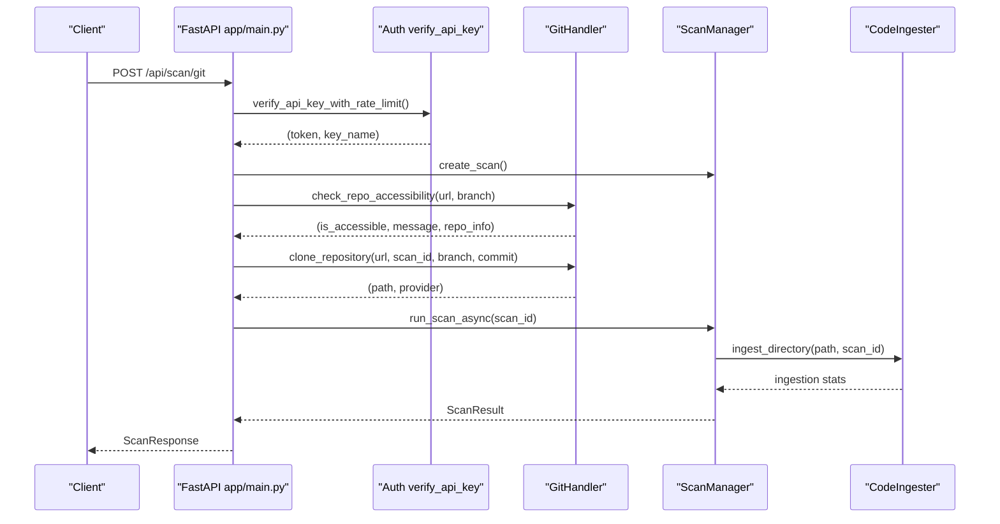
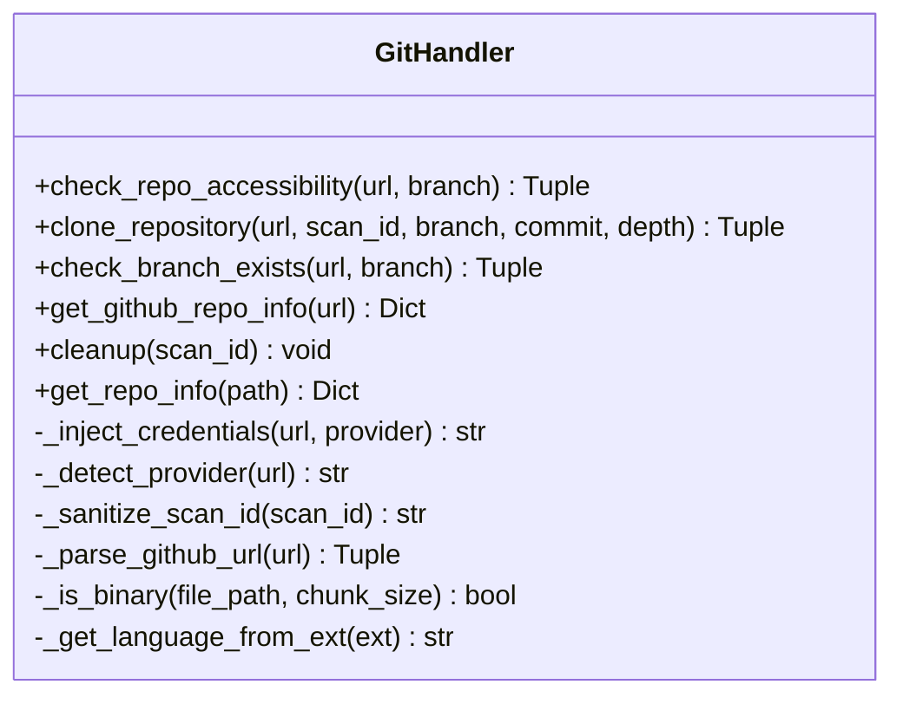
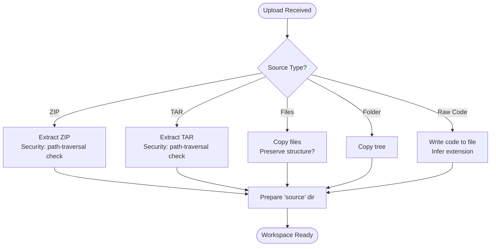
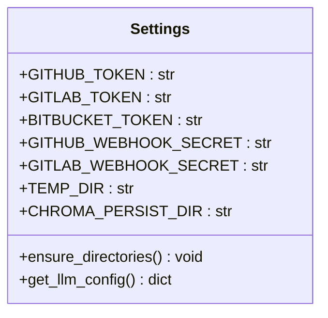
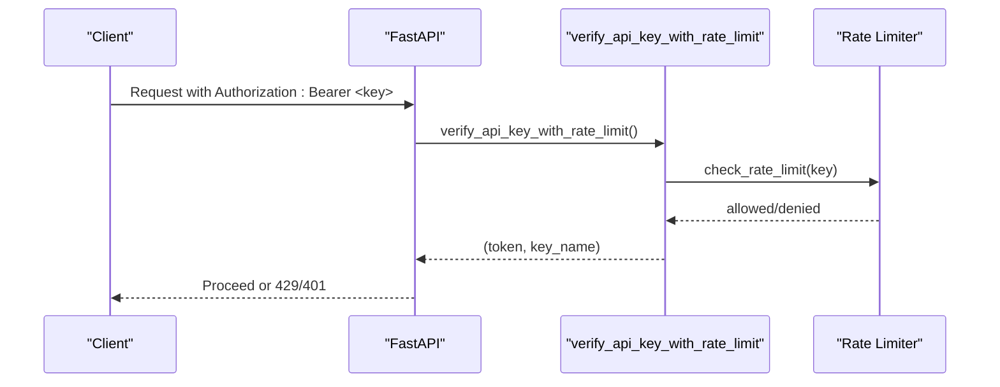
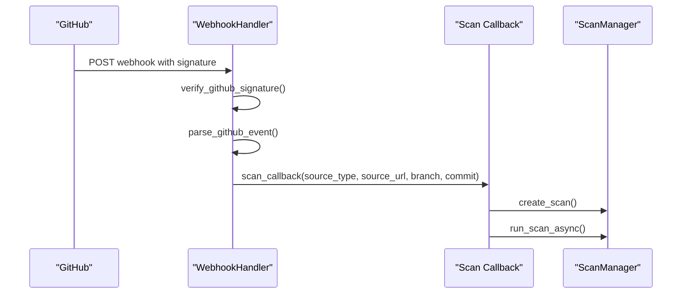
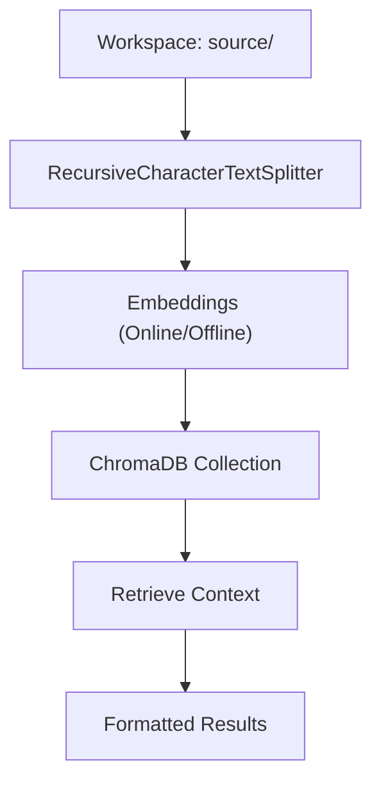
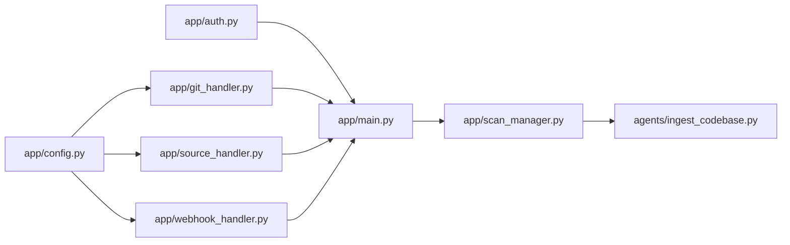

# Git Repository Handling

<cite>
**Referenced Files in This Document**
- [app/git_handler.py](file://app/git_handler.py)
- [app/source_handler.py](file://app/source_handler.py)
- [app/config.py](file://app/config.py)
- [app/auth.py](file://app/auth.py)
- [app/scan_manager.py](file://app/scan_manager.py)
- [app/main.py](file://app/main.py)
- [app/webhook_handler.py](file://app/webhook_handler.py)
- [agents/ingest_codebase.py](file://agents/ingest_codebase.py)
- [cli/autopov.py](file://cli/autopov.py)
- [tests/test_git_handler.py](file://tests/test_git_handler.py)
</cite>

## Table of Contents
1. [Introduction](#introduction)
2. [Project Structure](#project-structure)
3. [Core Components](#core-components)
4. [Architecture Overview](#architecture-overview)
5. [Detailed Component Analysis](#detailed-component-analysis)
6. [Dependency Analysis](#dependency-analysis)
7. [Performance Considerations](#performance-considerations)
8. [Troubleshooting Guide](#troubleshooting-guide)
9. [Conclusion](#conclusion)

## Introduction
This document explains AutoPoV’s Git repository handling system. It covers repository cloning, branch management, commit handling, repository validation, integration with Git providers, authentication, access control, preprocessing, dependency resolution, and workspace management. It also includes examples of repository access, branch selection, error handling scenarios, performance optimization, network considerations, and security best practices.

## Project Structure
The Git handling system spans several modules:
- Git provider integration and cloning: app/git_handler.py
- Alternative source handling (ZIP, files, raw paste): app/source_handler.py
- Configuration and environment variables: app/config.py
- Authentication and rate limiting: app/auth.py
- Scan orchestration and lifecycle: app/scan_manager.py
- API entry points and request flow: app/main.py
- Webhook triggers for provider events: app/webhook_handler.py
- Code ingestion and embedding for RAG: agents/ingest_codebase.py
- CLI integration: cli/autopov.py
- Unit tests: tests/test_git_handler.py

```mermaid
graph TB
subgraph "API Layer"
MAIN["app/main.py"]
AUTH["app/auth.py"]
CFG["app/config.py"]
end
subgraph "Repository Handling"
GH["app/git_handler.py"]
SH["app/source_handler.py"]
WH["app/webhook_handler.py"]
end
subgraph "Analysis Pipeline"
SM["app/scan_manager.py"]
CI["agents/ingest_codebase.py"]
end
subgraph "CLI"
CLI["cli/autopov.py"]
end
MAIN --> GH
MAIN --> SH
MAIN --> WH
MAIN --> AUTH
MAIN --> SM
SM --> CI
CLI --> MAIN
GH --> CFG
SH --> CFG
WH --> CFG
```

**Diagram sources**
- [app/main.py:203-285](file://app/main.py#L203-L285)
- [app/git_handler.py:199-294](file://app/git_handler.py#L199-L294)
- [app/source_handler.py:31-78](file://app/source_handler.py#L31-L78)
- [app/webhook_handler.py:196-336](file://app/webhook_handler.py#L196-L336)
- [app/scan_manager.py:234-365](file://app/scan_manager.py#L234-L365)
- [agents/ingest_codebase.py:207-313](file://agents/ingest_codebase.py#L207-L313)
- [app/config.py:64-67](file://app/config.py#L64-L67)
- [app/auth.py:192-236](file://app/auth.py#L192-L236)
- [cli/autopov.py:139-240](file://cli/autopov.py#L139-L240)

**Section sources**
- [app/git_handler.py:20-392](file://app/git_handler.py#L20-L392)
- [app/source_handler.py:18-382](file://app/source_handler.py#L18-L382)
- [app/config.py:13-255](file://app/config.py#L13-L255)
- [app/auth.py:192-256](file://app/auth.py#L192-L256)
- [app/scan_manager.py:47-663](file://app/scan_manager.py#L47-L663)
- [app/main.py:203-285](file://app/main.py#L203-L285)
- [app/webhook_handler.py:15-363](file://app/webhook_handler.py#L15-L363)
- [agents/ingest_codebase.py:41-413](file://agents/ingest_codebase.py#L41-L413)
- [cli/autopov.py:139-240](file://cli/autopov.py#L139-L240)

## Core Components
- GitHandler: Provides provider detection, credential injection, repository accessibility checks, branch verification, cloning with timeouts, commit checkout, and cleanup.
- SourceHandler: Handles ZIP/TAR uploads, file/folder uploads, raw code paste, and workspace extraction/cleanup.
- Config: Centralizes environment-driven settings including provider tokens, temp directories, and persistence paths.
- Auth: Enforces Bearer token authentication, admin-only endpoints, and rate limiting.
- ScanManager: Orchestrates scan lifecycle, background execution, logging, and result persistence.
- WebhookHandler: Validates provider webhooks and triggers scans automatically.
- CodeIngester: Performs code chunking, embedding, and ChromaDB storage for retrieval.

**Section sources**
- [app/git_handler.py:20-392](file://app/git_handler.py#L20-L392)
- [app/source_handler.py:18-382](file://app/source_handler.py#L18-L382)
- [app/config.py:64-142](file://app/config.py#L64-L142)
- [app/auth.py:192-256](file://app/auth.py#L192-L256)
- [app/scan_manager.py:74-114](file://app/scan_manager.py#L74-L114)
- [app/webhook_handler.py:15-363](file://app/webhook_handler.py#L15-L363)
- [agents/ingest_codebase.py:41-122](file://agents/ingest_codebase.py#L41-L122)

## Architecture Overview
The Git handling pipeline begins at the API layer, validates authentication and rate limits, checks repository accessibility, clones the repository (with optional branch/commit), and then runs the scan pipeline. Webhooks can trigger scans automatically from provider events.



**Diagram sources**
- [app/main.py:203-285](file://app/main.py#L203-L285)
- [app/auth.py:192-236](file://app/auth.py#L192-L236)
- [app/git_handler.py:155-294](file://app/git_handler.py#L155-L294)
- [app/scan_manager.py:234-365](file://app/scan_manager.py#L234-L365)
- [agents/ingest_codebase.py:207-313](file://agents/ingest_codebase.py#L207-L313)

## Detailed Component Analysis

### GitHandler: Cloning, Branching, Commit Handling, Validation
- Provider detection: Identifies GitHub, GitLab, Bitbucket, or unknown based on URL.
- Credential injection: Adds tokens to HTTPS URLs for GitHub (token), GitLab (oauth2:token), Bitbucket (x-token-auth:token).
- Accessibility checks: Queries GitHub API for existence, visibility, size, default branch, and language; validates branch availability; enforces size thresholds.
- Cloning: Uses subprocess with a Git CLI wrapper, supports branch and commit selection, shallow clone defaults, and removes .git directory post-clone.
- Commit handling: Checks out a specific commit if provided.
- Cleanup: Removes temporary cloned directories on failure or on demand.
- Info extraction: Walks the repository to compute total files, lines, and language distribution.



**Diagram sources**
- [app/git_handler.py:20-392](file://app/git_handler.py#L20-L392)

**Section sources**
- [app/git_handler.py:27-198](file://app/git_handler.py#L27-L198)
- [app/git_handler.py:199-294](file://app/git_handler.py#L199-L294)
- [app/git_handler.py:303-383](file://app/git_handler.py#L303-L383)

### SourceHandler: ZIP/TAR/File/Folder Uploads and Raw Paste
- ZIP/TAR extraction with path-traversal protection.
- File/folder upload with optional structure preservation.
- Raw code paste with language-aware filename inference.
- Workspace preparation and cleanup.
- Source info extraction mirroring GitHandler’s approach.



**Diagram sources**
- [app/source_handler.py:31-191](file://app/source_handler.py#L31-L191)
- [app/source_handler.py:193-232](file://app/source_handler.py#L193-L232)

**Section sources**
- [app/source_handler.py:31-191](file://app/source_handler.py#L31-L191)
- [app/source_handler.py:193-232](file://app/source_handler.py#L193-L232)
- [app/source_handler.py:275-372](file://app/source_handler.py#L275-L372)

### Configuration and Environment Variables
- Provider tokens: GITHUB_TOKEN, GITLAB_TOKEN, BITBUCKET_TOKEN.
- Webhook secrets: GITHUB_WEBHOOK_SECRET, GITLAB_WEBHOOK_SECRET.
- Temp directories and persistence paths for scans and embeddings.
- Model routing and LLM configuration for embeddings.



**Diagram sources**
- [app/config.py:64-142](file://app/config.py#L64-L142)
- [app/config.py:212-231](file://app/config.py#L212-L231)

**Section sources**
- [app/config.py:64-142](file://app/config.py#L64-L142)
- [app/config.py:212-231](file://app/config.py#L212-L231)

### Authentication and Access Control
- Bearer token authentication for all endpoints except health/config.
- Admin-only endpoints protected by admin key validation.
- Rate limiting per API key with configurable window and max scans.
- API key storage with HMAC-based comparisons and debounced disk writes.



**Diagram sources**
- [app/auth.py:192-236](file://app/auth.py#L192-L236)
- [app/auth.py:129-146](file://app/auth.py#L129-L146)

**Section sources**
- [app/auth.py:192-236](file://app/auth.py#L192-L236)
- [app/auth.py:129-146](file://app/auth.py#L129-L146)

### Webhook Integration
- GitHub: Signature verification using HMAC-SHA256 and webhook secret.
- GitLab: Token verification using HMAC comparison.
- Event parsing: Push and pull/merge request events; extracts repo URL, branch, commit, and triggers scan when applicable.
- Callback registration: Integrates with ScanManager to start scans asynchronously.



**Diagram sources**
- [app/webhook_handler.py:196-266](file://app/webhook_handler.py#L196-L266)
- [app/webhook_handler.py:75-133](file://app/webhook_handler.py#L75-L133)
- [app/main.py:134-172](file://app/main.py#L134-L172)

**Section sources**
- [app/webhook_handler.py:25-74](file://app/webhook_handler.py#L25-L74)
- [app/webhook_handler.py:196-336](file://app/webhook_handler.py#L196-L336)
- [app/main.py:134-172](file://app/main.py#L134-L172)

### Code Ingestion and Workspace Management
- CodeIngester performs recursive chunking, language detection, embedding generation, and ChromaDB persistence.
- Supports online (OpenRouter/OpenAI) and offline (HuggingFace) embeddings.
- Cleans up collections per scan to avoid cross-contamination.
- ScanManager coordinates ingestion and manages scan state, logs, and results.



**Diagram sources**
- [agents/ingest_codebase.py:50-122](file://agents/ingest_codebase.py#L50-L122)
- [agents/ingest_codebase.py:207-313](file://agents/ingest_codebase.py#L207-L313)
- [agents/ingest_codebase.py:315-358](file://agents/ingest_codebase.py#L315-L358)
- [app/scan_manager.py:334-335](file://app/scan_manager.py#L334-L335)

**Section sources**
- [agents/ingest_codebase.py:50-122](file://agents/ingest_codebase.py#L50-L122)
- [agents/ingest_codebase.py:207-358](file://agents/ingest_codebase.py#L207-L358)
- [app/scan_manager.py:234-335](file://app/scan_manager.py#L234-L335)

### CLI Integration
- The CLI supports scanning Git repositories, ZIP files, and directories, and can optionally wait for results and display them.
- It interacts with the API server, handles authentication, and streams results.

**Section sources**
- [cli/autopov.py:139-240](file://cli/autopov.py#L139-L240)
- [cli/autopov.py:411-426](file://cli/autopov.py#L411-L426)

## Dependency Analysis
- GitHandler depends on Config for tokens and temp directories, and uses GitPython and subprocess for operations.
- SourceHandler depends on Config for temp directories and security checks for archives.
- Auth provides shared dependencies for API endpoints.
- ScanManager orchestrates GitHandler and SourceHandler outputs and coordinates ingestion.
- WebhookHandler depends on Config for secrets and registers callbacks with ScanManager.
- CodeIngester depends on Config for embeddings and ChromaDB settings.



**Diagram sources**
- [app/config.py:64-142](file://app/config.py#L64-L142)
- [app/git_handler.py:17-25](file://app/git_handler.py#L17-L25)
- [app/source_handler.py:15-23](file://app/source_handler.py#L15-L23)
- [app/webhook_handler.py:12-19](file://app/webhook_handler.py#L12-L19)
- [app/auth.py:19-22](file://app/auth.py#L19-L22)
- [app/main.py:21-27](file://app/main.py#L21-L27)
- [app/scan_manager.py:18-20](file://app/scan_manager.py#L18-L20)
- [agents/ingest_codebase.py:33-49](file://agents/ingest_codebase.py#L33-L49)

**Section sources**
- [app/git_handler.py:17-25](file://app/git_handler.py#L17-L25)
- [app/source_handler.py:15-23](file://app/source_handler.py#L15-L23)
- [app/webhook_handler.py:12-19](file://app/webhook_handler.py#L12-L19)
- [app/scan_manager.py:18-20](file://app/scan_manager.py#L18-L20)
- [agents/ingest_codebase.py:33-49](file://agents/ingest_codebase.py#L33-L49)

## Performance Considerations
- Shallow clone defaults reduce bandwidth and disk usage; adjust depth as needed.
- Timeout-based subprocess clone prevents hangs on large repositories.
- Repository size checks enable early rejection for very large repositories.
- Ingestion batching reduces embedding overhead; tune batch sizes for memory constraints.
- ChromaDB persistent storage avoids recomputation across scans.
- Rate limiting protects backend resources from abuse.

[No sources needed since this section provides general guidance]

## Troubleshooting Guide
Common scenarios and resolutions:
- Authentication failures: Ensure provider tokens are set in environment variables and match provider requirements.
- Private repository access: Configure the appropriate provider token; otherwise, access is denied.
- Branch not found: Use a valid branch name; the system checks branch existence and suggests alternatives.
- Network errors: Verify connectivity; the system distinguishes DNS/network vs. permission errors.
- Large repository timeouts: Reduce repository scope or use ZIP upload for targeted scanning.
- Path traversal in archives: SourceHandler enforces checks; ensure archives are trusted.
- Webhook signature/token mismatches: Confirm webhook secrets are configured and signatures match.

**Section sources**
- [app/git_handler.py:263-274](file://app/git_handler.py#L263-L274)
- [app/git_handler.py:170-186](file://app/git_handler.py#L170-L186)
- [app/source_handler.py:57-61](file://app/source_handler.py#L57-L61)
- [app/webhook_handler.py:40-55](file://app/webhook_handler.py#L40-L55)
- [app/webhook_handler.py:70-73](file://app/webhook_handler.py#L70-L73)

## Conclusion
AutoPoV’s Git repository handling system integrates provider-aware cloning, robust validation, secure authentication, and flexible workspace management. It supports automated triggers via webhooks, efficient preprocessing with code ingestion, and scalable orchestration through ScanManager. By following the security and performance recommendations herein, operators can reliably scan repositories while maintaining system stability and protecting sensitive credentials.