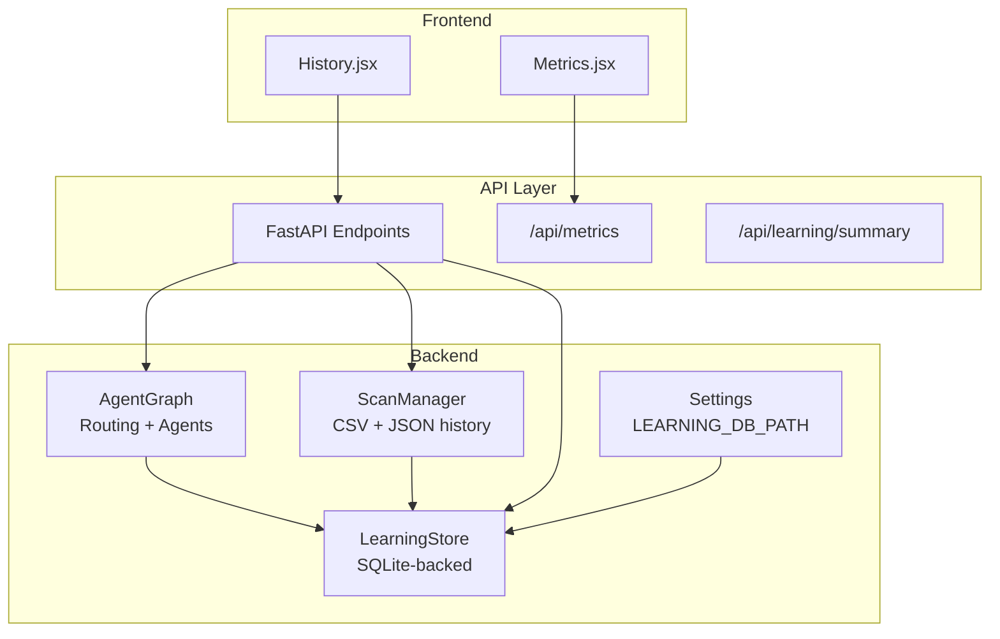
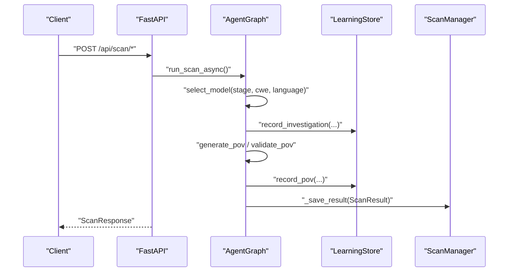
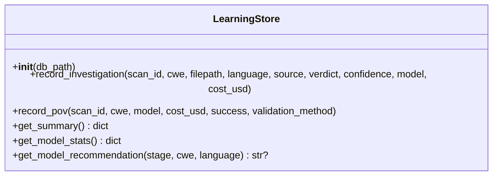
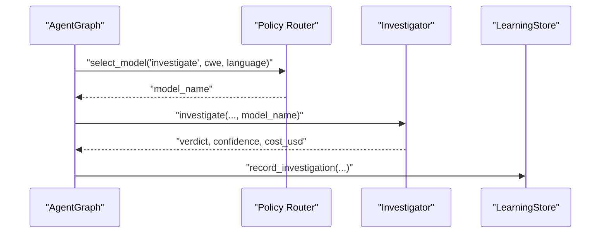
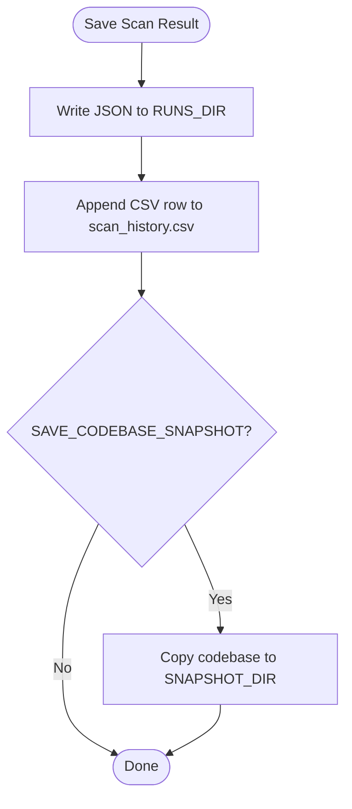
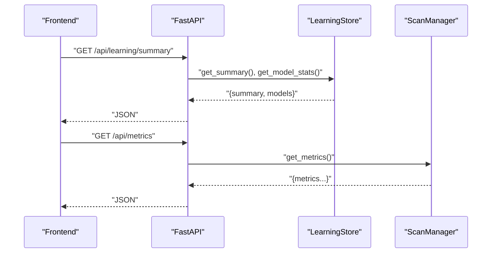
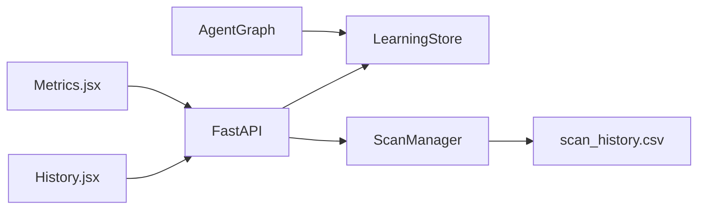

# Learning Store

<cite>
**Referenced Files in This Document**
- [learning_store.py](file://app/learning_store.py)
- [main.py](file://app/main.py)
- [config.py](file://app/config.py)
- [scan_manager.py](file://app/scan_manager.py)
- [agent_graph.py](file://app/agent_graph.py)
- [report_generator.py](file://app/report_generator.py)
- [Metrics.jsx](file://frontend/src/pages/Metrics.jsx)
- [History.jsx](file://frontend/src/pages/History.jsx)
- [scan_history.csv](file://results/runs/scan_history.csv)
</cite>

## Table of Contents
1. [Introduction](#introduction)
2. [Project Structure](#project-structure)
3. [Core Components](#core-components)
4. [Architecture Overview](#architecture-overview)
5. [Detailed Component Analysis](#detailed-component-analysis)
6. [Dependency Analysis](#dependency-analysis)
7. [Performance Considerations](#performance-considerations)
8. [Troubleshooting Guide](#troubleshooting-guide)
9. [Conclusion](#conclusion)

## Introduction
This document describes AutoPoV's Learning Store system, which persists scan outcomes to support model routing and self-improvement. It covers performance tracking, model evaluation metrics, historical data management, learning algorithms, performance scoring, statistical analysis, data persistence/query interfaces, reporting features, and integration with the adaptive routing system. It also includes practical workflows for performance monitoring, trend analysis, and model comparison, along with data retention and storage optimization strategies.

## Project Structure
The Learning Store is implemented as a SQLite-backed persistence layer integrated into the AutoPoV backend. It records investigation outcomes and Proof-of-Vulnerability (PoV) runs, aggregates performance statistics, and exposes endpoints for metrics and summaries. The system integrates with the agent graph for model selection and with the scan manager for historical data and cleanup.

**Diagram sources**
- [learning_store.py:14-256](file://app/learning_store.py#L14-L256)
- [scan_manager.py:47-663](file://app/scan_manager.py#L47-L663)
- [agent_graph.py:82-168](file://app/agent_graph.py#L82-L168)
- [main.py:745-758](file://app/main.py#L745-L758)
- [config.py:44-44](file://app/config.py#L44-L44)

**Section sources**
- [learning_store.py:14-256](file://app/learning_store.py#L14-L256)
- [main.py:745-758](file://app/main.py#L745-L758)
- [config.py:44-44](file://app/config.py#L44-L44)

## Core Components
- LearningStore: SQLite-backed persistence for investigation outcomes and PoV runs; provides summary and model performance statistics; offers model recommendation scoring.
- ScanManager: Manages scan lifecycle, persists results to JSON and CSV, maintains history, and computes system-wide metrics.
- AgentGraph: Orchestrates vulnerability detection and integrates model selection via policy router; records investigation outcomes into the Learning Store.
- FastAPI endpoints: Expose learning summary and system metrics; integrate with frontend pages for visualization.

Key responsibilities:
- Performance tracking: cost, success/failure counts, and aggregated statistics.
- Model evaluation: per-model confirm rates, success rates, and cost efficiency scores.
- Historical data management: CSV/JSON persistence, pagination, and cleanup.
- Reporting: JSON/PDF reports with metrics and PoV summaries.

**Section sources**
- [learning_store.py:14-256](file://app/learning_store.py#L14-L256)
- [scan_manager.py:47-663](file://app/scan_manager.py#L47-L663)
- [agent_graph.py:691-777](file://app/agent_graph.py#L691-L777)
- [main.py:745-758](file://app/main.py#L745-L758)

## Architecture Overview
The Learning Store sits alongside the agent graph and scan manager, persisting outcomes and enabling adaptive routing decisions. The API layer exposes endpoints for metrics and learning summaries, while the frontend renders dashboards for system health, metrics, and history.

**Diagram sources**
- [agent_graph.py:691-777](file://app/agent_graph.py#L691-L777)
- [learning_store.py:61-124](file://app/learning_store.py#L61-L124)
- [scan_manager.py:367-402](file://app/scan_manager.py#L367-L402)
- [main.py:204-401](file://app/main.py#L204-L401)

## Detailed Component Analysis

### LearningStore: Persistence, Metrics, and Recommendations
- Tables:
  - investigations: captures per-investigation verdicts, confidence, model, cost, and metadata.
  - pov_runs: captures per-PoV run success, validation method, and cost.
- Methods:
  - record_investigation: inserts investigation outcome with timestamp.
  - record_pov: inserts PoV run outcome with timestamp.
  - get_summary: totals and sums costs across investigations and PoV runs.
  - get_model_stats: aggregates per-model confirm rates and success rates, average confidence, and total cost.
  - get_model_recommendation: selects best model using confirmed/(cost+epsilon) score, optionally filtered by CWE and language.

Performance scoring rationale:
- Confirmed/(cost + epsilon) balances effectiveness and cost-efficiency.
- Filters allow stage-specific recommendations and cross-cutting analytics.

**Diagram sources**
- [learning_store.py:14-256](file://app/learning_store.py#L14-L256)

**Section sources**
- [learning_store.py:25-140](file://app/learning_store.py#L25-L140)
- [learning_store.py:142-186](file://app/learning_store.py#L142-L186)
- [learning_store.py:188-248](file://app/learning_store.py#L188-L248)

### AgentGraph Integration and Model Evaluation
- During investigation, AgentGraph selects a model via policy router and records outcomes into the Learning Store.
- During PoV generation/validation, AgentGraph records PoV outcomes.
- This enables:
  - Per-model performance tracking (investigation confirm rate, PoV success rate).
  - Cost attribution per finding and per model.
  - Adaptive routing based on historical performance.

**Diagram sources**
- [agent_graph.py:708-777](file://app/agent_graph.py#L708-L777)
- [learning_store.py:61-94](file://app/learning_store.py#L61-L94)

**Section sources**
- [agent_graph.py:691-777](file://app/agent_graph.py#L691-L777)
- [learning_store.py:61-94](file://app/learning_store.py#L61-L94)

### ScanManager: Historical Data Management and Metrics
- Persists each scan result as JSON and appends a CSV row to scan_history.csv.
- Provides:
  - get_scan_history: paginated CSV-based history.
  - get_metrics: computed system-wide metrics from CSV.
  - cleanup_old_results: removes old result files and rebuilds CSV.

**Diagram sources**
- [scan_manager.py:367-418](file://app/scan_manager.py#L367-L418)

**Section sources**
- [scan_manager.py:460-481](file://app/scan_manager.py#L460-L481)
- [scan_manager.py:604-653](file://app/scan_manager.py#L604-L653)
- [scan_manager.py:512-561](file://app/scan_manager.py#L512-L561)

### API Endpoints and Frontend Integration
- /api/learning/summary: returns LearningStore.get_summary() and get_model_stats().
- /api/metrics: returns ScanManager.get_metrics().
- Frontend pages:
  - Metrics.jsx: fetches metrics and health, displays system statistics.
  - History.jsx: paginates scan history from API.

**Diagram sources**
- [main.py:745-758](file://app/main.py#L745-L758)
- [learning_store.py:126-186](file://app/learning_store.py#L126-L186)
- [scan_manager.py:604-653](file://app/scan_manager.py#L604-L653)
- [Metrics.jsx:28-51](file://frontend/src/pages/Metrics.jsx#L28-L51)

**Section sources**
- [main.py:745-758](file://app/main.py#L745-L758)
- [Metrics.jsx:28-51](file://frontend/src/pages/Metrics.jsx#L28-L51)
- [History.jsx:17-40](file://frontend/src/pages/History.jsx#L17-L40)

## Dependency Analysis
- LearningStore depends on:
  - SQLite for persistence.
  - Settings.LEARNING_DB_PATH for storage location.
- AgentGraph depends on:
  - Policy router for model selection.
  - LearningStore for recording outcomes.
- ScanManager depends on:
  - CSV/JSON files for history and metrics.
  - Settings for directories and flags.
- API layer depends on:
  - LearningStore and ScanManager for data.
  - Frontend pages for rendering.

**Diagram sources**
- [agent_graph.py:20-28](file://app/agent_graph.py#L20-L28)
- [learning_store.py:17-20](file://app/learning_store.py#L17-L20)
- [scan_manager.py:374-401](file://app/scan_manager.py#L374-L401)
- [main.py:745-758](file://app/main.py#L745-L758)

**Section sources**
- [agent_graph.py:20-28](file://app/agent_graph.py#L20-L28)
- [learning_store.py:17-20](file://app/learning_store.py#L17-L20)
- [scan_manager.py:374-401](file://app/scan_manager.py#L374-L401)
- [main.py:745-758](file://app/main.py#L745-L758)

## Performance Considerations
- Storage efficiency:
  - SQLite is lightweight and suitable for small-to-medium workloads.
  - Consider WAL mode and periodic vacuum for large datasets.
- Query performance:
  - Add indexes on frequently filtered columns (e.g., cwe, language, model).
  - Use LIMIT/OFFSET for paginated model stats and summaries.
- Cost tracking:
  - Ensure cost_usd is recorded per finding to enable accurate scoring.
- Cleanup:
  - Use ScanManager.cleanup_old_results to cap storage growth.

[No sources needed since this section provides general guidance]

## Troubleshooting Guide
Common issues and resolutions:
- LearningStore initialization failures:
  - Verify LEARNING_DB_PATH directory exists and is writable.
  - Check SQLite connectivity and permissions.
- Missing model recommendations:
  - Ensure investigations and PoV runs are recorded with valid model names and costs.
  - Confirm stage parameter is "investigate" or "pov".
- Empty metrics:
  - Confirm scan_history.csv exists and contains recent entries.
  - Trigger cleanup to rebuild CSV if corrupted.
- Frontend not displaying metrics:
  - Ensure /api/metrics and /api/learning/summary are reachable.
  - Check CORS and authentication headers.

**Section sources**
- [config.py:44-44](file://app/config.py#L44-L44)
- [scan_manager.py:563-561](file://app/scan_manager.py#L563-L561)
- [main.py:745-758](file://app/main.py#L745-L758)

## Conclusion
AutoPoV’s Learning Store provides a compact yet powerful mechanism for tracking model performance, guiding adaptive routing, and enabling historical analysis. Combined with ScanManager’s CSV/JSON persistence and the API layer’s metrics endpoints, it supports robust performance monitoring, trend analysis, and model comparison workflows. Proper indexing, periodic cleanup, and consistent cost attribution are essential for sustained performance and scalability.