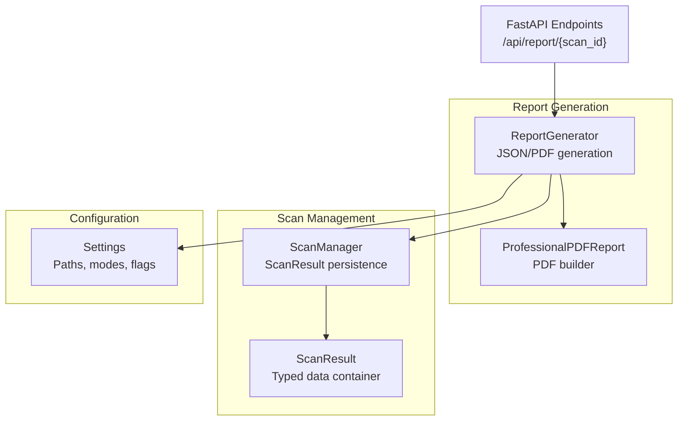
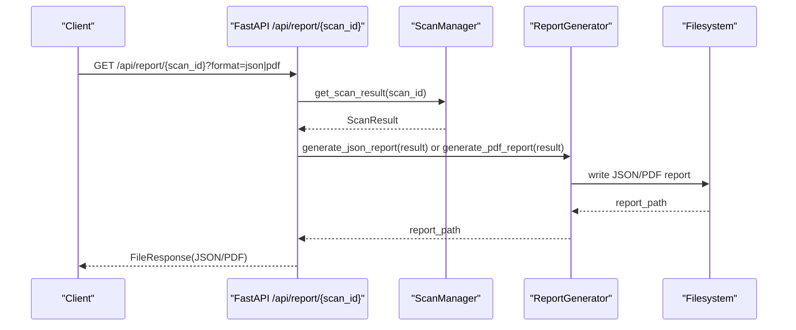
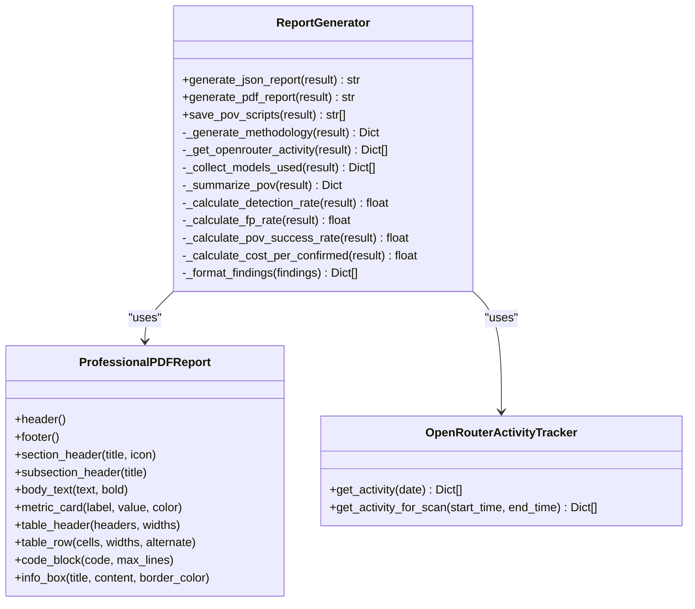
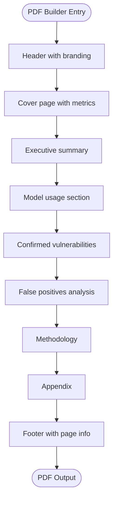
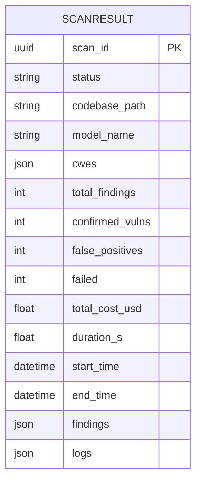
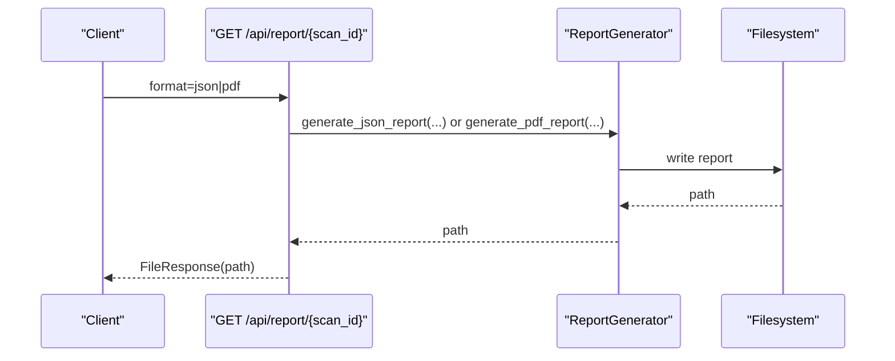
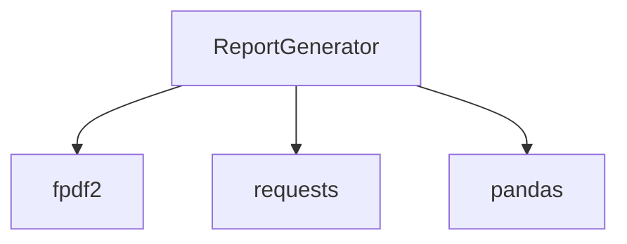

# Report Generation

<cite>
**Referenced Files in This Document**
- [report_generator.py](file://app/report_generator.py)
- [scan_manager.py](file://app/scan_manager.py)
- [config.py](file://app/config.py)
- [main.py](file://app/main.py)
- [6d33a438-843c-45f9-baa7-f40a3f549962.json](file://results/runs/6d33a438-843c-45f9-baa7-f40a3f549962.json)
- [6d33a438-843c-45f9-baa7-f40a3f549962_report.json](file://results/6d33a438-843c-45f9-baa7-f40a3f549962_report.json)
- [requirements.txt](file://requirements.txt)
</cite>

## Table of Contents
1. [Introduction](#introduction)
2. [Project Structure](#project-structure)
3. [Core Components](#core-components)
4. [Architecture Overview](#architecture-overview)
5. [Detailed Component Analysis](#detailed-component-analysis)
6. [Dependency Analysis](#dependency-analysis)
7. [Performance Considerations](#performance-considerations)
8. [Troubleshooting Guide](#troubleshooting-guide)
9. [Conclusion](#conclusion)
10. [Appendices](#appendices)

## Introduction
This document explains AutoPoV’s report generation system, covering JSON and PDF report creation, template management, and output formatting. It details the report data structure, finding aggregation, visualization components, integration with scan results, customization options, export mechanisms, and operational workflows. It also provides guidance on performance optimization, memory management, and scalability considerations for report generation.

## Project Structure
The report generation system spans three primary modules:
- Report generation: builds structured JSON and PDF reports from scan results.
- Scan management: persists scan results and findings to disk and maintains metadata.
- Configuration: centralizes settings for report paths, model modes, and tool availability.

**Diagram sources**
- [report_generator.py:200-830](file://app/report_generator.py#L200-L830)
- [scan_manager.py:23-459](file://app/scan_manager.py#L23-L459)
- [config.py:13-255](file://app/config.py#L13-L255)
- [main.py:598-644](file://app/main.py#L598-L644)

**Section sources**
- [report_generator.py:1-830](file://app/report_generator.py#L1-L830)
- [scan_manager.py:1-663](file://app/scan_manager.py#L1-L663)
- [config.py:1-255](file://app/config.py#L1-L255)
- [main.py:598-644](file://app/main.py#L598-L644)

## Core Components
- ReportGenerator: orchestrates JSON and PDF report creation, metrics computation, and formatting.
- ProfessionalPDFReport: PDF builder with branded sections, tables, code blocks, and info boxes.
- ScanManager: persists ScanResult instances to JSON and CSV, enabling downstream report generation.
- Settings: provides runtime configuration for report paths, model modes, and tool availability.

Key responsibilities:
- JSON report: normalized findings, metrics, methodology, and model usage.
- PDF report: branded, paginated, and structured sections for executive summary, confirmed vulnerabilities, false positives, methodology, and appendix.
- Export endpoints: serve JSON or PDF attachments via FastAPI.

**Section sources**
- [report_generator.py:200-830](file://app/report_generator.py#L200-L830)
- [scan_manager.py:23-459](file://app/scan_manager.py#L23-L459)
- [config.py:136-146](file://app/config.py#L136-L146)
- [main.py:598-644](file://app/main.py#L598-L644)

## Architecture Overview
The report generation pipeline integrates with the scan lifecycle and exposes REST endpoints for retrieval.

**Diagram sources**
- [main.py:598-644](file://app/main.py#L598-L644)
- [scan_manager.py:449-459](file://app/scan_manager.py#L449-L459)
- [report_generator.py:209-262](file://app/report_generator.py#L209-L262)

## Detailed Component Analysis

### ReportGenerator
Responsibilities:
- Build JSON report with metadata, scan summary, model usage, metrics, findings, and methodology.
- Build PDF report with branded sections, tables, code blocks, and info boxes.
- Compute metrics (detection rate, false positive rate, PoV success rate, cost per confirmed).
- Summarize PoV generation/validation outcomes.
- Collect model usage across investigation and PoV generation roles.
- Save PoV scripts to files for distribution.

**Diagram sources**
- [report_generator.py:200-830](file://app/report_generator.py#L200-L830)

**Section sources**
- [report_generator.py:200-830](file://app/report_generator.py#L200-L830)

### ProfessionalPDFReport
Features:
- Branded header/footer with tool version and timestamps.
- Section/subsection headers with styling.
- Metric cards for key counts.
- Styled tables for model usage and scan configuration.
- Code blocks with syntax-like styling and truncation.
- Info boxes for explanatory content.

**Diagram sources**
- [report_generator.py:264-610](file://app/report_generator.py#L264-L610)

**Section sources**
- [report_generator.py:29-142](file://app/report_generator.py#L29-L142)

### ScanResult and Persistence
ScanManager persists each scan as:
- JSON: a ScanResult instance serialized to results/runs/{scan_id}.json.
- CSV: aggregated metrics appended to results/runs/scan_history.csv.

**Diagram sources**
- [scan_manager.py:23-41](file://app/scan_manager.py#L23-L41)

**Section sources**
- [scan_manager.py:367-418](file://app/scan_manager.py#L367-L418)

### Report Data Structure
The JSON report consolidates:
- report_metadata: tool, version, generation timestamp, report type.
- scan_summary: scan identity, status, codebase path, timing, configuration flags.
- model_usage: models used, roles, costs, and optional OpenRouter activity.
- metrics: totals, rates, PoV summary, and cost per confirmed.
- findings: normalized list of findings with verdict, confidence, explanations, code chunks, PoV metadata, and validation results.
- methodology: configuration, process steps, and metric definitions.

Example fields are visible in the sample run and report files.

**Section sources**
- [report_generator.py:209-262](file://app/report_generator.py#L209-L262)
- [6d33a438-843c-45f9-baa7-f40a3f549962.json:1-254](file://results/runs/6d33a438-843c-45f9-baa7-f40a3f549962.json#L1-L254)
- [6d33a438-843c-45f9-baa7-f40a3f549962_report.json:1-192](file://results/6d33a438-843c-45f9-baa7-f40a3f549962_report.json#L1-L192)

### Export Endpoints and Distribution
FastAPI exposes a single endpoint to fetch reports in either JSON or PDF format. The endpoint:
- Validates scan existence.
- Delegates to ReportGenerator to build the appropriate report.
- Returns a FileResponse with appropriate headers for download.

**Diagram sources**
- [main.py:598-644](file://app/main.py#L598-L644)
- [report_generator.py:209-262](file://app/report_generator.py#L209-L262)

**Section sources**
- [main.py:598-644](file://app/main.py#L598-L644)

### Customization Examples
- Change report format: select JSON or PDF via the format query parameter.
- Customize model usage visibility: enable/disable OpenRouter activity tracking by setting the API key and model mode.
- Adjust PDF content: modify ProfessionalPDFReport methods to change styling, sections, or layout.
- Control output paths: configure REPORTS_DIR and POVS_DIR via Settings.

**Section sources**
- [main.py:602-636](file://app/main.py#L602-L636)
- [config.py:136-146](file://app/config.py#L136-L146)
- [report_generator.py:200-208](file://app/report_generator.py#L200-L208)

### Batch Processing and Replay Workflows
- Replay scans: the system supports replaying findings against multiple models, enabling batch report generation for comparative analysis.
- Snapshot reuse: when a codebase is not available, the system can use stored snapshots for replay-based scans.

**Section sources**
- [main.py:404-491](file://app/main.py#L404-L491)
- [scan_manager.py:403-418](file://app/scan_manager.py#L403-L418)

## Dependency Analysis
External dependencies used by the report generation system:
- fpdf2: PDF rendering.
- pandas: tabular data formatting (used in the project; ReportGenerator leverages it indirectly for table-like structures).
- requests: OpenRouter activity tracking.

**Diagram sources**
- [requirements.txt:27-29](file://requirements.txt#L27-L29)
- [report_generator.py:17-21](file://app/report_generator.py#L17-L21)

**Section sources**
- [requirements.txt:1-44](file://requirements.txt#L1-L44)
- [report_generator.py:17-21](file://app/report_generator.py#L17-L21)

## Performance Considerations
- PDF generation:
  - Use ProfessionalPDFReport’s built-in pagination and page break logic to avoid oversized pages.
  - Limit code block lines to reduce rendering overhead.
  - Avoid excessive table rows; consider truncation or pagination for large datasets.
- JSON report:
  - Normalize findings to minimize redundant fields.
  - Serialize only necessary metadata to reduce file size.
- Memory management:
  - Stream large outputs when feasible.
  - Avoid loading entire reports into memory unnecessarily; write incrementally where possible.
- Scalability:
  - Offload report generation to background tasks or queues for high-throughput scenarios.
  - Cache frequently accessed report artifacts when safe and appropriate.
  - Monitor disk usage; leverage cleanup policies similar to ScanManager’s cleanup_old_results.

[No sources needed since this section provides general guidance]

## Troubleshooting Guide
Common issues and resolutions:
- Missing fpdf2: The PDF generator raises an error if fpdf2 is unavailable. Install it via requirements.txt.
- Missing OpenRouter API key: OpenRouter activity will be empty; model usage will reflect internal tracking only.
- Empty findings: Ensure the scan completed successfully and findings are populated in ScanResult.
- Large PDFs: Reduce code block lengths or paginate content to fit within page limits.
- Disk space: Use cleanup endpoints to remove old results and rebuild CSV history.

**Section sources**
- [report_generator.py:266-267](file://app/report_generator.py#L266-L267)
- [report_generator.py:659-668](file://app/report_generator.py#L659-L668)
- [scan_manager.py:512-561](file://app/scan_manager.py#L512-L561)

## Conclusion
AutoPoV’s report generation system provides robust, standardized JSON and PDF outputs from scan results. It normalizes findings, computes actionable metrics, and offers customizable export formats. By leveraging ScanManager’s persistence and Settings’ configuration, teams can integrate report generation into automated workflows, scale across multiple scans, and distribute reports efficiently.

[No sources needed since this section summarizes without analyzing specific files]

## Appendices

### API Definition: Report Retrieval
- Endpoint: GET /api/report/{scan_id}
- Query parameters:
  - format: json or pdf
- Response:
  - JSON: application/json attachment
  - PDF: application/pdf attachment
- Errors:
  - 404: scan not found
  - 400: invalid format
  - 500: report generation failure

**Section sources**
- [main.py:598-644](file://app/main.py#L598-L644)

### Sample Data References
- Scan result JSON: [6d33a438-843c-45f9-baa7-f40a3f549962.json:1-254](file://results/runs/6d33a438-843c-45f9-baa7-f40a3f549962.json#L1-L254)
- Report JSON: [6d33a438-843c-45f9-baa7-f40a3f549962_report.json:1-192](file://results/6d33a438-843c-45f9-baa7-f40a3f549962_report.json#L1-L192)

**Section sources**
- [6d33a438-843c-45f9-baa7-f40a3f549962.json:1-254](file://results/runs/6d33a438-843c-45f9-baa7-f40a3f549962.json#L1-L254)
- [6d33a438-843c-45f9-baa7-f40a3f549962_report.json:1-192](file://results/6d33a438-843c-45f9-baa7-f40a3f549962_report.json#L1-L192)