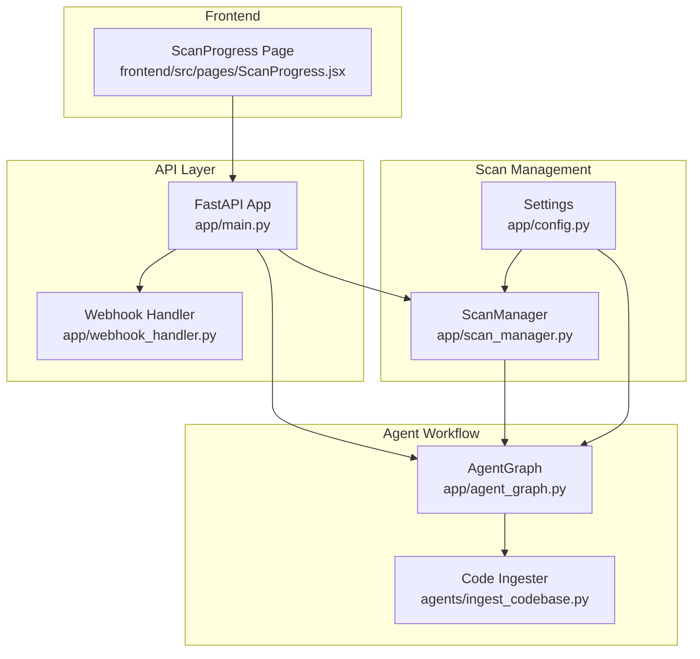
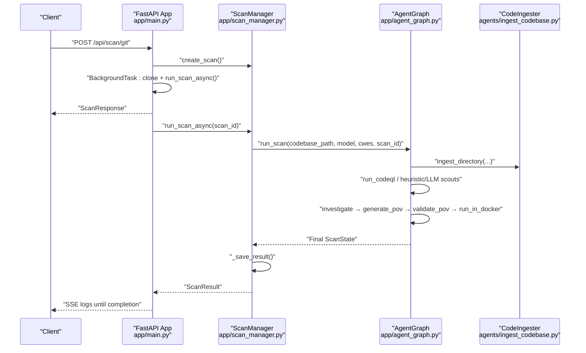
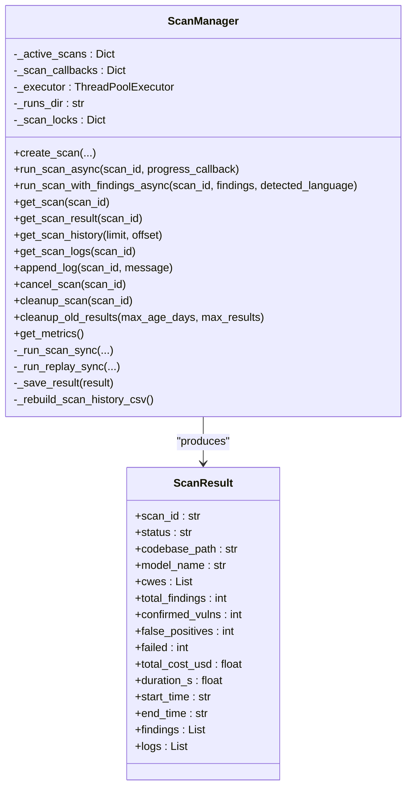
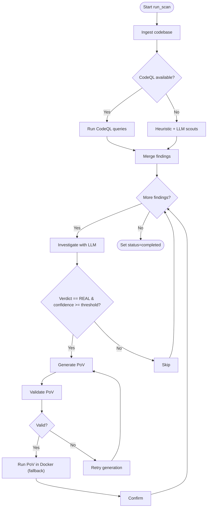
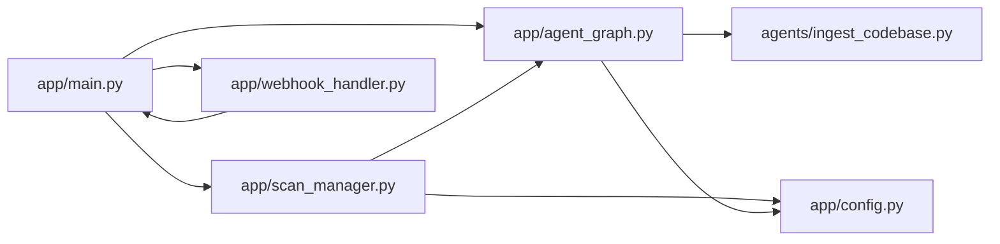

# Scan Management

<cite>
**Referenced Files in This Document**
- [app/scan_manager.py](file://app/scan_manager.py)
- [app/main.py](file://app/main.py)
- [app/agent_graph.py](file://app/agent_graph.py)
- [app/config.py](file://app/config.py)
- [agents/ingest_codebase.py](file://agents/ingest_codebase.py)
- [app/webhook_handler.py](file://app/webhook_handler.py)
- [frontend/src/pages/ScanProgress.jsx](file://frontend/src/pages/ScanProgress.jsx)
- [monitor_scan.py](file://monitor_scan.py)
- [check_scan.py](file://check_scan.py)
</cite>

## Table of Contents
1. [Introduction](#introduction)
2. [Project Structure](#project-structure)
3. [Core Components](#core-components)
4. [Architecture Overview](#architecture-overview)
5. [Detailed Component Analysis](#detailed-component-analysis)
6. [Dependency Analysis](#dependency-analysis)
7. [Performance Considerations](#performance-considerations)
8. [Troubleshooting Guide](#troubleshooting-guide)
9. [Conclusion](#conclusion)
10. [Appendices](#appendices)

## Introduction
This document explains AutoPoV’s scan management system: how scans are created, scheduled, executed, monitored, and cleaned up; how state is persisted and concurrently managed; and how the system integrates with the agent graph, result aggregation, and error recovery mechanisms. It also covers scheduling examples, progress tracking, resource management, performance optimization, memory management, and scalability for multiple concurrent scans.

## Project Structure
The scan management system spans several modules:
- API entrypoint and orchestration: FastAPI endpoints in the main application
- Scan lifecycle and persistence: ScanManager singleton managing state, logs, and results
- Agent graph workflow: LangGraph-based orchestration of vulnerability detection and PoV generation
- Code ingestion: Vector store ingestion and cleanup
- Configuration: Environment-driven settings and tool availability checks
- Webhooks: Automated triggering of scans from Git providers
- Frontend: Real-time progress and logs via polling and Server-Sent Events (SSE)

**Diagram sources**
- [app/main.py:114-122](file://app/main.py#L114-L122)
- [app/scan_manager.py:47-72](file://app/scan_manager.py#L47-L72)
- [app/agent_graph.py:82-168](file://app/agent_graph.py#L82-L168)
- [agents/ingest_codebase.py:41-121](file://agents/ingest_codebase.py#L41-L121)
- [app/webhook_handler.py:15-24](file://app/webhook_handler.py#L15-L24)
- [frontend/src/pages/ScanProgress.jsx:16-79](file://frontend/src/pages/ScanProgress.jsx#L16-L79)

**Section sources**
- [app/main.py:114-122](file://app/main.py#L114-L122)
- [app/scan_manager.py:47-72](file://app/scan_manager.py#L47-L72)
- [app/agent_graph.py:82-168](file://app/agent_graph.py#L82-L168)
- [agents/ingest_codebase.py:41-121](file://agents/ingest_codebase.py#L41-L121)
- [app/webhook_handler.py:15-24](file://app/webhook_handler.py#L15-L24)
- [frontend/src/pages/ScanProgress.jsx:16-79](file://frontend/src/pages/ScanProgress.jsx#L16-L79)

## Core Components
- ScanManager: Singleton orchestrator for scan lifecycle, concurrency control, persistence, and cleanup. Provides thread-safe log appending and async execution via a thread pool.
- AgentGraph: LangGraph workflow implementing the vulnerability detection pipeline, including code ingestion, CodeQL analysis, investigation, PoV generation/validation, and Docker-based execution.
- CodeIngester: Manages code chunking, embeddings, ChromaDB collections per scan, and cleanup.
- Settings: Centralized configuration for models, tools, directories, and availability checks.
- WebhookHandler: Validates and parses provider webhooks, triggers scans via callback registration.
- Frontend ScanProgress: Real-time monitoring via polling and SSE.

**Section sources**
- [app/scan_manager.py:47-663](file://app/scan_manager.py#L47-L663)
- [app/agent_graph.py:82-1225](file://app/agent_graph.py#L82-L1225)
- [agents/ingest_codebase.py:41-413](file://agents/ingest_codebase.py#L41-L413)
- [app/config.py:13-255](file://app/config.py#L13-L255)
- [app/webhook_handler.py:15-363](file://app/webhook_handler.py#L15-L363)
- [frontend/src/pages/ScanProgress.jsx:16-79](file://frontend/src/pages/ScanProgress.jsx#L16-L79)

## Architecture Overview
The system separates concerns across layers:
- API layer handles requests, schedules background tasks, and streams logs via SSE.
- ScanManager coordinates scan creation, execution, and persistence.
- AgentGraph executes the vulnerability detection workflow and streams logs back to ScanManager.
- CodeIngester manages vector store state per scan and cleans up after completion.
- Frontend consumes status and logs via REST and SSE.

**Diagram sources**
- [app/main.py:204-285](file://app/main.py#L204-L285)
- [app/scan_manager.py:234-366](file://app/scan_manager.py#L234-L366)
- [app/agent_graph.py:178-1192](file://app/agent_graph.py#L178-L1192)
- [agents/ingest_codebase.py:207-313](file://agents/ingest_codebase.py#L207-L313)

## Detailed Component Analysis

### ScanManager: Lifecycle, Concurrency, Persistence
- Singleton with thread-safe initialization and shared state across threads.
- Active scans tracked in-memory with per-scan locks for safe log updates.
- Async execution via ThreadPoolExecutor to offload blocking operations (CodeQL, LLM calls).
- Two execution modes:
  - run_scan_async: normal scan using AgentGraph.
  - run_scan_with_findings_async: replay mode using preloaded findings.
- Persistence:
  - Saves results as JSON in results/runs.
  - Appends CSV history for metrics and summaries.
  - Optional codebase snapshot for replay support.
- Cleanup:
  - Removes old result files and rebuilds CSV.
  - Cleans up vector store collection for the scan.
- Monitoring:
  - Thread-safe log appending and retrieval.
  - Metrics aggregation across historical runs.

**Diagram sources**
- [app/scan_manager.py:47-663](file://app/scan_manager.py#L47-L663)

**Section sources**
- [app/scan_manager.py:47-114](file://app/scan_manager.py#L47-L114)
- [app/scan_manager.py:234-366](file://app/scan_manager.py#L234-L366)
- [app/scan_manager.py:367-418](file://app/scan_manager.py#L367-L418)
- [app/scan_manager.py:419-494](file://app/scan_manager.py#L419-L494)
- [app/scan_manager.py:495-562](file://app/scan_manager.py#L495-L562)
- [app/scan_manager.py:604-653](file://app/scan_manager.py#L604-L653)

### AgentGraph: Workflow, Integration, and Logging
- Defines ScanState and VulnerabilityState typed dictionaries.
- LangGraph workflow:
  - Ingest codebase into vector store.
  - Run CodeQL queries (or fallback to LLM-only and heuristic scouts).
  - Investigate findings with LLM, generate and validate PoV scripts, optionally run in Docker.
  - Loop through findings and finalize status.
- Real-time logging:
  - Streams logs to ScanManager via thread-safe append_log.
  - Maintains logs in state for retrieval.
- Tool availability:
  - Checks CodeQL, Docker, and other tools via Settings.

**Diagram sources**
- [app/agent_graph.py:82-168](file://app/agent_graph.py#L82-L168)
- [app/agent_graph.py:178-1192](file://app/agent_graph.py#L178-L1192)

**Section sources**
- [app/agent_graph.py:64-80](file://app/agent_graph.py#L64-L80)
- [app/agent_graph.py:178-307](file://app/agent_graph.py#L178-L307)
- [app/agent_graph.py:691-777](file://app/agent_graph.py#L691-L777)
- [app/agent_graph.py:779-1004](file://app/agent_graph.py#L779-L1004)
- [app/agent_graph.py:1111-1131](file://app/agent_graph.py#L1111-L1131)

### Code Ingester: Vector Store and Cleanup
- Creates per-scan ChromaDB collections and stores embeddings.
- Supports online and offline embeddings based on settings.
- Provides retrieval and file content lookup for context.
- Cleans up per-scan collections upon scan completion.

**Section sources**
- [agents/ingest_codebase.py:41-121](file://agents/ingest_codebase.py#L41-L121)
- [agents/ingest_codebase.py:207-313](file://agents/ingest_codebase.py#L207-L313)
- [agents/ingest_codebase.py:393-404](file://agents/ingest_codebase.py#L393-L404)

### Configuration and Tool Availability
- Centralized settings for models, tools, directories, and availability checks.
- Ensures required directories exist at startup.

**Section sources**
- [app/config.py:13-255](file://app/config.py#L13-L255)

### Webhook Integration
- Validates signatures/tokens and parses provider events.
- Registers a callback to trigger scans automatically from push/PR events.

**Section sources**
- [app/webhook_handler.py:15-363](file://app/webhook_handler.py#L15-L363)
- [app/main.py:134-172](file://app/main.py#L134-L172)

### Frontend Monitoring
- Polls status and listens to SSE for live logs.
- Supports cancellation and redirects to results on completion.

**Section sources**
- [frontend/src/pages/ScanProgress.jsx:16-79](file://frontend/src/pages/ScanProgress.jsx#L16-L79)

## Dependency Analysis
- API depends on ScanManager for orchestration and AgentGraph for execution.
- ScanManager depends on AgentGraph and CodeIngester for execution and persistence.
- AgentGraph depends on CodeIngester and policy/router for model selection.
- Settings centralizes tool availability and paths used across modules.
- WebhookHandler registers a callback to trigger scans from provider events.

**Diagram sources**
- [app/main.py:24-25](file://app/main.py#L24-L25)
- [app/scan_manager.py:18-20](file://app/scan_manager.py#L18-L20)
- [app/agent_graph.py:19-28](file://app/agent_graph.py#L19-L28)
- [agents/ingest_codebase.py:33](file://agents/ingest_codebase.py#L33)
- [app/config.py:19-20](file://app/config.py#L19-L20)
- [app/webhook_handler.py:101-105](file://app/webhook_handler.py#L101-L105)

**Section sources**
- [app/main.py:24-25](file://app/main.py#L24-L25)
- [app/scan_manager.py:18-20](file://app/scan_manager.py#L18-L20)
- [app/agent_graph.py:19-28](file://app/agent_graph.py#L19-L28)
- [agents/ingest_codebase.py:33](file://agents/ingest_codebase.py#L33)
- [app/config.py:19-20](file://app/config.py#L19-L20)
- [app/webhook_handler.py:101-105](file://app/webhook_handler.py#L101-L105)

## Performance Considerations
- Concurrency:
  - ThreadPoolExecutor limits concurrent scans to balance throughput and resource usage.
  - Per-scan locks ensure thread-safe log updates without global contention.
- I/O and CPU-bound tasks:
  - CodeQL database creation and query execution are offloaded to threads.
  - Vector store ingestion batches embeddings to reduce overhead.
- Memory management:
  - Code chunks are processed in batches; temporary files are cleaned up after CodeQL runs.
  - Collections are deleted per scan to prevent unbounded memory growth.
- Scalability:
  - Horizontal scaling via multiple workers behind a reverse proxy.
  - Rate limiting and background tasks prevent blocking the API event loop.
- Cost control:
  - Configurable max cost and per-operation cost tracking integrated in findings.

[No sources needed since this section provides general guidance]

## Troubleshooting Guide
Common issues and remedies:
- CodeQL not available:
  - The system falls back to LLM-only and heuristic scouts; ingestion warnings are logged.
- Vector store failures:
  - Code ingestion errors are surfaced; scan continues without vector store context.
- Docker not available:
  - PoV validation may rely on static/unit test results; Docker fallback is attempted when appropriate.
- Long-running scans:
  - Use SSE endpoints to stream logs; poll status for progress.
- Cleanup:
  - Admin endpoint removes old result files and rebuilds CSV.

**Section sources**
- [app/agent_graph.py:199-203](file://app/agent_graph.py#L199-L203)
- [agents/ingest_codebase.py:224-226](file://agents/ingest_codebase.py#L224-L226)
- [app/main.py:726-741](file://app/main.py#L726-L741)

## Conclusion
AutoPoV’s scan management system combines a robust API layer, a thread-safe scan coordinator, and a configurable agent graph workflow. It persists results, streams logs in real time, cleans up resources, and recovers gracefully from tool unavailability. With configurable concurrency, batching, and cleanup policies, it scales to handle multiple concurrent scans efficiently while maintaining observability and reliability.

[No sources needed since this section summarizes without analyzing specific files]

## Appendices

### Examples

- Scheduling a Git scan:
  - Use the Git scan endpoint to create and schedule a scan; the API clones the repository and runs the scan in the background.
  - Example invocation path: [app/main.py:204-285](file://app/main.py#L204-L285)

- Progress tracking:
  - Poll status endpoint for periodic updates; use SSE endpoint for live logs.
  - Example invocation paths:
    - [app/main.py:511-545](file://app/main.py#L511-L545)
    - [app/main.py:548-583](file://app/main.py#L548-L583)
  - Frontend monitoring:
    - [frontend/src/pages/ScanProgress.jsx:16-79](file://frontend/src/pages/ScanProgress.jsx#L16-L79)

- Replay a previous scan:
  - Use the replay endpoint to rerun findings with different models; the API constructs replay findings and starts new scans.
  - Example invocation path: [app/main.py:404-490](file://app/main.py#L404-L490)

- Resource management and cleanup:
  - Admin endpoint to remove old result files and rebuild CSV.
  - Example invocation path: [app/main.py:726-741](file://app/main.py#L726-L741)

- Manual monitoring scripts:
  - Status checker: [check_scan.py:1-16](file://check_scan.py#L1-L16)
  - Live monitor: [monitor_scan.py:1-90](file://monitor_scan.py#L1-L90)

**Section sources**
- [app/main.py:204-285](file://app/main.py#L204-L285)
- [app/main.py:404-490](file://app/main.py#L404-L490)
- [app/main.py:511-545](file://app/main.py#L511-L545)
- [app/main.py:548-583](file://app/main.py#L548-L583)
- [app/main.py:726-741](file://app/main.py#L726-L741)
- [frontend/src/pages/ScanProgress.jsx:16-79](file://frontend/src/pages/ScanProgress.jsx#L16-L79)
- [check_scan.py:1-16](file://check_scan.py#L1-L16)
- [monitor_scan.py:1-90](file://monitor_scan.py#L1-L90)