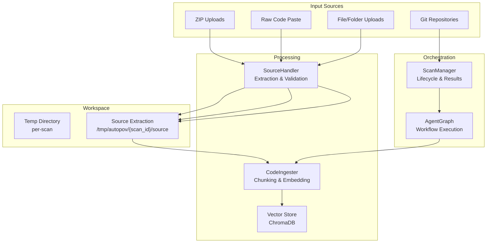
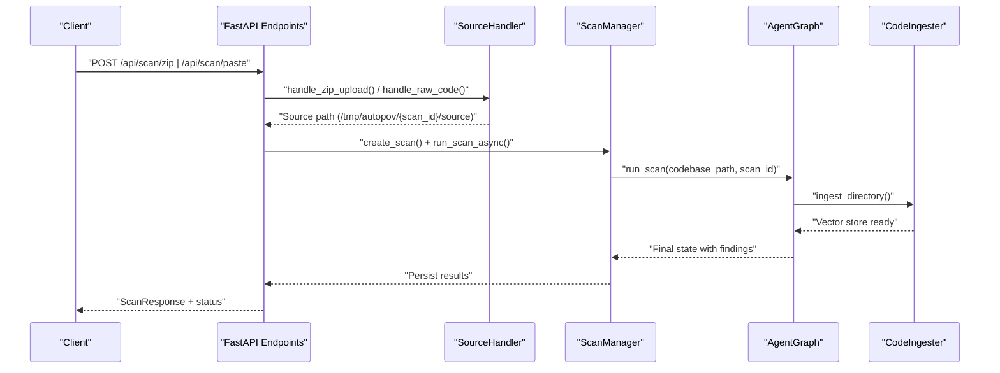
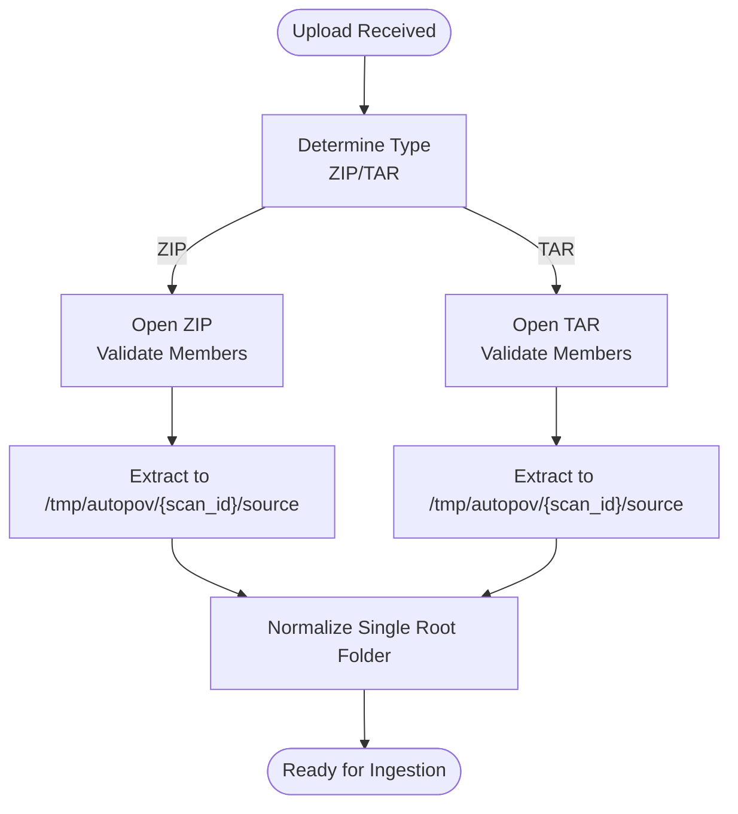
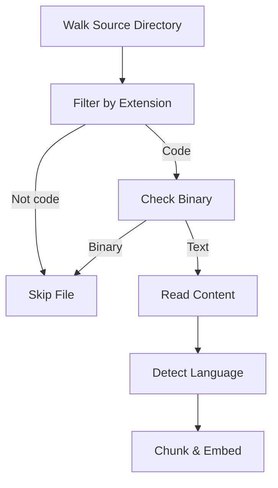
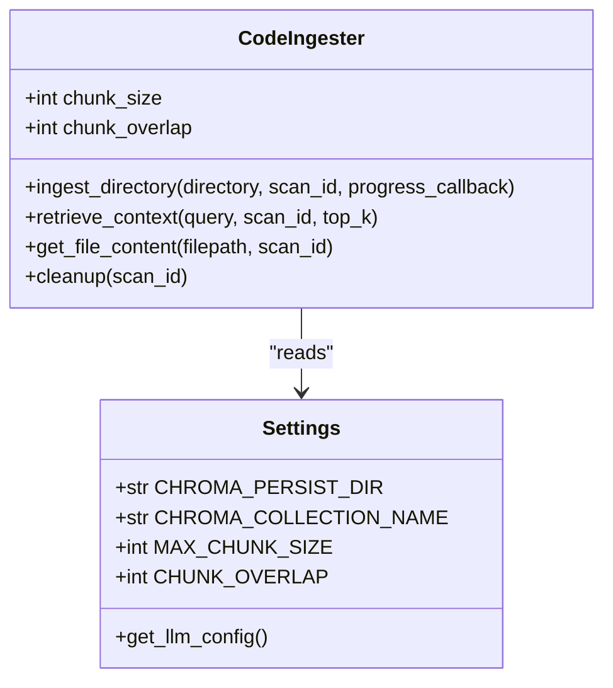
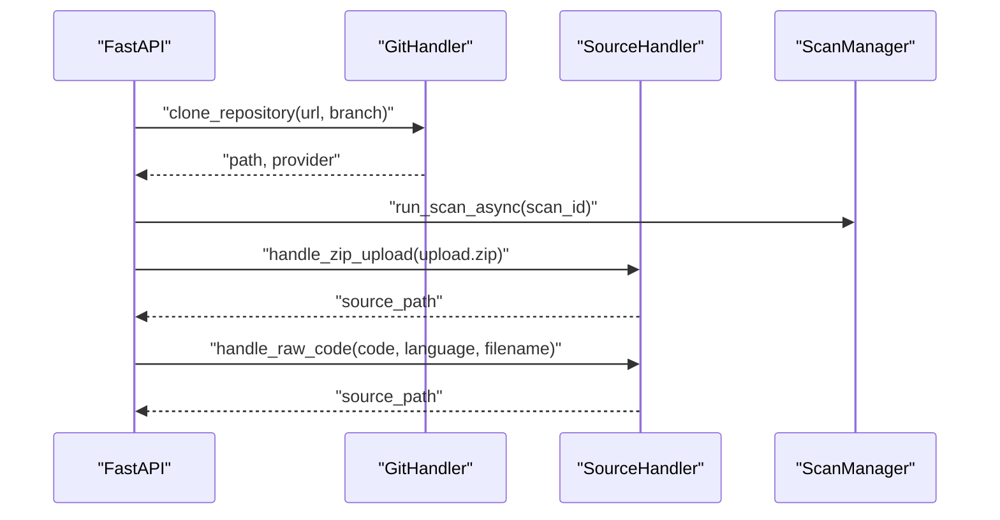
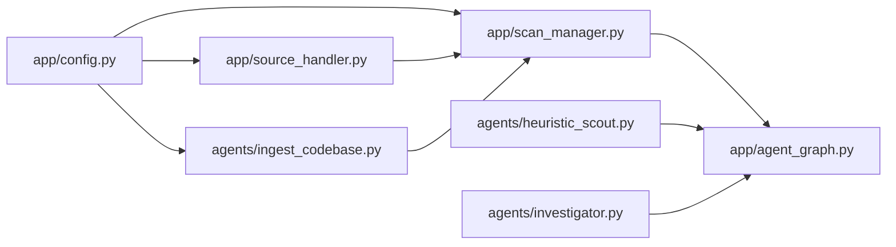

# Source Code Processing

<cite>
**Referenced Files in This Document**
- [app/source_handler.py](file://app/source_handler.py)
- [agents/ingest_codebase.py](file://agents/ingest_codebase.py)
- [app/scan_manager.py](file://app/scan_manager.py)
- [app/main.py](file://app/main.py)
- [app/config.py](file://app/config.py)
- [agents/heuristic_scout.py](file://agents/heuristic_scout.py)
- [agents/investigator.py](file://agents/investigator.py)
- [app/agent_graph.py](file://app/agent_graph.py)
- [agents/app_runner.py](file://agents/app_runner.py)
- [tests/test_source_handler.py](file://tests/test_source_handler.py)
</cite>

## Table of Contents
1. [Introduction](#introduction)
2. [Project Structure](#project-structure)
3. [Core Components](#core-components)
4. [Architecture Overview](#architecture-overview)
5. [Detailed Component Analysis](#detailed-component-analysis)
6. [Dependency Analysis](#dependency-analysis)
7. [Performance Considerations](#performance-considerations)
8. [Troubleshooting Guide](#troubleshooting-guide)
9. [Conclusion](#conclusion)

## Introduction
This document explains AutoPoV’s source code processing system: how ZIP archives and raw code are handled, how files are extracted and validated, how codebases are prepared for analysis, and how the unified codebase representation is built. It covers language detection, file filtering, preprocessing, integration with multiple input sources (Git repositories, ZIP uploads, raw code paste), and the RAG-backed ingestion pipeline. Practical examples illustrate file upload handling, code parsing, and workspace management. Security considerations, validation, and performance optimization for large codebases are addressed.

## Project Structure
The source code processing spans several modules:
- Input handlers: ZIP/tar extraction, raw code paste, file/folder uploads
- Workspace management: per-scan temporary directories and cleanup
- Code ingestion: chunking, embedding, and ChromaDB storage
- Workflow orchestration: scan lifecycle and agent graph execution
- Supporting utilities: configuration, authentication, and security checks

**Diagram sources**
- [app/source_handler.py:18-274](file://app/source_handler.py#L18-L274)
- [agents/ingest_codebase.py:41-412](file://agents/ingest_codebase.py#L41-L412)
- [app/scan_manager.py:47-663](file://app/scan_manager.py#L47-L663)
- [app/agent_graph.py:82-800](file://app/agent_graph.py#L82-L800)

**Section sources**
- [app/source_handler.py:18-274](file://app/source_handler.py#L18-L274)
- [agents/ingest_codebase.py:41-412](file://agents/ingest_codebase.py#L41-L412)
- [app/scan_manager.py:47-663](file://app/scan_manager.py#L47-L663)
- [app/agent_graph.py:82-800](file://app/agent_graph.py#L82-L800)

## Core Components
- SourceHandler: Handles ZIP/tar extraction, raw code paste, file/folder uploads, and workspace preparation. Implements path traversal protection and binary file detection.
- CodeIngester: Reads code files, detects language, filters non-code/binary files, chunks content, generates embeddings, and stores vectors in ChromaDB.
- ScanManager: Manages scan lifecycle, persists results, maintains logs, and coordinates agent graph execution.
- AgentGraph: Orchestrates ingestion, CodeQL analysis, investigation, PoV generation, validation, and execution.
- Configuration: Centralized settings for paths, chunk sizes, embeddings, and tool availability checks.

**Section sources**
- [app/source_handler.py:18-382](file://app/source_handler.py#L18-L382)
- [agents/ingest_codebase.py:41-412](file://agents/ingest_codebase.py#L41-L412)
- [app/scan_manager.py:47-663](file://app/scan_manager.py#L47-L663)
- [app/agent_graph.py:82-800](file://app/agent_graph.py#L82-L800)
- [app/config.py:13-255](file://app/config.py#L13-L255)

## Architecture Overview
The system integrates multiple input sources into a unified codebase representation backed by a vector store. The workflow begins with input handling, proceeds through extraction and validation, ingestion into the vector store, and ends with agent-driven investigation and PoV generation.

**Diagram sources**
- [app/main.py:288-400](file://app/main.py#L288-L400)
- [app/source_handler.py:31-78](file://app/source_handler.py#L31-L78)
- [app/scan_manager.py:234-366](file://app/scan_manager.py#L234-L366)
- [app/agent_graph.py:178-204](file://app/agent_graph.py#L178-L204)
- [agents/ingest_codebase.py:207-313](file://agents/ingest_codebase.py#L207-L313)

## Detailed Component Analysis

### ZIP and Archive Handling
- ZIP extraction: Validates archive members to prevent path traversal, extracts to a dedicated scan directory, and normalizes single-root-folder archives.
- TAR extraction: Supports gzip, bz2, and xz compression with equivalent path traversal checks.
- Binary safety: Detects binary files early to avoid expensive processing.

**Diagram sources**
- [app/source_handler.py:31-124](file://app/source_handler.py#L31-L124)

**Section sources**
- [app/source_handler.py:31-124](file://app/source_handler.py#L31-L124)
- [tests/test_source_handler.py:41-54](file://tests/test_source_handler.py#L41-L54)

### Raw Code Paste Handling
- Creates a temporary source directory and writes the provided code to a file with an inferred extension based on language.
- Supports optional filename specification.

**Section sources**
- [app/source_handler.py:193-232](file://app/source_handler.py#L193-L232)
- [tests/test_source_handler.py:26-39](file://tests/test_source_handler.py#L26-L39)

### File/Folder Upload Handling
- Copies selected files or entire folders into the source directory, optionally preserving structure.
- Cleans up previous source directories to avoid contamination.

**Section sources**
- [app/source_handler.py:126-191](file://app/source_handler.py#L126-L191)

### Workspace Management and Cleanup
- Per-scan temp directories are created under a configurable base path.
- Cleanup removes scan artifacts and vector store collections upon completion or failure.

**Section sources**
- [app/source_handler.py:21-29](file://app/source_handler.py#L21-L29)
- [app/source_handler.py:269-274](file://app/source_handler.py#L269-L274)
- [agents/ingest_codebase.py:393-403](file://agents/ingest_codebase.py#L393-L403)

### Language Detection and File Filtering
- Language detection: Based on file extensions, mapping to CodeQL languages for database creation and query selection.
- File filtering: Only whitelisted code extensions are processed; binary files are skipped.
- Preprocessing: Files are read with UTF-8 and ignored on decode errors; empty files are skipped.

**Diagram sources**
- [agents/ingest_codebase.py:128-155](file://agents/ingest_codebase.py#L128-L155)
- [agents/ingest_codebase.py:175-205](file://agents/ingest_codebase.py#L175-L205)
- [app/agent_graph.py:342-381](file://app/agent_graph.py#L342-L381)

**Section sources**
- [agents/ingest_codebase.py:128-205](file://agents/ingest_codebase.py#L128-L205)
- [app/agent_graph.py:342-381](file://app/agent_graph.py#L342-L381)

### Code Ingestion Pipeline (RAG)
- Chunking: Uses recursive character splitting with language-aware separators.
- Embeddings: Selects online (OpenAI-compatible) or offline (Hugging Face) embeddings based on configuration.
- Vector store: Persistent ChromaDB collection per scan; batches embeddings for efficient insertion.
- Retrieval: Supports context retrieval for investigation prompts.

**Diagram sources**
- [agents/ingest_codebase.py:41-121](file://agents/ingest_codebase.py#L41-L121)
- [agents/ingest_codebase.py:207-313](file://agents/ingest_codebase.py#L207-L313)
- [app/config.py:73-106](file://app/config.py#L73-L106)

**Section sources**
- [agents/ingest_codebase.py:41-412](file://agents/ingest_codebase.py#L41-L412)
- [app/config.py:73-106](file://app/config.py#L73-L106)

### Integration with Input Sources
- Git repositories: Cloned into a temporary path; scan proceeds with the cloned directory.
- ZIP uploads: Saved to a temp location, extracted via SourceHandler, then scanned.
- Raw code paste: Written to a single-file source directory.
- File/folder uploads: Copied into the source directory with optional structure preservation.

**Diagram sources**
- [app/main.py:204-400](file://app/main.py#L204-L400)
- [app/source_handler.py:31-232](file://app/source_handler.py#L31-L232)

**Section sources**
- [app/main.py:204-400](file://app/main.py#L204-L400)
- [app/source_handler.py:31-232](file://app/source_handler.py#L31-L232)

### Unified Codebase Representation
- The vector store holds code chunks with metadata (filepath, language, source).
- Retrieval augments investigation prompts with relevant context.
- File-level retrieval enables precise code context around a line number.

**Section sources**
- [agents/ingest_codebase.py:156-205](file://agents/ingest_codebase.py#L156-L205)
- [agents/ingest_codebase.py:315-391](file://agents/ingest_codebase.py#L315-L391)
- [agents/investigator.py:202-269](file://agents/investigator.py#L202-L269)

### Example Workflows

#### ZIP Upload Handling
- Endpoint reads the uploaded file, saves it to a temp path, extracts using SourceHandler, sets the scan’s codebase path, and starts the async scan.

**Section sources**
- [app/main.py:288-347](file://app/main.py#L288-L347)
- [app/source_handler.py:31-78](file://app/source_handler.py#L31-L78)

#### Raw Code Parsing
- Endpoint saves raw code to a file in the source directory with an inferred extension, then triggers the scan.

**Section sources**
- [app/main.py:350-400](file://app/main.py#L350-L400)
- [app/source_handler.py:193-232](file://app/source_handler.py#L193-L232)

#### Workspace Management
- Per-scan temp directories are created and cleaned up; vector store collections are deleted after scan completion.

**Section sources**
- [app/source_handler.py:21-29](file://app/source_handler.py#L21-L29)
- [agents/ingest_codebase.py:393-403](file://agents/ingest_codebase.py#L393-L403)

### Security Considerations
- Path traversal protection: ZIP/TAR members are checked against the extraction root to prevent directory traversal.
- Binary file detection: Skips binary files to avoid resource-intensive processing and potential malicious payloads.
- API key authentication and rate limiting: Enforces bearer token validation and per-key rate limits for scan-triggering endpoints.
- Tool availability checks: Ensures CodeQL, Joern, and Docker are available before invoking them.

**Section sources**
- [app/source_handler.py:56-63](file://app/source_handler.py#L56-L63)
- [app/source_handler.py:115-122](file://app/source_handler.py#L115-L122)
- [app/source_handler.py:314-322](file://app/source_handler.py#L314-L322)
- [app/auth.py:192-236](file://app/auth.py#L192-L236)
- [app/config.py:162-211](file://app/config.py#L162-L211)

## Dependency Analysis
The system exhibits clear separation of concerns:
- Input handling depends on configuration for temp directories.
- Ingestion depends on configuration for embeddings and vector store settings.
- Orchestration coordinates ingestion and agent graph execution.
- Tests validate extraction, raw code handling, and binary detection.

**Diagram sources**
- [app/config.py:13-255](file://app/config.py#L13-L255)
- [app/source_handler.py:18-382](file://app/source_handler.py#L18-L382)
- [agents/ingest_codebase.py:41-412](file://agents/ingest_codebase.py#L41-L412)
- [app/scan_manager.py:47-663](file://app/scan_manager.py#L47-L663)
- [app/agent_graph.py:82-800](file://app/agent_graph.py#L82-L800)
- [agents/heuristic_scout.py:13-242](file://agents/heuristic_scout.py#L13-L242)
- [agents/investigator.py:37-519](file://agents/investigator.py#L37-L519)

**Section sources**
- [app/config.py:13-255](file://app/config.py#L13-L255)
- [app/source_handler.py:18-382](file://app/source_handler.py#L18-L382)
- [agents/ingest_codebase.py:41-412](file://agents/ingest_codebase.py#L41-L412)
- [app/scan_manager.py:47-663](file://app/scan_manager.py#L47-L663)
- [app/agent_graph.py:82-800](file://app/agent_graph.py#L82-L800)
- [agents/heuristic_scout.py:13-242](file://agents/heuristic_scout.py#L13-L242)
- [agents/investigator.py:37-519](file://agents/investigator.py#L37-L519)

## Performance Considerations
- Chunk sizing and overlap: Tune MAX_CHUNK_SIZE and CHUNK_OVERLAP to balance recall and cost.
- Batched embeddings: ChromaDB ingestion uses batched inserts to reduce overhead.
- Early filtering: Non-code and binary files are skipped to minimize I/O and embedding costs.
- Tool availability checks: Avoids unnecessary subprocess calls when tools are unavailable.
- Cost tracking: Token usage and model selection influence runtime cost; consider offline embeddings for large scans.
- Concurrency: ThreadPoolExecutor handles blocking operations; keep worker count balanced with system resources.

[No sources needed since this section provides general guidance]

## Troubleshooting Guide
- ZIP/TAR extraction fails due to path traversal: Verify archive members are within the extraction root.
- No findings after ingestion: Confirm language detection mapped to a supported CodeQL pack and that files are not filtered as binary or non-code.
- Embedding errors: Ensure embeddings provider credentials and model names are configured correctly.
- Scan stuck or slow: Check vector store persistence path and batch sizes; validate tool availability.
- Cleanup not removing old results: Use the cleanup endpoint to prune old scan artifacts and rebuild the history CSV.

**Section sources**
- [app/source_handler.py:56-63](file://app/source_handler.py#L56-L63)
- [agents/ingest_codebase.py:224-225](file://agents/ingest_codebase.py#L224-L225)
- [app/scan_manager.py:512-561](file://app/scan_manager.py#L512-L561)

## Conclusion
AutoPoV’s source code processing system provides robust, secure, and scalable ingestion of diverse input sources into a unified, RAG-backed code representation. By combining path traversal protection, binary detection, language-aware chunking, and configurable embeddings, it supports efficient vulnerability discovery and PoV generation. The modular architecture ensures maintainability and extensibility for future enhancements.