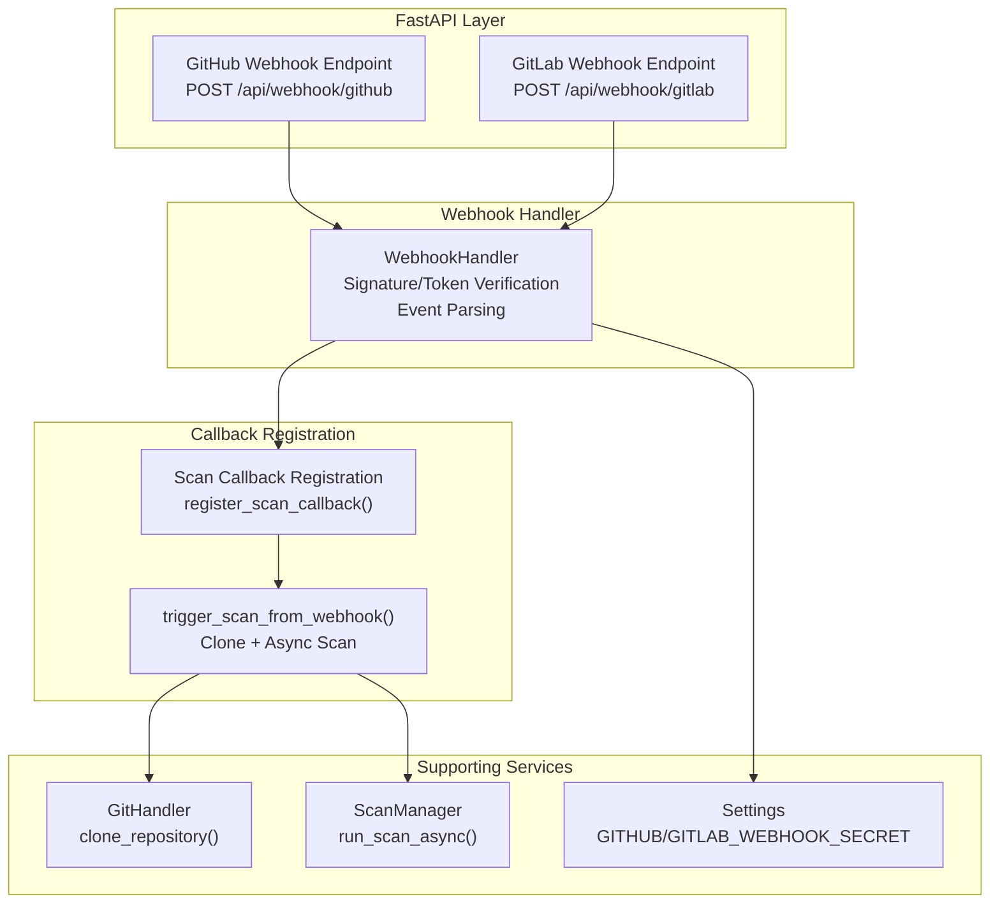
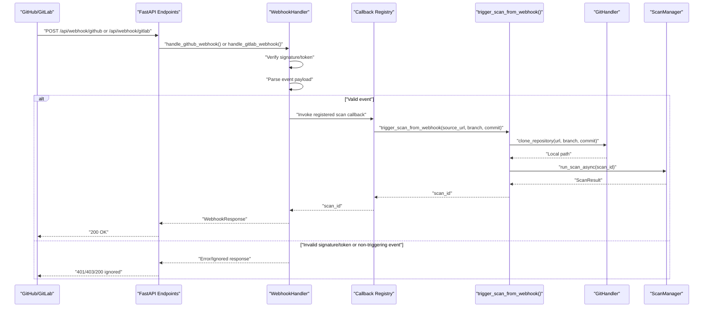
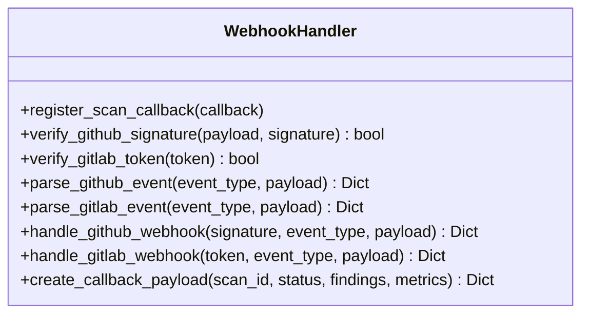
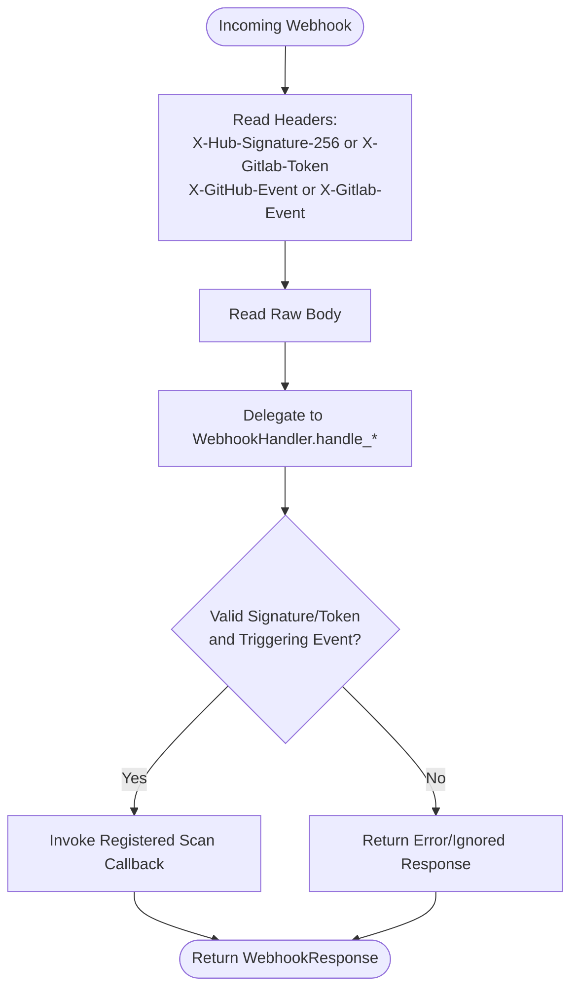
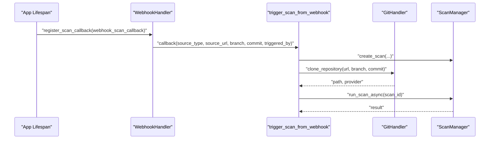
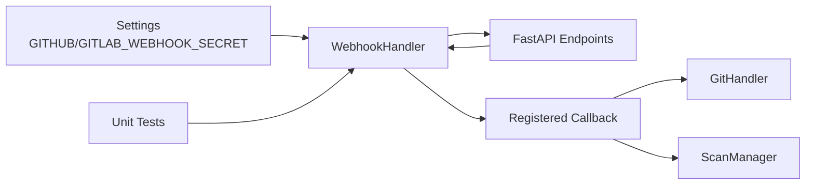

# Webhook Integration

<cite>
**Referenced Files in This Document**
- [app/webhook_handler.py](file://app/webhook_handler.py)
- [app/main.py](file://app/main.py)
- [app/config.py](file://app/config.py)
- [app/git_handler.py](file://app/git_handler.py)
- [app/scan_manager.py](file://app/scan_manager.py)
- [frontend/src/components/WebhookSetup.jsx](file://frontend/src/components/WebhookSetup.jsx)
- [tests/test_webhook_handler.py](file://tests/test_webhook_handler.py)
- [README.md](file://README.md)
- [app/auth.py](file://app/auth.py)
</cite>

## Table of Contents
1. [Introduction](#introduction)
2. [Project Structure](#project-structure)
3. [Core Components](#core-components)
4. [Architecture Overview](#architecture-overview)
5. [Detailed Component Analysis](#detailed-component-analysis)
6. [Dependency Analysis](#dependency-analysis)
7. [Performance Considerations](#performance-considerations)
8. [Troubleshooting Guide](#troubleshooting-guide)
9. [Conclusion](#conclusion)

## Introduction
This document explains AutoPoV’s webhook integration system for GitHub and GitLab. It covers how incoming webhooks are validated, parsed, and transformed into automated vulnerability scans. It documents security validation, payload parsing, callback registration, and integration with CI/CD pipelines and notifications. It also provides setup examples, troubleshooting guidance, and operational considerations for rate limiting and monitoring.

## Project Structure
The webhook integration spans several modules:
- FastAPI endpoints that accept GitHub and GitLab webhooks
- A dedicated webhook handler that validates signatures/tokens and parses payloads
- A callback registration mechanism that triggers scans when events occur
- Supporting components for Git repository access and scan lifecycle management

**Diagram sources**
- [app/main.py:646-688](file://app/main.py#L646-L688)
- [app/webhook_handler.py:15-363](file://app/webhook_handler.py#L15-L363)
- [app/config.py:69-71](file://app/config.py#L69-L71)
- [app/git_handler.py:199-294](file://app/git_handler.py#L199-L294)
- [app/scan_manager.py:234-264](file://app/scan_manager.py#L234-L264)

**Section sources**
- [app/main.py:646-688](file://app/main.py#L646-L688)
- [app/webhook_handler.py:15-363](file://app/webhook_handler.py#L15-L363)
- [app/config.py:69-71](file://app/config.py#L69-L71)

## Core Components
- WebhookHandler: Validates GitHub HMAC signatures and GitLab tokens, parses provider-specific payloads, and triggers scan callbacks.
- FastAPI endpoints: Expose /api/webhook/github and /api/webhook/gitlab with header-based validation.
- Callback registration: The application registers a scan callback during startup so webhooks can trigger scans.
- GitHandler: Clones repositories for scanned branches/commits and handles provider credentials.
- ScanManager: Executes asynchronous scans and persists results.

**Section sources**
- [app/webhook_handler.py:15-363](file://app/webhook_handler.py#L15-L363)
- [app/main.py:93-111](file://app/main.py#L93-L111)
- [app/git_handler.py:199-294](file://app/git_handler.py#L199-L294)
- [app/scan_manager.py:234-264](file://app/scan_manager.py#L234-L264)

## Architecture Overview
The webhook flow integrates with AutoPoV’s agent orchestration. On receiving a webhook, the system validates the signature/token, extracts repository and branch/commit metadata, and triggers a background scan. The scan clones the repository, runs the agent graph, and stores results.

**Diagram sources**
- [app/main.py:646-688](file://app/main.py#L646-L688)
- [app/webhook_handler.py:196-336](file://app/webhook_handler.py#L196-L336)
- [app/main.py:134-172](file://app/main.py#L134-L172)
- [app/git_handler.py:199-294](file://app/git_handler.py#L199-L294)
- [app/scan_manager.py:234-264](file://app/scan_manager.py#L234-L264)

## Detailed Component Analysis

### WebhookHandler
Responsibilities:
- Signature/token verification
- Event parsing for GitHub and GitLab
- Callback registration and invocation
- Response payload creation

Security validation:
- GitHub: HMAC-SHA256 signature verification using the configured secret.
- GitLab: Shared token verification using the configured secret.

Event parsing:
- GitHub: Supports push and pull_request events; extracts repository, branch, commit, author/pusher, and determines whether to trigger a scan.
- GitLab: Supports push and merge_request events; extracts project, branch, commit, author, and determines whether to trigger a scan.

Callback registration:
- The application registers a scan callback during startup so that when a webhook event is valid and requires a scan, it can trigger a new scan with the extracted metadata.

Response creation:
- The handler constructs a standardized response with status, message, and optional scan_id and event data.

**Diagram sources**
- [app/webhook_handler.py:15-363](file://app/webhook_handler.py#L15-L363)

**Section sources**
- [app/webhook_handler.py:15-363](file://app/webhook_handler.py#L15-L363)

### FastAPI Webhook Endpoints
Endpoints:
- POST /api/webhook/github: Validates X-Hub-Signature-256 and X-GitHub-Event headers, delegates to WebhookHandler.
- POST /api/webhook/gitlab: Validates X-Gitlab-Token and X-Gitlab-Event headers, delegates to WebhookHandler.

Behavior:
- Extracts raw body and headers, passes to WebhookHandler.
- Returns a standardized WebhookResponse with status, message, and optional scan_id.

**Diagram sources**
- [app/main.py:646-688](file://app/main.py#L646-L688)
- [app/webhook_handler.py:196-336](file://app/webhook_handler.py#L196-L336)

**Section sources**
- [app/main.py:646-688](file://app/main.py#L646-L688)

### Callback Registration and Scan Triggering
During application startup, the webhook handler registers a callback that:
- Creates a new scan via ScanManager
- Clones the repository using GitHandler with optional branch/commit
- Runs the scan asynchronously via ScanManager

**Diagram sources**
- [app/main.py:93-111](file://app/main.py#L93-L111)
- [app/main.py:134-172](file://app/main.py#L134-L172)
- [app/git_handler.py:199-294](file://app/git_handler.py#L199-L294)
- [app/scan_manager.py:234-264](file://app/scan_manager.py#L234-L264)

**Section sources**
- [app/main.py:93-111](file://app/main.py#L93-L111)
- [app/main.py:134-172](file://app/main.py#L134-L172)

### Configuration and Secrets
- GitHub webhook secret: GITHUB_WEBHOOK_SECRET
- GitLab webhook secret: GITLAB_WEBHOOK_SECRET
- These are loaded via the Settings class and used by WebhookHandler for validation.

**Section sources**
- [app/config.py:69-71](file://app/config.py#L69-L71)
- [app/webhook_handler.py:40-73](file://app/webhook_handler.py#L40-L73)

### Frontend Webhook Setup
The frontend component displays:
- Payload URLs for GitHub and GitLab
- Secret headers to configure
- Setup locations within provider dashboards
- A note to set the corresponding environment variables

**Section sources**
- [frontend/src/components/WebhookSetup.jsx:1-89](file://frontend/src/components/WebhookSetup.jsx#L1-L89)

## Dependency Analysis
- WebhookHandler depends on Settings for secrets and on the registered scan callback to trigger scans.
- FastAPI endpoints depend on WebhookHandler for validation and parsing.
- The registered callback depends on GitHandler for cloning and ScanManager for execution.
- Tests validate signature verification and event parsing logic.

**Diagram sources**
- [app/config.py:69-71](file://app/config.py#L69-L71)
- [app/webhook_handler.py:15-363](file://app/webhook_handler.py#L15-L363)
- [app/main.py:646-688](file://app/main.py#L646-L688)
- [app/git_handler.py:199-294](file://app/git_handler.py#L199-L294)
- [app/scan_manager.py:234-264](file://app/scan_manager.py#L234-L264)
- [tests/test_webhook_handler.py:1-166](file://tests/test_webhook_handler.py#L1-L166)

**Section sources**
- [app/webhook_handler.py:15-363](file://app/webhook_handler.py#L15-L363)
- [app/main.py:646-688](file://app/main.py#L646-L688)
- [tests/test_webhook_handler.py:1-166](file://tests/test_webhook_handler.py#L1-L166)

## Performance Considerations
- Asynchronous scan execution: Scans are run in background tasks to avoid blocking webhook responses.
- Shallow clone: GitHandler performs a shallow clone to reduce resource usage.
- Rate limiting: While not enforced on webhook endpoints, the system enforces rate limits on scan-triggering endpoints to prevent abuse.
- Concurrency: ThreadPoolExecutor is used for synchronous parts of scans to keep the event loop responsive.

[No sources needed since this section provides general guidance]

## Troubleshooting Guide

Common issues and resolutions:
- Invalid signature/token
  - Ensure the webhook secret matches the configured environment variable.
  - For GitHub, confirm the X-Hub-Signature-256 header is present and begins with sha256=.
  - For GitLab, confirm the X-Gitlab-Token header matches the configured secret.
- Non-triggering events
  - WebhookHandler ignores events that are not push or pull_request (GitHub) or push or merge_request (GitLab).
  - Ensure the event type is selected in the provider’s webhook settings.
- Repository access denied
  - Private repositories require provider tokens configured in settings.
  - Confirm GITHUB_TOKEN or GITLAB_TOKEN is set appropriately.
- Large repository timeouts
  - Very large repositories may exceed clone timeouts; consider using ZIP upload for large codebases.
- No scan callback registered
  - The application registers a callback during startup. If missing, verify the application started successfully.

Operational tips:
- Monitor webhook responses: The endpoints return standardized responses indicating success, error, or ignored.
- Use the frontend “Webhook Setup” component to copy correct URLs and headers.
- Check scan logs via the status and streaming endpoints to diagnose failures.

**Section sources**
- [app/webhook_handler.py:213-265](file://app/webhook_handler.py#L213-L265)
- [app/webhook_handler.py:284-336](file://app/webhook_handler.py#L284-L336)
- [app/git_handler.py:155-198](file://app/git_handler.py#L155-L198)
- [app/git_handler.py:243-294](file://app/git_handler.py#L243-L294)
- [frontend/src/components/WebhookSetup.jsx:1-89](file://frontend/src/components/WebhookSetup.jsx#L1-L89)

## Conclusion
AutoPoV’s webhook integration provides secure, automated vulnerability scanning from GitHub and GitLab. It validates provider signatures/tokens, parses relevant events, and triggers scans asynchronously. The system is designed for CI/CD pipelines, enabling continuous security validation with robust error handling and monitoring hooks. Proper configuration of secrets and event types ensures reliable automation.