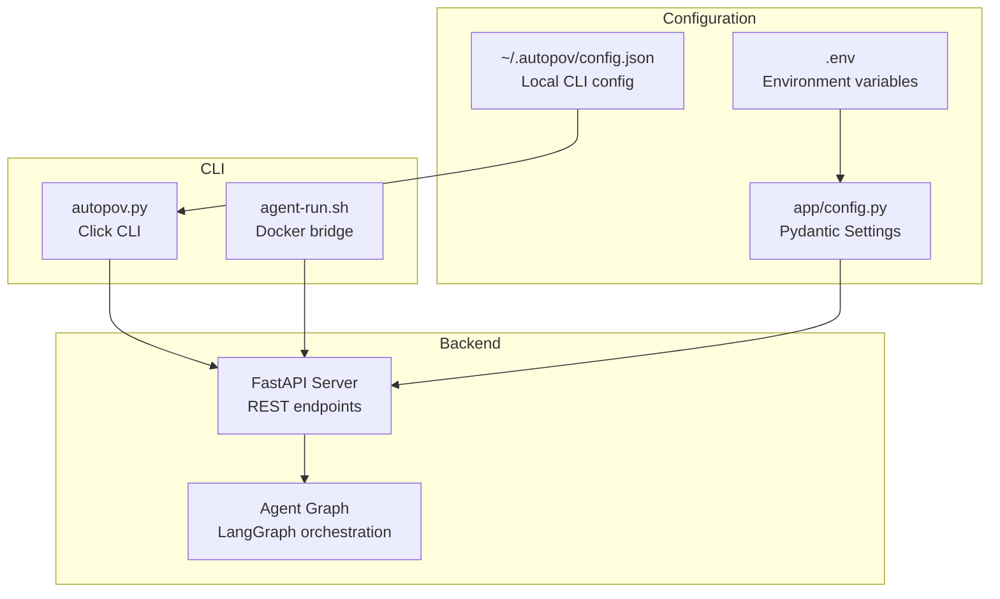
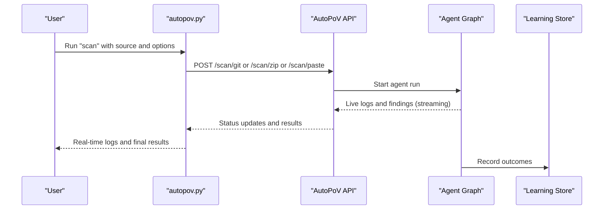
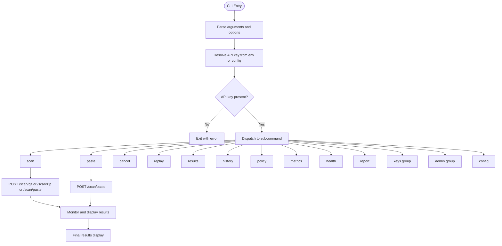
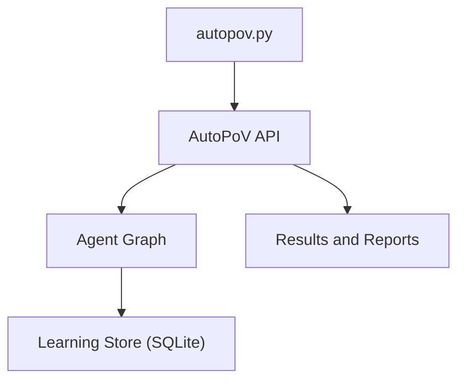
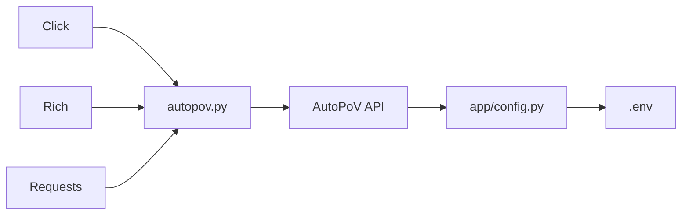

# CLI Interface

<cite>
**Referenced Files in This Document**
- [autopov.py](file://cli/autopov.py)
- [agent-run.sh](file://cli/agent-run.sh)
- [README.md](file://README.md)
- [requirements.txt](file://requirements.txt)
- [config.py](file://app/config.py)
- [api_keys.json](file://data/api_keys.json)
</cite>

## Table of Contents
1. [Introduction](#introduction)
2. [Project Structure](#project-structure)
3. [Core Components](#core-components)
4. [Architecture Overview](#architecture-overview)
5. [Detailed Component Analysis](#detailed-component-analysis)
6. [Dependency Analysis](#dependency-analysis)
7. [Performance Considerations](#performance-considerations)
8. [Troubleshooting Guide](#troubleshooting-guide)
9. [Conclusion](#conclusion)
10. [Appendices](#appendices)

## Introduction
This document describes the AutoPoV command-line interface (CLI) centered on the autopov.py script and the agent-run.sh bridge. It explains command-line argument parsing, scan initiation, configuration management, and automation capabilities. It also documents the agent-run.sh script for agent execution and management inside the Dockerized AutoPoV API service. The guide covers available commands, options, parameters, usage patterns for manual operation and automated scripting, integration with CI/CD pipelines, and batch processing scenarios. Error handling, logging, and troubleshooting procedures for CLI operations are included.

## Project Structure
The CLI is implemented as a Click-based Python application under cli/autopov.py and a small shell bridge under cli/agent-run.sh. The CLI communicates with the AutoPoV backend API, which is configured via environment variables and settings.

**Diagram sources**
- [autopov.py:1-1096](file://cli/autopov.py#L1-L1096)
- [agent-run.sh:1-11](file://cli/agent-run.sh#L1-L11)
- [config.py:1-255](file://app/config.py#L1-L255)

**Section sources**
- [autopov.py:1-1096](file://cli/autopov.py#L1-L1096)
- [agent-run.sh:1-11](file://cli/agent-run.sh#L1-L11)
- [README.md:1-444](file://README.md#L1-L444)

## Core Components
- autopov.py: A Click-based CLI that wraps AutoPoV’s REST API. It supports scanning Git repositories, ZIP archives, local directories, and pasted code; retrieving results; replaying findings; managing API keys; and inspecting server health and metrics.
- agent-run.sh: A convenience script that executes CLI commands inside the running Docker container hosting the AutoPoV API service.

Key capabilities:
- Argument parsing with Click decorators and options
- API key resolution from environment or local config
- Real-time monitoring of scans with live logs and findings
- Output formatting (table, JSON, PDF)
- Admin and policy reporting commands

**Section sources**
- [autopov.py:1-1096](file://cli/autopov.py#L1-L1096)
- [agent-run.sh:1-11](file://cli/agent-run.sh#L1-L11)

## Architecture Overview
The CLI is a thin client that posts requests to the AutoPoV backend API and streams results back. It uses rich for terminal UX and requests for HTTP communication. The backend orchestrates agents via LangGraph and persists results to disk and a SQLite learning store.

**Diagram sources**
- [autopov.py:139-240](file://cli/autopov.py#L139-L240)
- [autopov.py:888-975](file://cli/autopov.py#L888-L975)
- [config.py:108-134](file://app/config.py#L108-L134)

## Detailed Component Analysis

### autopov.py CLI Commands and Options
The CLI defines a Click group with numerous subcommands. Below are the primary commands and their options.

- scan
  - Purpose: Initiate a scan from a Git repository URL, ZIP file path, or local directory.
  - Arguments:
    - source: URL, ZIP path, or directory path.
  - Options:
    - --model/-m: Model identifier (overrides interactive selection).
    - --cwe/-c: One or more CWE identifiers (repeatable).
    - --output/-o: Output format (json, table, pdf).
    - --api-key/-k: API key override.
    - --branch/-b: Git branch for repository scans.
    - --lite: Lite mode (static analysis only).
    - --wait/--no-wait: Wait for completion or return immediately.
  - Behavior:
    - Resolves API key from environment or local config.
    - Interactively selects a model if not provided.
    - Determines source type and posts to the appropriate endpoint.
    - Optionally monitors and displays results in real-time.

- paste
  - Purpose: Scan code piped from stdin.
  - Options:
    - --language/-l: Target language (python, javascript, c, cpp, java, go, rust).
    - --filename/-f: Virtual filename for the code.
    - --model/-m: Model identifier.
    - --cwe/-c: CWE filters.
    - --output/-o: Output format.
    - --api-key/-k: API key override.
    - --lite: Lite mode.
    - --wait/--no-wait: Wait for completion.
  - Behavior:
    - Reads code from stdin; exits if empty.
    - Posts to /scan/paste and optionally monitors.

- cancel
  - Purpose: Cancel a running scan.
  - Arguments:
    - scan_id: Scan identifier.
  - Options:
    - --api-key/-k: API key.

- replay
  - Purpose: Re-run a completed scan against one or more models for benchmarking.
  - Arguments:
    - scan_id: Completed scan identifier.
  - Options:
    - --model/-m: One or more model identifiers (repeatable).
    - --include-failed: Include failed/unconfirmed findings.
    - --max-findings: Maximum findings to replay.
    - --api-key/-k: API key.

- results
  - Purpose: Retrieve and display scan results.
  - Arguments:
    - scan_id: Scan identifier.
  - Options:
    - --output/-o: Output format.
    - --api-key/-k: API key.

- history
  - Purpose: Paginate and display scan history.
  - Options:
    - --limit/-l: Items per page.
    - --page/-p: Page number.
    - --api-key/-k: API key.

- policy
  - Purpose: Show agent learning store summary and model performance.
  - Options:
    - --api-key/-k: API key.

- metrics
  - Purpose: Show system metrics (counts, durations, costs).
  - Options:
    - --api-key/-k: API key.

- health
  - Purpose: Show server health and tool availability.

- report
  - Purpose: Download a JSON or PDF report for a scan.
  - Arguments:
    - scan_id: Scan identifier.
  - Options:
    - --format/-f: Report format (json, pdf).
    - --api-key/-k: API key.

- keys (group)
  - Subcommands:
    - generate: Generate a new API key (admin-only).
    - list: List all API keys (admin-only).
    - revoke: Revoke a key by ID (admin-only).
  - Options:
    - --admin-key/-a: Admin key.
    - Additional options per subcommand.

- admin (group)
  - Subcommands:
    - cleanup: Clean up old scan result files (admin-only).
  - Options:
    - --admin-key/-a: Admin key.
    - --max-age-days: Retention threshold.
    - --max-results: Keep only N most recent results.

- config
  - Purpose: Show client and server configuration.

Shared helpers:
- _monitor_and_display: Polls scan status, prints live logs and findings, then displays final results.
- display_results: Renders results in JSON, table, or PDF.

**Diagram sources**
- [autopov.py:139-240](file://cli/autopov.py#L139-L240)
- [autopov.py:246-322](file://cli/autopov.py#L246-L322)
- [autopov.py:888-975](file://cli/autopov.py#L888-L975)

**Section sources**
- [autopov.py:139-240](file://cli/autopov.py#L139-L240)
- [autopov.py:246-322](file://cli/autopov.py#L246-L322)
- [autopov.py:328-405](file://cli/autopov.py#L328-L405)
- [autopov.py:411-426](file://cli/autopov.py#L411-L426)
- [autopov.py:432-502](file://cli/autopov.py#L432-L502)
- [autopov.py:508-574](file://cli/autopov.py#L508-L574)
- [autopov.py:580-607](file://cli/autopov.py#L580-L607)
- [autopov.py:613-637](file://cli/autopov.py#L613-L637)
- [autopov.py:643-673](file://cli/autopov.py#L643-L673)
- [autopov.py:679-793](file://cli/autopov.py#L679-L793)
- [autopov.py:805-842](file://cli/autopov.py#L805-L842)
- [autopov.py:848-882](file://cli/autopov.py#L848-L882)
- [autopov.py:888-1092](file://cli/autopov.py#L888-L1092)

### agent-run.sh Shell Script
The agent-run.sh script provides a convenient way to run CLI commands inside the Docker container named autopov-api. It checks if the container is running and executes the CLI agent trigger inside the container. If the container is not running, it instructs the user to start the system.

Key behavior:
- Checks for the presence of the autopov-api container.
- Executes the CLI agent trigger inside the container with forwarded arguments.
- Prints an error message if the container is not running.

**Section sources**
- [agent-run.sh:1-11](file://cli/agent-run.sh#L1-L11)

### Configuration Management
The CLI resolves API keys from:
- Environment variables (AUTOPOV_API_KEY).
- Local configuration file (~/.autopov/config.json).

It also saves generated API keys to the local config file for convenience.

Backend configuration is driven by environment variables loaded via Pydantic Settings. The CLI can display both client and server configuration.

**Section sources**
- [autopov.py:29-54](file://cli/autopov.py#L29-L54)
- [autopov.py:848-882](file://cli/autopov.py#L848-L882)
- [config.py:13-255](file://app/config.py#L13-L255)
- [api_keys.json:1-42](file://data/api_keys.json#L1-L42)

## Architecture Overview
The CLI communicates with the AutoPoV backend API over HTTP. The backend orchestrates agents via LangGraph and persists results to disk and a SQLite learning store. The CLI provides real-time monitoring and rich output formatting.

**Diagram sources**
- [autopov.py:56-91](file://cli/autopov.py#L56-L91)
- [config.py:108-134](file://app/config.py#L108-L134)

## Detailed Component Analysis

### Command: scan
- Purpose: Initiate a scan from a Git repository, ZIP file, or local directory.
- Input detection:
  - Git URL: http(s):// or git@...
  - ZIP file: .zip extension
  - Directory: existing folder
- Options:
  - --model/-m: Model identifier
  - --cwe/-c: CWE filters (repeatable)
  - --output/-o: Output format
  - --api-key/-k: API key override
  - --branch/-b: Git branch
  - --lite: Static-only mode
  - --wait/--no-wait: Monitor until completion
- Behavior:
  - Resolves API key and model
  - Posts to appropriate endpoint (/scan/git, /scan/zip, /scan/paste)
  - Optionally monitors and displays results

**Section sources**
- [autopov.py:139-240](file://cli/autopov.py#L139-L240)

### Command: paste
- Purpose: Scan code piped from stdin.
- Options:
  - --language/-l: Target language
  - --filename/-f: Virtual filename
  - --model/-m: Model identifier
  - --cwe/-c: CWE filters
  - --output/-o: Output format
  - --api-key/-k: API key override
  - --lite: Static-only mode
  - --wait/--no-wait: Monitor until completion
- Behavior:
  - Reads stdin; exits if empty
  - Posts to /scan/paste and optionally monitors

**Section sources**
- [autopov.py:246-322](file://cli/autopov.py#L246-L322)

### Command: cancel
- Purpose: Cancel a running scan.
- Options:
  - --api-key/-k: API key

**Section sources**
- [autopov.py:328-343](file://cli/autopov.py#L328-L343)

### Command: replay
- Purpose: Re-run a completed scan against one or more models for benchmarking.
- Options:
  - --model/-m: One or more model identifiers (repeatable)
  - --include-failed: Include failed/unconfirmed findings
  - --max-findings: Maximum findings to replay
  - --api-key/-k: API key

**Section sources**
- [autopov.py:349-405](file://cli/autopov.py#L349-L405)

### Command: results
- Purpose: Retrieve and display scan results.
- Options:
  - --output/-o: Output format
  - --api-key/-k: API key

**Section sources**
- [autopov.py:411-426](file://cli/autopov.py#L411-L426)

### Command: history
- Purpose: Paginate and display scan history.
- Options:
  - --limit/-l: Items per page
  - --page/-p: Page number
  - --api-key/-k: API key

**Section sources**
- [autopov.py:432-502](file://cli/autopov.py#L432-L502)

### Command: policy
- Purpose: Show agent learning store summary and model performance.
- Options:
  - --api-key/-k: API key

**Section sources**
- [autopov.py:508-574](file://cli/autopov.py#L508-L574)

### Command: metrics
- Purpose: Show system metrics (counts, durations, costs).
- Options:
  - --api-key/-k: API key

**Section sources**
- [autopov.py:580-607](file://cli/autopov.py#L580-L607)

### Command: health
- Purpose: Show server health and tool availability.

**Section sources**
- [autopov.py:613-637](file://cli/autopov.py#L613-L637)

### Command: report
- Purpose: Download a JSON or PDF report for a scan.
- Options:
  - --format/-f: Report format
  - --api-key/-k: API key

**Section sources**
- [autopov.py:643-673](file://cli/autopov.py#L643-L673)

### Group: keys
- Subcommands:
  - generate: Generate a new API key (admin-only)
  - list: List all API keys (admin-only)
  - revoke: Revoke a key by ID (admin-only)
- Options:
  - --admin-key/-a: Admin key
  - Additional options per subcommand

**Section sources**
- [autopov.py:679-793](file://cli/autopov.py#L679-L793)

### Group: admin
- Subcommands:
  - cleanup: Clean up old scan result files (admin-only)
- Options:
  - --admin-key/-a: Admin key
  - --max-age-days: Retention threshold
  - --max-results: Keep only N most recent results

**Section sources**
- [autopov.py:805-842](file://cli/autopov.py#L805-L842)

### Command: config
- Purpose: Show client and server configuration.

**Section sources**
- [autopov.py:848-882](file://cli/autopov.py#L848-L882)

## Dependency Analysis
The CLI depends on:
- Click for command-line parsing
- Rich for terminal UX
- Requests for HTTP communication
- Backend API endpoints for all operations

The backend configuration is driven by environment variables and Pydantic Settings.

**Diagram sources**
- [requirements.txt:31-34](file://requirements.txt#L31-L34)
- [autopov.py:12-18](file://cli/autopov.py#L12-L18)
- [config.py:13-255](file://app/config.py#L13-L255)

**Section sources**
- [requirements.txt:1-44](file://requirements.txt#L1-L44)
- [autopov.py:12-18](file://cli/autopov.py#L12-L18)
- [config.py:13-255](file://app/config.py#L13-L255)

## Performance Considerations
- Lite scans reduce runtime by skipping expensive validations.
- Output formats impact processing time; JSON and PDF downloads require additional requests.
- Real-time monitoring polls the backend periodically; interrupting monitoring stops polling but does not cancel the scan.
- Batch processing: Use history to paginate and process multiple scans; use replay to benchmark models across scans.

[No sources needed since this section provides general guidance]

## Troubleshooting Guide
Common issues and resolutions:
- API key missing:
  - Set AUTOPOV_API_KEY or use --api-key.
  - Generate a key via keys generate (admin-only).
- Server unreachable:
  - Use health to check server status and tool availability.
  - Verify API base URL and network connectivity.
- Scan stuck or slow:
  - Use cancel to terminate a problematic scan.
  - Use history to find long-running scans and results.
- Output not displayed:
  - Ensure --wait is enabled for real-time monitoring.
  - Use results to fetch final results later.
- Docker/PoV execution disabled:
  - health indicates Docker availability; install/start Docker if needed.

**Section sources**
- [autopov.py:29-54](file://cli/autopov.py#L29-L54)
- [autopov.py:613-637](file://cli/autopov.py#L613-L637)
- [autopov.py:328-343](file://cli/autopov.py#L328-L343)
- [autopov.py:432-502](file://cli/autopov.py#L432-L502)
- [autopov.py:411-426](file://cli/autopov.py#L411-L426)

## Conclusion
The AutoPoV CLI provides a comprehensive interface for initiating scans, monitoring progress, retrieving results, and managing API keys and server resources. It integrates seamlessly with the backend API and supports both interactive and automated workflows. The agent-run.sh script simplifies running CLI commands inside the Dockerized API service. Proper configuration and understanding of the commands enable efficient integration into CI/CD pipelines and batch processing scenarios.

[No sources needed since this section summarizes without analyzing specific files]

## Appendices

### Usage Patterns and Examples
- Manual operation:
  - Scan a Git repository with interactive model selection.
  - Scan a local directory with specific CWEs and lite mode.
  - Paste code from stdin and review results.
- Automated scripting:
  - Use history to iterate over recent scans and download reports.
  - Use replay to compare model performance across scans.
- CI/CD integration:
  - Trigger scans via CLI in CI jobs.
  - Use report to export JSON or PDF artifacts.
  - Use policy and metrics to track performance trends.

**Section sources**
- [README.md:196-284](file://README.md#L196-L284)
- [autopov.py:432-502](file://cli/autopov.py#L432-L502)
- [autopov.py:643-673](file://cli/autopov.py#L643-L673)
- [autopov.py:349-405](file://cli/autopov.py#L349-L405)