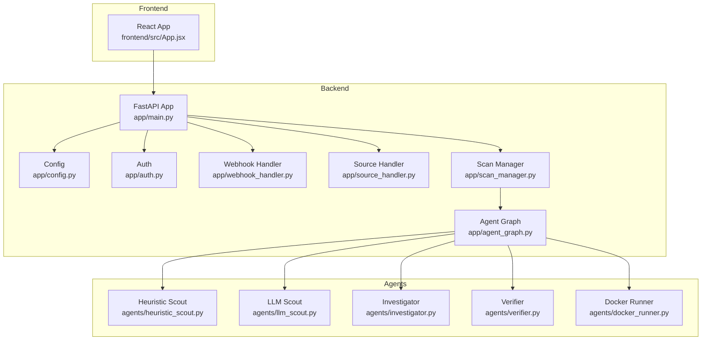
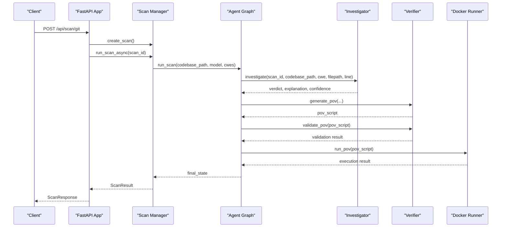
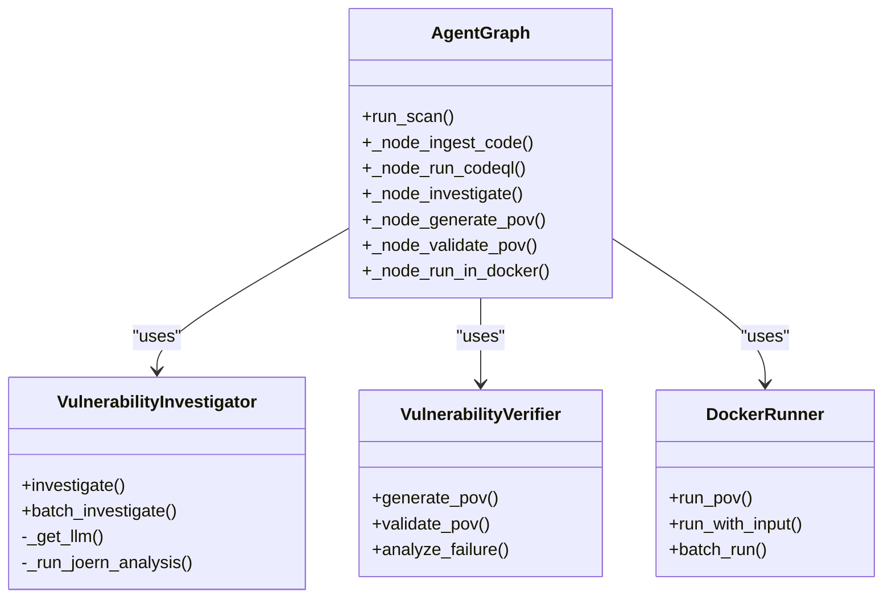
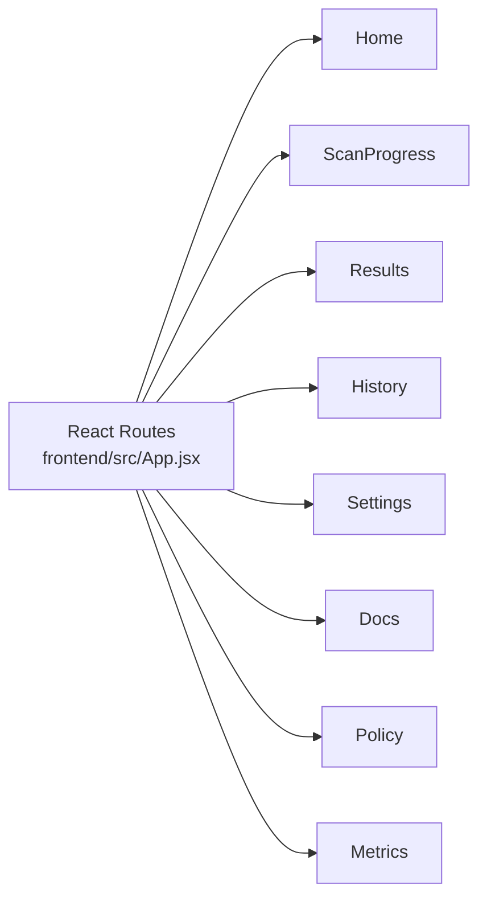
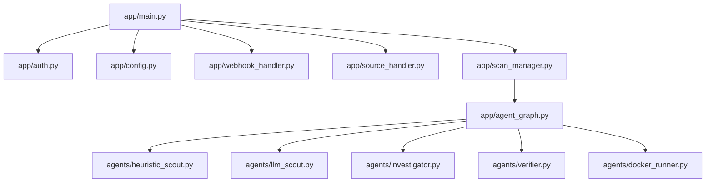

# Core Components

<cite>
**Referenced Files in This Document**
- [app/main.py](file://app/main.py)
- [app/agent_graph.py](file://app/agent_graph.py)
- [app/scan_manager.py](file://app/scan_manager.py)
- [app/config.py](file://app/config.py)
- [app/auth.py](file://app/auth.py)
- [app/webhook_handler.py](file://app/webhook_handler.py)
- [app/source_handler.py](file://app/source_handler.py)
- [agents/heuristic_scout.py](file://agents/heuristic_scout.py)
- [agents/llm_scout.py](file://agents/llm_scout.py)
- [agents/investigator.py](file://agents/investigator.py)
- [agents/verifier.py](file://agents/verifier.py)
- [agents/docker_runner.py](file://agents/docker_runner.py)
- [frontend/src/App.jsx](file://frontend/src/App.jsx)
- [cli/autopov.py](file://cli/autopov.py)
</cite>

## Table of Contents
1. [Introduction](#introduction)
2. [Project Structure](#project-structure)
3. [Core Components](#core-components)
4. [Architecture Overview](#architecture-overview)
5. [Detailed Component Analysis](#detailed-component-analysis)
6. [Dependency Analysis](#dependency-analysis)
7. [Performance Considerations](#performance-considerations)
8. [Troubleshooting Guide](#troubleshooting-guide)
9. [Conclusion](#conclusion)

## Introduction
This document provides comprehensive technical documentation for AutoPoV’s core system components. It covers the multi-agent system architecture, backend services, frontend dashboard, and CLI interface. The focus is on agent roles, orchestration, data flows, configuration management, authentication, and security considerations across all components.

## Project Structure
AutoPoV is organized into distinct layers:
- Backend API: FastAPI application exposing REST endpoints for scanning, monitoring, reporting, and administration.
- Orchestration: Agent graph orchestrating vulnerability detection and PoV generation.
- Agents: Specialized modules implementing heuristic and LLM-based discovery, investigation, validation, and execution.
- Frontend: React-based dashboard with real-time monitoring and navigation.
- CLI: Command-line interface for automation and scripting.
- Supporting services: Authentication, configuration, source handling, webhook integration, and scan lifecycle management.

**Diagram sources**
- [app/main.py:114-122](file://app/main.py#L114-L122)
- [app/config.py:13-254](file://app/config.py#L13-L254)
- [app/auth.py:192-255](file://app/auth.py#L192-L255)
- [app/webhook_handler.py:15-362](file://app/webhook_handler.py#L15-L362)
- [app/source_handler.py:18-381](file://app/source_handler.py#L18-L381)
- [app/scan_manager.py:47-662](file://app/scan_manager.py#L47-L662)
- [app/agent_graph.py:82-168](file://app/agent_graph.py#L82-L168)
- [agents/heuristic_scout.py:13-242](file://agents/heuristic_scout.py#L13-L242)
- [agents/llm_scout.py:32-208](file://agents/llm_scout.py#L32-L208)
- [agents/investigator.py:37-519](file://agents/investigator.py#L37-L519)
- [agents/verifier.py:42-562](file://agents/verifier.py#L42-L562)
- [agents/docker_runner.py:27-377](file://agents/docker_runner.py#L27-L377)

**Section sources**
- [app/main.py:114-122](file://app/main.py#L114-L122)
- [app/config.py:13-254](file://app/config.py#L13-L254)

## Core Components
This section outlines the primary backend services and their responsibilities.

- FastAPI Application
  - Exposes endpoints for initiating scans (Git, ZIP, paste), retrieving status/logs, replaying scans, generating reports, managing API keys, and administrative tasks.
  - Implements CORS, health checks, and SSE streaming for real-time logs.
  - Integrates authentication, rate limiting, and webhook callbacks.

- Agent Graph Orchestrator
  - Defines a LangGraph workflow that orchestrates ingestion, static analysis (CodeQL), autonomous discovery, investigation, PoV generation, validation, and execution.
  - Manages state transitions and conditional branching based on agent outcomes.

- Scan Manager
  - Manages scan lifecycle, background execution, persistence, history, metrics, and cleanup.
  - Provides thread-safe logging and progress tracking.

- Configuration System
  - Centralized settings for models, routing, security, tool availability, and file paths.
  - Validates tool availability (Docker, CodeQL, Joern) and exposes runtime diagnostics.

- Authentication and Authorization
  - API key management with secure hashing, HMAC comparisons, and rate limiting.
  - Admin-only endpoints protected by admin key validation.

- Webhook Integration
  - Handles GitHub and GitLab webhooks, verifies signatures/tokens, parses events, and triggers scans.

- Source Handling
  - Processes ZIP/TAR uploads, raw code paste, and file/folder uploads with security checks against path traversal.

**Section sources**
- [app/main.py:175-768](file://app/main.py#L175-L768)
- [app/agent_graph.py:82-168](file://app/agent_graph.py#L82-L168)
- [app/scan_manager.py:47-662](file://app/scan_manager.py#L47-L662)
- [app/config.py:13-254](file://app/config.py#L13-L254)
- [app/auth.py:40-255](file://app/auth.py#L40-L255)
- [app/webhook_handler.py:15-362](file://app/webhook_handler.py#L15-L362)
- [app/source_handler.py:18-381](file://app/source_handler.py#L18-L381)

## Architecture Overview
The system follows a modular, agent-centric architecture:
- The FastAPI application acts as the entry point and coordinator.
- The Agent Graph defines the end-to-end vulnerability detection pipeline.
- Agents encapsulate specialized logic for discovery, investigation, validation, and execution.
- The Scan Manager coordinates asynchronous execution and persists results.
- The CLI and Frontend consume the REST API for automation and monitoring.

**Diagram sources**
- [app/main.py:204-400](file://app/main.py#L204-L400)
- [app/scan_manager.py:234-264](file://app/scan_manager.py#L234-L264)
- [app/agent_graph.py:691-777](file://app/agent_graph.py#L691-L777)
- [agents/investigator.py:270-432](file://agents/investigator.py#L270-L432)
- [agents/verifier.py:90-224](file://agents/verifier.py#L90-L224)
- [agents/docker_runner.py:62-191](file://agents/docker_runner.py#L62-L191)

## Detailed Component Analysis

### Multi-Agent System Architecture
AutoPoV implements a LangGraph-based agent workflow with the following agents:

- Ingestion Agent
  - Purpose: Ingest codebase into a vector store for retrieval-augmented investigation.
  - Behavior: Attempts ingestion; if it fails, the scan continues without vector context.
  - Integration: Called during the initial ingestion phase of the agent graph.

- Heuristic Scout Agent
  - Purpose: Lightweight pattern-matching to discover potential vulnerabilities across supported CWEs.
  - Behavior: Scans files for heuristic matches and produces candidate findings.
  - Integration: Used when CodeQL is unavailable or as part of autonomous discovery.

- LLM Scout Agent
  - Purpose: Uses an LLM to propose candidate vulnerabilities across sampled files.
  - Behavior: Builds prompts, invokes configured LLM, parses structured output, and caps cost.
  - Integration: Optional enhancement to heuristic discovery.

- Investigator Agent
  - Purpose: Performs retrieval-augmented investigation to determine vulnerability authenticity.
  - Behavior: Retrieves context, optionally runs Joern for specific CWEs, invokes LLM, tracks cost and latency.
  - Integration: Drives the “investigate” node in the agent graph.

- PoV Generator Agent
  - Purpose: Generates Proof-of-Vulnerability scripts tailored to the target language.
  - Behavior: Prompts LLM to produce runnable scripts, captures cost and token usage.
  - Integration: Drives the “generate_pov” node.

- Validator Agent
  - Purpose: Validates PoV scripts using static analysis, unit tests, and LLM analysis.
  - Behavior: Hybrid validation pipeline with fallbacks; records suggestions and issues.
  - Integration: Drives the “validate_pov” node.

- Docker Execution Agent
  - Purpose: Executes PoV scripts in isolated containers with resource limits.
  - Behavior: Writes scripts to temp directories, runs in Docker, captures logs and exit codes.
  - Integration: Drives the “run_in_docker” node.

**Diagram sources**
- [app/agent_graph.py:82-168](file://app/agent_graph.py#L82-L168)
- [agents/investigator.py:37-519](file://agents/investigator.py#L37-L519)
- [agents/verifier.py:42-562](file://agents/verifier.py#L42-L562)
- [agents/docker_runner.py:27-377](file://agents/docker_runner.py#L27-L377)

**Section sources**
- [app/agent_graph.py:82-168](file://app/agent_graph.py#L82-L168)
- [agents/heuristic_scout.py:13-242](file://agents/heuristic_scout.py#L13-L242)
- [agents/llm_scout.py:32-208](file://agents/llm_scout.py#L32-L208)
- [agents/investigator.py:37-519](file://agents/investigator.py#L37-L519)
- [agents/verifier.py:42-562](file://agents/verifier.py#L42-L562)
- [agents/docker_runner.py:27-377](file://agents/docker_runner.py#L27-L377)

### Backend Services

#### FastAPI Application
- Endpoints
  - Health: GET /api/health
  - Config: GET /api/config
  - Scans: POST /api/scan/git, POST /api/scan/zip, POST /api/scan/paste
  - Replay: POST /api/scan/{scan_id}/replay
  - Cancel: POST /api/scan/{scan_id}/cancel
  - Status: GET /api/scan/{scan_id}
  - Logs: GET /api/scan/{scan_id}/stream
  - History: GET /api/history
  - Reports: GET /api/report/{scan_id}
  - Webhooks: POST /api/webhook/github, POST /api/webhook/gitlab
  - API Keys: POST /api/keys/generate, GET /api/keys, DELETE /api/keys/{key_id}
  - Admin: POST /api/admin/cleanup
  - Metrics: GET /api/metrics
  - Learning: GET /api/learning/summary

- Authentication and Rate Limiting
  - Bearer token authentication with optional query param fallback for SSE.
  - Per-key rate limiting for scan-triggering endpoints.

- Real-time Monitoring
  - Server-Sent Events endpoint streams logs and completion status.

**Section sources**
- [app/main.py:175-768](file://app/main.py#L175-L768)
- [app/auth.py:192-255](file://app/auth.py#L192-L255)

#### Agent Graph Orchestration
- Workflow Nodes
  - ingest_code, run_codeql, investigate, generate_pov, validate_pov, run_in_docker, log_confirmed, log_skip, log_failure.
- Conditional Edges
  - Investigate → generate_pov or log_skip based on verdict.
  - Validate → run_in_docker, generate_pov (retry), or log_failure.
  - Loop back to investigate for next finding; end when no more findings.

- CodeQL Integration
  - Detects language, creates database, runs queries, merges results, and cleans up.
  - Falls back to heuristic/LLM-only analysis when unavailable.

- Autonomous Discovery
  - Combines heuristic and optional LLM scout results with CodeQL findings.

**Section sources**
- [app/agent_graph.py:82-168](file://app/agent_graph.py#L82-L168)
- [app/agent_graph.py:241-307](file://app/agent_graph.py#L241-L307)
- [app/agent_graph.py:206-227](file://app/agent_graph.py#L206-L227)

#### Scan Management
- Responsibilities
  - Create, run, and persist scans.
  - Thread-safe logging and progress tracking.
  - History, metrics, and cleanup of old results.
  - Replay scans with preloaded findings.

- Asynchronous Execution
  - Uses thread pool executor to run scans off the main event loop.
  - Supports replay with preselected findings and detected language.

**Section sources**
- [app/scan_manager.py:47-662](file://app/scan_manager.py#L47-L662)

#### Configuration System
- Settings
  - Model selection (online/offline), routing modes, embeddings, vector store, tool paths, Docker settings, cost controls, supported CWEs, and directories.
  - Runtime checks for Docker, CodeQL, Joern, and Kaitai availability.

- Environment Integration
  - Loads from .env with strict typing and validation.

**Section sources**
- [app/config.py:13-254](file://app/config.py#L13-L254)

#### Authentication and Authorization
- API Key Management
  - Secure generation with SHA-256 hashing and HMAC comparisons.
  - Admin-only endpoints protected by admin key validation.
  - Rate limiting enforced per key for scan-triggering endpoints.

- Security Considerations
  - Timing-safe comparisons to prevent timing attacks.
  - Secure storage and periodic flushing of last-used timestamps.

**Section sources**
- [app/auth.py:40-255](file://app/auth.py#L40-L255)

#### Webhook Integration
- Providers
  - GitHub: Signature verification using HMAC-SHA256.
  - GitLab: Token verification using HMAC comparisons.

- Events
  - Push and pull/merge request events parsed to extract repository, branch, commit, and author information.
  - Conditional triggering based on event type and commit validity.

**Section sources**
- [app/webhook_handler.py:15-362](file://app/webhook_handler.py#L15-L362)

#### Source Handling
- Inputs
  - ZIP/TAR extraction with path-traversal protection.
  - Raw code paste with language-aware filename assignment.
  - File/folder uploads with optional structure preservation.

- Utilities
  - Binary detection, language inference, and source information collection.

**Section sources**
- [app/source_handler.py:18-381](file://app/source_handler.py#L18-L381)

### Frontend Dashboard Architecture
- Navigation
  - Routes for Home, Scan Progress, Results, History, Settings, Docs, Policy, and Metrics.
- Real-time Monitoring
  - Uses SSE to stream logs and completion status for active scans.
- Components
  - Modular React components for cards, live logs, selectors, and forms.

**Diagram sources**
- [frontend/src/App.jsx:1-33](file://frontend/src/App.jsx#L1-L33)

**Section sources**
- [frontend/src/App.jsx:1-33](file://frontend/src/App.jsx#L1-L33)

### CLI Interface
- Commands
  - scan: Git repository, ZIP file, or directory scanning with model and CWE selection.
  - paste: Scan code from stdin with language and filename hints.
  - cancel: Cancel a running scan.
  - replay: Replay a completed scan against multiple models.
  - results: Retrieve and display scan results.
  - history: Paginated scan history.
  - policy: Show learning store summaries and model performance.
  - metrics: Display system-wide metrics.
  - health: Check server health and tool availability.
  - report: Download JSON/PDF reports.
  - keys: Admin commands for key generation, listing, and revocation.

- Authentication
  - Reads API key from environment or config file; supports admin key for privileged commands.

**Section sources**
- [cli/autopov.py:1-1096](file://cli/autopov.py#L1-L1096)

## Dependency Analysis
This section maps internal dependencies among core components.

**Diagram sources**
- [app/main.py:19-27](file://app/main.py#L19-L27)
- [app/scan_manager.py:18-20](file://app/scan_manager.py#L18-L20)
- [app/agent_graph.py:19-28](file://app/agent_graph.py#L19-L28)

**Section sources**
- [app/main.py:19-27](file://app/main.py#L19-L27)
- [app/scan_manager.py:18-20](file://app/scan_manager.py#L18-L20)
- [app/agent_graph.py:19-28](file://app/agent_graph.py#L19-L28)

## Performance Considerations
- Concurrency and Threading
  - Scan execution runs in a thread pool to avoid blocking the main event loop.
  - Thread-safe logging with per-scan locks to prevent race conditions.

- Cost Control
  - Configurable maximum cost for LLM operations and per-key rate limits.
  - Cost tracking via token usage and model-specific pricing.

- Tool Availability
  - Graceful degradation when CodeQL or Docker are unavailable.
  - Runtime checks to inform clients about tool availability.

- Disk and Memory Management
  - Cleanup of temporary directories and CodeQL databases.
  - Optional snapshots for replay support with configurable retention.

[No sources needed since this section provides general guidance]

## Troubleshooting Guide
- Authentication Issues
  - Verify API key validity and ensure proper Bearer token format.
  - Confirm admin key for admin-only endpoints.

- Rate Limiting
  - Excessive scan requests trigger 429 responses; reduce submission frequency.

- Webhook Problems
  - Validate signatures/tokens and ensure correct headers.
  - Confirm event types and payload structure for provider-specific formats.

- Scan Failures
  - Check logs via SSE endpoint for detailed error messages.
  - Review scan history for persisted results and timestamps.

- Tool Availability
  - Use health endpoint to confirm Docker, CodeQL, and Joern status.
  - Adjust model mode and provider settings accordingly.

**Section sources**
- [app/auth.py:221-250](file://app/auth.py#L221-L250)
- [app/webhook_handler.py:196-336](file://app/webhook_handler.py#L196-L336)
- [app/main.py:548-583](file://app/main.py#L548-L583)
- [app/config.py:162-210](file://app/config.py#L162-L210)

## Conclusion
AutoPoV integrates a robust multi-agent system orchestrated by a LangGraph workflow, backed by a FastAPI service with strong authentication, real-time monitoring, and comprehensive CLI and frontend interfaces. The architecture emphasizes resilience through fallback mechanisms, cost control, and security-conscious design, enabling automated, scalable vulnerability detection and PoV generation across diverse codebases.