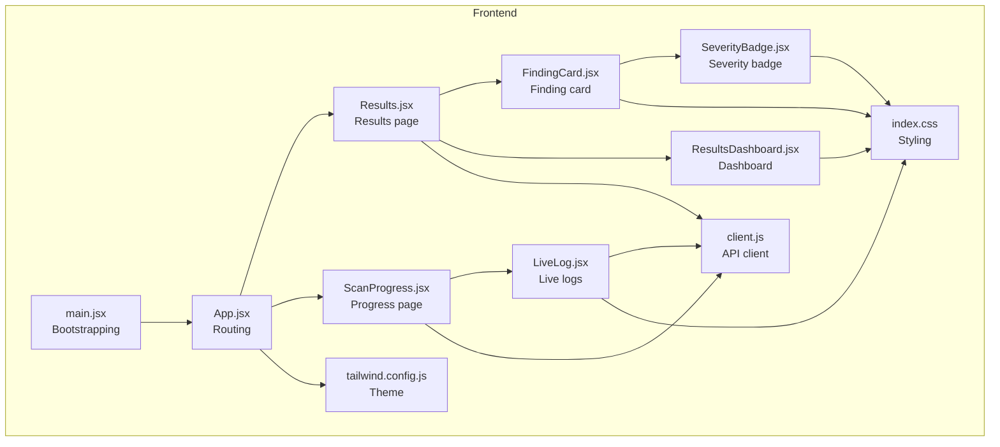
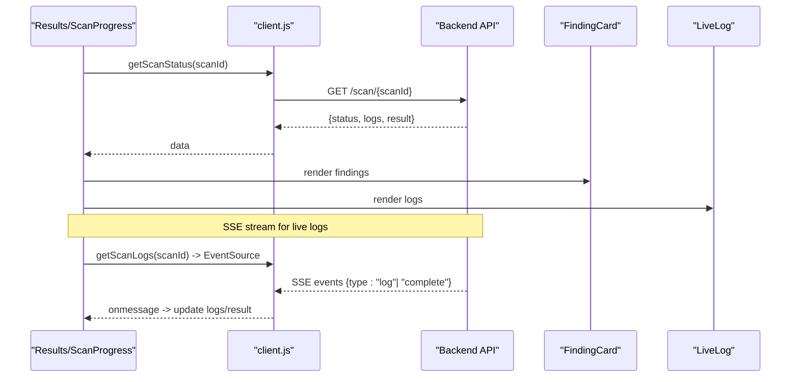
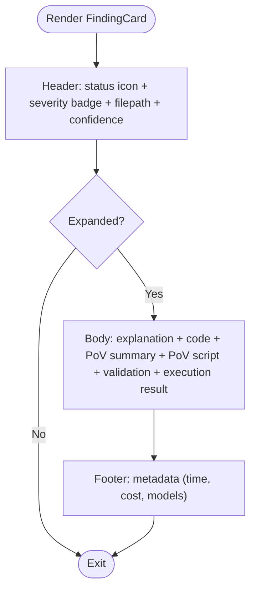
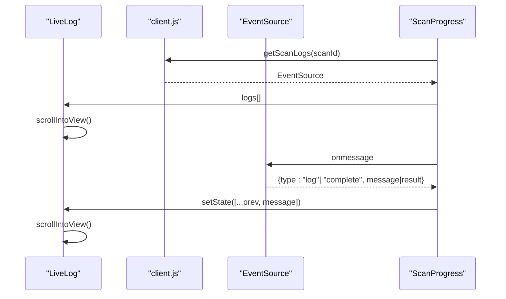
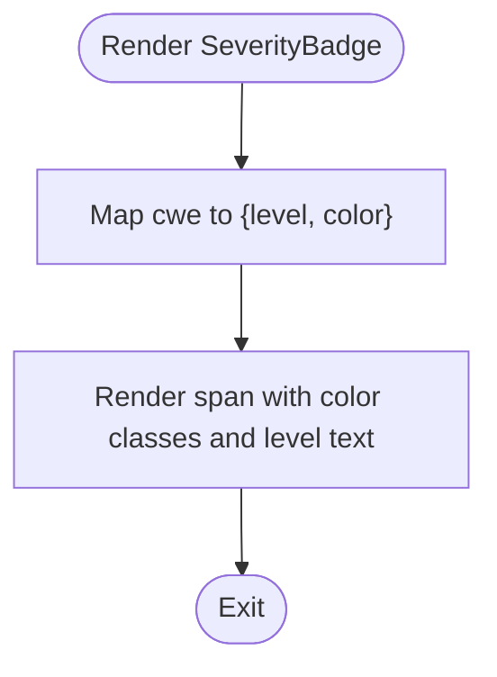
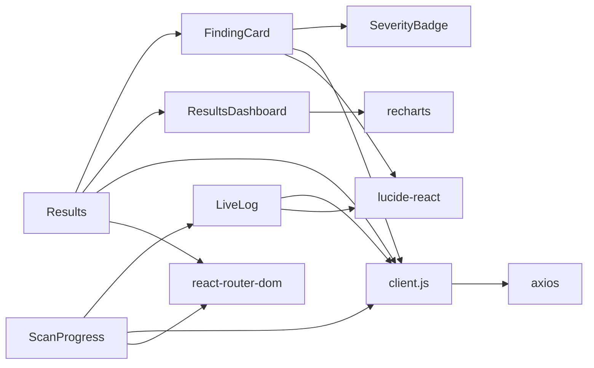

# Core UI Components

<cite>
**Referenced Files in This Document**
- [FindingCard.jsx](file://frontend/src/components/FindingCard.jsx)
- [LiveLog.jsx](file://frontend/src/components/LiveLog.jsx)
- [SeverityBadge.jsx](file://frontend/src/components/SeverityBadge.jsx)
- [Results.jsx](file://frontend/src/pages/Results.jsx)
- [ScanProgress.jsx](file://frontend/src/pages/ScanProgress.jsx)
- [ResultsDashboard.jsx](file://frontend/src/components/ResultsDashboard.jsx)
- [client.js](file://frontend/src/api/client.js)
- [index.css](file://frontend/src/index.css)
- [tailwind.config.js](file://frontend/tailwind.config.js)
- [package.json](file://frontend/package.json)
- [App.jsx](file://frontend/src/App.jsx)
- [main.jsx](file://frontend/src/main.jsx)
</cite>

## Table of Contents
1. [Introduction](#introduction)
2. [Project Structure](#project-structure)
3. [Core Components](#core-components)
4. [Architecture Overview](#architecture-overview)
5. [Detailed Component Analysis](#detailed-component-analysis)
6. [Dependency Analysis](#dependency-analysis)
7. [Performance Considerations](#performance-considerations)
8. [Troubleshooting Guide](#troubleshooting-guide)
9. [Conclusion](#conclusion)

## Introduction
This document provides comprehensive documentation for AutoPoV’s core UI components: FindingCard, LiveLog, and SeverityBadge. It details each component’s API, props, rendering logic, composition patterns, event handling, and integration with backend data sources. It also covers styling approaches, responsive design, and accessibility considerations derived from the codebase.

## Project Structure
The frontend is a React application built with Vite, styled using Tailwind CSS. The three core components are located under frontend/src/components, with integration points in pages such as Results and ScanProgress. Styling is centralized in index.css with theme extensions in tailwind.config.js.

**Diagram sources**
- [App.jsx:12-30](file://frontend/src/App.jsx#L12-L30)
- [main.jsx:7-13](file://frontend/src/main.jsx#L7-L13)
- [Results.jsx:5,278](file://frontend/src/pages/Results.jsx#L5,L278)
- [ScanProgress.jsx:4,168](file://frontend/src/pages/ScanProgress.jsx#L4,L168)
- [FindingCard.jsx:3,40](file://frontend/src/components/FindingCard.jsx#L3,L40)
- [LiveLog.jsx:24,30](file://frontend/src/components/LiveLog.jsx#L24,L30)
- [SeverityBadge.jsx:19,23](file://frontend/src/components/SeverityBadge.jsx#L19,L23)
- [ResultsDashboard.jsx:5,8](file://frontend/src/components/ResultsDashboard.jsx#L5,L8)
- [client.js:1,78](file://frontend/src/api/client.js#L1,L78)
- [index.css:1,73](file://frontend/src/index.css#L1,L73)
- [tailwind.config.js:1,30](file://frontend/tailwind.config.js#L1,L30)

**Section sources**
- [App.jsx:12-30](file://frontend/src/App.jsx#L12-L30)
- [main.jsx:7-13](file://frontend/src/main.jsx#L7-L13)
- [package.json:12-32](file://frontend/package.json#L12-L32)

## Core Components
This section summarizes the responsibilities and props for each component.

- FindingCard
  - Purpose: Renders a single vulnerability finding with expandable details, status icons, severity badge, confidence indicator, and PoV execution results.
  - Props:
    - finding: object containing fields such as final_status, cwe_type, filepath, line_number, confidence, llm_explanation, code_chunk, pov_script, pov_result, validation_result, inference_time_s, cost_usd, model_used, pov_model_used.
  - Composition: Uses SeverityBadge for severity display; renders conditional sections for PoV script, validation details, and execution results.

- LiveLog
  - Purpose: Displays a scrolling terminal-like log stream with timestamp parsing and color-coded messages.
  - Props:
    - logs: array of log strings.
  - Behavior: Automatically scrolls to the latest entry; parses optional timestamps and applies color classes based on message keywords.

- SeverityBadge
  - Purpose: Visual indicator of vulnerability severity mapped from CWE identifiers.
  - Props:
    - cwe: string identifier (e.g., "CWE-89").
  - Behavior: Returns a colored badge with severity level ("Critical", "High", "Medium", "Low").

**Section sources**
- [FindingCard.jsx:5-200](file://frontend/src/components/FindingCard.jsx#L5-L200)
- [LiveLog.jsx:4-67](file://frontend/src/components/LiveLog.jsx#L4-L67)
- [SeverityBadge.jsx:1-27](file://frontend/src/components/SeverityBadge.jsx#L1-L27)

## Architecture Overview
The components integrate with backend APIs via a shared client. Results and ScanProgress pages orchestrate data fetching and pass props to the UI components. LiveLog streams logs via Server-Sent Events (SSE) with a fallback to polling.

**Diagram sources**
- [Results.jsx:24-41](file://frontend/src/pages/Results.jsx#L24-L41)
- [ScanProgress.jsx:16-79](file://frontend/src/pages/ScanProgress.jsx#L16-L79)
- [client.js:44-47](file://frontend/src/api/client.js#L44-L47)

**Section sources**
- [Results.jsx:24-41](file://frontend/src/pages/Results.jsx#L24-L41)
- [ScanProgress.jsx:16-79](file://frontend/src/pages/ScanProgress.jsx#L16-L79)
- [client.js:44-47](file://frontend/src/api/client.js#L44-L47)

## Detailed Component Analysis

### FindingCard
- API and Props
  - Props: finding (object)
  - Rendering logic:
    - Header displays status icon (confirmed/skipped/default), severity badge, file path and line number, and confidence percentage.
    - Expandable body shows explanation, vulnerable code chunk, PoV summary, PoV script, validation details, and execution result.
    - Footer metadata includes inference time, cost, and model names.
- Rendering logic highlights
  - Status icon determined by final_status.
  - Confidence color scale based on numeric threshold.
  - Conditional rendering for optional fields (code_chunk, pov_script, validation_result, pov_result).
  - PoV execution result section toggles styles based on whether vulnerability was triggered.
- Composition
  - Uses SeverityBadge for cwe_type.
  - Integrates with Results page to render lists of findings filtered by status.

**Diagram sources**
- [FindingCard.jsx:29-196](file://frontend/src/components/FindingCard.jsx#L29-L196)

**Section sources**
- [FindingCard.jsx:5-200](file://frontend/src/components/FindingCard.jsx#L5-L200)
- [Results.jsx:333-378](file://frontend/src/pages/Results.jsx#L333-L378)

### LiveLog
- API and Props
  - Props: logs (array of strings)
  - Rendering logic:
    - Parses optional timestamp prefix from each log line.
    - Applies color classes based on keywords: errors/failure (red), success/confirmed (green), vulnerability triggered (bold red).
    - Auto-scrolls to bottom on log updates.
- Real-time streaming
  - Uses getScanLogs(scanId) returning an EventSource for SSE.
  - Onmessage handles "log" and "complete" events to append logs and finalize the run.

**Diagram sources**
- [LiveLog.jsx:7-9](file://frontend/src/components/LiveLog.jsx#L7-L9)
- [LiveLog.jsx:11-21](file://frontend/src/components/LiveLog.jsx#L11-L21)
- [client.js:44-47](file://frontend/src/api/client.js#L44-L47)
- [ScanProgress.jsx:53-71](file://frontend/src/pages/ScanProgress.jsx#L53-L71)

**Section sources**
- [LiveLog.jsx:4-67](file://frontend/src/components/LiveLog.jsx#L4-L67)
- [ScanProgress.jsx:53-71](file://frontend/src/pages/ScanProgress.jsx#L53-L71)
- [client.js:44-47](file://frontend/src/api/client.js#L44-L47)

### SeverityBadge
- API and Props
  - Props: cwe (string)
  - Rendering logic:
    - Maps specific CWE identifiers to severity levels and associated Tailwind color classes.
    - Renders a small rounded badge displaying the severity label.

**Diagram sources**
- [SeverityBadge.jsx:2-15](file://frontend/src/components/SeverityBadge.jsx#L2-L15)

**Section sources**
- [SeverityBadge.jsx:1-27](file://frontend/src/components/SeverityBadge.jsx#L1-L27)

## Dependency Analysis
- Component dependencies
  - FindingCard depends on SeverityBadge and renders conditionally based on finding payload.
  - LiveLog depends on client.js for SSE and uses index.css for styling.
  - Results and ScanProgress depend on client.js for polling and SSE, and pass props to child components.
- External libraries
  - axios for HTTP requests.
  - react-router-dom for routing.
  - lucide-react for icons.
  - recharts for dashboard charts.

**Diagram sources**
- [FindingCard.jsx:3](file://frontend/src/components/FindingCard.jsx#L3)
- [Results.jsx:5,278](file://frontend/src/pages/Results.jsx#L5,L278)
- [ScanProgress.jsx:4](file://frontend/src/pages/ScanProgress.jsx#L4)
- [client.js:1,78](file://frontend/src/api/client.js#L1,L78)
- [package.json:12-18](file://frontend/package.json#L12-L18)

**Section sources**
- [package.json:12-18](file://frontend/package.json#L12-L18)

## Performance Considerations
- Rendering
  - FindingCard uses conditional rendering to avoid unnecessary DOM nodes; keep this pattern for large findings lists.
  - LiveLog auto-scrolls on every log update; consider throttling or virtualization for very high-frequency logs.
- Data fetching
  - ScanProgress polls status every 2 seconds; ensure backend can sustain load and consider increasing interval if needed.
  - SSE provides efficient real-time updates; polling acts as a fallback.
- Styling
  - Tailwind utilities are applied directly; ensure unused classes are purged via Tailwind configuration.

[No sources needed since this section provides general guidance]

## Troubleshooting Guide
- LiveLog not updating
  - Verify SSE endpoint availability and API key inclusion in the EventSource URL.
  - Confirm that ScanProgress sets up and tears down the EventSource properly.
- FindingCard missing sections
  - Ensure the finding payload includes required fields (e.g., code_chunk, pov_script, validation_result, pov_result).
- Authentication failures
  - Confirm API key presence in localStorage or environment variables; the client adds Authorization headers automatically.

**Section sources**
- [client.js:44-47](file://frontend/src/api/client.js#L44-L47)
- [ScanProgress.jsx:53-71](file://frontend/src/pages/ScanProgress.jsx#L53-L71)
- [client.js:18-25](file://frontend/src/api/client.js#L18-L25)

## Conclusion
FindingCard, LiveLog, and SeverityBadge form the backbone of AutoPoV’s findings and progress UI. They are designed around a clean separation of concerns: data orchestration in pages, reusable UI components, and a thin API client. The components leverage Tailwind for styling, Lucide icons for clarity, and SSE for real-time updates, resulting in a responsive and accessible interface suitable for vulnerability analysis workflows.