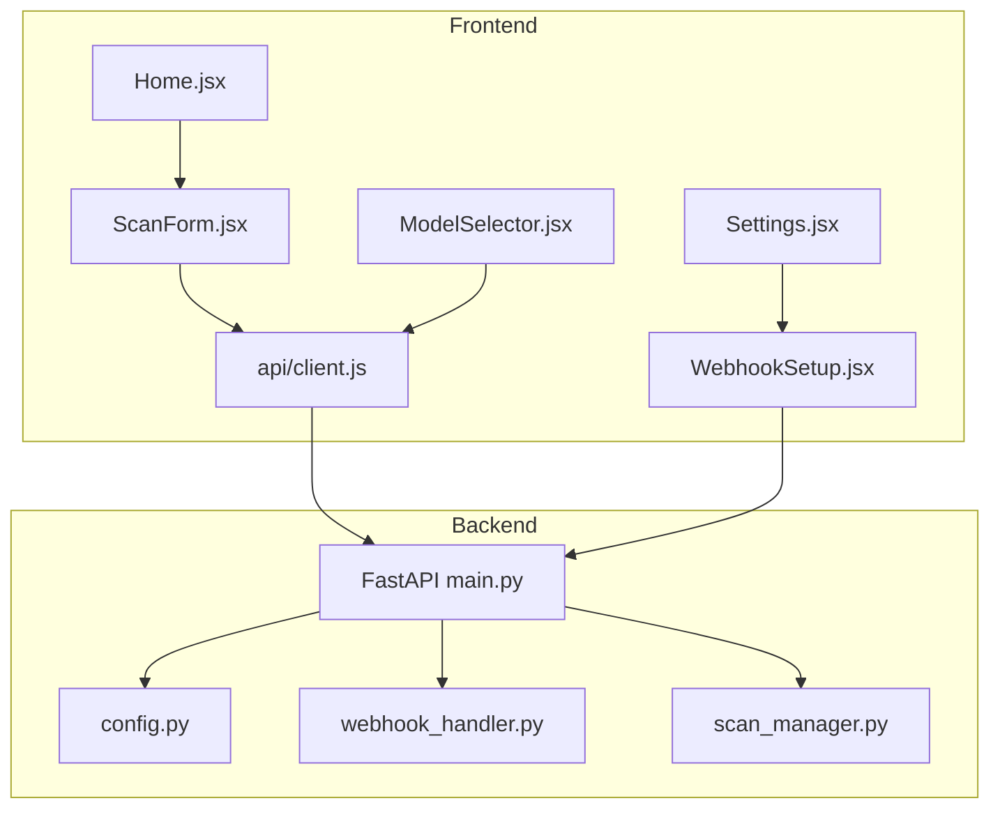
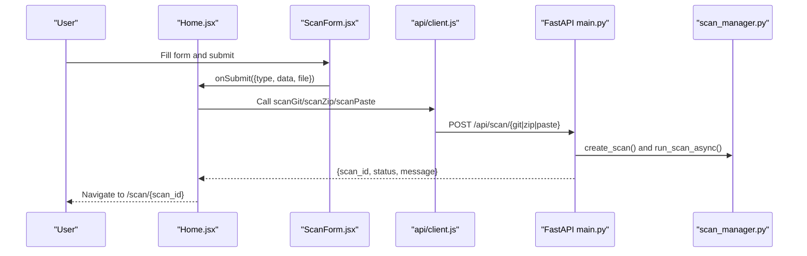
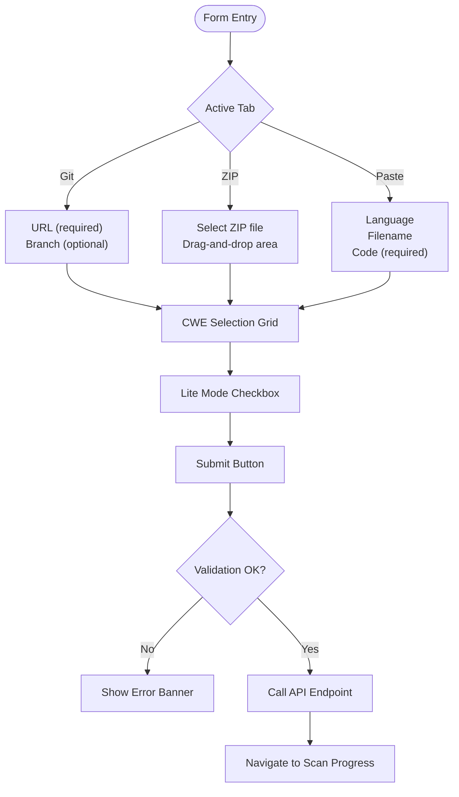
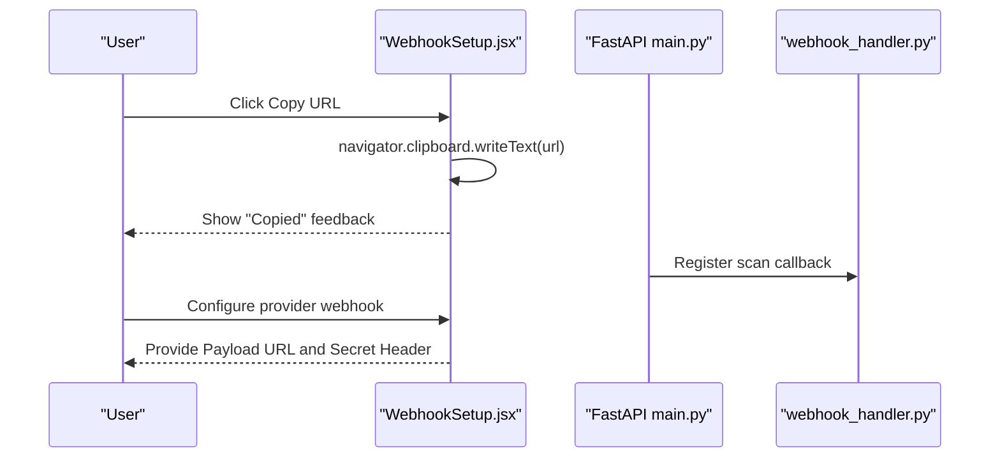
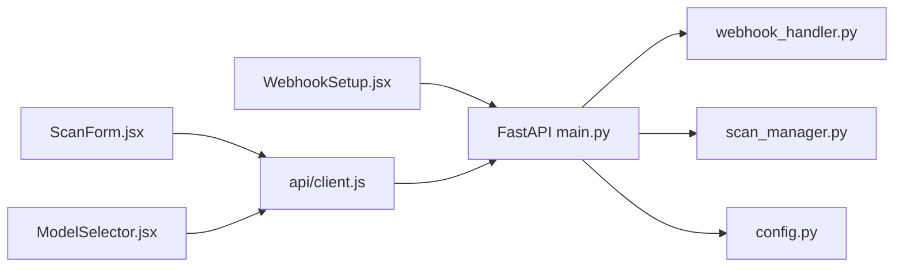

# Form Controls

<cite>
**Referenced Files in This Document**
- [ModelSelector.jsx](file://frontend/src/components/ModelSelector.jsx)
- [ScanForm.jsx](file://frontend/src/components/ScanForm.jsx)
- [WebhookSetup.jsx](file://frontend/src/components/WebhookSetup.jsx)
- [Home.jsx](file://frontend/src/pages/Home.jsx)
- [Settings.jsx](file://frontend/src/pages/Settings.jsx)
- [client.js](file://frontend/src/api/client.js)
- [main.py](file://app/main.py)
- [config.py](file://app/config.py)
- [webhook_handler.py](file://app/webhook_handler.py)
- [scan_manager.py](file://app/scan_manager.py)
</cite>

## Table of Contents
1. [Introduction](#introduction)
2. [Project Structure](#project-structure)
3. [Core Components](#core-components)
4. [Architecture Overview](#architecture-overview)
5. [Detailed Component Analysis](#detailed-component-analysis)
6. [Dependency Analysis](#dependency-analysis)
7. [Performance Considerations](#performance-considerations)
8. [Troubleshooting Guide](#troubleshooting-guide)
9. [Conclusion](#conclusion)

## Introduction
This document provides comprehensive technical documentation for AutoPoV's form control components: ModelSelector, ScanForm, and WebhookSetup. It explains validation logic, input handling, state management, form submission patterns, error handling, user feedback mechanisms, accessibility features, validation rules, and backend API integrations. The goal is to enable developers to understand, extend, and troubleshoot these forms effectively.

## Project Structure
The form controls live in the frontend under the components directory and integrate with the backend API endpoints defined in the FastAPI application. The Settings page hosts the WebhookSetup component, while the Home page integrates the ScanForm and orchestrates submission to the backend.

**Diagram sources**
- [ModelSelector.jsx:1-88](file://frontend/src/components/ModelSelector.jsx#L1-L88)
- [ScanForm.jsx:1-249](file://frontend/src/components/ScanForm.jsx#L1-L249)
- [WebhookSetup.jsx:1-89](file://frontend/src/components/WebhookSetup.jsx#L1-L89)
- [Home.jsx:1-108](file://frontend/src/pages/Home.jsx#L1-L108)
- [Settings.jsx:1-306](file://frontend/src/pages/Settings.jsx#L1-L306)
- [client.js:1-78](file://frontend/src/api/client.js#L1-L78)
- [main.py:1-200](file://app/main.py#L1-L200)
- [config.py:1-255](file://app/config.py#L1-L255)
- [webhook_handler.py:1-363](file://app/webhook_handler.py#L1-L363)
- [scan_manager.py:1-663](file://app/scan_manager.py#L1-L663)

**Section sources**
- [ModelSelector.jsx:1-88](file://frontend/src/components/ModelSelector.jsx#L1-L88)
- [ScanForm.jsx:1-249](file://frontend/src/components/ScanForm.jsx#L1-L249)
- [WebhookSetup.jsx:1-89](file://frontend/src/components/WebhookSetup.jsx#L1-L89)
- [Home.jsx:1-108](file://frontend/src/pages/Home.jsx#L1-L108)
- [Settings.jsx:1-306](file://frontend/src/pages/Settings.jsx#L1-L306)
- [client.js:1-78](file://frontend/src/api/client.js#L1-L78)
- [main.py:1-200](file://app/main.py#L1-L200)
- [config.py:1-255](file://app/config.py#L1-L255)
- [webhook_handler.py:1-363](file://app/webhook_handler.py#L1-L363)
- [scan_manager.py:1-663](file://app/scan_manager.py#L1-L663)

## Core Components
- ModelSelector: Allows switching between online and offline model modes and selects a specific model. It exposes value and onChange props to integrate with parent forms.
- ScanForm: Multi-tab form for initiating vulnerability scans from Git repositories, ZIP uploads, or pasted code. Handles CWE selection, optional lite mode, and submission to backend endpoints.
- WebhookSetup: Provides pre-configured webhook URLs and secrets for GitHub and GitLab, with clipboard copy functionality and environment variable guidance.

**Section sources**
- [ModelSelector.jsx:4-88](file://frontend/src/components/ModelSelector.jsx#L4-L88)
- [ScanForm.jsx:4-249](file://frontend/src/components/ScanForm.jsx#L4-L249)
- [WebhookSetup.jsx:4-89](file://frontend/src/components/WebhookSetup.jsx#L4-L89)

## Architecture Overview
The form controls communicate with the backend through Axios-based API clients. The Home page coordinates form submissions and navigates to scan progress/results. Backend endpoints validate requests, create scans, and run them asynchronously. Webhooks integrate with Git providers to trigger scans automatically.

**Diagram sources**
- [Home.jsx:12-56](file://frontend/src/pages/Home.jsx#L12-L56)
- [client.js:32-40](file://frontend/src/api/client.js#L32-L40)
- [main.py:204-285](file://app/main.py#L204-L285)
- [scan_manager.py:234-264](file://app/scan_manager.py#L234-L264)

## Detailed Component Analysis

### ModelSelector
ModelSelector manages model mode (online/offline) and model selection. It exposes a controlled select input and toggles between two predefined model lists. The component does not perform validation itself; it relies on the parent to enforce constraints.

- State management
  - mode: Tracks whether online or offline mode is active.
  - models: Computed list based on mode.
- Props
  - value: Current model identifier.
  - onChange: Callback invoked with the selected model value.
- Behavior
  - Mode toggle switches between online and offline model sets.
  - Select dropdown renders model label and provider.
- Accessibility
  - Uses semantic labels and keyboard-accessible buttons.
- Integration
  - Designed to be embedded in forms that pass value and onChange up to parent state.

Validation and error handling
- No built-in validation; parent components should validate selections and provide feedback.

Backend integration
- Model selection is handled by backend routing and configuration. The frontend passes the chosen model to the backend, which applies routing policies.

**Section sources**
- [ModelSelector.jsx:4-88](file://frontend/src/components/ModelSelector.jsx#L4-L88)
- [config.py:37-44](file://app/config.py#L37-L44)
- [config.py:156-160](file://app/config.py#L156-L160)

### ScanForm
ScanForm is a comprehensive form for initiating vulnerability scans across three input modes: Git repository, ZIP upload, and pasted code. It includes CWE selection, optional lite mode, and submission handling.

- State management
  - activeTab: Tracks the currently selected input mode.
  - formData: Holds inputs for each tab (URL, branch, code, language, filename, CWEs, lite).
  - selectedFile: Tracks the uploaded ZIP file.
- Tabs and inputs
  - Git: URL input (required), optional branch.
  - ZIP: File picker (required), drag-and-drop area.
  - Paste: Language selector, optional filename, required code textarea.
- CWE selection
  - Predefined list of high-impact web vulnerabilities; users can toggle selections.
- Submission
  - onSubmit prop receives {type, data, file}.
  - Submits to appropriate backend endpoint based on type.
- Loading state
  - isLoading prop disables the submit button and shows a spinner.

Validation and error handling
- HTML5 required attributes on inputs ensure basic validation.
- Parent Home.jsx handles errors from API calls and displays user-friendly messages.
- Lite mode checkbox toggles a boolean flag passed to the backend.

User feedback mechanisms
- Disabled submit button during loading.
- Spinner animation during submission.
- Error banner with descriptive messages.

Accessibility features
- Semantic labels and placeholders.
- Focus styles for interactive elements.
- Keyboard navigation for tabs and checkboxes.

Backend integration
- Git: POST /api/scan/git with JSON payload.
- ZIP: POST /api/scan/zip with multipart/form-data.
- Paste: POST /api/scan/paste with JSON payload.

**Diagram sources**
- [ScanForm.jsx:4-249](file://frontend/src/components/ScanForm.jsx#L4-L249)
- [Home.jsx:12-56](file://frontend/src/pages/Home.jsx#L12-L56)

**Section sources**
- [ScanForm.jsx:4-249](file://frontend/src/components/ScanForm.jsx#L4-L249)
- [Home.jsx:12-56](file://frontend/src/pages/Home.jsx#L12-L56)
- [client.js:32-40](file://frontend/src/api/client.js#L32-L40)

### WebhookSetup
WebhookSetup provides configuration details for integrating AutoPoV with GitHub and GitLab webhooks. It displays the payload URLs, secret headers, and setup locations, and allows copying URLs to clipboard.

- State management
  - copied: Tracks which webhook URL was recently copied.
- Dynamic URL construction
  - Uses window.location.origin and replaces port to derive backend URL.
- Clipboard integration
  - Copies URL to clipboard and shows visual feedback.
- Environment variables
  - Notes required secrets for signature verification.

Backend integration
- GitHub: /api/webhook/github with X-Hub-Signature-256 verification.
- GitLab: /api/webhook/gitlab with X-Gitlab-Token verification.

**Diagram sources**
- [WebhookSetup.jsx:4-89](file://frontend/src/components/WebhookSetup.jsx#L4-L89)
- [main.py:101-105](file://app/main.py#L101-L105)
- [webhook_handler.py:15-24](file://app/webhook_handler.py#L15-L24)

**Section sources**
- [WebhookSetup.jsx:4-89](file://frontend/src/components/WebhookSetup.jsx#L4-L89)
- [Settings.jsx:181-182](file://frontend/src/pages/Settings.jsx#L181-L182)
- [webhook_handler.py:15-24](file://app/webhook_handler.py#L15-L24)

## Dependency Analysis
The form components depend on shared API clients and backend endpoints. The backend enforces validation via Pydantic models and performs asynchronous scan execution.

**Diagram sources**
- [ScanForm.jsx:1-249](file://frontend/src/components/ScanForm.jsx#L1-L249)
- [ModelSelector.jsx:1-88](file://frontend/src/components/ModelSelector.jsx#L1-L88)
- [WebhookSetup.jsx:1-89](file://frontend/src/components/WebhookSetup.jsx#L1-L89)
- [client.js:1-78](file://frontend/src/api/client.js#L1-L78)
- [main.py:1-200](file://app/main.py#L1-L200)
- [webhook_handler.py:1-363](file://app/webhook_handler.py#L1-L363)
- [scan_manager.py:1-663](file://app/scan_manager.py#L1-L663)
- [config.py:1-255](file://app/config.py#L1-L255)

**Section sources**
- [client.js:1-78](file://frontend/src/api/client.js#L1-L78)
- [main.py:1-200](file://app/main.py#L1-L200)
- [config.py:1-255](file://app/config.py#L1-L255)

## Performance Considerations
- Asynchronous scan execution: Backend runs scans in background tasks to avoid blocking API responses.
- Lightweight frontend forms: Minimal state updates and efficient rendering.
- Efficient model routing: Backend configuration supports online/offline routing and cost control.

## Troubleshooting Guide
Common issues and resolutions:
- API key errors
  - Ensure API key is saved in Settings and included in Authorization header.
  - Verify environment variables or localStorage value.
- Model mode mismatch
  - Confirm MODEL_MODE and MODEL_NAME align with backend configuration.
- ZIP upload failures
  - Ensure multipart/form-data headers are preserved when sending ZIP files.
- Webhook signature verification failures
  - Set GITHUB_WEBHOOK_SECRET or GITLAB_WEBHOOK_SECRET environment variables.
  - Verify provider webhook secret header matches backend expectations.

**Section sources**
- [Settings.jsx:29-33](file://frontend/src/pages/Settings.jsx#L29-L33)
- [client.js:18-25](file://frontend/src/api/client.js#L18-L25)
- [config.py:69-71](file://app/config.py#L69-L71)
- [webhook_handler.py:25-73](file://app/webhook_handler.py#L25-L73)

## Conclusion
The form controls provide a robust, accessible, and extensible foundation for configuring and triggering vulnerability scans. They integrate seamlessly with backend endpoints, enforce validation through Pydantic models, and offer clear user feedback. The WebhookSetup component enables automated scanning workflows with secure signature verification.