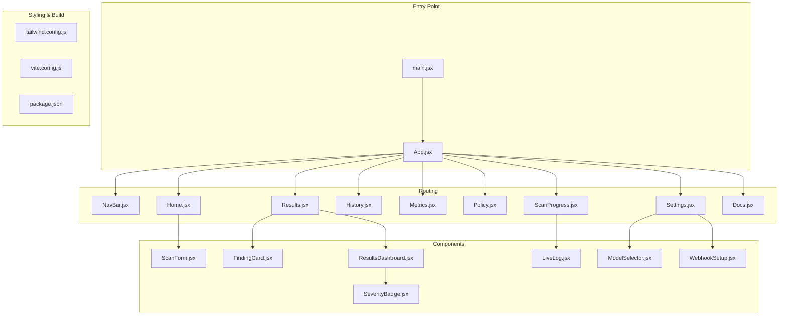
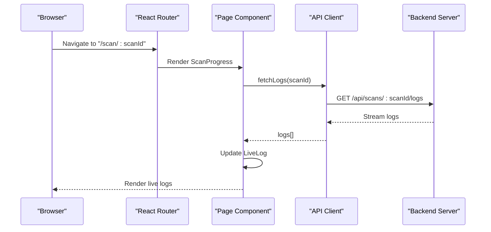
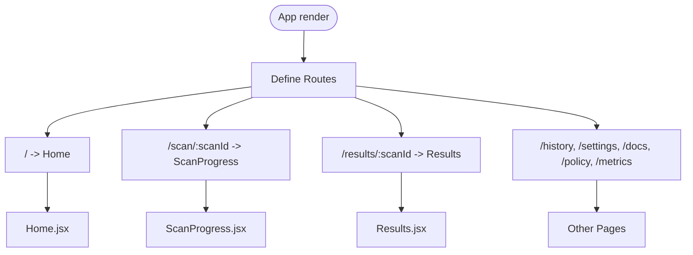
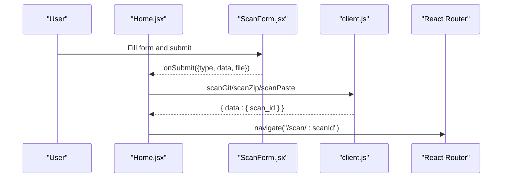
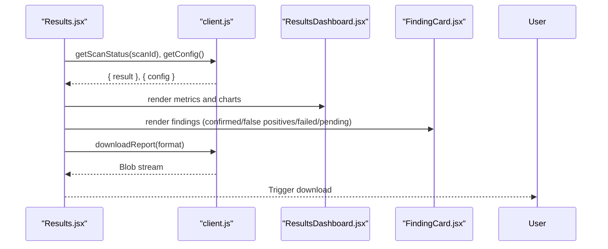
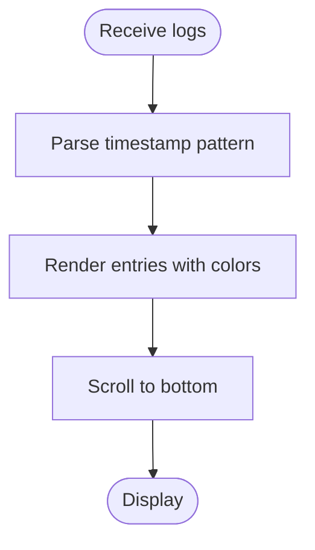
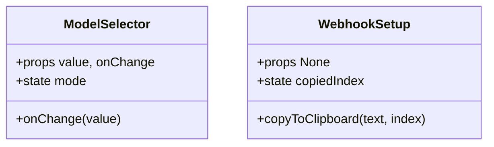
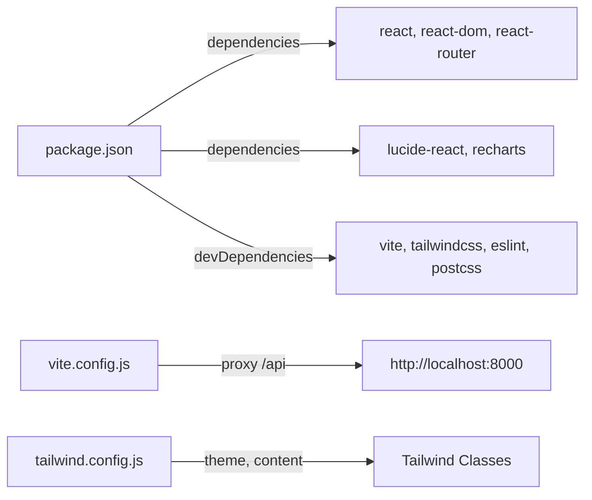

# Frontend Dashboard

<cite>
**Referenced Files in This Document**
- [App.jsx](file://frontend/src/App.jsx)
- [main.jsx](file://frontend/src/main.jsx)
- [NavBar.jsx](file://frontend/src/components/NavBar.jsx)
- [FindingCard.jsx](file://frontend/src/components/FindingCard.jsx)
- [LiveLog.jsx](file://frontend/src/components/LiveLog.jsx)
- [ModelSelector.jsx](file://frontend/src/components/ModelSelector.jsx)
- [ResultsDashboard.jsx](file://frontend/src/components/ResultsDashboard.jsx)
- [ScanForm.jsx](file://frontend/src/components/ScanForm.jsx)
- [SeverityBadge.jsx](file://frontend/src/components/SeverityBadge.jsx)
- [WebhookSetup.jsx](file://frontend/src/components/WebhookSetup.jsx)
- [Home.jsx](file://frontend/src/pages/Home.jsx)
- [Results.jsx](file://frontend/src/pages/Results.jsx)
- [Docs.jsx](file://frontend/src/pages/Docs.jsx)
- [History.jsx](file://frontend/src/pages/History.jsx)
- [Metrics.jsx](file://frontend/src/pages/Metrics.jsx)
- [Policy.jsx](file://frontend/src/pages/Policy.jsx)
- [ScanProgress.jsx](file://frontend/src/pages/ScanProgress.jsx)
- [Settings.jsx](file://frontend/src/pages/Settings.jsx)
- [client.js](file://frontend/src/api/client.js)
- [package.json](file://frontend/package.json)
- [vite.config.js](file://frontend/vite.config.js)
- [tailwind.config.js](file://frontend/tailwind.config.js)
</cite>

## Table of Contents
1. [Introduction](#introduction)
2. [Project Structure](#project-structure)
3. [Core Components](#core-components)
4. [Architecture Overview](#architecture-overview)
5. [Detailed Component Analysis](#detailed-component-analysis)
6. [Dependency Analysis](#dependency-analysis)
7. [Performance Considerations](#performance-considerations)
8. [Troubleshooting Guide](#troubleshooting-guide)
9. [Conclusion](#conclusion)
10. [Appendices](#appendices)

## Introduction
This document describes the React-based frontend dashboard for AutoPoV, focusing on application architecture, component library, page structure, real-time monitoring, state management, styling, and build configuration. It also covers component APIs, event handling, backend integration, responsive design, accessibility, and performance optimization techniques.

## Project Structure
The frontend is a Vite-managed React application with:
- A routing-driven layout with a navigation bar and page routes
- A component library for scanning, results visualization, and configuration
- Pages for home, history, metrics, policy, results, scan progress, and settings
- Styling via Tailwind CSS with a custom theme and dark mode support
- Build configuration with development proxying to the backend API

**Diagram sources**
- [main.jsx:1-14](file://frontend/src/main.jsx#L1-L14)
- [App.jsx:12-30](file://frontend/src/App.jsx#L12-L30)
- [NavBar.jsx:1-78](file://frontend/src/components/NavBar.jsx#L1-L78)
- [Home.jsx:1-108](file://frontend/src/pages/Home.jsx#L1-L108)
- [Results.jsx:1-434](file://frontend/src/pages/Results.jsx#L1-L434)
- [ScanForm.jsx:1-249](file://frontend/src/components/ScanForm.jsx#L1-L249)
- [ResultsDashboard.jsx:1-289](file://frontend/src/components/ResultsDashboard.jsx#L1-L289)
- [FindingCard.jsx:1-200](file://frontend/src/components/FindingCard.jsx#L1-L200)
- [LiveLog.jsx:1-67](file://frontend/src/components/LiveLog.jsx#L1-L67)
- [ModelSelector.jsx:1-88](file://frontend/src/components/ModelSelector.jsx#L1-L88)
- [SeverityBadge.jsx:1-27](file://frontend/src/components/SeverityBadge.jsx#L1-L27)
- [WebhookSetup.jsx:1-89](file://frontend/src/components/WebhookSetup.jsx#L1-L89)
- [tailwind.config.js:1-30](file://frontend/tailwind.config.js#L1-L30)
- [vite.config.js:1-21](file://frontend/vite.config.js#L1-L21)
- [package.json:1-34](file://frontend/package.json#L1-L34)

**Section sources**
- [main.jsx:1-14](file://frontend/src/main.jsx#L1-L14)
- [App.jsx:12-30](file://frontend/src/App.jsx#L12-L30)
- [package.json:6-11](file://frontend/package.json#L6-L11)
- [vite.config.js:7-19](file://frontend/vite.config.js#L7-L19)
- [tailwind.config.js:3-29](file://frontend/tailwind.config.js#L3-L29)

## Core Components
This section documents the reusable components and their responsibilities, props, events, and integration points.

- FindingCard
  - Purpose: Render a single vulnerability finding with expandable details, severity badge, confidence indicator, and validation/pov execution results.
  - Props: finding (object with fields such as final_status, cwe_type, filepath, line_number, confidence, llm_explanation, code_chunk, pov_script, pov_result, validation_result, inference_time_s, cost_usd, model_used, pov_model_used).
  - Events: None (renders interactive expand/collapse).
  - Integration: Consumed by Results page; uses SeverityBadge internally.
  - Accessibility: Uses semantic headings and contrast-compliant colors.

- LiveLog
  - Purpose: Display live scan logs with timestamp parsing and color-coded messages.
  - Props: logs (array of strings).
  - Events: None (scrolls to bottom on new logs).
  - Integration: Used in scan progress pages.

- ModelSelector
  - Purpose: Choose between online and offline models; toggles model list and emits change.
  - Props: value (current model), onChange (callback).
  - Events: onChange triggered on select change.
  - Integration: Used in settings and forms.

- ResultsDashboard
  - Purpose: Summarize scan metrics, distributions, rates, and cost breakdowns; renders charts.
  - Props: result (object containing totals, findings, durations, costs).
  - Events: None (interactive toggle for cost breakdown).
  - Integration: Used in Results page.

- ScanForm
  - Purpose: Unified form for Git repo, ZIP upload, and code paste scans; supports CWE selection and lite mode.
  - Props: onSubmit (callback), isLoading (boolean).
  - Events: onSubmit fires with {type, data, file}.
  - Integration: Used in Home page.

- SeverityBadge
  - Purpose: Visual severity indicator based on CWE type.
  - Props: cwe (string).
  - Events: None.

- WebhookSetup
  - Purpose: Provide payload URLs and secret headers for GitHub/GitLab webhooks; clipboard copy UX.
  - Props: None.
  - Events: Clipboard copy feedback.

**Section sources**
- [FindingCard.jsx:5-197](file://frontend/src/components/FindingCard.jsx#L5-L197)
- [LiveLog.jsx:4-63](file://frontend/src/components/LiveLog.jsx#L4-L63)
- [ModelSelector.jsx:4-84](file://frontend/src/components/ModelSelector.jsx#L4-L84)
- [ResultsDashboard.jsx:5-285](file://frontend/src/components/ResultsDashboard.jsx#L5-L285)
- [ScanForm.jsx:4-245](file://frontend/src/components/ScanForm.jsx#L4-L245)
- [SeverityBadge.jsx:1-27](file://frontend/src/components/SeverityBadge.jsx#L1-L27)
- [WebhookSetup.jsx:4-85](file://frontend/src/components/WebhookSetup.jsx#L4-L85)

## Architecture Overview
The frontend uses React Router for navigation, Tailwind for styling, and Vite for dev/build. The NavBar reads active scan metadata from localStorage to highlight current route. Components communicate via props and callbacks, while pages orchestrate data fetching and rendering.

**Diagram sources**
- [App.jsx:17-26](file://frontend/src/App.jsx#L17-L26)
- [NavBar.jsx:9-25](file://frontend/src/components/NavBar.jsx#L9-L25)
- [Results.jsx:24-41](file://frontend/src/pages/Results.jsx#L24-L41)
- [client.js](file://frontend/src/api/client.js)

**Section sources**
- [App.jsx:12-30](file://frontend/src/App.jsx#L12-L30)
- [NavBar.jsx:1-78](file://frontend/src/components/NavBar.jsx#L1-L78)

## Detailed Component Analysis

### Navigation and Routing
- NavBar highlights active route and persists active scan ID from localStorage for contextual awareness.
- Routes cover Home, ScanProgress, Results, History, Settings, Docs, Policy, Metrics.

**Diagram sources**
- [App.jsx:17-26](file://frontend/src/App.jsx#L17-L26)
- [NavBar.jsx:28-30](file://frontend/src/components/NavBar.jsx#L28-L30)

**Section sources**
- [App.jsx:12-30](file://frontend/src/App.jsx#L12-L30)
- [NavBar.jsx:1-78](file://frontend/src/components/NavBar.jsx#L1-L78)

### Home Page and Scan Flow
- Home integrates ScanForm and handles submission to start a scan, then navigates to the progress page.
- Supports three input modes: Git, ZIP, and paste code; includes CWE selection and lite mode.

**Diagram sources**
- [Home.jsx:12-56](file://frontend/src/pages/Home.jsx#L12-L56)
- [ScanForm.jsx:41-44](file://frontend/src/components/ScanForm.jsx#L41-L44)
- [client.js](file://frontend/src/api/client.js)

**Section sources**
- [Home.jsx:1-108](file://frontend/src/pages/Home.jsx#L1-L108)
- [ScanForm.jsx:1-249](file://frontend/src/components/ScanForm.jsx#L1-L249)

### Results Page and Dashboard
- Fetches scan status and configuration, renders ResultsDashboard and per-finding cards.
- Provides replay modal to rerun analyses with different models and options.
- Supports JSON/PDF report downloads.

**Diagram sources**
- [Results.jsx:24-41](file://frontend/src/pages/Results.jsx#L24-L41)
- [Results.jsx:43-61](file://frontend/src/pages/Results.jsx#L43-L61)
- [Results.jsx:122-140](file://frontend/src/pages/Results.jsx#L122-L140)
- [ResultsDashboard.jsx:5-31](file://frontend/src/components/ResultsDashboard.jsx#L5-L31)
- [FindingCard.jsx:5-197](file://frontend/src/components/FindingCard.jsx#L5-L197)
- [client.js](file://frontend/src/api/client.js)

**Section sources**
- [Results.jsx:1-434](file://frontend/src/pages/Results.jsx#L1-L434)
- [ResultsDashboard.jsx:1-289](file://frontend/src/components/ResultsDashboard.jsx#L1-L289)
- [FindingCard.jsx:1-200](file://frontend/src/components/FindingCard.jsx#L1-L200)

### Real-time Monitoring and Live Logs
- LiveLog displays streamed logs with timestamp extraction and color-coded messages.
- Auto-scrolls to the latest entry; empty state guidance when logs are unavailable.

**Diagram sources**
- [LiveLog.jsx:7-9](file://frontend/src/components/LiveLog.jsx#L7-L9)
- [LiveLog.jsx:11-21](file://frontend/src/components/LiveLog.jsx#L11-L21)

**Section sources**
- [LiveLog.jsx:1-67](file://frontend/src/components/LiveLog.jsx#L1-L67)

### Settings and Configuration
- ModelSelector allows switching between online and offline models and selects a provider model.
- WebhookSetup provides payload URLs and secret headers for GitHub/GitLab with copy-to-clipboard UX.

**Diagram sources**
- [ModelSelector.jsx:4-84](file://frontend/src/components/ModelSelector.jsx#L4-L84)
- [WebhookSetup.jsx:4-85](file://frontend/src/components/WebhookSetup.jsx#L4-L85)

**Section sources**
- [ModelSelector.jsx:1-88](file://frontend/src/components/ModelSelector.jsx#L1-L88)
- [WebhookSetup.jsx:1-89](file://frontend/src/components/WebhookSetup.jsx#L1-L89)

### Component Library APIs and Prop Interfaces
- FindingCard
  - Props: finding (fields include final_status, cwe_type, filepath, line_number, confidence, llm_explanation, code_chunk, pov_script, pov_result, validation_result, inference_time_s, cost_usd, model_used, pov_model_used).
  - Behavior: Expandable card with severity badge and confidence color.

- LiveLog
  - Props: logs (string[]).
  - Behavior: Auto-scroll to latest log; color-coded by message keywords.

- ModelSelector
  - Props: value (string), onChange (function).
  - Behavior: Toggle between online/offline modes; select model.

- ResultsDashboard
  - Props: result (object with totals, findings, durations, costs).
  - Behavior: Computes metrics, renders charts, toggles cost breakdown.

- ScanForm
  - Props: onSubmit (function), isLoading (boolean).
  - Behavior: Tabs for input modes; manages formData and selectedFile; emits submission.

- SeverityBadge
  - Props: cwe (string).
  - Behavior: Maps CWE to severity level and color.

- WebhookSetup
  - Props: None.
  - Behavior: Renders payload URLs and secret headers; copy feedback.

**Section sources**
- [FindingCard.jsx:5-197](file://frontend/src/components/FindingCard.jsx#L5-L197)
- [LiveLog.jsx:4-63](file://frontend/src/components/LiveLog.jsx#L4-L63)
- [ModelSelector.jsx:4-84](file://frontend/src/components/ModelSelector.jsx#L4-L84)
- [ResultsDashboard.jsx:5-285](file://frontend/src/components/ResultsDashboard.jsx#L5-L285)
- [ScanForm.jsx:4-245](file://frontend/src/components/ScanForm.jsx#L4-L245)
- [SeverityBadge.jsx:1-27](file://frontend/src/components/SeverityBadge.jsx#L1-L27)
- [WebhookSetup.jsx:4-85](file://frontend/src/components/WebhookSetup.jsx#L4-L85)

## Dependency Analysis
- Runtime dependencies include React, React DOM, React Router, Recharts, and Lucide icons.
- Dev dependencies include Vite, Tailwind, PostCSS, and ESLint.
- Build configuration proxies /api to the backend server during development.

**Diagram sources**
- [package.json:12-31](file://frontend/package.json#L12-L31)
- [vite.config.js:9-14](file://frontend/vite.config.js#L9-L14)
- [tailwind.config.js:3-29](file://frontend/tailwind.config.js#L3-L29)

**Section sources**
- [package.json:12-31](file://frontend/package.json#L12-L31)
- [vite.config.js:5-20](file://frontend/vite.config.js#L5-L20)
- [tailwind.config.js:8-26](file://frontend/tailwind.config.js#L8-L26)

## Performance Considerations
- Memoization: ResultsDashboard uses useMemo to compute metrics and cost breakdowns efficiently.
- Lazy rendering: Results page conditionally renders tabs and findings based on active tab and statuses.
- Responsive charts: Recharts containers adapt to screen size.
- Bundle optimization: Vite provides fast dev builds and production optimizations; sourcemaps enabled for debugging.
- Network efficiency: Parallel fetch for scan status and config in Results page.

**Section sources**
- [ResultsDashboard.jsx:8-31](file://frontend/src/components/ResultsDashboard.jsx#L8-L31)
- [Results.jsx:63-87](file://frontend/src/pages/Results.jsx#L63-L87)
- [Results.jsx:122-140](file://frontend/src/pages/Results.jsx#L122-L140)
- [vite.config.js:16-19](file://frontend/vite.config.js#L16-L19)

## Troubleshooting Guide
- Proxy configuration: Ensure the Vite proxy targets the backend server; otherwise API calls fail.
- Active scan context: NavBar reads active scan IDs from localStorage; verify keys exist if highlighting is incorrect.
- Error handling in Home: Displays user-friendly errors when scan submission fails.
- Results loading: Shows loading spinners and error banners; check network tab for API failures.
- Webhook secrets: Configure environment variables for GitHub/GitLab secrets to validate signatures.

**Section sources**
- [vite.config.js:9-14](file://frontend/vite.config.js#L9-L14)
- [NavBar.jsx:9-25](file://frontend/src/components/NavBar.jsx#L9-L25)
- [Home.jsx:52-56](file://frontend/src/pages/Home.jsx#L52-L56)
- [Results.jsx:89-105](file://frontend/src/pages/Results.jsx#L89-L105)
- [WebhookSetup.jsx:78-83](file://frontend/src/components/WebhookSetup.jsx#L78-L83)

## Conclusion
The AutoPoV frontend is a modular, data-driven React application with a clean routing structure, reusable components, and strong integration with backend services. It emphasizes clarity in vulnerability reporting, real-time monitoring, and configurable model selection, while maintaining a responsive and accessible UI through Tailwind CSS and thoughtful component design.

## Appendices

### Page Structure Summary
- Home: Scan form and initiation
- Results: Metrics dashboard, findings, and report downloads
- History: Historical scan listings
- Metrics: System and performance metrics
- Policy: Comparative benchmarking across models
- ScanProgress: Live logs and progress
- Settings: Model selection and webhook setup
- Docs: Documentation hub

**Section sources**
- [App.jsx:17-26](file://frontend/src/App.jsx#L17-L26)
- [Home.jsx:1-108](file://frontend/src/pages/Home.jsx#L1-L108)
- [Results.jsx:1-434](file://frontend/src/pages/Results.jsx#L1-L434)
- [NavBar.jsx:41-70](file://frontend/src/components/NavBar.jsx#L41-L70)