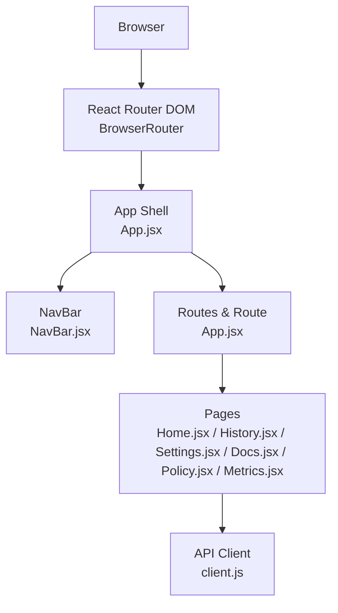
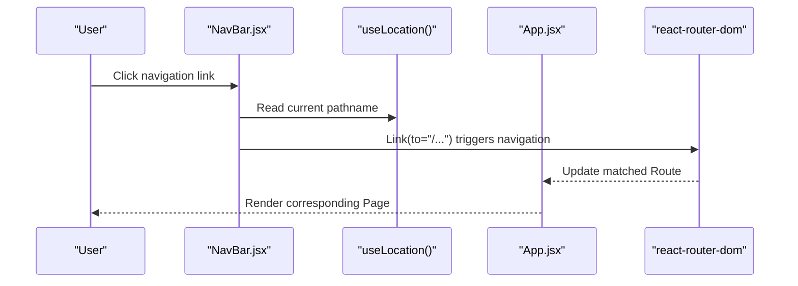
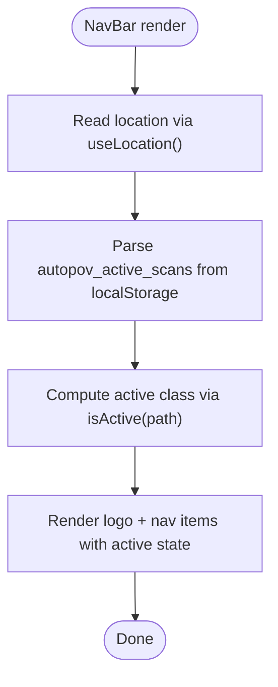
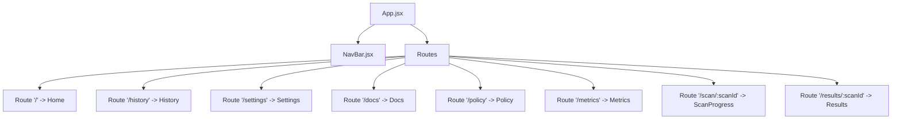
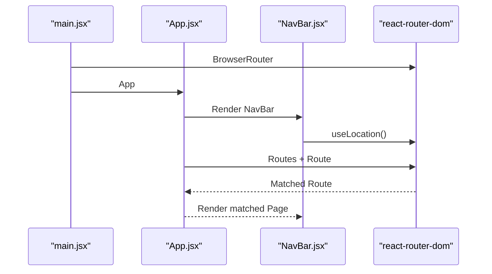
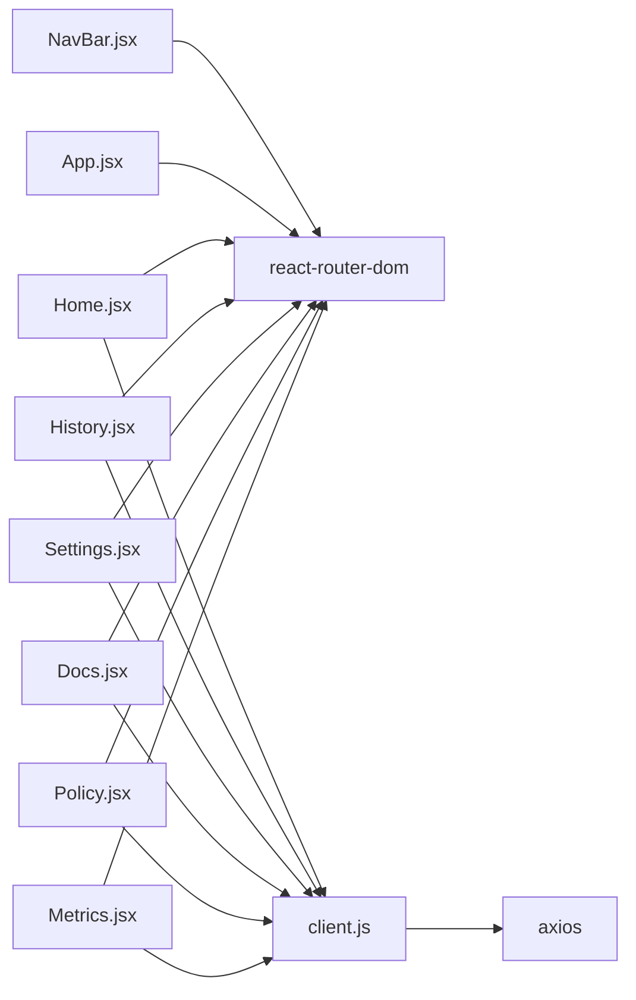

# Navigation Components

<cite>
**Referenced Files in This Document**
- [NavBar.jsx](file://frontend/src/components/NavBar.jsx)
- [App.jsx](file://frontend/src/App.jsx)
- [main.jsx](file://frontend/src/main.jsx)
- [Home.jsx](file://frontend/src/pages/Home.jsx)
- [History.jsx](file://frontend/src/pages/History.jsx)
- [Settings.jsx](file://frontend/src/pages/Settings.jsx)
- [Docs.jsx](file://frontend/src/pages/Docs.jsx)
- [Policy.jsx](file://frontend/src/pages/Policy.jsx)
- [Metrics.jsx](file://frontend/src/pages/Metrics.jsx)
- [client.js](file://frontend/src/api/client.js)
- [index.css](file://frontend/src/index.css)
- [tailwind.config.js](file://frontend/tailwind.config.js)
- [package.json](file://frontend/package.json)
</cite>

## Table of Contents
1. [Introduction](#introduction)
2. [Project Structure](#project-structure)
3. [Core Components](#core-components)
4. [Architecture Overview](#architecture-overview)
5. [Detailed Component Analysis](#detailed-component-analysis)
6. [Dependency Analysis](#dependency-analysis)
7. [Performance Considerations](#performance-considerations)
8. [Troubleshooting Guide](#troubleshooting-guide)
9. [Conclusion](#conclusion)

## Introduction
This document focuses on AutoPoV’s navigation components, with primary emphasis on the NavBar component. It explains the navigation structure, menu items, routing integration, and responsive behavior. It also covers the component’s role in the overall application layout, state management for active routes, integration with the routing system, styling approaches, accessibility features, mobile responsiveness, navigation patterns, user experience considerations, and customization options.

## Project Structure
The frontend is a React application bootstrapped with Vite and styled with Tailwind CSS. Routing is handled by react-router-dom. The NavBar is a presentational component integrated into the main App shell and rendered on every route. Pages are organized under frontend/src/pages and are mounted inside App’s Routes.

**Diagram sources**
- [main.jsx:1-14](file://frontend/src/main.jsx#L1-L14)
- [App.jsx:12-33](file://frontend/src/App.jsx#L12-L33)
- [NavBar.jsx:5-78](file://frontend/src/components/NavBar.jsx#L5-L78)
- [Home.jsx:1-108](file://frontend/src/pages/Home.jsx#L1-L108)
- [History.jsx:1-188](file://frontend/src/pages/History.jsx#L1-L188)
- [Settings.jsx:1-306](file://frontend/src/pages/Settings.jsx#L1-L306)
- [Docs.jsx:1-207](file://frontend/src/pages/Docs.jsx#L1-L207)
- [Policy.jsx:1-111](file://frontend/src/pages/Policy.jsx#L1-L111)
- [Metrics.jsx:1-204](file://frontend/src/pages/Metrics.jsx#L1-L204)
- [client.js:1-78](file://frontend/src/api/client.js#L1-L78)

**Section sources**
- [main.jsx:1-14](file://frontend/src/main.jsx#L1-L14)
- [App.jsx:12-33](file://frontend/src/App.jsx#L12-L33)

## Core Components
- NavBar: Provides top-level navigation links and highlights the active route. It reads the current location from react-router-dom and applies Tailwind CSS classes to indicate active vs inactive states. It also manages a small piece of local state related to active scan identification via localStorage.
- App Shell: Wraps the NavBar and defines all Routes for the application.
- Pages: Individual screens rendered by Routes, including Home, History, Settings, Docs, Policy, and Metrics.

Key responsibilities:
- Navigation: NavBar renders links to core application areas.
- Active route indication: Uses location pathname to compute active class names.
- Local state: Reads and parses autopov_active_scans from localStorage to derive the most recent scan identifier.
- Routing integration: Uses react-router-dom Link and useLocation hooks; App.jsx defines all routes.

**Section sources**
- [NavBar.jsx:5-78](file://frontend/src/components/NavBar.jsx#L5-L78)
- [App.jsx:12-33](file://frontend/src/App.jsx#L12-L33)

## Architecture Overview
The NavBar participates in a simple but effective routing architecture:
- The application is wrapped in BrowserRouter at the root.
- App renders NavBar and Routes.
- NavBar computes active state based on the current location.
- Clicking a NavBar link navigates to the corresponding page, which may render additional UI or trigger API calls.

**Diagram sources**
- [NavBar.jsx:28-30](file://frontend/src/components/NavBar.jsx#L28-L30)
- [App.jsx:17-27](file://frontend/src/App.jsx#L17-L27)

## Detailed Component Analysis

### NavBar Component
NavBar is a functional component that:
- Reads the current location via useLocation.
- Computes active/inactive styles based on pathname equality.
- Renders a logo and brand name, followed by a horizontal list of navigation items.
- Uses lucide-react icons for each menu item.
- Applies Tailwind utility classes for layout, spacing, and color states.

Active route logic:
- isActive(path) returns a class string indicating whether the current route matches the provided path. This drives the visual “active” appearance of the selected item.

Local storage integration:
- On mount and when the location changes, the component reads autopov_active_scans from localStorage, parses it as JSON, and sets the most recent scan identifier. This enables downstream components to reference the active scan context.

Accessibility and UX considerations:
- Uses semantic Link components from react-router-dom for navigation.
- Hover/focus-friendly color transitions via Tailwind classes.
- Icons are included alongside text for clarity.

Responsive behavior:
- The NavBar uses flexbox and spacing utilities to keep items aligned horizontally. While there is no explicit breakpoint handling in NavBar.jsx, the parent container uses a responsive container class and the overall layout benefits from Tailwind’s responsive utilities.

Customization options:
- To add a new menu item, import the icon, add a Link with the appropriate path, and update the isActive logic if needed.
- To change active/inactive styles, adjust the Tailwind classes returned by isActive.

**Diagram sources**
- [NavBar.jsx:6-30](file://frontend/src/components/NavBar.jsx#L6-L30)

**Section sources**
- [NavBar.jsx:5-78](file://frontend/src/components/NavBar.jsx#L5-L78)

### App Shell and Routing Integration
App defines the application shell and mounts all routes. It:
- Renders NavBar at the top.
- Wraps Routes around the main content area.
- Defines routes for Home, History, Settings, Docs, Policy, Metrics, and dynamic paths for scan progress/results.

Routing integration with NavBar:
- NavBar uses Link to navigate to these paths.
- isActive compares the current location pathname against route paths to highlight the active item.

**Diagram sources**
- [App.jsx:17-27](file://frontend/src/App.jsx#L17-L27)

**Section sources**
- [App.jsx:12-33](file://frontend/src/App.jsx#L12-L33)

### Pages and Navigation Patterns
- Home: Entry point for initiating scans; navigates to scan progress upon successful submission.
- History: Lists previous scans and allows navigation to results per scan.
- Settings: Manages API keys and webhooks; includes tabs for different configuration areas.
- Docs: Documentation hub with API and CLI references.
- Policy: Learning and model performance dashboard.
- Metrics: System health and metrics display.

Navigation patterns:
- Internal navigation via NavBar and page-specific buttons.
- Programmatic navigation via useNavigate in pages (e.g., Home navigates to scan progress after submission).

**Section sources**
- [Home.jsx:12-56](file://frontend/src/pages/Home.jsx#L12-L56)
- [History.jsx:141-148](file://frontend/src/pages/History.jsx#L141-L148)
- [Settings.jsx:125-179](file://frontend/src/pages/Settings.jsx#L125-L179)
- [Docs.jsx:1-207](file://frontend/src/pages/Docs.jsx#L1-L207)
- [Policy.jsx:45-108](file://frontend/src/pages/Policy.jsx#L45-L108)
- [Metrics.jsx:28-204](file://frontend/src/pages/Metrics.jsx#L28-L204)

### Styling Approaches and Accessibility
Styling:
- Tailwind CSS utilities define layout, colors, and responsive behavior.
- Custom CSS extends Tailwind with scrollbars, code blocks, animations, and status badges.
- Tailwind theme customization includes extended gray and primary palette values.

Accessibility:
- Links are native anchor elements with proper semantics.
- Color contrast maintained via theme tokens.
- Focus states rely on default browser behavior with hover/focus classes.

Responsive behavior:
- Flexbox and spacing utilities keep the NavBar compact and readable on small screens.
- Container utilities center content and constrain widths.
- Additional responsive utilities are applied in pages for tables and grids.

**Section sources**
- [index.css:1-73](file://frontend/src/index.css#L1-L73)
- [tailwind.config.js:1-30](file://frontend/tailwind.config.js#L1-L30)
- [NavBar.jsx:32-74](file://frontend/src/components/NavBar.jsx#L32-L74)

### Integration with the Routing System
- Root wrapping: main.jsx wraps the app in BrowserRouter so all components can use routing primitives.
- Route definitions: App.jsx lists all routes and their associated components.
- Active state computation: NavBar.jsx uses useLocation to determine the active route and apply appropriate styles.

**Diagram sources**
- [main.jsx:7-13](file://frontend/src/main.jsx#L7-L13)
- [App.jsx:17-27](file://frontend/src/App.jsx#L17-L27)
- [NavBar.jsx:6-30](file://frontend/src/components/NavBar.jsx#L6-L30)

**Section sources**
- [main.jsx:1-14](file://frontend/src/main.jsx#L1-L14)
- [App.jsx:12-33](file://frontend/src/App.jsx#L12-L33)
- [NavBar.jsx:5-78](file://frontend/src/components/NavBar.jsx#L5-L78)

## Dependency Analysis
External dependencies relevant to navigation:
- react-router-dom: Provides routing primitives used by App.jsx and NavBar.jsx.
- lucide-react: Icons used in NavBar and pages.
- axios: API client used by pages to fetch data; indirectly affects navigation via programmatic route changes.

**Diagram sources**
- [NavBar.jsx:1-3](file://frontend/src/components/NavBar.jsx#L1-L3)
- [App.jsx:1-11](file://frontend/src/App.jsx#L1-L11)
- [Home.jsx:1-6](file://frontend/src/pages/Home.jsx#L1-L6)
- [History.jsx:1-4](file://frontend/src/pages/History.jsx#L1-L4)
- [Settings.jsx:1-6](file://frontend/src/pages/Settings.jsx#L1-L6)
- [Docs.jsx:1](file://frontend/src/pages/Docs.jsx#L1)
- [Policy.jsx:1-3](file://frontend/src/pages/Policy.jsx#L1-L3)
- [Metrics.jsx:1-4](file://frontend/src/pages/Metrics.jsx#L1-L4)
- [client.js:1-78](file://frontend/src/api/client.js#L1-L78)
- [package.json:12-18](file://frontend/package.json#L12-L18)

**Section sources**
- [package.json:12-18](file://frontend/package.json#L12-L18)
- [client.js:1-78](file://frontend/src/api/client.js#L1-L78)

## Performance Considerations
- Minimal re-renders: NavBar only depends on location and a small localStorage-derived state, keeping renders lightweight.
- Efficient active state: isActive performs a simple string comparison per link, negligible cost.
- Lazy loading: Pages are loaded on demand by react-router-dom, avoiding unnecessary initial bundle weight.

## Troubleshooting Guide
Common issues and resolutions:
- Active link not highlighting:
  - Verify the current pathname matches the path used in isActive.
  - Confirm that the route path in App.jsx matches the Link to prop in NavBar.
- Navigation not working:
  - Ensure BrowserRouter is present at the root (main.jsx).
  - Confirm Routes and Route definitions exist for the intended paths.
- Local storage state not updating:
  - Check that autopov_active_scans exists and is valid JSON.
  - Verify the effect runs on pathname changes and that parsing succeeds.
- Styling inconsistencies:
  - Confirm Tailwind is configured and building correctly.
  - Ensure custom CSS classes align with Tailwind utilities.

**Section sources**
- [NavBar.jsx:9-25](file://frontend/src/components/NavBar.jsx#L9-L25)
- [App.jsx:17-27](file://frontend/src/App.jsx#L17-L27)
- [main.jsx:7-13](file://frontend/src/main.jsx#L7-L13)
- [index.css:1-73](file://frontend/src/index.css#L1-L73)

## Conclusion
NavBar is a focused, efficient navigation component that integrates tightly with react-router-dom and the App shell. It provides clear active-state feedback, supports essential internal navigation, and leverages Tailwind for responsive styling. Its design accommodates easy extension with new menu items and maintains good user experience through accessible markup and thoughtful styling. Pages complement NavBar by offering rich functionality while preserving consistent navigation patterns.