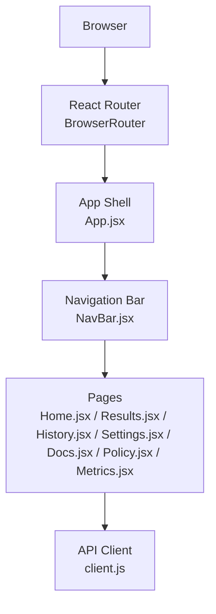
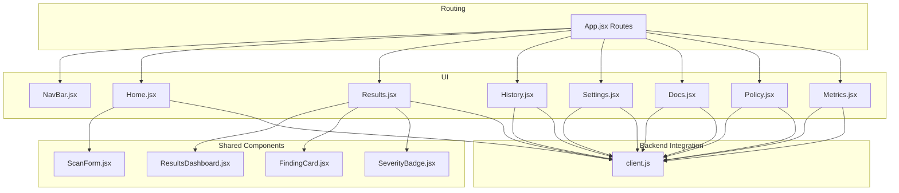
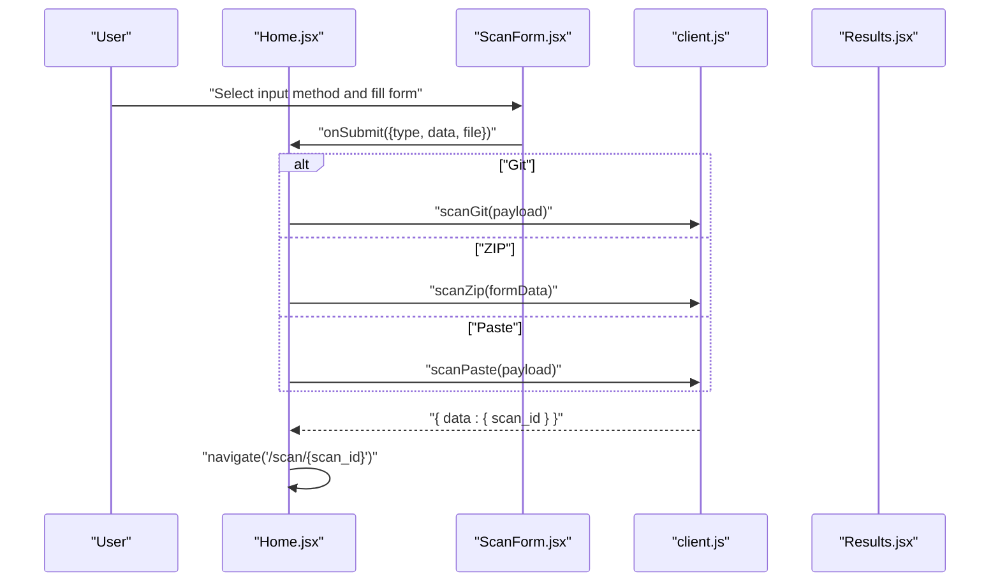
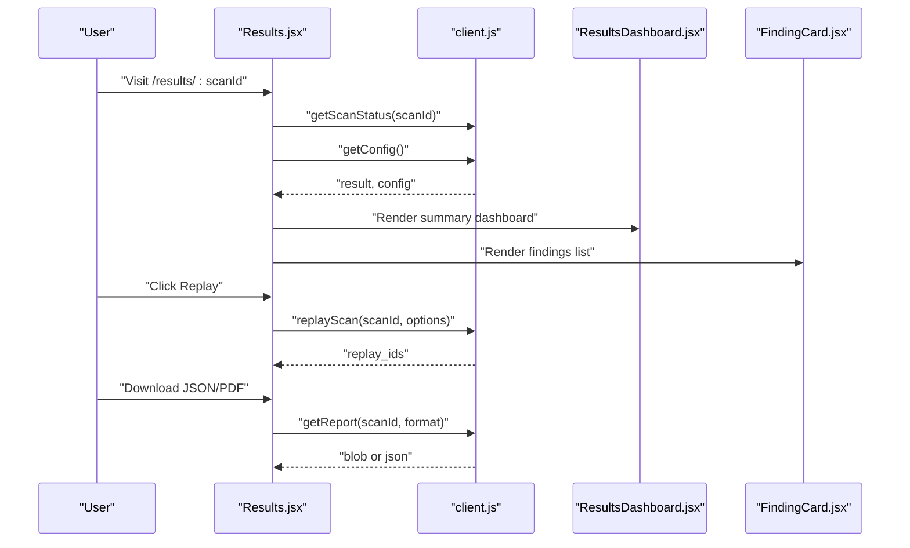
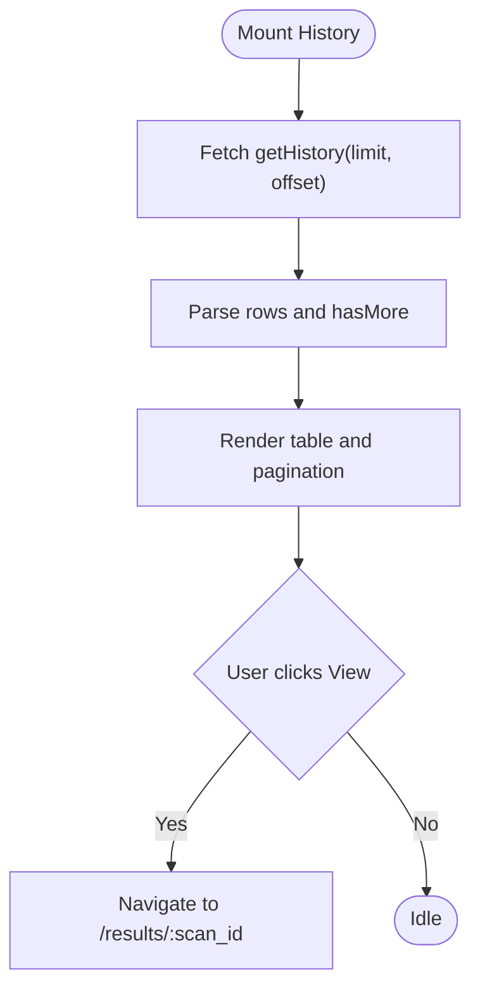
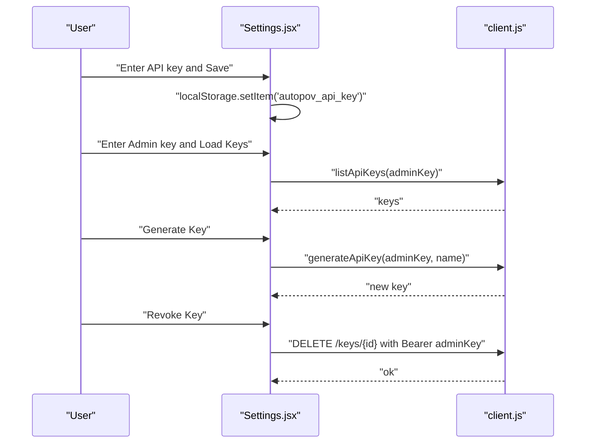
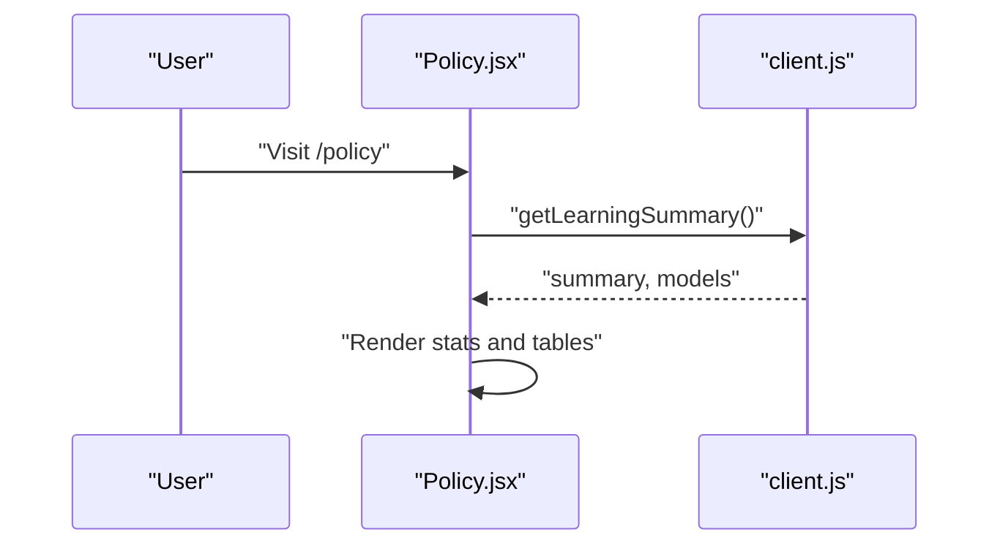
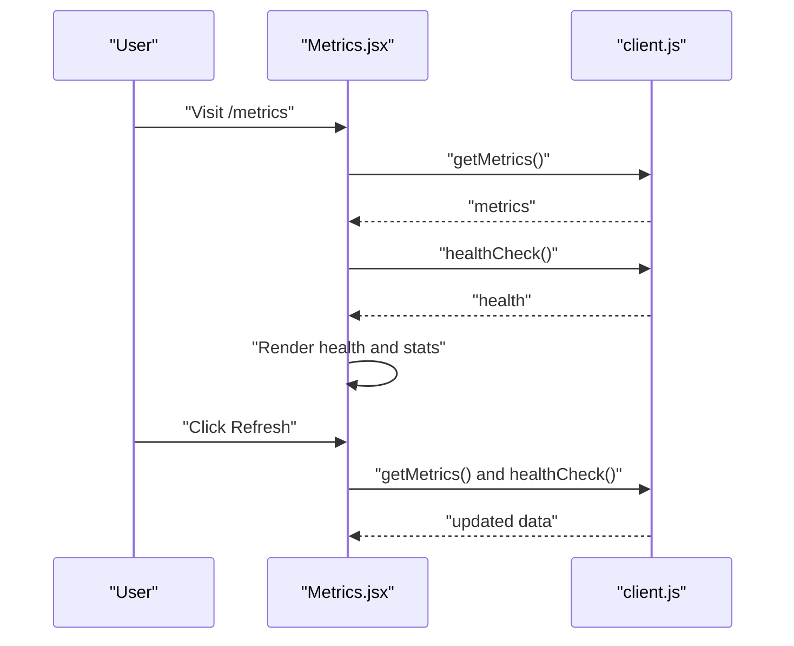
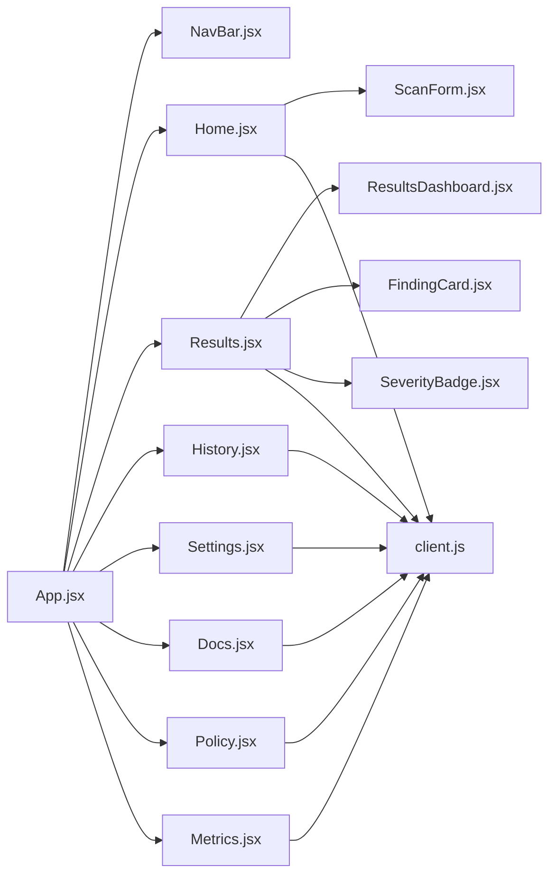

# Page Layouts

<cite>
**Referenced Files in This Document**
- [App.jsx](file://frontend/src/App.jsx)
- [main.jsx](file://frontend/src/main.jsx)
- [NavBar.jsx](file://frontend/src/components/NavBar.jsx)
- [client.js](file://frontend/src/api/client.js)
- [Home.jsx](file://frontend/src/pages/Home.jsx)
- [Results.jsx](file://frontend/src/pages/Results.jsx)
- [History.jsx](file://frontend/src/pages/History.jsx)
- [Settings.jsx](file://frontend/src/pages/Settings.jsx)
- [Docs.jsx](file://frontend/src/pages/Docs.jsx)
- [Policy.jsx](file://frontend/src/pages/Policy.jsx)
- [Metrics.jsx](file://frontend/src/pages/Metrics.jsx)
- [ResultsDashboard.jsx](file://frontend/src/components/ResultsDashboard.jsx)
- [FindingCard.jsx](file://frontend/src/components/FindingCard.jsx)
- [SeverityBadge.jsx](file://frontend/src/components/SeverityBadge.jsx)
- [ScanForm.jsx](file://frontend/src/components/ScanForm.jsx)
</cite>

## Table of Contents
1. [Introduction](#introduction)
2. [Project Structure](#project-structure)
3. [Core Components](#core-components)
4. [Architecture Overview](#architecture-overview)
5. [Detailed Component Analysis](#detailed-component-analysis)
6. [Dependency Analysis](#dependency-analysis)
7. [Performance Considerations](#performance-considerations)
8. [Troubleshooting Guide](#troubleshooting-guide)
9. [Conclusion](#conclusion)

## Introduction
This document describes AutoPoV’s frontend page layouts and components. It explains how the application routes users across pages, how each page renders its content, how data is fetched from backend services, and how the UI handles loading and error states. It also documents responsive design patterns, integration points with backend APIs, and cross-page navigation.

## Project Structure
The frontend is a React application bootstrapped with Vite and uses React Router for client-side routing. The main application shell sets up the router and navigation bar, while individual pages implement domain-specific layouts and data flows.

**Diagram sources**
- [main.jsx:1-14](file://frontend/src/main.jsx#L1-L14)
- [App.jsx:1-33](file://frontend/src/App.jsx#L1-L33)
- [NavBar.jsx:1-78](file://frontend/src/components/NavBar.jsx#L1-L78)
- [client.js:1-78](file://frontend/src/api/client.js#L1-L78)

**Section sources**
- [main.jsx:1-14](file://frontend/src/main.jsx#L1-L14)
- [App.jsx:1-33](file://frontend/src/App.jsx#L1-L33)

## Core Components
- App shell and routing: Defines top-level routes and wraps content with the navigation bar.
- Navigation bar: Provides quick links to all pages and highlights the active route.
- API client: Centralized Axios instance with auth injection and typed endpoints for all backend interactions.
- Page components: Implement page-specific layouts, data fetching, and rendering logic.
- Shared components: Reusable UI elements like ScanForm, ResultsDashboard, FindingCard, SeverityBadge.

**Section sources**
- [App.jsx:1-33](file://frontend/src/App.jsx#L1-L33)
- [NavBar.jsx:1-78](file://frontend/src/components/NavBar.jsx#L1-L78)
- [client.js:1-78](file://frontend/src/api/client.js#L1-L78)

## Architecture Overview
The frontend follows a clean separation of concerns:
- Routing: Defined in App.jsx with nested routes for home, scan progress, results, history, settings, docs, policy, and metrics.
- Navigation: NavBar.jsx reflects current route and persists minimal state (e.g., active scan ID).
- Data access: client.js encapsulates base URL, auth headers, and endpoint functions.
- Rendering: Each page composes shared components and page-specific logic.

**Diagram sources**
- [App.jsx:1-33](file://frontend/src/App.jsx#L1-L33)
- [NavBar.jsx:1-78](file://frontend/src/components/NavBar.jsx#L1-L78)
- [Home.jsx:1-108](file://frontend/src/pages/Home.jsx#L1-L108)
- [Results.jsx:1-434](file://frontend/src/pages/Results.jsx#L1-L434)
- [History.jsx:1-188](file://frontend/src/pages/History.jsx#L1-L188)
- [Settings.jsx:1-306](file://frontend/src/pages/Settings.jsx#L1-L306)
- [Docs.jsx:1-207](file://frontend/src/pages/Docs.jsx#L1-L207)
- [Policy.jsx:1-111](file://frontend/src/pages/Policy.jsx#L1-L111)
- [Metrics.jsx:1-204](file://frontend/src/pages/Metrics.jsx#L1-L204)
- [ResultsDashboard.jsx:1-289](file://frontend/src/components/ResultsDashboard.jsx#L1-L289)
- [FindingCard.jsx:1-200](file://frontend/src/components/FindingCard.jsx#L1-L200)
- [SeverityBadge.jsx:1-27](file://frontend/src/components/SeverityBadge.jsx#L1-L27)
- [ScanForm.jsx:1-249](file://frontend/src/components/ScanForm.jsx#L1-L249)
- [client.js:1-78](file://frontend/src/api/client.js#L1-L78)

## Detailed Component Analysis

### Home Page (Dashboard)
- Purpose: Primary entry point for initiating scans via Git repository, ZIP upload, or pasted code.
- Key behaviors:
  - Presents a tabbed form (ScanForm) to choose input method.
  - Submits scan requests to backend and navigates to the scan progress page upon success.
  - Handles loading and error states during submission.
- Data fetching pattern:
  - Uses client.js functions for Git, ZIP, and paste scans.
  - On success, navigates to `/scan/:scanId`.
- UI patterns:
  - Loading spinner during submission.
  - Error banner with user-friendly messages.
  - Feature highlights below the form.

**Diagram sources**
- [Home.jsx:12-56](file://frontend/src/pages/Home.jsx#L12-L56)
- [ScanForm.jsx:41-44](file://frontend/src/components/ScanForm.jsx#L41-L44)
- [client.js:32-40](file://frontend/src/api/client.js#L32-L40)

**Section sources**
- [Home.jsx:1-108](file://frontend/src/pages/Home.jsx#L1-L108)
- [ScanForm.jsx:1-249](file://frontend/src/components/ScanForm.jsx#L1-L249)
- [client.js:32-40](file://frontend/src/api/client.js#L32-L40)

### Results Page (Vulnerability Display and Reporting)
- Purpose: Render scan results, dashboards, and detailed findings; support report downloads and replays.
- Key behaviors:
  - Loads scan status and optional configuration in parallel.
  - Computes models used and per-model stats.
  - Supports JSON/PDF report downloads.
  - Provides a modal to replay findings against agent models.
  - Renders summary cards, charts, and a tabbed findings list.
- Data fetching pattern:
  - getScanStatus(scanId) and getConfig().
  - getReport(scanId, format) with blob handling for PDF.
  - replayScan(scanId, payload) to start new runs.
- UI patterns:
  - Loading skeleton until data resolves.
  - Error banners for failures.
  - Expandable FindingCard components for each finding.
  - SeverityBadge for CWE severity.
  - ResultsDashboard for summary metrics and charts.

**Diagram sources**
- [Results.jsx:24-41](file://frontend/src/pages/Results.jsx#L24-L41)
- [Results.jsx:43-61](file://frontend/src/pages/Results.jsx#L43-L61)
- [Results.jsx:122-140](file://frontend/src/pages/Results.jsx#L122-L140)
- [client.js:42-55](file://frontend/src/api/client.js#L42-L55)
- [client.js:76-76](file://frontend/src/api/client.js#L76-L76)
- [ResultsDashboard.jsx:1-289](file://frontend/src/components/ResultsDashboard.jsx#L1-L289)
- [FindingCard.jsx:1-200](file://frontend/src/components/FindingCard.jsx#L1-L200)

**Section sources**
- [Results.jsx:1-434](file://frontend/src/pages/Results.jsx#L1-L434)
- [ResultsDashboard.jsx:1-289](file://frontend/src/components/ResultsDashboard.jsx#L1-L289)
- [FindingCard.jsx:1-200](file://frontend/src/components/FindingCard.jsx#L1-L200)
- [SeverityBadge.jsx:1-27](file://frontend/src/components/SeverityBadge.jsx#L1-L27)
- [client.js:42-55](file://frontend/src/api/client.js#L42-L55)

### History Page (Scan Tracking)
- Purpose: Paginated listing of past scans with status, model, confirmed counts, and cost.
- Key behaviors:
  - Fetches history with limit+1 to detect “hasMore”.
  - Maintains page state and total when available.
  - Navigates to results detail on action click.
- Data fetching pattern:
  - getHistory(limit+offset) with offset pagination.
- UI patterns:
  - Skeleton loader while loading.
  - Status badges with icons and colors.
  - Pagination controls with previous/next buttons.

**Diagram sources**
- [History.jsx:17-40](file://frontend/src/pages/History.jsx#L17-L40)
- [History.jsx:105-151](file://frontend/src/pages/History.jsx#L105-L151)
- [client.js:49-50](file://frontend/src/api/client.js#L49-L50)

**Section sources**
- [History.jsx:1-188](file://frontend/src/pages/History.jsx#L1-L188)
- [client.js:49-50](file://frontend/src/api/client.js#L49-L50)

### Settings Page (Configuration Options)
- Purpose: Manage API keys, admin key, and webhooks.
- Key behaviors:
  - Stores API key in localStorage and supports saving.
  - Lists and manages API keys using admin key.
  - Generates new keys and revokes existing ones.
  - Integrates with WebhookSetup component.
- Data fetching pattern:
  - listApiKeys(adminKey), generateApiKey(adminKey, name), delete key endpoint.
- UI patterns:
  - Tabbed interface for API key, admin key management, and webhooks.
  - Animated feedback for saved and generated states.
  - Error banners with actionable messages.

**Diagram sources**
- [Settings.jsx:22-33](file://frontend/src/pages/Settings.jsx#L22-L33)
- [Settings.jsx:35-47](file://frontend/src/pages/Settings.jsx#L35-L47)
- [Settings.jsx:49-64](file://frontend/src/pages/Settings.jsx#L49-L64)
- [Settings.jsx:66-80](file://frontend/src/pages/Settings.jsx#L66-L80)
- [client.js:59-68](file://frontend/src/api/client.js#L59-L68)

**Section sources**
- [Settings.jsx:1-306](file://frontend/src/pages/Settings.jsx#L1-L306)
- [client.js:59-68](file://frontend/src/api/client.js#L59-L68)

### Docs Page (Documentation Interface)
- Purpose: Present API and CLI references, supported CWEs, and links to interactive docs.
- Key behaviors:
  - Reads VITE_API_URL to build links to Swagger UI and OpenAPI JSON.
  - Displays API endpoints and CLI commands in a structured layout.
- UI patterns:
  - Card-based sections for overview, API reference, CLI reference, supported CWEs, and links.

**Section sources**
- [Docs.jsx:1-207](file://frontend/src/pages/Docs.jsx#L1-L207)

### Policy Page (Model Management)
- Purpose: Show learning and model performance metrics across investigation and PoV runs.
- Key behaviors:
  - Loads learning summary data.
  - Renders summary stats and two model tables with confirm and success rates.
- Data fetching pattern:
  - getLearningSummary().
- UI patterns:
  - Loading spinner while fetching.
  - Error banner on failure.
  - Grid of stat cards and tabular model performance.

**Diagram sources**
- [Policy.jsx:50-63](file://frontend/src/pages/Policy.jsx#L50-L63)
- [client.js:74-74](file://frontend/src/api/client.js#L74-L74)

**Section sources**
- [Policy.jsx:1-111](file://frontend/src/pages/Policy.jsx#L1-L111)
- [client.js:74-74](file://frontend/src/api/client.js#L74-L74)

### Metrics Page (Analytics Display)
- Purpose: Show system health, scan activity, findings statistics, and cost/performance metrics.
- Key behaviors:
  - Fetches metrics and health concurrently on mount.
  - Supports manual refresh with loading state.
  - Displays additional metrics if present.
- Data fetching pattern:
  - getMetrics() and healthCheck().
- UI patterns:
  - Health status card with tool availability badges.
  - Stat cards for scan activity, findings, and cost/performance.
  - Additional metrics grid for unknown keys.

**Diagram sources**
- [Metrics.jsx:35-51](file://frontend/src/pages/Metrics.jsx#L35-L51)
- [client.js:28-57](file://frontend/src/api/client.js#L28-L57)

**Section sources**
- [Metrics.jsx:1-204](file://frontend/src/pages/Metrics.jsx#L1-L204)
- [client.js:28-57](file://frontend/src/api/client.js#L28-L57)

## Dependency Analysis
- Routing depends on React Router and App.jsx routes.
- Pages depend on client.js for all backend interactions.
- Shared components (ResultsDashboard, FindingCard, SeverityBadge, ScanForm) are reused across pages.
- NavBar.jsx depends on location to highlight active routes.

**Diagram sources**
- [App.jsx:1-33](file://frontend/src/App.jsx#L1-L33)
- [NavBar.jsx:1-78](file://frontend/src/components/NavBar.jsx#L1-L78)
- [Home.jsx:1-108](file://frontend/src/pages/Home.jsx#L1-L108)
- [Results.jsx:1-434](file://frontend/src/pages/Results.jsx#L1-L434)
- [History.jsx:1-188](file://frontend/src/pages/History.jsx#L1-L188)
- [Settings.jsx:1-306](file://frontend/src/pages/Settings.jsx#L1-L306)
- [Docs.jsx:1-207](file://frontend/src/pages/Docs.jsx#L1-L207)
- [Policy.jsx:1-111](file://frontend/src/pages/Policy.jsx#L1-L111)
- [Metrics.jsx:1-204](file://frontend/src/pages/Metrics.jsx#L1-L204)
- [ResultsDashboard.jsx:1-289](file://frontend/src/components/ResultsDashboard.jsx#L1-L289)
- [FindingCard.jsx:1-200](file://frontend/src/components/FindingCard.jsx#L1-L200)
- [SeverityBadge.jsx:1-27](file://frontend/src/components/SeverityBadge.jsx#L1-L27)
- [ScanForm.jsx:1-249](file://frontend/src/components/ScanForm.jsx#L1-L249)
- [client.js:1-78](file://frontend/src/api/client.js#L1-L78)

**Section sources**
- [App.jsx:1-33](file://frontend/src/App.jsx#L1-L33)
- [client.js:1-78](file://frontend/src/api/client.js#L1-L78)

## Performance Considerations
- Concurrent data fetching: Results and Metrics pages use Promise.all to reduce latency.
- Pagination: History page uses limit+1 to avoid extra requests and accurately compute “hasMore”.
- Memoization: Results computes modelsUsed and derived metrics with useMemo to prevent unnecessary recalculations.
- Lazy rendering: ResultsDashboard defers heavy chart rendering to responsive containers.
- Local storage caching: Settings stores API key locally to avoid repeated prompts.

[No sources needed since this section provides general guidance]

## Troubleshooting Guide
- Authentication errors:
  - Ensure API key is set in localStorage or environment variable. The client injects Authorization headers automatically.
- Network failures:
  - Pages show error banners with captured messages. Retry actions or check backend connectivity.
- Missing data:
  - Some pages conditionally render empty states (e.g., no results, no scans). Verify scan completion and IDs.
- Reports:
  - PDF reports require blob handling; ensure browser supports blob downloads.
- Replay:
  - Validate that models are provided and include_failed/max_findings are within accepted ranges.

**Section sources**
- [client.js:5-8](file://frontend/src/api/client.js#L5-L8)
- [client.js:18-25](file://frontend/src/api/client.js#L18-L25)
- [Results.jsx:58-61](file://frontend/src/pages/Results.jsx#L58-L61)
- [History.jsx:84-88](file://frontend/src/pages/History.jsx#L84-L88)
- [Settings.jsx:216-221](file://frontend/src/pages/Settings.jsx#L216-L221)

## Conclusion
AutoPoV’s frontend organizes scanning workflows around a clear routing structure and reusable components. Each page implements robust loading and error handling, integrates with a centralized API client, and presents domain-relevant dashboards. The design emphasizes responsiveness and clarity across scan initiation, results exploration, historical tracking, configuration, documentation, model performance, and system metrics.