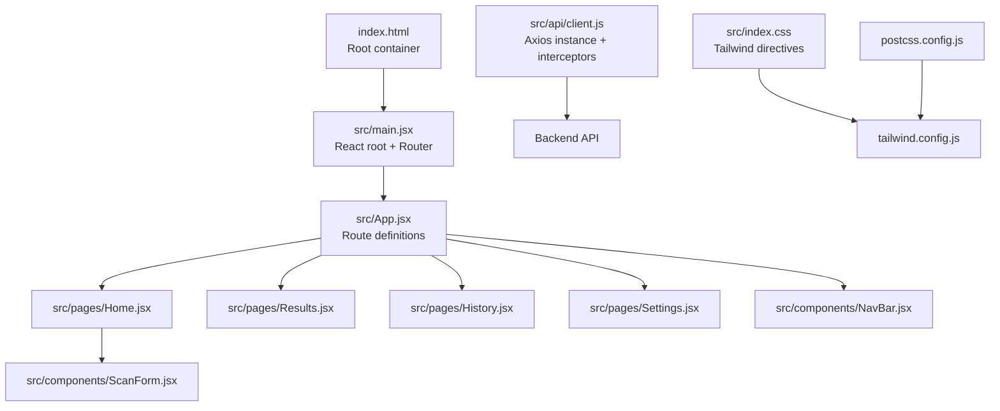
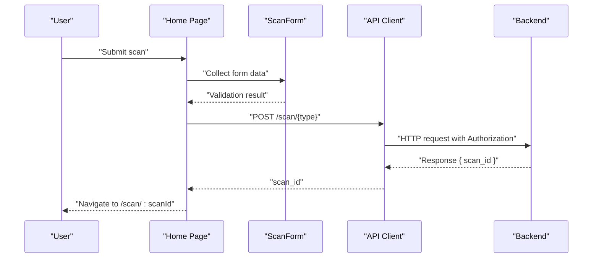
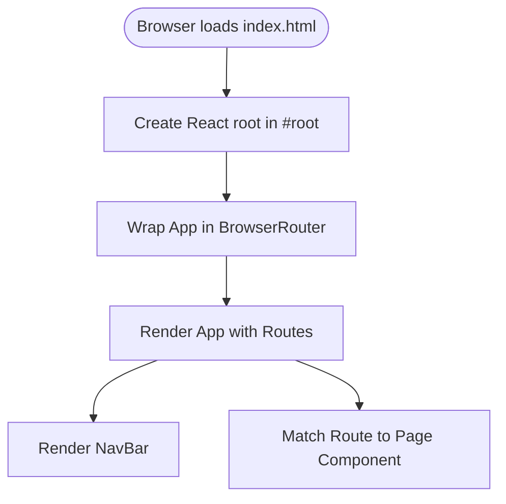
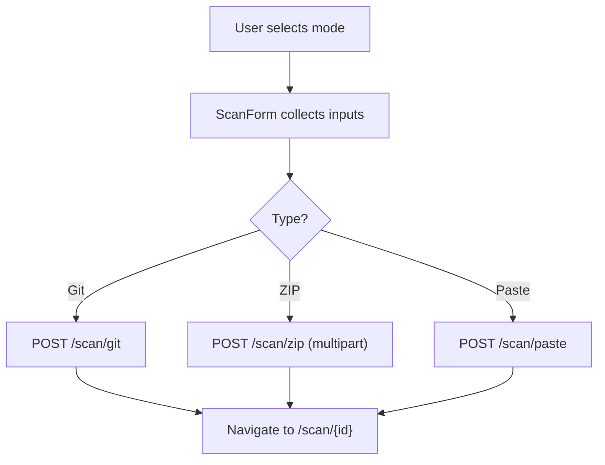
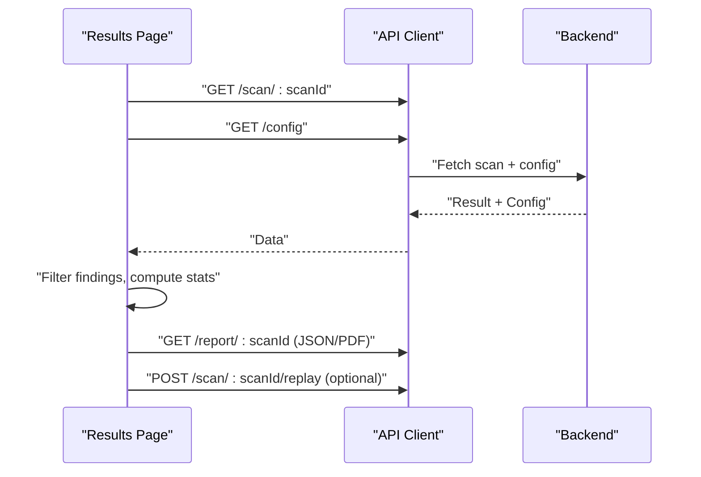
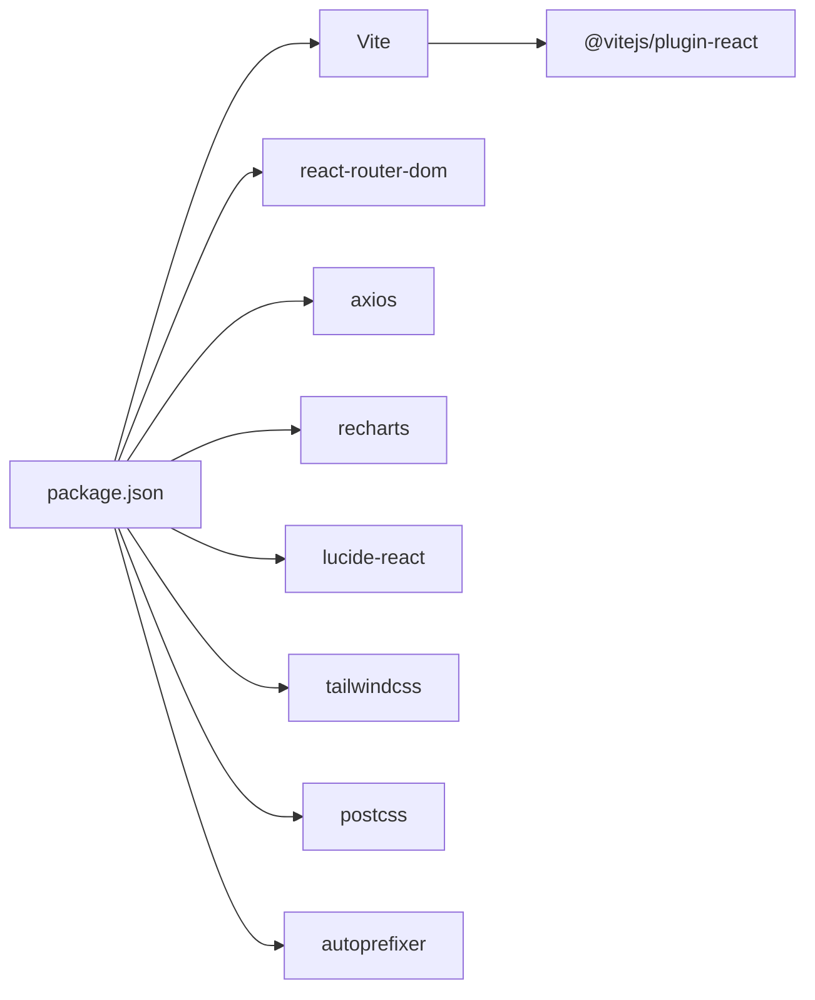

# React Application Architecture

<cite>
**Referenced Files in This Document**
- [package.json](file://frontend/package.json)
- [vite.config.js](file://frontend/vite.config.js)
- [index.html](file://frontend/index.html)
- [src/main.jsx](file://frontend/src/main.jsx)
- [src/App.jsx](file://frontend/src/App.jsx)
- [src/components/NavBar.jsx](file://frontend/src/components/NavBar.jsx)
- [src/components/ScanForm.jsx](file://frontend/src/components/ScanForm.jsx)
- [src/pages/Home.jsx](file://frontend/src/pages/Home.jsx)
- [src/pages/Results.jsx](file://frontend/src/pages/Results.jsx)
- [src/pages/History.jsx](file://frontend/src/pages/History.jsx)
- [src/pages/Settings.jsx](file://frontend/src/pages/Settings.jsx)
- [src/api/client.js](file://frontend/src/api/client.js)
- [src/index.css](file://frontend/src/index.css)
- [tailwind.config.js](file://frontend/tailwind.config.js)
- [postcss.config.js](file://frontend/postcss.config.js)
</cite>

## Table of Contents
1. [Introduction](#introduction)
2. [Project Structure](#project-structure)
3. [Core Components](#core-components)
4. [Architecture Overview](#architecture-overview)
5. [Detailed Component Analysis](#detailed-component-analysis)
6. [Dependency Analysis](#dependency-analysis)
7. [Performance Considerations](#performance-considerations)
8. [Troubleshooting Guide](#troubleshooting-guide)
9. [Conclusion](#conclusion)

## Introduction
This document describes the React application architecture for AutoPoV’s frontend. It covers routing configuration with react-router-dom, component hierarchy, application entry point setup, Vite build configuration and development server, production optimization, Tailwind CSS integration, environment variables, asset handling, and development workflow including hot module replacement and debugging setup.

## Project Structure
The frontend is organized around a classic React + Vite setup with a clear separation of concerns:
- Entry point initializes React and wraps the app in routing and styles.
- Pages represent top-level views.
- Components encapsulate reusable UI elements.
- API client abstracts backend communication.
- Styling leverages Tailwind CSS with PostCSS.

**Diagram sources**
- [index.html:1-15](file://frontend/index.html#L1-L15)
- [src/main.jsx:1-14](file://frontend/src/main.jsx#L1-L14)
- [src/App.jsx:1-33](file://frontend/src/App.jsx#L1-L33)
- [src/components/NavBar.jsx:1-78](file://frontend/src/components/NavBar.jsx#L1-L78)
- [src/components/ScanForm.jsx:1-249](file://frontend/src/components/ScanForm.jsx#L1-L249)
- [src/pages/Home.jsx:1-108](file://frontend/src/pages/Home.jsx#L1-L108)
- [src/pages/Results.jsx:1-434](file://frontend/src/pages/Results.jsx#L1-L434)
- [src/pages/History.jsx:1-188](file://frontend/src/pages/History.jsx#L1-L188)
- [src/pages/Settings.jsx:1-306](file://frontend/src/pages/Settings.jsx#L1-L306)
- [src/api/client.js:1-78](file://frontend/src/api/client.js#L1-L78)
- [src/index.css:1-73](file://frontend/src/index.css#L1-L73)
- [tailwind.config.js:1-30](file://frontend/tailwind.config.js#L1-L30)
- [postcss.config.js:1-7](file://frontend/postcss.config.js#L1-L7)

**Section sources**
- [package.json:1-34](file://frontend/package.json#L1-L34)
- [vite.config.js:1-21](file://frontend/vite.config.js#L1-L21)
- [index.html:1-15](file://frontend/index.html#L1-L15)
- [src/main.jsx:1-14](file://frontend/src/main.jsx#L1-L14)
- [src/App.jsx:1-33](file://frontend/src/App.jsx#L1-L33)

## Core Components
- Application shell and routing:
  - Root wrapper sets up React.StrictMode, BrowserRouter, and global styles.
  - App defines route-to-page mappings for home, progress, results, history, settings, docs, policy, metrics.
- Navigation:
  - NavBar renders top-level navigation and highlights the active route.
- Pages:
  - Home: scan form submission and error handling.
  - Results: displays findings, filters, report downloads, replay controls.
  - History: paginated scan history table with status indicators.
  - Settings: API key storage, admin key management, and webhook configuration.
- API client:
  - Centralized Axios instance with base URL from environment, auth interceptor, and convenience methods for all backend endpoints.

**Section sources**
- [src/main.jsx:1-14](file://frontend/src/main.jsx#L1-L14)
- [src/App.jsx:1-33](file://frontend/src/App.jsx#L1-L33)
- [src/components/NavBar.jsx:1-78](file://frontend/src/components/NavBar.jsx#L1-L78)
- [src/pages/Home.jsx:1-108](file://frontend/src/pages/Home.jsx#L1-L108)
- [src/pages/Results.jsx:1-434](file://frontend/src/pages/Results.jsx#L1-L434)
- [src/pages/History.jsx:1-188](file://frontend/src/pages/History.jsx#L1-L188)
- [src/pages/Settings.jsx:1-306](file://frontend/src/pages/Settings.jsx#L1-L306)
- [src/api/client.js:1-78](file://frontend/src/api/client.js#L1-L78)

## Architecture Overview
The frontend follows a unidirectional data flow:
- UI components trigger actions via page handlers.
- Handlers call the API client methods.
- API client communicates with the backend through Axios, applying authentication automatically.
- Results update page state and re-render the UI.

**Diagram sources**
- [src/pages/Home.jsx:12-56](file://frontend/src/pages/Home.jsx#L12-L56)
- [src/components/ScanForm.jsx:41-44](file://frontend/src/components/ScanForm.jsx#L41-L44)
- [src/api/client.js:32-46](file://frontend/src/api/client.js#L32-L46)

## Detailed Component Analysis

### Routing and Entry Point
- Entry point mounts the app inside BrowserRouter and renders App.
- App registers routes for all pages and renders NavBar at the top.

**Diagram sources**
- [index.html:10-13](file://frontend/index.html#L10-L13)
- [src/main.jsx:7-13](file://frontend/src/main.jsx#L7-L13)
- [src/App.jsx:17-27](file://frontend/src/App.jsx#L17-L27)

**Section sources**
- [index.html:1-15](file://frontend/index.html#L1-L15)
- [src/main.jsx:1-14](file://frontend/src/main.jsx#L1-L14)
- [src/App.jsx:1-33](file://frontend/src/App.jsx#L1-L33)

### Navigation and Active State
- NavBar uses location tracking to highlight the active route.
- Integrates Lucide icons and Tailwind classes for consistent styling.

**Section sources**
- [src/components/NavBar.jsx:1-78](file://frontend/src/components/NavBar.jsx#L1-L78)

### Home Page and Scan Submission
- Home orchestrates scan submission across three modes: Git, ZIP, and Paste.
- Uses ScanForm for inputs and navigates to the progress/results page upon success.

**Diagram sources**
- [src/pages/Home.jsx:12-56](file://frontend/src/pages/Home.jsx#L12-L56)
- [src/components/ScanForm.jsx:41-44](file://frontend/src/components/ScanForm.jsx#L41-L44)
- [src/api/client.js:32-40](file://frontend/src/api/client.js#L32-L40)

**Section sources**
- [src/pages/Home.jsx:1-108](file://frontend/src/pages/Home.jsx#L1-L108)
- [src/components/ScanForm.jsx:1-249](file://frontend/src/components/ScanForm.jsx#L1-L249)
- [src/api/client.js:32-40](file://frontend/src/api/client.js#L32-L40)

### Results Page and Replay Workflow
- Results fetches scan status and configuration, displays findings with filtering, and supports report downloads.
- Provides a modal to replay scans against different models.

**Diagram sources**
- [src/pages/Results.jsx:24-41](file://frontend/src/pages/Results.jsx#L24-L41)
- [src/pages/Results.jsx:43-61](file://frontend/src/pages/Results.jsx#L43-L61)
- [src/pages/Results.jsx:122-140](file://frontend/src/pages/Results.jsx#L122-L140)
- [src/api/client.js:42-47](file://frontend/src/api/client.js#L42-L47)
- [src/api/client.js:52-55](file://frontend/src/api/client.js#L52-L55)
- [src/api/client.js:76-78](file://frontend/src/api/client.js#L76-L78)

**Section sources**
- [src/pages/Results.jsx:1-434](file://frontend/src/pages/Results.jsx#L1-L434)
- [src/api/client.js:42-78](file://frontend/src/api/client.js#L42-L78)

### History Page and Pagination
- History fetches paginated scan records, displays status with icons and color-coded badges, and supports navigation to results.

**Section sources**
- [src/pages/History.jsx:1-188](file://frontend/src/pages/History.jsx#L1-L188)

### Settings Page and API Key Management
- Stores API key in localStorage and supports admin key operations to list, generate, and revoke keys.
- Integrates with the API client for authenticated requests.

**Section sources**
- [src/pages/Settings.jsx:1-306](file://frontend/src/pages/Settings.jsx#L1-L306)
- [src/api/client.js:59-68](file://frontend/src/api/client.js#L59-L68)

### API Client and Environment Variables
- Base URL defaults to environment variable or localhost.
- Adds Authorization header from localStorage or environment.
- Exposes typed methods for health checks, scanning, streaming logs, history, metrics, keys, and reports.

**Section sources**
- [src/api/client.js:1-78](file://frontend/src/api/client.js#L1-L78)

### Styling and Tailwind Integration
- Global CSS imports Tailwind directives and defines custom utilities for scrollbars, code blocks, animations, and status badges.
- Tailwind content globs source files for purging.
- PostCSS pipeline applies Tailwind and Autoprefixer.

**Section sources**
- [src/index.css:1-73](file://frontend/src/index.css#L1-L73)
- [tailwind.config.js:1-30](file://frontend/tailwind.config.js#L1-L30)
- [postcss.config.js:1-7](file://frontend/postcss.config.js#L1-L7)

## Dependency Analysis
- Build and dev tools:
  - Vite provides fast dev server with HMR and optimized production builds.
  - React plugin enables JSX transforms and Fast Refresh.
- Runtime dependencies:
  - React and React DOM for rendering.
  - react-router-dom for declarative routing.
  - axios for HTTP requests.
  - recharts and lucide-react for charts and icons.
- Dev dependencies:
  - Tailwind CSS, PostCSS, Autoprefixer, ESLint, and Vite for build-time tooling.

**Diagram sources**
- [package.json:6-32](file://frontend/package.json#L6-L32)

**Section sources**
- [package.json:1-34](file://frontend/package.json#L1-L34)

## Performance Considerations
- Build optimization:
  - Vite’s esbuild-based build and tree-shaking reduce bundle size.
  - Source maps enabled for debugging in development.
- Rendering:
  - Memoization of derived data (e.g., modelsUsed) prevents unnecessary re-renders.
  - Conditional rendering and pagination limit DOM growth.
- Network:
  - Streaming logs via EventSource avoid polling.
  - Parallel fetching of scan status and config reduces latency.

[No sources needed since this section provides general guidance]

## Troubleshooting Guide
- API connectivity:
  - Verify VITE_API_URL environment variable and backend availability.
  - Confirm Authorization header presence via localStorage or environment.
- Proxy configuration:
  - Vite proxy forwards /api to the backend server; ensure backend is running on the configured target.
- Environment variables:
  - API key can be stored in localStorage or set via environment variable for fallback.
- Development server:
  - Port 5173 is used by default; adjust vite.config.js if conflicting.
- Hot Module Replacement:
  - React Fast Refresh updates components without full reload; ensure React and plugin versions match.

**Section sources**
- [src/api/client.js:3-8](file://frontend/src/api/client.js#L3-L8)
- [vite.config.js:7-19](file://frontend/vite.config.js#L7-L19)
- [src/pages/Settings.jsx:22-33](file://frontend/src/pages/Settings.jsx#L22-L33)

## Conclusion
AutoPoV’s frontend is a modular React application powered by Vite and styled with Tailwind CSS. Routing is centralized via react-router-dom, while a dedicated API client encapsulates backend interactions and authentication. The architecture emphasizes clear separation of concerns, efficient rendering, and developer-friendly tooling for rapid iteration and reliable production builds.