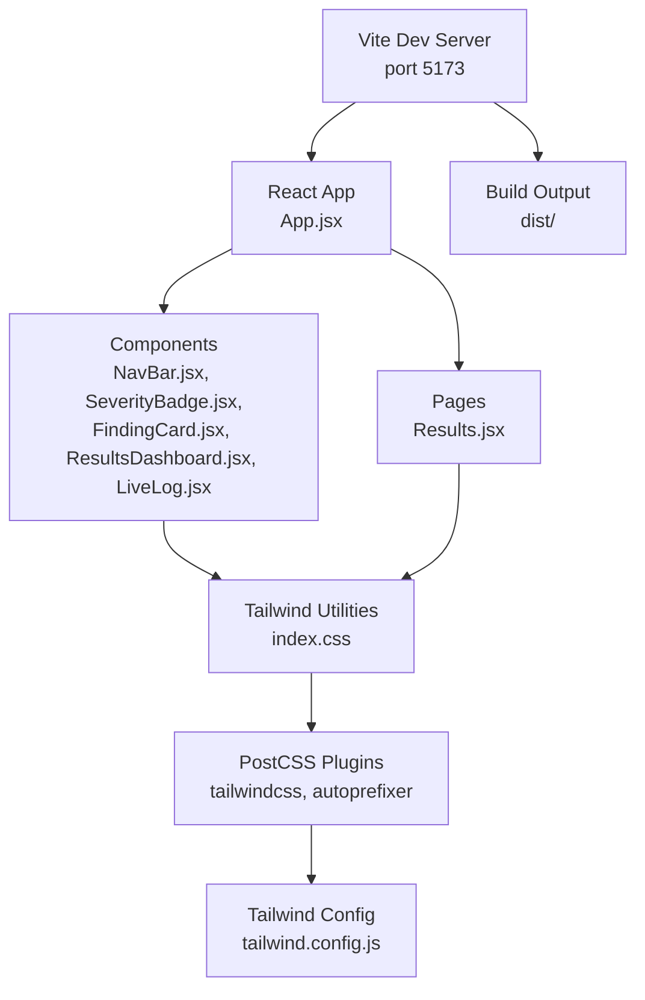
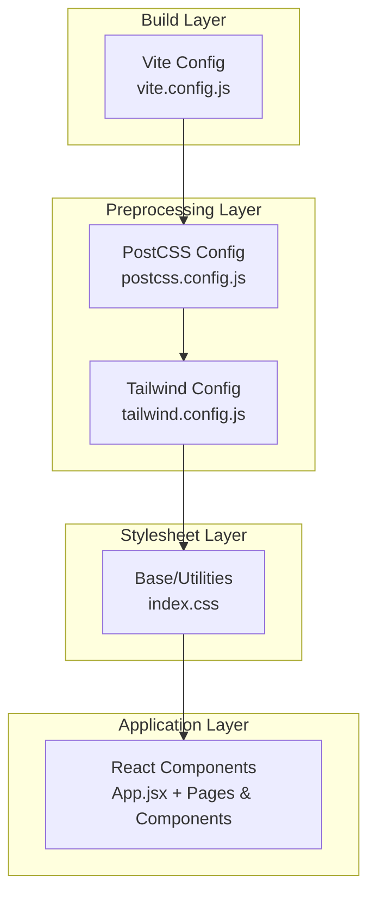
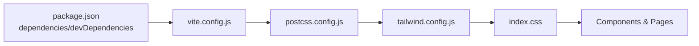

# Styling and Theming

<cite>
**Referenced Files in This Document**
- [package.json](file://frontend/package.json)
- [tailwind.config.js](file://frontend/tailwind.config.js)
- [postcss.config.js](file://frontend/postcss.config.js)
- [vite.config.js](file://frontend/vite.config.js)
- [index.css](file://frontend/src/index.css)
- [App.jsx](file://frontend/src/App.jsx)
- [NavBar.jsx](file://frontend/src/components/NavBar.jsx)
- [SeverityBadge.jsx](file://frontend/src/components/SeverityBadge.jsx)
- [FindingCard.jsx](file://frontend/src/components/FindingCard.jsx)
- [ResultsDashboard.jsx](file://frontend/src/components/ResultsDashboard.jsx)
- [Results.jsx](file://frontend/src/pages/Results.jsx)
- [LiveLog.jsx](file://frontend/src/components/LiveLog.jsx)
</cite>

## Table of Contents
1. [Introduction](#introduction)
2. [Project Structure](#project-structure)
3. [Core Components](#core-components)
4. [Architecture Overview](#architecture-overview)
5. [Detailed Component Analysis](#detailed-component-analysis)
6. [Dependency Analysis](#dependency-analysis)
7. [Performance Considerations](#performance-considerations)
8. [Accessibility Considerations](#accessibility-considerations)
9. [Responsive Design and Breakpoints](#responsive-design-and-breakpoints)
10. [Build Pipeline and Optimization](#build-pipeline-and-optimization)
11. [Custom Component Styling Patterns](#custom-component-styling-patterns)
12. [Theme Customization and Consistency Guidelines](#theme-customization-and-consistency-guidelines)
13. [Troubleshooting Guide](#troubleshooting-guide)
14. [Conclusion](#conclusion)

## Introduction
This document describes AutoPoV’s styling and theming system for the frontend. It covers Tailwind CSS configuration, PostCSS pipeline, custom utility classes, color schemes, dark theme implementation, component styling approaches, and consistency guidelines. It also addresses responsive design patterns, build-time optimization, and accessibility considerations.

## Project Structure
The styling system is organized around a modern Vite-based build with Tailwind CSS and PostCSS. Styles are centralized in a single stylesheet and applied via Tailwind utility classes across React components.

**Diagram sources**
- [vite.config.js:1-21](file://frontend/vite.config.js#L1-L21)
- [App.jsx:12-30](file://frontend/src/App.jsx#L12-L30)
- [NavBar.jsx:32-73](file://frontend/src/components/NavBar.jsx#L32-L73)
- [SeverityBadge.jsx:19-23](file://frontend/src/components/SeverityBadge.jsx#L19-L23)
- [FindingCard.jsx:29-195](file://frontend/src/components/FindingCard.jsx#L29-L195)
- [ResultsDashboard.jsx:85-284](file://frontend/src/components/ResultsDashboard.jsx#L85-L284)
- [Results.jsx:142-430](file://frontend/src/pages/Results.jsx#L142-L430)
- [index.css:1-73](file://frontend/src/index.css#L1-L73)
- [postcss.config.js:1-7](file://frontend/postcss.config.js#L1-L7)
- [tailwind.config.js:1-30](file://frontend/tailwind.config.js#L1-L30)

**Section sources**
- [vite.config.js:1-21](file://frontend/vite.config.js#L1-L21)
- [package.json:1-34](file://frontend/package.json#L1-L34)

## Core Components
- Tailwind CSS configuration defines content scanning, dark mode strategy, extended colors, and fonts.
- PostCSS pipeline applies Tailwind and Autoprefixer.
- Central stylesheet defines base, components, utilities, custom scrollbars, code blocks, animations, and status badges.
- React components apply Tailwind utilities and custom classes consistently.

**Section sources**
- [tailwind.config.js:1-30](file://frontend/tailwind.config.js#L1-L30)
- [postcss.config.js:1-7](file://frontend/postcss.config.js#L1-L7)
- [index.css:1-73](file://frontend/src/index.css#L1-L73)
- [App.jsx:14-28](file://frontend/src/App.jsx#L14-L28)

## Architecture Overview
The styling architecture follows a layered approach:
- Build layer: Vite orchestrates development and production builds.
- Preprocessing layer: PostCSS compiles Tailwind and prefixes vendor-specific properties.
- Utility layer: Tailwind provides atomic classes for rapid UI construction.
- Application layer: React components compose utilities and custom classes.

**Diagram sources**
- [vite.config.js:1-21](file://frontend/vite.config.js#L1-L21)
- [postcss.config.js:1-7](file://frontend/postcss.config.js#L1-L7)
- [tailwind.config.js:1-30](file://frontend/tailwind.config.js#L1-L30)
- [index.css:1-73](file://frontend/src/index.css#L1-L73)
- [App.jsx:12-30](file://frontend/src/App.jsx#L12-L30)

## Detailed Component Analysis

### Tailwind Configuration and Theme
- Content scanning targets HTML and JSX sources.
- Dark mode uses the class strategy.
- Extended color palette includes custom grays and a primary blue scale.
- Font families include Inter for sans and Fira Code for monospace.

**Section sources**
- [tailwind.config.js:3-7](file://frontend/tailwind.config.js#L3-L7)
- [tailwind.config.js:10-25](file://frontend/tailwind.config.js#L10-L25)

### PostCSS Pipeline
- Tailwind and Autoprefixer are enabled.
- Ensures modern CSS compatibility and purges unused styles during production builds.

**Section sources**
- [postcss.config.js:1-7](file://frontend/postcss.config.js#L1-L7)

### Central Stylesheet
- Imports Tailwind base, components, and utilities.
- Defines custom scrollbar styles for dark theme.
- Styles code blocks with monospace font and dark background.
- Declares log entry animation and reusable status badge classes with distinct semantic colors.

**Section sources**
- [index.css:1-3](file://frontend/src/index.css#L1-L3)
- [index.css:5-22](file://frontend/src/index.css#L5-L22)
- [index.css:24-35](file://frontend/src/index.css#L24-L35)
- [index.css:37-51](file://frontend/src/index.css#L37-L51)
- [index.css:53-73](file://frontend/src/index.css#L53-L73)

### Navigation Bar
- Uses dark theme background and borders.
- Active/inactive states for navigation links leverage primary and gray palette tokens.
- Branding icon and text styled with primary color.

**Section sources**
- [NavBar.jsx:32-73](file://frontend/src/components/NavBar.jsx#L32-L73)
- [NavBar.jsx:28-30](file://frontend/src/components/NavBar.jsx#L28-L30)

### Severity Badge
- Maps CWE categories to severity levels and assigns semantic background/text color classes.
- Renders a compact, rounded badge with consistent typography.

**Section sources**
- [SeverityBadge.jsx:19-23](file://frontend/src/components/SeverityBadge.jsx#L19-L23)

### Finding Card
- Collapsible card with header/footer sections and expandable details.
- Uses severity badge, confidence coloring, and status icons.
- Highlights vulnerable code and PoV script in monospace blocks.
- Conditional rendering for validation results and execution outcomes.

**Section sources**
- [FindingCard.jsx:29-195](file://frontend/src/components/FindingCard.jsx#L29-L195)

### Results Dashboard
- Summary cards, charts, and progress bars for metrics.
- Uses Recharts with dark-themed tooltips and axes.
- Cost breakdown toggles detailed modalized sections.

**Section sources**
- [ResultsDashboard.jsx:85-284](file://frontend/src/components/ResultsDashboard.jsx#L85-L284)

### Live Log
- Monospace terminal-like container with animated entries.
- Color-coded messages based on keywords.
- Auto-scrolls to latest entry.

**Section sources**
- [LiveLog.jsx:24-62](file://frontend/src/components/LiveLog.jsx#L24-L62)

### Results Page
- Orchestrates loading states, error handling, and tabbed views.
- Integrates dashboard and cards with consistent spacing and color tokens.

**Section sources**
- [Results.jsx:142-430](file://frontend/src/pages/Results.jsx#L142-L430)

## Dependency Analysis
The styling stack depends on Tailwind utilities and PostCSS plugins. Components depend on Tailwind classes and custom CSS selectors.

**Diagram sources**
- [package.json:12-31](file://frontend/package.json#L12-L31)
- [vite.config.js:1-21](file://frontend/vite.config.js#L1-L21)
- [postcss.config.js:1-7](file://frontend/postcss.config.js#L1-L7)
- [tailwind.config.js:1-30](file://frontend/tailwind.config.js#L1-L30)
- [index.css:1-73](file://frontend/src/index.css#L1-L73)

**Section sources**
- [package.json:12-31](file://frontend/package.json#L12-L31)
- [vite.config.js:1-21](file://frontend/vite.config.js#L1-L21)

## Performance Considerations
- Tailwind purging: Tailwind’s content globs exclude unused styles in production builds.
- PostCSS autoprefixing: Adds vendor prefixes automatically, reducing manual maintenance.
- Minimal custom CSS: Keeps styles lean and maintainable.
- Component composition: Atomic classes reduce duplication and improve caching.

[No sources needed since this section provides general guidance]

## Accessibility Considerations
- Contrast: Dark theme grays and primary blue provide sufficient contrast for text and interactive elements.
- Focus and hover: Hover states use lighter grays; ensure keyboard focus visibility remains consistent.
- Color semantics: Status and severity rely on color; ensure ARIA attributes or textual alternatives accompany color-only indicators where appropriate.
- Motion: Fade-in animation is subtle; avoid excessive motion for sensitive users.

[No sources needed since this section provides general guidance]

## Responsive Design and Breakpoints
- Grid layouts: Components use responsive grid classes (e.g., two-column on small screens, five-column summary).
- Charts: Recharts containers adapt to parent widths with responsive sizing.
- Typography and spacing: Consistent padding and margin utilities scale across breakpoints.

**Section sources**
- [ResultsDashboard.jsx:131-183](file://frontend/src/components/ResultsDashboard.jsx#L131-L183)
- [Results.jsx:280-330](file://frontend/src/pages/Results.jsx#L280-L330)

## Build Pipeline and Optimization
- Vite dev server runs on port 5173 with API proxy to backend.
- Build output directory configured; source maps enabled for debugging.
- Tailwind purges unused CSS in production builds.
- PostCSS autoprefixer ensures compatibility across browsers.

**Section sources**
- [vite.config.js:7-19](file://frontend/vite.config.js#L7-L19)
- [tailwind.config.js:3-6](file://frontend/tailwind.config.js#L3-L6)
- [postcss.config.js:1-7](file://frontend/postcss.config.js#L1-L7)

## Custom Component Styling Patterns
- Semantic status badges: Reusable classes for completed, running, failed, and pending states.
- Scrollbar customization: Dark-themed scrollbars for consistent UX.
- Animated transitions: Subtle fade-in for live logs.
- Monospace code blocks: Dedicated styling for code and PoV script display.

**Section sources**
- [index.css:53-73](file://frontend/src/index.css#L53-L73)
- [index.css:5-22](file://frontend/src/index.css#L5-L22)
- [index.css:37-51](file://frontend/src/index.css#L37-L51)
- [index.css:24-35](file://frontend/src/index.css#L24-L35)

## Theme Customization and Consistency Guidelines
- Dark theme: Implemented via Tailwind’s class strategy; consistent dark backgrounds and borders across components.
- Color tokens: Use primary palette for highlights and semantic grays for backgrounds and borders.
- Typography: Inter for body text and Fira Code for code blocks; maintain consistent font sizes and weights.
- Spacing: Use padding/margin utilities for consistent rhythm; avoid hard-coded pixel values.
- Component boundaries: Apply consistent border radii and border tokens for cards and modals.

**Section sources**
- [tailwind.config.js:7-7](file://frontend/tailwind.config.js#L7-L7)
- [tailwind.config.js:10-25](file://frontend/tailwind.config.js#L10-L25)
- [index.css:11-12](file://frontend/src/index.css#L11-L12)
- [NavBar.jsx:32-33](file://frontend/src/components/NavBar.jsx#L32-L33)
- [ResultsDashboard.jsx:85-86](file://frontend/src/components/ResultsDashboard.jsx#L85-L86)

## Troubleshooting Guide
- Tailwind classes not applying:
  - Verify content globs in Tailwind config include component paths.
  - Ensure PostCSS plugins are loaded in the build pipeline.
- Dark theme not activating:
  - Confirm dark mode strategy is set to class and that the class is toggled on the root element.
- Build errors:
  - Check Vite dev server port conflicts and proxy configuration.
  - Validate PostCSS plugin order and Tailwind version compatibility.

**Section sources**
- [tailwind.config.js:3-7](file://frontend/tailwind.config.js#L3-L7)
- [postcss.config.js:1-7](file://frontend/postcss.config.js#L1-L7)
- [vite.config.js:7-14](file://frontend/vite.config.js#L7-L14)

## Conclusion
AutoPoV’s styling system leverages Tailwind CSS and PostCSS to deliver a consistent, maintainable, and performant design system. The dark theme is implemented with a class-based strategy, while custom utilities and component patterns ensure readability and usability across diverse UI surfaces. Following the provided guidelines will help maintain visual coherence and accessibility across future enhancements.