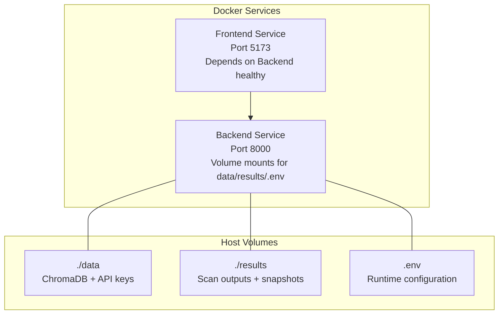
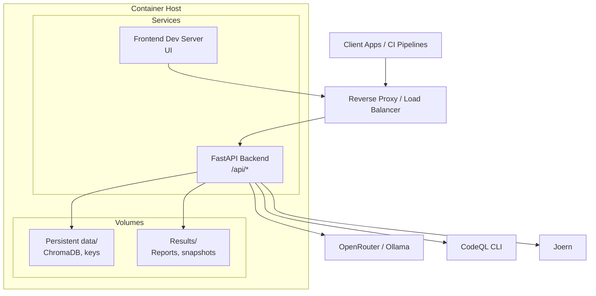
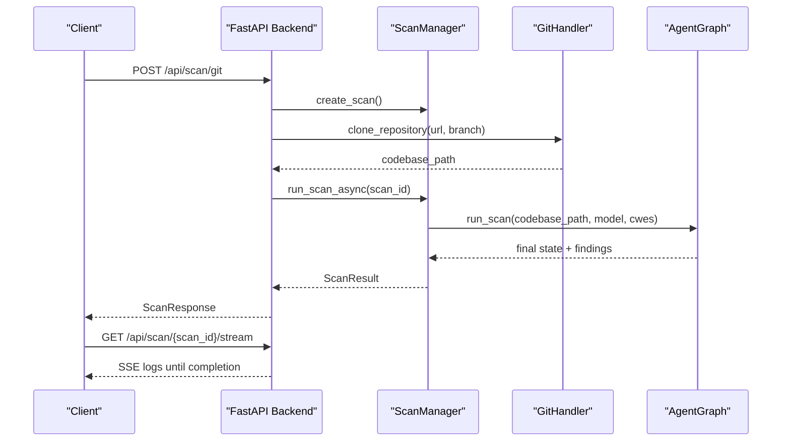
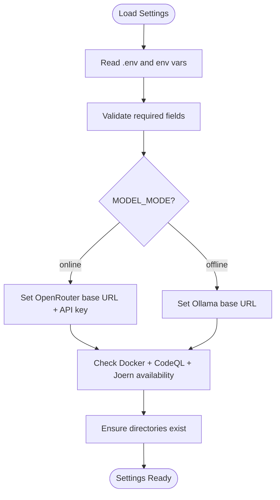
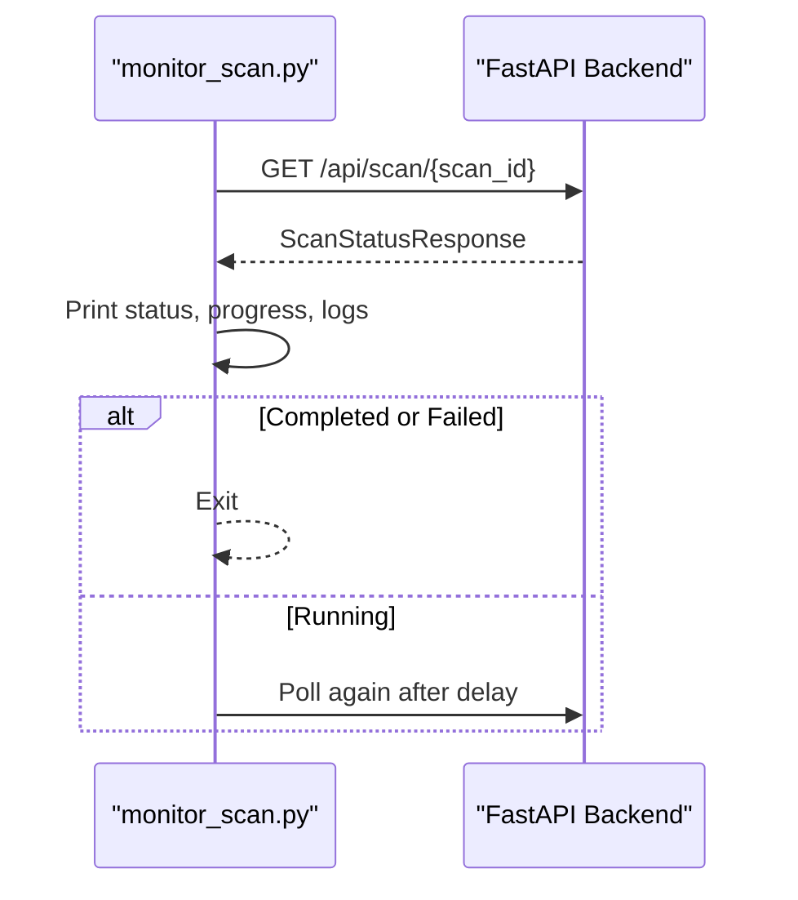
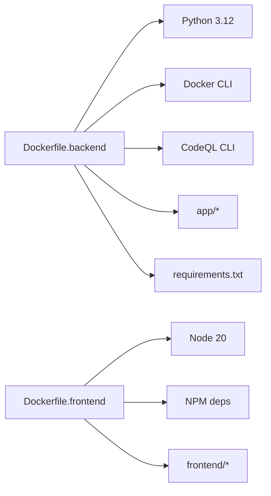

# Deployment & Operations

<cite>
**Referenced Files in This Document**
- [docker-compose.yml](file://docker-compose.yml)
- [Dockerfile.backend](file://Dockerfile.backend)
- [Dockerfile.frontend](file://Dockerfile.frontend)
- [app/main.py](file://app/main.py)
- [app/config.py](file://app/config.py)
- [requirements.txt](file://requirements.txt)
- [docker-setup.sh](file://docker-setup.sh)
- [start-all.sh](file://start-all.sh)
- [start-autopov.sh](file://start-autopov.sh)
- [monitor_scan.py](file://monitor_scan.py)
- [cli/autopov.py](file://cli/autopov.py)
- [cli/agent-run.sh](file://cli/agent-run.sh)
- [.dockerignore](file://.dockerignore)
- [README.md](file://README.md)
</cite>

## Table of Contents
1. [Introduction](#introduction)
2. [Project Structure](#project-structure)
3. [Core Components](#core-components)
4. [Architecture Overview](#architecture-overview)
5. [Detailed Component Analysis](#detailed-component-analysis)
6. [Dependency Analysis](#dependency-analysis)
7. [Performance Considerations](#performance-considerations)
8. [Troubleshooting Guide](#troubleshooting-guide)
9. [Backup and Recovery](#backup-and-recovery)
10. [CI/CD and Infrastructure as Code](#ci-cd-and-infrastructure-as-code)
11. [Conclusion](#conclusion)

## Introduction
This document provides comprehensive deployment and operations guidance for AutoPoV in production environments. It covers Docker-based deployment architecture, container orchestration, service dependencies, production configuration and environment variable management, security hardening, monitoring and logging strategies, scaling and performance optimization, backup and recovery, maintenance operations, troubleshooting, and CI/CD integration patterns.

## Project Structure
AutoPoV is organized around a FastAPI backend and a separate frontend UI. Production deployments use Docker Compose to orchestrate two primary services:
- Backend: exposes the REST API, vulnerability scanning pipeline, and administrative endpoints.
- Frontend: serves the React-based UI locally during development or via a reverse proxy in production.

**Diagram sources**
- [docker-compose.yml:1-41](file://docker-compose.yml#L1-L41)

**Section sources**
- [docker-compose.yml:1-41](file://docker-compose.yml#L1-L41)

## Core Components
- Backend service
  - Built from Dockerfile.backend, installs Python, Docker CLI, and CodeQL CLI, then runs the FastAPI application.
  - Exposes port 8000 and defines health checks against /api/health.
  - Mounts persistent volumes for data and results, and reads environment variables from .env.
- Frontend service
  - Built from Dockerfile.frontend, runs the development server on port 5173.
  - Depends on backend being healthy before starting.
- Configuration
  - Centralized in app/config.py using Pydantic settings with environment variable overrides.
  - Includes LLM providers, vector store, security keys, Docker and tool availability checks, and cost controls.

**Section sources**
- [Dockerfile.backend:1-64](file://Dockerfile.backend#L1-L64)
- [Dockerfile.frontend:1-29](file://Dockerfile.frontend#L1-L29)
- [docker-compose.yml:1-41](file://docker-compose.yml#L1-L41)
- [app/config.py:13-255](file://app/config.py#L13-L255)

## Architecture Overview
The production architecture centers on a containerized backend API with optional Docker-in-Docker capabilities for safe PoV execution, and a separate frontend process. The backend integrates with external tools (CodeQL, Joern) and LLM providers (OpenRouter/Ollama) based on configuration.

**Diagram sources**
- [docker-compose.yml:1-41](file://docker-compose.yml#L1-L41)
- [app/config.py:30-91](file://app/config.py#L30-L91)
- [app/main.py:175-200](file://app/main.py#L175-L200)

## Detailed Component Analysis

### Backend Service (FastAPI)
- Entrypoint and routing are defined in app/main.py, including health checks, scan endpoints, streaming logs, reports, webhooks, and admin operations.
- Configuration is loaded via app/config.py, which validates environment variables and provides runtime checks for Docker and external tools.
- The backend supports:
  - Git repository scans, ZIP uploads, and raw code pastes.
  - Replay of prior findings across models.
  - Real-time log streaming via Server-Sent Events.
  - Metrics and learning store summaries.
  - Webhook integrations for GitHub and GitLab.

**Diagram sources**
- [app/main.py:204-285](file://app/main.py#L204-L285)
- [app/main.py:548-583](file://app/main.py#L548-L583)
- [app/scan_manager.py:74-114](file://app/scan_manager.py#L74-L114)
- [app/scan_manager.py:117-200](file://app/scan_manager.py#L117-L200)

**Section sources**
- [app/main.py:175-200](file://app/main.py#L175-L200)
- [app/main.py:204-400](file://app/main.py#L204-L400)
- [app/main.py:511-583](file://app/main.py#L511-L583)
- [app/scan_manager.py:47-200](file://app/scan_manager.py#L47-L200)

### Configuration and Environment Management
- Settings are centralized in app/config.py with strict validation and defaults. Key areas:
  - Application and API host/port.
  - Security: ADMIN_API_KEY, WEBHOOK_SECRET, API keys for providers.
  - LLM configuration: MODEL_MODE (online/offline), MODEL_NAME, provider-specific URLs.
  - Routing and policy: ROUTING_MODE, AUTO_ROUTER_MODEL, LEARNING_DB_PATH.
  - Vector store: CHROMA_PERSIST_DIR, collection name.
  - Code analysis tools: CODEQL_CLI_PATH, CODEQL_PACKS_BASE, JOERN_CLI_PATH, KAITAI_STRUCT_COMPILER_PATH.
  - Docker configuration: DOCKER_ENABLED, DOCKER_IMAGE, timeouts, limits.
  - Cost control: MAX_COST_USD, COST_TRACKING_ENABLED.
  - Paths and snapshot settings: DATA_DIR, RESULTS_DIR, SNAPSHOT_DIR, SAVE_CODEBASE_SNAPSHOT.
  - Frontend URL for CORS.

**Diagram sources**
- [app/config.py:13-255](file://app/config.py#L13-L255)

**Section sources**
- [app/config.py:13-255](file://app/config.py#L13-L255)

### Monitoring and Logging Strategies
- Health endpoint: GET /api/health returns status, version, and tool availability flags.
- Real-time logs: GET /api/scan/{scan_id}/stream streams incremental logs via SSE.
- Metrics endpoint: GET /api/metrics exposes system metrics for scans and costs.
- CLI monitoring: monitor_scan.py polls status and prints logs until completion.
- Frontend logs: The frontend runs locally on port 5173; in production, serve via a reverse proxy and enable structured logging in the backend.

**Diagram sources**
- [monitor_scan.py:15-71](file://monitor_scan.py#L15-L71)
- [app/main.py:511-545](file://app/main.py#L511-L545)

**Section sources**
- [app/main.py:175-200](file://app/main.py#L175-L200)
- [app/main.py:548-583](file://app/main.py#L548-L583)
- [monitor_scan.py:1-90](file://monitor_scan.py#L1-L90)

### Security Hardening
- API key authentication with HMAC-based verification and rate limiting.
- Admin-only endpoints protected by ADMIN_API_KEY.
- CORS configured to allow frontend origins.
- Environment variables mounted read-only where applicable.
- Optional Docker-in-Docker support for isolated PoV execution.

Recommendations:
- Enforce HTTPS/TLS termination at the reverse proxy.
- Rotate API keys regularly and restrict scopes.
- Limit exposed ports to 8000 and 5173 only when needed.
- Use non-root users inside containers and minimize privileges.

**Section sources**
- [app/auth.py:192-256](file://app/auth.py#L192-L256)
- [app/main.py:124-131](file://app/main.py#L124-L131)
- [docker-compose.yml:12-13](file://docker-compose.yml#L12-L13)

### Scaling Considerations
- Current deployment uses a single backend container. For production:
  - Scale the backend horizontally behind a load balancer.
  - Persist shared state via a remote Chroma server or managed vector DB.
  - Use a shared results volume or object storage for reports and snapshots.
  - Consider queue-based workers for long-running scans.
- Resource tuning:
  - Adjust CPU and memory limits in Docker settings.
  - Tune Python worker pool sizes and concurrency in ScanManager.

[No sources needed since this section provides general guidance]

### Performance Optimization
- Use offline LLM mode (Ollama) for lower latency and reduced external API costs.
- Enable cost tracking and caps to prevent runaway expenses.
- Pre-download CodeQL packs to reduce cold-start delays.
- Optimize chunk sizes and overlap for large repositories.

**Section sources**
- [app/config.py:99-106](file://app/config.py#L99-L106)
- [Dockerfile.backend:38-41](file://Dockerfile.backend#L38-L41)

## Dependency Analysis
- Backend Dockerfile installs Python, Docker CLI, and CodeQL CLI, then copies application code and sets environment variables.
- Frontend Dockerfile installs Node.js dependencies with retry logic and runs the dev server.
- Requirements include FastAPI, Uvicorn, LangChain/LangGraph, ChromaDB, GitPython, Docker SDK, and reporting libraries.

**Diagram sources**
- [Dockerfile.backend:1-64](file://Dockerfile.backend#L1-L64)
- [Dockerfile.frontend:1-29](file://Dockerfile.frontend#L1-L29)
- [requirements.txt:1-44](file://requirements.txt#L1-L44)

**Section sources**
- [Dockerfile.backend:1-64](file://Dockerfile.backend#L1-L64)
- [Dockerfile.frontend:1-29](file://Dockerfile.frontend#L1-L29)
- [requirements.txt:1-44](file://requirements.txt#L1-L44)

## Performance Considerations
- Container startup time: Install dependencies at build time; keep layers minimal.
- Network resilience: Frontend Dockerfile retries NPM installs with exponential backoff.
- Tool availability: Backend checks Docker, CodeQL, and Joern at runtime; handle gracefully when unavailable.
- Concurrency: ThreadPoolExecutor in ScanManager balances CPU-bound tasks; tune max_workers per host resources.

**Section sources**
- [Dockerfile.frontend:13-19](file://Dockerfile.frontend#L13-L19)
- [app/config.py:162-210](file://app/config.py#L162-L210)
- [app/scan_manager.py:68-72](file://app/scan_manager.py#L68-L72)

## Troubleshooting Guide
Common issues and resolutions:
- Backend not reachable
  - Verify health endpoint: curl http://localhost:8000/api/health
  - Check logs: docker-compose logs backend
  - Ensure port 8000 is free and container restarted unless-stopped.
- Frontend fails to start
  - Confirm backend is healthy before starting frontend.
  - Check .env presence and OPENROUTER_API_KEY.
- Docker-in-Docker failures
  - Confirm DOCKER_ENABLED and /var/run/docker.sock mount.
  - Validate Docker daemon availability inside container.
- Missing tools
  - CodeQL/Joern not found: install CLI binaries or disable related features.
- API key errors
  - Use admin endpoints only with ADMIN_API_KEY.
  - Rate-limit exceeded: reduce request frequency or increase limits.

Operational scripts:
- docker-setup.sh: Guides Docker and Compose installation, creates .env if missing, and prints next steps.
- start-all.sh: Starts backend in Docker, waits for readiness, then launches frontend locally.
- start-autopov.sh: Single-container backend launch with readiness polling.
- monitor_scan.py: CLI monitor for scan progress and logs.

**Section sources**
- [docker-setup.sh:31-126](file://docker-setup.sh#L31-L126)
- [start-all.sh:32-62](file://start-all.sh#L32-L62)
- [start-autopov.sh:43-92](file://start-autopov.sh#L43-L92)
- [monitor_scan.py:15-90](file://monitor_scan.py#L15-L90)
- [app/main.py:175-200](file://app/main.py#L175-L200)

## Backup and Recovery
- Data persistence
  - ./data: ChromaDB and API keys.
  - ./results: Scan reports, snapshots, and run artifacts.
- Recommendations
  - Back up ./data and ./results volumes regularly.
  - Use immutable snapshots for reproducible scans; retain only necessary historical runs.
  - Store backups offsite or in secure object storage with retention policies.
- Maintenance
  - Periodically clean old results via admin endpoint or CLI to control disk usage.

**Section sources**
- [docker-compose.yml:9-12](file://docker-compose.yml#L9-L12)
- [app/main.py:726-742](file://app/main.py#L726-L742)

## CI/CD and Infrastructure as Code
- Local automation
  - docker-setup.sh automates environment setup and provides run commands.
  - start-all.sh and start-autopov.sh streamline local development.
- CI/CD integration patterns
  - Build images via Dockerfile.backend and Dockerfile.frontend.
  - Use docker-compose for staging and production deployments.
  - Parameterize .env for different environments (dev/stage/prod).
  - Gate deployments with health checks and canary rollouts.
- Infrastructure as Code
  - Define services, networks, and volumes in docker-compose.yml.
  - Externalize secrets and environment-specific overrides using Compose profiles or external secret managers.

**Section sources**
- [docker-setup.sh:105-126](file://docker-setup.sh#L105-L126)
- [start-all.sh:10-62](file://start-all.sh#L10-L62)
- [start-autopov.sh:43-92](file://start-autopov.sh#L43-L92)
- [docker-compose.yml:1-41](file://docker-compose.yml#L1-L41)

## Conclusion
AutoPoV’s production deployment relies on a robust Docker-based architecture with a FastAPI backend and a separate frontend. By centralizing configuration, enforcing security controls, instrumenting monitoring, and adopting scalable patterns, teams can operate AutoPoV reliably at scale. Use the provided scripts and endpoints to bootstrap, monitor, and maintain the system, and apply the recommended hardening and operational practices for secure, high-performance operations.