# Deployment and Operations

<cite>
**Referenced Files in This Document**
- [.dockerignore](file://autopov/.dockerignore)
- [Dockerfile.backend](file://autopov/Dockerfile.backend)
- [Dockerfile.frontend](file://autopov/Dockerfile.frontend)
- [docker-compose.yml](file://autopov/docker-compose.yml)
- [docker-setup.sh](file://autopov/docker-setup.sh)
- [start-all.sh](file://autopov/start-all.sh)
- [start-autopov.sh](file://autopov/start-autopov.sh)
- [requirements.txt](file://autopov/requirements.txt)
- [run.sh](file://autopov/run.sh)
- [main.py](file://autopov/app/main.py)
- [config.py](file://autopov/app/config.py)
- [docker_runner.py](file://autopov/agents/docker_runner.py)
- [scan_manager.py](file://autopov/app/scan_manager.py)
- [auth.py](file://autopov/app/auth.py)
- [webhook_handler.py](file://autopov/app/webhook_handler.py)
- [source_handler.py](file://autopov/app/source_handler.py)
- [investigator.py](file://autopov/agents/investigator.py)
- [verifier.py](file://autopov/agents/verifier.py)
- [agent_graph.py](file://autopov/app/agent_graph.py)
- [package.json](file://autopov/frontend/package.json)
- [vite.config.js](file://autopov/frontend/vite.config.js)
- [.env.example](file://autopov/.env.example)
</cite>

## Update Summary
**Changes Made**
- Added comprehensive Docker-in-Docker support with Docker CLI installation in backend container
- Integrated CodeQL CLI installation and configuration for enhanced vulnerability scanning
- Enhanced environment configuration with health check endpoints and automatic restart policies
- Improved container orchestration with health checks and dependency management
- Added comprehensive tool availability checking for Docker, CodeQL, Joern, and Kaitai Struct
- Updated deployment scripts with enhanced startup and troubleshooting capabilities

## Table of Contents
1. [Introduction](#introduction)
2. [Project Structure](#project-structure)
3. [Core Components](#core-components)
4. [Architecture Overview](#architecture-overview)
5. [Detailed Component Analysis](#detailed-component-analysis)
6. [Dependency Analysis](#dependency-analysis)
7. [Containerization Infrastructure](#containerization-infrastructure)
8. [Production Deployment Procedures](#production-deployment-procedures)
9. [Performance Considerations](#performance-considerations)
10. [Monitoring and Logging](#monitoring-and-logging)
11. [Maintenance Procedures](#maintenance-procedures)
12. [Operational Automation Examples](#operational-automation-examples)
13. [Capacity Planning, Resource Optimization, and Cost Management](#capacity-planning-resource-optimization-and-cost-management)
14. [Cloud Deployment, Container Orchestration, and Disaster Recovery](#cloud-deployment-container-orchestration-and-disaster-recovery)
15. [Troubleshooting Guide](#troubleshooting-guide)
16. [Conclusion](#conclusion)
17. [Appendices](#appendices)

## Introduction
This document provides comprehensive guidance for deploying and operating AutoPoV in production environments. It covers environment preparation, dependency management, service configuration, monitoring and logging, performance optimization, maintenance procedures, automation examples, and operational troubleshooting. The document now includes extensive coverage of Docker containerization infrastructure, container orchestration, and cloud-native deployment strategies. Recent enhancements include Docker-in-Docker support, CodeQL CLI integration, comprehensive environment configuration, health checks, automatic restart policies, and improved container orchestration capabilities.

## Project Structure
AutoPoV is organized into a FastAPI backend, a React frontend, and autonomous agents that orchestrate LLM-based vulnerability discovery and validation. The backend exposes REST endpoints for scanning, streaming logs, reports, and administration. Agents encapsulate investigation and verification logic and integrate with Docker for safe PoV execution. The project now includes comprehensive Docker containerization infrastructure with separate backend and frontend containers, orchestrated through Docker Compose, featuring Docker-in-Docker support and CodeQL integration.

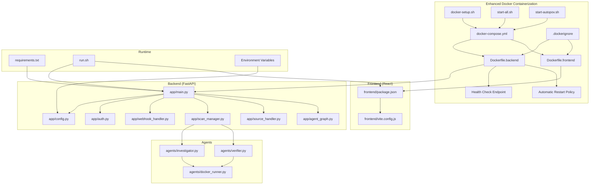

**Diagram sources**
- [docker-compose.yml:1-40](file://autopov/docker-compose.yml#L1-L40)
- [Dockerfile.backend:1-64](file://autopov/Dockerfile.backend#L1-L64)
- [Dockerfile.frontend:1-29](file://autopov/Dockerfile.frontend#L1-L29)
- [.dockerignore:1-55](file://autopov/.dockerignore#L1-L55)
- [docker-setup.sh:1-126](file://autopov/docker-setup.sh#L1-L126)
- [start-all.sh:1-63](file://autopov/start-all.sh#L1-L63)
- [start-autopov.sh:1-93](file://autopov/start-autopov.sh#L1-L93)
- [main.py:175-196](file://autopov/app/main.py#L175-L196)
- [config.py:157-205](file://autopov/app/config.py#L157-L205)
- [docker-runner.py:50-60](file://autopov/agents/docker_runner.py#L50-L60)
- [agent_graph.py:243-264](file://autopov/app/agent_graph.py#L243-L264)

**Section sources**
- [docker-compose.yml:1-40](file://autopov/docker-compose.yml#L1-L40)
- [Dockerfile.backend:1-64](file://autopov/Dockerfile.backend#L1-L64)
- [Dockerfile.frontend:1-29](file://autopov/Dockerfile.frontend#L1-L29)
- [.dockerignore:1-55](file://autopov/.dockerignore#L1-L55)
- [docker-setup.sh:1-126](file://autopov/docker-setup.sh#L1-L126)
- [start-all.sh:1-63](file://autopov/start-all.sh#L1-L63)
- [start-autopov.sh:1-93](file://autopov/start-autopov.sh#L1-L93)
- [main.py:175-196](file://autopov/app/main.py#L175-L196)
- [config.py:157-205](file://autopov/app/config.py#L157-L205)
- [run.sh:1-233](file://autopov/run.sh#L1-L233)
- [requirements.txt:1-42](file://autopov/requirements.txt#L1-L42)
- [package.json:1-34](file://autopov/frontend/package.json#L1-L34)
- [vite.config.js:1-21](file://autopov/frontend/vite.config.js#L1-L21)

## Core Components
- Configuration and Environment Management
  - Centralized settings via environment variables and runtime checks for tool availability.
  - Docker-based environment variable loading through .env files.
  - Enhanced health check endpoints for service monitoring.
  - Automatic restart policies for service reliability.
  - Example paths: [config.py:13-249](file://autopov/app/config.py#L13-L249), [main.py:175-196](file://autopov/app/main.py#L175-L196)
- API Layer
  - REST endpoints for scanning, streaming logs, reports, webhooks, and admin key management.
  - Health check endpoint providing service status and tool availability.
  - Example paths: [main.py:161-529](file://autopov/app/main.py#L161-L529)
- Authentication and Authorization
  - Bearer token authentication and admin-only endpoints guarded by admin API key.
  - Example paths: [auth.py:137-168](file://autopov/app/auth.py#L137-L168)
- Scan Orchestration
  - Thread-pooled asynchronous scan execution, persistence, and metrics.
  - CodeQL integration for enhanced vulnerability detection.
  - Example paths: [scan_manager.py:86-344](file://autopov/app/scan_manager.py#L86-L344), [agent_graph.py:243-310](file://autopov/app/agent_graph.py#L243-L310)
- Source Handling
  - ZIP/TAR extraction, raw code paste, and file/folder uploads with security checks.
  - Example paths: [source_handler.py:31-380](file://autopov/app/source_handler.py#L31-L380)
- Webhook Integration
  - GitHub and GitLab webhook parsing, signature/token verification, and scan triggering.
  - Example paths: [webhook_handler.py:196-363](file://autopov/app/webhook_handler.py#L196-L363)
- Agent Workflows
  - Investigation using LLMs and RAG; verification generating and validating PoV scripts; Docker sandboxing.
  - CodeQL CLI integration for database creation and vulnerability queries.
  - Example paths: [investigator.py:254-413](file://autopov/agents/investigator.py#L254-L413), [verifier.py:79-401](file://autopov/agents/verifier.py#L79-L401), [docker_runner.py:62-379](file://autopov/agents/docker_runner.py#L62-L379)
- Frontend Proxy and Build
  - Vite development proxy to backend and build configuration.
  - Example paths: [vite.config.js:1-21](file://autopov/frontend/vite.config.js#L1-L21), [package.json:1-34](file://autopov/frontend/package.json#L1-L34)
- Containerization Infrastructure
  - Separate backend and frontend Docker containers with volume mounting for persistent data.
  - Docker Compose orchestration with environment variable management and health checks.
  - Docker-in-Docker support with Docker CLI installation and CodeQL integration.
  - Example paths: [docker-compose.yml:1-40](file://autopov/docker-compose.yml#L1-L40), [Dockerfile.backend:1-64](file://autopov/Dockerfile.backend#L1-L64), [Dockerfile.frontend:1-29](file://autopov/Dockerfile.frontend#L1-L29)

**Section sources**
- [config.py:13-249](file://autopov/app/config.py#L13-L249)
- [main.py:161-529](file://autopov/app/main.py#L161-L529)
- [auth.py:137-168](file://autopov/app/auth.py#L137-L168)
- [scan_manager.py:86-344](file://autopov/app/scan_manager.py#L86-L344)
- [source_handler.py:31-380](file://autopov/app/source_handler.py#L31-L380)
- [webhook_handler.py:196-363](file://autopov/app/webhook_handler.py#L196-L363)
- [investigator.py:254-413](file://autopov/agents/investigator.py#L254-L413)
- [verifier.py:79-401](file://autopov/agents/verifier.py#L79-L401)
- [docker_runner.py:62-379](file://autopov/agents/docker_runner.py#L62-L379)
- [vite.config.js:1-21](file://autopov/frontend/vite.config.js#L1-L21)
- [package.json:1-34](file://autopov/frontend/package.json#L1-L34)
- [docker-compose.yml:1-40](file://autopov/docker-compose.yml#L1-L40)
- [Dockerfile.backend:1-64](file://autopov/Dockerfile.backend#L1-L64)
- [Dockerfile.frontend:1-29](file://autopov/Dockerfile.frontend#L1-L29)

## Architecture Overview
The system comprises:
- A FastAPI application serving REST endpoints and SSE for live logs, containerized in Docker with health checks.
- An agent graph orchestrating investigation and verification steps with CodeQL integration.
- A Docker runner sandboxing PoV execution with Docker-in-Docker support.
- A frontend proxying API requests to the backend.
- Docker Compose orchestration managing container lifecycle, volume persistence, and automatic restart policies.

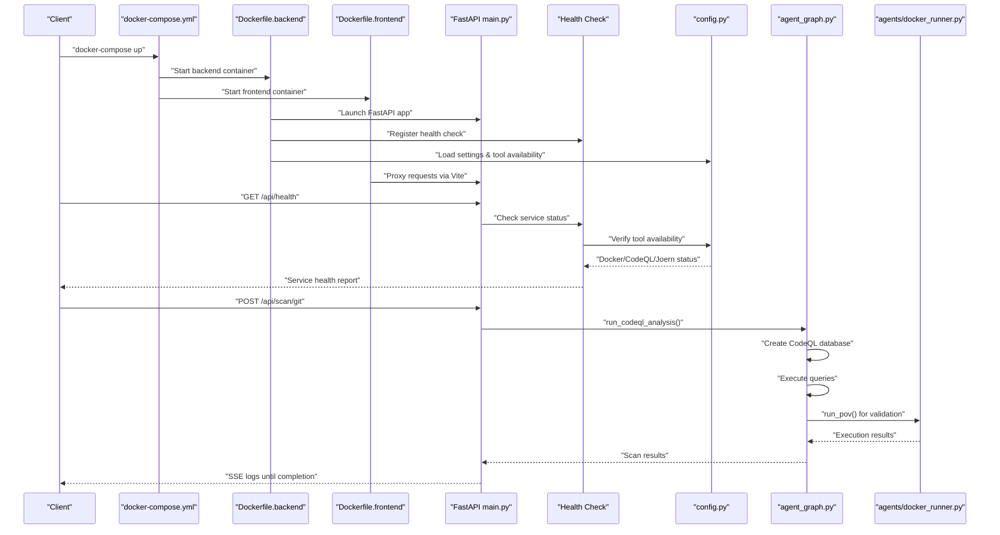

**Diagram sources**
- [docker-compose.yml:1-40](file://autopov/docker-compose.yml#L1-L40)
- [Dockerfile.backend:1-64](file://autopov/Dockerfile.backend#L1-L64)
- [Dockerfile.frontend:1-29](file://autopov/Dockerfile.frontend#L1-L29)
- [main.py:175-196](file://autopov/app/main.py#L175-L196)
- [config.py:157-205](file://autopov/app/config.py#L157-L205)
- [agent_graph.py:243-310](file://autopov/app/agent_graph.py#L243-L310)
- [docker_runner.py:62-192](file://autopov/agents/docker_runner.py#L62-L192)

## Detailed Component Analysis

### Enhanced Configuration and Environment Management
- Centralized settings via environment variables with defaults and validators.
- Comprehensive tool availability checks for Docker, CodeQL, Joern, and Kaitai Struct.
- LLM configuration switching between online and offline modes.
- Directory provisioning and metrics exposure.
- Docker environment variable loading through .env files.
- Health check endpoint for service monitoring.

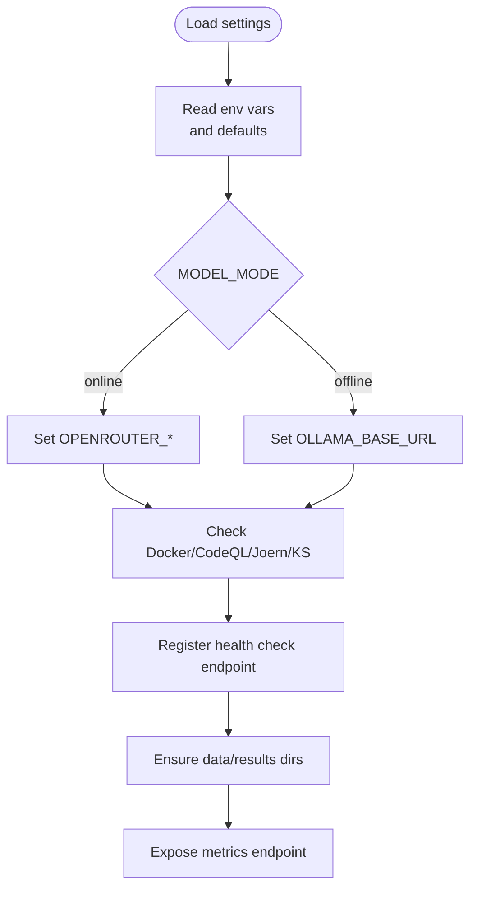

**Diagram sources**
- [config.py:13-249](file://autopov/app/config.py#L13-L249)
- [main.py:175-196](file://autopov/app/main.py#L175-L196)

**Section sources**
- [config.py:13-249](file://autopov/app/config.py#L13-L249)
- [main.py:175-196](file://autopov/app/main.py#L175-L196)

### API Endpoints and Streaming Logs
- Health, scan initiation, status polling/streaming, history, reports, webhooks, and admin key management.
- SSE endpoint streams logs and final result upon completion.
- Health check endpoint provides comprehensive service status including tool availability.

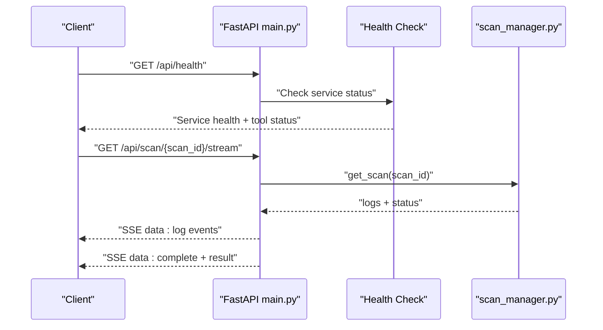

**Diagram sources**
- [main.py:175-196](file://autopov/app/main.py#L175-L196)
- [main.py:347-382](file://autopov/app/main.py#L347-L382)
- [scan_manager.py:237-286](file://autopov/app/scan_manager.py#L237-L286)

**Section sources**
- [main.py:161-529](file://autopov/app/main.py#L161-L529)
- [main.py:175-196](file://autopov/app/main.py#L175-L196)
- [scan_manager.py:237-344](file://autopov/app/scan_manager.py#L237-L344)

### Authentication and Admin Controls
- Bearer token authentication for API endpoints.
- Admin-only endpoints for key generation, listing, and revocation.
- Admin key validation enforced via dependency.

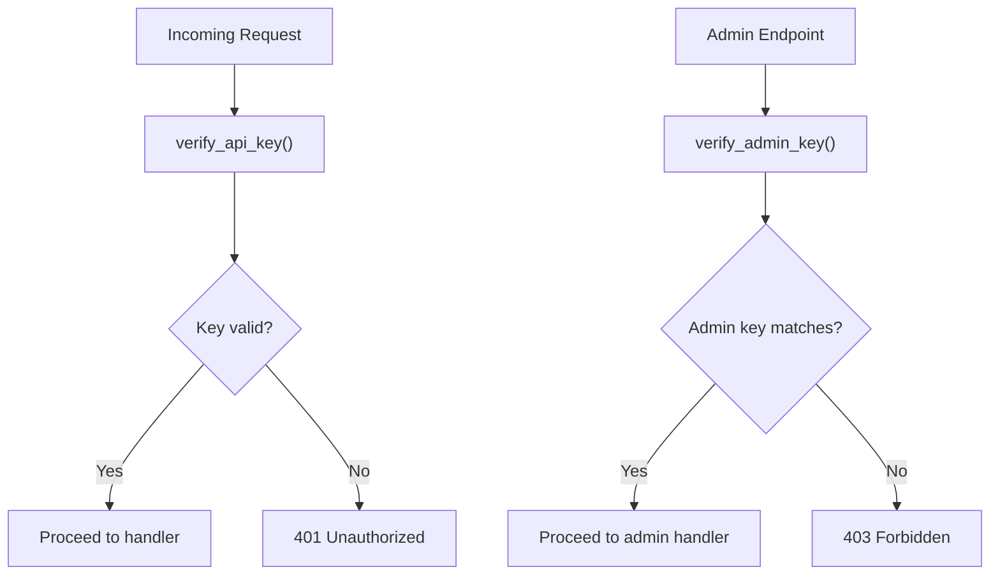

**Diagram sources**
- [auth.py:137-168](file://autopov/app/auth.py#L137-L168)
- [main.py:475-508](file://autopov/app/main.py#L475-L508)

**Section sources**
- [auth.py:137-168](file://autopov/app/auth.py#L137-L168)
- [main.py:475-508](file://autopov/app/main.py#L475-L508)

### Enhanced Scan Orchestration and Persistence
- Creates scan state, runs agent graph with CodeQL integration, persists results to JSON and CSV, and computes metrics.
- Thread pool executor ensures concurrency limits.
- CodeQL database creation and query execution for enhanced vulnerability detection.

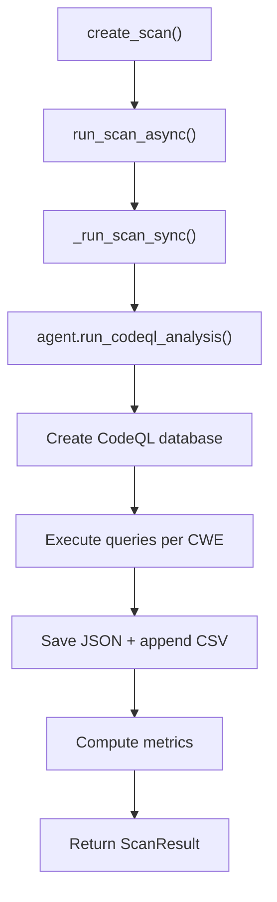

**Diagram sources**
- [scan_manager.py:50-200](file://autopov/app/scan_manager.py#L50-L200)
- [agent_graph.py:243-310](file://autopov/app/agent_graph.py#L243-L310)

**Section sources**
- [scan_manager.py:50-344](file://autopov/app/scan_manager.py#L50-L344)
- [agent_graph.py:243-310](file://autopov/app/agent_graph.py#L243-L310)

### Source Handling and Upload Security
- ZIP/TAR extraction with path-traversal prevention.
- Raw code paste with language-aware file naming.
- Binary detection and cleanup routines.

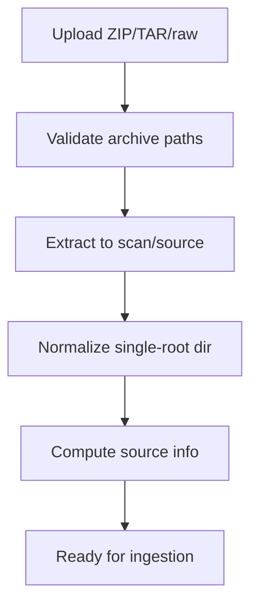

**Diagram sources**
- [source_handler.py:31-190](file://autopov/app/source_handler.py#L31-L190)

**Section sources**
- [source_handler.py:31-380](file://autopov/app/source_handler.py#L31-L380)

### Webhook Integration
- Signature/token verification for GitHub/GitLab.
- Event parsing for push/PR/MR and selective scan triggering.
- Callback registration to initiate scans.

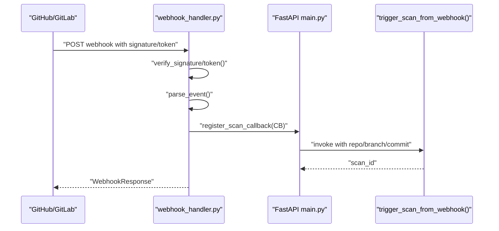

**Diagram sources**
- [webhook_handler.py:196-336](file://autopov/app/webhook_handler.py#L196-L336)
- [main.py:120-158](file://autopov/app/main.py#L120-L158)

**Section sources**
- [webhook_handler.py:196-363](file://autopov/app/webhook_handler.py#L196-L363)
- [main.py:120-158](file://autopov/app/main.py#L120-L158)

### Enhanced Agent Workflows: Investigation and Verification
- Investigation uses LLMs and RAG; optional Joern CPG analysis for specific CWEs.
- Verification generates PoV scripts, validates syntax and constraints, and optionally uses LLM feedback.
- Docker sandboxing with Docker-in-Docker support for isolated execution.

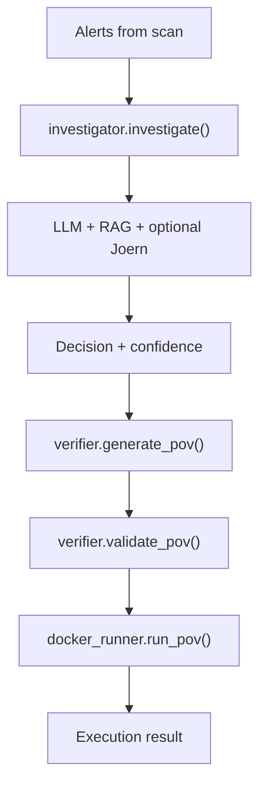

**Diagram sources**
- [investigator.py:254-413](file://autopov/agents/investigator.py#L254-L413)
- [verifier.py:79-227](file://autopov/agents/verifier.py#L79-L227)
- [docker_runner.py:62-192](file://autopov/agents/docker_runner.py#L62-L192)

**Section sources**
- [investigator.py:254-413](file://autopov/agents/investigator.py#L254-L413)
- [verifier.py:79-401](file://autopov/agents/verifier.py#L79-L401)
- [docker_runner.py:62-379](file://autopov/agents/docker_runner.py#L62-L379)

### Frontend Proxy and Development Workflow
- Vite dev server proxies API requests to backend.
- Build artifacts placed under dist with sourcemaps.

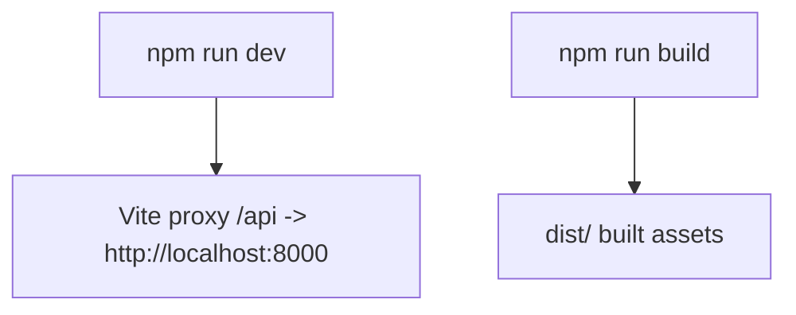

**Diagram sources**
- [vite.config.js:7-15](file://autopov/frontend/vite.config.js#L7-L15)
- [package.json:6-11](file://autopov/frontend/package.json#L6-L11)

**Section sources**
- [vite.config.js:1-21](file://autopov/frontend/vite.config.js#L1-L21)
- [package.json:1-34](file://autopov/frontend/package.json#L1-L34)

## Dependency Analysis
- Runtime dependencies include FastAPI, Uvicorn, LangChain/LangGraph, ChromaDB, Docker SDK, and CLI utilities.
- Startup script manages Python virtual environment, installs dependencies, and starts backend/frontend.
- Docker containerization provides consistent runtime environments across different deployment targets.
- Enhanced with Docker-in-Docker support and CodeQL CLI integration.

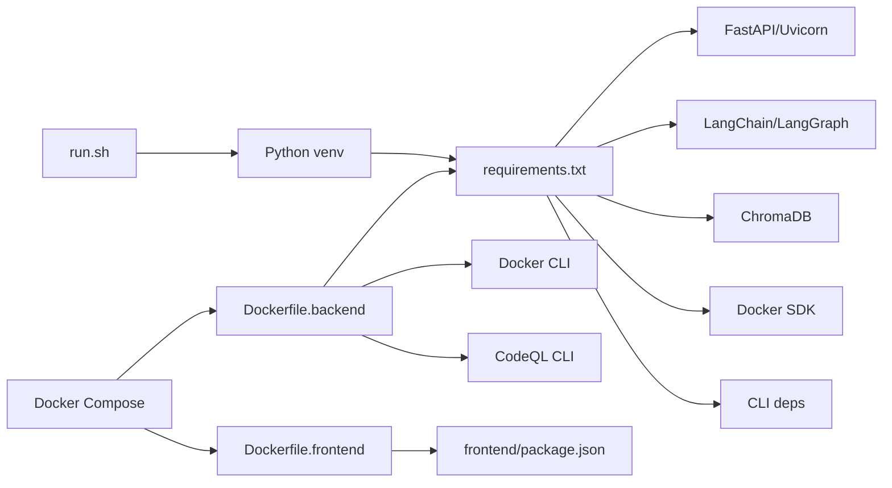

**Diagram sources**
- [run.sh:58-75](file://autopov/run.sh#L58-L75)
- [requirements.txt:1-42](file://autopov/requirements.txt#L1-L42)
- [docker-compose.yml:1-40](file://autopov/docker-compose.yml#L1-L40)
- [Dockerfile.backend:20-41](file://autopov/Dockerfile.backend#L20-L41)
- [Dockerfile.frontend:1-29](file://autopov/Dockerfile.frontend#L1-L29)

**Section sources**
- [run.sh:58-75](file://autopov/run.sh#L58-L75)
- [requirements.txt:1-42](file://autopov/requirements.txt#L1-L42)
- [docker-compose.yml:1-40](file://autopov/docker-compose.yml#L1-L40)
- [Dockerfile.backend:20-41](file://autopov/Dockerfile.backend#L20-L41)
- [Dockerfile.frontend:1-29](file://autopov/Dockerfile.frontend#L1-L29)

## Containerization Infrastructure

### Enhanced Docker Image Configuration
AutoPoV provides two specialized Dockerfiles for backend and frontend services with comprehensive tool integration:

**Backend Container (Dockerfile.backend) - Enhanced**
- Uses Python 3.12 slim base image for optimal size
- Installs system dependencies (git, curl, wget, unzip) for tool integration
- **NEW**: Installs Docker CLI (docker-ce-cli, docker-buildx-plugin, docker-compose-plugin) for Docker-in-Docker support
- **NEW**: Installs CodeQL CLI (version 2.20.1) with standard query packs for enhanced vulnerability scanning
- Copies requirements.txt first for better Docker layer caching
- Creates persistent directories for data and results
- Exposes port 8000 for API access
- Sets environment variables for Python unbuffered output and online model mode

**Frontend Container (Dockerfile.frontend)**
- Uses Node.js 20 Alpine for lightweight frontend service
- Installs git for network resilience during dependency installation
- Configures npm with retry settings for reliable dependency installation
- Exposes port 5173 for development server
- Starts Vite development server with host binding for external access

**Section sources**
- [Dockerfile.backend:1-64](file://autopov/Dockerfile.backend#L1-L64)
- [Dockerfile.frontend:1-29](file://autopov/Dockerfile.frontend#L1-L29)

### Enhanced Docker Compose Orchestration
The docker-compose.yml orchestrates container deployment with comprehensive features:

- Backend service configuration with port mapping (8000:8000)
- Volume mounting for persistent data storage:
  - ./data:/app/data for vector store and configuration
  - ./results:/app/results for scan outputs and PoVs
  - ./.env:/app/.env:ro for environment variable injection
  - **NEW**: /var/run/docker.sock:/var/run/docker.sock for Docker-in-Docker support
- Environment variable configuration for API host and port
- **NEW**: Health check configuration with curl-based health probe
- **NEW**: Automatic restart policy (unless-stopped) for service reliability
- Frontend service with dependency on backend health status

**Section sources**
- [docker-compose.yml:1-40](file://autopov/docker-compose.yml#L1-L40)

### Enhanced Container Lifecycle Management
Multiple startup scripts provide flexible deployment options with improved functionality:

**docker-setup.sh** - Comprehensive setup script that:
- Validates Docker and Docker Compose installation
- Creates .env file from template if missing
- Provides step-by-step instructions for container management
- **NEW**: Enhanced troubleshooting guidance with Docker and tool availability checks
- Includes health check and restart policy verification

**start-all.sh** - Hybrid deployment script that:
- Starts backend in Docker container
- Runs frontend locally with dependency management
- Waits for backend readiness using health check endpoint
- Provides clear access URLs and API documentation links

**start-autopov.sh** - Full containerized deployment script that:
- Builds and starts backend in Docker with automatic dependency installation
- Implements comprehensive health checking with 60-second timeout using curl
- Handles frontend dependency installation automatically
- Provides detailed status reporting and error handling

**Section sources**
- [docker-setup.sh:1-126](file://autopov/docker-setup.sh#L1-L126)
- [start-all.sh:1-63](file://autopov/start-all.sh#L1-L63)
- [start-autopov.sh:1-93](file://autopov/start-autopov.sh#L1-L93)

### Enhanced Volume Management and Data Persistence
The .dockerignore file ensures optimal containerization by:
- Excluding Python cache files and virtual environments
- Ignoring IDE and OS temporary files
- Preserving data and results directories for volume mounting
- Excluding Docker build files from the build context
- Allowing frontend node_modules and dist directories to be managed separately

**Section sources**
- [.dockerignore:1-55](file://autopov/.dockerignore#L1-L55)

### Enhanced Tool Availability and Health Monitoring
**NEW**: Comprehensive tool availability checking system:
- Docker availability checks with ping() verification
- CodeQL CLI availability with version checking
- Joern availability verification
- Kaitai Struct compiler detection
- Health check endpoint exposing service status and tool availability

**Section sources**
- [config.py:157-205](file://autopov/app/config.py#L157-L205)
- [main.py:175-196](file://autopov/app/main.py#L175-L196)

## Production Deployment Procedures

### Environment Preparation
- Set environment variables for API keys, model mode, and tool paths.
- Configure .env file with OPENROUTER_API_KEY for online LLM mode.
- **NEW**: Ensure Docker socket mounting for Docker-in-Docker support.
- **NEW**: Verify CodeQL CLI path and availability in container environment.
- Example path: [config.py:13-134](file://autopov/app/config.py#L13-L134), [.env.example:1-106](file://autopov/.env.example#L1-L106)

### Enhanced Container-Based Dependency Management
- Use Docker Compose to build and deploy containers with pre-configured dependencies.
- **NEW**: Backend container automatically installs Docker CLI and CodeQL CLI.
- Frontend container handles npm dependency installation with retry logic.
- Example path: [docker-compose.yml:1-40](file://autopov/docker-compose.yml#L1-L40)

### Service Configuration
- Configure API host/port, CORS origins, and frontend URL through environment variables.
- Backend container exposes port 8000; frontend runs on port 5173.
- **NEW**: Health check endpoint (/api/health) provides comprehensive service status.
- Example path: [main.py:102-117](file://autopov/app/main.py#L102-L117), [main.py:175-196](file://autopov/app/main.py#L175-L196)

### Enhanced Container Orchestration
- Use Docker Compose for multi-service orchestration with volume persistence.
- **NEW**: Implement health checks for automatic service recovery.
- **NEW**: Use automatic restart policies (unless-stopped) for reliability.
- **NEW**: Configure dependency management with backend health status.
- Example path: [docker-compose.yml:1-40](file://autopov/docker-compose.yml#L1-L40)

### Enhanced Monitoring and Logging
- **NEW**: Health check endpoint for service monitoring and tool availability.
- Monitor container logs using docker-compose logs -f.
- **NEW**: Use health endpoint for automated monitoring and alerting.
- Implement centralized logging for containerized environments.
- Example path: [main.py:175-196](file://autopov/app/main.py#L175-L196)

### Scaling Considerations
- Scale backend containers horizontally behind load balancers.
- Use Docker Swarm or Kubernetes for advanced orchestration.
- Configure volume mounts for shared persistent storage.
- **NEW**: Consider Docker-in-Docker resource allocation for nested container execution.
- Example path: [docker-compose.yml:1-40](file://autopov/docker-compose.yml#L1-L40)

**Section sources**
- [config.py:13-134](file://autopov/app/config.py#L13-L134)
- [docker-compose.yml:1-40](file://autopov/docker-compose.yml#L1-L40)
- [main.py:102-117](file://autopov/app/main.py#L102-L117)
- [main.py:175-196](file://autopov/app/main.py#L175-L196)
- [.env.example:1-106](file://autopov/.env.example#L1-L106)

## Performance Considerations
- Concurrency and Resource Limits
  - Thread pool executor limits concurrent scans; adjust worker count based on CPU/memory headroom.
  - Docker container resource limits prevent resource contention between services.
  - **NEW**: Docker-in-Docker adds overhead; configure resource limits appropriately.
  - Example path: [scan_manager.py](file://autopov/app/scan_manager.py#L46), [Dockerfile.backend:23-27](file://autopov/Dockerfile.backend#L23-L27)
- LLM Cost Control
  - Budget cap and cost tracking toggles enable spending control.
  - Example path: [config.py:85-89](file://autopov/app/config.py#L85-L89)
- Enhanced Docker Sandboxing
  - Memory and CPU limits, timeouts, and network isolation reduce risk and resource contention.
  - **NEW**: Docker-in-Docker requires additional resource allocation for nested containers.
  - Example path: [docker_runner.py:32-133](file://autopov/agents/docker_runner.py#L32-L133)
- Vector Store Efficiency
  - Chunk size and overlap tuned for retrieval quality and latency.
  - Example path: [config.py:90-93](file://autopov/app/config.py#L90-L93)
- Container Performance Optimization
  - Multi-stage builds and slim base images reduce container size and improve startup times.
  - Volume mounting optimizes I/O performance for persistent data.
  - **NEW**: Docker-in-Docker increases container startup time and resource usage.
  - Example path: [Dockerfile.backend:1-64](file://autopov/Dockerfile.backend#L1-L64)

## Monitoring and Logging

### Enhanced Container-Level Monitoring
- Monitor container health and resource utilization using Docker stats and logs.
- **NEW**: Implement health checks in Docker Compose for automatic service recovery.
- **NEW**: Use health endpoint (/api/health) for application-level monitoring.
- Use centralized logging solutions for container log aggregation.

### Enhanced Application-Level Monitoring
- **NEW**: Health check endpoint for Prometheus and Grafana integration.
- Implement structured logging for better observability.
- Monitor SSE stream performance and connection stability.
- **NEW**: Track tool availability (Docker, CodeQL, Joern) through health endpoint.

### Log Aggregation and Analysis
- Configure log rotation for container logs to prevent disk space issues.
- Use log analysis tools to track error patterns and performance metrics.
- Implement alerting based on log patterns and system metrics.
- **NEW**: Monitor health check failures and tool availability changes.

**Section sources**
- [main.py:175-196](file://autopov/app/main.py#L175-L196)
- [docker-compose.yml:19-25](file://autopov/docker-compose.yml#L19-L25)

## Maintenance Procedures

### Enhanced Container Lifecycle Management
- Regular container updates and rebuilds for security patches.
- Volume backup and restoration procedures for persistent data.
- Container cleanup and resource optimization.
- **NEW**: Monitor and update Docker CLI and CodeQL CLI versions.

### Update Processes
- Rebuild containers after code changes using docker-compose build.
- Restart services with rolling updates for zero-downtime deployments.
- **NEW**: Health check endpoint for verifying service status after updates.
- Example path: [docker-setup.sh:102-107](file://autopov/docker-setup.sh#L102-L107)

### Backup Strategies
- Back up data and results directories regularly; maintain CSV history for auditability.
- Implement volume snapshots for point-in-time recovery.
- **NEW**: Include Docker socket and CodeQL database snapshots for complete recovery.
- Example path: [config.py:102-107](file://autopov/app/config.py#L102-L107), [scan_manager.py:201-235](file://autopov/app/scan_manager.py#L201-L235)

### Enhanced System Health Checks
- **NEW**: Use health endpoint (/api/health) and metrics to monitor uptime and performance.
- Implement automated health checks for containerized services.
- **NEW**: Monitor tool availability (Docker, CodeQL, Joern) through health endpoint.
- Example path: [main.py:175-196](file://autopov/app/main.py#L175-L196), [main.py:510-515](file://autopov/app/main.py#L510-L515)

**Section sources**
- [docker-setup.sh:102-107](file://autopov/docker-setup.sh#L102-L107)
- [config.py:102-107](file://autopov/app/config.py#L102-L107)
- [scan_manager.py:201-235](file://autopov/app/scan_manager.py#L201-L235)
- [main.py:175-196](file://autopov/app/main.py#L175-L196)
- [main.py:510-515](file://autopov/app/main.py#L510-L515)

## Operational Automation Examples

### Enhanced Deployment Automation
- Use Docker Compose for automated environment setup and service startup.
- Implement CI/CD pipelines with container image building and deployment.
- **NEW**: Health check endpoint for automated deployment verification.
- Example path: [docker-setup.sh:102-107](file://autopov/docker-setup.sh#L102-L107)

### Enhanced Monitoring Setup
- **NEW**: Configure reverse proxy and expose health endpoint for dashboards.
- Implement automated alerting based on health checks and metrics.
- **NEW**: Monitor tool availability and service health through health endpoint.
- Example path: [main.py:175-196](file://autopov/app/main.py#L175-L196)

### Enhanced Troubleshooting Automation
- **NEW**: Use health and metrics endpoints to drive automated alerts.
- Implement container restart policies and health checks.
- **NEW**: Monitor Docker and CodeQL availability for troubleshooting.
- Example path: [docker-setup.sh:112-114](file://autopov/docker-setup.sh#L112-L114)

**Section sources**
- [docker-setup.sh:102-107](file://autopov/docker-setup.sh#L102-L107)
- [main.py:175-196](file://autopov/app/main.py#L175-L196)
- [main.py:510-515](file://autopov/app/main.py#L510-L515)

## Capacity Planning, Resource Optimization, and Cost Management

### Enhanced Container Resource Planning
- Estimate container resource requirements based on expected concurrent scans.
- Configure Docker resource limits (memory, CPU) for optimal performance.
- Plan for horizontal scaling with multiple container instances.
- **NEW**: Account for Docker-in-Docker overhead in resource planning.

### Enhanced Resource Optimization
- Tighten Docker memory/CPU limits and timeouts to prevent noisy-neighbor effects.
- Use slim base images and multi-stage builds for reduced resource consumption.
- Optimize volume I/O performance through proper mount configuration.
- **NEW**: Monitor Docker-in-Docker resource usage and optimize accordingly.

### Enhanced Cost Management
- Enable cost tracking and set maximum spend thresholds; monitor metrics for trends.
- Choose appropriate Docker host resources based on workload patterns.
- Implement auto-scaling for containerized deployments.
- **NEW**: Monitor CodeQL query execution costs and optimize query strategy.

**Section sources**
- [scan_manager.py](file://autopov/app/scan_manager.py#L46)
- [docker_runner.py:32-133](file://autopov/agents/docker_runner.py#L32-L133)
- [config.py:85-89](file://autopov/app/config.py#L85-L89)
- [main.py:510-515](file://autopov/app/main.py#L510-L515)

## Cloud Deployment, Container Orchestration, and Disaster Recovery

### Enhanced Cloud Deployment
- Package the backend and run via container images; expose ports and mount persistent volumes for data/results.
- Deploy to cloud platforms supporting Docker containers (AWS ECS, Google Cloud Run, Azure Container Instances).
- Configure environment variables through cloud-native secret management.
- **NEW**: Ensure Docker socket access for Docker-in-Docker in cloud environments.

### Enhanced Container Orchestration
- Use Kubernetes or similar platforms to manage replicas, liveness/readiness probes, and persistent volumes.
- Implement rolling updates and blue-green deployments for zero-downtime updates.
- Configure service discovery and load balancing for scalable deployments.
- **NEW**: Implement health checks and restart policies for enhanced reliability.

### Enhanced Disaster Recovery
- Regularly snapshot data and results directories; retain CSV history for roll-forward capability.
- Implement multi-region deployments with automated failover mechanisms.
- Test disaster recovery procedures regularly to ensure business continuity.
- **NEW**: Include Docker CLI and CodeQL database snapshots for complete recovery.

**Section sources**
- [docker_runner.py:113-133](file://autopov/agents/docker_runner.py#L113-L133)
- [main.py:175-196](file://autopov/app/main.py#L175-L196)
- [config.py:102-107](file://autopov/app/config.py#L102-L107)
- [scan_manager.py:201-235](file://autopov/app/scan_manager.py#L201-L235)

## Troubleshooting Guide

### Enhanced Container Environment Issues
- Verify Docker installation and permissions using docker-setup.sh script.
- Check container logs with docker-compose logs -f for detailed error information.
- Ensure .env file exists and contains required API keys.
- **NEW**: Verify Docker socket mounting for Docker-in-Docker support.

### Enhanced Docker Availability
- If Docker is unavailable, sandboxed PoV execution falls back gracefully.
- **NEW**: Check Docker CLI installation and health check endpoint status.
- Example path: [docker_runner.py:81-90](file://autopov/agents/docker_runner.py#L81-L90)

### Enhanced Webhook Issues
- Verify signatures/tokens and ensure callback registration.
- **NEW**: Check health endpoint for service availability and tool status.
- Example path: [webhook_handler.py:213-265](file://autopov/app/webhook_handler.py#L213-L265)

### Authentication Failures
- Confirm API key validity and admin key correctness.
- Example path: [auth.py:137-168](file://autopov/app/auth.py#L137-L168)

### Enhanced Upload Problems
- ZIP/TAR path traversal errors indicate malicious archives; sanitize inputs.
- Example path: [source_handler.py:57-63](file://autopov/app/source_handler.py#L57-L63)

### Enhanced Container-Specific Troubleshooting
- Use docker-compose ps to check container status and health.
- **NEW**: Monitor health check status and restart policies.
- Implement container restart policies for automatic recovery.
- Monitor container resource usage with docker stats.
- **NEW**: Check Docker and CodeQL availability through health endpoint.

**Section sources**
- [docker-setup.sh:31-70](file://autopov/docker-setup.sh#L31-L70)
- [docker-compose.yml:19-25](file://autopov/docker-compose.yml#L19-L25)
- [docker_runner.py:81-90](file://autopov/agents/docker_runner.py#L81-L90)
- [webhook_handler.py:213-265](file://autopov/app/webhook_handler.py#L213-L265)
- [auth.py:137-168](file://autopov/app/auth.py#L137-L168)
- [source_handler.py:57-63](file://autopov/app/source_handler.py#L57-L63)
- [main.py:175-196](file://autopov/app/main.py#L175-L196)

## Conclusion
AutoPoV's production deployment centers on robust configuration management, secure authentication, resilient scan orchestration, and safe sandboxing of PoV execution. The addition of comprehensive Docker containerization infrastructure provides standardized, reproducible deployments across different environments. Recent enhancements include Docker-in-Docker support for nested container execution, CodeQL CLI integration for enhanced vulnerability detection, comprehensive health checks for service monitoring, automatic restart policies for reliability, and improved container orchestration with dependency management. Container orchestration through Docker Compose enables efficient service management with persistent volume mounting for data and results. Teams can operate AutoPoV reliably at scale with container-based deployments, leveraging environment-driven settings, SSE-based observability, Docker constraints, and comprehensive health monitoring. Cost controls and metrics enable budget-conscious operations, while webhook integrations streamline CI/CD automation. The enhanced containerization approach simplifies deployment, improves resource isolation, enables seamless scaling in cloud environments, and provides robust monitoring and troubleshooting capabilities.

## Appendices

### Enhanced Production Deployment Procedures
- Environment Preparation
  - Set environment variables for API keys, model mode, and tool paths.
  - **NEW**: Ensure Docker socket mounting for Docker-in-Docker support.
  - **NEW**: Verify CodeQL CLI path and availability in container environment.
  - Example path: [config.py:13-134](file://autopov/app/config.py#L13-L134), [.env.example:1-106](file://autopov/.env.example#L1-L106)
- Enhanced Container-Based Dependency Management
  - Use Docker Compose to build and deploy containers with pre-configured dependencies.
  - **NEW**: Backend container automatically installs Docker CLI and CodeQL CLI.
  - Example path: [docker-compose.yml:1-40](file://autopov/docker-compose.yml#L1-L40)
- Service Configuration
  - Configure API host/port, CORS origins, and frontend URL.
  - **NEW**: Health check endpoint (/api/health) provides comprehensive service status.
  - Example path: [main.py:102-117](file://autopov/app/main.py#L102-L117), [main.py:175-196](file://autopov/app/main.py#L175-L196)
- Enhanced Container Orchestration
  - Use Docker Compose for multi-service orchestration with volume persistence.
  - **NEW**: Implement health checks for automatic service recovery.
  - **NEW**: Use automatic restart policies (unless-stopped) for reliability.
  - Example path: [docker-compose.yml:1-40](file://autopov/docker-compose.yml#L1-L40)
- Enhanced Monitoring and Logging
  - **NEW**: Health check endpoint for service monitoring and tool availability.
  - Expose metrics endpoint and use SSE logs for real-time visibility.
  - Example path: [main.py:175-196](file://autopov/app/main.py#L175-L196), [main.py:510-515](file://autopov/app/main.py#L510-L515)
- Scaling Considerations
  - Tune thread pool size and Docker resource limits; consider horizontal scaling behind a reverse proxy.
  - **NEW**: Consider Docker-in-Docker resource allocation for nested container execution.
  - Example path: [scan_manager.py](file://autopov/app/scan_manager.py#L46), [docker_runner.py:32-133](file://autopov/agents/docker_runner.py#L32-L133)

**Section sources**
- [config.py:13-134](file://autopov/app/config.py#L13-L134)
- [docker-compose.yml:1-40](file://autopov/docker-compose.yml#L1-L40)
- [main.py:102-117](file://autopov/app/main.py#L102-L117)
- [main.py:175-196](file://autopov/app/main.py#L175-L196)
- [main.py:510-515](file://autopov/app/main.py#L510-L515)
- [scan_manager.py](file://autopov/app/scan_manager.py#L46)
- [docker_runner.py:32-133](file://autopov/agents/docker_runner.py#L32-L133)
- [.env.example:1-106](file://autopov/.env.example#L1-L106)

### Enhanced Maintenance Procedures
- Enhanced Container Lifecycle Management
  - Regular container updates and rebuilds for security patches.
  - Volume backup and restoration procedures for persistent data.
  - Container cleanup and resource optimization.
  - **NEW**: Monitor and update Docker CLI and CodeQL CLI versions.
- Update Processes
  - Rebuild containers after code changes using docker-compose build.
  - Restart services with rolling updates for zero-downtime deployments.
  - **NEW**: Health check endpoint for verifying service status after updates.
  - Example path: [docker-setup.sh:102-107](file://autopov/docker-setup.sh#L102-L107)
- Enhanced Backup Strategies
  - Back up data and results directories regularly; maintain CSV history for auditability.
  - Implement volume snapshots for point-in-time recovery.
  - **NEW**: Include Docker socket and CodeQL database snapshots for complete recovery.
  - Example path: [config.py:102-107](file://autopov/app/config.py#L102-L107), [scan_manager.py:201-235](file://autopov/app/scan_manager.py#L201-L235)
- Enhanced System Health Checks
  - **NEW**: Use health endpoint (/api/health) and metrics to monitor uptime and performance.
  - Implement automated health checks for containerized services.
  - **NEW**: Monitor tool availability (Docker, CodeQL, Joern) through health endpoint.
  - Example path: [main.py:175-196](file://autopov/app/main.py#L175-L196), [main.py:510-515](file://autopov/app/main.py#L510-L515)

**Section sources**
- [docker-setup.sh:102-107](file://autopov/docker-setup.sh#L102-L107)
- [config.py:102-107](file://autopov/app/config.py#L102-L107)
- [scan_manager.py:201-235](file://autopov/app/scan_manager.py#L201-L235)
- [main.py:175-196](file://autopov/app/main.py#L175-L196)
- [main.py:510-515](file://autopov/app/main.py#L510-L515)

### Enhanced Operational Automation Examples
- Enhanced Deployment Automation
  - Use Docker Compose for automated environment setup and service startup.
  - Implement CI/CD pipelines with container image building and deployment.
  - **NEW**: Health check endpoint for automated deployment verification.
  - Example path: [docker-setup.sh:102-107](file://autopov/docker-setup.sh#L102-L107)
- Enhanced Monitoring Setup
  - **NEW**: Configure reverse proxy and expose health endpoint for dashboards.
  - Implement automated alerting based on health checks and metrics.
  - **NEW**: Monitor tool availability and service health through health endpoint.
  - Example path: [main.py:175-196](file://autopov/app/main.py#L175-L196)
- Enhanced Troubleshooting Automation
  - **NEW**: Use health and metrics endpoints to drive automated alerts.
  - Implement container restart policies and health checks.
  - **NEW**: Monitor Docker and CodeQL availability for troubleshooting.
  - Example path: [docker-setup.sh:112-114](file://autopov/docker-setup.sh#L112-L114)

**Section sources**
- [docker-setup.sh:102-107](file://autopov/docker-setup.sh#L102-L107)
- [main.py:175-196](file://autopov/app/main.py#L175-L196)
- [main.py:510-515](file://autopov/app/main.py#L510-L515)

### Enhanced Capacity Planning, Resource Optimization, and Cost Management
- Enhanced Capacity Planning
  - Estimate concurrent scans based on CPU cores and memory headroom; adjust thread pool accordingly.
  - **NEW**: Account for Docker-in-Docker overhead in resource planning.
  - Example path: [scan_manager.py](file://autopov/app/scan_manager.py#L46)
- Enhanced Resource Optimization
  - Tighten Docker memory/CPU limits and timeouts to prevent noisy-neighbor effects.
  - Use slim base images and multi-stage builds for reduced resource consumption.
  - **NEW**: Monitor Docker-in-Docker resource usage and optimize accordingly.
  - Example path: [docker_runner.py:32-133](file://autopov/agents/docker_runner.py#L32-L133)
- Enhanced Cost Management
  - Enable cost tracking and set maximum spend thresholds; monitor metrics for trends.
  - Choose appropriate Docker host resources based on workload patterns.
  - Implement auto-scaling for containerized deployments.
  - **NEW**: Monitor CodeQL query execution costs and optimize query strategy.
  - Example path: [config.py:85-89](file://autopov/app/config.py#L85-L89), [main.py:510-515](file://autopov/app/main.py#L510-L515)

**Section sources**
- [scan_manager.py](file://autopov/app/scan_manager.py#L46)
- [docker_runner.py:32-133](file://autopov/agents/docker_runner.py#L32-L133)
- [config.py:85-89](file://autopov/app/config.py#L85-L89)
- [main.py:510-515](file://autopov/app/main.py#L510-L515)

### Enhanced Cloud Deployment, Container Orchestration, and Disaster Recovery
- Enhanced Cloud Deployment
  - Package the backend and run via container images; expose ports and mount persistent volumes for data/results.
  - Deploy to cloud platforms supporting Docker containers (AWS ECS, Google Cloud Run, Azure Container Instances).
  - Configure environment variables through cloud-native secret management.
  - **NEW**: Ensure Docker socket access for Docker-in-Docker in cloud environments.
  - Example path: [docker_runner.py:113-133](file://autopov/agents/docker_runner.py#L113-L133)
- Enhanced Container Orchestration
  - Use Kubernetes or similar platforms to manage replicas, liveness/readiness probes, and persistent volumes.
  - Implement rolling updates and blue-green deployments for zero-downtime updates.
  - Configure service discovery and load balancing for scalable deployments.
  - **NEW**: Implement health checks and restart policies for enhanced reliability.
  - Example path: [main.py:175-196](file://autopov/app/main.py#L175-L196)
- Enhanced Disaster Recovery
  - Regularly snapshot data and results directories; retain CSV history for roll-forward capability.
  - Implement multi-region deployments with automated failover mechanisms.
  - Test disaster recovery procedures regularly to ensure business continuity.
  - **NEW**: Include Docker CLI and CodeQL database snapshots for complete recovery.
  - Example path: [config.py:102-107](file://autopov/app/config.py#L102-L107), [scan_manager.py:201-235](file://autopov/app/scan_manager.py#L201-L235)

**Section sources**
- [docker_runner.py:113-133](file://autopov/agents/docker_runner.py#L113-L133)
- [main.py:175-196](file://autopov/app/main.py#L175-L196)
- [config.py:102-107](file://autopov/app/config.py#L102-L107)
- [scan_manager.py:201-235](file://autopov/app/scan_manager.py#L201-L235)