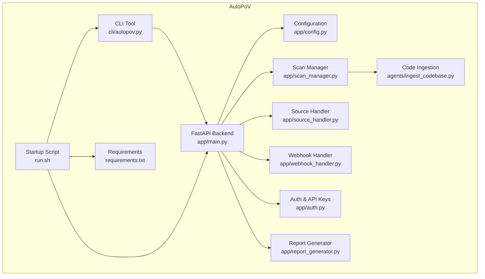
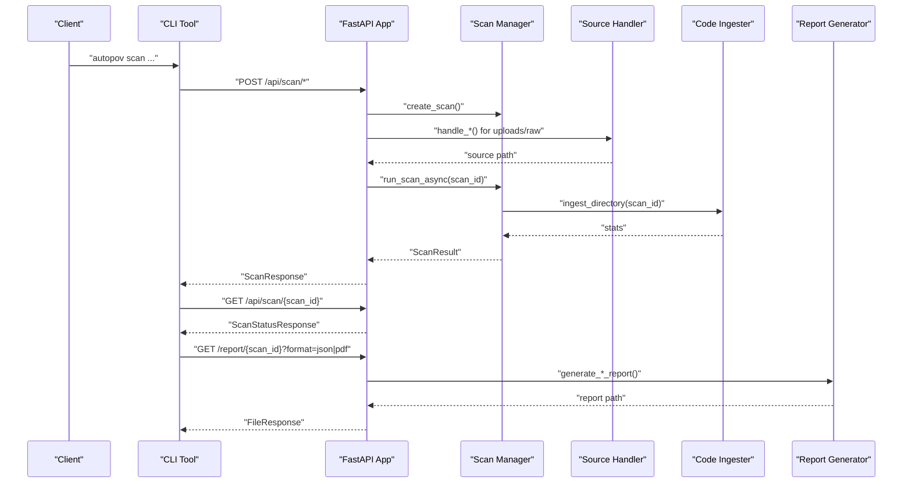
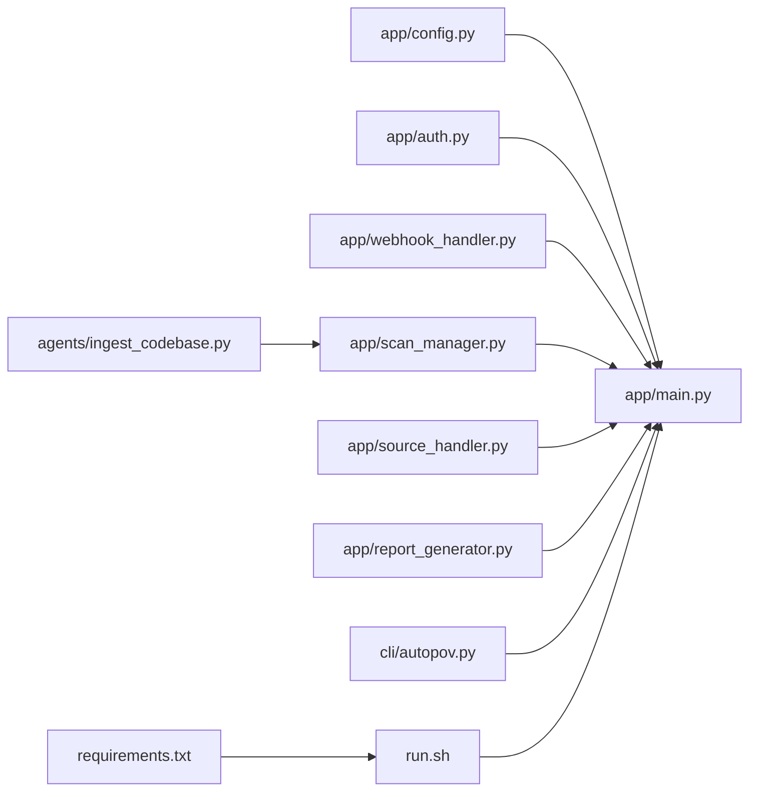

# Maintenance and Updates

<cite>
**Referenced Files in This Document**
- [README.md](file://autopov/README.md)
- [run.sh](file://autopov/run.sh)
- [requirements.txt](file://autopov/requirements.txt)
- [app/main.py](file://autopov/app/main.py)
- [app/config.py](file://autopov/app/config.py)
- [app/scan_manager.py](file://autopov/app/scan_manager.py)
- [app/source_handler.py](file://autopov/app/source_handler.py)
- [app/webhook_handler.py](file://autopov/app/webhook_handler.py)
- [app/auth.py](file://autopov/app/auth.py)
- [app/report_generator.py](file://autopov/app/report_generator.py)
- [agents/ingest_codebase.py](file://autopov/agents/ingest_codebase.py)
- [cli/autopov.py](file://autopov/cli/autopov.py)
</cite>

## Table of Contents
1. [Introduction](#introduction)
2. [Project Structure](#project-structure)
3. [Core Components](#core-components)
4. [Architecture Overview](#architecture-overview)
5. [Detailed Component Analysis](#detailed-component-analysis)
6. [Dependency Analysis](#dependency-analysis)
7. [Performance Considerations](#performance-considerations)
8. [Troubleshooting Guide](#troubleshooting-guide)
9. [Conclusion](#conclusion)
10. [Appendices](#appendices)

## Introduction
This document provides comprehensive maintenance and update procedures for AutoPoV, focusing on system upkeep, evolution, and operational reliability. It covers:
- Dependency upgrades and security patching
- Feature deployments and zero-downtime strategies
- Backup strategies for configuration, vector store data, and scan results
- Maintenance procedures including database cleanup, log rotation, and temporary file management
- Health checks and monitoring triggers
- Automated maintenance tasks and preventive schedules
- Upgrade paths for major version changes and breaking API modifications

## Project Structure
AutoPoV is organized into a FastAPI backend, a React frontend, a CLI, agents for code ingestion and LLM orchestration, and supporting modules for authentication, scanning, reporting, and webhooks. The startup script orchestrates environment setup, dependency installation, and service startup.

**Diagram sources**
- [app/main.py](file://autopov/app/main.py#L102-L121)
- [app/config.py](file://autopov/app/config.py#L13-L210)
- [app/scan_manager.py](file://autopov/app/scan_manager.py#L40-L344)
- [app/source_handler.py](file://autopov/app/source_handler.py#L18-L380)
- [app/webhook_handler.py](file://autopov/app/webhook_handler.py#L15-L363)
- [app/auth.py](file://autopov/app/auth.py#L32-L176)
- [app/report_generator.py](file://autopov/app/report_generator.py#L68-L359)
- [agents/ingest_codebase.py](file://autopov/agents/ingest_codebase.py#L41-L406)
- [cli/autopov.py](file://autopov/cli/autopov.py#L89-L467)
- [run.sh](file://autopov/run.sh#L1-L233)
- [requirements.txt](file://autopov/requirements.txt#L1-L42)

**Section sources**
- [README.md](file://autopov/README.md#L17-L35)
- [run.sh](file://autopov/run.sh#L1-L233)
- [requirements.txt](file://autopov/requirements.txt#L1-L42)

## Core Components
- Configuration and environment: Centralized via Pydantic settings with environment variable support and runtime checks for external tools.
- Scan lifecycle: Creation, execution, persistence, and cleanup handled by the scan manager with CSV and JSON logging.
- Vector store: ChromaDB-backed ingestion and retrieval with per-scan collections and cleanup.
- Authentication: API key management with hashed storage and bearer token validation.
- Reporting: JSON and PDF report generation with PoV script export.
- Webhooks: GitHub/GitLab webhook handling with signature/token verification and event parsing.
- CLI: Remote orchestration of scans, results retrieval, and API key management.

**Section sources**
- [app/config.py](file://autopov/app/config.py#L13-L210)
- [app/scan_manager.py](file://autopov/app/scan_manager.py#L40-L344)
- [agents/ingest_codebase.py](file://autopov/agents/ingest_codebase.py#L41-L406)
- [app/auth.py](file://autopov/app/auth.py#L32-L176)
- [app/report_generator.py](file://autopov/app/report_generator.py#L68-L359)
- [app/webhook_handler.py](file://autopov/app/webhook_handler.py#L15-L363)
- [cli/autopov.py](file://autopov/cli/autopov.py#L89-L467)

## Architecture Overview
The system exposes a FastAPI application with endpoints for scanning, streaming logs, retrieving results, generating reports, managing API keys, and handling webhooks. The scan manager coordinates asynchronous execution, persists results, and cleans up resources. The CLI interacts with the API for automation.

**Diagram sources**
- [cli/autopov.py](file://autopov/cli/autopov.py#L104-L210)
- [app/main.py](file://autopov/app/main.py#L177-L431)
- [app/scan_manager.py](file://autopov/app/scan_manager.py#L86-L200)
- [app/source_handler.py](file://autopov/app/source_handler.py#L31-L230)
- [agents/ingest_codebase.py](file://autopov/agents/ingest_codebase.py#L201-L307)
- [app/report_generator.py](file://autopov/app/report_generator.py#L76-L133)

## Detailed Component Analysis

### Configuration and Environment Management
- Environment variables define model modes, tool paths, Docker limits, and persistence directories.
- Runtime checks verify availability of Docker, CodeQL, Joern, and Kaitai Struct compiler.
- Directory creation is ensured at startup and module load.

Maintenance actions:
- Review and update environment variables before upgrades.
- Validate tool availability via health checks prior to deployment.
- Ensure persistent directories exist and are writable.

**Section sources**
- [app/config.py](file://autopov/app/config.py#L13-L210)
- [app/main.py](file://autopov/app/main.py#L82-L100)

### Dependency Upgrades and Security Patches
- Python dependencies are declared in requirements.txt with pinned minimum versions.
- Upgrade strategy:
  - Test upgrades in a staging environment using the startup script’s virtual environment creation and dependency installation steps.
  - Validate API health and tool availability after upgrades.
  - Rebuild frontend assets if applicable.

Security patching:
- Pin major versions and periodically audit dependencies.
- Apply patches to LLM SDKs, vector store clients, and HTTP libraries.
- Rotate API keys and webhook secrets after compromise.

**Section sources**
- [requirements.txt](file://autopov/requirements.txt#L1-L42)
- [run.sh](file://autopov/run.sh#L58-L75)
- [app/config.py](file://autopov/app/config.py#L117-L121)

### Feature Deployments and Zero-Downtime Strategies
- Use blue-green deployments or rolling restarts with health checks.
- Keep the API alive during reconfiguration by validating environment and dependencies before restart.
- For frontend changes, rebuild assets and ensure compatibility with backend endpoints.

Operational flow:
- Validate environment and dependencies.
- Start backend and frontend independently or together.
- Monitor health endpoint and logs.

**Section sources**
- [run.sh](file://autopov/run.sh#L77-L161)
- [app/main.py](file://autopov/app/main.py#L164-L174)

### Backup Strategies
- Configuration files: Back up .env and any local CLI configuration files.
- Vector store data: Back up ChromaDB persistent directory configured via settings.
- Scan results: Back up JSON results and CSV history from the runs directory.

Backup schedule:
- Daily incremental backups for results and CSV logs.
- Weekly full backups for ChromaDB and configuration.

**Section sources**
- [app/config.py](file://autopov/app/config.py#L102-L107)
- [app/scan_manager.py](file://autopov/app/scan_manager.py#L201-L235)
- [agents/ingest_codebase.py](file://autopov/agents/ingest_codebase.py#L90-L115)

### Maintenance Procedures
- Database cleanup:
  - Periodically remove old scan results and CSV entries beyond retention.
  - Clean up ChromaDB collections for completed scans using the scan manager’s cleanup routine.
- Log rotation:
  - Archive and compress logs; prune old entries.
  - Monitor log file sizes and apply rotation policies.
- Temporary file management:
  - Clean up temporary scan directories after completion.
  - Ensure cleanup routines are invoked on failure and success.

**Section sources**
- [app/scan_manager.py](file://autopov/app/scan_manager.py#L296-L302)
- [app/source_handler.py](file://autopov/app/source_handler.py#L267-L272)
- [agents/ingest_codebase.py](file://autopov/agents/ingest_codebase.py#L387-L397)

### Rollback Procedures
- Preserve previous container image or virtual environment snapshot.
- Revert configuration changes and restore previous .env.
- Rollback ChromaDB and results directories from backups.
- Validate rollback by running health checks and a smoke scan.

**Section sources**
- [app/main.py](file://autopov/app/main.py#L164-L174)
- [app/scan_manager.py](file://autopov/app/scan_manager.py#L296-L302)

### Health Checks and Monitoring
- Health endpoint returns system status, version, and tool availability.
- Monitor disk usage, memory pressure, and service availability.
- Integrate with external monitoring systems to trigger alerts and remediation.

**Section sources**
- [app/main.py](file://autopov/app/main.py#L164-L174)
- [app/config.py](file://autopov/app/config.py#L123-L171)

### Automated Maintenance Tasks
- Scheduled cleanup jobs:
  - Remove stale temporary directories older than a threshold.
  - Purge old scan results and CSV entries based on retention policy.
- Preventive maintenance:
  - Weekly vector store optimization and integrity checks.
  - Monthly dependency audits and security scans.

**Section sources**
- [app/source_handler.py](file://autopov/app/source_handler.py#L267-L272)
- [app/scan_manager.py](file://autopov/app/scan_manager.py#L252-L273)

### Upgrade Paths and Breaking Changes
- Major version changes:
  - Review API endpoints and adjust CLI commands accordingly.
  - Validate model provider compatibility and configuration switches.
- Breaking API modifications:
  - Update CLI and integrations to match new endpoint signatures.
  - Maintain backward-compatible defaults where possible.

**Section sources**
- [README.md](file://autopov/README.md#L128-L144)
- [cli/autopov.py](file://autopov/cli/autopov.py#L104-L210)
- [app/config.py](file://autopov/app/config.py#L37-L49)

## Dependency Analysis
The backend depends on configuration, scan orchestration, source handling, authentication, reporting, and ingestion. The CLI depends on the API. The startup script manages environment setup and service orchestration.

**Diagram sources**
- [app/main.py](file://autopov/app/main.py#L19-L25)
- [app/config.py](file://autopov/app/config.py#L13-L210)
- [app/scan_manager.py](file://autopov/app/scan_manager.py#L16-L18)
- [app/source_handler.py](file://autopov/app/source_handler.py#L15-L16)
- [app/webhook_handler.py](file://autopov/app/webhook_handler.py#L12-L13)
- [app/auth.py](file://autopov/app/auth.py#L16-L17)
- [app/report_generator.py](file://autopov/app/report_generator.py#L18-L20)
- [agents/ingest_codebase.py](file://autopov/agents/ingest_codebase.py#L33-L34)
- [cli/autopov.py](file://autopov/cli/autopov.py#L20-L23)
- [run.sh](file://autopov/run.sh#L14-L16)
- [requirements.txt](file://autopov/requirements.txt#L1-L42)

**Section sources**
- [app/main.py](file://autopov/app/main.py#L19-L25)
- [run.sh](file://autopov/run.sh#L14-L16)

## Performance Considerations
- Vector store batching: Ingestion writes in batches to reduce overhead.
- Thread pool execution: Scans run in a thread pool to avoid blocking the event loop.
- Cost controls: Per-scan cost tracking and maximum cost limits prevent runaway expenses.
- Resource limits: Docker execution uses memory and CPU limits for PoV containers.

Recommendations:
- Tune chunk size and overlap for large codebases.
- Scale thread pool size based on CPU cores.
- Monitor vector store performance and optimize collection queries.

**Section sources**
- [agents/ingest_codebase.py](file://autopov/agents/ingest_codebase.py#L290-L307)
- [app/scan_manager.py](file://autopov/app/scan_manager.py#L46-L48)
- [app/config.py](file://autopov/app/config.py#L85-L93)

## Troubleshooting Guide
Common issues and resolutions:
- Missing environment variables: Ensure .env is present and populated; the startup script will copy from .env.example if missing.
- Tool unavailability: Use health checks to verify Docker, CodeQL, and Joern; install or configure accordingly.
- Permission errors: Confirm write permissions for data, results, and ChromaDB directories.
- API key problems: Regenerate keys via CLI or admin endpoints and update clients.

**Section sources**
- [run.sh](file://autopov/run.sh#L84-L90)
- [app/main.py](file://autopov/app/main.py#L164-L174)
- [app/auth.py](file://autopov/app/auth.py#L137-L170)
- [app/config.py](file://autopov/app/config.py#L191-L202)

## Conclusion
By following the outlined maintenance and update procedures—careful dependency management, robust backup strategies, disciplined deployment practices, and proactive monitoring—you can keep AutoPoV reliable, secure, and efficient. Regular audits, automated cleanup, and clear rollback procedures minimize downtime and risk during upgrades.

## Appendices

### Practical Examples

- Zero-downtime deployment:
  - Prepare artifacts and configuration in a staging environment.
  - Validate health checks and tool availability.
  - Switch traffic to the new version and monitor logs.

- Rollback procedure:
  - Restore previous configuration and data snapshots.
  - Restart services and verify health.

- Health check implementation:
  - Call the health endpoint and parse tool availability flags.
  - Integrate with monitoring to trigger alerts on failures.

- Backup example:
  - Archive ChromaDB persist directory and results CSV/logs.
  - Schedule weekly full backups and daily incremental backups.

- Temporary file cleanup:
  - Invoke cleanup routines after scan completion or failure.
  - Remove stale temporary directories older than a retention threshold.

**Section sources**
- [app/main.py](file://autopov/app/main.py#L164-L174)
- [app/scan_manager.py](file://autopov/app/scan_manager.py#L296-L302)
- [app/source_handler.py](file://autopov/app/source_handler.py#L267-L272)
- [agents/ingest_codebase.py](file://autopov/agents/ingest_codebase.py#L387-L397)