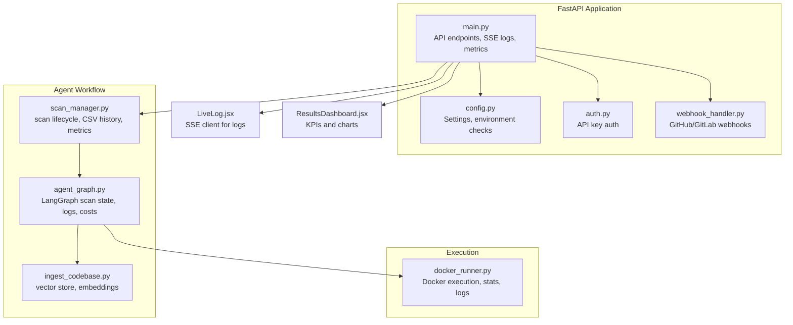
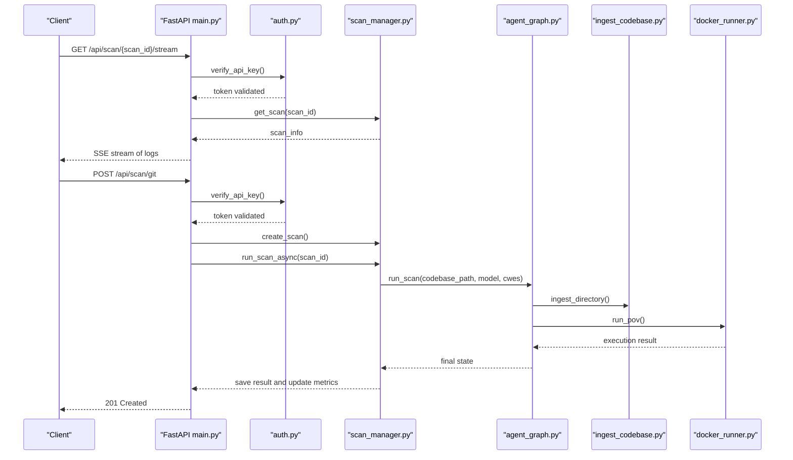
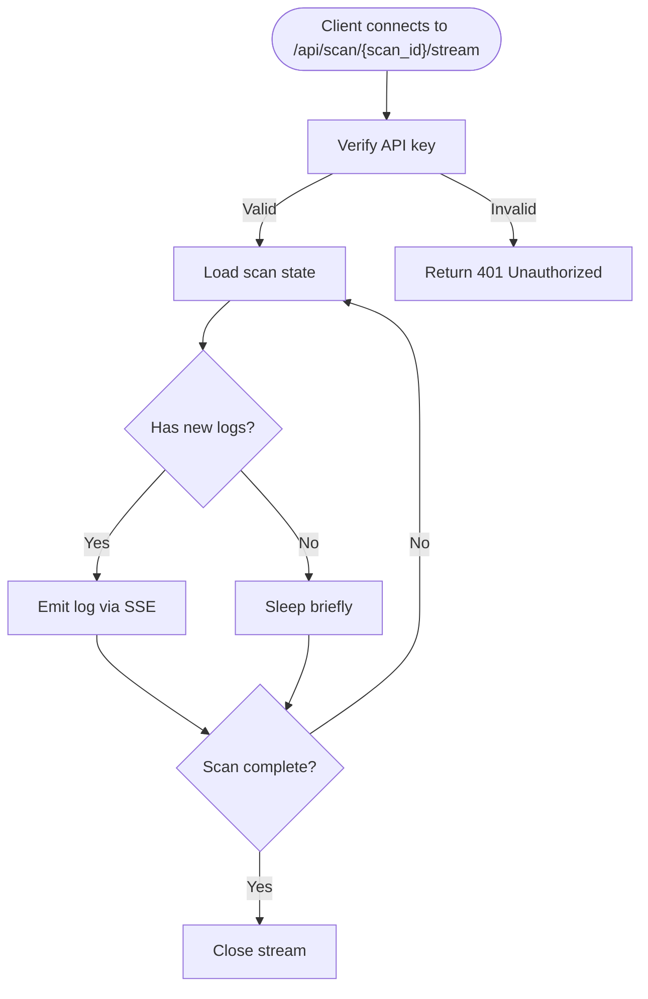
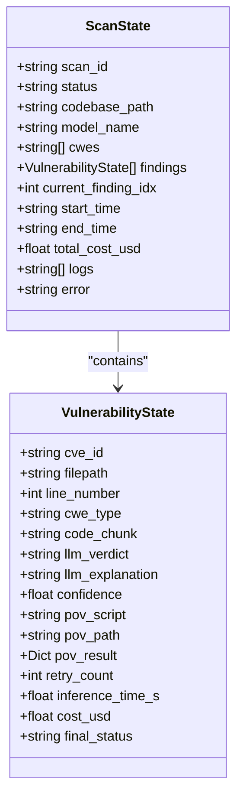
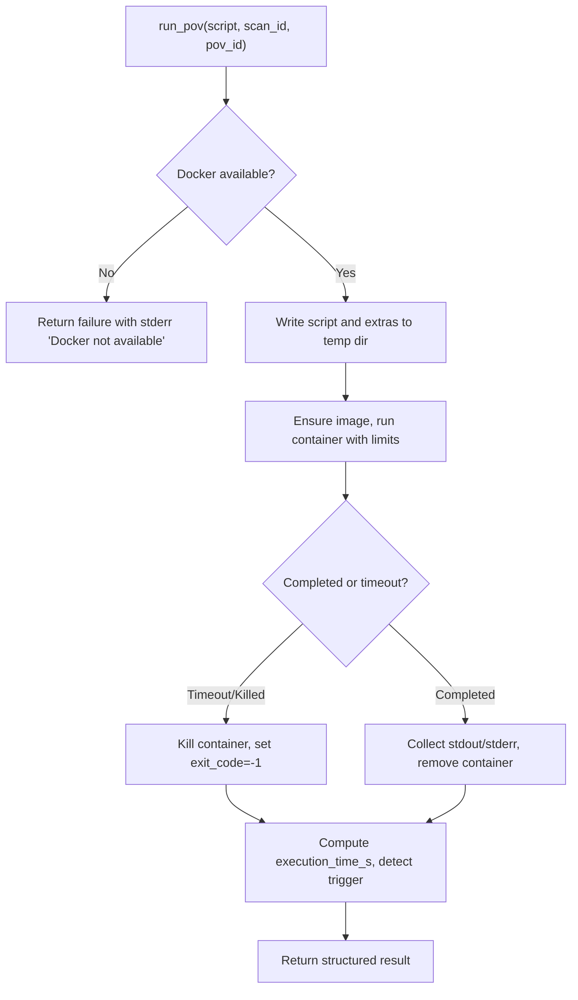
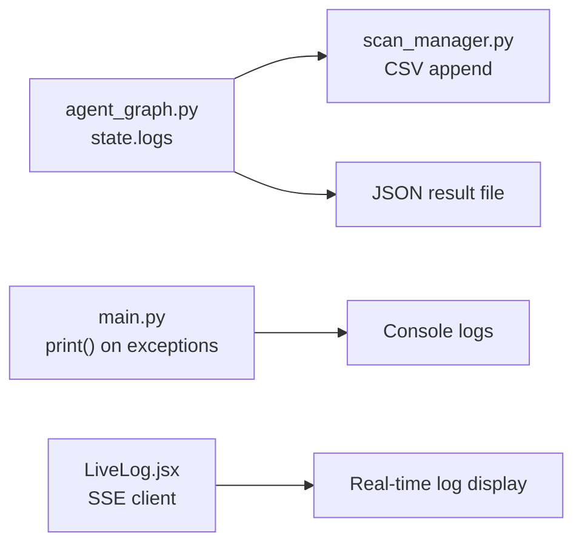
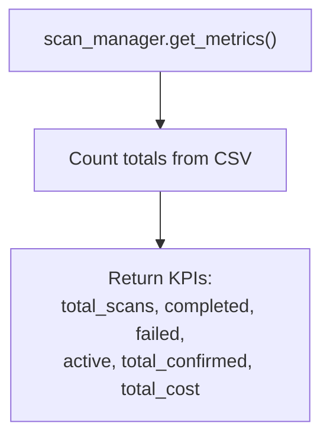
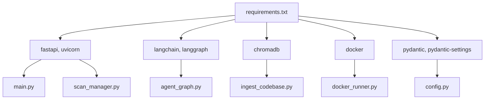

# Monitoring and Logging

<cite>
**Referenced Files in This Document**
- [main.py](file://autopov/app/main.py)
- [config.py](file://autopov/app/config.py)
- [scan_manager.py](file://autopov/app/scan_manager.py)
- [agent_graph.py](file://autopov/app/agent_graph.py)
- [docker_runner.py](file://autopov/agents/docker_runner.py)
- [auth.py](file://autopov/app/auth.py)
- [webhook_handler.py](file://autopov/app/webhook_handler.py)
- [ingest_codebase.py](file://autopov/agents/ingest_codebase.py)
- [LiveLog.jsx](file://autopov/frontend/src/components/LiveLog.jsx)
- [ResultsDashboard.jsx](file://autopov/frontend/src/components/ResultsDashboard.jsx)
- [requirements.txt](file://autopov/requirements.txt)
</cite>

## Table of Contents
1. [Introduction](#introduction)
2. [Project Structure](#project-structure)
3. [Core Components](#core-components)
4. [Architecture Overview](#architecture-overview)
5. [Detailed Component Analysis](#detailed-component-analysis)
6. [Dependency Analysis](#dependency-analysis)
7. [Performance Considerations](#performance-considerations)
8. [Troubleshooting Guide](#troubleshooting-guide)
9. [Conclusion](#conclusion)
10. [Appendices](#appendices)

## Introduction
This document provides a comprehensive guide to AutoPoV’s monitoring and logging systems with a focus on observability and operational visibility. It covers monitoring strategies for API endpoints, agent workflows, and Docker execution environments; logging configuration for the FastAPI application, LangGraph agent states, and system events; metrics collection for scan throughput, LLM token usage, Docker resource consumption, and error rates; practical integration examples with Prometheus, Grafana, and the ELK stack; alerting strategies for critical failures, performance degradation, and security incidents; guidance for log aggregation, retention, and compliance; and real-time dashboards and operational KPIs for system health.

## Project Structure
AutoPoV is organized around a FastAPI application that orchestrates a LangGraph-based agent workflow. The workflow ingests code, runs CodeQL or LLM-based analysis, generates and validates Proof-of-Vulnerability (PoV) scripts, and executes them in Docker containers. Monitoring and logging touchpoints exist at the API layer, agent state, scan manager persistence, and Docker runner execution.

**Diagram sources**
- [main.py](file://autopov/app/main.py#L102-L121)
- [config.py](file://autopov/app/config.py#L13-L210)
- [scan_manager.py](file://autopov/app/scan_manager.py#L40-L344)
- [agent_graph.py](file://autopov/app/agent_graph.py#L78-L582)
- [docker_runner.py](file://autopov/agents/docker_runner.py#L27-L379)
- [auth.py](file://autopov/app/auth.py#L32-L168)
- [webhook_handler.py](file://autopov/app/webhook_handler.py#L15-L363)
- [ingest_codebase.py](file://autopov/agents/ingest_codebase.py#L41-L407)
- [LiveLog.jsx](file://autopov/frontend/src/components/LiveLog.jsx#L1-L66)
- [ResultsDashboard.jsx](file://autopov/frontend/src/components/ResultsDashboard.jsx#L1-L102)

**Section sources**
- [main.py](file://autopov/app/main.py#L102-L121)
- [config.py](file://autopov/app/config.py#L13-L210)
- [scan_manager.py](file://autopov/app/scan_manager.py#L40-L344)
- [agent_graph.py](file://autopov/app/agent_graph.py#L78-L582)
- [docker_runner.py](file://autopov/agents/docker_runner.py#L27-L379)
- [auth.py](file://autopov/app/auth.py#L32-L168)
- [webhook_handler.py](file://autopov/app/webhook_handler.py#L15-L363)
- [ingest_codebase.py](file://autopov/agents/ingest_codebase.py#L41-L407)
- [LiveLog.jsx](file://autopov/frontend/src/components/LiveLog.jsx#L1-L66)
- [ResultsDashboard.jsx](file://autopov/frontend/src/components/ResultsDashboard.jsx#L1-L102)

## Core Components
- FastAPI application with streaming logs via Server-Sent Events (SSE), metrics endpoint, health checks, and API key authentication.
- Scan manager that persists scan results to JSON and CSV, tracks metrics, and exposes metrics via the metrics endpoint.
- LangGraph agent graph that maintains a structured state with logs, costs, and timestamps for each stage of the workflow.
- Docker runner that executes PoV scripts in isolated containers, capturing execution time, exit codes, and logs.
- Webhook handler that verifies provider signatures and triggers scans, enabling continuous security workflows.
- Frontend components that render live logs and KPI dashboards for operational visibility.

**Section sources**
- [main.py](file://autopov/app/main.py#L164-L174)
- [main.py](file://autopov/app/main.py#L350-L385)
- [main.py](file://autopov/app/main.py#L513-L518)
- [scan_manager.py](file://autopov/app/scan_manager.py#L304-L334)
- [agent_graph.py](file://autopov/app/agent_graph.py#L62-L76)
- [docker_runner.py](file://autopov/agents/docker_runner.py#L62-L192)
- [webhook_handler.py](file://autopov/app/webhook_handler.py#L196-L336)
- [LiveLog.jsx](file://autopov/frontend/src/components/LiveLog.jsx#L1-L66)
- [ResultsDashboard.jsx](file://autopov/frontend/src/components/ResultsDashboard.jsx#L1-L102)

## Architecture Overview
The monitoring and logging architecture integrates API-level telemetry, agent-state telemetry, and Docker execution telemetry. The metrics endpoint aggregates scan-level KPIs, while SSE endpoints deliver real-time logs to the frontend. Docker stats and availability checks provide runtime environment insights.

**Diagram sources**
- [main.py](file://autopov/app/main.py#L177-L316)
- [main.py](file://autopov/app/main.py#L350-L385)
- [auth.py](file://autopov/app/auth.py#L137-L167)
- [scan_manager.py](file://autopov/app/scan_manager.py#L86-L116)
- [agent_graph.py](file://autopov/app/agent_graph.py#L532-L572)
- [docker_runner.py](file://autopov/agents/docker_runner.py#L62-L192)
- [ingest_codebase.py](file://autopov/agents/ingest_codebase.py#L201-L307)

## Detailed Component Analysis

### API-Level Monitoring and Logging
- Health endpoint provides service health, version, and tool availability checks.
- SSE endpoint streams logs from the scan state to clients in real time.
- Metrics endpoint aggregates scan history into system-wide KPIs.
- API key authentication ensures access control for sensitive endpoints.

**Diagram sources**
- [main.py](file://autopov/app/main.py#L350-L385)
- [auth.py](file://autopov/app/auth.py#L137-L167)

**Section sources**
- [main.py](file://autopov/app/main.py#L164-L174)
- [main.py](file://autopov/app/main.py#L350-L385)
- [main.py](file://autopov/app/main.py#L513-L518)
- [auth.py](file://autopov/app/auth.py#L137-L167)

### Agent Workflow Telemetry (LangGraph)
- The agent graph maintains a typed state with logs, costs, and timestamps.
- Each node appends structured log entries with ISO timestamps.
- Costs are estimated per inference and aggregated per finding and scan.
- Conditional edges govern retries and transitions, enabling failure tracking.

**Diagram sources**
- [agent_graph.py](file://autopov/app/agent_graph.py#L62-L76)
- [agent_graph.py](file://autopov/app/agent_graph.py#L43-L60)

**Section sources**
- [agent_graph.py](file://autopov/app/agent_graph.py#L516-L520)
- [agent_graph.py](file://autopov/app/agent_graph.py#L521-L531)

### Docker Execution Monitoring
- Docker runner executes PoV scripts in isolated containers with memory and CPU limits.
- Captures execution time, exit codes, and combined stdout/stderr.
- Provides availability checks and stats for Docker daemon health.

**Diagram sources**
- [docker_runner.py](file://autopov/agents/docker_runner.py#L62-L192)

**Section sources**
- [docker_runner.py](file://autopov/agents/docker_runner.py#L62-L192)
- [docker_runner.py](file://autopov/agents/docker_runner.py#L346-L370)

### Logging Configuration and Persistence
- API-level logs: printed during startup/shutdown and exceptions in webhook scans.
- Agent-state logs: appended with ISO timestamps inside the agent graph state.
- Scan results: persisted to JSON and CSV with metrics for historical analysis.
- Frontend rendering: LiveLog displays structured logs with severity-aware coloring.

**Diagram sources**
- [agent_graph.py](file://autopov/app/agent_graph.py#L516-L520)
- [scan_manager.py](file://autopov/app/scan_manager.py#L201-L235)
- [main.py](file://autopov/app/main.py#L156-L158)
- [LiveLog.jsx](file://autopov/frontend/src/components/LiveLog.jsx#L1-L66)

**Section sources**
- [agent_graph.py](file://autopov/app/agent_graph.py#L516-L520)
- [scan_manager.py](file://autopov/app/scan_manager.py#L201-L235)
- [main.py](file://autopov/app/main.py#L156-L158)
- [LiveLog.jsx](file://autopov/frontend/src/components/LiveLog.jsx#L1-L66)

### Metrics Collection
- Scan throughput: total scans, completed, failed, active scans.
- LLM token usage: estimated cost per inference and aggregated per scan.
- Docker resource consumption: container execution time, exit codes, and logs.
- Error rates: failures per scan and per finding category.

**Diagram sources**
- [scan_manager.py](file://autopov/app/scan_manager.py#L304-L334)

**Section sources**
- [scan_manager.py](file://autopov/app/scan_manager.py#L304-L334)
- [agent_graph.py](file://autopov/app/agent_graph.py#L521-L531)
- [docker_runner.py](file://autopov/agents/docker_runner.py#L152-L166)

### Practical Integrations

#### Prometheus and Grafana
- Expose metrics via the existing metrics endpoint and scrape with Prometheus.
- Create Grafana dashboards for:
  - Total scans and active scans.
  - Error rate (failed/total).
  - Average duration per scan.
  - Cost trends and per-finding cost.
  - Docker execution time and exit codes.

#### ELK Stack (Elasticsearch, Logstash, Kibana)
- Forward console logs and structured logs to Elasticsearch.
- Use Kibana to build dashboards for:
  - Log volume by severity.
  - Error distribution by stage (ingestion, PoV generation, Docker execution).
  - Vulnerability confirmation trends.

#### Alerting Strategies
- Critical system failures: webhook signature verification failures, Docker unavailability, scan failures.
- Performance degradation: increased average duration, timeouts, high error rates.
- Security incidents: unexpected Docker connectivity, invalid API keys, repeated webhook errors.

### Operational KPIs and Real-Time Dashboards
- KPIs: total findings, confirmed, false positives, failed, detection rate, FP rate, total cost, duration.
- Real-time dashboards: live logs, findings distribution pie chart, cost and duration cards.

**Section sources**
- [ResultsDashboard.jsx](file://autopov/frontend/src/components/ResultsDashboard.jsx#L1-L102)
- [scan_manager.py](file://autopov/app/scan_manager.py#L304-L334)

## Dependency Analysis
The monitoring and logging subsystems depend on:
- FastAPI for routing and SSE.
- Pydantic settings for environment checks and configuration.
- LangGraph for stateful orchestration and logging.
- Docker SDK for container execution and stats.
- ChromaDB and embeddings for code ingestion and retrieval.

**Diagram sources**
- [requirements.txt](file://autopov/requirements.txt#L1-L42)
- [main.py](file://autopov/app/main.py#L13-L26)
- [config.py](file://autopov/app/config.py#L13-L210)
- [agent_graph.py](file://autopov/app/agent_graph.py#L13-L27)
- [docker_runner.py](file://autopov/agents/docker_runner.py#L12-L18)
- [ingest_codebase.py](file://autopov/agents/ingest_codebase.py#L14-L32)
- [scan_manager.py](file://autopov/app/scan_manager.py#L16-L18)

**Section sources**
- [requirements.txt](file://autopov/requirements.txt#L1-L42)
- [main.py](file://autopov/app/main.py#L13-L26)
- [config.py](file://autopov/app/config.py#L13-L210)
- [agent_graph.py](file://autopov/app/agent_graph.py#L13-L27)
- [docker_runner.py](file://autopov/agents/docker_runner.py#L12-L18)
- [ingest_codebase.py](file://autopov/agents/ingest_codebase.py#L14-L32)
- [scan_manager.py](file://autopov/app/scan_manager.py#L16-L18)

## Performance Considerations
- Use SSE streaming judiciously; throttle refresh intervals to avoid client overload.
- Batch vector store writes to minimize I/O overhead.
- Limit Docker CPU and memory to prevent resource contention.
- Monitor CodeQL availability and fall back to LLM-only mode gracefully.

## Troubleshooting Guide
- Docker not available: verify Docker SDK installation and daemon status; fallback behavior returns explicit stderr.
- Webhook signature mismatch: ensure secrets are configured and signatures are verified before triggering scans.
- API key errors: confirm key validity and admin key requirements for admin endpoints.
- Scan stuck: check scan state logs and metrics; inspect CSV history for completion markers.

**Section sources**
- [docker_runner.py](file://autopov/agents/docker_runner.py#L81-L90)
- [webhook_handler.py](file://autopov/app/webhook_handler.py#L25-L74)
- [auth.py](file://autopov/app/auth.py#L137-L167)
- [scan_manager.py](file://autopov/app/scan_manager.py#L252-L273)

## Conclusion
AutoPoV’s monitoring and logging architecture leverages FastAPI’s SSE for real-time observability, LangGraph’s stateful logging for granular workflow telemetry, and Docker execution telemetry for containerized safety and performance. The metrics endpoint and CSV history enable historical analysis and dashboard creation. With proper integration to Prometheus, Grafana, and the ELK stack, operators can achieve comprehensive visibility, robust alerting, and compliance-ready audit trails.

## Appendices

### Appendix A: Monitoring Checklist
- Confirm metrics endpoint scraping and dashboard creation.
- Validate SSE stream connectivity and frontend rendering.
- Test webhook signature verification and scan triggers.
- Verify Docker stats and availability checks.
- Review CSV history and JSON results for completeness.

### Appendix B: Compliance and Retention
- Retain logs and results for audit periods as required.
- Anonymize or redact sensitive data in logs and reports.
- Enforce access controls via API keys and admin-only endpoints.