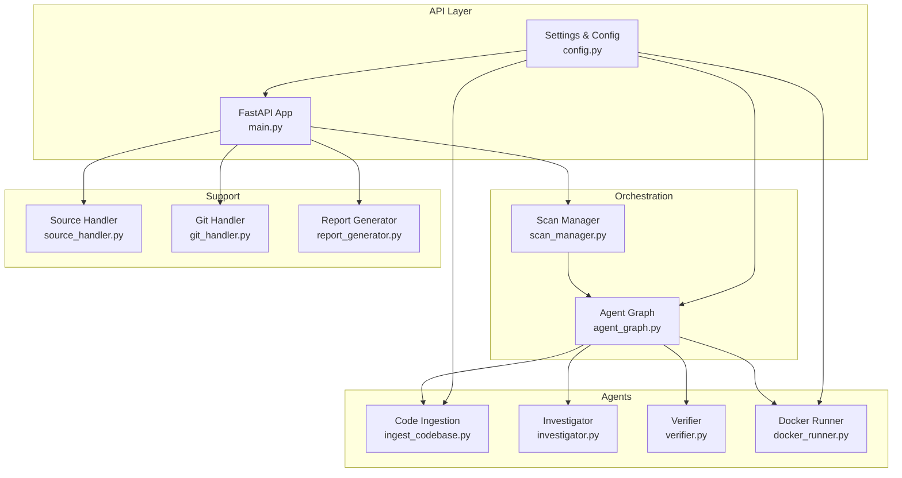
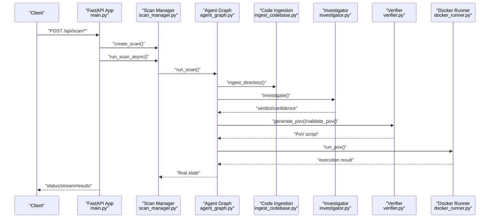
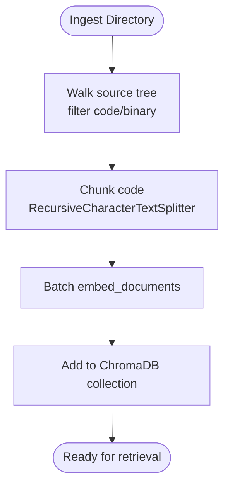
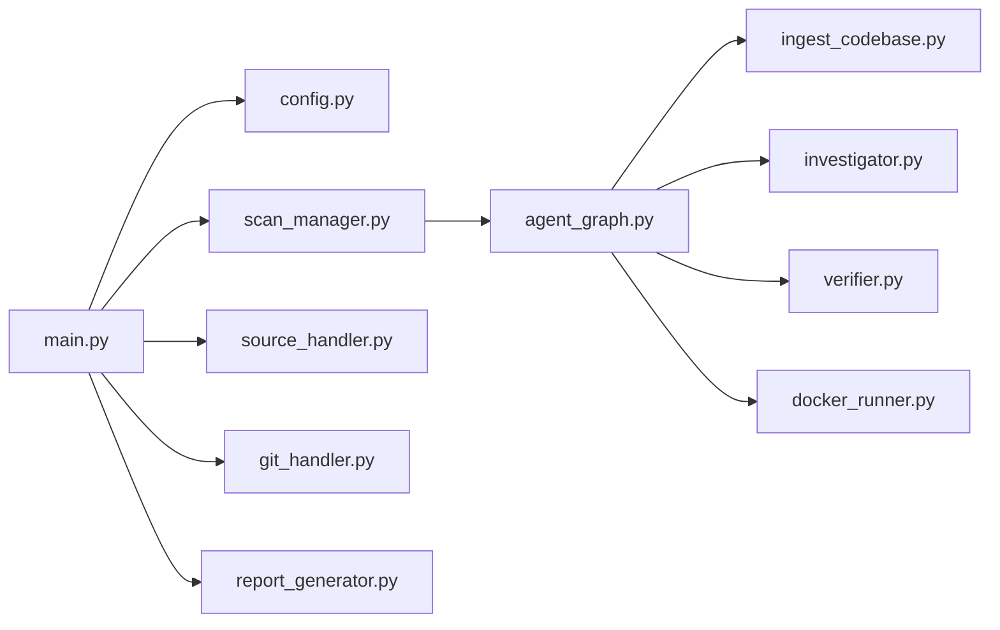

# Performance Optimization

<cite>
**Referenced Files in This Document**
- [main.py](file://autopov/app/main.py)
- [config.py](file://autopov/app/config.py)
- [scan_manager.py](file://autopov/app/scan_manager.py)
- [agent_graph.py](file://autopov/app/agent_graph.py)
- [ingest_codebase.py](file://autopov/agents/ingest_codebase.py)
- [docker_runner.py](file://autopov/agents/docker_runner.py)
- [source_handler.py](file://autopov/app/source_handler.py)
- [git_handler.py](file://autopov/app/git_handler.py)
- [prompts.py](file://autopov/prompts.py)
- [investigator.py](file://autopov/agents/investigator.py)
- [verifier.py](file://autopov/agents/verifier.py)
- [report_generator.py](file://autopov/app/report_generator.py)
</cite>

## Table of Contents
1. [Introduction](#introduction)
2. [Project Structure](#project-structure)
3. [Core Components](#core-components)
4. [Architecture Overview](#architecture-overview)
5. [Detailed Component Analysis](#detailed-component-analysis)
6. [Dependency Analysis](#dependency-analysis)
7. [Performance Considerations](#performance-considerations)
8. [Troubleshooting Guide](#troubleshooting-guide)
9. [Conclusion](#conclusion)
10. [Appendices](#appendices)

## Introduction
This document provides a comprehensive guide to performance optimization for AutoPoV, focusing on resource allocation, caching strategies, and scaling considerations. It covers LLM inference tuning, Docker runtime optimization, caching for vector store queries and static analysis, load testing and profiling, horizontal scaling for multi-agent workflows, and cost optimization with monitoring and auto-scaling policies. The goal is to help operators achieve reliable throughput, predictable latency, and sustainable operational costs.

## Project Structure
AutoPoV is organized around a FastAPI application that orchestrates a multi-agent workflow:
- API layer: endpoints for initiating scans, streaming logs, retrieving results, and metrics
- Orchestration: a LangGraph-based agent graph coordinating ingestion, static analysis, LLM investigation, PoV generation/validation, and Docker execution
- Agents: specialized modules for code ingestion (vector store), investigation (RAG + LLM), verification (PoV generation/validation), and containerized execution
- Supporting modules: configuration, source handling, Git operations, and reporting

**Diagram sources**
- [main.py](file://autopov/app/main.py#L102-L121)
- [config.py](file://autopov/app/config.py#L13-L210)
- [agent_graph.py](file://autopov/app/agent_graph.py#L78-L135)
- [scan_manager.py](file://autopov/app/scan_manager.py#L40-L84)
- [ingest_codebase.py](file://autopov/agents/ingest_codebase.py#L41-L116)
- [investigator.py](file://autopov/agents/investigator.py#L37-L88)
- [verifier.py](file://autopov/agents/verifier.py#L40-L78)
- [docker_runner.py](file://autopov/agents/docker_runner.py#L27-L61)
- [source_handler.py](file://autopov/app/source_handler.py#L18-L31)
- [git_handler.py](file://autopov/app/git_handler.py#L18-L67)
- [report_generator.py](file://autopov/app/report_generator.py#L68-L76)

**Section sources**
- [main.py](file://autopov/app/main.py#L102-L121)
- [config.py](file://autopov/app/config.py#L13-L210)

## Core Components
- Configuration and environment-driven tuning (model mode, online/offline providers, embeddings, Docker limits, chunk sizes, retries)
- Vector store ingestion with batching and collection isolation per scan
- Agent graph orchestrating multi-step vulnerability detection pipeline
- Docker runner enforcing resource limits and timeouts for PoV execution
- Metrics and reporting for cost tracking and scan outcomes

Key performance-relevant elements:
- LLM model selection and cost estimation
- Vector store chunking and embedding batching
- Docker CPU/memory/timeouts
- Thread pool sizing and async orchestration
- Retry policy for PoV generation/validation

**Section sources**
- [config.py](file://autopov/app/config.py#L30-L93)
- [ingest_codebase.py](file://autopov/agents/ingest_codebase.py#L201-L307)
- [agent_graph.py](file://autopov/app/agent_graph.py#L532-L572)
- [docker_runner.py](file://autopov/agents/docker_runner.py#L313-L344)
- [scan_manager.py](file://autopov/app/scan_manager.py#L40-L84)

## Architecture Overview
The system performs vulnerability scanning through a deterministic pipeline:
1. Source ingestion (Git/ZIP/raw) and extraction
2. Code ingestion into a vector store with chunking and embeddings
3. Static analysis (CodeQL) or fallback LLM-only analysis
4. LLM investigation with RAG context and optional Joern analysis
5. PoV generation and validation
6. Docker execution of PoV scripts with strict resource limits
7. Reporting and metrics aggregation

**Diagram sources**
- [main.py](file://autopov/app/main.py#L177-L316)
- [scan_manager.py](file://autopov/app/scan_manager.py#L86-L116)
- [agent_graph.py](file://autopov/app/agent_graph.py#L532-L572)
- [ingest_codebase.py](file://autopov/agents/ingest_codebase.py#L201-L307)
- [investigator.py](file://autopov/agents/investigator.py#L254-L347)
- [verifier.py](file://autopov/agents/verifier.py#L79-L149)
- [docker_runner.py](file://autopov/agents/docker_runner.py#L62-L192)

## Detailed Component Analysis

### Resource Allocation and Docker Optimization
- CPU and memory limits are enforced per container run to prevent noisy-neighbor effects and ensure fair scheduling.
- Timeouts bound execution to avoid hanging tasks.
- Network isolation prevents unintended outbound access during PoV execution.
- Stats endpoint surfaces runtime configuration for observability.

Practical tuning tips:
- Increase CPU limit moderately if PoV generation is CPU-bound; reduce if container throttling occurs.
- Raise memory limit for larger binaries or heavy PoVs; monitor RSS and OOM events.
- Tune timeout to match longest expected PoV runtime; consider exponential backoff for retries.
- Use separate Docker images for different workloads to isolate resource profiles.

**Section sources**
- [docker_runner.py](file://autopov/agents/docker_runner.py#L30-L61)
- [docker_runner.py](file://autopov/agents/docker_runner.py#L122-L150)
- [docker_runner.py](file://autopov/agents/docker_runner.py#L269-L293)
- [docker_runner.py](file://autopov/agents/docker_runner.py#L346-L370)
- [config.py](file://autopov/app/config.py#L78-L87)

### Caching Strategies for Vector Store Queries and Static Analysis
- Vector store collections are scoped per scan to avoid cross-scan interference and enable cleanup.
- Embedding generation is batched to reduce overhead and improve throughput.
- Retrieval queries leverage embeddings computed from the selected embedding model (online or offline).
- Static analysis (CodeQL) is invoked per CWE; results are parsed and normalized into findings.

Optimization levers:
- Adjust chunk size and overlap to balance recall and cost.
- Pre-warm embeddings for repeated queries by reusing the same collection across related scans.
- Persist ChromaDB to disk for reuse across runs; ensure adequate disk I/O bandwidth.
- Cache expensive RAG context synthesis results when patterns repeat.

**Diagram sources**
- [ingest_codebase.py](file://autopov/agents/ingest_codebase.py#L201-L307)

**Section sources**
- [ingest_codebase.py](file://autopov/agents/ingest_codebase.py#L41-L116)
- [ingest_codebase.py](file://autopov/agents/ingest_codebase.py#L201-L307)
- [config.py](file://autopov/app/config.py#L60-L67)

### LLM Inference Tuning: Model Selection, Batch Processing, Token Budget Management
- Online vs offline model modes switch providers and embedding models.
- Cost estimation is integrated into the pipeline; online mode uses inference-time-based estimates.
- Prompts are centralized and templated for consistency and reproducibility.
- Thread pool executor runs the orchestration to keep the API responsive.

Recommendations:
- Prefer offline models for controlled environments with dedicated GPUs; adjust temperature for deterministic behavior.
- Use smaller batch sizes for embeddings when memory-constrained; increase for throughput.
- Monitor token consumption and set budgets; cap retries to avoid runaway costs.
- Enable tracing for production visibility when using online providers.

**Section sources**
- [config.py](file://autopov/app/config.py#L30-L89)
- [prompts.py](file://autopov/prompts.py#L7-L44)
- [prompts.py](file://autopov/prompts.py#L46-L109)
- [agent_graph.py](file://autopov/app/agent_graph.py#L521-L531)
- [investigator.py](file://autopov/agents/investigator.py#L50-L87)
- [verifier.py](file://autopov/agents/verifier.py#L46-L77)

### API Endpoints and Streaming Logs for Real-Time Monitoring
- Status and streaming endpoints expose progress and logs for long-running scans.
- Metrics endpoint aggregates scan history and cost.

Operational tips:
- Use server-sent events for low-latency log streaming.
- Paginate history and limit result sets to control API overhead.
- Cache recent metrics to reduce repeated CSV reads.

**Section sources**
- [main.py](file://autopov/app/main.py#L320-L385)
- [main.py](file://autopov/app/main.py#L513-L518)
- [scan_manager.py](file://autopov/app/scan_manager.py#L252-L273)
- [scan_manager.py](file://autopov/app/scan_manager.py#L304-L334)

### Source Handling and Git Operations
- ZIP/TAR extraction with path-traversal protection.
- Git cloning with provider-aware credential injection and shallow clones to reduce I/O.
- Cleanup routines to reclaim disk space.

Best practices:
- Validate archives before extraction; enforce quotas on extracted size.
- Use shallow clones for large repositories to cut clone time.
- Sanitize scan IDs to avoid filesystem issues.

**Section sources**
- [source_handler.py](file://autopov/app/source_handler.py#L31-L78)
- [git_handler.py](file://autopov/app/git_handler.py#L60-L124)

### Reporting and Cost Tracking
- Reports include metrics such as detection rate, false positive rate, and PoV success rate.
- Metrics endpoint aggregates totals and costs across scan history.

Guidance:
- Track total cost per scan and per finding to identify hotspots.
- Export CSV for downstream analytics and trend analysis.
- Generate PDF reports for stakeholder review.

**Section sources**
- [report_generator.py](file://autopov/app/report_generator.py#L76-L118)
- [report_generator.py](file://autopov/app/report_generator.py#L120-L270)
- [scan_manager.py](file://autopov/app/scan_manager.py#L304-L334)
- [config.py](file://autopov/app/config.py#L85-L88)

## Dependency Analysis
The system exhibits clear layering:
- API depends on configuration and scan manager
- Scan manager depends on agent graph and code ingestion
- Agent graph coordinates ingestion, investigation, verification, and Docker execution
- Docker runner encapsulates containerization concerns

**Diagram sources**
- [main.py](file://autopov/app/main.py#L19-L26)
- [scan_manager.py](file://autopov/app/scan_manager.py#L16-L18)
- [agent_graph.py](file://autopov/app/agent_graph.py#L22-L27)

**Section sources**
- [main.py](file://autopov/app/main.py#L19-L26)
- [scan_manager.py](file://autopov/app/scan_manager.py#L16-L18)
- [agent_graph.py](file://autopov/app/agent_graph.py#L22-L27)

## Performance Considerations

### Resource Allocation
- CPU: Set Docker CPU quota proportional to workload; monitor throttling indicators.
- Memory: Allocate headroom above typical RSS; configure swap cautiously.
- Disk: Ensure sufficient space for ChromaDB persistence and temporary artifacts.
- Network: Keep containers isolated unless explicit inter-service communication is required.

### Caching and Vector Store Optimization
- Tune chunk size and overlap to balance precision and cost.
- Batch embedding operations to amortize API/network overhead.
- Persist ChromaDB to SSD-backed storage for faster I/O.
- Use collection-per-scan to simplify cleanup and reduce contention.

### LLM Inference Optimization
- Choose offline models for deterministic latency; online models for higher accuracy.
- Reduce prompt length and complexity where feasible.
- Apply retry with backoff for transient failures.
- Track inference time and cost per step to identify bottlenecks.

### Docker Runtime Controls
- Enforce CPU shares and memory limits to prevent resource starvation.
- Set timeouts to bound execution time; kill stuck processes.
- Use minimal base images and avoid unnecessary layers.

### Scaling and Concurrency
- Horizontal scale API instances behind a load balancer.
- Use async orchestration and thread pools to maximize throughput.
- Queue-based backends (not shown here) can decouple ingestion from execution.

### Cost Optimization
- Monitor total cost and per-scan budgets; alert on thresholds.
- Prefer offline models for internal deployments to reduce API costs.
- Right-size Docker resources to minimize waste.

[No sources needed since this section provides general guidance]

## Troubleshooting Guide

Common issues and remedies:
- Docker not available: Verify Docker availability and connectivity; fallback behavior returns non-success results with stderr indicating the issue.
- Vector store unavailable: Ensure ChromaDB is installed and persistent directory is writable.
- LLM provider misconfiguration: Confirm API keys and base URLs; check model availability.
- Long-running scans: Inspect logs via streaming endpoint; adjust chunk size and retries.
- Excessive costs: Review metrics endpoint and scan history CSV; tune model mode and chunk size.

Operational checks:
- Health endpoint indicates tool availability (Docker, CodeQL, Joern).
- Metrics endpoint aggregates scan outcomes and total cost.
- Cleanup routines remove temporary files and ChromaDB collections.

**Section sources**
- [docker_runner.py](file://autopov/agents/docker_runner.py#L50-L61)
- [docker_runner.py](file://autopov/agents/docker_runner.py#L168-L187)
- [ingest_codebase.py](file://autopov/agents/ingest_codebase.py#L90-L116)
- [config.py](file://autopov/app/config.py#L123-L172)
- [scan_manager.py](file://autopov/app/scan_manager.py#L304-L334)

## Conclusion
AutoPoV’s performance hinges on balanced resource allocation, efficient vector store operations, disciplined LLM usage, and robust containerization. By tuning chunk sizes, embedding batches, Docker limits, and retry policies—and by leveraging metrics and reporting—you can achieve predictable throughput, lower latency, and sustainable costs. Horizontal scaling and queue-based backends can further improve concurrency for multi-agent workflows.

[No sources needed since this section summarizes without analyzing specific files]

## Appendices

### Practical Load Testing Procedures
- Use HTTP load generators to simulate concurrent scan requests.
- Stream logs endpoint to observe latency and throughput under load.
- Monitor Docker stats and system metrics to identify saturation points.
- Gradually increase concurrency and measure p50/p95 latencies.

[No sources needed since this section provides general guidance]

### Bottleneck Identification and Profiling
- Profile LLM inference time per step and aggregate cost.
- Measure vector store ingestion latency and embedding throughput.
- Observe Docker execution times and exit codes.
- Use metrics endpoint to correlate scan durations with resource usage.

[No sources needed since this section provides general guidance]

### Capacity Planning and Auto-Scaling Policies
- Establish SLOs for scan completion time and cost per scan.
- Scale API replicas based on request rate and queue depth.
- Provision vector store and Docker resources according to peak concurrent scans.
- Implement auto-scaling triggers aligned with CPU, memory, and I/O saturation.

[No sources needed since this section provides general guidance]