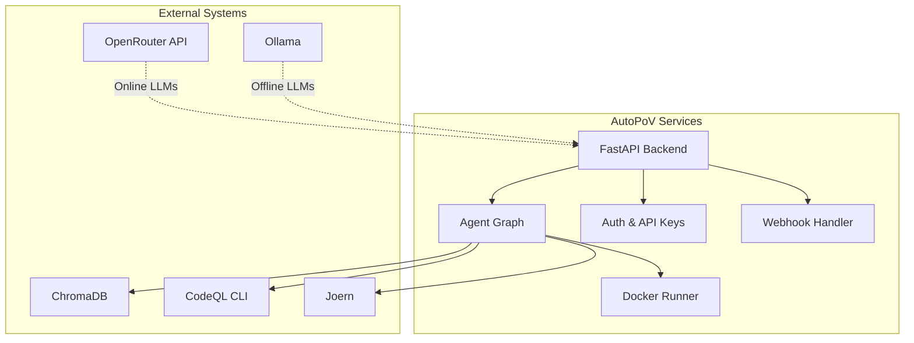
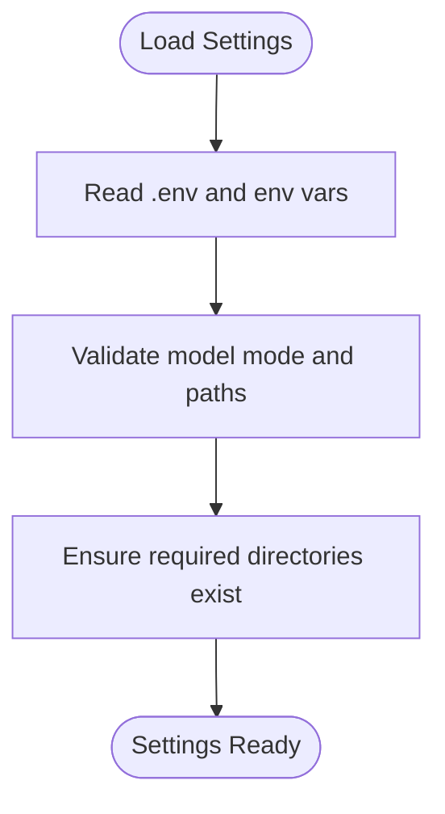
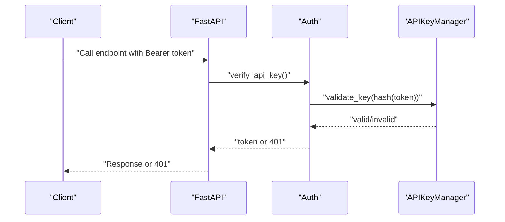
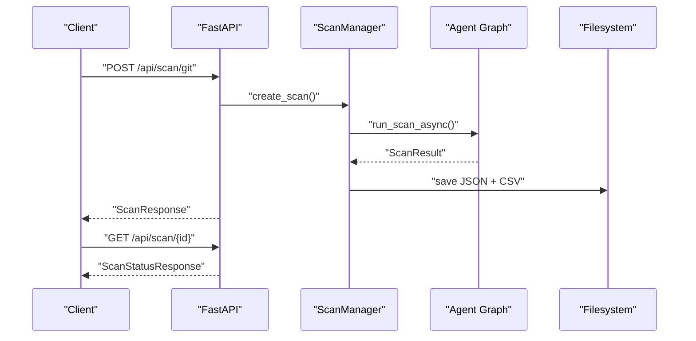
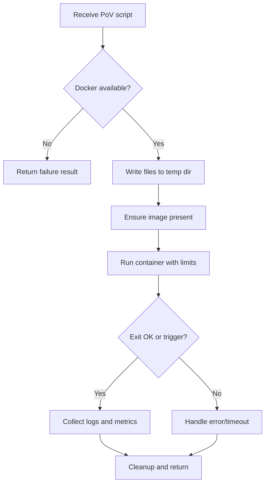
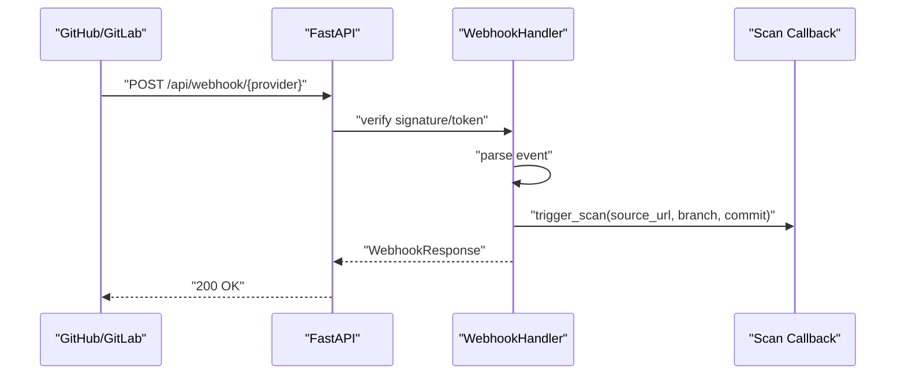
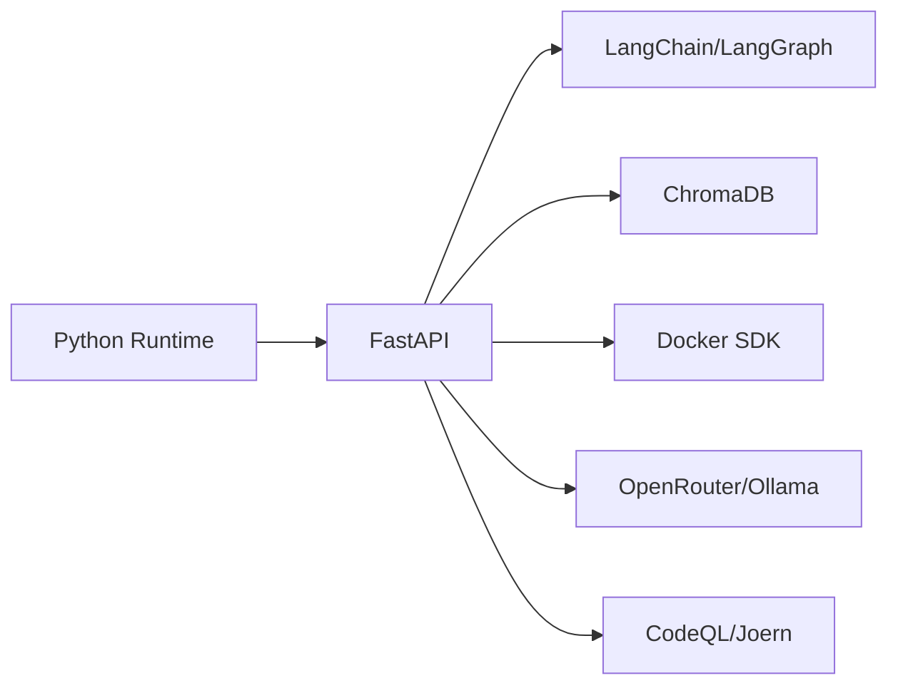

# Production Deployment

<cite>
**Referenced Files in This Document**
- [README.md](file://autopov/README.md)
- [requirements.txt](file://autopov/requirements.txt)
- [run.sh](file://autopov/run.sh)
- [main.py](file://autopov/app/main.py)
- [config.py](file://autopov/app/config.py)
- [auth.py](file://autopov/app/auth.py)
- [scan_manager.py](file://autopov/app/scan_manager.py)
- [docker_runner.py](file://autopov/agents/docker_runner.py)
- [webhook_handler.py](file://autopov/app/webhook_handler.py)
- [vite.config.js](file://autopov/frontend/vite.config.js)
- [package.json](file://autopov/frontend/package.json)
- [WebhookSetup.jsx](file://autopov/frontend/src/components/WebhookSetup.jsx)
- [autopov.py](file://autopov/cli/autopov.py)
</cite>

## Table of Contents
1. [Introduction](#introduction)
2. [Project Structure](#project-structure)
3. [Core Components](#core-components)
4. [Architecture Overview](#architecture-overview)
5. [Detailed Component Analysis](#detailed-component-analysis)
6. [Dependency Analysis](#dependency-analysis)
7. [Performance Considerations](#performance-considerations)
8. [Troubleshooting Guide](#troubleshooting-guide)
9. [Conclusion](#conclusion)
10. [Appendices](#appendices)

## Introduction
This document provides a comprehensive production deployment guide for AutoPoV. It covers environment preparation, dependency management, configuration, service initialization, containerization, orchestration, networking, automation, and cloud infrastructure. It also addresses security, load balancing, SSL termination, high availability, and operational best practices for reliable, scalable deployments.

## Project Structure
AutoPoV is a full-stack application composed of:
- Backend: FastAPI application with LangGraph-based scanning pipeline
- Agents: LLM-driven vulnerability investigation and PoV execution
- Frontend: React-based UI with Vite dev server and Tailwind styling
- CLI: Command-line interface for automation and reporting
- Tests: Pytest-based test suite

```mermaid
graph TB
subgraph "Backend"
M["FastAPI app<br/>main.py"]
CFG["Settings<br/>config.py"]
AUTH["Auth<br/>auth.py"]
SM["Scan Manager<br/>scan_manager.py"]
WH["Webhook Handler<br/>webhook_handler.py"]
end
subgraph "Agents"
DR["Docker Runner<br/>docker_runner.py"]
end
subgraph "Frontend"
VITE["Vite Dev Server<br/>vite.config.js"]
PKG["Dependencies<br/>package.json"]
end
subgraph "CLI"
CLI["autopov CLI<br/>autopov.py"]
end
M --> CFG
M --> AUTH
M --> SM
M --> WH
SM --> DR
VITE --> M
CLI --> M
```

**Diagram sources**
- [main.py](file://autopov/app/main.py#L102-L117)
- [config.py](file://autopov/app/config.py#L13-L210)
- [auth.py](file://autopov/app/auth.py#L32-L168)
- [scan_manager.py](file://autopov/app/scan_manager.py#L40-L344)
- [docker_runner.py](file://autopov/agents/docker_runner.py#L27-L379)
- [webhook_handler.py](file://autopov/app/webhook_handler.py#L15-L363)
- [vite.config.js](file://autopov/frontend/vite.config.js#L1-L21)
- [package.json](file://autopov/frontend/package.json#L1-L34)
- [autopov.py](file://autopov/cli/autopov.py#L89-L467)

**Section sources**
- [README.md](file://autopov/README.md#L17-L35)
- [main.py](file://autopov/app/main.py#L102-L117)
- [config.py](file://autopov/app/config.py#L13-L210)

## Core Components
- FastAPI application with CORS, health checks, scan endpoints, reports, webhooks, and metrics
- Configuration via environment variables and Pydantic settings
- Authentication with bearer tokens and admin controls
- Scan orchestration with background execution and persistent results
- Docker-based PoV execution with safety constraints
- Webhook handlers for GitHub and GitLab
- Frontend development server with proxy to backend
- CLI for automation and reporting

**Section sources**
- [main.py](file://autopov/app/main.py#L161-L525)
- [config.py](file://autopov/app/config.py#L13-L210)
- [auth.py](file://autopov/app/auth.py#L32-L168)
- [scan_manager.py](file://autopov/app/scan_manager.py#L40-L344)
- [docker_runner.py](file://autopov/agents/docker_runner.py#L27-L379)
- [webhook_handler.py](file://autopov/app/webhook_handler.py#L15-L363)
- [vite.config.js](file://autopov/frontend/vite.config.js#L7-L15)
- [autopov.py](file://autopov/cli/autopov.py#L89-L467)

## Architecture Overview
The production architecture separates concerns across backend, agents, and frontend, with optional external systems for LLMs, vector stores, and static analysis tools.



**Diagram sources**
- [main.py](file://autopov/app/main.py#L161-L525)
- [config.py](file://autopov/app/config.py#L30-L87)
- [docker_runner.py](file://autopov/agents/docker_runner.py#L27-L379)
- [webhook_handler.py](file://autopov/app/webhook_handler.py#L15-L363)

## Detailed Component Analysis

### Environment and Dependencies
- System requirements: Python 3.11+, Node.js 20+, Docker Desktop for PoV execution, optional CodeQL CLI and Joern
- Python dependencies managed via requirements.txt
- Node.js dependencies managed via frontend/package.json
- Development startup via run.sh supports backend, frontend, and combined modes

**Section sources**
- [README.md](file://autopov/README.md#L39-L46)
- [requirements.txt](file://autopov/requirements.txt#L1-L42)
- [package.json](file://autopov/frontend/package.json#L12-L32)
- [run.sh](file://autopov/run.sh#L36-L100)

### Configuration Management
- Centralized settings via Pydantic BaseSettings with environment variable overrides
- Key areas: API host/port, security (admin key, webhook secret), LLM selection (online/offline), embeddings, vector store paths, Docker execution limits, cost control, supported CWEs, and frontend URL
- Utility helpers to check tool availability (Docker, CodeQL, Joern)



**Diagram sources**
- [config.py](file://autopov/app/config.py#L13-L210)

**Section sources**
- [config.py](file://autopov/app/config.py#L13-L210)

### Authentication and API Keys
- Bearer token authentication for API endpoints
- Admin-only endpoints for key generation and revocation
- API key storage and validation with hashed persistence
- Admin key enforcement for sensitive operations



**Diagram sources**
- [auth.py](file://autopov/app/auth.py#L137-L167)
- [main.py](file://autopov/app/main.py#L475-L508)

**Section sources**
- [auth.py](file://autopov/app/auth.py#L32-L168)
- [main.py](file://autopov/app/main.py#L475-L508)

### Scan Orchestration and Results
- Asynchronous scan execution with thread pool
- Persistent results in JSON and CSV
- Metrics aggregation and history retrieval
- Real-time status via SSE



**Diagram sources**
- [main.py](file://autopov/app/main.py#L174-L344)
- [scan_manager.py](file://autopov/app/scan_manager.py#L86-L236)

**Section sources**
- [scan_manager.py](file://autopov/app/scan_manager.py#L40-L344)
- [main.py](file://autopov/app/main.py#L174-L344)

### Docker-Based PoV Execution
- Isolated container execution with strict resource limits and no network access
- Automatic image pull and cleanup
- Batch execution support with progress callbacks



**Diagram sources**
- [docker_runner.py](file://autopov/agents/docker_runner.py#L62-L192)

**Section sources**
- [docker_runner.py](file://autopov/agents/docker_runner.py#L27-L379)

### Webhooks and CI/CD Integration
- GitHub and GitLab webhook verification and parsing
- Event filtering and scan triggering via registered callback
- Frontend component surfaces webhook URLs and secrets



**Diagram sources**
- [webhook_handler.py](file://autopov/app/webhook_handler.py#L196-L336)
- [main.py](file://autopov/app/main.py#L120-L158)
- [WebhookSetup.jsx](file://autopov/frontend/src/components/WebhookSetup.jsx#L1-L88)

**Section sources**
- [webhook_handler.py](file://autopov/app/webhook_handler.py#L15-L363)
- [main.py](file://autopov/app/main.py#L430-L472)
- [WebhookSetup.jsx](file://autopov/frontend/src/components/WebhookSetup.jsx#L1-L88)

### Frontend Development and Build
- Vite dev server proxies API requests to backend
- Build artifacts placed under dist with sourcemaps enabled
- React dependencies declared in package.json

**Section sources**
- [vite.config.js](file://autopov/frontend/vite.config.js#L7-L19)
- [package.json](file://autopov/frontend/package.json#L12-L32)

### CLI Automation
- Supports scanning Git repos, ZIP archives, and directories
- Results retrieval and PDF report generation
- API key management and configuration persistence

**Section sources**
- [autopov.py](file://autopov/cli/autopov.py#L89-L467)

## Dependency Analysis
- Python runtime and FastAPI stack
- LangChain/LangGraph for agent orchestration
- ChromaDB for embeddings and vector store
- Docker SDK for Python to execute PoVs
- Optional OpenRouter/Ollama for LLM inference
- Optional CodeQL/Joern for static analysis



**Diagram sources**
- [requirements.txt](file://autopov/requirements.txt#L3-L42)

**Section sources**
- [requirements.txt](file://autopov/requirements.txt#L1-L42)

## Performance Considerations
- Concurrency: Thread pool executor for scans; tune max workers based on CPU and memory headroom
- Resource limits: Docker memory and CPU quotas prevent runaway workloads
- Cost control: Configurable maximum cost and tracking enable budget-aware operations
- I/O: Persist results to disk; consider SSD-backed storage for vector DB and logs
- Caching: Reuse downloaded Docker images and pre-warm embeddings where feasible

[No sources needed since this section provides general guidance]

## Troubleshooting Guide
- Health endpoint: Use the health check to verify tool availability and service readiness
- Logs: Stream scan logs via SSE for real-time diagnostics
- API keys: Ensure admin key is configured for key management endpoints
- Docker: Confirm Docker daemon is running and accessible; verify image availability
- Webhooks: Validate signatures and secrets; confirm callback registration

**Section sources**
- [main.py](file://autopov/app/main.py#L161-L171)
- [main.py](file://autopov/app/main.py#L346-L382)
- [auth.py](file://autopov/app/auth.py#L126-L131)
- [docker_runner.py](file://autopov/agents/docker_runner.py#L50-L61)
- [webhook_handler.py](file://autopov/app/webhook_handler.py#L213-L218)

## Conclusion
AutoPoV’s production deployment centers on a robust FastAPI backend, secure API key management, configurable LLM backends, and safe, isolated PoV execution via Docker. By following the environment preparation, dependency management, and configuration steps outlined here, teams can deploy AutoPoV reliably with strong security, observability, and scalability.

[No sources needed since this section summarizes without analyzing specific files]

## Appendices

### A. Step-by-Step Production Deployment Checklist
- Prepare OS and prerequisites (Python, Node.js, Docker)
- Create and activate virtual environment
- Install Python dependencies from requirements.txt
- Install Node.js dependencies for frontend
- Create .env from .env.example and set required variables
- Initialize directories via settings.ensure_directories()
- Start backend with production WSGI server (see below)
- Build and serve frontend for production
- Configure reverse proxy and SSL termination
- Set up load balancer and high availability
- Configure monitoring, logging, and alerting

**Section sources**
- [README.md](file://autopov/README.md#L39-L86)
- [requirements.txt](file://autopov/requirements.txt#L1-L42)
- [package.json](file://autopov/frontend/package.json#L12-L32)
- [config.py](file://autopov/app/config.py#L191-L202)

### B. Environment Variables Reference
- Application: APP_NAME, APP_VERSION, DEBUG
- API: API_HOST, API_PORT, FRONTEND_URL
- Security: ADMIN_API_KEY, WEBHOOK_SECRET
- LLM: MODEL_MODE, MODEL_NAME, OPENROUTER_API_KEY, OLLAMA_BASE_URL
- Providers: GITHUB_TOKEN, GITLAB_TOKEN, BITBUCKET_TOKEN
- Webhooks: GITHUB_WEBHOOK_SECRET, GITLAB_WEBHOOK_SECRET
- Vector store: CHROMA_PERSIST_DIR, CHROMA_COLLECTION_NAME
- Embeddings: EMBEDDING_MODEL_ONLINE, EMBEDDING_MODEL_OFFLINE
- Tracing: LANGCHAIN_TRACING_V2, LANGCHAIN_API_KEY, LANGCHAIN_PROJECT
- Tools: CODEQL_CLI_PATH, JOERN_CLI_PATH, KAITAI_STRUCT_COMPILER_PATH
- Docker: DOCKER_ENABLED, DOCKER_IMAGE, DOCKER_TIMEOUT, DOCKER_MEMORY_LIMIT, DOCKER_CPU_LIMIT
- Cost control: MAX_COST_USD, COST_TRACKING_ENABLED
- Scanning: MAX_CHUNK_SIZE, CHUNK_OVERLAP, MAX_RETRIES
- Paths: DATA_DIR, RESULTS_DIR, POVS_DIR, RUNS_DIR, TEMP_DIR

**Section sources**
- [config.py](file://autopov/app/config.py#L16-L111)

### C. Service Initialization and Process Management
- Backend: Use a production ASGI server (e.g., uvicorn with workers) bound to API_HOST/API_PORT
- Frontend: Build static assets and serve via Nginx/Apache or CDN
- Health checks: Expose /api/health for readiness/liveness probes
- Logging: Redirect logs to stdout/stderr for container orchestration platforms

**Section sources**
- [main.py](file://autopov/app/main.py#L517-L525)
- [vite.config.js](file://autopov/frontend/vite.config.js#L16-L19)

### D. Containerization Options
- Build a minimal Python image with installed dependencies
- Mount persistent volumes for data, results, and ChromaDB
- Run backend and optionally frontend in separate containers
- Use Docker Compose for orchestrated deployment

[No sources needed since this section provides general guidance]

### E. Reverse Proxy and SSL Termination
- Place Nginx/Apache in front of the backend
- Terminate TLS at the reverse proxy
- Proxy /api to backend service
- Configure CORS and headers appropriately

[No sources needed since this section provides general guidance]

### F. Load Balancing and High Availability
- Horizontal scaling: Run multiple backend instances behind a load balancer
- Sticky sessions: Not required for stateless API; rely on shared storage for results
- Shared storage: Use persistent volumes or object storage for results and logs
- Health checks: Use /api/health for load balancer health probes

[No sources needed since this section provides general guidance]

### G. Cloud Deployment Guidance
- AWS: EC2 instances or ECS/EKS; configure security groups for ports 80/443 and backend; attach IAM roles for S3 if exporting reports
- GCP: Compute Engine or GKE; use firewall rules and service accounts
- Azure: VMSS or AKS; configure NSGs and managed identities
- Networking: Allow inbound traffic only from trusted networks; restrict outbound to LLM providers

[No sources needed since this section provides general guidance]

### H. Example Deployment Automation Scripts
- Provisioning: Use Infrastructure-as-Code (Terraform) to create compute, networking, and storage resources
- Configuration: Apply .env and systemd unit files
- Rollout: Blue/green or rolling updates with health checks
- Monitoring: Collect logs and metrics; set alerts for failures and latency spikes

[No sources needed since this section provides general guidance]