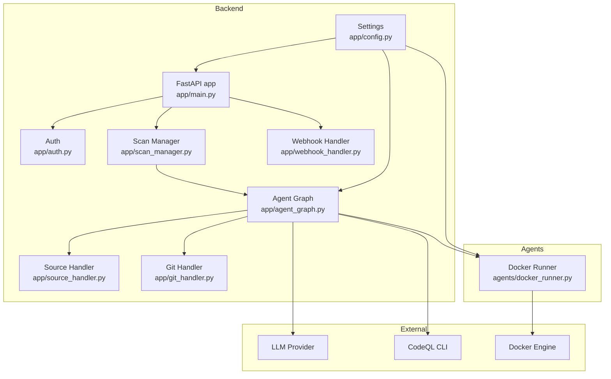
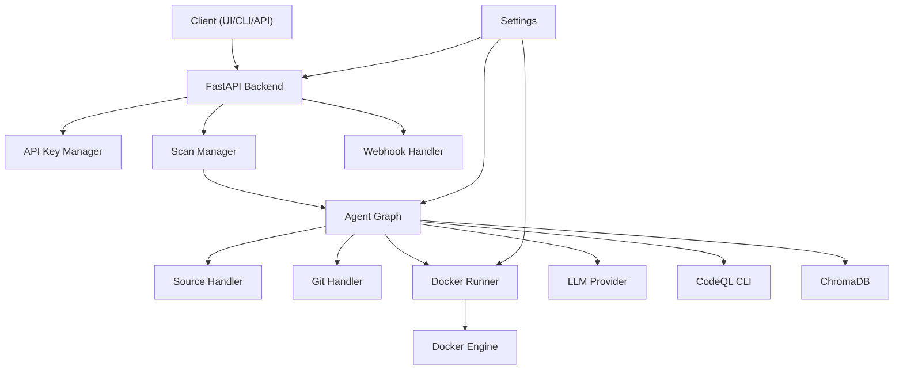
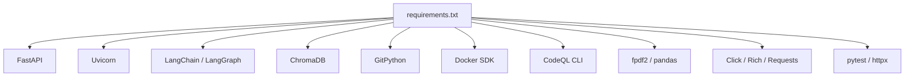
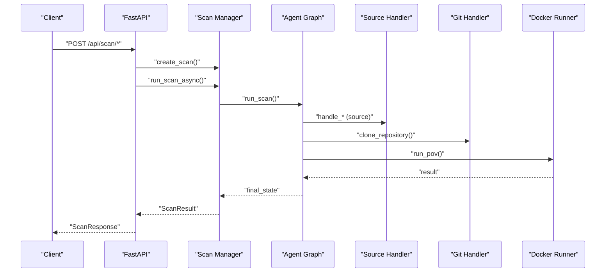
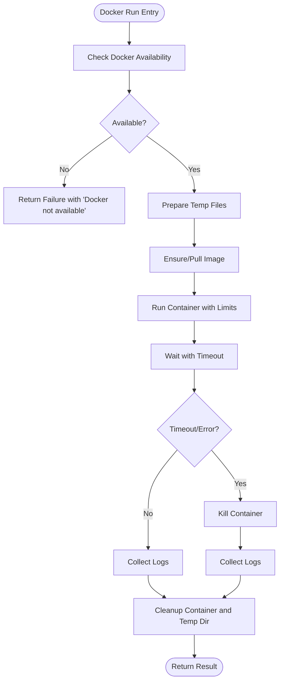
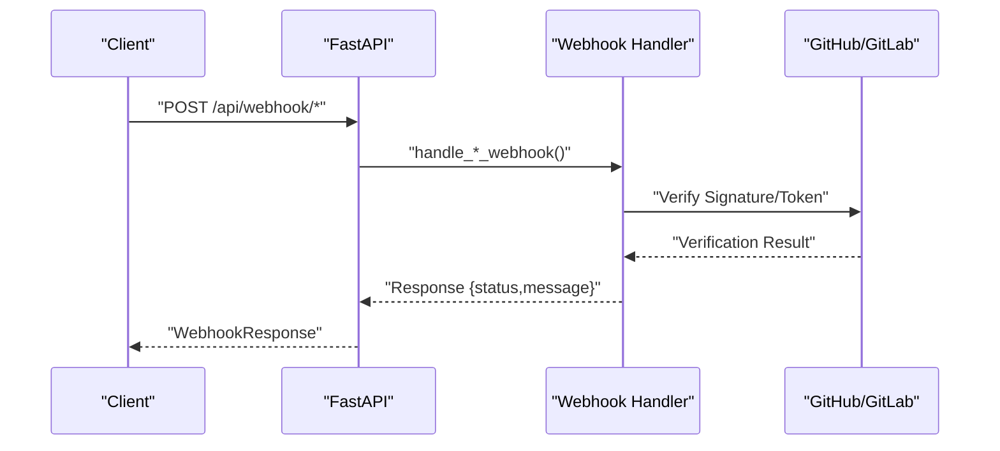

# Troubleshooting and Support

<cite>
**Referenced Files in This Document**
- [README.md](file://README.md)
- [requirements.txt](file://requirements.txt)
- [app/main.py](file://app/main.py)
- [app/config.py](file://app/config.py)
- [app/auth.py](file://app/auth.py)
- [app/scan_manager.py](file://app/scan_manager.py)
- [app/agent_graph.py](file://app/agent_graph.py)
- [app/source_handler.py](file://app/source_handler.py)
- [app/git_handler.py](file://app/git_handler.py)
- [app/webhook_handler.py](file://app/webhook_handler.py)
- [agents/docker_runner.py](file://agents/docker_runner.py)
- [cli/autopov.py](file://cli/autopov.py)
- [tests/test_api.py](file://tests/test_api.py)
</cite>

## Table of Contents
1. [Introduction](#introduction)
2. [Project Structure](#project-structure)
3. [Core Components](#core-components)
4. [Architecture Overview](#architecture-overview)
5. [Detailed Component Analysis](#detailed-component-analysis)
6. [Dependency Analysis](#dependency-analysis)
7. [Performance Considerations](#performance-considerations)
8. [Troubleshooting Guide](#troubleshooting-guide)
9. [Conclusion](#conclusion)
10. [Appendices](#appendices)

## Introduction
This document provides a comprehensive troubleshooting and support guide for AutoPoV. It focuses on operational problem resolution and user assistance across common areas:
- LLM connectivity issues (online vs offline modes)
- Docker execution failures
- API endpoint errors and authentication problems
- Agent workflow failures, memory leaks, and performance bottlenecks
- Error message interpretation, log analysis, and debugging strategies
- Practical resolutions for configuration, dependency conflicts, and runtime exceptions
- User support procedures, issue categorization, escalation paths, and resolution tracking
- Guidance for collecting diagnostics, reproducing issues, and implementing temporary workarounds
- Preventive measures and monitoring thresholds for proactive detection

## Project Structure
AutoPoV is a FastAPI-based backend with modular components:
- Backend API: endpoints for scanning, streaming logs, reports, webhooks, and metrics
- Agent graph orchestrator: LangGraph-based workflow for ingestion, analysis, PoV generation, validation, and Docker execution
- Agents: code ingestion, investigation (LLM), verification (PoV), and Docker runner
- Supporting modules: authentication, configuration, source handling, Git operations, webhook handling
- CLI and tests for automation and validation

**Diagram sources**
- [app/main.py](file://app/main.py#L102-L121)
- [app/config.py](file://app/config.py#L13-L210)
- [app/scan_manager.py](file://app/scan_manager.py#L40-L344)
- [app/agent_graph.py](file://app/agent_graph.py#L78-L135)
- [app/source_handler.py](file://app/source_handler.py#L18-L380)
- [app/git_handler.py](file://app/git_handler.py#L18-L222)
- [app/webhook_handler.py](file://app/webhook_handler.py#L15-L363)
- [agents/docker_runner.py](file://agents/docker_runner.py#L27-L379)

**Section sources**
- [README.md](file://README.md#L17-L35)
- [app/main.py](file://app/main.py#L102-L121)
- [app/config.py](file://app/config.py#L13-L210)

## Core Components
- Configuration and environment: centralized settings with environment variable support, tool availability checks, and LLM configuration selection
- Authentication: API key generation, validation, and admin controls
- Scan orchestration: scan creation, background execution, state persistence, and metrics
- Agent graph: multi-stage workflow with ingestion, CodeQL/LLM analysis, PoV generation/validation, and Docker execution
- Source and Git handlers: safe extraction, upload handling, and repository cloning with credential injection
- Webhook handler: GitHub/GitLab signature/token verification and event parsing
- Docker runner: containerized PoV execution with resource limits and timeouts

**Section sources**
- [app/config.py](file://app/config.py#L13-L210)
- [app/auth.py](file://app/auth.py#L32-L176)
- [app/scan_manager.py](file://app/scan_manager.py#L40-L344)
- [app/agent_graph.py](file://app/agent_graph.py#L78-L582)
- [app/source_handler.py](file://app/source_handler.py#L18-L380)
- [app/git_handler.py](file://app/git_handler.py#L18-L222)
- [app/webhook_handler.py](file://app/webhook_handler.py#L15-L363)
- [agents/docker_runner.py](file://agents/docker_runner.py#L27-L379)

## Architecture Overview
The system integrates external tools and services:
- LLM providers (online via OpenRouter or offline via Ollama) depending on configuration
- Static analysis via CodeQL CLI (when available)
- Vector store (ChromaDB) for embeddings
- Docker engine for secure, isolated PoV execution

**Diagram sources**
- [app/main.py](file://app/main.py#L102-L121)
- [app/config.py](file://app/config.py#L13-L210)
- [app/agent_graph.py](file://app/agent_graph.py#L78-L135)
- [agents/docker_runner.py](file://agents/docker_runner.py#L27-L61)

## Detailed Component Analysis

### LLM Connectivity Troubleshooting
Common symptoms:
- Empty or minimal findings
- Errors indicating missing API keys or provider unavailability
- Unexpected fallback to LLM-only mode

Diagnostic steps:
- Verify model mode and provider configuration
  - Check MODEL_MODE, OPENROUTER_API_KEY/Ollama base URL, and model names
- Confirm provider availability
  - Health endpoint reports provider readiness
- Inspect scan logs for explicit LLM errors
  - Look for ingestion and investigation node logs in the agent graph

Resolution actions:
- Set correct environment variables for selected mode
- Validate API keys and network connectivity
- Adjust model selection to supported online/offline models

**Section sources**
- [app/config.py](file://app/config.py#L30-L88)
- [app/config.py](file://app/config.py#L173-L189)
- [app/main.py](file://app/main.py#L164-L174)
- [app/agent_graph.py](file://app/agent_graph.py#L136-L191)

### Docker Execution Failures
Symptoms:
- Docker not available messages
- Container errors, timeouts, or exit codes
- Resource limit violations

Diagnostic steps:
- Check Docker availability and ping
  - Use settings’ Docker availability check and Docker runner’s availability
- Review Docker runner logs and results
  - Inspect stderr/stdout, exit codes, and execution time
- Validate resource limits and timeouts
  - Memory/CPU limits and timeout settings

Resolution actions:
- Install/start Docker and grant permissions
- Increase limits or adjust timeouts for heavy scans
- Ensure required image is available or allow pull

**Section sources**
- [app/config.py](file://app/config.py#L78-L87)
- [app/config.py](file://app/config.py#L123-L136)
- [agents/docker_runner.py](file://agents/docker_runner.py#L50-L61)
- [agents/docker_runner.py](file://agents/docker_runner.py#L168-L187)
- [agents/docker_runner.py](file://agents/docker_runner.py#L135-L143)

### API Endpoint Errors and Authentication
Symptoms:
- 403/401 responses
- Signature/token validation failures
- Missing or invalid API keys

Diagnostic steps:
- Verify API key presence and validity
  - Use verify_api_key dependency and API key manager
- Check webhook signatures/tokens
  - GitHub signature verification and GitLab token verification
- Validate endpoint usage and headers

Resolution actions:
- Generate and configure API keys
- Ensure correct Authorization header or query param for SSE
- Reconfigure webhook secrets and verify payloads

**Section sources**
- [app/auth.py](file://app/auth.py#L137-L176)
- [app/webhook_handler.py](file://app/webhook_handler.py#L25-L74)
- [app/webhook_handler.py](file://app/webhook_handler.py#L196-L266)
- [app/webhook_handler.py](file://app/webhook_handler.py#L267-L336)
- [tests/test_api.py](file://tests/test_api.py#L26-L40)

### Agent Workflow Failures
Symptoms:
- Stuck stages, missing findings, or premature completion
- Errors during ingestion, CodeQL, investigation, PoV generation/validation, or Docker execution

Diagnostic steps:
- Stream logs via /api/scan/{scan_id}/stream
  - Observe stage transitions and error messages
- Inspect scan state and logs in scan manager
- Review agent graph node-specific logs and conditions

Resolution actions:
- Fix source codebase issues (encoding, binary files)
- Adjust CWE list and model settings
- Retry PoV generation or lower confidence threshold

**Section sources**
- [app/main.py](file://app/main.py#L350-L385)
- [app/scan_manager.py](file://app/scan_manager.py#L237-L286)
- [app/agent_graph.py](file://app/agent_graph.py#L516-L520)
- [app/agent_graph.py](file://app/agent_graph.py#L488-L515)

### Memory Leaks and Performance Bottlenecks
Symptoms:
- High memory usage, slow progress, or timeouts

Diagnostic steps:
- Monitor system metrics endpoint
- Review scan history and duration/cost metrics
- Check vector store cleanup and temporary directory usage

Resolution actions:
- Reduce max chunk size or overlap
- Limit CWE scope or concurrency
- Increase system resources or adjust Docker limits

**Section sources**
- [app/main.py](file://app/main.py#L513-L518)
- [app/scan_manager.py](file://app/scan_manager.py#L304-L334)
- [app/config.py](file://app/config.py#L89-L93)

### Error Message Interpretation and Log Analysis
Key indicators:
- “VULNERABILITY TRIGGERED” indicates successful PoV execution
- Errors in ingestion or investigation nodes
- Docker runner returning non-zero exit codes or timeouts
- Webhook signature/token mismatches

Recommended analysis:
- Use live log streaming to correlate timestamps with workflow stages
- Cross-reference scan status and logs
- Inspect Docker runner results for stderr and exit codes

**Section sources**
- [app/main.py](file://app/main.py#L350-L385)
- [agents/docker_runner.py](file://agents/docker_runner.py#L155-L166)
- [app/agent_graph.py](file://app/agent_graph.py#L416-L433)

### Debugging Strategies
- Reproduce with CLI
  - Use autopov CLI to trigger scans and monitor progress
- Inspect environment and dependencies
  - Validate installed tools and versions
- Enable tracing
  - Use LangSmith settings for tracing if configured

**Section sources**
- [cli/autopov.py](file://cli/autopov.py#L104-L210)
- [README.md](file://README.md#L39-L87)
- [app/config.py](file://app/config.py#L68-L72)

## Dependency Analysis
External dependencies and their roles:
- FastAPI and Uvicorn for the API server
- LangChain/LangGraph for agent orchestration
- ChromaDB for vector storage
- GitPython for repository operations
- Docker SDK for container execution
- CodeQL CLI for static analysis
- Requests for CLI HTTP calls

**Diagram sources**
- [requirements.txt](file://requirements.txt#L3-L42)

**Section sources**
- [requirements.txt](file://requirements.txt#L1-L42)

## Performance Considerations
- Optimize chunk size and overlap for ingestion
- Limit CWE scope per scan
- Tune Docker memory/CPU limits and timeouts
- Monitor metrics endpoint for throughput and cost
- Use shallow clones for large repositories when appropriate

[No sources needed since this section provides general guidance]

## Troubleshooting Guide

### Systematic Troubleshooting Approaches
- LLM connectivity
  - Confirm MODEL_MODE and provider credentials
  - Check health endpoint for provider availability
  - Validate model names against supported lists
- Docker execution
  - Verify Docker availability and ping
  - Inspect runner logs and exit codes
  - Adjust resource limits and timeouts
- API endpoints and authentication
  - Validate API keys and headers
  - Check webhook signatures/tokens
  - Use test endpoints to confirm auth behavior
- Agent workflow
  - Stream logs to identify stuck stages
  - Inspect scan state and logs
  - Retry PoV generation or adjust thresholds
- Performance and stability
  - Monitor metrics and durations
  - Reduce workload or increase resources
  - Ensure proper cleanup of temporary directories

**Section sources**
- [app/config.py](file://app/config.py#L30-L88)
- [app/config.py](file://app/config.py#L123-L136)
- [app/main.py](file://app/main.py#L164-L174)
- [agents/docker_runner.py](file://agents/docker_runner.py#L50-L61)
- [app/auth.py](file://app/auth.py#L137-L176)
- [app/webhook_handler.py](file://app/webhook_handler.py#L25-L74)
- [app/main.py](file://app/main.py#L350-L385)
- [app/scan_manager.py](file://app/scan_manager.py#L237-L286)
- [app/main.py](file://app/main.py#L513-L518)

### Diagnosing Agent Workflow Failures
- Use live log streaming to observe stage transitions
- Identify failing nodes (ingestion, CodeQL, investigation, PoV, Docker)
- Inspect scan state logs for error messages
- Validate source handling and Git operations

**Diagram sources**
- [app/main.py](file://app/main.py#L177-L316)
- [app/scan_manager.py](file://app/scan_manager.py#L86-L116)
- [app/agent_graph.py](file://app/agent_graph.py#L532-L572)
- [app/source_handler.py](file://app/source_handler.py#L31-L78)
- [app/git_handler.py](file://app/git_handler.py#L60-L124)
- [agents/docker_runner.py](file://agents/docker_runner.py#L62-L192)

**Section sources**
- [app/main.py](file://app/main.py#L177-L316)
- [app/scan_manager.py](file://app/scan_manager.py#L86-L116)
- [app/agent_graph.py](file://app/agent_graph.py#L532-L572)
- [app/source_handler.py](file://app/source_handler.py#L31-L78)
- [app/git_handler.py](file://app/git_handler.py#L60-L124)
- [agents/docker_runner.py](file://agents/docker_runner.py#L62-L192)

### Diagnosing Docker Execution Failures
- Availability checks and pings
- Image pull and container run
- Timeout handling and cleanup
- Exit code and stderr analysis

**Diagram sources**
- [agents/docker_runner.py](file://agents/docker_runner.py#L50-L61)
- [agents/docker_runner.py](file://agents/docker_runner.py#L113-L151)
- [agents/docker_runner.py](file://agents/docker_runner.py#L135-L151)
- [agents/docker_runner.py](file://agents/docker_runner.py#L188-L192)

**Section sources**
- [agents/docker_runner.py](file://agents/docker_runner.py#L50-L61)
- [agents/docker_runner.py](file://agents/docker_runner.py#L113-L151)
- [agents/docker_runner.py](file://agents/docker_runner.py#L135-L151)
- [agents/docker_runner.py](file://agents/docker_runner.py#L188-L192)

### Diagnosing API Endpoint Errors
- Authentication failures
- Webhook signature/token mismatches
- Payload validation errors

**Diagram sources**
- [app/main.py](file://app/main.py#L433-L475)
- [app/webhook_handler.py](file://app/webhook_handler.py#L196-L266)
- [app/webhook_handler.py](file://app/webhook_handler.py#L267-L336)

**Section sources**
- [app/main.py](file://app/main.py#L433-L475)
- [app/webhook_handler.py](file://app/webhook_handler.py#L25-L74)
- [app/webhook_handler.py](file://app/webhook_handler.py#L196-L266)
- [app/webhook_handler.py](file://app/webhook_handler.py#L267-L336)
- [tests/test_api.py](file://tests/test_api.py#L42-L60)

### Practical Resolution Examples
- Configuration issues
  - Set ADMIN_API_KEY and regenerate keys via admin endpoints
  - Configure MODEL_MODE and provider credentials
- Dependency conflicts
  - Align FastAPI and Uvicorn versions per requirements
  - Ensure Docker SDK compatibility
- Runtime exceptions
  - Catch and log exceptions in agent nodes
  - Use scan manager to persist failed states and results

**Section sources**
- [app/auth.py](file://app/auth.py#L126-L131)
- [app/config.py](file://app/config.py#L117-L121)
- [requirements.txt](file://requirements.txt#L3-L7)
- [app/agent_graph.py](file://app/agent_graph.py#L157-L159)
- [app/scan_manager.py](file://app/scan_manager.py#L177-L199)

### User Support Procedures
- Issue categorization
  - Connectivity (LLM/Docker), API/Auth, Workflow, Performance
- Escalation paths
  - Tier 1: Self-service (logs, health checks, environment verification)
  - Tier 2: Configuration review and dependency alignment
  - Tier 3: Agent graph and Docker deep dive
- Resolution tracking
  - Use scan history and metrics
  - Maintain change logs for environment variables and dependencies

**Section sources**
- [app/main.py](file://app/main.py#L513-L518)
- [app/scan_manager.py](file://app/scan_manager.py#L252-L273)

### Collecting Diagnostic Information
- API health and metrics
  - /api/health and /api/metrics
- Live logs
  - /api/scan/{scan_id}/stream
- Scan results and history
  - /api/scan/{scan_id} and /api/history
- Webhook events
  - Verify signatures/tokens and event payloads

**Section sources**
- [app/main.py](file://app/main.py#L164-L174)
- [app/main.py](file://app/main.py#L513-L518)
- [app/main.py](file://app/main.py#L350-L385)
- [app/main.py](file://app/main.py#L388-L398)
- [app/webhook_handler.py](file://app/webhook_handler.py#L196-L266)

### Reproducing Issues and Workarounds
- Reproduce with CLI
  - autopov scan with --wait and inspect logs
- Temporary workarounds
  - Disable Docker execution if unavailable
  - Use LLM-only mode when CodeQL is missing
  - Reduce CWE scope or chunk size

**Section sources**
- [cli/autopov.py](file://cli/autopov.py#L104-L210)
- [app/config.py](file://app/config.py#L78-L87)
- [app/agent_graph.py](file://app/agent_graph.py#L168-L173)

### Preventive Measures and Monitoring Thresholds
- Proactive checks
  - Periodic health checks for Docker, CodeQL, and providers
- Thresholds
  - Max cost, retries, chunk size, and Docker limits
- Observability
  - Metrics endpoint and structured logs

**Section sources**
- [app/config.py](file://app/config.py#L85-L93)
- [app/config.py](file://app/config.py#L123-L136)
- [app/main.py](file://app/main.py#L513-L518)

## Conclusion
This guide consolidates actionable troubleshooting steps for AutoPoV across LLM connectivity, Docker execution, API endpoints, agent workflows, and performance. By leveraging health checks, logs, metrics, and structured diagnostics, teams can quickly isolate and resolve issues while maintaining robust monitoring and preventive controls.

[No sources needed since this section summarizes without analyzing specific files]

## Appendices

### Quick Reference: Common Endpoints and Checks
- Health: GET /api/health
- Metrics: GET /api/metrics
- Scans: POST /api/scan/git | /api/scan/zip | /api/scan/paste
- Status: GET /api/scan/{scan_id}
- Logs: GET /api/scan/{scan_id}/stream
- Reports: GET /api/report/{scan_id}?format=json|pdf
- Webhooks: POST /api/webhook/github | /api/webhook/gitlab
- Auth: Bearer token required for most endpoints

**Section sources**
- [app/main.py](file://app/main.py#L164-L174)
- [app/main.py](file://app/main.py#L513-L518)
- [app/main.py](file://app/main.py#L177-L316)
- [app/main.py](file://app/main.py#L319-L385)
- [app/main.py](file://app/main.py#L400-L431)
- [app/main.py](file://app/main.py#L433-L475)