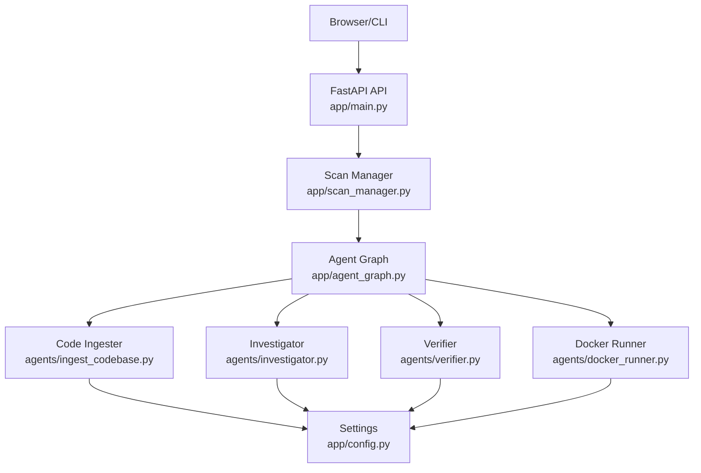
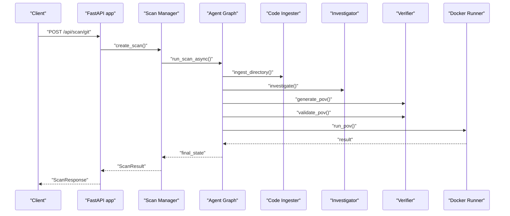
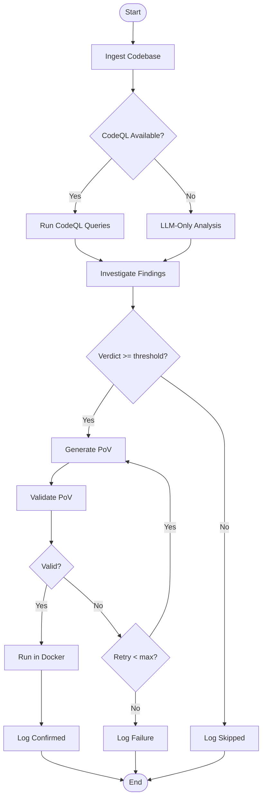
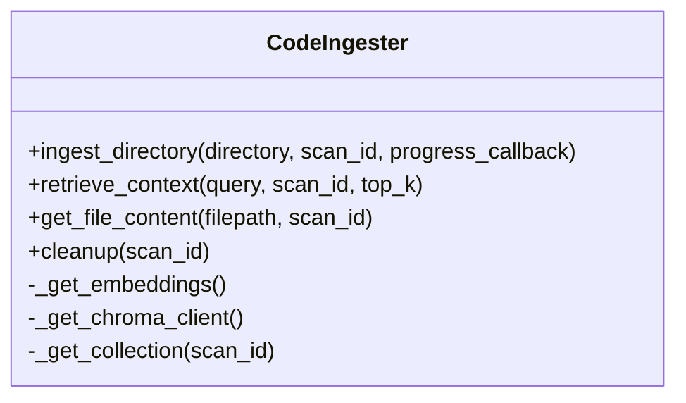
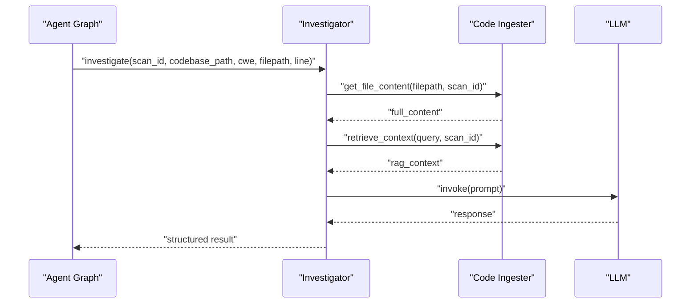
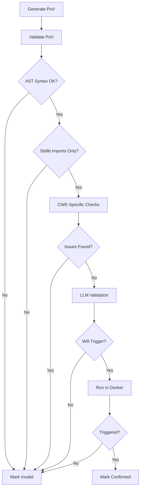
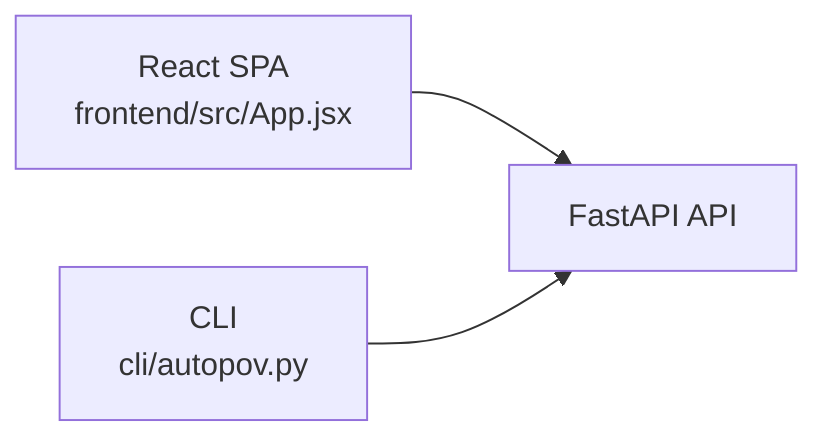
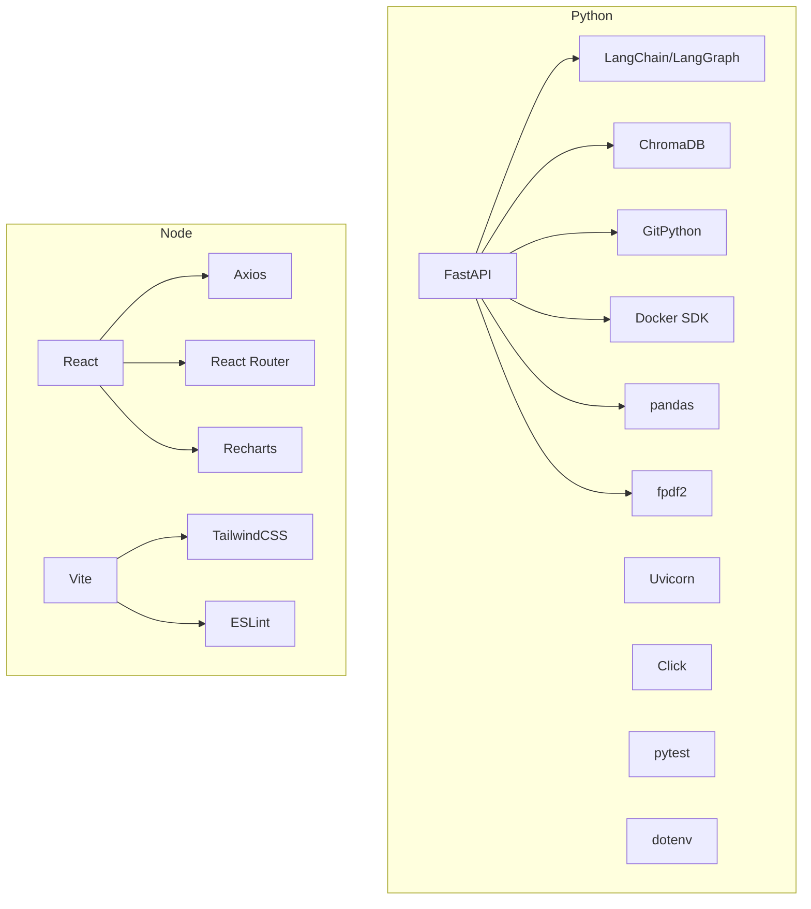

# Development Guide

<cite>
**Referenced Files in This Document**
- [README.md](file://autopov/README.md)
- [requirements.txt](file://autopov/requirements.txt)
- [run.sh](file://autopov/run.sh)
- [app/main.py](file://autopov/app/main.py)
- [app/config.py](file://autopov/app/config.py)
- [app/agent_graph.py](file://autopov/app/agent_graph.py)
- [app/scan_manager.py](file://autopov/app/scan_manager.py)
- [agents/__init__.py](file://autopov/agents/__init__.py)
- [agents/ingest_codebase.py](file://autopov/agents/ingest_codebase.py)
- [agents/investigator.py](file://autopov/agents/investigator.py)
- [agents/verifier.py](file://autopov/agents/verifier.py)
- [agents/docker_runner.py](file://autopov/agents/docker_runner.py)
- [frontend/package.json](file://autopov/frontend/package.json)
- [frontend/src/App.jsx](file://autopov/frontend/src/App.jsx)
- [cli/autopov.py](file://autopov/cli/autopov.py)
</cite>

## Table of Contents
1. [Introduction](#introduction)
2. [Project Structure](#project-structure)
3. [Core Components](#core-components)
4. [Architecture Overview](#architecture-overview)
5. [Detailed Component Analysis](#detailed-component-analysis)
6. [Dependency Analysis](#dependency-analysis)
7. [Performance Considerations](#performance-considerations)
8. [Troubleshooting Guide](#troubleshooting-guide)
9. [Contribution Guidelines](#contribution-guidelines)
10. [Debugging Techniques](#debugging-techniques)
11. [Extending AutoPoV](#extending-autopov)
12. [Release Procedures](#release-procedures)
13. [Community and Governance](#community-and-governance)
14. [Conclusion](#conclusion)

## Introduction
AutoPoV is a full-stack research prototype implementing a hybrid agentic framework for autonomous vulnerability detection and benchmarking. It integrates static analysis (CodeQL, Joern) with AI-powered reasoning (LLMs via LangGraph) to detect, verify, and benchmark vulnerabilities. The system provides a FastAPI backend, a React-based web UI, a CLI, and Docker-based PoV execution.

## Project Structure
The repository is organized into cohesive modules:
- Backend API: FastAPI application with endpoints for scanning, streaming logs, reports, and webhooks
- Agent graph: LangGraph workflow orchestrating ingestion, static analysis, LLM investigation, PoV generation, validation, and Docker execution
- Agents: Specialized components for code ingestion, vulnerability investigation, PoV verification, and Docker execution
- Frontend: React SPA with routing and UI components
- CLI: Command-line interface for automation and testing
- Supporting assets: CodeQL queries, test suite, and run script

```mermaid
graph TB
subgraph "Backend"
M["FastAPI app<br/>app/main.py"]
CFG["Settings<br/>app/config.py"]
AG["Agent Graph<br/>app/agent_graph.py"]
SM["Scan Manager<br/>app/scan_manager.py"]
end
subgraph "Agents"
IG["Code Ingester<br/>agents/ingest_codebase.py"]
IV["Investigator<br/>agents/investigator.py"]
VR["Verifier<br/>agents/verifier.py"]
DR["Docker Runner<br/>agents/docker_runner.py"]
end
subgraph "Frontend"
FE_PKG["package.json"]
FE_APP["App routes<br/>frontend/src/App.jsx"]
end
subgraph "CLI"
CLI["autopov CLI<br/>cli/autopov.py"]
end
M --> SM
SM --> AG
AG --> IG
AG --> IV
AG --> VR
AG --> DR
FE_PKG --> FE_APP
CLI --> M
```

**Diagram sources**
- [app/main.py](file://autopov/app/main.py#L102-L529)
- [app/config.py](file://autopov/app/config.py#L13-L210)
- [app/agent_graph.py](file://autopov/app/agent_graph.py#L78-L582)
- [app/scan_manager.py](file://autopov/app/scan_manager.py#L40-L344)
- [agents/ingest_codebase.py](file://autopov/agents/ingest_codebase.py#L41-L407)
- [agents/investigator.py](file://autopov/agents/investigator.py#L37-L413)
- [agents/verifier.py](file://autopov/agents/verifier.py#L40-L401)
- [agents/docker_runner.py](file://autopov/agents/docker_runner.py#L27-L379)
- [frontend/package.json](file://autopov/frontend/package.json#L1-L34)
- [frontend/src/App.jsx](file://autopov/frontend/src/App.jsx#L1-L29)
- [cli/autopov.py](file://autopov/cli/autopov.py#L1-L467)

**Section sources**
- [README.md](file://autopov/README.md#L17-L35)
- [requirements.txt](file://autopov/requirements.txt#L1-L42)
- [run.sh](file://autopov/run.sh#L1-L233)

## Core Components
- FastAPI application: Defines endpoints for scanning, streaming logs, reports, webhooks, and API key management. Implements CORS, authentication, and health checks.
- Configuration: Centralized settings via Pydantic settings supporting environment variables, model modes (online/offline), tool availability checks, and directory management.
- Agent graph: LangGraph workflow orchestrating ingestion, static analysis, investigation, PoV generation/validation, and Docker execution with state transitions and conditional edges.
- Scan manager: Manages scan lifecycle, state persistence, metrics, and background execution using a thread pool.
- Agents:
  - Code ingester: Recursively chunks code, generates embeddings, stores in ChromaDB, retrieves context, and cleans up collections.
  - Investigator: Uses RAG and LLM to analyze findings, optionally augments with Joern for use-after-free patterns.
  - Verifier: Generates and validates PoV scripts with syntax checks, standard library constraints, CWE-specific rules, and optional LLM validation.
  - Docker runner: Executes PoVs in isolated containers with resource limits, timeouts, and security restrictions.
- Frontend: React SPA with routing and UI components for scanning, progress, results, history, settings, and docs.
- CLI: Provides commands for scanning, retrieving results, generating reports, managing API keys, and viewing history.

**Section sources**
- [app/main.py](file://autopov/app/main.py#L28-L529)
- [app/config.py](file://autopov/app/config.py#L13-L210)
- [app/agent_graph.py](file://autopov/app/agent_graph.py#L78-L582)
- [app/scan_manager.py](file://autopov/app/scan_manager.py#L40-L344)
- [agents/ingest_codebase.py](file://autopov/agents/ingest_codebase.py#L41-L407)
- [agents/investigator.py](file://autopov/agents/investigator.py#L37-L413)
- [agents/verifier.py](file://autopov/agents/verifier.py#L40-L401)
- [agents/docker_runner.py](file://autopov/agents/docker_runner.py#L27-L379)
- [frontend/package.json](file://autopov/frontend/package.json#L1-L34)
- [frontend/src/App.jsx](file://autopov/frontend/src/App.jsx#L1-L29)
- [cli/autopov.py](file://autopov/cli/autopov.py#L1-L467)

## Architecture Overview
The system follows a modular, layered architecture:
- Presentation layer: FastAPI REST API and React SPA
- Orchestration layer: LangGraph agent graph and scan manager
- Processing layer: Agents for ingestion, investigation, verification, and Docker execution
- Data layer: ChromaDB for embeddings, CSV/JSON for scan history/results
- External integrations: CodeQL, Joern, LLM providers (OpenRouter/Ollama), Docker



**Diagram sources**
- [app/main.py](file://autopov/app/main.py#L102-L529)
- [app/agent_graph.py](file://autopov/app/agent_graph.py#L78-L582)
- [app/scan_manager.py](file://autopov/app/scan_manager.py#L40-L344)
- [app/config.py](file://autopov/app/config.py#L13-L210)
- [agents/ingest_codebase.py](file://autopov/agents/ingest_codebase.py#L41-L407)
- [agents/investigator.py](file://autopov/agents/investigator.py#L37-L413)
- [agents/verifier.py](file://autopov/agents/verifier.py#L40-L401)
- [agents/docker_runner.py](file://autopov/agents/docker_runner.py#L27-L379)

## Detailed Component Analysis

### Backend API and Endpoints
- Authentication: Bearer tokens verified via dependency; admin-only endpoints protected by admin key verification.
- Scanning: Supports Git repository, ZIP upload, and raw code paste with background task execution.
- Streaming: Server-Sent Events endpoint streams logs until completion.
- Reports: JSON/PDF report generation and download.
- Webhooks: GitHub and GitLab webhook handlers with signature verification and scan triggering.
- Metrics: System metrics endpoint for operational insights.



**Diagram sources**
- [app/main.py](file://autopov/app/main.py#L174-L314)
- [app/scan_manager.py](file://autopov/app/scan_manager.py#L86-L176)
- [app/agent_graph.py](file://autopov/app/agent_graph.py#L532-L572)
- [agents/ingest_codebase.py](file://autopov/agents/ingest_codebase.py#L201-L307)
- [agents/investigator.py](file://autopov/agents/investigator.py#L254-L365)
- [agents/verifier.py](file://autopov/agents/verifier.py#L79-L149)
- [agents/docker_runner.py](file://autopov/agents/docker_runner.py#L62-L191)

**Section sources**
- [app/main.py](file://autopov/app/main.py#L161-L529)

### Agent Graph Workflow
- States: Pending, ingesting, running CodeQL, investigating, generating PoV, validating PoV, running PoV, completed/failed/skipped.
- Nodes: Ingest code, run CodeQL, investigate, generate PoV, validate PoV, run in Docker, logging nodes.
- Edges: Deterministic progression with conditional branches based on LLM verdict and validation outcomes.
- Cost/time tracking: Per-finding inference time and estimated cost; cumulative totals.



**Diagram sources**
- [app/agent_graph.py](file://autopov/app/agent_graph.py#L84-L134)
- [app/agent_graph.py](file://autopov/app/agent_graph.py#L488-L515)

**Section sources**
- [app/agent_graph.py](file://autopov/app/agent_graph.py#L78-L582)

### Code Ingestion and Retrieval
- Text splitting: RecursiveCharacterTextSplitter with language-aware separators.
- Embeddings: OpenAI or HuggingFace embeddings depending on model mode.
- Storage: ChromaDB persistent collections per scan.
- Retrieval: Semantic similarity queries with metadata.
- Cleanup: Deletes per-scan collection on completion.



**Diagram sources**
- [agents/ingest_codebase.py](file://autopov/agents/ingest_codebase.py#L41-L407)

**Section sources**
- [agents/ingest_codebase.py](file://autopov/agents/ingest_codebase.py#L41-L407)

### Investigation Agent
- LLM selection: OpenAI ChatOpenAI or Ollama ChatOllama based on settings.
- Context: Full file retrieval or RAG context; optional Joern CPG analysis for use-after-free.
- Output: Structured JSON with verdict, confidence, explanation, and timing.



**Diagram sources**
- [agents/investigator.py](file://autopov/agents/investigator.py#L254-L365)
- [agents/ingest_codebase.py](file://autopov/agents/ingest_codebase.py#L354-L385)

**Section sources**
- [agents/investigator.py](file://autopov/agents/investigator.py#L37-L413)

### Verification and PoV Execution
- Generation: Prompt-driven script generation with cleaning of fenced code blocks.
- Validation: AST syntax check, standard library constraints, CWE-specific rules, optional LLM validation.
- Execution: Docker container with memory/CPU limits, no network, timeout, and trigger detection.



**Diagram sources**
- [agents/verifier.py](file://autopov/agents/verifier.py#L151-L227)
- [agents/docker_runner.py](file://autopov/agents/docker_runner.py#L62-L191)

**Section sources**
- [agents/verifier.py](file://autopov/agents/verifier.py#L40-L401)
- [agents/docker_runner.py](file://autopov/agents/docker_runner.py#L27-L379)

### Frontend and CLI
- Frontend: React SPA with routing and UI components; uses Axios for API calls.
- CLI: Rich terminal interface for scanning, results, history, and API key management.



**Diagram sources**
- [frontend/src/App.jsx](file://autopov/frontend/src/App.jsx#L1-L29)
- [frontend/package.json](file://autopov/frontend/package.json#L1-L34)
- [cli/autopov.py](file://autopov/cli/autopov.py#L1-L467)

**Section sources**
- [frontend/src/App.jsx](file://autopov/frontend/src/App.jsx#L1-L29)
- [frontend/package.json](file://autopov/frontend/package.json#L1-L34)
- [cli/autopov.py](file://autopov/cli/autopov.py#L1-L467)

## Dependency Analysis
- Python dependencies: FastAPI, Uvicorn, Pydantic, LangChain/LangGraph, ChromaDB, GitPython, Docker SDK, pandas, fpdf2, Click, pytest, dotenv.
- Node dependencies: React, React Router, Axios, Recharts, TailwindCSS, Vite, ESLint.
- Runtime dependencies: Docker, CodeQL CLI, optional Joern.



**Diagram sources**
- [requirements.txt](file://autopov/requirements.txt#L1-L42)
- [frontend/package.json](file://autopov/frontend/package.json#L1-L34)

**Section sources**
- [requirements.txt](file://autopov/requirements.txt#L1-L42)
- [frontend/package.json](file://autopov/frontend/package.json#L1-L34)

## Performance Considerations
- Asynchronous execution: Background tasks and thread pool executor for long-running scans.
- Resource limits: Docker memory/CPU limits and timeouts prevent runaway executions.
- Cost control: Configurable cost tracking and maximum cost limits; offline mode reduces costs.
- Batch operations: ChromaDB batching and thread pool utilization improve throughput.
- Tool availability checks: Graceful degradation when CodeQL/Joern/Docker are unavailable.

[No sources needed since this section provides general guidance]

## Troubleshooting Guide
- Environment setup: Ensure Python 3.11+, Node.js 20+, Docker Desktop, and optional CodeQL/Joern are installed.
- API keys: Set ADMIN_API_KEY and model provider keys; generate API keys via CLI or UI.
- Health checks: Use the health endpoint to verify Docker, CodeQL, and Joern availability.
- Logs: Stream logs via the SSE endpoint to monitor scan progress.
- Webhooks: Verify signatures and secrets; ensure webhook URLs and events are configured.
- Docker execution: Confirm Docker is running and images are available; review execution logs for failures.

**Section sources**
- [README.md](file://autopov/README.md#L39-L101)
- [app/main.py](file://autopov/app/main.py#L161-L171)
- [app/main.py](file://autopov/app/main.py#L347-L382)
- [app/config.py](file://autopov/app/config.py#L123-L171)

## Contribution Guidelines
- Issue reporting: Use repository issue templates; include environment details, steps to reproduce, and expected vs. actual behavior.
- Pull requests: Fork, branch, implement changes, update tests, and submit PR with clear description and rationale.
- Code review: Expect feedback on architecture alignment, error handling, performance, and adherence to existing patterns.
- Coding standards: Follow existing code style; maintain type hints, clear docstrings, and modular design.
- Testing: Add unit/integration tests; run pytest suite locally before submitting.

[No sources needed since this section provides general guidance]

## Debugging Techniques
- Backend API:
  - Use the health endpoint to confirm tool availability.
  - Stream logs via the SSE endpoint to observe real-time progress.
  - Test endpoints with curl or Postman; verify authentication headers.
- Frontend:
  - Inspect browser console/network tabs for API errors.
  - Verify API base URL and environment configuration.
- Agent workflow:
  - Enable LangSmith tracing via environment variables for detailed traces.
  - Review scan state logs and individual node outputs.
  - Validate CodeQL/Joern availability and paths.
- Docker execution:
  - Check Docker connectivity and image availability.
  - Inspect container logs for syntax errors or runtime exceptions.

**Section sources**
- [app/main.py](file://autopov/app/main.py#L161-L171)
- [app/main.py](file://autopov/app/main.py#L347-L382)
- [app/config.py](file://autopov/app/config.py#L68-L72)
- [agents/investigator.py](file://autopov/agents/investigator.py#L44-L48)
- [agents/docker_runner.py](file://autopov/agents/docker_runner.py#L50-L61)

## Extending AutoPoV
- Adding a new CWE:
  - Extend supported CWE list in settings.
  - Add a corresponding CodeQL query under codeql_queries/.
  - Update agent graph conditional logic to handle new CWE.
  - Add CWE-specific validation rules in the verifier.
- Integrating a new static analyzer:
  - Implement a new agent node in the agent graph.
  - Add tool availability checks and result parsing.
  - Integrate with the investigation phase to enrich context.
- Enhancing the LLM pipeline:
  - Modify prompts and agent logic to incorporate new capabilities.
  - Update cost estimation and tracing configurations.
- UI enhancements:
  - Add new pages/components in the frontend.
  - Connect to backend endpoints and manage state with React hooks.

**Section sources**
- [app/config.py](file://autopov/app/config.py#L94-L100)
- [app/agent_graph.py](file://autopov/app/agent_graph.py#L193-L278)
- [agents/verifier.py](file://autopov/agents/verifier.py#L265-L291)

## Release Procedures
- Version management: Update application version in settings and maintain changelog entries.
- Backward compatibility: Keep API endpoints stable; deprecate old endpoints with migration guidance.
- Packaging: Ensure requirements.txt and frontend dependencies are up-to-date.
- Testing: Run full test suite and manual smoke tests across environments.
- Documentation: Update README and inline docs reflecting changes.

[No sources needed since this section provides general guidance]

## Community and Governance
- License: MIT License applies to the project.
- Contributions: Welcome; see contribution guidelines for process and standards.
- Research focus: Academic benchmarking and AI security analysis.

**Section sources**
- [README.md](file://autopov/README.md#L220-L242)

## Conclusion
AutoPoV provides a robust foundation for autonomous vulnerability detection and benchmarking. By following the development and contribution guidelines, contributors can extend capabilities safely and efficiently while maintaining system reliability and performance.