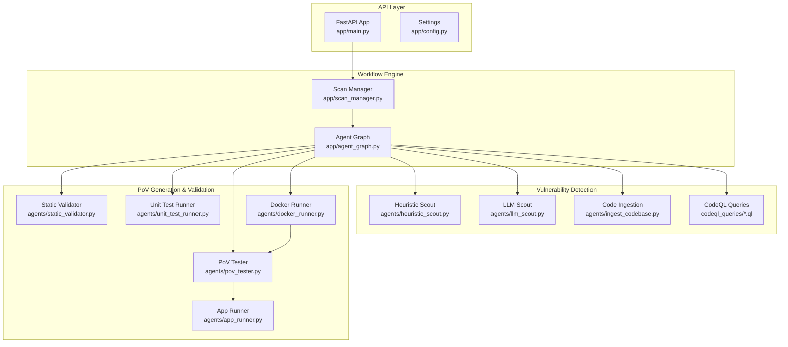
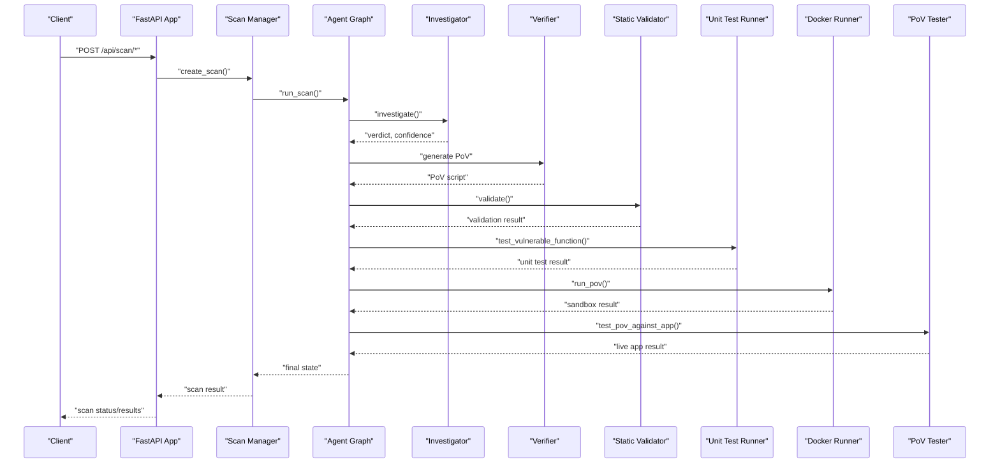
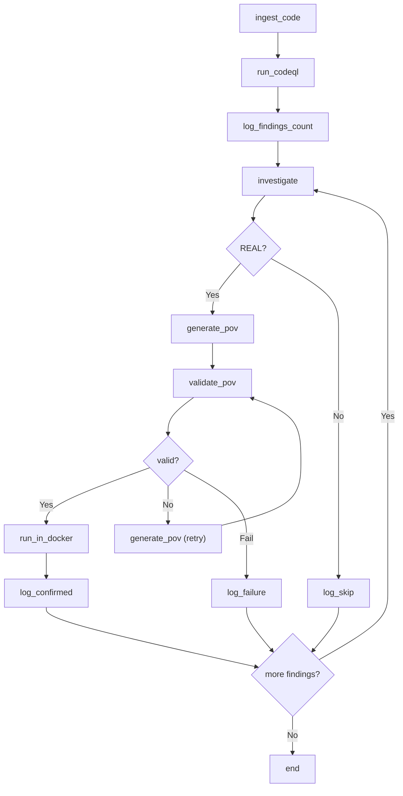
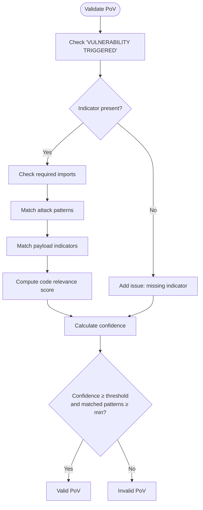
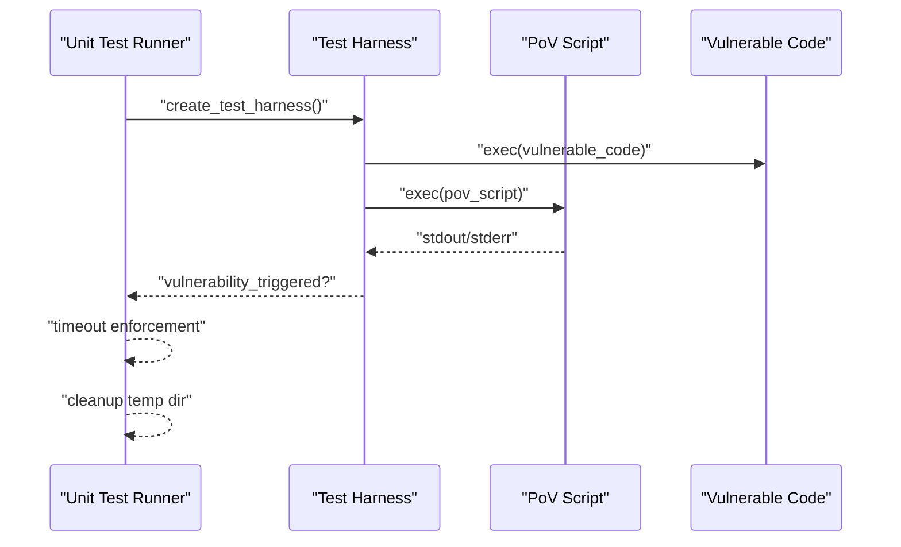
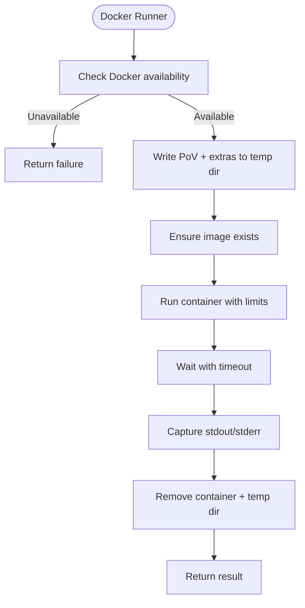
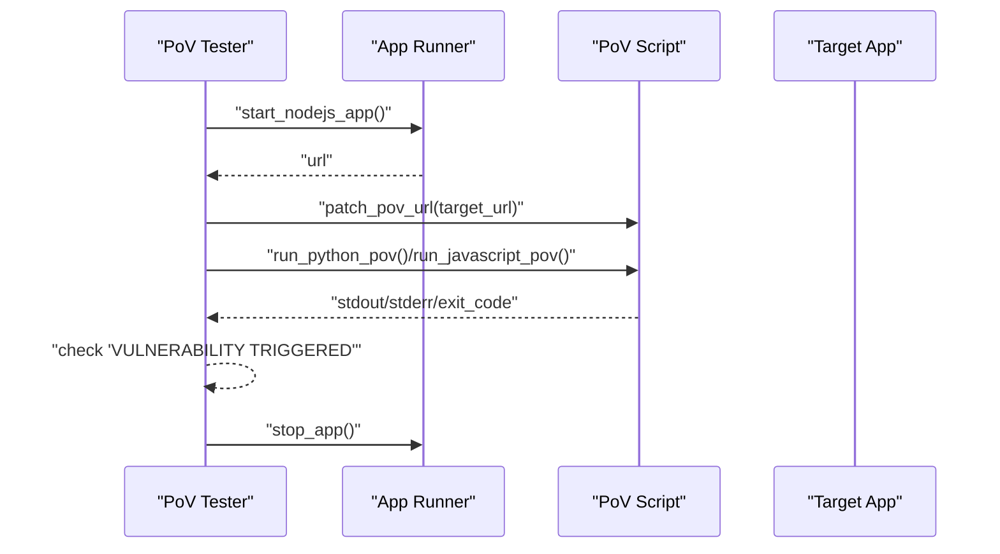
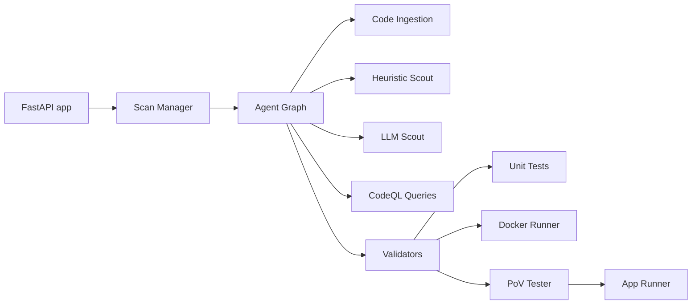

# Exploit Generation & Validation

<cite>
**Referenced Files in This Document**
- [app/main.py](file://app/main.py)
- [app/agent_graph.py](file://app/agent_graph.py)
- [app/scan_manager.py](file://app/scan_manager.py)
- [app/config.py](file://app/config.py)
- [app/report_generator.py](file://app/report_generator.py)
- [agents/app_runner.py](file://agents/app_runner.py)
- [agents/docker_runner.py](file://agents/docker_runner.py)
- [agents/heuristic_scout.py](file://agents/heuristic_scout.py)
- [agents/llm_scout.py](file://agents/llm_scout.py)
- [agents/static_validator.py](file://agents/static_validator.py)
- [agents/unit_test_runner.py](file://agents/unit_test_runner.py)
- [agents/pov_tester.py](file://agents/pov_tester.py)
- [agents/ingest_codebase.py](file://agents/ingest_codebase.py)
- [codeql_queries/SqlInjection.ql](file://codeql_queries/SqlInjection.ql)
- [codeql_queries/BufferOverflow.ql](file://codeql_queries/BufferOverflow.ql)
- [codeql_queries/IntegerOverflow.ql](file://codeql_queries/IntegerOverflow.ql)
- [codeql_queries/UseAfterFree.ql](file://codeql_queries/UseAfterFree.ql)
</cite>

## Table of Contents
1. [Introduction](#introduction)
2. [Project Structure](#project-structure)
3. [Core Components](#core-components)
4. [Architecture Overview](#architecture-overview)
5. [Detailed Component Analysis](#detailed-component-analysis)
6. [Dependency Analysis](#dependency-analysis)
7. [Performance Considerations](#performance-considerations)
8. [Troubleshooting Guide](#troubleshooting-guide)
9. [Conclusion](#conclusion)
10. [Appendices](#appendices)

## Introduction
This document explains AutoPoV’s autonomous exploit generation and validation system. It covers how confirmed vulnerabilities are transformed into working Proof-of-Vulnerability (PoV) scripts, how multi-stage validation ensures reliability, and how the exploit testing framework validates PoVs across static analysis, unit tests, and Docker sandbox environments. It also details the sandbox execution environment, validation criteria, reproducibility guarantees, and result interpretation guidelines.

## Project Structure
AutoPoV is organized around a FastAPI application that orchestrates a LangGraph-based agent workflow. The workflow ingests codebases, detects potential vulnerabilities using CodeQL and autonomous scouts, investigates findings with LLMs, generates PoV scripts, and validates them through static checks, unit tests, and Docker sandbox execution.

**Diagram sources**
- [app/main.py:114-122](file://app/main.py#L114-L122)
- [app/agent_graph.py:88-168](file://app/agent_graph.py#L88-L168)
- [agents/ingest_codebase.py:207-313](file://agents/ingest_codebase.py#L207-L313)
- [agents/heuristic_scout.py:188-234](file://agents/heuristic_scout.py#L188-L234)
- [agents/llm_scout.py:88-200](file://agents/llm_scout.py#L88-L200)
- [agents/static_validator.py:123-233](file://agents/static_validator.py#L123-L233)
- [agents/unit_test_runner.py:34-104](file://agents/unit_test_runner.py#L34-L104)
- [agents/docker_runner.py:62-166](file://agents/docker_runner.py#L62-L166)
- [agents/pov_tester.py:24-100](file://agents/pov_tester.py#L24-L100)
- [agents/app_runner.py:25-133](file://agents/app_runner.py#L25-L133)

**Section sources**
- [app/main.py:114-122](file://app/main.py#L114-L122)
- [app/agent_graph.py:88-168](file://app/agent_graph.py#L88-L168)
- [agents/ingest_codebase.py:207-313](file://agents/ingest_codebase.py#L207-L313)

## Core Components
- Agent Graph: Orchestrates the end-to-end workflow from code ingestion to PoV validation.
- Scan Manager: Manages scan lifecycle, state persistence, and metrics.
- Detection Agents: Heuristic and LLM scouts, plus CodeQL queries.
- Validation Pipeline: Static validator, unit test runner, and Docker runner.
- Exploit Testing: PoV Tester and App Runner for live application validation.

**Section sources**
- [app/agent_graph.py:82-168](file://app/agent_graph.py#L82-L168)
- [app/scan_manager.py:47-662](file://app/scan_manager.py#L47-L662)
- [agents/heuristic_scout.py:13-234](file://agents/heuristic_scout.py#L13-L234)
- [agents/llm_scout.py:32-200](file://agents/llm_scout.py#L32-L200)
- [agents/static_validator.py:22-233](file://agents/static_validator.py#L22-L233)
- [agents/unit_test_runner.py:28-104](file://agents/unit_test_runner.py#L28-L104)
- [agents/docker_runner.py:27-166](file://agents/docker_runner.py#L27-L166)
- [agents/pov_tester.py:21-100](file://agents/pov_tester.py#L21-L100)
- [agents/app_runner.py:19-133](file://agents/app_runner.py#L19-L133)

## Architecture Overview
The system follows a LangGraph-based agent workflow that:
- Ingests codebases into a vector store for semantic retrieval.
- Runs CodeQL queries or autonomous scouts to discover candidates.
- Investigates candidates with LLMs to classify as REAL or SKIP.
- Generates PoV scripts for REAL findings.
- Validates PoVs via static analysis, unit tests, and Docker sandbox execution.
- Reports outcomes and metrics.

**Diagram sources**
- [app/main.py:204-400](file://app/main.py#L204-L400)
- [app/agent_graph.py:691-777](file://app/agent_graph.py#L691-L777)
- [agents/static_validator.py:123-233](file://agents/static_validator.py#L123-L233)
- [agents/unit_test_runner.py:34-104](file://agents/unit_test_runner.py#L34-L104)
- [agents/docker_runner.py:62-166](file://agents/docker_runner.py#L62-L166)
- [agents/pov_tester.py:24-100](file://agents/pov_tester.py#L24-L100)

## Detailed Component Analysis

### Agent Graph Orchestration
The Agent Graph defines nodes for ingestion, CodeQL, investigation, PoV generation, validation, and execution, with conditional edges to handle retries and failures. It selects models via policy routing and tracks logs and metrics.

**Diagram sources**
- [app/agent_graph.py:88-168](file://app/agent_graph.py#L88-L168)
- [app/agent_graph.py:691-777](file://app/agent_graph.py#L691-L777)

**Section sources**
- [app/agent_graph.py:82-168](file://app/agent_graph.py#L82-L168)
- [app/agent_graph.py:691-777](file://app/agent_graph.py#L691-L777)

### Static Analysis Validation
The Static Validator enforces structural and content requirements for PoV scripts, checking for vulnerability indicators, required imports, attack patterns, payload indicators, and relevance to the vulnerable code. It computes a confidence score and determines validity thresholds.

**Diagram sources**
- [agents/static_validator.py:123-233](file://agents/static_validator.py#L123-L233)

**Section sources**
- [agents/static_validator.py:22-233](file://agents/static_validator.py#L22-L233)

### Unit Test Harness Execution
The Unit Test Runner isolates vulnerable code and executes PoVs against it using a test harness that captures stdout/stderr and determines whether the vulnerability was triggered. It enforces timeouts and cleans up temporary files.

**Diagram sources**
- [agents/unit_test_runner.py:145-234](file://agents/unit_test_runner.py#L145-L234)
- [agents/unit_test_runner.py:236-286](file://agents/unit_test_runner.py#L236-L286)

**Section sources**
- [agents/unit_test_runner.py:28-104](file://agents/unit_test_runner.py#L28-L104)
- [agents/unit_test_runner.py:145-286](file://agents/unit_test_runner.py#L145-L286)

### Docker Sandbox Execution
The Docker Runner executes PoVs in isolated containers with strict resource limits and no network access. It supports stdin piping for binary payloads and batch execution with progress callbacks.

**Diagram sources**
- [agents/docker_runner.py:30-166](file://agents/docker_runner.py#L30-L166)

**Section sources**
- [agents/docker_runner.py:27-166](file://agents/docker_runner.py#L27-L166)

### PoV Tester and Live Application Validation
The PoV Tester executes PoVs against live applications, patching target URLs and capturing execution results. It supports both standalone scripts and full app lifecycle testing.

**Diagram sources**
- [agents/pov_tester.py:24-100](file://agents/pov_tester.py#L24-L100)
- [agents/app_runner.py:25-133](file://agents/app_runner.py#L25-L133)

**Section sources**
- [agents/pov_tester.py:21-100](file://agents/pov_tester.py#L21-L100)
- [agents/app_runner.py:19-133](file://agents/app_runner.py#L19-L133)

### Exploit Testing Framework Examples
- SQL Injection (CWE-89): PoV scripts target SQL endpoints and inject payloads designed to trigger unauthorized data access or administrative bypass.
- XSS (CWE-79): PoV scripts inject malicious scripts into rendered pages to demonstrate reflected or stored XSS.
- Code Injection (CWE-94): PoV scripts leverage dynamic evaluation or command execution to trigger arbitrary code execution.
- Path Traversal (CWE-22): PoV scripts attempt to access restricted files outside the intended directory.
- Command Injection (CWE-78): PoV scripts inject shell commands to execute unintended system operations.
- Deserialization (CWE-502): PoV scripts craft malicious serialized objects to exploit unsafe deserialization routines.
- Hardcoded Credentials (CWE-798): PoV scripts demonstrate credential exposure by triggering authentication flows that reveal secrets.

Note: Example scripts are generated per finding and validated through the multi-stage pipeline described above.

**Section sources**
- [agents/static_validator.py:25-118](file://agents/static_validator.py#L25-L118)

## Dependency Analysis
AutoPoV integrates several technologies:
- FastAPI for REST APIs and streaming logs.
- LangGraph for agent orchestration and state transitions.
- CodeQL for structured static analysis with custom query packs.
- Heuristic and LLM scouts for broader coverage.
- ChromaDB for vector store-backed retrieval.
- Docker for sandboxed execution.

**Diagram sources**
- [app/main.py:114-122](file://app/main.py#L114-L122)
- [app/agent_graph.py:88-168](file://app/agent_graph.py#L88-L168)
- [agents/ingest_codebase.py:207-313](file://agents/ingest_codebase.py#L207-L313)
- [agents/heuristic_scout.py:188-234](file://agents/heuristic_scout.py#L188-L234)
- [agents/llm_scout.py:88-200](file://agents/llm_scout.py#L88-L200)
- [agents/docker_runner.py:30-166](file://agents/docker_runner.py#L30-L166)
- [agents/pov_tester.py:24-100](file://agents/pov_tester.py#L24-L100)
- [agents/app_runner.py:25-133](file://agents/app_runner.py#L25-L133)

**Section sources**
- [app/config.py:162-211](file://app/config.py#L162-L211)
- [app/agent_graph.py:241-307](file://app/agent_graph.py#L241-L307)

## Performance Considerations
- Cost control: Configurable maximum costs and token usage tracking to limit LLM expenses.
- Parallelism: ThreadPoolExecutor for scan execution and batching for vector store ingestion.
- Resource limits: Docker memory and CPU quotas, timeouts for subprocess execution.
- Scalability: Vector store ingestion in batches and configurable chunk sizes.

[No sources needed since this section provides general guidance]

## Troubleshooting Guide
Common issues and resolutions:
- Docker not available: The system checks availability and falls back to non-Docker validations when disabled or unreachable.
- CodeQL not available: The workflow switches to heuristic and LLM-only analysis.
- Timeout during PoV execution: Timeouts are handled gracefully with failure reporting.
- Missing API keys or model credentials: Configuration validation prevents runtime errors.

**Section sources**
- [app/config.py:162-211](file://app/config.py#L162-L211)
- [agents/docker_runner.py:50-61](file://agents/docker_runner.py#L50-L61)
- [agents/unit_test_runner.py:266-273](file://agents/unit_test_runner.py#L266-L273)
- [agents/pov_tester.py:167-180](file://agents/pov_tester.py#L167-L180)

## Conclusion
AutoPoV automates the journey from confirmed vulnerability to working PoV, validating each PoV through static analysis, unit tests, and Docker sandbox execution. The LangGraph-based agent orchestrates detection, investigation, PoV generation, and multi-stage validation, ensuring reliability, reproducibility, and clear result interpretation.

[No sources needed since this section summarizes without analyzing specific files]

## Appendices

### Validation Criteria and Success Metrics
- Validation criteria:
  - Presence of a vulnerability trigger indicator in PoV output.
  - Required imports and attack patterns aligned with the CWE.
  - Code relevance score above a threshold.
  - Confidence score meeting minimum thresholds.
- Success metrics:
  - Detection rate: confirmed / total findings.
  - False positive rate: false positives / total findings.
  - PoV success rate: triggered PoVs / confirmed.
  - Cost per confirmed vulnerability.

**Section sources**
- [agents/static_validator.py:123-233](file://agents/static_validator.py#L123-L233)
- [app/report_generator.py:735-766](file://app/report_generator.py#L735-L766)

### Reproducibility and Result Interpretation
- Reproducibility:
  - Snapshots of codebases enable replay scans.
  - Stable model selection via policy router.
  - Persistent logs and results for audit trails.
- Result interpretation:
  - REAL findings are eligible for PoV generation.
  - PoV validation results indicate whether the vulnerability was triggered.
  - Reports summarize metrics, methodologies, and detailed findings.

**Section sources**
- [app/scan_manager.py:403-418](file://app/scan_manager.py#L403-L418)
- [app/report_generator.py:612-657](file://app/report_generator.py#L612-L657)