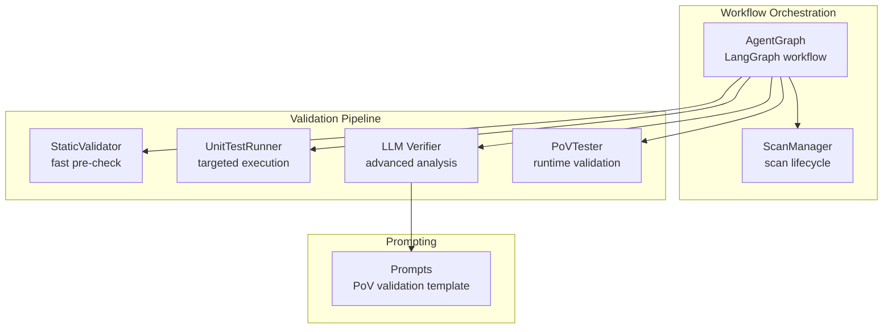
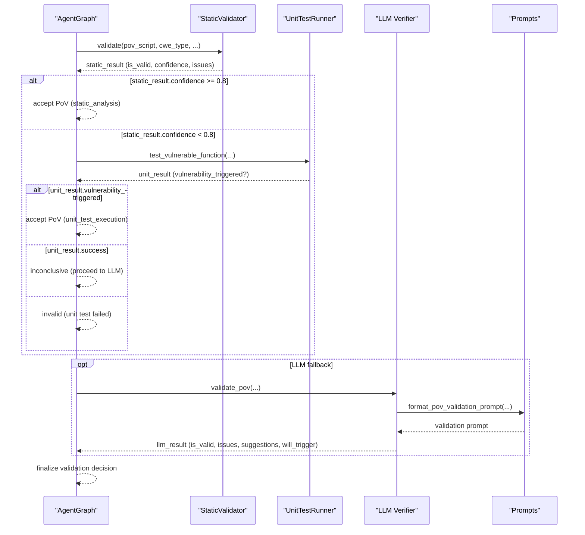
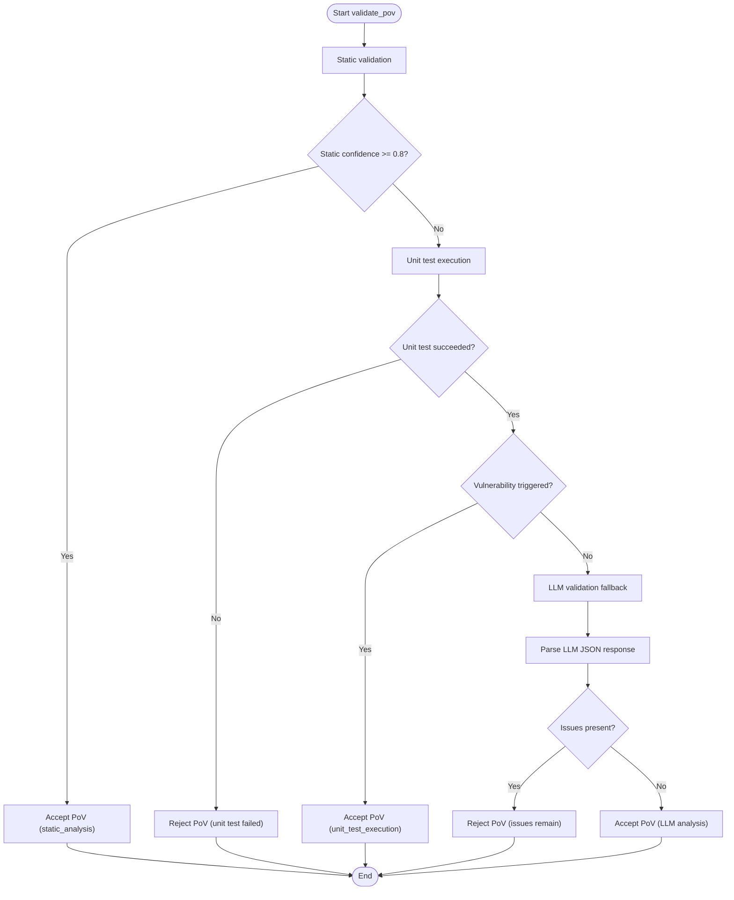
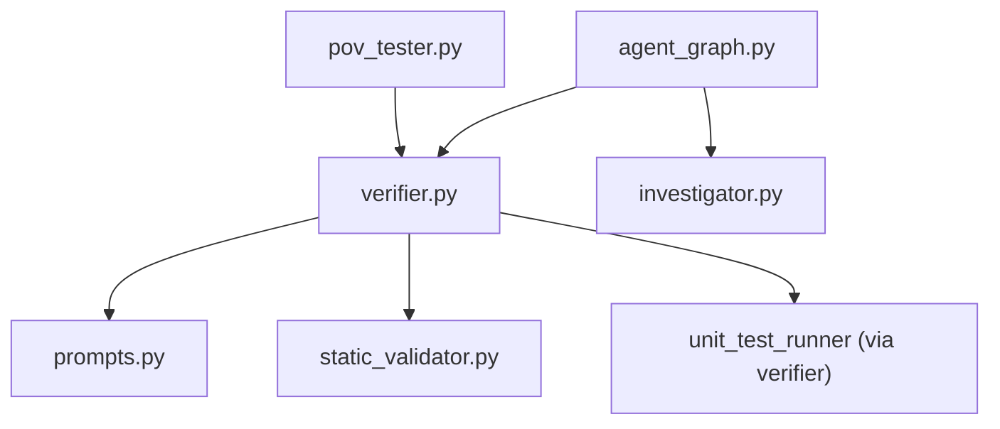

# LLM-Based Validation Fallback

<cite>
**Referenced Files in This Document**
- [prompts.py](file://prompts.py)
- [verifier.py](file://agents/verifier.py)
- [static_validator.py](file://agents/static_validator.py)
- [pov_tester.py](file://agents/pov_tester.py)
- [investigator.py](file://agents/investigator.py)
- [agent_graph.py](file://app/agent_graph.py)
- [scan_manager.py](file://app/scan_manager.py)
- [config.py](file://app/config.py)
</cite>

## Table of Contents
1. [Introduction](#introduction)
2. [Project Structure](#project-structure)
3. [Core Components](#core-components)
4. [Architecture Overview](#architecture-overview)
5. [Detailed Component Analysis](#detailed-component-analysis)
6. [Dependency Analysis](#dependency-analysis)
7. [Performance Considerations](#performance-considerations)
8. [Troubleshooting Guide](#troubleshooting-guide)
9. [Conclusion](#conclusion)

## Introduction
This document explains AutoPoV’s LLM-based validation fallback system that provides advanced analysis when automated validation methods are inconclusive. It covers the prompt engineering used for PoV validation, the analysis criteria applied, and how results are interpreted and integrated into the overall validation decision. It also documents the conditions under which LLM validation is triggered, the types of questions posed to the LLM, confidence scoring, issue identification, and suggestions for improving PoV scripts. Finally, it includes practical scenarios, common challenges, and how LLM feedback enhances PoV script quality.

## Project Structure
AutoPoV orchestrates vulnerability detection and PoV validation through a LangGraph-based workflow. The LLM-based validation fallback is part of the verification pipeline and interacts with:
- Prompt templates for PoV validation
- Static validator for fast pre-checks
- Unit test runner for targeted execution
- LLM verifier for advanced analysis
- PoV tester for runtime validation

**Diagram sources**
- [agent_graph.py:82-168](file://app/agent_graph.py#L82-L168)
- [scan_manager.py:117-233](file://app/scan_manager.py#L117-L233)
- [static_validator.py:22-305](file://agents/static_validator.py#L22-L305)
- [verifier.py:42-562](file://agents/verifier.py#L42-L562)
- [pov_tester.py:21-296](file://agents/pov_tester.py#L21-L296)
- [prompts.py:93-121](file://prompts.py#L93-L121)

**Section sources**
- [agent_graph.py:82-168](file://app/agent_graph.py#L82-L168)
- [scan_manager.py:117-233](file://app/scan_manager.py#L117-L233)

## Core Components
- Prompt templates define the validation tasks and expected outputs for PoV scripts.
- StaticValidator performs fast, deterministic checks to quickly filter valid PoVs.
- UnitTestRunner executes PoVs against vulnerable functions when available.
- LLM Verifier applies advanced reasoning to resolve ambiguous cases.
- PoVTester runs PoVs in controlled environments to confirm exploitability.
- Investigator and AgentGraph coordinate the broader scan and validation orchestration.

**Section sources**
- [prompts.py:93-121](file://prompts.py#L93-L121)
- [static_validator.py:22-305](file://agents/static_validator.py#L22-L305)
- [verifier.py:225-387](file://agents/verifier.py#L225-L387)
- [pov_tester.py:21-296](file://agents/pov_tester.py#L21-L296)
- [investigator.py:270-432](file://agents/investigator.py#L270-L432)
- [agent_graph.py:691-777](file://app/agent_graph.py#L691-L777)

## Architecture Overview
The LLM-based validation fallback is invoked when earlier stages cannot definitively confirm or reject a PoV. The flow ensures cost-consciousness and determinism by prioritizing static and unit test validations first, falling back to LLM analysis only when necessary.

**Diagram sources**
- [verifier.py:225-387](file://agents/verifier.py#L225-L387)
- [prompts.py:93-121](file://prompts.py#L93-L121)

## Detailed Component Analysis

### LLM Validation Prompt Engineering
The PoV validation prompt instructs the LLM to evaluate PoV scripts against a strict checklist and respond in a structured JSON format. The prompt enforces:
- Deterministic output markers
- Standard library-only usage
- Correct logic alignment with the CWE type
- Error handling and clarity

Key prompt elements:
- Validation criteria: standard library usage, presence of a specific “VULNERABILITY TRIGGERED” marker, logical correctness for the CWE, error handling, and determinism.
- Output format: JSON with fields for validity, issues, suggestions, and a likelihood indicator (“YES”, “MAYBE”, “NO”).

These constraints ensure the LLM’s evaluation is actionable and comparable across runs.

**Section sources**
- [prompts.py:93-121](file://prompts.py#L93-L121)

### Validation Logic That Triggers LLM Analysis
The LLM validation fallback is invoked when:
- Static validation yields low confidence (< 0.8)
- Unit testing is inconclusive (ran without triggering)
- Unit testing fails (critical syntax or runtime errors)

The verifier aggregates outcomes from static and unit tests, then conditionally calls the LLM validator to resolve ambiguity.

**Diagram sources**
- [verifier.py:225-387](file://agents/verifier.py#L225-L387)

**Section sources**
- [verifier.py:225-387](file://agents/verifier.py#L225-L387)

### Types of Questions Asked to the LLM
The LLM is prompted to:
- Verify PoV script adherence to the validation criteria
- Identify specific issues (e.g., missing required markers, non-stdlib imports, CWE mismatch)
- Assess whether the PoV will likely trigger the vulnerability
- Provide actionable suggestions for improvement

The prompt explicitly enumerates the validation criteria and the JSON schema to guide the LLM’s response.

**Section sources**
- [prompts.py:93-121](file://prompts.py#L93-L121)

### Confidence Scoring and Issue Identification
Confidence scoring is derived from:
- Static validation: a composite score based on matched patterns, presence of required indicators, code relevance, and issue counts
- CWE-specific checks: pattern-based heuristics aligned with the target CWE
- LLM validation: qualitative assessment with a “will_trigger” indicator

Issue identification focuses on:
- Structural issues (missing required markers, syntax errors)
- Logical issues (non-standard libraries, mismatched CWE logic)
- Clarity and determinism concerns

**Section sources**
- [static_validator.py:261-284](file://agents/static_validator.py#L261-L284)
- [verifier.py:425-451](file://agents/verifier.py#L425-L451)

### Suggestions Generation for Improving PoV Scripts
The LLM validator returns suggestions tailored to:
- CWE-specific improvements
- Script structure and determinism
- Compliance with validation criteria

These suggestions are aggregated with static and unit test feedback to guide PoV refinement.

**Section sources**
- [prompts.py:93-121](file://prompts.py#L93-L121)
- [verifier.py:453-491](file://agents/verifier.py#L453-L491)

### Integration Into Overall Validation Decision
The final decision integrates:
- Static validation outcome and confidence
- Unit test execution results
- LLM validation outcome and suggestions
- Deterministic acceptance thresholds

This layered approach minimizes false positives while enabling nuanced resolution of ambiguous cases.

**Section sources**
- [verifier.py:249-387](file://agents/verifier.py#L249-L387)

### Examples of LLM Validation Scenarios
- Scenario A: PoV lacks a required marker but otherwise meets criteria → LLM identifies the missing marker and suggests adding it; PoV remains invalid until fixed.
- Scenario B: PoV uses non-stdlib imports → LLM flags the violation; static validator adds the same issue; PoV rejected.
- Scenario C: PoV is syntactically sound and structurally correct but CWE logic is off → LLM suggests adjusting payload or invocation; PoV accepted after revision.

These scenarios illustrate how the LLM complements static and unit tests to improve accuracy.

**Section sources**
- [verifier.py:367-387](file://agents/verifier.py#L367-L387)
- [prompts.py:93-121](file://prompts.py#L93-L121)

### Common Validation Challenges and Resolutions
- Challenge: Ambiguous unit test outcomes (no trigger, but no failure) → LLM evaluates logic and provides a “MAYBE” assessment; human review recommended.
- Challenge: Non-stdlib imports in PoV → Static and LLM both flag; PoV must be rewritten to use standard library only.
- Challenge: Missing “VULNERABILITY TRIGGERED” marker → Static flags; LLM confirms necessity; PoV must include the marker.

Resolutions emphasize iterative refinement guided by static checks, unit tests, and LLM feedback.

**Section sources**
- [verifier.py:286-326](file://agents/verifier.py#L286-L326)
- [static_validator.py:144-233](file://agents/static_validator.py#L144-L233)

### How LLM Feedback Improves PoV Script Quality
- Precision: LLM identifies subtle logic flaws missed by static analysis.
- Completeness: LLM flags missing structural requirements (e.g., required markers).
- Guidance: LLM provides concrete suggestions for fixing CWE mismatches and improving determinism.
- Consistency: Standardized JSON responses enable automated decision-making and reproducible validation.

**Section sources**
- [prompts.py:93-121](file://prompts.py#L93-L121)
- [verifier.py:453-491](file://agents/verifier.py#L453-L491)

## Dependency Analysis
The LLM validation fallback depends on:
- Prompt templates for consistent instruction framing
- StaticValidator for fast filtering
- UnitTestRunner for targeted execution
- LLM Verifier for advanced reasoning
- PoVTester for runtime confirmation
- Investigator and AgentGraph for orchestration

**Diagram sources**
- [verifier.py:225-387](file://agents/verifier.py#L225-L387)
- [prompts.py:93-121](file://prompts.py#L93-L121)
- [pov_tester.py:21-296](file://agents/pov_tester.py#L21-L296)
- [investigator.py:270-432](file://agents/investigator.py#L270-L432)
- [agent_graph.py:691-777](file://app/agent_graph.py#L691-L777)

**Section sources**
- [verifier.py:225-387](file://agents/verifier.py#L225-L387)
- [prompts.py:93-121](file://prompts.py#L93-L121)
- [pov_tester.py:21-296](file://agents/pov_tester.py#L21-L296)
- [investigator.py:270-432](file://agents/investigator.py#L270-L432)
- [agent_graph.py:691-777](file://app/agent_graph.py#L691-L777)

## Performance Considerations
- Cost control: LLM calls are reserved for ambiguous cases; static and unit tests preempt expensive LLM evaluations.
- Token usage extraction: The system captures token usage to compute costs and enforce budget limits.
- Determinism: LLM prompts emphasize deterministic behavior to reduce retries and rework.
- Scalability: The layered validation reduces reliance on LLMs, improving throughput for large codebases.

**Section sources**
- [verifier.py:147-189](file://agents/verifier.py#L147-L189)
- [config.py:99-101](file://app/config.py#L99-L101)

## Troubleshooting Guide
Common issues and resolutions:
- LLM response not parseable as JSON → Fallback behavior returns conservative defaults; ensure prompts are followed precisely.
- Missing API keys or model configuration → Investigator and Verifier raise explicit errors; configure environment variables.
- Unit test failures → Review unit test logs and adjust PoV accordingly; LLM can then validate improved scripts.
- Static validation rejects PoV → Address flagged issues (missing markers, non-stdlib imports) before LLM validation.

Operational tips:
- Enable tracing for debugging LLM interactions.
- Monitor token usage and costs to optimize prompt length.
- Use replay scans to iterate on PoVs efficiently.

**Section sources**
- [verifier.py:453-491](file://agents/verifier.py#L453-L491)
- [investigator.py:416-432](file://agents/investigator.py#L416-L432)
- [config.py:156-161](file://app/config.py#L156-L161)

## Conclusion
AutoPoV’s LLM-based validation fallback augments deterministic checks with advanced reasoning to resolve ambiguous PoV cases. By combining static validation, unit testing, and LLM analysis, the system achieves higher accuracy, actionable feedback, and cost-conscious operation. The structured prompts, clear validation criteria, and integrated decision logic ensure reliable and reproducible PoV validation across diverse CWEs and codebases.