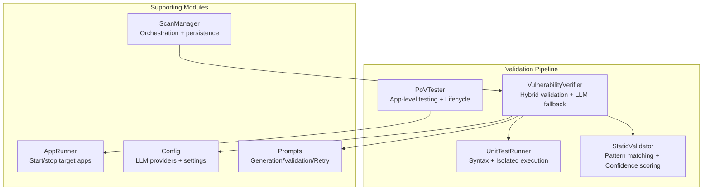
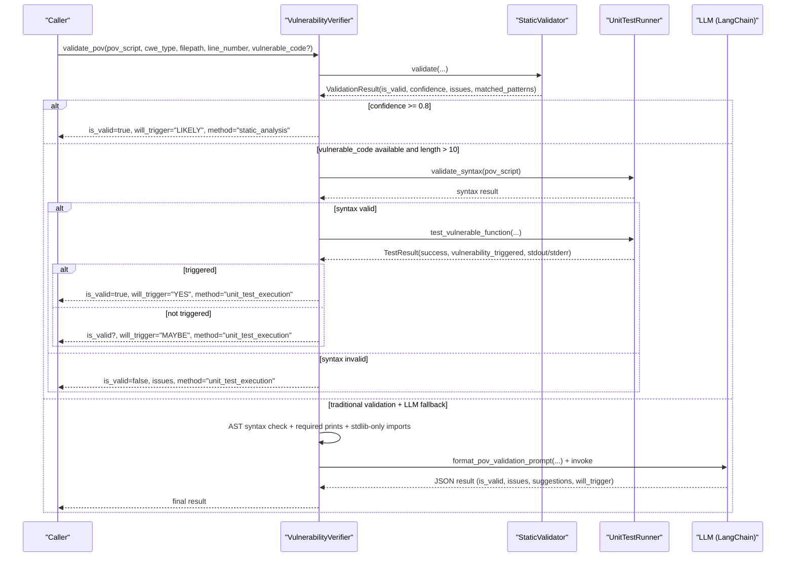
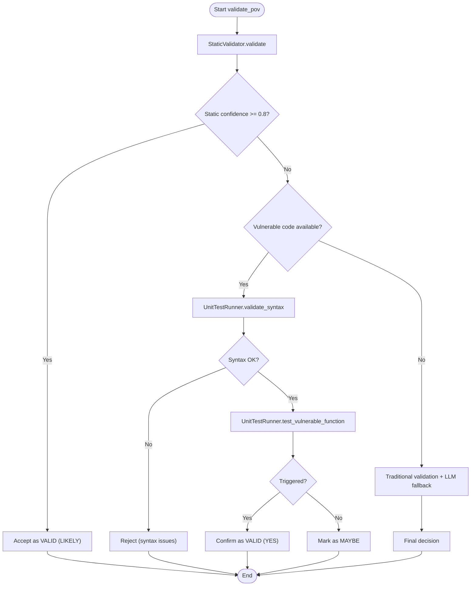
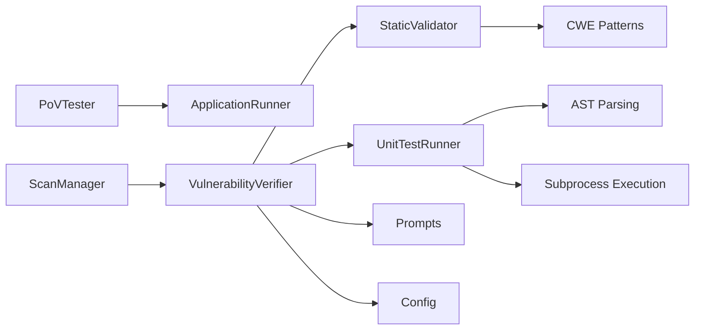

# Multi-Stage Validation Pipeline

<cite>
**Referenced Files in This Document**
- [static_validator.py](file://agents/static_validator.py)
- [unit_test_runner.py](file://agents/unit_test_runner.py)
- [verifier.py](file://agents/verifier.py)
- [pov_tester.py](file://agents/pov_tester.py)
- [app_runner.py](file://agents/app_runner.py)
- [prompts.py](file://prompts.py)
- [config.py](file://app/config.py)
- [scan_manager.py](file://app/scan_manager.py)
</cite>

## Table of Contents
1. [Introduction](#introduction)
2. [Project Structure](#project-structure)
3. [Core Components](#core-components)
4. [Architecture Overview](#architecture-overview)
5. [Detailed Component Analysis](#detailed-component-analysis)
6. [Dependency Analysis](#dependency-analysis)
7. [Performance Considerations](#performance-considerations)
8. [Troubleshooting Guide](#troubleshooting-guide)
9. [Conclusion](#conclusion)

## Introduction
This document describes AutoPoV’s comprehensive multi-stage validation pipeline designed to ensure PoV (Proof-of-Vulnerability) script reliability and effectiveness. The pipeline follows a three-tier approach:
- Static analysis validation for immediate feedback
- Unit test execution for functional verification
- LLM-based validation as a fallback

It documents validation criteria, confidence thresholds, issue detection mechanisms, and result interpretation guidelines, along with examples of outcomes, common failure scenarios, and remediation strategies. It also explains the adaptive validation logic that selects appropriate validation methods based on vulnerability characteristics and available context.

## Project Structure
The validation pipeline spans several modules:
- Static validator: Pattern matching and confidence scoring
- Unit test runner: Syntax validation and isolated execution
- PoV tester: Application-level testing with lifecycle management
- Verifier: Orchestrates the hybrid validation workflow and integrates LLMs
- Prompts: LLM prompts for PoV generation, validation, and retry analysis
- Configuration: LLM provider selection and runtime settings
- Scan manager: Orchestration of scans and persistence of results

**Diagram sources**
- [static_validator.py:22-305](file://agents/static_validator.py#L22-L305)
- [unit_test_runner.py:28-344](file://agents/unit_test_runner.py#L28-L344)
- [pov_tester.py:21-296](file://agents/pov_tester.py#L21-L296)
- [verifier.py:42-562](file://agents/verifier.py#L42-L562)
- [prompts.py:46-121](file://prompts.py#L46-L121)
- [config.py:13-255](file://app/config.py#L13-L255)
- [app_runner.py:19-200](file://agents/app_runner.py#L19-L200)
- [scan_manager.py:47-663](file://app/scan_manager.py#L47-L663)

**Section sources**
- [static_validator.py:1-305](file://agents/static_validator.py#L1-L305)
- [unit_test_runner.py:1-344](file://agents/unit_test_runner.py#L1-L344)
- [verifier.py:1-562](file://agents/verifier.py#L1-L562)
- [pov_tester.py:1-296](file://agents/pov_tester.py#L1-L296)
- [prompts.py:1-424](file://prompts.py#L1-L424)
- [config.py:1-255](file://app/config.py#L1-L255)
- [app_runner.py:1-200](file://agents/app_runner.py#L1-L200)
- [scan_manager.py:1-663](file://app/scan_manager.py#L1-L663)

## Core Components
- StaticValidator: Performs pattern-based checks against CWE-specific attack patterns, verifies presence of “VULNERABILITY TRIGGERED” indicator, and computes a confidence score based on matched patterns, issues, and code relevance.
- UnitTestRunner: Validates PoV syntax using AST parsing and executes PoVs in isolated environments against vulnerable code snippets. Captures execution results and determines if the vulnerability was triggered.
- PoVTester: Executes PoVs against running applications, patches target URLs, and manages application lifecycle for end-to-end testing.
- VulnerabilityVerifier: Orchestrates the hybrid validation workflow, applies confidence thresholds, and falls back to LLM-based analysis when needed. Integrates prompts for PoV validation and retry analysis.
- Prompts: Provides structured prompts for PoV generation, validation, and retry analysis to guide LLM evaluation.
- Config: Selects LLM provider (online or offline) and exposes model configuration for validation.
- ScanManager: Coordinates scan orchestration, state management, and persistence of results.

**Section sources**
- [static_validator.py:22-305](file://agents/static_validator.py#L22-L305)
- [unit_test_runner.py:28-344](file://agents/unit_test_runner.py#L28-L344)
- [pov_tester.py:21-296](file://agents/pov_tester.py#L21-L296)
- [verifier.py:42-562](file://agents/verifier.py#L42-L562)
- [prompts.py:46-121](file://prompts.py#L46-L121)
- [config.py:13-255](file://app/config.py#L13-L255)
- [scan_manager.py:47-663](file://app/scan_manager.py#L47-L663)

## Architecture Overview
The validation pipeline adapts dynamically to available context:
- Static analysis is always executed first for speed and early signal.
- If static confidence is high, validation stops there.
- Otherwise, if vulnerable code is available, unit tests are executed to confirm trigger behavior.
- If unit testing is inconclusive or unavailable, traditional validation and LLM fallback are applied.

**Diagram sources**
- [verifier.py:225-387](file://agents/verifier.py#L225-L387)
- [static_validator.py:123-233](file://agents/static_validator.py#L123-L233)
- [unit_test_runner.py:34-116](file://agents/unit_test_runner.py#L34-L116)
- [prompts.py:93-121](file://prompts.py#L93-L121)

**Section sources**
- [verifier.py:225-387](file://agents/verifier.py#L225-L387)

## Detailed Component Analysis

### Static Validator
Responsibilities:
- Pattern matching against CWE-specific attack vectors
- Presence checks for required imports and payload indicators
- Detection of “VULNERABILITY TRIGGERED” indicator
- Code relevance scoring to assess alignment with vulnerable code
- Confidence calculation combining matched patterns, issues, and relevance
- Quick validation helper returning a boolean threshold

Key behaviors:
- For each CWE, defines required imports, attack patterns, and payload indicators.
- Computes a base confidence and adjusts it based on matched patterns, presence of vulnerability trigger, code relevance, and issues.
- Returns a structured result with validity flag, confidence, matched patterns, issues, and details.

Confidence scoring:
- Base score starts at a neutral level and increases with matched patterns, presence of vulnerability trigger, and code relevance.
- Decreases with each issue detected.
- Normalized to [0.0, 1.0].

Validation criteria:
- Presence of “VULNERABILITY TRIGGERED”
- Minimum number of matched patterns
- Minimum confidence threshold for acceptance

Common issues:
- Missing vulnerability trigger indicator
- Low code relevance
- Insufficient matched patterns
- Unknown CWE type defaults to conservative confidence

Remediation:
- Add “VULNERABILITY TRIGGERED” print statements
- Include relevant imports and attack patterns for the CWE
- Align PoV logic with the vulnerable code structure

**Section sources**
- [static_validator.py:22-305](file://agents/static_validator.py#L22-L305)

### Unit Test Runner
Responsibilities:
- Syntax validation using AST parsing
- Extraction and isolation of vulnerable functions
- Execution of PoVs in a controlled environment
- Determination of whether vulnerability was triggered
- Mock input testing without real vulnerable code

Execution flow:
- Extracts the vulnerable function from the provided code snippet.
- Creates a test harness embedding the vulnerable code and executing the PoV.
- Runs the harness in a subprocess with restricted environment and timeouts.
- Interprets output to decide if the vulnerability was triggered.

Validation criteria:
- Syntax must be valid
- Vulnerability trigger must be detected in stdout
- Execution must succeed and complete within timeout

Failure modes:
- Extraction failures
- Syntax errors
- Execution timeouts
- Non-zero exit codes without trigger

Remediation:
- Fix syntax errors
- Ensure PoV prints the required trigger message
- Reduce complexity or adjust inputs to meet timeouts

**Section sources**
- [unit_test_runner.py:28-344](file://agents/unit_test_runner.py#L28-L344)

### PoV Tester and Application Lifecycle
Responsibilities:
- Patch PoV scripts to use the correct target URL
- Execute PoVs against running applications
- Manage application lifecycle (start/stop) for end-to-end testing
- Capture execution results and determine trigger status

Execution flow:
- Writes PoV to a temporary directory
- Patches target URL placeholders and localhost patterns
- Executes PoV using Python or Node.js depending on language
- Cleans up resources afterward

Validation criteria:
- Successful process execution
- Vulnerability trigger detected in output
- Application reachable within startup timeout

Failure modes:
- Application startup failures
- URL patching mismatches
- Execution timeouts
- Process errors

Remediation:
- Verify target URL availability
- Confirm application readiness
- Adjust PoV URL handling

**Section sources**
- [pov_tester.py:21-296](file://agents/pov_tester.py#L21-L296)
- [app_runner.py:19-200](file://agents/app_runner.py#L19-L200)

### Vulnerability Verifier (Hybrid Validation Orchestrator)
Responsibilities:
- Orchestrates the three-tier validation pipeline
- Applies confidence thresholds and adaptive logic
- Falls back to LLM-based validation when needed
- Integrates prompts for PoV validation and retry analysis

Validation stages:
1) Static analysis (always run)
- Uses StaticValidator to compute validity and confidence
- If confidence >= 0.8, accept immediately

2) Unit test execution (if vulnerable code available)
- Validates syntax using AST
- Executes PoV against isolated vulnerable code
- Records success and trigger status

3) Traditional validation + LLM fallback (when inconclusive)
- AST syntax check
- Enforces presence of “VULNERABILITY TRIGGERED”
- Restricts imports to standard library
- CWE-specific checks
- LLM-based validation using structured prompts

Confidence thresholds:
- Static pass threshold: ≥ 0.8
- Static pass with high confidence: mark as “LIKELY”
- Unit test pass: mark as “YES”
- Unit test inconclusive: mark as “MAYBE”
- Final determination considers issues and unit test outcome

Validation criteria:
- Syntax correctness
- Presence of required trigger print
- Standard library-only imports
- CWE-specific logic alignment
- LLM evaluation for ambiguous cases

Outcome interpretation:
- is_valid: overall validity
- will_trigger: “YES”, “MAYBE”, or “NO”
- validation_method: which stage determined the result
- suggestions: actionable improvements
- issues: detected problems

**Section sources**
- [verifier.py:225-387](file://agents/verifier.py#L225-L387)
- [prompts.py:93-121](file://prompts.py#L93-L121)

### Adaptive Validation Logic
The verifier selects the next stage based on:
- Static confidence: if ≥ 0.8, stop early
- Availability of vulnerable code: if present and sufficient, run unit tests
- Unit test outcome: if triggered, accept; if failed, escalate to traditional validation
- LLM fallback: invoked when other methods are inconclusive

**Diagram sources**
- [verifier.py:225-387](file://agents/verifier.py#L225-L387)

**Section sources**
- [verifier.py:225-387](file://agents/verifier.py#L225-L387)

## Dependency Analysis
- StaticValidator depends on pattern definitions for CWEs and regex matching.
- UnitTestRunner depends on AST parsing and subprocess execution.
- PoVTester depends on ApplicationRunner for lifecycle management.
- VulnerabilityVerifier depends on StaticValidator, UnitTestRunner, Prompts, and Config.
- Prompts define the LLM evaluation interface for validation and retry analysis.
- Config supplies LLM provider selection and runtime settings.
- ScanManager coordinates orchestration and persists results.

**Diagram sources**
- [static_validator.py:22-118](file://agents/static_validator.py#L22-L118)
- [unit_test_runner.py:28-116](file://agents/unit_test_runner.py#L28-L116)
- [pov_tester.py:21-106](file://agents/pov_tester.py#L21-L106)
- [verifier.py:42-90](file://agents/verifier.py#L42-L90)
- [prompts.py:46-121](file://prompts.py#L46-L121)
- [config.py:13-255](file://app/config.py#L13-L255)
- [scan_manager.py:47-114](file://app/scan_manager.py#L47-L114)

**Section sources**
- [static_validator.py:1-305](file://agents/static_validator.py#L1-L305)
- [unit_test_runner.py:1-344](file://agents/unit_test_runner.py#L1-L344)
- [pov_tester.py:1-296](file://agents/pov_tester.py#L1-L296)
- [verifier.py:1-562](file://agents/verifier.py#L1-L562)
- [prompts.py:1-424](file://prompts.py#L1-L424)
- [config.py:1-255](file://app/config.py#L1-L255)
- [scan_manager.py:1-663](file://app/scan_manager.py#L1-L663)

## Performance Considerations
- Static analysis is extremely fast and should be run first to filter out invalid PoVs quickly.
- Unit tests provide strong evidence but are slower; they should only run when vulnerable code is available.
- LLM fallback is resource-intensive; reserve it for ambiguous cases to minimize cost and latency.
- Subprocess execution and application lifecycle introduce overhead; ensure timeouts and environment restrictions are enforced.
- Token usage and cost tracking are integrated to manage LLM expenses.

[No sources needed since this section provides general guidance]

## Troubleshooting Guide
Common failure scenarios and remediation strategies:
- Missing “VULNERABILITY TRIGGERED”: Ensure PoV prints the required message upon successful trigger.
- Syntax errors: Fix AST-parseable syntax; avoid dynamic constructs that break static analysis.
- No vulnerable code available: Provide the vulnerable code snippet to enable unit testing.
- Extraction failures: Ensure the vulnerable code contains a callable function or is a valid code block.
- Execution timeouts: Simplify PoV logic, reduce input complexity, or increase timeouts cautiously.
- Non-standard imports: Remove external dependencies; restrict to standard library only.
- URL mismatch in application testing: Verify target URL patching and application readiness.
- LLM validation inconclusive: Improve PoV clarity, add explanatory comments, and align with CWE patterns.

Validation outcomes examples:
- Static pass with high confidence: “VALID (LIKELY)” with method “static_analysis”
- Unit test triggered: “VALID (YES)” with method “unit_test_execution”
- Unit test ran but no trigger: “VALID (MAYBE)” with method “unit_test_execution”
- Traditional validation with issues: “INVALID” with identified issues
- LLM fallback: “VALID (MAYBE/NO)” with suggestions and issues

**Section sources**
- [verifier.py:225-387](file://agents/verifier.py#L225-L387)
- [unit_test_runner.py:34-116](file://agents/unit_test_runner.py#L34-L116)
- [pov_tester.py:24-106](file://agents/pov_tester.py#L24-L106)

## Conclusion
AutoPoV’s multi-stage validation pipeline balances speed, reliability, and coverage. Static analysis provides instant feedback, unit tests offer functional assurance, and LLM-based validation serves as a robust fallback. The adaptive logic ensures efficient resource usage while maintaining high confidence in PoV quality. By following the outlined criteria, thresholds, and remediation strategies, teams can produce reliable PoVs that effectively demonstrate vulnerability triggers.