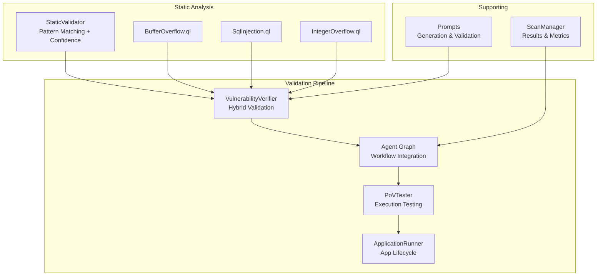
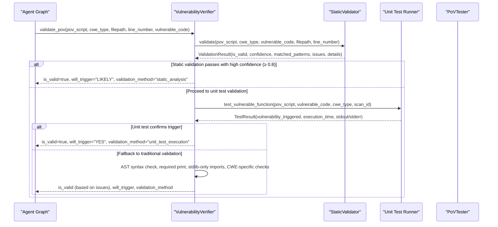
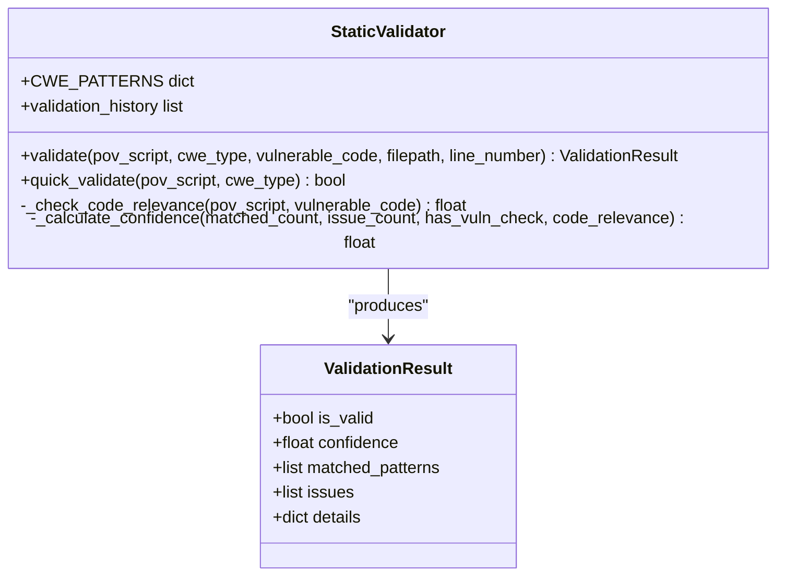
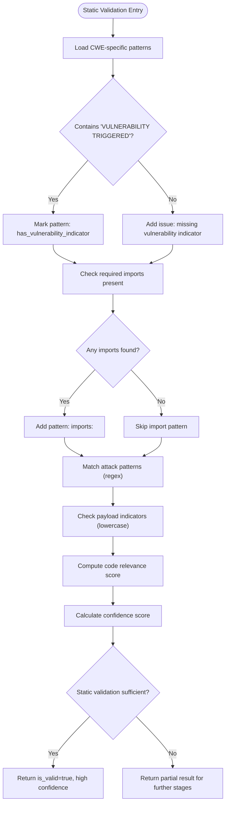
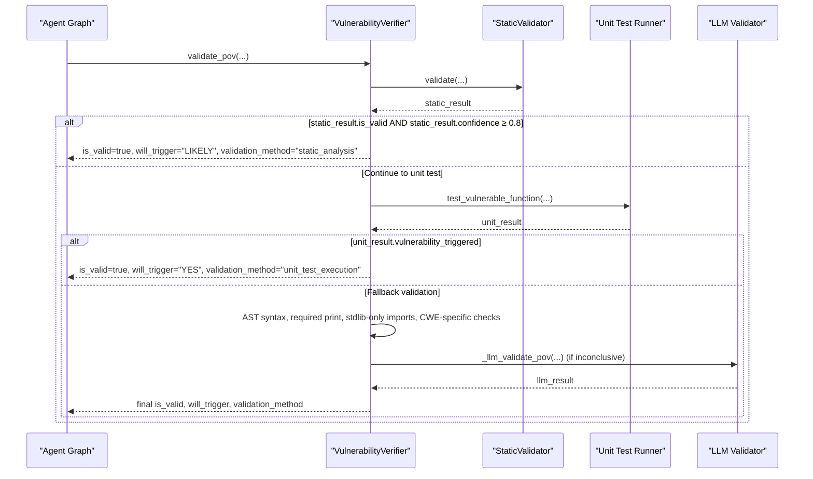
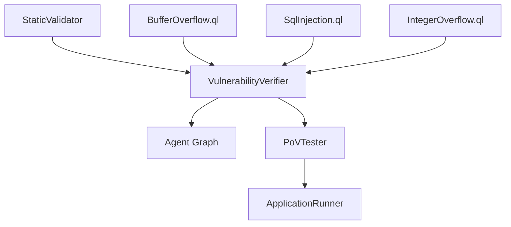

# Static Analysis Validation

<cite>
**Referenced Files in This Document**
- [static_validator.py](file://agents/static_validator.py)
- [verifier.py](file://agents/verifier.py)
- [agent_graph.py](file://app/agent_graph.py)
- [pov_tester.py](file://agents/pov_tester.py)
- [app_runner.py](file://agents/app_runner.py)
- [BufferOverflow.ql](file://codeql_queries/BufferOverflow.ql)
- [SqlInjection.ql](file://codeql_queries/SqlInjection.ql)
- [IntegerOverflow.ql](file://codeql_queries/IntegerOverflow.ql)
- [prompts.py](file://prompts.py)
- [scan_manager.py](file://app/scan_manager.py)
- [test_patterns.py](file://test_patterns.py)
</cite>

## Table of Contents
1. [Introduction](#introduction)
2. [Project Structure](#project-structure)
3. [Core Components](#core-components)
4. [Architecture Overview](#architecture-overview)
5. [Detailed Component Analysis](#detailed-component-analysis)
6. [Dependency Analysis](#dependency-analysis)
7. [Performance Considerations](#performance-considerations)
8. [Troubleshooting Guide](#troubleshooting-guide)
9. [Conclusion](#conclusion)

## Introduction
This document explains AutoPoV's static analysis validation system that provides immediate feedback on Proof-of-Vulnerability (PoV) script quality and effectiveness. The system performs pattern matching against predefined vulnerability categories, computes confidence scores, and integrates with the broader validation pipeline to determine PoV validity. It covers detection algorithms for buffer overflow, SQL injection, and integer overflow triggers, along with thresholds and decision logic that allow static validation to independently confirm PoV effectiveness in many cases.

## Project Structure
The static validation system spans several modules:
- StaticValidator: Implements pattern matching and confidence scoring
- Verifier: Orchestrates hybrid validation (static → unit test → traditional)
- Agent Graph: Integrates validation into the end-to-end scanning workflow
- CodeQL Queries: Provide complementary static analysis for core CWE families
- Supporting modules: PoV testing, application lifecycle, prompts, and scan management

**Diagram sources**
- [static_validator.py:12-305](file://agents/static_validator.py#L12-L305)
- [verifier.py:225-387](file://agents/verifier.py#L225-L387)
- [agent_graph.py:842-899](file://app/agent_graph.py#L842-L899)
- [pov_tester.py:21-296](file://agents/pov_tester.py#L21-L296)
- [app_runner.py:19-200](file://agents/app_runner.py#L19-L200)
- [BufferOverflow.ql:1-59](file://codeql_queries/BufferOverflow.ql#L1-L59)
- [SqlInjection.ql:1-67](file://codeql_queries/SqlInjection.ql#L1-L67)
- [IntegerOverflow.ql:1-62](file://codeql_queries/IntegerOverflow.ql#L1-L62)
- [prompts.py:46-121](file://prompts.py#L46-L121)
- [scan_manager.py:47-663](file://app/scan_manager.py#L47-L663)

**Section sources**
- [static_validator.py:12-305](file://agents/static_validator.py#L12-L305)
- [verifier.py:225-387](file://agents/verifier.py#L225-L387)
- [agent_graph.py:842-899](file://app/agent_graph.py#L842-L899)
- [pov_tester.py:21-296](file://agents/pov_tester.py#L21-L296)
- [app_runner.py:19-200](file://agents/app_runner.py#L19-L200)
- [BufferOverflow.ql:1-59](file://codeql_queries/BufferOverflow.ql#L1-L59)
- [SqlInjection.ql:1-67](file://codeql_queries/SqlInjection.ql#L1-L67)
- [IntegerOverflow.ql:1-62](file://codeql_queries/IntegerOverflow.ql#L1-L62)
- [prompts.py:46-121](file://prompts.py#L46-L121)
- [scan_manager.py:47-663](file://app/scan_manager.py#L47-L663)

## Core Components
- StaticValidator: Performs pattern-based matching for CWE families, checks for required imports, detects attack patterns, identifies payload indicators, evaluates code relevance, and calculates a confidence score. It also supports a quick validation mode.
- VulnerabilityVerifier: Implements a three-stage validation pipeline: static analysis (always), unit test execution (when code is available), and traditional/fallback validation (AST syntax, required print statement, standard library constraints, CWE-specific checks).
- Agent Graph: Integrates validation into the scan workflow, using static validation results to confidently accept PoVs when confidence exceeds a high threshold.
- CodeQL Queries: Provide complementary static analysis for buffer overflow, SQL injection, and integer overflow, aligning with the static validator's pattern-matching approach.

Key validation criteria per CWE family:
- SQL Injection (CWE-89): Pattern matching for injection constructs and payload indicators; CWE-specific checks ensure SQL keywords presence.
- XSS (CWE-79): Pattern matching for script tags, event handlers, and alert triggers; payload indicators include "xss", "script", "html".
- Code Injection (CWE-94): Pattern matching for eval/exec/import invocation; payload indicators include "code", "exec", "eval".
- Path Traversal (CWE-22): Pattern matching for directory traversal sequences; payload indicators include "path", "traversal".
- Command Injection (CWE-78): Pattern matching for shell command injection; payload indicators include "command", "shell".
- Deserialization (CWE-502): Pattern matching for pickle/yaml/json deserialization; payload indicators include "serialize", "deserialize".
- Hardcoded Credentials (CWE-798): Pattern matching for credential-like patterns; payload indicators include "credential", "password".

Confidence scoring mechanism:
- Base score starts at 0.3
- Adds points for matched patterns (up to 0.4)
- Adds 0.2 if "VULNERABILITY TRIGGERED" indicator is present
- Adds points proportional to code relevance (up to 0.2)
- Subtracts points for issues identified
- Normalized to [0.0, 1.0]

**Section sources**
- [static_validator.py:22-305](file://agents/static_validator.py#L22-L305)
- [verifier.py:225-387](file://agents/verifier.py#L225-L387)
- [BufferOverflow.ql:16-59](file://codeql_queries/BufferOverflow.ql#L16-L59)
- [SqlInjection.ql:17-67](file://codeql_queries/SqlInjection.ql#L17-L67)
- [IntegerOverflow.ql:18-62](file://codeql_queries/IntegerOverflow.ql#L18-L62)

## Architecture Overview
The static validation system is invoked during PoV validation and can independently determine PoV effectiveness in many cases. The hybrid validation pipeline ensures robustness by combining static analysis, unit test execution, and fallback checks.

**Diagram sources**
- [agent_graph.py:842-899](file://app/agent_graph.py#L842-L899)
- [verifier.py:225-387](file://agents/verifier.py#L225-L387)
- [static_validator.py:123-234](file://agents/static_validator.py#L123-L234)

**Section sources**
- [agent_graph.py:842-899](file://app/agent_graph.py#L842-L899)
- [verifier.py:225-387](file://agents/verifier.py#L225-L387)
- [static_validator.py:123-234](file://agents/static_validator.py#L123-L234)

## Detailed Component Analysis

### StaticValidator: Pattern Matching and Confidence Scoring
The StaticValidator encapsulates:
- CWE-specific pattern sets for required imports, attack patterns, and payload indicators
- Detection of the "VULNERABILITY TRIGGERED" indicator
- Required imports check
- Attack pattern matching using regular expressions
- Payload indicator matching (case-insensitive)
- Code relevance evaluation based on shared keywords between PoV and vulnerable code
- Confidence calculation with weighted contributions

**Diagram sources**
- [static_validator.py:22-305](file://agents/static_validator.py#L22-L305)

**Section sources**
- [static_validator.py:22-305](file://agents/static_validator.py#L22-L305)

### CWE-Specific Pattern Matching
The system defines pattern sets for major CWE families. These patterns guide static validation decisions and confidence scoring.

**Diagram sources**
- [static_validator.py:123-234](file://agents/static_validator.py#L123-L234)

**Section sources**
- [static_validator.py:25-118](file://agents/static_validator.py#L25-L118)
- [static_validator.py:123-234](file://agents/static_validator.py#L123-L234)

### Validation Pipeline Integration
The hybrid validation pipeline integrates static analysis early and often allows it to determine validity independently when confidence is sufficiently high.

**Diagram sources**
- [verifier.py:225-387](file://agents/verifier.py#L225-L387)
- [agent_graph.py:745-758](file://app/agent_graph.py#L745-L758)

**Section sources**
- [verifier.py:225-387](file://agents/verifier.py#L225-L387)
- [agent_graph.py:745-758](file://app/agent_graph.py#L745-L758)

### CodeQL Complementary Analysis
CodeQL queries complement static validation by detecting core vulnerability families:
- Buffer Overflow: Identifies user input sources, buffer write sinks, and missing bounds checks
- SQL Injection: Identifies user input sources, SQL execution sinks, and lack of parameterization
- Integer Overflow: Identifies arithmetic operations and index calculations that may overflow

These queries inform the static validator's pattern selection and validation criteria.

**Section sources**
- [BufferOverflow.ql:16-59](file://codeql_queries/BufferOverflow.ql#L16-L59)
- [SqlInjection.ql:17-67](file://codeql_queries/SqlInjection.ql#L17-L67)
- [IntegerOverflow.ql:18-62](file://codeql_queries/IntegerOverflow.ql#L18-L62)

### Example: Successful Static Validation
A PoV script that:
- Contains "VULNERABILITY TRIGGERED"
- Includes required imports for the CWE family
- Matches multiple attack patterns and payload indicators
- Demonstrates high code relevance to the vulnerable code
- Achieves confidence ≥ 0.8

Outcome: Static validation alone determines PoV validity with high confidence.

**Section sources**
- [static_validator.py:218-233](file://agents/static_validator.py#L218-L233)
- [agent_graph.py:745-758](file://app/agent_graph.py#L745-L758)

### Example: Failed Static Validation
A PoV script that:
- Lacks "VULNERABILITY TRIGGERED"
- Uses non-standard library imports
- Misses CWE-specific attack patterns
- Has low code relevance

Outcome: Issues are recorded, and the system proceeds to unit test or fallback validation.

**Section sources**
- [verifier.py:328-362](file://agents/verifier.py#L328-L362)
- [static_validator.py:171-207](file://agents/static_validator.py#L171-L207)

## Dependency Analysis
The static validation system depends on:
- StaticValidator for pattern matching and confidence computation
- VulnerabilityVerifier for orchestrating the hybrid validation pipeline
- Agent Graph for integrating validation outcomes into the scan workflow
- CodeQL queries for complementary static analysis signals
- PoVTester and ApplicationRunner for execution-based validation when needed

**Diagram sources**
- [static_validator.py:22-305](file://agents/static_validator.py#L22-L305)
- [verifier.py:225-387](file://agents/verifier.py#L225-L387)
- [agent_graph.py:842-899](file://app/agent_graph.py#L842-L899)
- [pov_tester.py:21-296](file://agents/pov_tester.py#L21-L296)
- [app_runner.py:19-200](file://agents/app_runner.py#L19-L200)
- [BufferOverflow.ql:1-59](file://codeql_queries/BufferOverflow.ql#L1-L59)
- [SqlInjection.ql:1-67](file://codeql_queries/SqlInjection.ql#L1-L67)
- [IntegerOverflow.ql:1-62](file://codeql_queries/IntegerOverflow.ql#L1-L62)

**Section sources**
- [static_validator.py:22-305](file://agents/static_validator.py#L22-L305)
- [verifier.py:225-387](file://agents/verifier.py#L225-L387)
- [agent_graph.py:842-899](file://app/agent_graph.py#L842-L899)
- [pov_tester.py:21-296](file://agents/pov_tester.py#L21-L296)
- [app_runner.py:19-200](file://agents/app_runner.py#L19-L200)
- [BufferOverflow.ql:1-59](file://codeql_queries/BufferOverflow.ql#L1-L59)
- [SqlInjection.ql:1-67](file://codeql_queries/SqlInjection.ql#L1-L67)
- [IntegerOverflow.ql:1-62](file://codeql_queries/IntegerOverflow.ql#L1-L62)

## Performance Considerations
- Static analysis is computationally inexpensive compared to execution-based validation, enabling rapid feedback loops.
- Regex-based pattern matching scales linearly with PoV script length; keep patterns focused and avoid overly broad matches.
- Confidence scoring uses simple arithmetic and bounded additions/subtractions, ensuring constant-time computation.
- Early termination occurs when static validation confidence exceeds 0.8, avoiding unnecessary unit test or execution steps.

[No sources needed since this section provides general guidance]

## Troubleshooting Guide
Common issues and resolutions:
- Missing "VULNERABILITY TRIGGERED": Ensure the PoV prints this exact phrase to signal successful trigger.
- Non-standard library imports: Use only Python standard library modules to satisfy traditional validation.
- Low confidence despite apparent correctness: Add more specific attack patterns or payload indicators relevant to the CWE family.
- Misaligned CWE type: Verify cwe_type matches the intended vulnerability category to enable appropriate pattern matching.
- Code relevance low: Improve PoV to reference the same keywords/functions as the vulnerable code.

**Section sources**
- [verifier.py:328-362](file://agents/verifier.py#L328-L362)
- [static_validator.py:167-172](file://agents/static_validator.py#L167-L172)
- [static_validator.py:197-207](file://agents/static_validator.py#L197-L207)

## Conclusion
AutoPoV's static analysis validation system provides fast, reliable feedback on PoV quality by combining targeted pattern matching, confidence scoring, and integration with the broader validation pipeline. By leveraging CWE-specific patterns, code relevance analysis, and early acceptance when confidence is high, the system accelerates PoV validation while maintaining robustness through subsequent unit test and fallback checks.