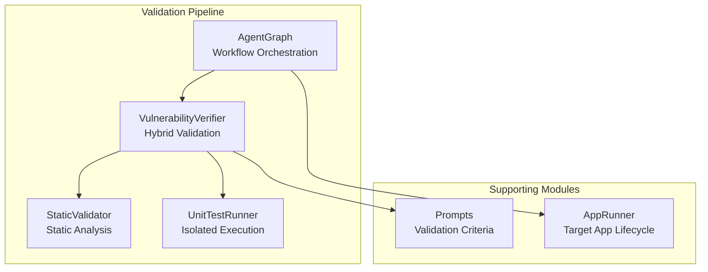
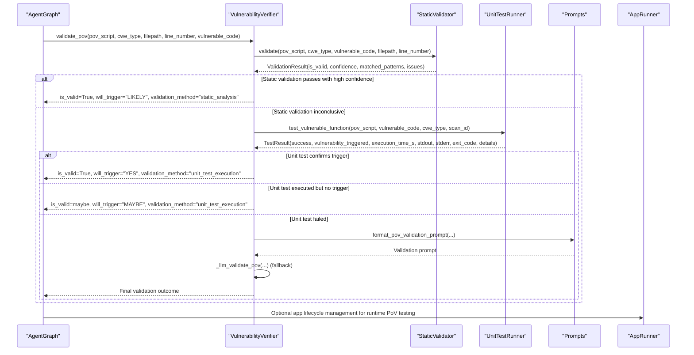
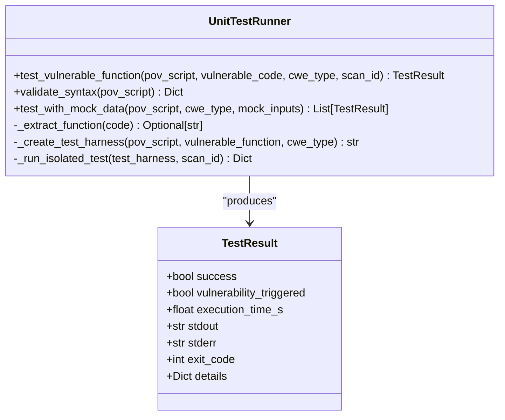
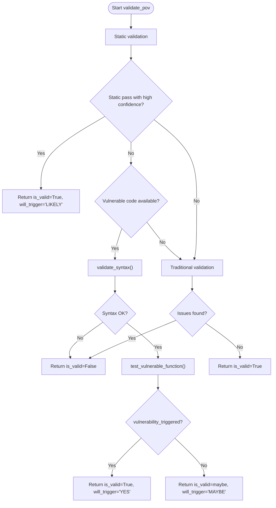
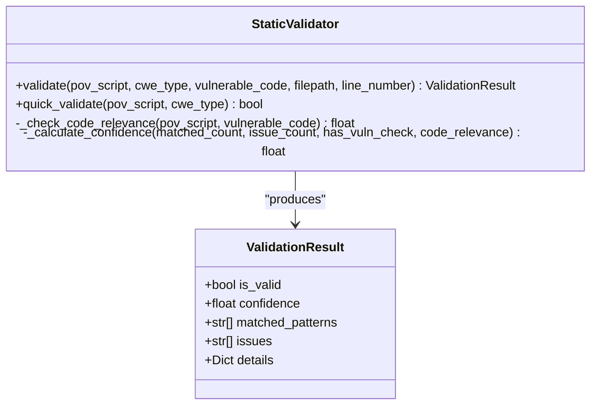
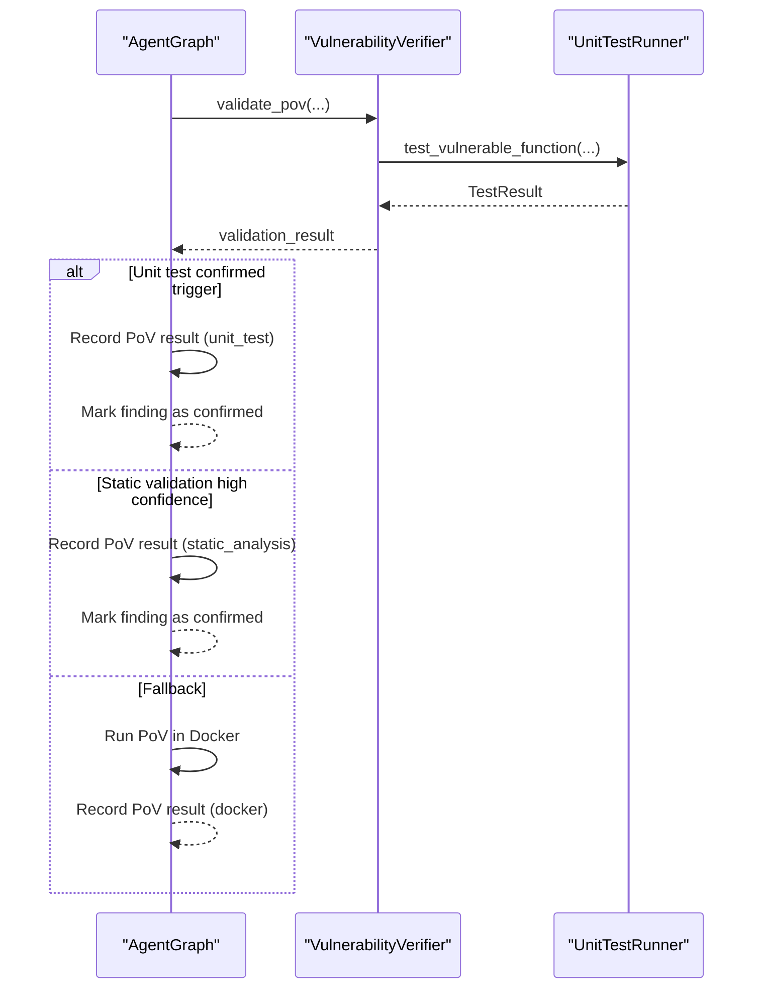
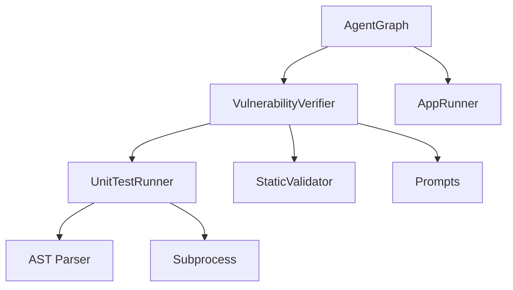

# Unit Test Execution Validation

<cite>
**Referenced Files in This Document**
- [unit_test_runner.py](file://agents/unit_test_runner.py)
- [verifier.py](file://agents/verifier.py)
- [static_validator.py](file://agents/static_validator.py)
- [agent_graph.py](file://app/agent_graph.py)
- [prompts.py](file://prompts.py)
- [app_runner.py](file://agents/app_runner.py)
</cite>

## Table of Contents
1. [Introduction](#introduction)
2. [Project Structure](#project-structure)
3. [Core Components](#core-components)
4. [Architecture Overview](#architecture-overview)
5. [Detailed Component Analysis](#detailed-component-analysis)
6. [Dependency Analysis](#dependency-analysis)
7. [Performance Considerations](#performance-considerations)
8. [Troubleshooting Guide](#troubleshooting-guide)
9. [Conclusion](#conclusion)

## Introduction
This document explains AutoPoV's unit test execution validation system that verifies Proof-of-Vulnerability (PoV) scripts against original vulnerable code. The system provides a robust, multi-stage validation pipeline that combines static analysis, unit test execution in isolated environments, and LLM-based validation to determine whether a PoV script reliably triggers a vulnerability.

Key capabilities:
- Unit test harness architecture that executes PoV scripts against isolated vulnerable code
- Syntax validation using AST parsing to catch early issues
- Vulnerability triggering assessment via controlled execution environments
- Integration with the broader validation pipeline to influence overall outcomes
- Timeout handling and result interpretation for success, execution failures, and trigger detection

## Project Structure
The unit test execution validation spans several modules:
- Unit test runner: orchestrates isolated execution and captures results
- Verifier: coordinates hybrid validation (static + unit test + LLM)
- Static validator: performs fast, rule-based checks without execution
- Agent graph: integrates validation into the end-to-end vulnerability detection workflow
- Prompts: defines validation criteria for LLM-based checks
- Application runner: manages target app lifecycle for runtime PoV testing

**Diagram sources**
- [agent_graph.py:842-903](file://app/agent_graph.py#L842-L903)
- [verifier.py:225-387](file://agents/verifier.py#L225-L387)
- [static_validator.py:22-233](file://agents/static_validator.py#L22-L233)
- [unit_test_runner.py:28-116](file://agents/unit_test_runner.py#L28-L116)
- [prompts.py:93-121](file://prompts.py#L93-L121)
- [app_runner.py:19-191](file://agents/app_runner.py#L19-L191)

**Section sources**
- [agent_graph.py:842-903](file://app/agent_graph.py#L842-L903)
- [verifier.py:225-387](file://agents/verifier.py#L225-L387)
- [static_validator.py:22-233](file://agents/static_validator.py#L22-L233)
- [unit_test_runner.py:28-116](file://agents/unit_test_runner.py#L28-L116)
- [prompts.py:93-121](file://prompts.py#L93-L121)
- [app_runner.py:19-191](file://agents/app_runner.py#L19-L191)

## Core Components
- UnitTestRunner: Creates isolated test harnesses, executes PoV scripts, and interprets results including vulnerability trigger detection and timeouts.
- VulnerabilityVerifier: Implements a hybrid validation strategy combining static analysis, unit test execution, and LLM-based checks to produce a final validation outcome.
- StaticValidator: Performs fast, rule-based checks to quickly assess PoV script quality and relevance to the vulnerable code.
- AgentGraph: Integrates validation into the broader vulnerability detection workflow, controlling when unit testing is triggered and how results influence downstream actions.
- Prompts: Defines validation criteria for LLM-based checks, including requirements for PoV scripts to contain a specific trigger indicator.
- AppRunner: Manages target application lifecycle for runtime PoV testing when applicable.

**Section sources**
- [unit_test_runner.py:28-116](file://agents/unit_test_runner.py#L28-L116)
- [verifier.py:225-387](file://agents/verifier.py#L225-L387)
- [static_validator.py:22-233](file://agents/static_validator.py#L22-L233)
- [agent_graph.py:842-903](file://app/agent_graph.py#L842-L903)
- [prompts.py:93-121](file://prompts.py#L93-L121)
- [app_runner.py:19-191](file://agents/app_runner.py#L19-L191)

## Architecture Overview
The unit test execution validation is part of a layered validation strategy:

**Diagram sources**
- [agent_graph.py:842-903](file://app/agent_graph.py#L842-L903)
- [verifier.py:225-387](file://agents/verifier.py#L225-L387)
- [static_validator.py:123-233](file://agents/static_validator.py#L123-L233)
- [unit_test_runner.py:34-116](file://agents/unit_test_runner.py#L34-L116)
- [prompts.py:93-121](file://prompts.py#L93-L121)
- [app_runner.py:25-191](file://agents/app_runner.py#L25-L191)

## Detailed Component Analysis

### UnitTestRunner
The UnitTestRunner creates isolated test harnesses to execute PoV scripts against vulnerable code snippets. It:
- Extracts the vulnerable function from code snippets
- Builds a test harness that loads vulnerable code into a namespace and executes PoV scripts within it
- Runs PoV scripts in isolated subprocesses with strict resource limits and timeouts
- Interprets results by checking for a specific trigger indicator and exit codes
- Provides mock-data testing capability for PoV scripts that accept stdin inputs

Key behaviors:
- Syntax validation using AST parsing before execution
- Timeout handling with a 30-second limit
- Environment isolation by limiting PATH and PYTHONPATH
- Result aggregation into a standardized TestResult structure

**Diagram sources**
- [unit_test_runner.py:28-116](file://agents/unit_test_runner.py#L28-L116)
- [unit_test_runner.py:16-26](file://agents/unit_test_runner.py#L16-L26)

**Section sources**
- [unit_test_runner.py:28-116](file://agents/unit_test_runner.py#L28-L116)
- [unit_test_runner.py:118-144](file://agents/unit_test_runner.py#L118-L144)
- [unit_test_runner.py:145-235](file://agents/unit_test_runner.py#L145-L235)
- [unit_test_runner.py:236-287](file://agents/unit_test_runner.py#L236-L287)
- [unit_test_runner.py:288-318](file://agents/unit_test_runner.py#L288-L318)
- [unit_test_runner.py:320-335](file://agents/unit_test_runner.py#L320-L335)

### VulnerabilityVerifier
The VulnerabilityVerifier implements a hybrid validation strategy:
- Static validation: Fast rule-based checks to quickly assess PoV quality
- Unit test execution: Controlled execution against vulnerable code to confirm trigger
- LLM-based validation: Fallback analysis when other methods are inconclusive

Validation logic:
- If static validation passes with high confidence, validation succeeds immediately
- If vulnerable code is available, syntax is validated and unit tests are executed
- If unit test confirms trigger, validation succeeds
- Otherwise, traditional validation checks are performed (AST syntax, presence of trigger indicator, standard library constraints, CWE-specific checks)
- If still inconclusive, LLM validation is attempted

**Diagram sources**
- [verifier.py:225-387](file://agents/verifier.py#L225-L387)

**Section sources**
- [verifier.py:225-387](file://agents/verifier.py#L225-L387)
- [verifier.py:425-451](file://agents/verifier.py#L425-L451)
- [verifier.py:453-491](file://agents/verifier.py#L453-L491)

### StaticValidator
The StaticValidator performs fast, rule-based checks:
- Requires PoV scripts to include a specific trigger indicator
- Checks for required imports and attack patterns based on CWE type
- Validates payload indicators and code relevance to the vulnerable snippet
- Calculates confidence scores based on matched patterns and issues

**Diagram sources**
- [static_validator.py:22-233](file://agents/static_validator.py#L22-L233)
- [static_validator.py:12-20](file://agents/static_validator.py#L12-L20)

**Section sources**
- [static_validator.py:22-233](file://agents/static_validator.py#L22-L233)
- [static_validator.py:235-285](file://agents/static_validator.py#L235-L285)

### AgentGraph Integration
The AgentGraph orchestrates when unit testing is triggered and how results influence downstream actions:
- Unit testing is invoked during the validate_pov node when a PoV script is available and vulnerable code is present
- Results are logged and used to decide whether to confirm vulnerability, retry generation, or run PoV in Docker
- If unit test confirms trigger, the workflow records the result and marks the finding as confirmed
- If static validation has high confidence, the workflow trusts the result without Docker execution

**Diagram sources**
- [agent_graph.py:842-903](file://app/agent_graph.py#L842-L903)
- [agent_graph.py:905-1004](file://app/agent_graph.py#L905-L1004)

**Section sources**
- [agent_graph.py:842-903](file://app/agent_graph.py#L842-L903)
- [agent_graph.py:905-1004](file://app/agent_graph.py#L905-L1004)

### Test Execution Environment and Timeout Handling
The unit test execution environment ensures safety and determinism:
- Isolation: PoV scripts are executed in a subprocess with restricted environment variables (PATH and PYTHONPATH)
- Resource limits: A 30-second timeout prevents runaway executions
- Output capture: stdout and stderr are captured and included in results
- Error handling: Exceptions and timeouts are caught and reported with appropriate exit codes

Result interpretation:
- Success: exit code equals zero and the trigger indicator is present
- Execution failure: non-zero exit code or timeout; detailed stderr is recorded
- Vulnerability trigger detection: presence of the trigger indicator in stdout or explicit flagging by unit test runner

**Section sources**
- [unit_test_runner.py:236-287](file://agents/unit_test_runner.py#L236-L287)
- [unit_test_runner.py:84-87](file://agents/unit_test_runner.py#L84-L87)

### Syntax Validation Using AST Parsing
The verifier performs syntax validation using AST parsing:
- Early detection of syntax errors prevents unnecessary execution
- AST parsing ensures the script is syntactically valid before unit testing
- Combined with static validation, this reduces false negatives and improves reliability

**Section sources**
- [verifier.py:290-295](file://agents/verifier.py#L290-L295)
- [unit_test_runner.py:320-335](file://agents/unit_test_runner.py#L320-L335)

### Integration with Validation Pipeline
The validation pipeline integrates unit testing at multiple stages:
- During PoV generation, static validation provides immediate feedback
- During validation, unit testing confirms trigger under controlled conditions
- When validation is inconclusive, LLM-based analysis provides additional insight
- Results influence downstream decisions: confirmation, retry, or Docker execution

**Section sources**
- [agent_graph.py:842-903](file://app/agent_graph.py#L842-L903)
- [verifier.py:225-387](file://agents/verifier.py#L225-L387)

## Dependency Analysis
The unit test execution validation system exhibits clear separation of concerns:
- UnitTestRunner depends on Python's AST and subprocess modules for safe execution
- VulnerabilityVerifier composes StaticValidator and UnitTestRunner for hybrid validation
- AgentGraph orchestrates the workflow and consumes validation results
- Prompts define validation criteria for LLM-based checks
- AppRunner supports runtime PoV testing when needed

**Diagram sources**
- [unit_test_runner.py:8-11](file://agents/unit_test_runner.py#L8-L11)
- [verifier.py:33-34](file://agents/verifier.py#L33-L34)
- [agent_graph.py:842-903](file://app/agent_graph.py#L842-L903)
- [prompts.py:93-121](file://prompts.py#L93-L121)
- [app_runner.py:19-191](file://agents/app_runner.py#L19-L191)

**Section sources**
- [unit_test_runner.py:8-11](file://agents/unit_test_runner.py#L8-L11)
- [verifier.py:33-34](file://agents/verifier.py#L33-L34)
- [agent_graph.py:842-903](file://app/agent_graph.py#L842-L903)
- [prompts.py:93-121](file://prompts.py#L93-L121)
- [app_runner.py:19-191](file://agents/app_runner.py#L19-L191)

## Performance Considerations
- Static validation is extremely fast and should be performed first to filter out invalid scripts
- Unit test execution is bounded by a 30-second timeout to prevent resource exhaustion
- AST parsing is lightweight compared to execution and helps avoid unnecessary unit tests
- When static validation yields high confidence, Docker execution is skipped, saving compute resources

## Troubleshooting Guide
Common execution failures and debugging techniques:
- Syntax errors: Detected by AST parsing; review the error message and fix the script
- Missing trigger indicator: Ensure the PoV prints the required indicator when vulnerability is triggered
- Non-stdlib imports: Static validation flags non-standard library usage; refactor to use only standard library
- CWE-specific issues: Review CWE-specific validation rules and adjust PoV logic accordingly
- Timeout failures: Reduce complexity or optimize PoV to complete within the 30-second limit
- Mock data failures: Verify mock inputs align with expected PoV behavior

Debugging tips:
- Inspect unit test runner's captured stdout/stderr for detailed error messages
- Use static validation results to identify missing patterns or indicators
- Leverage LLM-based validation for additional insights when static and unit tests are inconclusive

**Section sources**
- [verifier.py:328-366](file://agents/verifier.py#L328-L366)
- [unit_test_runner.py:266-281](file://agents/unit_test_runner.py#L266-L281)

## Conclusion
AutoPoV's unit test execution validation system provides a robust, multi-layered approach to verifying PoV scripts. By combining static analysis, controlled unit test execution, and LLM-based validation, the system achieves high confidence in vulnerability confirmation while maintaining safety and performance. The integration with the AgentGraph ensures that validation results drive informed decisions throughout the vulnerability detection workflow, minimizing false positives and reducing reliance on expensive Docker-based execution where possible.