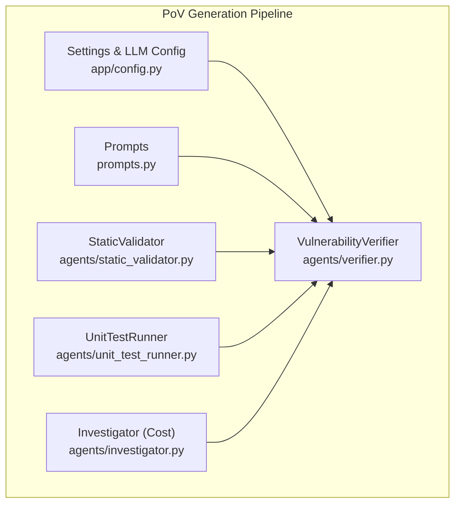
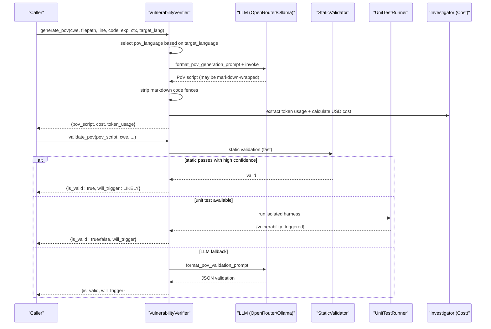
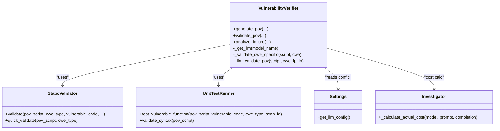
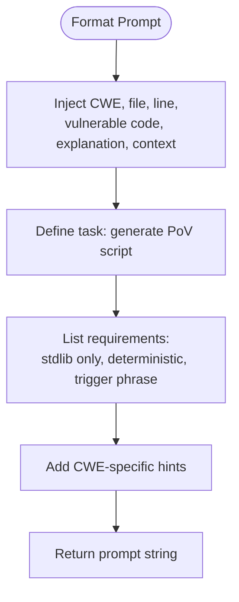
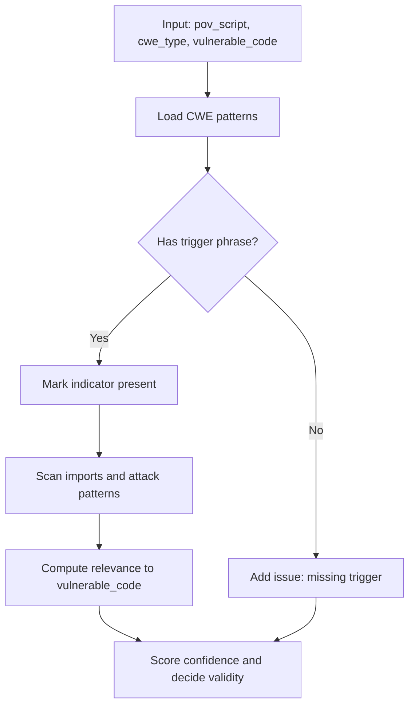
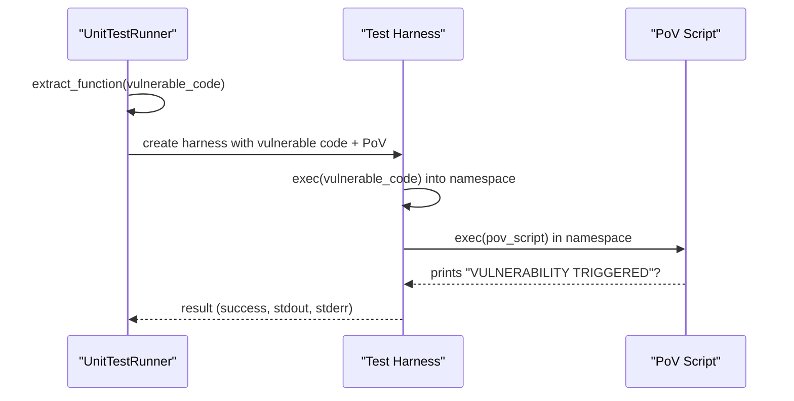
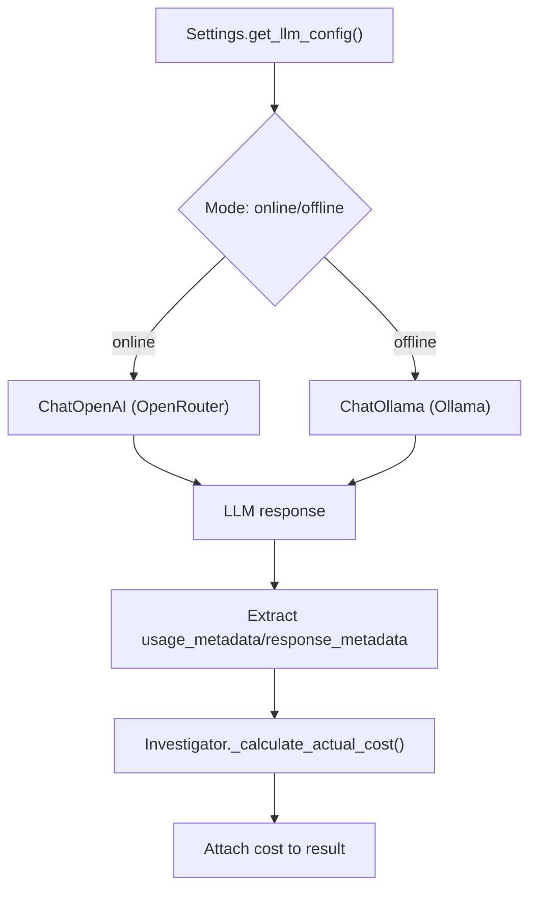
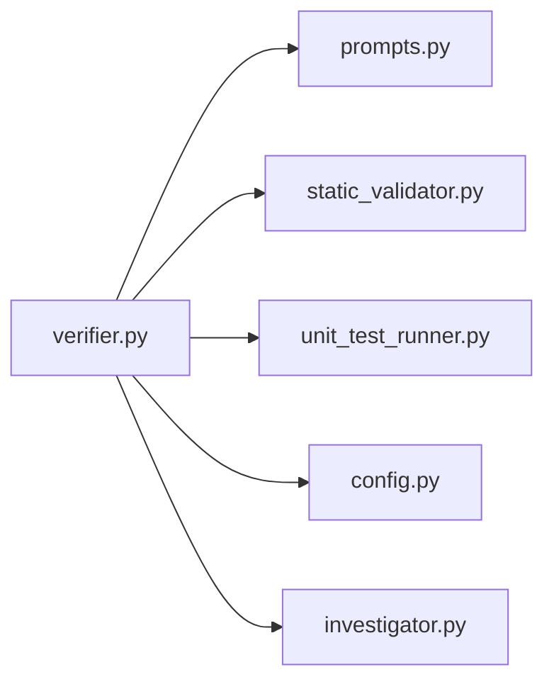

# PoV Script Generation

<cite>
**Referenced Files in This Document**
- [agents/verifier.py](file://agents/verifier.py)
- [prompts.py](file://prompts.py)
- [agents/static_validator.py](file://agents/static_validator.py)
- [agents/unit_test_runner.py](file://agents/unit_test_runner.py)
- [app/config.py](file://app/config.py)
- [agents/investigator.py](file://agents/investigator.py)
- [README.md](file://README.md)
- [codebase/example.py](file://codebase/example.py)
</cite>

## Table of Contents
1. [Introduction](#introduction)
2. [Project Structure](#project-structure)
3. [Core Components](#core-components)
4. [Architecture Overview](#architecture-overview)
5. [Detailed Component Analysis](#detailed-component-analysis)
6. [Dependency Analysis](#dependency-analysis)
7. [Performance Considerations](#performance-considerations)
8. [Troubleshooting Guide](#troubleshooting-guide)
9. [Conclusion](#conclusion)
10. [Appendices](#appendices)

## Introduction
This document explains AutoPoV’s Proof-of-Vulnerability (PoV) script generation system. It describes how confirmed vulnerabilities are transformed into executable exploit scripts using an LLM-driven workflow, including LLM provider selection, prompt engineering, validation, and cost tracking. It also outlines CWE-specific generation patterns, target language adaptation, and practical examples of generated PoVs across vulnerability types.

## Project Structure
AutoPoV organizes PoV generation around a small set of focused modules:
- agents/verifier.py: Orchestrates PoV generation, validation, and failure analysis
- prompts.py: Centralized prompt templates for generation, validation, and retry analysis
- agents/static_validator.py: Static analysis-based pre-validation of PoV scripts
- agents/unit_test_runner.py: Unit test harness that executes PoVs against isolated vulnerable code
- app/config.py: LLM provider configuration and model routing
- agents/investigator.py: Token usage extraction and cost calculation for LLM usage
- README.md: High-level system overview and agent roles
- codebase/example.py: Example vulnerable code used for demonstration

**Diagram sources**
- [agents/verifier.py:42-562](file://agents/verifier.py#L42-L562)
- [prompts.py:46-121](file://prompts.py#L46-L121)
- [agents/static_validator.py:22-305](file://agents/static_validator.py#L22-L305)
- [agents/unit_test_runner.py:28-344](file://agents/unit_test_runner.py#L28-L344)
- [app/config.py:212-232](file://app/config.py#L212-L232)
- [agents/investigator.py:440-473](file://agents/investigator.py#L440-L473)

**Section sources**
- [README.md:1-124](file://README.md#L1-L124)
- [app/config.py:13-255](file://app/config.py#L13-L255)

## Core Components
- VulnerabilityVerifier: Generates PoV scripts using LLMs, cleans markdown output, extracts token usage for cost tracking, and validates PoVs using static analysis, unit tests, and LLM fallback.
- Prompts: Provides structured templates for PoV generation, validation, and retry analysis, including CWE-specific guidance.
- StaticValidator: Validates PoV scripts statically, checking for required indicators, imports, attack patterns, and relevance to the vulnerable code.
- UnitTestRunner: Executes PoVs in an isolated test harness against vulnerable code to confirm exploit triggers.
- Settings: Manages LLM provider selection (online via OpenRouter/Ollama, offline via Ollama), model names, and cost tracking configuration.
- Investigator: Calculates actual USD cost from token usage metadata for billing and budgeting.

**Section sources**
- [agents/verifier.py:42-562](file://agents/verifier.py#L42-L562)
- [prompts.py:46-121](file://prompts.py#L46-L121)
- [agents/static_validator.py:22-305](file://agents/static_validator.py#L22-L305)
- [agents/unit_test_runner.py:28-344](file://agents/unit_test_runner.py#L28-L344)
- [app/config.py:212-232](file://app/config.py#L212-L232)
- [agents/investigator.py:440-473](file://agents/investigator.py#L440-L473)

## Architecture Overview
The PoV generation workflow proceeds through three stages: generation, validation, and optional retry. The system adapts the PoV language to the target codebase while ensuring deterministic, standard-library-only scripts that print a specific trigger phrase upon success.

**Diagram sources**
- [agents/verifier.py:90-224](file://agents/verifier.py#L90-L224)
- [agents/verifier.py:225-387](file://agents/verifier.py#L225-L387)
- [prompts.py:46-121](file://prompts.py#L46-L121)
- [agents/static_validator.py:123-234](file://agents/static_validator.py#L123-L234)
- [agents/unit_test_runner.py:34-117](file://agents/unit_test_runner.py#L34-L117)
- [agents/investigator.py:440-473](file://agents/investigator.py#L440-L473)

## Detailed Component Analysis

### VulnerabilityVerifier
Responsibilities:
- LLM provider selection: Chooses OpenRouter (online) or Ollama (offline) based on configuration, instantiating ChatOpenAI or ChatOllama with a deterministic temperature and model name.
- PoV generation: Formats a prompt embedding CWE, file location, vulnerable code, explanation, and target language; invokes the LLM; strips markdown code fences; captures token usage; computes cost.
- Validation: Hybrid approach:
  - Static: Uses StaticValidator to check presence of required indicators, imports, attack patterns, and relevance to the vulnerable code.
  - Unit test: If vulnerable code is available, executes PoV in an isolated harness to detect “VULNERABILITY TRIGGERED.”
  - LLM fallback: If inconclusive, asks the LLM to validate and return structured JSON.
- Failure analysis: If validation fails, constructs a retry prompt to analyze execution output and suggest improvements.

Key behaviors:
- Deterministic PoV language: Defaults to Python for most targets; adapts for JS/TS contexts.
- Standard library enforcement: Validates AST and disallows non-stdlib imports.
- CWE-specific checks: Adds domain-specific issues for buffer overflow, SQL injection, use-after-free, and integer overflow.
- Cost tracking: Reads usage metadata from LLM responses and calculates USD cost using Investigator’s pricing table.

**Diagram sources**
- [agents/verifier.py:42-562](file://agents/verifier.py#L42-L562)
- [agents/static_validator.py:22-305](file://agents/static_validator.py#L22-L305)
- [agents/unit_test_runner.py:28-344](file://agents/unit_test_runner.py#L28-L344)
- [app/config.py:212-232](file://app/config.py#L212-L232)
- [agents/investigator.py:440-473](file://agents/investigator.py#L440-L473)

**Section sources**
- [agents/verifier.py:48-88](file://agents/verifier.py#L48-L88)
- [agents/verifier.py:90-224](file://agents/verifier.py#L90-L224)
- [agents/verifier.py:225-387](file://agents/verifier.py#L225-L387)
- [agents/verifier.py:425-451](file://agents/verifier.py#L425-L451)
- [agents/verifier.py:453-491](file://agents/verifier.py#L453-L491)
- [agents/verifier.py:492-551](file://agents/verifier.py#L492-L551)

### Prompts
Prompt engineering strategies:
- PoV Generation Prompt: Provides vulnerability details, target code context, and explicit requirements (standard library only, deterministic behavior, printing a specific trigger phrase). Includes CWE-specific hints for XSS, SQL injection, path traversal, code/command injection, hardcoded credentials, deserialization, CSRF, open redirect, cleartext storage.
- PoV Validation Prompt: Requests structured JSON validation with criteria covering standard library usage, trigger phrase presence, correctness for the CWE, error handling, and determinism.
- Retry Analysis Prompt: Guides LLM to analyze failures and propose targeted fixes or alternative approaches.

**Diagram sources**
- [prompts.py:46-90](file://prompts.py#L46-L90)
- [prompts.py:93-121](file://prompts.py#L93-L121)
- [prompts.py:188-221](file://prompts.py#L188-L221)

**Section sources**
- [prompts.py:46-121](file://prompts.py#L46-L121)
- [prompts.py:188-221](file://prompts.py#L188-L221)

### StaticValidator
Static validation focuses on:
- Presence of the trigger phrase.
- Required imports for the CWE category.
- Attack patterns and payload indicators.
- Relevance to the vulnerable code snippet.
Confidence scoring balances matched patterns, presence of the trigger, code relevance, and issues.

**Diagram sources**
- [agents/static_validator.py:123-234](file://agents/static_validator.py#L123-L234)

**Section sources**
- [agents/static_validator.py:22-305](file://agents/static_validator.py#L22-L305)

### UnitTestRunner
Execution validation:
- Extracts the vulnerable function from the provided code snippet.
- Creates a test harness that loads the vulnerable code into a namespace and executes the PoV script within it.
- Captures stdout/stderr and determines if “VULNERABILITY TRIGGERED” was printed.
- Enforces timeouts and restricted environments for safety.

**Diagram sources**
- [agents/unit_test_runner.py:145-234](file://agents/unit_test_runner.py#L145-L234)
- [agents/unit_test_runner.py:236-287](file://agents/unit_test_runner.py#L236-L287)

**Section sources**
- [agents/unit_test_runner.py:34-117](file://agents/unit_test_runner.py#L34-L117)
- [agents/unit_test_runner.py:145-234](file://agents/unit_test_runner.py#L145-L234)
- [agents/unit_test_runner.py:236-287](file://agents/unit_test_runner.py#L236-L287)

### LLM Provider Selection and Cost Tracking
Provider selection:
- Online mode uses OpenRouter with ChatOpenAI; requires API key and base URL.
- Offline mode uses Ollama with ChatOllama; requires base URL.
- Model name can be overridden per call; otherwise uses configured default.

Cost tracking:
- VulnerabilityVerifier extracts token usage from LLM responses (usage_metadata or response_metadata).
- Investigator calculates USD cost using a pricing table per model (input/output per 1M tokens).
- Costs are attached to generation/validation results for transparency.

**Diagram sources**
- [app/config.py:212-232](file://app/config.py#L212-L232)
- [agents/verifier.py:48-88](file://agents/verifier.py#L48-L88)
- [agents/verifier.py:147-189](file://agents/verifier.py#L147-L189)
- [agents/investigator.py:440-473](file://agents/investigator.py#L440-L473)

**Section sources**
- [app/config.py:212-232](file://app/config.py#L212-L232)
- [agents/verifier.py:48-88](file://agents/verifier.py#L48-L88)
- [agents/verifier.py:147-189](file://agents/verifier.py#L147-L189)
- [agents/investigator.py:440-473](file://agents/investigator.py#L440-L473)

## Dependency Analysis
- Coupling: VulnerabilityVerifier depends on prompts, StaticValidator, UnitTestRunner, Settings, and Investigator. These dependencies are cohesive around PoV lifecycle management.
- External integrations: OpenRouter/Ollama for LLMs, Docker for sandboxed execution (outside this document scope), and optional tools like CodeQL/Joern for discovery.
- No circular dependencies were identified among the core modules discussed here.

**Diagram sources**
- [agents/verifier.py:27-34](file://agents/verifier.py#L27-L34)
- [prompts.py:28-32](file://prompts.py#L28-L32)
- [agents/static_validator.py](file://agents/static_validator.py#L33)
- [agents/unit_test_runner.py](file://agents/unit_test_runner.py#L34)
- [app/config.py](file://app/config.py#L27)
- [agents/investigator.py:440-473](file://agents/investigator.py#L440-L473)

**Section sources**
- [agents/verifier.py:27-34](file://agents/verifier.py#L27-L34)
- [agents/static_validator.py](file://agents/static_validator.py#L33)
- [agents/unit_test_runner.py](file://agents/unit_test_runner.py#L34)
- [app/config.py](file://app/config.py#L27)
- [agents/investigator.py:440-473](file://agents/investigator.py#L440-L473)

## Performance Considerations
- Static validation is fast and should be performed first to filter invalid PoVs early.
- Unit test execution provides strong confirmation but adds latency; reserve for cases where vulnerable code is available.
- LLM fallback validation is slower and should be used when other methods are inconclusive.
- Cost tracking via token usage helps bound expenses; consider setting MAX_COST_USD and monitoring usage metadata.

## Troubleshooting Guide
Common issues and resolutions:
- Missing trigger phrase: Ensure the PoV prints the required trigger statement.
- Non-stdlib imports: Remove external dependencies; rely on standard libraries only.
- Syntax errors: Use UnitTestRunner.validate_syntax to catch AST errors early.
- CWE mismatch: Review CWE-specific patterns and adjust payload accordingly.
- Execution failures: Use analyze_failure to generate a structured retry analysis and iterate.

**Section sources**
- [agents/verifier.py:329-361](file://agents/verifier.py#L329-L361)
- [agents/verifier.py:492-551](file://agents/verifier.py#L492-L551)
- [agents/unit_test_runner.py:320-334](file://agents/unit_test_runner.py#L320-L334)

## Conclusion
AutoPoV’s PoV generation system combines robust prompt engineering, hybrid validation, and cost-aware LLM usage to reliably produce working exploit scripts for confirmed vulnerabilities. By enforcing deterministic, standard-library-only PoVs and leveraging static analysis, unit tests, and LLM-based validation, it achieves high confidence in generated PoVs while maintaining operational safety and budget control.

## Appendices

### CWE-Specific Generation Patterns
- SQL Injection (CWE-89): Include SQL keywords and injection patterns; validate payload indicators and required imports.
- XSS (CWE-79): Include HTML/JS payloads and event handlers; validate payload indicators.
- Code/Command Injection (CWE-94, CWE-78): Include eval/exec/subprocess patterns; validate payload indicators.
- Path Traversal (CWE-22): Include path traversal sequences; validate payload indicators.
- Deserialization (CWE-502): Include pickle/yaml/json patterns; validate payload indicators.
- Hardcoded Credentials (CWE-798): Include credential patterns; validate payload indicators.
- Buffer Overflow (CWE-119): Include buffer/overflow/size/length indicators; note limitations for C-level exploits.
- Use After Free (CWE-416): Typically requires C code; flag limitation in validation.
- Integer Overflow (CWE-190): Include large numeric values; validate presence of oversized constants.

**Section sources**
- [prompts.py:77-88](file://prompts.py#L77-L88)
- [agents/static_validator.py:25-118](file://agents/static_validator.py#L25-L118)
- [agents/verifier.py:425-451](file://agents/verifier.py#L425-L451)

### Example Vulnerable Code for PoV Generation
The example vulnerable code demonstrates a classic SQL injection scenario suitable for PoV generation and validation.

**Section sources**
- [codebase/example.py:9-23](file://codebase/example.py#L9-L23)