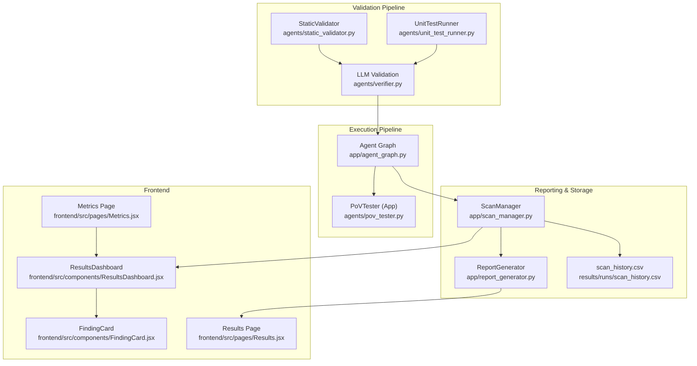
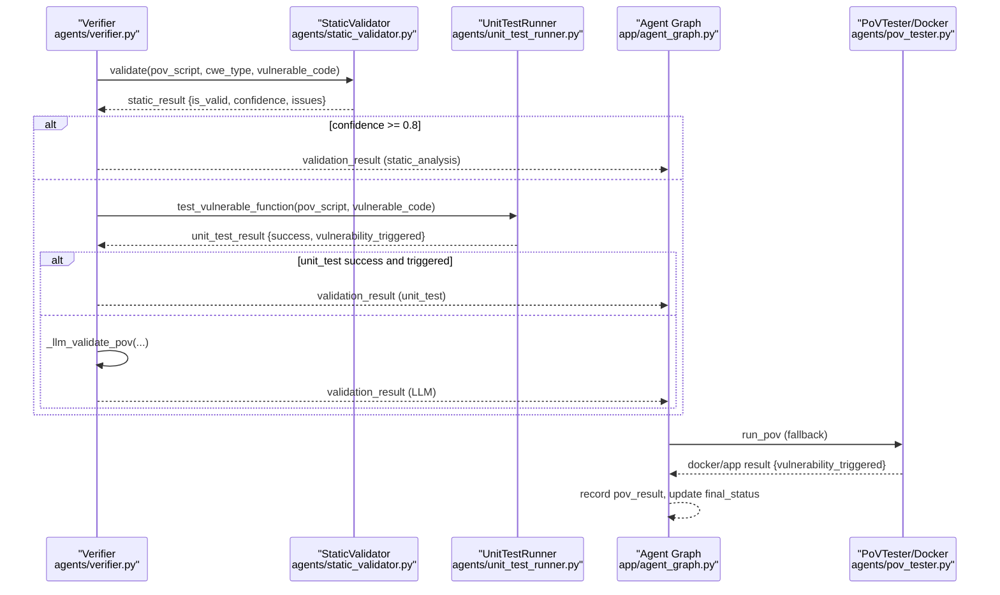
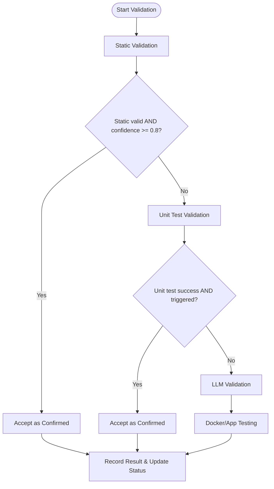
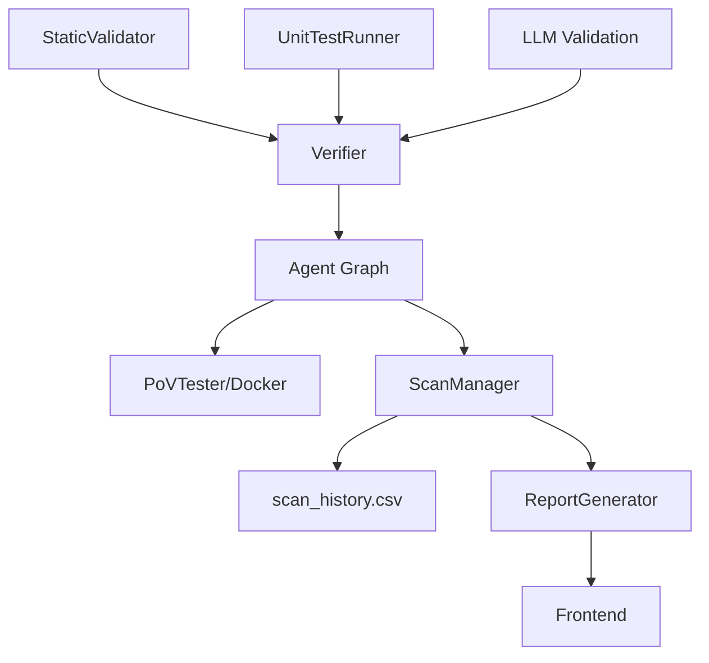

# Result Interpretation & Analysis

<cite>
**Referenced Files in This Document**
- [static_validator.py](file://agents/static_validator.py)
- [unit_test_runner.py](file://agents/unit_test_runner.py)
- [pov_tester.py](file://agents/pov_tester.py)
- [verifier.py](file://agents/verifier.py)
- [agent_graph.py](file://app/agent_graph.py)
- [report_generator.py](file://app/report_generator.py)
- [scan_manager.py](file://app/scan_manager.py)
- [Results.jsx](file://frontend/src/pages/Results.jsx)
- [ResultsDashboard.jsx](file://frontend/src/components/ResultsDashboard.jsx)
- [FindingCard.jsx](file://frontend/src/components/FindingCard.jsx)
- [Metrics.jsx](file://frontend/src/pages/Metrics.jsx)
- [00457eac-35b4-4e40-a9bd-59f9443694a4.json](file://results/runs/00457eac-35b4-4e40-a9bd-59f9443694a4.json)
- [scan_history.csv](file://results/runs/scan_history.csv)
- [f57c5493-6971-4b62-afab-0e700b2475f2.json](file://results/runs/f57c5493-6971-4b62-afab-0e700b2475f2.json)
</cite>

## Table of Contents
1. [Introduction](#introduction)
2. [Project Structure](#project-structure)
3. [Core Components](#core-components)
4. [Architecture Overview](#architecture-overview)
5. [Detailed Component Analysis](#detailed-component-analysis)
6. [Dependency Analysis](#dependency-analysis)
7. [Performance Considerations](#performance-considerations)
8. [Troubleshooting Guide](#troubleshooting-guide)
9. [Conclusion](#conclusion)
10. [Appendices](#appendices)

## Introduction
This document explains how to interpret and analyze AutoPoV validation results and PoV script effectiveness. It covers the validation result structure, success indicators, confidence scores, and issue categorization. It also documents the meaning of different validation methods (static, unit test, LLM), result precedence, and decision logic. Finally, it describes the reporting format, result storage, and historical comparison capabilities, along with practical guidelines for interpreting outcomes, understanding confidence levels, and determining next steps.

## Project Structure
AutoPoV integrates several modules to validate PoV scripts and produce actionable results:
- Validation pipeline: static analysis, unit testing, and LLM validation
- Execution pipeline: unit test harness, application testing, and Docker-based fallback
- Reporting and storage: JSON reports, PDF summaries, CSV history, and frontend dashboards
- Decision logic: precedence rules and thresholds for accepting or rejecting findings

**Diagram sources**
- [static_validator.py:12-305](file://agents/static_validator.py#L12-L305)
- [unit_test_runner.py:28-344](file://agents/unit_test_runner.py#L28-L344)
- [pov_tester.py:21-296](file://agents/pov_tester.py#L21-L296)
- [verifier.py:225-482](file://agents/verifier.py#L225-L482)
- [agent_graph.py:940-1004](file://app/agent_graph.py#L940-L1004)
- [scan_manager.py:367-418](file://app/scan_manager.py#L367-L418)
- [report_generator.py:200-800](file://app/report_generator.py#L200-L800)
- [ResultsDashboard.jsx:1-163](file://frontend/src/components/ResultsDashboard.jsx#L1-L163)
- [FindingCard.jsx:122-149](file://frontend/src/components/FindingCard.jsx#L122-L149)
- [Results.jsx:159-182](file://frontend/src/pages/Results.jsx#L159-L182)
- [Metrics.jsx:132-160](file://frontend/src/pages/Metrics.jsx#L132-L160)

**Section sources**
- [static_validator.py:12-305](file://agents/static_validator.py#L12-L305)
- [unit_test_runner.py:28-344](file://agents/unit_test_runner.py#L28-L344)
- [pov_tester.py:21-296](file://agents/pov_tester.py#L21-L296)
- [verifier.py:225-482](file://agents/verifier.py#L225-L482)
- [agent_graph.py:940-1004](file://app/agent_graph.py#L940-L1004)
- [scan_manager.py:367-418](file://app/scan_manager.py#L367-L418)
- [report_generator.py:200-800](file://app/report_generator.py#L200-L800)
- [ResultsDashboard.jsx:1-163](file://frontend/src/components/ResultsDashboard.jsx#L1-L163)
- [FindingCard.jsx:122-149](file://frontend/src/components/FindingCard.jsx#L122-L149)
- [Results.jsx:159-182](file://frontend/src/pages/Results.jsx#L159-L182)
- [Metrics.jsx:132-160](file://frontend/src/pages/Metrics.jsx#L132-L160)

## Core Components
- StaticValidator: Performs fast, code-only checks to detect PoV script patterns and CWE-relevant indicators. Produces a binary validity decision and a confidence score.
- UnitTestRunner: Executes PoV scripts against isolated vulnerable code snippets to determine if the vulnerability triggers.
- PoVTester: Runs PoV scripts against live applications or via Docker fallback when unit tests are not applicable.
- Verifier: Orchestrates the hybrid validation pipeline (static → unit test → LLM) and aggregates results.
- Agent Graph: Applies precedence rules to decide whether a finding is confirmed, skipped, or failed, and records PoV outcomes.
- ScanManager: Persists scan results to JSON and CSV, enabling historical comparisons and metrics computation.
- ReportGenerator: Produces JSON and PDF reports summarizing findings, validation outcomes, and cost/performance metrics.
- Frontend components: Visualize metrics, distributions, and individual finding details for interpretation and triage.

**Section sources**
- [static_validator.py:12-305](file://agents/static_validator.py#L12-L305)
- [unit_test_runner.py:28-344](file://agents/unit_test_runner.py#L28-L344)
- [pov_tester.py:21-296](file://agents/pov_tester.py#L21-L296)
- [verifier.py:225-482](file://agents/verifier.py#L225-L482)
- [agent_graph.py:940-1004](file://app/agent_graph.py#L940-L1004)
- [scan_manager.py:367-418](file://app/scan_manager.py#L367-L418)
- [report_generator.py:200-800](file://app/report_generator.py#L200-L800)
- [ResultsDashboard.jsx:1-163](file://frontend/src/components/ResultsDashboard.jsx#L1-L163)
- [FindingCard.jsx:122-149](file://frontend/src/components/FindingCard.jsx#L122-L149)

## Architecture Overview
The validation and decision pipeline follows a strict precedence order:
1. Static validation: Fast pass/fail with confidence threshold determines acceptance or requires further checks.
2. Unit test validation: When vulnerable code is available, executes PoV in isolation to confirm triggering.
3. LLM validation: As a fallback, uses LLM reasoning to assess PoV soundness.
4. Docker/app testing: If validation remains inconclusive, executes PoV against a live target or containerized environment.
5. Final decision: Agent Graph records outcomes, updates final statuses, and persists results.

**Diagram sources**
- [verifier.py:225-482](file://agents/verifier.py#L225-L482)
- [static_validator.py:123-233](file://agents/static_validator.py#L123-L233)
- [unit_test_runner.py:34-116](file://agents/unit_test_runner.py#L34-L116)
- [agent_graph.py:940-1004](file://app/agent_graph.py#L940-L1004)
- [pov_tester.py:24-105](file://agents/pov_tester.py#L24-L105)

**Section sources**
- [verifier.py:225-482](file://agents/verifier.py#L225-L482)
- [agent_graph.py:940-1004](file://app/agent_graph.py#L940-L1004)

## Detailed Component Analysis

### Static Validation
StaticValidator evaluates PoV scripts without execution, focusing on:
- Presence of vulnerability indicators (e.g., “VULNERABILITY TRIGGERED”)
- Required imports and attack patterns aligned with the CWE
- Payload indicators and relevance to the vulnerable code
- Confidence calculation combining matched patterns, issues, and code relevance

Key outputs:
- is_valid: Boolean decision
- confidence: Float in [0,1]
- matched_patterns: List of detected indicators
- issues: List of validation concerns
- details: Metadata (CWE, filepath, line number, PoV length, relevance score)

Interpretation tips:
- High confidence (≥ 0.8) combined with positive indicators often warrants immediate acceptance.
- Low confidence or missing indicators suggests deeper checks are needed.

**Section sources**
- [static_validator.py:123-233](file://agents/static_validator.py#L123-L233)
- [static_validator.py:261-284](file://agents/static_validator.py#L261-L284)

### Unit Test Validation
UnitTestRunner executes PoV scripts against isolated vulnerable code:
- Extracts the vulnerable function or code snippet
- Builds a test harness embedding the vulnerable code and PoV
- Runs in a subprocess with restricted environment and timeout
- Captures stdout/stderr and exit codes to determine if the vulnerability was triggered

Key outputs:
- success: Execution succeeded
- vulnerability_triggered: Whether the PoV caused the vulnerability to manifest
- execution_time_s: Duration of the test
- stdout/stderr: Captured output for debugging
- details: Context (CWE, extraction success, test method)

Interpretation tips:
- Triggered = Yes indicates strong evidence of exploitability.
- Triggered = No may indicate environmental mismatches or PoV refinement needs.

**Section sources**
- [unit_test_runner.py:34-116](file://agents/unit_test_runner.py#L34-L116)
- [unit_test_runner.py:145-287](file://agents/unit_test_runner.py#L145-L287)

### LLM Validation (Fallback)
When static and unit tests are inconclusive, Verifier uses LLM reasoning to assess PoV soundness. It constructs a structured prompt and parses JSON-formatted LLM responses to derive:
- Validation outcome and reasoning
- Suggestions for improvement
- Confidence adjustments

Interpretation tips:
- Use LLM suggestions to refine PoV scripts and improve static patterns.
- Treat LLM validation as a tie-breaker when evidence is ambiguous.

**Section sources**
- [verifier.py:453-482](file://agents/verifier.py#L453-L482)

### PoV Execution Against Applications
PoVTester runs PoV scripts against live targets or via Docker:
- For app-based testing, patches target URLs and executes PoV with environment variables
- For Docker fallback, executes PoV in a containerized environment
- Records stdout/stderr, exit codes, and execution time

Interpretation tips:
- Successful triggering confirms exploitability under the tested environment.
- Failures may stem from network, environment, or PoV logic issues.

**Section sources**
- [pov_tester.py:24-105](file://agents/pov_tester.py#L24-L105)
- [pov_tester.py:140-222](file://agents/pov_tester.py#L140-L222)

### Decision Logic and Precedence
Agent Graph applies strict precedence:
1. If static validation is valid with confidence ≥ 0.8 → accept as confirmed
2. Else if unit test succeeds and triggers → accept as confirmed
3. Else use LLM validation as fallback
4. Else run Docker/app testing as final fallback
5. Record PoV result and update final_status (confirmed/skipped/failed)

**Diagram sources**
- [agent_graph.py:948-972](file://app/agent_graph.py#L948-L972)
- [agent_graph.py:974-1004](file://app/agent_graph.py#L974-L1004)

**Section sources**
- [agent_graph.py:948-1004](file://app/agent_graph.py#L948-L1004)

### Validation Result Structure and Fields
Across the system, validation results unify around these fields:
- validation_result:
  - static_result: {is_valid, confidence, matched_patterns, issues}
  - unit_test_result: {success, vulnerability_triggered, execution_time_s, stdout, stderr, exit_code}
  - issues: List of validation concerns
  - suggestions: Improvement recommendations
  - will_trigger: "LIKELY"/"MAYBE"
  - validation_method: "static_analysis"/"unit_test"/"llm"/"docker"
- pov_result:
  - success: Execution completed
  - vulnerability_triggered: Exploitability confirmed
  - validation_method: "static_analysis"/"unit_test"/"docker"
  - stdout/stderr: Captured output
  - execution_time_s: Duration
  - confidence: From static validation when applicable
  - note: Additional context

Interpretation guide:
- success = True and vulnerability_triggered = True → PoV confirmed exploit
- success = True and vulnerability_triggered = False → PoV did not trigger; may require refinement
- success = False → Execution failed; inspect stderr and logs
- validation_method indicates which step provided the decision

**Section sources**
- [verifier.py:249-277](file://agents/verifier.py#L249-L277)
- [agent_graph.py:733-759](file://app/agent_graph.py#L733-L759)
- [agent_graph.py:952-958](file://app/agent_graph.py#L952-L958)

### Reporting Format and Storage
- JSON report: Comprehensive scan-level and finding-level details, including metrics and methodology
- PDF report: Executive summary, confirmed vulnerabilities, false positives, PoV status, and technical details
- CSV history: Per-scan metrics for historical comparisons
- Frontend dashboards: Metrics cards, charts, and per-finding details

Key metrics and fields:
- total_findings, confirmed_vulns, false_positives, failed
- detection_rate_percent, false_positive_rate_percent, pov_success_rate_percent
- cost_per_confirmed_usd, total_cost_usd, avg_duration_s
- Individual finding fields: cwe_type, filepath, line_number, final_status, token_usage, cost_usd, model_used, pov_validation, pov_result

**Section sources**
- [report_generator.py:209-262](file://app/report_generator.py#L209-L262)
- [report_generator.py:264-610](file://app/report_generator.py#L264-L610)
- [report_generator.py:721-760](file://app/report_generator.py#L721-L760)
- [scan_manager.py:367-418](file://app/scan_manager.py#L367-L418)
- [scan_history.csv:1-72](file://results/runs/scan_history.csv#L1-L72)
- [ResultsDashboard.jsx:8-31](file://frontend/src/components/ResultsDashboard.jsx#L8-L31)
- [Metrics.jsx:132-160](file://frontend/src/pages/Metrics.jsx#L132-L160)

### Historical Comparison Capabilities
- CSV scan_history.csv stores per-scan totals and costs for trend analysis
- Frontend Metrics page computes averages and displays cost/duration trends
- JSON reports enable deep dive into specific scans and findings

**Section sources**
- [scan_history.csv:1-72](file://results/runs/scan_history.csv#L1-L72)
- [Metrics.jsx:132-160](file://frontend/src/pages/Metrics.jsx#L132-L160)
- [report_generator.py:209-262](file://app/report_generator.py#L209-L262)

### Interpreting Validation Outcomes and Confidence Levels
- Confidence thresholds:
  - Static ≥ 0.8: Strongly indicative of exploitability; often accepted as confirmed
  - Static < 0.6: Requires unit test or LLM validation
- Success vs. Triggered:
  - success = True means the PoV executed; vulnerability_triggered indicates exploitability
- Issue categorization:
  - Missing vulnerability indicators, insufficient attack patterns, or mismatched CWE
  - Suggestions from LLM validation can guide PoV improvements

**Section sources**
- [static_validator.py:218-233](file://agents/static_validator.py#L218-L233)
- [verifier.py:278-284](file://agents/verifier.py#L278-L284)

### Determining Next Steps Based on Results
- Confirmed with triggered = True: Validate in production-like environments and prioritize remediation
- Confirmed with triggered = False: Refine PoV (e.g., adjust inputs, environment, or target URL)
- Skipped/Failed: Investigate static/unit test issues; leverage LLM suggestions; regenerate PoV
- High false positive rate: Review CWE selection, static patterns, and LLM prompts

**Section sources**
- [agent_graph.py:1006-1057](file://app/agent_graph.py#L1006-L1057)
- [verifier.py:453-482](file://agents/verifier.py#L453-L482)

### Common Result Patterns and Pitfalls
- Pattern A: Static passes with high confidence → PoV accepted quickly
- Pattern B: Static fails but unit test triggers → PoV accepted despite static issues
- Pattern C: Static inconclusive → LLM validation used; may require PoV refinement
- Pattern D: Static inconclusive and unit test fails → Docker/app testing used; failures often due to environment or URL mismatches
- False positives: Overly broad static patterns or misclassified CWE
- False negatives: Insufficient attack vectors in PoV or environment constraints

**Section sources**
- [agent_graph.py:948-1004](file://app/agent_graph.py#L948-L1004)
- [f57c5493-6971-4b62-afab-0e700b2475f2.json:1187-1193](file://results/runs/f57c5493-6971-4b62-afab-0e700b2475f2.json#L1187-L1193)

### Examples of Result Interpretation
- Example 1: Static validation yields high confidence and matched patterns; PoV accepted as confirmed
- Example 2: Unit test executes successfully but vulnerability not triggered; inspect stderr and refine PoV
- Example 3: LLM validation suggests missing imports; update PoV and rerun static validation
- Example 4: Docker testing fails with environment errors; adjust container configuration or target URL

**Section sources**
- [FindingCard.jsx:122-149](file://frontend/src/components/FindingCard.jsx#L122-L149)
- [f57c5493-6971-4b62-afab-0e700b2475f2.json:1187-1193](file://results/runs/f57c5493-6971-4b62-afab-0e700b2475f2.json#L1187-L1193)

## Dependency Analysis
The validation pipeline exhibits clear separation of concerns:
- StaticValidator depends on regex and pattern matching; low coupling
- UnitTestRunner depends on subprocess execution and code parsing; moderate coupling
- PoVTester depends on external processes and environment variables; higher coupling
- Verifier orchestrates all three and aggregates results; central coordination
- Agent Graph applies precedence and records outcomes; central decision-making
- ScanManager persists results; decoupled from validation logic
- ReportGenerator consumes ScanResult; produces human-readable outputs

**Diagram sources**
- [verifier.py:225-482](file://agents/verifier.py#L225-L482)
- [agent_graph.py:940-1004](file://app/agent_graph.py#L940-L1004)
- [scan_manager.py:367-418](file://app/scan_manager.py#L367-L418)
- [report_generator.py:200-800](file://app/report_generator.py#L200-L800)

**Section sources**
- [verifier.py:225-482](file://agents/verifier.py#L225-L482)
- [agent_graph.py:940-1004](file://app/agent_graph.py#L940-L1004)
- [scan_manager.py:367-418](file://app/scan_manager.py#L367-L418)
- [report_generator.py:200-800](file://app/report_generator.py#L200-L800)

## Performance Considerations
- Static validation is extremely fast and should be prioritized to minimize compute usage
- Unit tests provide strong evidence but add execution overhead; ensure timeouts and sandboxing
- LLM validation introduces latency and cost; use judiciously as a fallback
- Docker/app testing is the most resource-intensive; reserve for edge cases
- Frontend dashboards aggregate metrics efficiently; avoid frequent re-computation

[No sources needed since this section provides general guidance]

## Troubleshooting Guide
Common issues and resolutions:
- Static validation flags missing imports or attack patterns:
  - Update PoV to include required imports and realistic payloads
- Unit test fails with timeouts or environment errors:
  - Verify vulnerable code extraction and harness correctness
  - Increase timeouts or adjust sandbox constraints
- LLM validation returns ambiguous results:
  - Improve PoV specificity and add clearer triggering signals
- Docker/app testing fails:
  - Confirm target URL and environment variables
  - Inspect stderr for runtime errors
- Frontend shows unexpected metrics:
  - Check scan_history.csv for data integrity
  - Recompute metrics after clearing stale entries

**Section sources**
- [unit_test_runner.py:236-287](file://agents/unit_test_runner.py#L236-L287)
- [pov_tester.py:140-222](file://agents/pov_tester.py#L140-L222)
- [f57c5493-6971-4b62-afab-0e700b2475f2.json:1187-1193](file://results/runs/f57c5493-6971-4b62-afab-0e700b2475f2.json#L1187-L1193)
- [scan_history.csv:1-72](file://results/runs/scan_history.csv#L1-L72)

## Conclusion
AutoPoV’s validation pipeline balances speed and accuracy through a layered approach: static analysis, unit testing, LLM reasoning, and Docker/app execution. By interpreting confidence scores, validation methods, and outcome fields, teams can quickly triage findings, refine PoVs, and improve detection quality. Historical comparisons and comprehensive reports enable continuous improvement and stakeholder communication.

[No sources needed since this section summarizes without analyzing specific files]

## Appendices

### Appendix A: Result Fields Reference
- validation_result.static_result: is_valid, confidence, matched_patterns, issues
- validation_result.unit_test_result: success, vulnerability_triggered, execution_time_s, stdout, stderr, exit_code
- validation_result: issues, suggestions, will_trigger, validation_method
- pov_result: success, vulnerability_triggered, validation_method, stdout, stderr, execution_time_s, confidence, note

**Section sources**
- [verifier.py:249-277](file://agents/verifier.py#L249-L277)
- [agent_graph.py:733-759](file://app/agent_graph.py#L733-L759)

### Appendix B: Example Scan Summary
- Example scan with zero findings and minimal cost demonstrates a clean codebase or conservative thresholds
- Use this as a baseline for comparison when evaluating future scans

**Section sources**
- [00457eac-35b4-4e40-a9bd-59f9443694a4.json:1-21](file://results/runs/00457eac-35b4-4e40-a9bd-59f9443694a4.json#L1-L21)