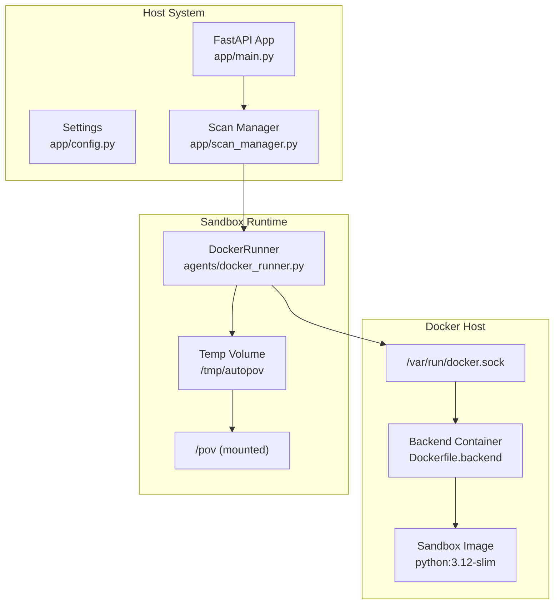
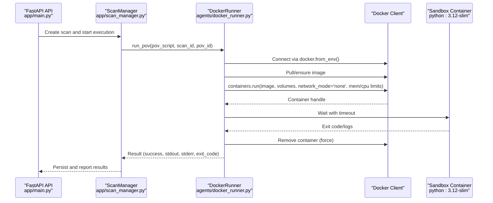
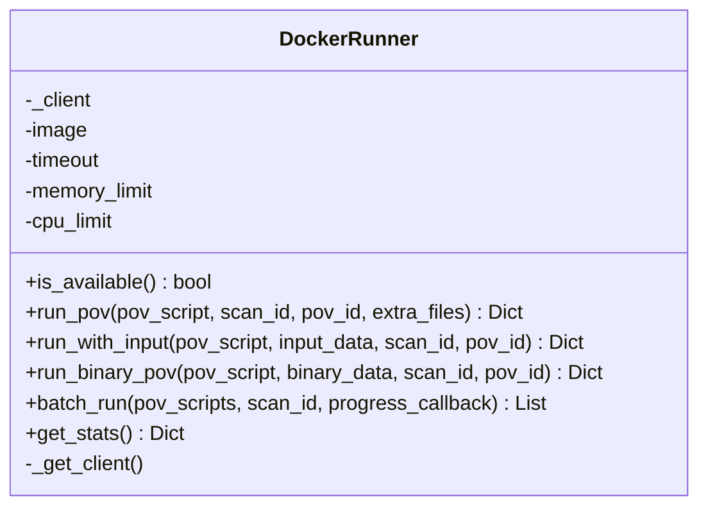
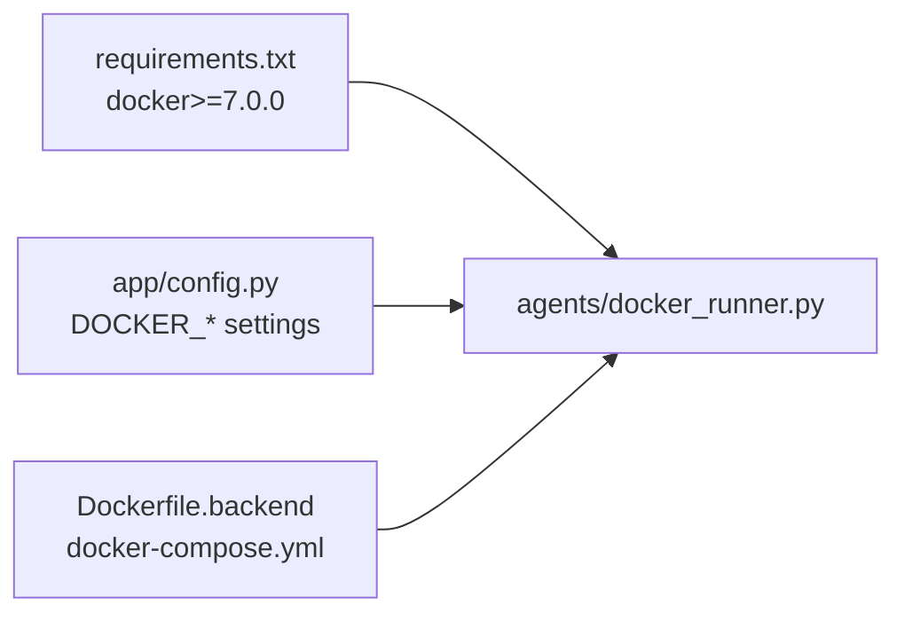

# Sandbox Execution Environment

<cite>
**Referenced Files in This Document**
- [docker_runner.py](file://agents/docker_runner.py)
- [config.py](file://app/config.py)
- [Dockerfile.backend](file://Dockerfile.backend)
- [docker-compose.yml](file://docker-compose.yml)
- [app_runner.py](file://agents/app_runner.py)
- [pov_tester.py](file://agents/pov_tester.py)
- [scan_manager.py](file://app/scan_manager.py)
- [main.py](file://app/main.py)
- [requirements.txt](file://requirements.txt)
</cite>

## Table of Contents
1. [Introduction](#introduction)
2. [Project Structure](#project-structure)
3. [Core Components](#core-components)
4. [Architecture Overview](#architecture-overview)
5. [Detailed Component Analysis](#detailed-component-analysis)
6. [Dependency Analysis](#dependency-analysis)
7. [Performance Considerations](#performance-considerations)
8. [Troubleshooting Guide](#troubleshooting-guide)
9. [Conclusion](#conclusion)

## Introduction
This document describes AutoPoV's Docker-based sandbox execution environment designed to isolate and securely execute Proof-of-Vulnerability (PoV) scripts. The system orchestrates Docker containers to run PoV scripts in a controlled environment with strict resource limits, network isolation, and robust monitoring. It supports both standalone PoV execution and integration with live target applications for validation.

## Project Structure
The sandbox environment spans several modules:
- Docker orchestration and execution: agents/docker_runner.py
- Configuration and environment settings: app/config.py
- Containerization definition: Dockerfile.backend and docker-compose.yml
- Target application lifecycle management: agents/app_runner.py
- PoV testing against live targets: agents/pov_tester.py
- Scan lifecycle and result persistence: app/scan_manager.py
- API entry point and health checks: app/main.py
- Dependencies: requirements.txt

**Diagram sources**
- [docker_runner.py:30-377](file://agents/docker_runner.py#L30-L377)
- [config.py:92-98](file://app/config.py#L92-L98)
- [Dockerfile.backend:1-64](file://Dockerfile.backend#L1-L64)
- [docker-compose.yml:1-41](file://docker-compose.yml#L1-L41)

**Section sources**
- [docker_runner.py:1-377](file://agents/docker_runner.py#L1-L377)
- [config.py:92-98](file://app/config.py#L92-L98)
- [Dockerfile.backend:1-64](file://Dockerfile.backend#L1-L64)
- [docker-compose.yml:1-41](file://docker-compose.yml#L1-L41)

## Core Components
- DockerRunner: Orchestrates sandbox container creation, execution, and cleanup. Enforces timeouts, memory/CPU limits, and network isolation.
- Settings: Centralized configuration for Docker availability, image, timeouts, and resource limits.
- Dockerfile.backend: Defines the backend container with Docker CLI and CodeQL support.
- docker-compose.yml: Mounts Docker socket and exposes ports for development and production.
- AppRunner: Manages lifecycle of target applications for PoV testing against live systems.
- PoVTester: Executes PoV scripts against running applications with URL patching and environment isolation.
- ScanManager: Coordinates scan lifecycle, persists results, and manages background execution.

**Section sources**
- [docker_runner.py:27-377](file://agents/docker_runner.py#L27-L377)
- [config.py:92-98](file://app/config.py#L92-L98)
- [Dockerfile.backend:1-64](file://Dockerfile.backend#L1-L64)
- [docker-compose.yml:1-41](file://docker-compose.yml#L1-L41)
- [app_runner.py:19-200](file://agents/app_runner.py#L19-L200)
- [pov_tester.py:21-296](file://agents/pov_tester.py#L21-L296)
- [scan_manager.py:47-663](file://app/scan_manager.py#L47-L663)

## Architecture Overview
The sandbox architecture ensures secure, isolated execution of PoV scripts:
- Docker-in-Docker: The backend container includes Docker CLI and mounts the host Docker socket, enabling container orchestration from within the container.
- Network isolation: Containers run with network disabled to prevent outbound connections.
- Resource controls: CPU quota and memory limits bound container resource consumption.
- Volume mounting: Temporary directories are mounted read-only under /pov for script execution.
- Monitoring and timeouts: Container waits with timeout; logs are captured; containers are force-removed after completion.

**Diagram sources**
- [docker_runner.py:62-191](file://agents/docker_runner.py#L62-L191)
- [scan_manager.py:266-366](file://app/scan_manager.py#L266-L366)
- [main.py:175-186](file://app/main.py#L175-L186)

## Detailed Component Analysis

### DockerRunner: Sandbox Orchestration
DockerRunner encapsulates all sandbox execution logic:
- Availability checks: Validates Docker availability and connectivity.
- Image management: Ensures the sandbox image exists or pulls it automatically.
- Container configuration: Mounts a temporary directory read-only at /pov, disables networking, applies CPU and memory limits, and sets a working directory.
- Execution lifecycle: Starts the container, waits with timeout, captures stdout/stderr, and removes the container.
- Result interpretation: Determines success based on exit code or presence of a vulnerability trigger marker.

**Diagram sources**
- [docker_runner.py:27-377](file://agents/docker_runner.py#L27-L377)

**Section sources**
- [docker_runner.py:30-191](file://agents/docker_runner.py#L30-L191)
- [docker_runner.py:193-310](file://agents/docker_runner.py#L193-L310)
- [docker_runner.py:311-342](file://agents/docker_runner.py#L311-L342)
- [docker_runner.py:344-377](file://agents/docker_runner.py#L344-L377)

### Configuration and Environment Controls
Settings define the sandbox behavior:
- DOCKER_ENABLED: Toggles Docker usage.
- DOCKER_IMAGE: Sandbox base image for PoV execution.
- DOCKER_TIMEOUT: Maximum execution time per sandbox.
- DOCKER_MEMORY_LIMIT: Per-container memory cap.
- DOCKER_CPU_LIMIT: Per-container CPU share ratio.

These settings are consumed by DockerRunner to configure container runtime.

**Section sources**
- [config.py:92-98](file://app/config.py#L92-L98)
- [docker_runner.py:30-36](file://agents/docker_runner.py#L30-L36)

### Containerization Definition
Dockerfile.backend builds the backend container with:
- Python 3.12 slim base.
- Docker CLI installed for Docker-in-Docker.
- CodeQL CLI and standard query packs.
- Required Python dependencies and application code.
- Exposed backend port and environment variables.

docker-compose.yml mounts the Docker socket and exposes ports for development, enabling the backend to orchestrate containers on the host.

**Section sources**
- [Dockerfile.backend:1-64](file://Dockerfile.backend#L1-L64)
- [docker-compose.yml:1-41](file://docker-compose.yml#L1-L41)

### Target Application Lifecycle Management
AppRunner starts and stops target applications (e.g., Node.js) for PoV testing:
- Validates application structure and installs dependencies if missing.
- Launches the application process and polls readiness.
- Provides URL and process handles for downstream testing.
- Supports graceful termination and cleanup.

**Section sources**
- [app_runner.py:19-191](file://agents/app_runner.py#L19-L191)

### PoV Testing Against Live Targets
PoVTester executes PoV scripts against running applications:
- Writes PoV to a temporary directory and patches target URLs.
- Runs PoV via subprocess with environment variables and timeouts.
- Detects vulnerability triggers from stdout markers.
- Integrates with AppRunner for lifecycle management.

**Section sources**
- [pov_tester.py:21-296](file://agents/pov_tester.py#L21-L296)

### Scan Lifecycle and Result Persistence
ScanManager coordinates the end-to-end scan:
- Creates scans, tracks progress, and persists results to JSON and CSV.
- Uses thread pools and asyncio for background execution.
- Provides metrics and cleanup utilities for long-term operation.

**Section sources**
- [scan_manager.py:47-663](file://app/scan_manager.py#L47-L663)

## Dependency Analysis
The sandbox execution environment relies on:
- Docker SDK for Python to manage containers.
- Backend container with Docker CLI for orchestration.
- Host Docker daemon via mounted socket for container creation.
- Configuration-driven resource limits and timeouts.

**Diagram sources**
- [requirements.txt:24-26](file://requirements.txt#L24-L26)
- [config.py:92-98](file://app/config.py#L92-L98)
- [docker_runner.py:12-17](file://agents/docker_runner.py#L12-L17)
- [Dockerfile.backend:20-27](file://Dockerfile.backend#L20-L27)
- [docker-compose.yml:13](file://docker-compose.yml#L13)

**Section sources**
- [requirements.txt:24-26](file://requirements.txt#L24-L26)
- [config.py:92-98](file://app/config.py#L92-L98)
- [docker_runner.py:12-17](file://agents/docker_runner.py#L12-L17)
- [Dockerfile.backend:20-27](file://Dockerfile.backend#L20-L27)
- [docker-compose.yml:13](file://docker-compose.yml#L13)

## Performance Considerations
- Resource limits: Memory and CPU quotas prevent resource exhaustion; tune DOCKER_MEMORY_LIMIT and DOCKER_CPU_LIMIT for workload characteristics.
- Timeouts: DOCKER_TIMEOUT bounds execution time; adjust based on PoV complexity and target responsiveness.
- Concurrency: Batch execution supports multiple PoVs; consider queueing and rate limiting to avoid container thrashing.
- Disk usage: Temporary directories are cleaned after execution; ensure adequate disk space for concurrent runs.
- Network isolation: Disabling networking reduces overhead but prevents legitimate network-dependent PoVs; evaluate exceptions carefully.

[No sources needed since this section provides general guidance]

## Troubleshooting Guide

Common execution errors and resolutions:
- Docker not available: Verify DOCKER_ENABLED and backend container has access to /var/run/docker.sock. Check health endpoint for Docker availability.
- Image pull failures: Ensure network access from backend container or pre-pull the sandbox image.
- Timeout exceeded: Increase DOCKER_TIMEOUT or optimize PoV script logic.
- Vulnerability not triggered: Confirm PoV prints the expected marker; validate target URL patching when testing against live apps.
- Resource limits: If containers terminate early, increase memory/CPU limits.

Operational checks:
- Health endpoint: Use /api/health to confirm Docker and tool availability.
- Logs streaming: Use /api/scan/{scan_id}/stream to monitor execution progress.
- Metrics: Use /api/metrics to observe system utilization and scan statistics.

**Section sources**
- [main.py:175-186](file://app/main.py#L175-L186)
- [main.py:548-584](file://app/main.py#L548-L584)
- [main.py:754-758](file://app/main.py#L754-L758)
- [docker_runner.py:81-90](file://agents/docker_runner.py#L81-L90)
- [docker_runner.py:135-144](file://agents/docker_runner.py#L135-L144)

## Conclusion
AutoPoV’s sandbox execution environment provides a secure, configurable, and monitored framework for running PoV scripts in isolation. By combining Docker-in-Docker orchestration, strict resource and network controls, and comprehensive monitoring, it enables reliable and repeatable vulnerability validation. Production deployments should focus on tuning resource limits, ensuring Docker availability, and implementing robust logging and alerting around container lifecycle events.