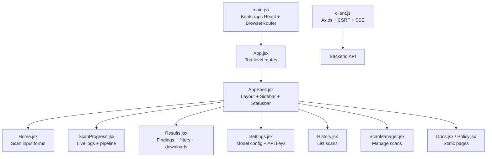
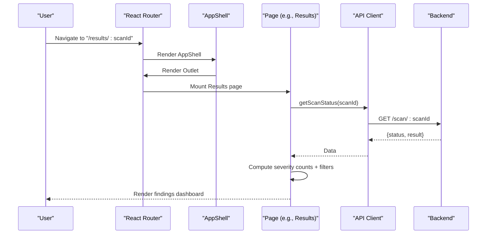
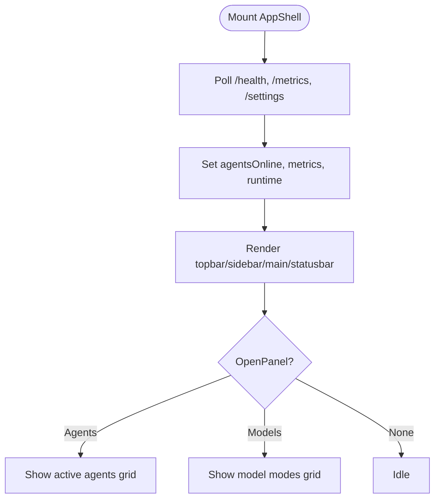
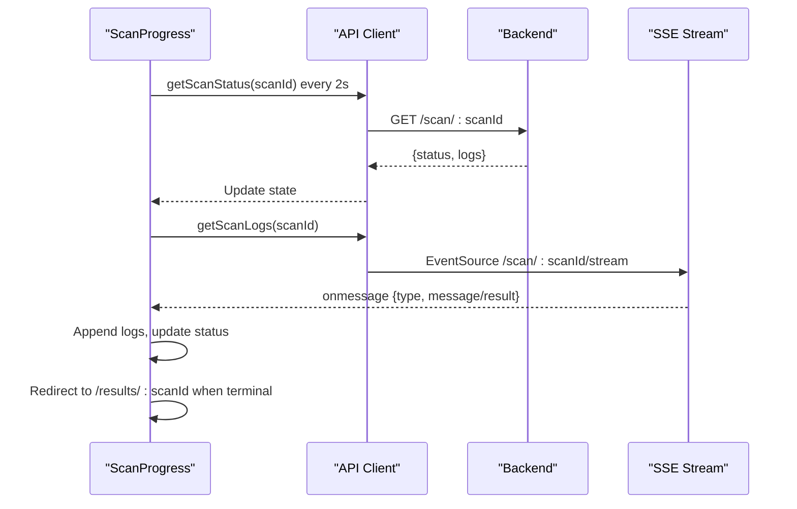
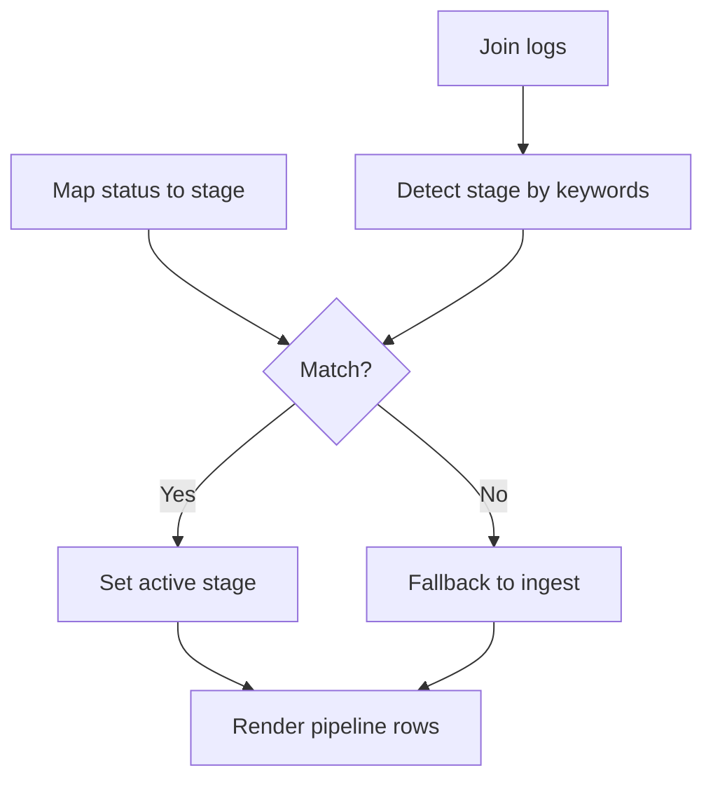
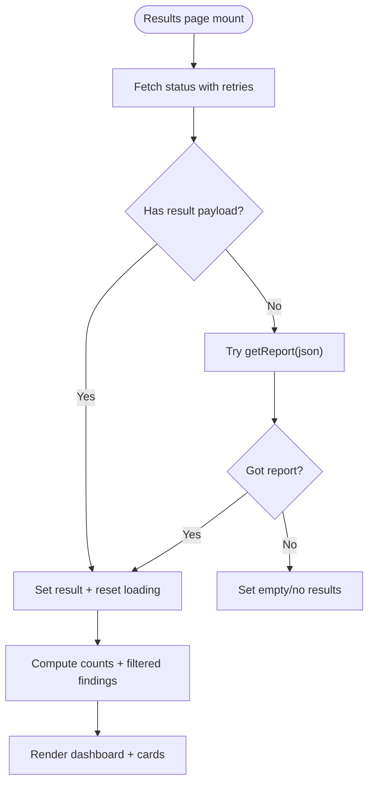
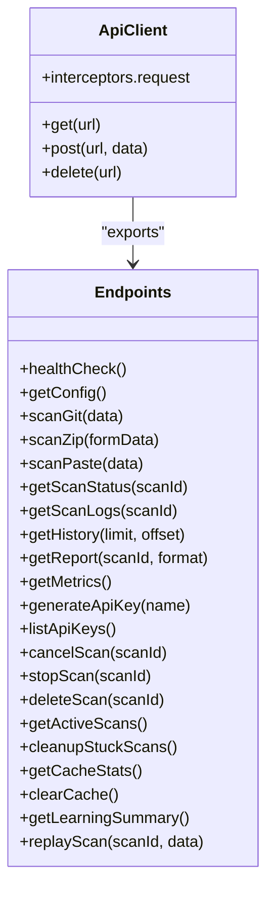
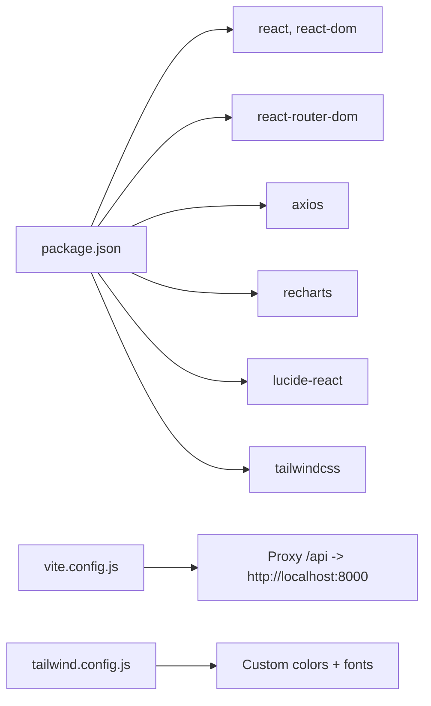

# Frontend Application

<cite>
**Referenced Files in This Document**
- [App.jsx](file://frontend/src/App.jsx)
- [main.jsx](file://frontend/src/main.jsx)
- [AppShell.jsx](file://frontend/src/components/AppShell.jsx)
- [AgentPipeline.jsx](file://frontend/src/components/AgentPipeline.jsx)
- [ResultsDashboard.jsx](file://frontend/src/components/ResultsDashboard.jsx)
- [ScanForm.jsx](file://frontend/src/components/ScanForm.jsx)
- [NavBar.jsx](file://frontend/src/components/NavBar.jsx)
- [Home.jsx](file://frontend/src/pages/Home.jsx)
- [Results.jsx](file://frontend/src/pages/Results.jsx)
- [ScanProgress.jsx](file://frontend/src/pages/ScanProgress.jsx)
- [Settings.jsx](file://frontend/src/pages/Settings.jsx)
- [client.js](file://frontend/src/api/client.js)
- [package.json](file://frontend/package.json)
- [tailwind.config.js](file://frontend/tailwind.config.js)
- [vite.config.js](file://frontend/vite.config.js)
</cite>

## Table of Contents
1. [Introduction](#introduction)
2. [Project Structure](#project-structure)
3. [Core Components](#core-components)
4. [Architecture Overview](#architecture-overview)
5. [Detailed Component Analysis](#detailed-component-analysis)
6. [Dependency Analysis](#dependency-analysis)
7. [Performance Considerations](#performance-considerations)
8. [Troubleshooting Guide](#troubleshooting-guide)
9. [Conclusion](#conclusion)
10. [Appendices](#appendices)

## Introduction
This document describes the React-based frontend application for AutoPoV, focusing on the web interface architecture and user experience. It covers the main App shell, navigation system, specialized components for workflow visualization and vulnerability display, state management approaches, routing configuration, and real-time progress streaming integration. It also documents the ScanForm for code input, Settings page for configuration management, and Results page for vulnerability review. Guidelines for component customization, styling with Tailwind CSS, responsive design, backend API integration, WebSocket/EventSource connections, user authentication flow, accessibility, cross-browser compatibility, and performance optimization are included.

## Project Structure
The frontend is a Vite-built React application with:
- A strict routing configuration under a shared App shell
- A modular component library for UI building blocks
- Dedicated pages for scanning, progress monitoring, results, history, settings, docs, and policy
- An API client wrapper around Axios for backend communication
- Tailwind CSS for styling with a custom dark theme and severity colors

**Diagram sources**
- [main.jsx:1-15](file://frontend/src/main.jsx#L1-L15)
- [App.jsx:1-31](file://frontend/src/App.jsx#L1-L31)
- [AppShell.jsx:97-414](file://frontend/src/components/AppShell.jsx#L97-L414)
- [Home.jsx:1-331](file://frontend/src/pages/Home.jsx#L1-L331)
- [ScanProgress.jsx:1-357](file://frontend/src/pages/ScanProgress.jsx#L1-L357)
- [Results.jsx:1-343](file://frontend/src/pages/Results.jsx#L1-L343)
- [Settings.jsx:1-510](file://frontend/src/pages/Settings.jsx#L1-L510)
- [client.js:1-111](file://frontend/src/api/client.js#L1-L111)

**Section sources**
- [main.jsx:1-15](file://frontend/src/main.jsx#L1-L15)
- [App.jsx:1-31](file://frontend/src/App.jsx#L1-L31)
- [package.json:1-34](file://frontend/package.json#L1-L34)
- [tailwind.config.js:1-36](file://frontend/tailwind.config.js#L1-L36)
- [vite.config.js:1-21](file://frontend/vite.config.js#L1-L21)

## Core Components
- App shell and layout: Provides topbar, sidebar navigation, main content area, and statusbar with overlay panels for agents and model modes.
- Navigation: Centralized via AppShell with route-anchored active states and persistent runtime metrics.
- Specialized components:
  - AgentPipeline: Visualizes the agent execution stages and current activity.
  - ResultsDashboard: Aggregates metrics, distributions, and cost breakdowns for reports.
  - ScanForm: Unified form for Git repo, ZIP upload, and paste code inputs.
- Pages:
  - Home: Multi-tab input form for initiating scans.
  - ScanProgress: Real-time status, logs, cancellation/stop/delete controls, and pipeline visualization.
  - Results: Vulnerability findings display with severity filtering, proven/pov views, and report downloads.
  - Settings: Model mode selection, online/offline model lists, API key management, and webhook setup.
- API client: Centralized Axios instance with CSRF cookie bootstrapping, bearer token support, SSE for live logs, and typed endpoints.

**Section sources**
- [AppShell.jsx:97-414](file://frontend/src/components/AppShell.jsx#L97-L414)
- [AgentPipeline.jsx:1-112](file://frontend/src/components/AgentPipeline.jsx#L1-L112)
- [ResultsDashboard.jsx:1-227](file://frontend/src/components/ResultsDashboard.jsx#L1-L227)
- [ScanForm.jsx:1-177](file://frontend/src/components/ScanForm.jsx#L1-L177)
- [Home.jsx:1-331](file://frontend/src/pages/Home.jsx#L1-L331)
- [ScanProgress.jsx:1-357](file://frontend/src/pages/ScanProgress.jsx#L1-L357)
- [Results.jsx:1-343](file://frontend/src/pages/Results.jsx#L1-L343)
- [Settings.jsx:1-510](file://frontend/src/pages/Settings.jsx#L1-L510)
- [client.js:1-111](file://frontend/src/api/client.js#L1-L111)

## Architecture Overview
The frontend follows a routed layout pattern:
- BrowserRouter wraps the app.
- App defines nested routes under AppShell.
- AppShell renders the global layout and periodically polls backend for health/metrics/settings.
- Pages mount inside AppShell’s Outlet and communicate with the backend via the API client.

**Diagram sources**
- [App.jsx:13-28](file://frontend/src/App.jsx#L13-L28)
- [AppShell.jsx:147-178](file://frontend/src/components/AppShell.jsx#L147-L178)
- [Results.jsx:128-195](file://frontend/src/pages/Results.jsx#L128-L195)
- [client.js:73-83](file://frontend/src/api/client.js#L73-L83)

## Detailed Component Analysis

### App Shell and Navigation
- Topbar displays connection status and model mode selector.
- Sidebar contains primary navigation items and a settings link.
- Statusbar shows agent count, total scans, confirmed, and PoVs, plus model pill button.
- Overlay panels:
  - Agents panel lists active agent names.
  - Model modes panel groups online/offline models and highlights current mode.
- Periodic polling of health, metrics, and settings endpoints keeps runtime state fresh.

**Diagram sources**
- [AppShell.jsx:147-178](file://frontend/src/components/AppShell.jsx#L147-L178)
- [AppShell.jsx:370-410](file://frontend/src/components/AppShell.jsx#L370-L410)

**Section sources**
- [AppShell.jsx:97-414](file://frontend/src/components/AppShell.jsx#L97-L414)

### Scan Progress Monitoring
- Polls scan status every 2 seconds and updates logs via EventSource stream.
- Supports cancel/stop/delete actions with confirmation dialogs.
- Renders AgentPipeline and LiveLog side-by-side.
- Automatically navigates to results after terminal states.

**Diagram sources**
- [ScanProgress.jsx:33-87](file://frontend/src/pages/ScanProgress.jsx#L33-L87)
- [client.js:75-78](file://frontend/src/api/client.js#L75-L78)

**Section sources**
- [ScanProgress.jsx:1-357](file://frontend/src/pages/ScanProgress.jsx#L1-L357)
- [client.js:75-78](file://frontend/src/api/client.js#L75-L78)

### Agent Pipeline Visualization
- Infers current stage from status and log content.
- Renders a vertical pipeline with pending/done/running/failed states.
- Terminal statuses render differently (e.g., completed vs failed).

**Diagram sources**
- [AgentPipeline.jsx:11-24](file://frontend/src/components/AgentPipeline.jsx#L11-L24)
- [AgentPipeline.jsx:53-112](file://frontend/src/components/AgentPipeline.jsx#L53-L112)

**Section sources**
- [AgentPipeline.jsx:1-112](file://frontend/src/components/AgentPipeline.jsx#L1-L112)

### Results Page and Dashboard
- Loads scan status with retries, then falls back to report retrieval.
- Computes severity counts and filters findings by severity and view mode (all/proven/pov).
- Provides JSON/PDF report downloads and OpenRouter usage aggregation.
- ResultsDashboard presents summary cards, charts, and cost breakdowns.

**Diagram sources**
- [Results.jsx:137-195](file://frontend/src/pages/Results.jsx#L137-L195)
- [Results.jsx:204-216](file://frontend/src/pages/Results.jsx#L204-L216)
- [Results.jsx:28-115](file://frontend/src/pages/Results.jsx#L28-L115)

**Section sources**
- [Results.jsx:1-343](file://frontend/src/pages/Results.jsx#L1-L343)
- [ResultsDashboard.jsx:1-227](file://frontend/src/components/ResultsDashboard.jsx#L1-L227)

### ScanForm Component
- Unified form supporting Git repository, ZIP archive upload, and inline code paste.
- Tabbed UI with icons; controlled inputs for URL, branch, language, filename, and code.
- Emits submit event with normalized payload for downstream handlers.

**Section sources**
- [ScanForm.jsx:1-177](file://frontend/src/components/ScanForm.jsx#L1-L177)

### Settings Page
- Tabs: Model Config, API Keys, Webhooks.
- Model Config:
  - Toggle online/offline mode.
  - Select a single model per mode; supports clearing selection.
  - Optional OpenRouter API key entry when not provided by environment.
- API Keys:
  - List existing keys with revocation.
  - Generate new keys with copy-to-clipboard UX.
- Webhooks:
  - Dedicated setup component integrated in the tabbed UI.

**Section sources**
- [Settings.jsx:1-510](file://frontend/src/pages/Settings.jsx#L1-L510)

### API Client and Backend Integration
- Axios instance with credentials and CSRF token injection.
- Endpoints:
  - Scans: start (git/zip/paste), status, logs stream, cancel, stop, delete, active scans, cleanup.
  - Reports: JSON/PDF retrieval.
  - Metrics, Health, Settings, Keys, Cache, Learning, Replay.
- EventSource for live logs.

**Diagram sources**
- [client.js:34-61](file://frontend/src/api/client.js#L34-L61)
- [client.js:63-111](file://frontend/src/api/client.js#L63-L111)

**Section sources**
- [client.js:1-111](file://frontend/src/api/client.js#L1-L111)

## Dependency Analysis
- Routing: React Router DOM manages nested routes under AppShell.
- Styling: Tailwind CSS with a custom dark theme and severity palette.
- Build tooling: Vite with React plugin; dev proxy to backend on port 8000.
- External libraries: Axios for HTTP, Recharts for dashboards, Lucide icons.

**Diagram sources**
- [package.json:12-31](file://frontend/package.json#L12-L31)
- [vite.config.js:7-14](file://frontend/vite.config.js#L7-L14)
- [tailwind.config.js:3-32](file://frontend/tailwind.config.js#L3-L32)

**Section sources**
- [package.json:1-34](file://frontend/package.json#L1-L34)
- [vite.config.js:1-21](file://frontend/vite.config.js#L1-L21)
- [tailwind.config.js:1-36](file://frontend/tailwind.config.js#L1-L36)

## Performance Considerations
- Minimize re-renders:
  - Use memoization for derived data (e.g., severity counts, filtered findings).
  - Use stable references for callbacks passed to child components.
- Efficient polling:
  - Debounce or coalesce frequent updates; avoid unnecessary state churn.
- Streaming:
  - Close EventSource on unmount; throttle log appends if needed.
- Rendering:
  - Virtualize long lists (findings) if they grow large.
  - Lazy-load heavy chart components if necessary.
- Bundle size:
  - Keep imports scoped; avoid unused Lucide icons.
- CSS:
  - Purge unused styles via Tailwind’s content configuration.

[No sources needed since this section provides general guidance]

## Troubleshooting Guide
- Authentication and CSRF:
  - Ensure CSRF cookie is present for non-idempotent requests; the client bootstraps it on first non-GET call.
  - For API key-required endpoints, set the Bearer token header via the dedicated client variant.
- Real-time logs:
  - Verify backend SSE endpoint availability and CORS configuration.
  - Confirm credentials are sent with the EventSource.
- Scan lifecycle:
  - On backend restarts, scan state may be lost; redirect to History and re-open the latest saved run.
- Settings persistence:
  - Model selection requires an explicit choice; saving without a selected model is blocked.
- Download failures:
  - PDF downloads require blob handling; JSON fallback is provided.

**Section sources**
- [client.js:23-31](file://frontend/src/api/client.js#L23-L31)
- [client.js:52-61](file://frontend/src/api/client.js#L52-L61)
- [ScanProgress.jsx:53-61](file://frontend/src/pages/ScanProgress.jsx#L53-L61)
- [Settings.jsx:127-152](file://frontend/src/pages/Settings.jsx#L127-L152)
- [Results.jsx:218-237](file://frontend/src/pages/Results.jsx#L218-L237)

## Conclusion
The AutoPoV frontend is a well-structured React application with a clear layout, robust routing, and real-time capabilities. Its component design emphasizes modularity and reusability, while the API client centralizes backend integration with CSRF and SSE support. The Settings and Results pages provide comprehensive configuration and reporting experiences. Following the customization, styling, and performance guidelines herein will help maintain a consistent, accessible, and efficient user interface.

[No sources needed since this section summarizes without analyzing specific files]

## Appendices

### Styling and Customization Guidelines
- Tailwind CSS:
  - Use semantic color variables (e.g., text1/text2/text3, border1/border2, accent/accent-dim).
  - Extend theme with custom severity colors and monospace/sans fonts.
  - Prefer utility classes for rapid iteration; extract reusable components for complex layouts.
- Dark theme:
  - Backgrounds: bg, surface1, surface2.
  - Borders: border1, border2.
  - Text: text1 (primary), text2 (secondary), text3 (disabled).
- Responsive design:
  - Stack vertically on small screens; use grid and flex utilities to adapt layouts.
  - Ensure adequate spacing and touch targets for mobile navigation.
- Accessibility:
  - Provide visible focus states and keyboard navigation.
  - Use semantic HTML and ARIA attributes where appropriate.
  - Maintain sufficient color contrast for severity indicators.

**Section sources**
- [tailwind.config.js:9-32](file://frontend/tailwind.config.js#L9-L32)

### Routing and Navigation
- Routes are nested under AppShell for consistent layout.
- Active states are computed based on pathname prefixes.
- Persistent runtime data (agents, metrics, model modes) is polled and displayed in the statusbar and overlay panels.

**Section sources**
- [App.jsx:13-28](file://frontend/src/App.jsx#L13-L28)
- [AppShell.jsx:180-184](file://frontend/src/components/AppShell.jsx#L180-L184)
- [AppShell.jsx:347-368](file://frontend/src/components/AppShell.jsx#L347-L368)

### Real-time Updates and WebSocket/EventSource
- EventSource is used for live logs; ensure credentials are included.
- Periodic polling complements SSE for status and metrics.
- Clean up resources on component unmount to prevent leaks.

**Section sources**
- [client.js:75-78](file://frontend/src/api/client.js#L75-L78)
- [ScanProgress.jsx:67-87](file://frontend/src/pages/ScanProgress.jsx#L67-L87)

### Cross-browser Compatibility
- Axios and modern React features are supported by current browsers.
- Polyfills may be needed for older environments (e.g., EventSource polyfill).
- Test on major browsers and adjust Tailwind utilities accordingly.

[No sources needed since this section provides general guidance]