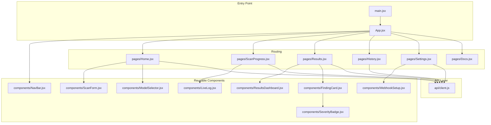
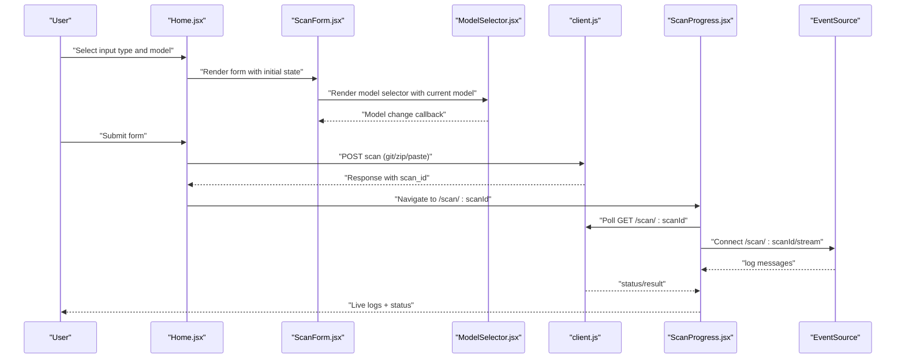
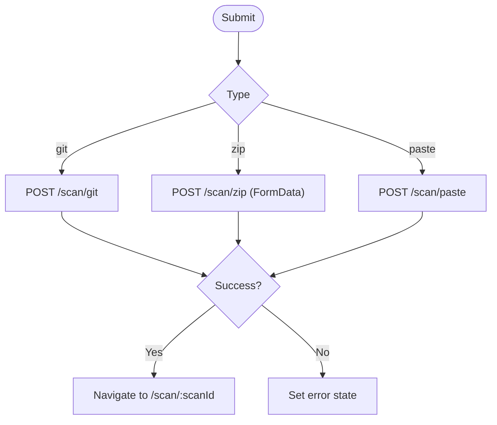
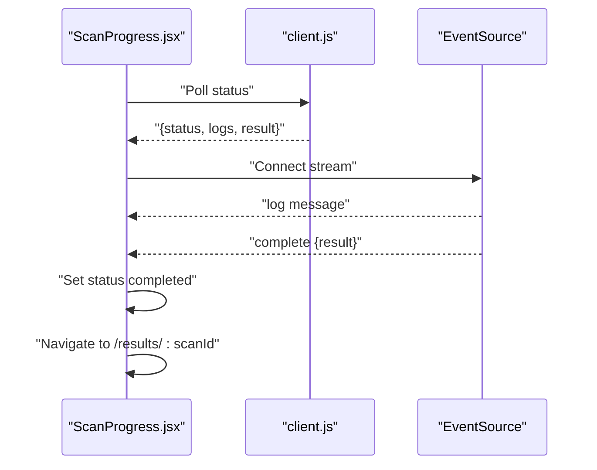
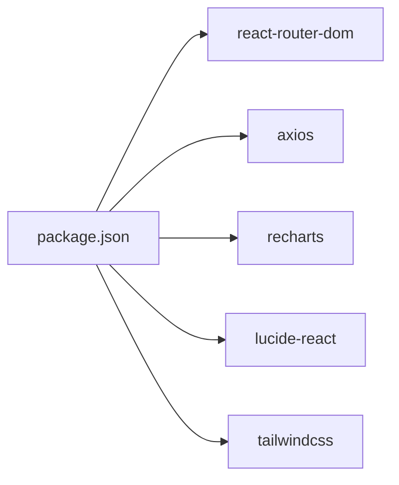

# Frontend Application

<cite>
**Referenced Files in This Document**
- [main.jsx](file://frontend/src/main.jsx)
- [App.jsx](file://frontend/src/App.jsx)
- [NavBar.jsx](file://frontend/src/components/NavBar.jsx)
- [Home.jsx](file://frontend/src/pages/Home.jsx)
- [ScanProgress.jsx](file://frontend/src/pages/ScanProgress.jsx)
- [Results.jsx](file://frontend/src/pages/Results.jsx)
- [History.jsx](file://frontend/src/pages/History.jsx)
- [Settings.jsx](file://frontend/src/pages/Settings.jsx)
- [Docs.jsx](file://frontend/src/pages/Docs.jsx)
- [ScanForm.jsx](file://frontend/src/components/ScanForm.jsx)
- [ResultsDashboard.jsx](file://frontend/src/components/ResultsDashboard.jsx)
- [SeverityBadge.jsx](file://frontend/src/components/SeverityBadge.jsx)
- [FindingCard.jsx](file://frontend/src/components/FindingCard.jsx)
- [LiveLog.jsx](file://frontend/src/components/LiveLog.jsx)
- [ModelSelector.jsx](file://frontend/src/components/ModelSelector.jsx)
- [WebhookSetup.jsx](file://frontend/src/components/WebhookSetup.jsx)
- [client.js](file://frontend/src/api/client.js)
- [package.json](file://frontend/package.json)
</cite>

## Update Summary
**Changes Made**
- Updated ModelSelector component documentation to reflect expanded provider support (OpenAI, Anthropic, Google, Meta, DeepSeek, Alibaba Cloud)
- Enhanced ScanForm documentation to highlight comprehensive input methods (Git, ZIP, code paste)
- Updated component architecture to show improved user experience with expanded model options
- Added detailed provider information and model configuration options

## Table of Contents
1. [Introduction](#introduction)
2. [Project Structure](#project-structure)
3. [Core Components](#core-components)
4. [Architecture Overview](#architecture-overview)
5. [Detailed Component Analysis](#detailed-component-analysis)
6. [Dependency Analysis](#dependency-analysis)
7. [Performance Considerations](#performance-considerations)
8. [Troubleshooting Guide](#troubleshooting-guide)
9. [Conclusion](#conclusion)
10. [Appendices](#appendices)

## Introduction
This document describes AutoPoV's React-based frontend application. It focuses on component architecture, user interface design, and user experience. The application provides scanning workflows, real-time progress monitoring, results visualization, and settings management. It integrates with a backend API using HTTP requests and Server-Sent Events (SSE) for live log streaming.

## Project Structure
The frontend is organized around a small set of pages and reusable components, with a dedicated API client module. Routing is handled by react-router-dom, and styling leverages Tailwind CSS.

**Diagram sources**
- [main.jsx:1-14](file://frontend/src/main.jsx#L1-L14)
- [App.jsx:1-29](file://frontend/src/App.jsx#L1-L29)
- [NavBar.jsx:1-48](file://frontend/src/components/NavBar.jsx#L1-L48)
- [Home.jsx:1-108](file://frontend/src/pages/Home.jsx#L1-L108)
- [ScanProgress.jsx:1-136](file://frontend/src/pages/ScanProgress.jsx#L1-L136)
- [Results.jsx:1-215](file://frontend/src/pages/Results.jsx#L1-L215)
- [History.jsx:1-142](file://frontend/src/pages/History.jsx#L1-L142)
- [Settings.jsx:1-119](file://frontend/src/pages/Settings.jsx#L1-L119)
- [Docs.jsx:1-206](file://frontend/src/pages/Docs.jsx#L1-L206)
- [ScanForm.jsx:1-242](file://frontend/src/components/ScanForm.jsx#L1-L242)
- [LiveLog.jsx:1-67](file://frontend/src/components/LiveLog.jsx#L1-L67)
- [ResultsDashboard.jsx:1-166](file://frontend/src/components/ResultsDashboard.jsx#L1-L166)
- [FindingCard.jsx:1-121](file://frontend/src/components/FindingCard.jsx#L1-L121)
- [SeverityBadge.jsx:1-27](file://frontend/src/components/SeverityBadge.jsx#L1-L27)
- [ModelSelector.jsx:1-88](file://frontend/src/components/ModelSelector.jsx#L1-L88)
- [WebhookSetup.jsx:1-89](file://frontend/src/components/WebhookSetup.jsx#L1-L89)
- [client.js:1-74](file://frontend/src/api/client.js#L1-L74)

**Section sources**
- [main.jsx:1-14](file://frontend/src/main.jsx#L1-L14)
- [App.jsx:1-29](file://frontend/src/App.jsx#L1-L29)

## Core Components
- Page components:
  - Home: Provides scanning forms and initiates scans.
  - ScanProgress: Monitors scan lifecycle with polling and SSE.
  - Results: Displays dashboard, confirmed findings, and report downloads.
  - History: Lists recent scans with status and actions.
  - Settings: Manages API key and webhook configuration.
  - Docs: API and CLI reference plus supported CWEs.
- Reusable components:
  - ScanForm: Multi-tab form supporting Git, ZIP, and paste inputs; model selection; CWE filtering.
  - ResultsDashboard: Metrics cards, distribution pie chart, bar charts, and detection stats.
  - SeverityBadge: Severity classification for CWEs.
  - FindingCard: Expandable card for individual findings with confidence, code, PoV script, and metadata.
  - LiveLog: Real-time log display with auto-scroll and color-coded messages.
  - ModelSelector: Online/offline model modes with comprehensive provider support (OpenAI, Anthropic, Google, Meta, DeepSeek, Alibaba Cloud).
  - WebhookSetup: Pre-filled webhook URLs and setup instructions.
  - NavBar: Navigation across pages.

**Updated** Enhanced ModelSelector component now supports six major providers with comprehensive model options for both online and offline modes.

**Section sources**
- [Home.jsx:1-108](file://frontend/src/pages/Home.jsx#L1-L108)
- [ScanProgress.jsx:1-136](file://frontend/src/pages/ScanProgress.jsx#L1-L136)
- [Results.jsx:1-215](file://frontend/src/pages/Results.jsx#L1-L215)
- [History.jsx:1-142](file://frontend/src/pages/History.jsx#L1-L142)
- [Settings.jsx:1-119](file://frontend/src/pages/Settings.jsx#L1-L119)
- [Docs.jsx:1-206](file://frontend/src/pages/Docs.jsx#L1-L206)
- [ScanForm.jsx:1-242](file://frontend/src/components/ScanForm.jsx#L1-L242)
- [ResultsDashboard.jsx:1-166](file://frontend/src/components/ResultsDashboard.jsx#L1-L166)
- [SeverityBadge.jsx:1-27](file://frontend/src/components/SeverityBadge.jsx#L1-L27)
- [FindingCard.jsx:1-121](file://frontend/src/components/FindingCard.jsx#L1-L121)
- [LiveLog.jsx:1-67](file://frontend/src/components/LiveLog.jsx#L1-L67)
- [ModelSelector.jsx:1-88](file://frontend/src/components/ModelSelector.jsx#L1-L88)
- [WebhookSetup.jsx:1-89](file://frontend/src/components/WebhookSetup.jsx#L1-L89)
- [NavBar.jsx:1-48](file://frontend/src/components/NavBar.jsx#L1-L48)

## Architecture Overview
The frontend uses a unidirectional data flow:
- Pages own lifecycle and orchestrate API calls.
- Components receive data via props and emit callbacks for user actions.
- The API client encapsulates base URL, auth headers, and endpoint functions.
- Real-time updates are achieved via polling and SSE.

**Diagram sources**
- [Home.jsx:12-56](file://frontend/src/pages/Home.jsx#L12-L56)
- [ScanForm.jsx:25-28](file://frontend/src/components/ScanForm.jsx#L25-L28)
- [ModelSelector.jsx:4-17](file://frontend/src/components/ModelSelector.jsx#L4-L17)
- [client.js:30-45](file://frontend/src/api/client.js#L30-L45)
- [ScanProgress.jsx:15-72](file://frontend/src/pages/ScanProgress.jsx#L15-L72)

## Detailed Component Analysis

### Page Components

#### Home
- Responsibilities:
  - Render scanning form and handle submission.
  - Manage loading and error states.
  - Navigate to scan progress upon successful initiation.
- State management:
  - Local state for loading and error.
  - Delegates form state to ScanForm.
- API integration:
  - Calls scanGit, scanZip, or scanPaste based on selected tab.
  - Uses FormData for ZIP uploads.
- UX:
  - Clear error banner and loading spinner during submission.

**Diagram sources**
- [Home.jsx:12-56](file://frontend/src/pages/Home.jsx#L12-L56)
- [client.js:30-36](file://frontend/src/api/client.js#L30-L36)

**Section sources**
- [Home.jsx:1-108](file://frontend/src/pages/Home.jsx#L1-L108)
- [client.js:1-74](file://frontend/src/api/client.js#L1-L74)

#### ScanProgress
- Responsibilities:
  - Poll scan status periodically.
  - Stream live logs via SSE.
  - Auto-navigate to results on completion.
- Real-time mechanisms:
  - Polling every 2 seconds for status and logs.
  - SSE connection to /scan/:scanId/stream.
- State management:
  - Tracks logs, status, result, and error.
- UX:
  - Animated status indicator and live scrolling logs.

**Diagram sources**
- [ScanProgress.jsx:15-72](file://frontend/src/pages/ScanProgress.jsx#L15-L72)
- [client.js:42-45](file://frontend/src/api/client.js#L42-L45)

**Section sources**
- [ScanProgress.jsx:1-136](file://frontend/src/pages/ScanProgress.jsx#L1-L136)
- [LiveLog.jsx:1-67](file://frontend/src/components/LiveLog.jsx#L1-L67)
- [client.js:1-74](file://frontend/src/api/client.js#L1-L74)

#### Results
- Responsibilities:
  - Fetch and render scan results.
  - Provide JSON/PDF report downloads.
  - Display dashboard and confirmed findings.
- State management:
  - Loading, error, and result states.
- UX:
  - Conditional rendering for loading/error/no-results states.
  - Download buttons with Blob handling.

**Section sources**
- [Results.jsx:1-215](file://frontend/src/pages/Results.jsx#L1-L215)
- [ResultsDashboard.jsx:1-166](file://frontend/src/components/ResultsDashboard.jsx#L1-L166)
- [FindingCard.jsx:1-121](file://frontend/src/components/FindingCard.jsx#L1-L121)
- [client.js:40-53](file://frontend/src/api/client.js#L40-L53)

#### History
- Responsibilities:
  - List recent scans with status, counts, and costs.
  - Navigate to results per scan.
- State management:
  - Loading, error, and scans arrays.
- UX:
  - Status badges with icons and colors.
  - Hoverable rows and action button.

**Section sources**
- [History.jsx:1-142](file://frontend/src/pages/History.jsx#L1-L142)
- [client.js:47-48](file://frontend/src/api/client.js#L47-L48)

#### Settings
- Responsibilities:
  - Store API key in localStorage.
  - Configure webhooks with pre-filled URLs.
- State management:
  - API key, saved indicator, active tab.
- UX:
  - Tabbed interface for API key and webhooks.

**Section sources**
- [Settings.jsx:1-119](file://frontend/src/pages/Settings.jsx#L1-L119)
- [WebhookSetup.jsx:1-89](file://frontend/src/components/WebhookSetup.jsx#L1-L89)

#### Docs
- Responsibilities:
  - Present API endpoints, CLI commands, and supported CWEs.
- UX:
  - Well-structured sections with code blocks and links.

**Section sources**
- [Docs.jsx:1-206](file://frontend/src/pages/Docs.jsx#L1-L206)

### Reusable Components

#### ScanForm
- Props: onSubmit, isLoading
- Behavior:
  - Tabbed input for Git URL/branch, ZIP upload, and paste code.
  - ModelSelector integration for model selection.
  - CWE checkbox filtering.
  - Controlled form state updates.
- UX:
  - Disabled submit while loading.
  - Clear visual feedback for selections.

**Updated** Integrated ModelSelector component for comprehensive model mode and selection management with expanded provider support.

**Section sources**
- [ScanForm.jsx:1-242](file://frontend/src/components/ScanForm.jsx#L1-L242)
- [ModelSelector.jsx:1-88](file://frontend/src/components/ModelSelector.jsx#L1-L88)

#### ResultsDashboard
- Props: result
- Behavior:
  - Computes metrics (totals, rates, cost, duration).
  - Renders summary cards, pie chart, bar chart, and detection stats.
- UX:
  - Responsive charts with tooltips.
  - Color-coded metrics.

**Section sources**
- [ResultsDashboard.jsx:1-166](file://frontend/src/components/ResultsDashboard.jsx#L1-L166)

#### SeverityBadge
- Props: cwe
- Behavior:
  - Maps CWE to severity level and color class.
- UX:
  - Compact, labeled badge.

**Section sources**
- [SeverityBadge.jsx:1-27](file://frontend/src/components/SeverityBadge.jsx#L1-L27)

#### FindingCard
- Props: finding
- Behavior:
  - Expandable content with explanation, code chunk, PoV script, and metadata.
  - Confidence-based color coding.
  - SeverityBadge integration.
- UX:
  - Interactive expansion with chevrons.
  - Color-coded PoV outcome.

**Section sources**
- [FindingCard.jsx:1-121](file://frontend/src/components/FindingCard.jsx#L1-L121)
- [SeverityBadge.jsx:1-27](file://frontend/src/components/SeverityBadge.jsx#L1-L27)

#### LiveLog
- Props: logs
- Behavior:
  - Auto-scrolls to bottom on new logs.
  - Parses optional timestamps and color-codes messages.
- UX:
  - Monospace font, scrollable container.

**Section sources**
- [LiveLog.jsx:1-67](file://frontend/src/components/LiveLog.jsx#L1-L67)

#### ModelSelector
- Props: value, onChange
- Behavior:
  - Toggles between online and offline model modes.
  - Renders selectable models with provider information.
  - Dynamic model options based on selected mode.
  - Displays mode-specific helper text with network requirements.
- State Management:
  - Local state for mode selection (online/offline).
  - Maintains current model value via controlled component pattern.
- UX:
  - Mode toggle with cloud (online) and CPU (offline) icons.
  - Clear visual feedback for active mode selection.
  - Provider information displayed alongside model names.
  - Helper text explaining network requirements for each mode.

**Updated** Enhanced ModelSelector now supports six major providers with comprehensive model options:
- **Online Models (requires API key)**: OpenAI GPT-4o, GPT-4o Mini, Anthropic Claude 3.5 Sonnet, Claude 3 Opus, Claude 3 Haiku, Google Gemini 2.0 Flash, Meta Llama 3.3 70B, DeepSeek DeepSeek V3, Alibaba Qwen 2.5 72B
- **Offline Models (local execution)**: Ollama Llama 3 70B, Mixtral 8x7B, CodeLlama 70B, Qwen 2.5 Coder 32B

**Section sources**
- [ModelSelector.jsx:1-88](file://frontend/src/components/ModelSelector.jsx#L1-L88)

#### WebhookSetup
- Props: none
- Behavior:
  - Generates payload URLs for GitHub/GitLab.
  - Clipboard copy with feedback.
- UX:
  - Clean two-column layout for each provider.

**Section sources**
- [WebhookSetup.jsx:1-89](file://frontend/src/components/WebhookSetup.jsx#L1-L89)

### Component Communication Patterns
- Parent-to-child props:
  - Pages pass data to components (e.g., result to ResultsDashboard, logs to LiveLog).
  - ScanForm passes model value and onChange handler to ModelSelector.
- Child-to-parent callbacks:
  - ScanForm onSubmit callback receives form data.
  - ModelSelector onChange updates parent-selected model.
- State hoisting:
  - Home manages loading/error state for ScanForm.
  - ScanProgress maintains logs and status state.
  - ModelSelector manages mode state locally while delegating model selection to parent.

**Updated** Enhanced communication pattern with ModelSelector component integration supporting expanded provider ecosystem.

**Section sources**
- [Home.jsx:12-56](file://frontend/src/pages/Home.jsx#L12-L56)
- [ScanForm.jsx:25-28](file://frontend/src/components/ScanForm.jsx#L25-L28)
- [ModelSelector.jsx:57-67](file://frontend/src/components/ModelSelector.jsx#L57-L67)
- [ScanProgress.jsx:15-72](file://frontend/src/pages/ScanProgress.jsx#L15-L72)

## Dependency Analysis
- Routing: react-router-dom
- HTTP client: axios
- Charts: recharts
- Icons: lucide-react
- Styling: Tailwind CSS via Vite/Tailwind plugin

**Diagram sources**
- [package.json:12-32](file://frontend/package.json#L12-L32)

**Section sources**
- [package.json:1-34](file://frontend/package.json#L1-L34)

## Performance Considerations
- Rendering:
  - Memoized computations in ResultsDashboard using useMemo to avoid recalculating metrics.
  - Avoid unnecessary re-renders by passing stable references where possible.
  - ModelSelector uses efficient conditional rendering based on mode state.
- Network:
  - Polling interval of 2 seconds balances responsiveness and load; consider adaptive intervals or backoff.
  - SSE fallback ensures continuity if polling is the primary mechanism.
- UX:
  - Large lists (History) benefit from virtualization if scale increases; current implementation is acceptable for modest sizes.
  - LiveLog auto-scrolls efficiently using a ref and effect.
  - ModelSelector provides instant visual feedback with minimal re-rendering.

## Troubleshooting Guide
- Authentication failures:
  - Ensure API key is configured in Settings and persisted in localStorage.
  - Verify Authorization header is injected by the request interceptor.
- SSE connectivity:
  - If SSE fails, the component continues updating via polling.
  - Confirm backend endpoint availability and CORS configuration.
- ZIP uploads:
  - Ensure multipart/form-data headers are applied by the client.
- Report downloads:
  - PDF downloads rely on blob handling; verify browser support and permissions.
- Model selection issues:
  - Online mode requires API key configuration; verify API key is set in Settings.
  - Offline mode requires local Ollama instance; ensure Ollama is running and accessible.
  - Model options may vary based on selected mode; verify appropriate model is available.
- Provider-specific issues:
  - OpenRouter API requires proper API key configuration for online models.
  - Ollama service must be running locally for offline model execution.
  - Network connectivity required for online model access.

**Updated** Added troubleshooting guidance for expanded model selection functionality and provider-specific requirements.

**Section sources**
- [client.js:5-25](file://frontend/src/api/client.js#L5-L25)
- [client.js:32-36](file://frontend/src/api/client.js#L32-L36)
- [client.js:50-53](file://frontend/src/api/client.js#L50-L53)
- [ScanProgress.jsx:46-64](file://frontend/src/pages/ScanProgress.jsx#L46-L64)

## Conclusion
The frontend follows a clean, component-driven architecture with clear separation of concerns. Pages orchestrate workflows, reusable components encapsulate UI logic, and the API client centralizes backend integration. Real-time monitoring is robust through a combination of polling and SSE, with graceful degradation. The design emphasizes clarity, responsiveness, and maintainability. The enhanced ModelSelector component significantly expands the user experience by providing comprehensive provider support with six major AI providers and intuitive model selection for both online and offline configurations.

## Appendices

### API Integration Details
- Base URL and auth:
  - Base URL is configurable via environment; Authorization header is added automatically when an API key exists.
- Endpoints used:
  - Health check, scan initiation (git/zip/paste), status retrieval, log streaming, history, reports, metrics, and key management.

**Section sources**
- [client.js:3-8](file://frontend/src/api/client.js#L3-L8)
- [client.js:28-74](file://frontend/src/api/client.js#L28-L74)

### Build and Deployment
- Scripts:
  - dev, build, lint, preview.
- Toolchain:
  - Vite, React, Tailwind CSS, PostCSS, ESLint, React Router.

**Section sources**
- [package.json:6-11](file://frontend/package.json#L6-L11)
- [package.json:20-32](file://frontend/package.json#L20-L32)

### Model Configuration Options
**Updated** Comprehensive model configuration options available through ModelSelector component:

#### Online Models (requires API key via OpenRouter)
- **OpenAI**: GPT-4o, GPT-4o Mini
- **Anthropic**: Claude 3.5 Sonnet, Claude 3 Opus, Claude 3 Haiku  
- **Google**: Gemini 2.0 Flash
- **Meta**: Llama 3.3 70B
- **DeepSeek**: DeepSeek V3
- **Alibaba**: Qwen 2.5 72B

#### Offline Models (local execution via Ollama)
- **Ollama**: Llama 3 70B, Mixtral 8x7B, CodeLlama 70B, Qwen 2.5 Coder 32B

**Section sources**
- [ModelSelector.jsx:7-24](file://frontend/src/components/ModelSelector.jsx#L7-L24)