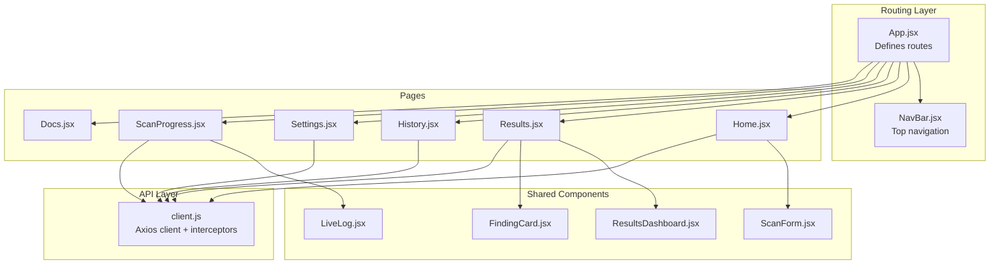
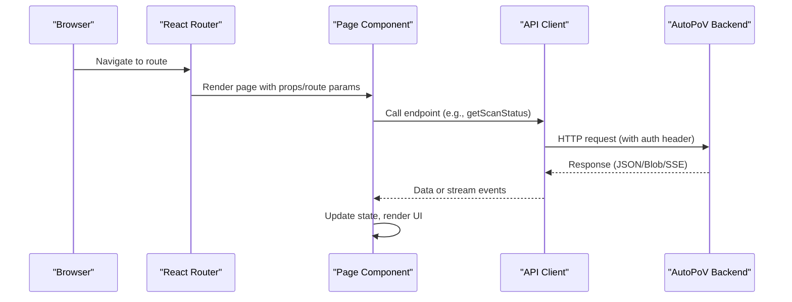
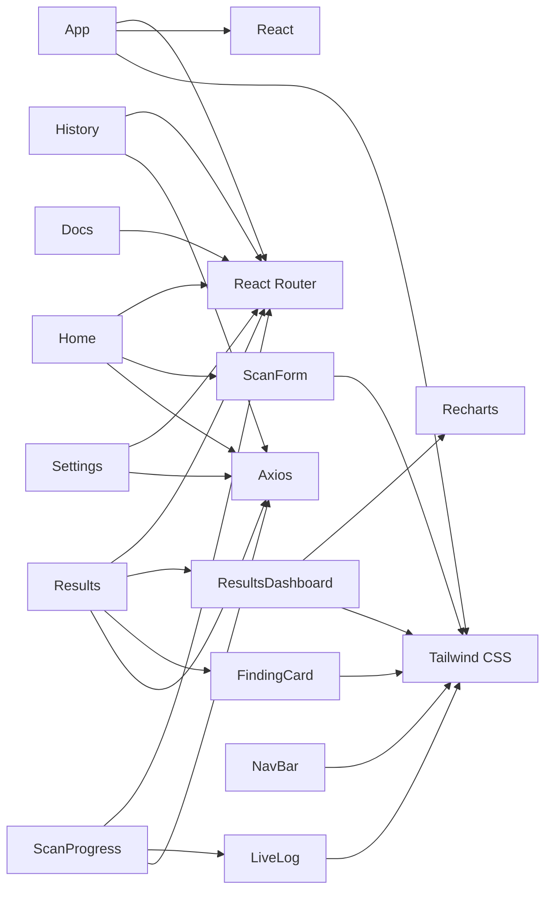

# Page Components and Navigation

<cite>
**Referenced Files in This Document**
- [App.jsx](file://autopov/frontend/src/App.jsx)
- [main.jsx](file://autopov/frontend/src/main.jsx)
- [NavBar.jsx](file://autopov/frontend/src/components/NavBar.jsx)
- [client.js](file://autopov/frontend/src/api/client.js)
- [Home.jsx](file://autopov/frontend/src/pages/Home.jsx)
- [Results.jsx](file://autopov/frontend/src/pages/Results.jsx)
- [History.jsx](file://autopov/frontend/src/pages/History.jsx)
- [Settings.jsx](file://autopov/frontend/src/pages/Settings.jsx)
- [ScanProgress.jsx](file://autopov/frontend/src/pages/ScanProgress.jsx)
- [Docs.jsx](file://autopov/frontend/src/pages/Docs.jsx)
- [ScanForm.jsx](file://autopov/frontend/src/components/ScanForm.jsx)
- [ResultsDashboard.jsx](file://autopov/frontend/src/components/ResultsDashboard.jsx)
- [FindingCard.jsx](file://autopov/frontend/src/components/FindingCard.jsx)
- [LiveLog.jsx](file://autopov/frontend/src/components/LiveLog.jsx)
- [package.json](file://autopov/frontend/package.json)
- [tailwind.config.js](file://autopov/frontend/tailwind.config.js)
</cite>

## Table of Contents
1. [Introduction](#introduction)
2. [Project Structure](#project-structure)
3. [Core Components](#core-components)
4. [Architecture Overview](#architecture-overview)
5. [Detailed Component Analysis](#detailed-component-analysis)
6. [Dependency Analysis](#dependency-analysis)
7. [Performance Considerations](#performance-considerations)
8. [Troubleshooting Guide](#troubleshooting-guide)
9. [Conclusion](#conclusion)
10. [Appendices](#appendices)

## Introduction
This document describes AutoPoV’s page-level React components and navigation system. It covers each page component—Home, Results, History, Settings, ScanProgress, and Docs—detailing their purpose, routing, data fetching strategies, lifecycle management, loading and error states, backend integration, responsive design, state management, forms, and accessibility considerations. It also explains the navigation patterns, route parameters, and how the frontend integrates with the backend API.

## Project Structure
The frontend is a Vite-built React application using Tailwind CSS for styling and React Router for navigation. Pages are organized under a dedicated pages directory and supported by shared components and an API client.

**Diagram sources**
- [App.jsx](file://autopov/frontend/src/App.jsx#L10-L26)
- [NavBar.jsx](file://autopov/frontend/src/components/NavBar.jsx#L4-L45)
- [Home.jsx](file://autopov/frontend/src/pages/Home.jsx#L1-L108)
- [Results.jsx](file://autopov/frontend/src/pages/Results.jsx#L1-L159)
- [History.jsx](file://autopov/frontend/src/pages/History.jsx#L1-L142)
- [Settings.jsx](file://autopov/frontend/src/pages/Settings.jsx#L1-L119)
- [ScanProgress.jsx](file://autopov/frontend/src/pages/ScanProgress.jsx#L1-L136)
- [Docs.jsx](file://autopov/frontend/src/pages/Docs.jsx#L1-L206)
- [ScanForm.jsx](file://autopov/frontend/src/components/ScanForm.jsx#L1-L222)
- [ResultsDashboard.jsx](file://autopov/frontend/src/components/ResultsDashboard.jsx#L1-L166)
- [FindingCard.jsx](file://autopov/frontend/src/components/FindingCard.jsx#L1-L121)
- [LiveLog.jsx](file://autopov/frontend/src/components/LiveLog.jsx#L1-L67)
- [client.js](file://autopov/frontend/src/api/client.js#L1-L69)

**Section sources**
- [App.jsx](file://autopov/frontend/src/App.jsx#L1-L29)
- [main.jsx](file://autopov/frontend/src/main.jsx#L1-L14)
- [NavBar.jsx](file://autopov/frontend/src/components/NavBar.jsx#L1-L48)
- [client.js](file://autopov/frontend/src/api/client.js#L1-L69)

## Core Components
- App: Declares top-level routes and renders the navigation bar and page content.
- NavBar: Provides active-state-aware navigation links across pages.
- API Client: Centralized Axios client with request interception for authentication and endpoint helpers for scanning, progress, history, reports, and metrics.

Key routing highlights:
- Root path "/" renders the Home page.
- Path "/scan/:scanId" renders the ScanProgress page.
- Path "/results/:scanId" renders the Results page.
- Path "/history" renders the History page.
- Path "/settings" renders the Settings page.
- Path "/docs" renders the Docs page.

**Section sources**
- [App.jsx](file://autopov/frontend/src/App.jsx#L10-L26)
- [NavBar.jsx](file://autopov/frontend/src/components/NavBar.jsx#L4-L45)
- [client.js](file://autopov/frontend/src/api/client.js#L1-L69)

## Architecture Overview
The frontend follows a clean separation of concerns:
- Routing: React Router manages navigation and route parameters.
- Pages: Each page encapsulates its own state, lifecycle, and rendering logic.
- Shared Components: Reusable UI components (forms, dashboards, cards, logs) are composed within pages.
- API Layer: Axios client centralizes HTTP interactions, request headers, and streaming endpoints.

**Diagram sources**
- [App.jsx](file://autopov/frontend/src/App.jsx#L15-L22)
- [client.js](file://autopov/frontend/src/api/client.js#L11-L25)
- [Results.jsx](file://autopov/frontend/src/pages/Results.jsx#L15-L28)
- [ScanProgress.jsx](file://autopov/frontend/src/pages/ScanProgress.jsx#L15-L72)

## Detailed Component Analysis

### Home Page
Purpose:
- Primary entry point for initiating scans via Git repository, ZIP upload, or pasted code.
- Integrates with the ScanForm component and navigates to the ScanProgress page upon successful submission.

Key behaviors:
- Route: "/"
- Form handling: Accepts three input modes (Git, ZIP, Paste) with model selection and CWE filtering.
- Data fetching: Submits scan requests to backend endpoints and extracts scan_id to navigate to the progress page.
- Error handling: Displays user-friendly errors and disables submit during loading.
- Lifecycle: Renders initial UI with feature highlights; state managed locally within the component.

Navigation pattern:
- On successful submission, navigates to "/scan/{scanId}".

Route parameters:
- None.

State management:
- Local state for loading and error messages.
- Delegated form state to ScanForm.

Integration with backend:
- Uses scanGit, scanZip, scanPaste from the API client.

Responsive design:
- Grid-based feature cards adapt to medium screens.

Accessibility:
- Semantic labels and inputs; focus styles applied via Tailwind utilities.

SEO considerations:
- Minimal SEO metadata present; consider adding meta tags in index.html for production.

**Section sources**
- [Home.jsx](file://autopov/frontend/src/pages/Home.jsx#L1-L108)
- [ScanForm.jsx](file://autopov/frontend/src/components/ScanForm.jsx#L1-L222)
- [client.js](file://autopov/frontend/src/api/client.js#L30-L38)

### Results Page
Purpose:
- Displays scan results, summary dashboard, confirmed findings, and scan metadata.
- Supports downloading reports in JSON and PDF formats.

Key behaviors:
- Route: "/results/:scanId"
- Route parameter: scanId (from URL).
- Data fetching: Retrieves scan status and result payload via getScanStatus.
- Loading and error states: Spinner while loading, error banner on failure, empty state when no result.
- Rendering: ResultsDashboard for metrics, FindingCard for each confirmed finding, and a scan info section.

Navigation pattern:
- Back button navigates to home; view history link navigates to history page.

Route parameters:
- scanId: Required.

State management:
- Local state for result, loading, and error.
- Filters confirmed findings client-side.

Integration with backend:
- getScanStatus for status/results.
- getReport for PDF/JSON downloads.

Responsive design:
- Dashboard and grids adapt to smaller screens; monospace code blocks scroll horizontally.

Accessibility:
- Proper contrast and readable typography; interactive elements have hover/focus states.

SEO considerations:
- Static page; consider dynamic meta tags for social sharing in a future enhancement.

**Section sources**
- [Results.jsx](file://autopov/frontend/src/pages/Results.jsx#L1-L159)
- [ResultsDashboard.jsx](file://autopov/frontend/src/components/ResultsDashboard.jsx#L1-L166)
- [FindingCard.jsx](file://autopov/frontend/src/components/FindingCard.jsx#L1-L121)
- [client.js](file://autopov/frontend/src/api/client.js#L40-L53)

### History Page
Purpose:
- Lists recent scan executions with status, model, counts, cost, and date.
- Allows quick navigation to individual scan results.

Key behaviors:
- Route: "/history"
- Data fetching: Retrieves paginated history via getHistory.
- Rendering: Table with status badges, counts, and action buttons.
- Interaction: Click “View” to navigate to the results page for that scan.

Route parameters:
- None.

State management:
- Local state for scans array, loading, and error.

Integration with backend:
- getHistory(limit, offset).

Responsive design:
- Table layout adapts with stacked cells on small screens; monospace IDs truncated for readability.

Accessibility:
- Accessible table markup with proper headers and row grouping.

SEO considerations:
- Static page; suitable for SEO as-is.

**Section sources**
- [History.jsx](file://autopov/frontend/src/pages/History.jsx#L1-L142)
- [client.js](file://autopov/frontend/src/api/client.js#L47-L48)

### Settings Page
Purpose:
- Manages API key configuration and webhooks.
- Persists API key in localStorage.

Key behaviors:
- Route: "/settings"
- Tabs: API Key and Webhooks.
- API key management: Load from localStorage on mount, save to localStorage, show saved feedback.
- Environment variable guidance: Displays export command for environment variable usage.

Route parameters:
- None.

State management:
- Local state for API key, saved indicator, and active tab.

Integration with backend:
- Uses generate/list API key endpoints via the API client (not rendered in this page).

Responsive design:
- Card-based layout with stacked controls on small screens.

Accessibility:
- Clear labels and keyboard-friendly inputs.

SEO considerations:
- Static page; no special SEO metadata needed.

**Section sources**
- [Settings.jsx](file://autopov/frontend/src/pages/Settings.jsx#L1-L119)

### ScanProgress Page
Purpose:
- Real-time monitoring of a running scan with live logs and status transitions.
- Automatically navigates to the Results page upon completion.

Key behaviors:
- Route: "/scan/:scanId"
- Route parameter: scanId.
- Real-time updates:
  - Polling: getScanStatus every 2 seconds.
  - Streaming: getScanLogs via Server-Sent Events for live logs.
- Navigation: Redirects to "/results/:scanId" after completion or failure.
- Rendering: Status indicator, error banner, and LiveLog component.

Route parameters:
- scanId: Required.

State management:
- Local state for logs, status, result, and error.
- Cleanup: Clears interval and closes SSE on unmount.

Integration with backend:
- getScanStatus for periodic status and logs.
- getScanLogs for SSE stream.

Responsive design:
- Single-column layout optimized for terminal-like log viewing.

Accessibility:
- Scroll-to-bottom behavior ensures latest logs remain visible.

SEO considerations:
- Dynamic page; not intended for indexing.

**Section sources**
- [ScanProgress.jsx](file://autopov/frontend/src/pages/ScanProgress.jsx#L1-L136)
- [LiveLog.jsx](file://autopov/frontend/src/components/LiveLog.jsx#L1-L67)
- [client.js](file://autopov/frontend/src/api/client.js#L40-L44)

### Docs Page
Purpose:
- Provides API and CLI reference, supported CWEs, and external links to Swagger/OpenAPI.

Key behaviors:
- Route: "/docs"
- Content sections: Overview, API Reference, CLI Reference, Supported CWEs, Links.
- Rendering: Preformatted code blocks for examples.

Route parameters:
- None.

State management:
- None; static content.

Responsive design:
- Two-column layout for supported CWEs on larger screens.

Accessibility:
- Semantic headings and code blocks with appropriate contrast.

SEO considerations:
- Static informational page; beneficial for discoverability.

**Section sources**
- [Docs.jsx](file://autopov/frontend/src/pages/Docs.jsx#L1-L206)

## Dependency Analysis
The frontend relies on:
- React and React Router for UI and routing.
- Axios for HTTP requests and SSE for live logs.
- Recharts for visualization in ResultsDashboard.
- Tailwind CSS for responsive styling.

**Diagram sources**
- [package.json](file://autopov/frontend/package.json#L12-L32)
- [App.jsx](file://autopov/frontend/src/App.jsx#L1-L29)
- [client.js](file://autopov/frontend/src/api/client.js#L1-L69)
- [ResultsDashboard.jsx](file://autopov/frontend/src/components/ResultsDashboard.jsx#L1-L166)

**Section sources**
- [package.json](file://autopov/frontend/package.json#L1-L34)
- [tailwind.config.js](file://autopov/frontend/tailwind.config.js#L1-L30)

## Performance Considerations
- Prefer server-side pagination for history if datasets grow large; current implementation uses limit/offset but could benefit from cursor-based pagination.
- Debounce or throttle SSE reconnects on network failures to avoid excessive connections.
- Lazy-load charts and heavy components only when needed (e.g., Results page).
- Optimize log rendering by virtualizing long lists in LiveLog for very large outputs.
- Minimize re-renders by memoizing derived data (e.g., metrics in ResultsDashboard) using useMemo.

## Troubleshooting Guide
Common issues and remedies:
- Authentication failures:
  - Ensure API key is set in localStorage or environment variable; the client injects Authorization headers automatically.
- Network errors:
  - Verify API base URL and CORS configuration; check browser network tab for failed requests.
- SSE connectivity:
  - Some environments block SSE; fallback polling is used, but logs may be delayed.
- Large log streams:
  - LiveLog auto-scrolls to bottom; consider pausing auto-scroll for manual inspection if needed.
- Navigation loops:
  - ScanProgress redirects to Results after completion; ensure scanId is valid and scan has reached terminal state.

**Section sources**
- [client.js](file://autopov/frontend/src/api/client.js#L6-L8)
- [client.js](file://autopov/frontend/src/api/client.js#L18-L25)
- [ScanProgress.jsx](file://autopov/frontend/src/pages/ScanProgress.jsx#L46-L72)

## Conclusion
AutoPoV’s frontend organizes scanning workflows around six focused pages with clear navigation and robust data-fetching patterns. The API client centralizes authentication and endpoints, while reusable components deliver consistent UX. The design emphasizes responsiveness and accessibility, with room for further enhancements in SEO and performance for large-scale usage.

## Appendices

### Navigation Patterns and Route Parameters
- Home: "/" — no parameters — starts scans and navigates to progress.
- ScanProgress: "/scan/:scanId" — scanId parameter — polls status and streams logs.
- Results: "/results/:scanId" — scanId parameter — loads results and supports report downloads.
- History: "/history" — no parameters — lists recent scans.
- Settings: "/settings" — no parameters — manages API key and webhooks.
- Docs: "/docs" — no parameters — informational reference.

**Section sources**
- [App.jsx](file://autopov/frontend/src/App.jsx#L15-L22)
- [Home.jsx](file://autopov/frontend/src/pages/Home.jsx#L51-L51)
- [Results.jsx](file://autopov/frontend/src/pages/Results.jsx#L9-L9)
- [ScanProgress.jsx](file://autopov/frontend/src/pages/ScanProgress.jsx#L8-L8)
- [History.jsx](file://autopov/frontend/src/pages/History.jsx#L1-L1)
- [Settings.jsx](file://autopov/frontend/src/pages/Settings.jsx#L1-L1)
- [Docs.jsx](file://autopov/frontend/src/pages/Docs.jsx#L1-L1)

### Backend Integration Summary
- Health: GET /health
- Scanning:
  - POST /scan/git
  - POST /scan/zip (multipart/form-data)
  - POST /scan/paste
- Progress:
  - GET /scan/{scan_id}
  - GET /scan/{scan_id}/stream (SSE)
- History:
  - GET /history?limit={n}&offset={m}
- Reports:
  - GET /report/{scan_id}?format=json|pdf (JSON or PDF blob)
- Metrics:
  - GET /metrics
- Keys:
  - POST /keys/generate?name=default (admin bearer)
  - GET /keys (admin bearer)

**Section sources**
- [client.js](file://autopov/frontend/src/api/client.js#L28-L67)