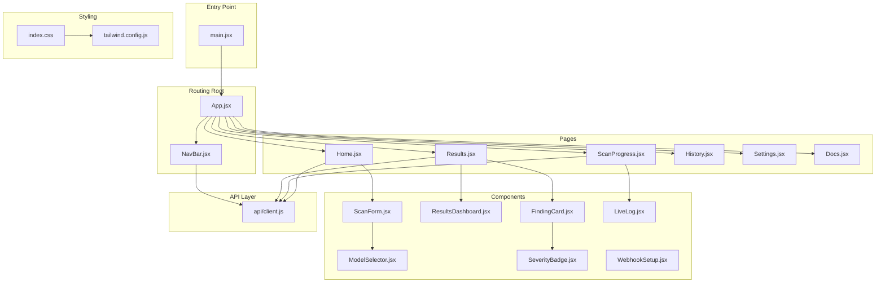
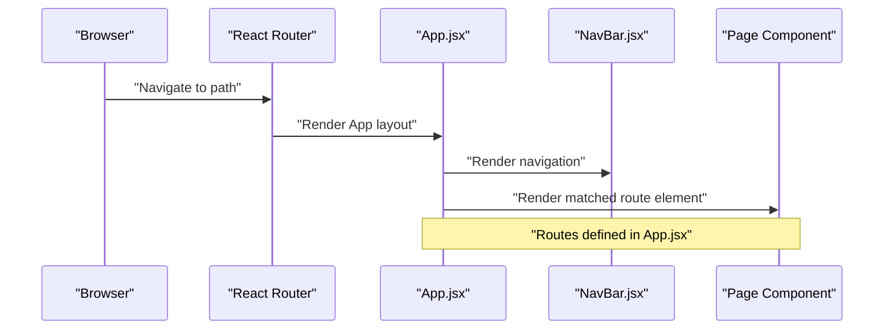
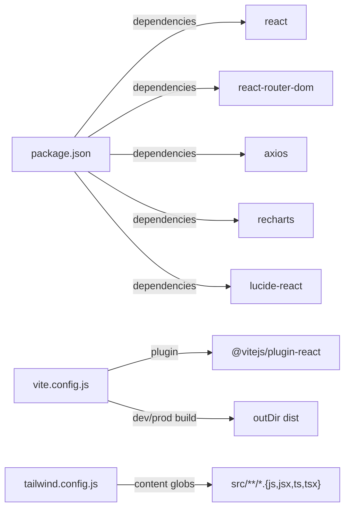

# React Component Architecture

<cite>
**Referenced Files in This Document**
- [main.jsx](file://autopov/frontend/src/main.jsx)
- [App.jsx](file://autopov/frontend/src/App.jsx)
- [NavBar.jsx](file://autopov/frontend/src/components/NavBar.jsx)
- [Home.jsx](file://autopov/frontend/src/pages/Home.jsx)
- [ScanProgress.jsx](file://autopov/frontend/src/pages/ScanProgress.jsx)
- [Results.jsx](file://autopov/frontend/src/pages/Results.jsx)
- [ResultsDashboard.jsx](file://autopov/frontend/src/components/ResultsDashboard.jsx)
- [FindingCard.jsx](file://autopov/frontend/src/components/FindingCard.jsx)
- [ScanForm.jsx](file://autopov/frontend/src/components/ScanForm.jsx)
- [client.js](file://autopov/frontend/src/api/client.js)
- [index.css](file://autopov/frontend/src/index.css)
- [package.json](file://autopov/frontend/package.json)
- [vite.config.js](file://autopov/frontend/vite.config.js)
- [tailwind.config.js](file://autopov/frontend/tailwind.config.js)
</cite>

## Table of Contents
1. [Introduction](#introduction)
2. [Project Structure](#project-structure)
3. [Core Components](#core-components)
4. [Architecture Overview](#architecture-overview)
5. [Detailed Component Analysis](#detailed-component-analysis)
6. [Dependency Analysis](#dependency-analysis)
7. [Performance Considerations](#performance-considerations)
8. [Troubleshooting Guide](#troubleshooting-guide)
9. [Conclusion](#conclusion)

## Introduction
This document explains AutoPoV's React frontend component architecture and routing system. It covers the component hierarchy starting from the root App component, the React Router configuration, routing structure, navigation patterns, component composition, state management, and integration with Vite, CSS Modules, and Tailwind CSS. It also documents lifecycle management, error handling, performance optimization, and development/production build processes.

## Project Structure
The frontend is organized into a clear feature-based structure under `autopov/frontend/src`. The main entry point initializes React and wraps the application in React Router. Routing is configured at the root App level, delegating to page components. Shared UI components reside under `components`, while page-level components are under `pages`. Styling leverages Tailwind CSS with a custom configuration and global styles.

**Diagram sources**
- [main.jsx](file://autopov/frontend/src/main.jsx#L1-L14)
- [App.jsx](file://autopov/frontend/src/App.jsx#L1-L29)
- [NavBar.jsx](file://autopov/frontend/src/components/NavBar.jsx#L1-L48)
- [Home.jsx](file://autopov/frontend/src/pages/Home.jsx#L1-L108)
- [ScanProgress.jsx](file://autopov/frontend/src/pages/ScanProgress.jsx#L1-L136)
- [Results.jsx](file://autopov/frontend/src/pages/Results.jsx#L1-L159)
- [ResultsDashboard.jsx](file://autopov/frontend/src/components/ResultsDashboard.jsx#L1-L166)
- [FindingCard.jsx](file://autopov/frontend/src/components/FindingCard.jsx#L1-L121)
- [ScanForm.jsx](file://autopov/frontend/src/components/ScanForm.jsx#L1-L222)
- [client.js](file://autopov/frontend/src/api/client.js#L1-L69)
- [index.css](file://autopov/frontend/src/index.css#L1-L73)
- [tailwind.config.js](file://autopov/frontend/tailwind.config.js#L1-L30)

**Section sources**
- [main.jsx](file://autopov/frontend/src/main.jsx#L1-L14)
- [App.jsx](file://autopov/frontend/src/App.jsx#L1-L29)
- [package.json](file://autopov/frontend/package.json#L1-L34)

## Core Components
- Root entry initializes React and React Router, then renders the App component.
- App defines top-level routes and renders the shared NavBar and page content area.
- Navigation is centralized in NavBar, which uses React Router hooks to compute active states.
- Pages encapsulate route-specific logic and orchestrate component composition.
- Components are reusable building blocks (e.g., ScanForm, ResultsDashboard, FindingCard).

Key implementation patterns:
- Route definitions in App.jsx establish the application shell and page-level routes.
- Page components manage local state and side effects (e.g., polling, SSE).
- Components receive props and compose child components to render dashboards and cards.

**Section sources**
- [main.jsx](file://autopov/frontend/src/main.jsx#L1-L14)
- [App.jsx](file://autopov/frontend/src/App.jsx#L1-L29)
- [NavBar.jsx](file://autopov/frontend/src/components/NavBar.jsx#L1-L48)

## Architecture Overview
The routing system uses React Router v6 with declarative Route definitions. The App component serves as the layout container, embedding the NavBar and a Routes block. Each route maps to a page component that manages its own state and data fetching.

**Diagram sources**
- [App.jsx](file://autopov/frontend/src/App.jsx#L15-L22)
- [NavBar.jsx](file://autopov/frontend/src/components/NavBar.jsx#L1-L48)

## Detailed Component Analysis

### App Component and Routing
- Declares top-level routes for home, scan progress, results, history, settings, and docs.
- Wraps the entire app in a dark-themed layout with a container and main content area.
- Integrates NavBar at the top for consistent navigation.

Routing highlights:
- Path "/" renders Home.
- Path "/scan/:scanId" renders ScanProgress with dynamic segment.
- Path "/results/:scanId" renders Results with dynamic segment.
- Paths "/history", "/settings", "/docs" render dedicated pages.

Navigation patterns:
- NavBar uses Link to navigate to static paths.
- Page components use useNavigate for programmatic navigation after actions.

**Section sources**
- [App.jsx](file://autopov/frontend/src/App.jsx#L10-L26)
- [NavBar.jsx](file://autopov/frontend/src/components/NavBar.jsx#L15-L40)

### Home Page
- Manages form submission via ScanForm and handles three scan modes: Git, ZIP, and Paste.
- Orchestrates API calls to start scans and navigates to the progress page upon success.
- Handles loading and error states during submission.

State management:
- Local state tracks loading and error messages.
- Delegates form state to ScanForm.

Side effects:
- Submits scan requests to backend via api/client.js.
- Navigates to `/scan/:scanId` on successful submission.

**Section sources**
- [Home.jsx](file://autopov/frontend/src/pages/Home.jsx#L7-L56)
- [ScanForm.jsx](file://autopov/frontend/src/components/ScanForm.jsx#L5-L28)

### Scan Progress Page
- Implements polling to check scan status and SSE for live logs.
- Updates state with logs and result data.
- Automatically navigates to results after completion.

Lifecycle management:
- Sets up polling interval and SSE connection on mount.
- Cleans up intervals and closes SSE on unmount.

Error handling:
- Displays errors returned from status checks.

**Section sources**
- [ScanProgress.jsx](file://autopov/frontend/src/pages/ScanProgress.jsx#L15-L72)
- [client.js](file://autopov/frontend/src/api/client.js#L42-L45)

### Results Page
- Fetches and displays scan results, including a dashboard and individual findings.
- Provides report downloads in JSON and PDF formats.
- Handles loading, error, and empty states.

Data visualization:
- Uses ResultsDashboard to render metrics and charts.
- Renders FindingCard for each confirmed finding.

**Section sources**
- [Results.jsx](file://autopov/frontend/src/pages/Results.jsx#L15-L28)
- [ResultsDashboard.jsx](file://autopov/frontend/src/components/ResultsDashboard.jsx#L5-L24)
- [FindingCard.jsx](file://autopov/frontend/src/components/FindingCard.jsx#L5-L17)

### Component Composition Patterns
- Parent components pass data down as props (e.g., result to ResultsDashboard, finding to FindingCard).
- Child components encapsulate UI concerns (e.g., ScanForm tabs, SeverityBadge rendering).
- Reusable components (ModelSelector, SeverityBadge) are imported and composed where needed.

Prop drilling strategies:
- Minimal props passed; state is kept close to where it is needed.
- No external state management library is used; React local state and hooks suffice.

**Section sources**
- [ResultsDashboard.jsx](file://autopov/frontend/src/components/ResultsDashboard.jsx#L1-L166)
- [FindingCard.jsx](file://autopov/frontend/src/components/FindingCard.jsx#L1-L121)
- [ScanForm.jsx](file://autopov/frontend/src/components/ScanForm.jsx#L1-L222)

### API Integration
- Centralized client in api/client.js abstracts HTTP requests and SSE streams.
- Authentication is handled via request interceptors using an API key from localStorage or environment.
- Exposes functions for scanning, status polling, logs streaming, history, metrics, and key management.

Build-time configuration:
- API base URL respects VITE_API_URL; defaults to localhost backend.
- Environment variables support both runtime localStorage and Vite env injection.

**Section sources**
- [client.js](file://autopov/frontend/src/api/client.js#L3-L8)
- [client.js](file://autopov/frontend/src/api/client.js#L18-L25)
- [client.js](file://autopov/frontend/src/api/client.js#L30-L66)

### Styling and Theming
- Tailwind CSS is configured with custom colors, fonts, and dark mode behavior.
- Global styles in index.css extend Tailwind utilities with custom animations, scrollbars, and code block styling.
- Utility classes are used extensively for responsive layouts and theming.

**Section sources**
- [tailwind.config.js](file://autopov/frontend/tailwind.config.js#L1-L30)
- [index.css](file://autopov/frontend/src/index.css#L1-L73)

## Dependency Analysis
External dependencies include React, React Router DOM, Axios, Recharts, and Lucide icons. Build tooling is powered by Vite with React plugin, Tailwind CSS, PostCSS, and ESLint.

**Diagram sources**
- [package.json](file://autopov/frontend/package.json#L12-L31)
- [vite.config.js](file://autopov/frontend/vite.config.js#L1-L21)
- [tailwind.config.js](file://autopov/frontend/tailwind.config.js#L3-L6)

**Section sources**
- [package.json](file://autopov/frontend/package.json#L1-L34)
- [vite.config.js](file://autopov/frontend/vite.config.js#L1-L21)

## Performance Considerations
- Memoization: ResultsDashboard uses useMemo to avoid recalculating metrics and chart data.
- Conditional rendering: Pages render loading spinners and skeleton states to improve perceived performance.
- Efficient polling: ScanProgress sets a moderate polling interval and cleans up resources on unmount.
- Lazy loading: Consider lazy-loading heavy charts or pages if bundle size grows.
- CSS: Tailwind utilities minimize custom CSS overhead; keep purgeable paths aligned with content globs.

[No sources needed since this section provides general guidance]

## Troubleshooting Guide
Common issues and resolutions:
- API connectivity: Verify VITE_API_URL and backend availability. Check Authorization header presence from localStorage or env.
- SSE failures: Fallback to polling is implemented; ensure CORS and backend streaming endpoints are reachable.
- Navigation errors: Confirm route params (e.g., :scanId) are present and match backend expectations.
- Styling anomalies: Ensure Tailwind content paths include all source files and rebuild after changes.

**Section sources**
- [client.js](file://autopov/frontend/src/api/client.js#L3-L8)
- [client.js](file://autopov/frontend/src/api/client.js#L42-L45)
- [tailwind.config.js](file://autopov/frontend/tailwind.config.js#L3-L6)

## Conclusion
AutoPoV’s frontend employs a clean, feature-based React architecture with declarative routing, minimal state management, and strong integration with Vite and Tailwind CSS. The design emphasizes composability, maintainability, and performance through targeted memoization and lifecycle cleanup. The routing system supports dynamic segments and programmatic navigation, while the API client centralizes HTTP and SSE interactions behind a cohesive interface.