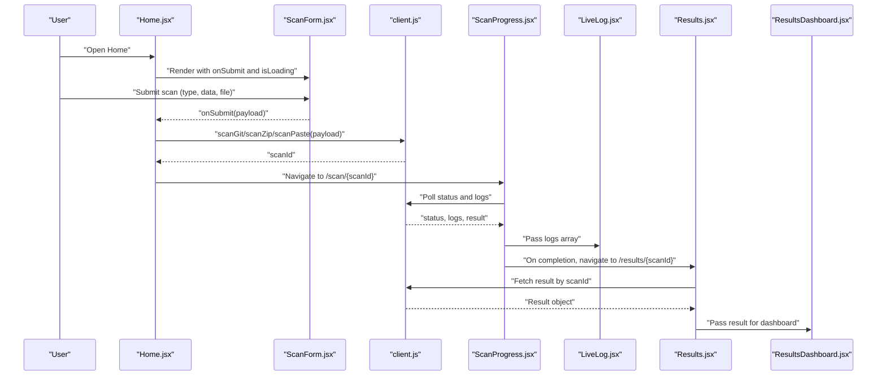
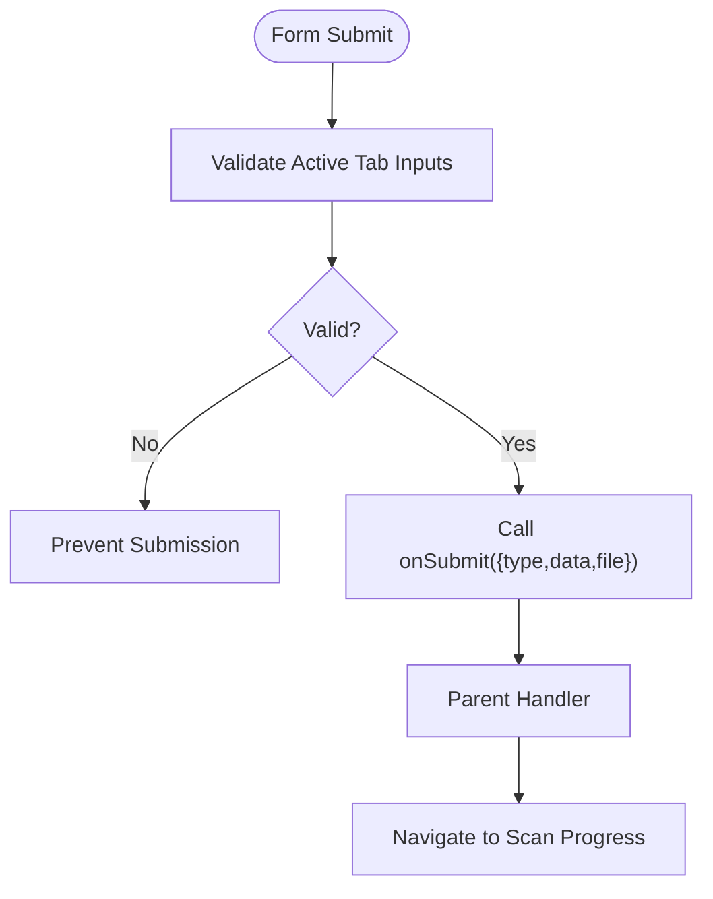
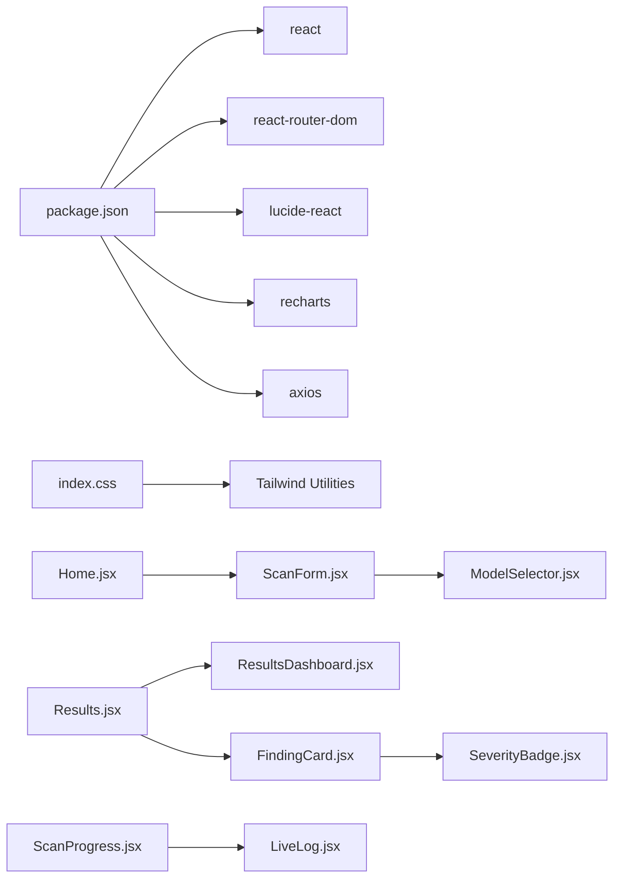

# Reusable UI Components

<cite>
**Referenced Files in This Document**
- [NavBar.jsx](file://autopov/frontend/src/components/NavBar.jsx)
- [ScanForm.jsx](file://autopov/frontend/src/components/ScanForm.jsx)
- [ResultsDashboard.jsx](file://autopov/frontend/src/components/ResultsDashboard.jsx)
- [FindingCard.jsx](file://autopov/frontend/src/components/FindingCard.jsx)
- [SeverityBadge.jsx](file://autopov/frontend/src/components/SeverityBadge.jsx)
- [LiveLog.jsx](file://autopov/frontend/src/components/LiveLog.jsx)
- [ModelSelector.jsx](file://autopov/frontend/src/components/ModelSelector.jsx)
- [WebhookSetup.jsx](file://autopov/frontend/src/components/WebhookSetup.jsx)
- [App.jsx](file://autopov/frontend/src/App.jsx)
- [main.jsx](file://autopov/frontend/src/main.jsx)
- [index.css](file://autopov/frontend/src/index.css)
- [Home.jsx](file://autopov/frontend/src/pages/Home.jsx)
- [Results.jsx](file://autopov/frontend/src/pages/Results.jsx)
- [ScanProgress.jsx](file://autopov/frontend/src/pages/ScanProgress.jsx)
- [client.js](file://autopov/frontend/src/api/client.js)
- [package.json](file://autopov/frontend/package.json)
</cite>

## Table of Contents
1. [Introduction](#introduction)
2. [Project Structure](#project-structure)
3. [Core Components](#core-components)
4. [Architecture Overview](#architecture-overview)
5. [Detailed Component Analysis](#detailed-component-analysis)
6. [Dependency Analysis](#dependency-analysis)
7. [Performance Considerations](#performance-considerations)
8. [Accessibility and UX](#accessibility-and-ux)
9. [Usage Examples and Customization](#usage-examples-and-customization)
10. [Testing Strategies](#testing-strategies)
11. [Troubleshooting Guide](#troubleshooting-guide)
12. [Conclusion](#conclusion)

## Introduction
This document describes AutoPoV’s reusable UI components and their implementation patterns. It covers component props, events, composition strategies, styling approaches, state management, accessibility, and integration with backend APIs. The components documented here are NavBar, ScanForm, ResultsDashboard, FindingCard, SeverityBadge, LiveLog, ModelSelector, and WebhookSetup.

## Project Structure
The frontend is a Vite + React application with Tailwind CSS for styling. Components are located under src/components and pages under src/pages. Routing is handled via react-router-dom, and styling is centralized in index.css with Tailwind directives.

```mermaid
graph TB
subgraph "Routing"
R["App.jsx<br/>Routes"]
end
subgraph "Navigation"
NB["NavBar.jsx"]
end
subgraph "Pages"
H["Home.jsx"]
SP["ScanProgress.jsx"]
RSLT["Results.jsx"]
end
subgraph "Components"
SF["ScanForm.jsx"]
MS["ModelSelector.jsx"]
LD["LiveLog.jsx"]
RD["ResultsDashboard.jsx"]
FC["FindingCard.jsx"]
SB["SeverityBadge.jsx"]
WS["WebhookSetup.jsx"]
end
subgraph "Styling"
ICSS["index.css"]
PKG["package.json"]
end
subgraph "API"
API["client.js"]
end
R --> NB
R --> H
R --> SP
R --> RSLT
H --> SF
SF --> MS
SP --> LD
RSLT --> RD
RD --> FC
FC --> SB
RSLT --> FC
WS -.-> RSLT
H --> API
SP --> API
RSLT --> API
ICSS --- NB
ICSS --- SF
ICSS --- LD
ICSS --- RD
ICSS --- FC
ICSS --- MS
ICSS --- WS
PKG --> ICSS
```

**Diagram sources**
- [App.jsx](file://autopov/frontend/src/App.jsx#L10-L26)
- [NavBar.jsx](file://autopov/frontend/src/components/NavBar.jsx#L4-L47)
- [Home.jsx](file://autopov/frontend/src/pages/Home.jsx#L7-L107)
- [ScanProgress.jsx](file://autopov/frontend/src/pages/ScanProgress.jsx#L7-L135)
- [Results.jsx](file://autopov/frontend/src/pages/Results.jsx#L8-L158)
- [ScanForm.jsx](file://autopov/frontend/src/components/ScanForm.jsx#L5-L221)
- [ModelSelector.jsx](file://autopov/frontend/src/components/ModelSelector.jsx#L4-L78)
- [LiveLog.jsx](file://autopov/frontend/src/components/LiveLog.jsx#L4-L66)
- [ResultsDashboard.jsx](file://autopov/frontend/src/components/ResultsDashboard.jsx#L5-L165)
- [FindingCard.jsx](file://autopov/frontend/src/components/FindingCard.jsx#L5-L120)
- [SeverityBadge.jsx](file://autopov/frontend/src/components/SeverityBadge.jsx#L1-L26)
- [WebhookSetup.jsx](file://autopov/frontend/src/components/WebhookSetup.jsx#L4-L88)
- [index.css](file://autopov/frontend/src/index.css#L1-L73)
- [package.json](file://autopov/frontend/package.json#L1-L34)
- [client.js](file://autopov/frontend/src/api/client.js)

**Section sources**
- [main.jsx](file://autopov/frontend/src/main.jsx#L1-L14)
- [App.jsx](file://autopov/frontend/src/App.jsx#L10-L26)
- [index.css](file://autopov/frontend/src/index.css#L1-L73)
- [package.json](file://autopov/frontend/package.json#L12-L31)

## Core Components
This section documents each component’s purpose, props, events, internal state, and usage patterns.

- NavBar
  - Purpose: Top navigation bar with active-state-aware links.
  - Props: None.
  - Events: None.
  - Composition: Uses react-router-dom Link and useLocation for active link styling.
  - Styling: Tailwind classes for layout and color states.
  - Accessibility: Links are semantic anchors; consider adding aria-current for explicit active state if desired.
  - Usage pattern: Render inside App layout.

- ScanForm
  - Purpose: Multi-tab form to submit scans via Git repo, ZIP upload, or code paste; selects model and CWEs.
  - Props:
    - onSubmit({ type, data, file }): Function invoked with submission payload.
    - isLoading: Boolean to disable submit and show spinner.
  - Events: Form submission triggers onSubmit.
  - Internal state:
    - activeTab: Current visible tab.
    - formData: Tracks gitUrl, branch, code, language, filename, model, cwes.
    - selectedFile: ZIP file selection.
  - Validation: Required fields per tab; form prevents submission when invalid.
  - Defaults: Default model and initial CWE list included.
  - Styling: Tailwind with dark theme classes; responsive grids and spacing.
  - Integration: Emits payload to parent handler; parent navigates to progress/results.

- ResultsDashboard
  - Purpose: Summary cards, charts, and metrics for scan results.
  - Props:
    - result: Object containing metrics (findings counts, costs, durations).
  - Events: None.
  - Internal state: Computed metrics and chart data via useMemo.
  - Styling: Tailwind grid and Recharts components; tooltip and responsive containers.
  - Accessibility: Charts include tooltips; ensure screen readers receive summaries via surrounding text.

- FindingCard
  - Purpose: Expandable card for individual findings with severity, confidence, explanation, code chunk, and PoV script.
  - Props:
    - finding: Object with fields like final_status, cwe_type, filepath, line_number, confidence, llm_explanation, code_chunk, pov_script, pov_result, inference_time_s, cost_usd.
  - Events: None.
  - Internal state: expanded toggle.
  - Styling: Tailwind with hover and expandable content areas; color-coded confidence.
  - Composition: Uses SeverityBadge for severity display.

- SeverityBadge
  - Purpose: Renders a severity label based on CWE type.
  - Props:
    - cwe: String identifier (e.g., "CWE-89").
  - Events: None.
  - Styling: Tailwind classes applied conditionally by severity level.

- LiveLog
  - Purpose: Real-time log viewer with auto-scroll and color-coded messages.
  - Props:
    - logs: Array of log strings.
  - Events: None.
  - Internal state: useRef for scroll-to-end; useEffect to auto-scroll on new logs.
  - Styling: Monospace font, dark theme container, and color-coded entries.
  - Accessibility: Color alone is not sufficient; ensure semantic meaning via surrounding context.

- ModelSelector
  - Purpose: Switch between online and offline model modes; select a specific model.
  - Props:
    - value: Currently selected model identifier.
    - onChange(model): Callback invoked on selection change.
  - Events: None.
  - Internal state: mode toggle between online/offline.
  - Styling: Tailwind toggles and select dropdown.
  - Defaults: Predefined lists for online and offline models.

- WebhookSetup
  - Purpose: Provides payload URLs and secret headers for GitHub/GitLab webhooks.
  - Props: None.
  - Events: None.
  - Internal state: copied tracking for clipboard feedback.
  - Styling: Tailwind cards and code blocks; copy-to-clipboard button with visual feedback.
  - Security note: Emphasizes setting secret environment variables.

**Section sources**
- [NavBar.jsx](file://autopov/frontend/src/components/NavBar.jsx#L4-L47)
- [ScanForm.jsx](file://autopov/frontend/src/components/ScanForm.jsx#L5-L221)
- [ResultsDashboard.jsx](file://autopov/frontend/src/components/ResultsDashboard.jsx#L5-L165)
- [FindingCard.jsx](file://autopov/frontend/src/components/FindingCard.jsx#L5-L120)
- [SeverityBadge.jsx](file://autopov/frontend/src/components/SeverityBadge.jsx#L1-L26)
- [LiveLog.jsx](file://autopov/frontend/src/components/LiveLog.jsx#L4-L66)
- [ModelSelector.jsx](file://autopov/frontend/src/components/ModelSelector.jsx#L4-L78)
- [WebhookSetup.jsx](file://autopov/frontend/src/components/WebhookSetup.jsx#L4-L88)

## Architecture Overview
The UI components integrate with routing and API clients. Pages orchestrate state and pass data down to components. Components manage minimal internal state and delegate side effects to parent pages or API modules.



**Diagram sources**
- [Home.jsx](file://autopov/frontend/src/pages/Home.jsx#L12-L56)
- [ScanForm.jsx](file://autopov/frontend/src/components/ScanForm.jsx#L25-L28)
- [client.js](file://autopov/frontend/src/api/client.js)
- [ScanProgress.jsx](file://autopov/frontend/src/pages/ScanProgress.jsx#L15-L72)
- [LiveLog.jsx](file://autopov/frontend/src/components/LiveLog.jsx#L4-L66)
- [Results.jsx](file://autopov/frontend/src/pages/Results.jsx#L15-L28)
- [ResultsDashboard.jsx](file://autopov/frontend/src/components/ResultsDashboard.jsx#L5-L24)

## Detailed Component Analysis

### NavBar
- Implementation highlights:
  - Uses useLocation to compute active link class.
  - Uses lucide-react icons for menu items.
  - Responsive layout with Tailwind utilities.
- Accessibility considerations:
  - Add aria-current="page" to active link for screen readers if needed.
- Usage pattern:
  - Place at top of App layout; integrates with react-router routes.

**Section sources**
- [NavBar.jsx](file://autopov/frontend/src/components/NavBar.jsx#L4-L47)
- [App.jsx](file://autopov/frontend/src/App.jsx#L10-L26)

### ScanForm
- Implementation highlights:
  - Tabbed interface with Git, ZIP, and Paste modes.
  - Controlled form inputs with useState.
  - CWE multi-select via checkboxes.
  - ModelSelector composition.
  - Loading state disables submit and shows spinner.
- Prop validation and defaults:
  - Defaults for model and initial CWE list are embedded in component state.
  - Required attributes on inputs enforce validation.
- Composition:
  - Delegates model selection to ModelSelector.
  - Emits a single payload to parent via onSubmit.



**Diagram sources**
- [ScanForm.jsx](file://autopov/frontend/src/components/ScanForm.jsx#L25-L28)
- [Home.jsx](file://autopov/frontend/src/pages/Home.jsx#L12-L56)

**Section sources**
- [ScanForm.jsx](file://autopov/frontend/src/components/ScanForm.jsx#L5-L221)
- [Home.jsx](file://autopov/frontend/src/pages/Home.jsx#L12-L56)

### ResultsDashboard
- Implementation highlights:
  - Computes metrics via useMemo from result prop.
  - Renders summary cards, pie chart, bar chart, and progress bars.
  - Uses Recharts for visualization.
- Prop validation:
  - Guard against missing result; returns neutral message when absent.
- Composition:
  - Consumed by Results page; expects normalized result object.

**Section sources**
- [ResultsDashboard.jsx](file://autopov/frontend/src/components/ResultsDashboard.jsx#L5-L165)
- [Results.jsx](file://autopov/frontend/src/pages/Results.jsx#L15-L28)

### FindingCard
- Implementation highlights:
  - Expandable content with chevron toggle.
  - SeverityBadge for CWE severity.
  - Conditional rendering for optional fields (code_chunk, pov_script, pov_result).
  - Confidence color coding.
- Prop validation:
  - Expects finding object with required fields; renders safely if optional fields are missing.

**Section sources**
- [FindingCard.jsx](file://autopov/frontend/src/components/FindingCard.jsx#L5-L120)
- [SeverityBadge.jsx](file://autopov/frontend/src/components/SeverityBadge.jsx#L1-L26)

### SeverityBadge
- Implementation highlights:
  - Maps CWE identifiers to severity levels and Tailwind color classes.
  - Stateless functional component returning a badge element.

**Section sources**
- [SeverityBadge.jsx](file://autopov/frontend/src/components/SeverityBadge.jsx#L1-L26)

### LiveLog
- Implementation highlights:
  - Auto-scrolls to bottom on new logs.
  - Parses timestamps and color-codes messages.
  - Smooth scroll behavior on updates.
- Prop validation:
  - Accepts empty logs array; displays placeholder message.

**Section sources**
- [LiveLog.jsx](file://autopov/frontend/src/components/LiveLog.jsx#L4-L66)
- [ScanProgress.jsx](file://autopov/frontend/src/pages/ScanProgress.jsx#L15-L72)

### ModelSelector
- Implementation highlights:
  - Mode toggle between online and offline.
  - Dynamic option list based on mode.
  - onChange callback for parent to update state.
- Defaults:
  - Predefined online and offline model lists.

**Section sources**
- [ModelSelector.jsx](file://autopov/frontend/src/components/ModelSelector.jsx#L4-L78)
- [ScanForm.jsx](file://autopov/frontend/src/components/ScanForm.jsx#L176-L179)

### WebhookSetup
- Implementation highlights:
  - Generates payload URLs based on current origin and port substitution.
  - Copy-to-clipboard with temporary feedback.
  - Lists setup steps and secret header names.

**Section sources**
- [WebhookSetup.jsx](file://autopov/frontend/src/components/WebhookSetup.jsx#L4-L88)

## Dependency Analysis
- External libraries:
  - react, react-router-dom, lucide-react, recharts, axios.
- Styling pipeline:
  - Tailwind directives in index.css; PostCSS and Vite build process.
- Component interdependencies:
  - ScanForm composes ModelSelector.
  - FindingCard composes SeverityBadge.
  - Pages orchestrate API calls and pass props to components.



**Diagram sources**
- [package.json](file://autopov/frontend/package.json#L12-L31)
- [index.css](file://autopov/frontend/src/index.css#L1-L3)
- [Home.jsx](file://autopov/frontend/src/pages/Home.jsx#L4-L5)
- [Results.jsx](file://autopov/frontend/src/pages/Results.jsx#L4-L5)
- [ScanProgress.jsx](file://autopov/frontend/src/pages/ScanProgress.jsx#L4-L5)
- [ScanForm.jsx](file://autopov/frontend/src/components/ScanForm.jsx#L3)
- [FindingCard.jsx](file://autopov/frontend/src/components/FindingCard.jsx#L3)
- [SeverityBadge.jsx](file://autopov/frontend/src/components/SeverityBadge.jsx#L1)

**Section sources**
- [package.json](file://autopov/frontend/package.json#L12-L31)
- [index.css](file://autopov/frontend/src/index.css#L1-L3)

## Performance Considerations
- Memoization:
  - ResultsDashboard uses useMemo for metrics and chart data to avoid recomputation on each render.
- Rendering lists:
  - ResultsDashboard and Results page render lists efficiently; ensure keys are stable (already present).
- Chart responsiveness:
  - Recharts ResponsiveContainer adapts to container size; keep chart sizes reasonable to avoid layout thrashing.
- Live logs:
  - LiveLog auto-scrolls on updates; consider throttling or batching log updates if logs arrive very frequently.
- Network polling:
  - ScanProgress polls status and logs; adjust intervals thoughtfully to balance responsiveness and load.

[No sources needed since this section provides general guidance]

## Accessibility and UX
- Keyboard navigation:
  - Buttons and selects are keyboard focusable; ensure tab order aligns with visual layout.
- Screen reader support:
  - SeverityBadge and LiveLog rely on color; pair with text labels or aria attributes where appropriate.
  - Consider adding aria-labels or aria-describedby for complex charts and controls.
- Focus management:
  - Auto-focus behavior is not used; ensure interactive elements are reachable via keyboard.
- Contrast and readability:
  - Dark theme with sufficient contrast; maintain readable font sizes and monospace for code blocks.

[No sources needed since this section provides general guidance]

## Usage Examples and Customization
Below are typical usage patterns and customization options for each component. Replace code snippets with your own handlers and styling as needed.

- NavBar
  - Place NavBar at the top of your App layout; it automatically reflects active route.
  - Customize colors and icons by adjusting Tailwind classes and imported icons.

- ScanForm
  - Example: Pass onSubmit and isLoading from a parent page.
  - Customization: Add or remove CWEs by updating the cweOptions list; adjust default model and initial CWEs in formData.
  - Integration: On submit, call your API client and navigate to the scan progress route.

- ResultsDashboard
  - Example: Render inside a results page after fetching result data.
  - Customization: Modify chart colors and tooltip styles in the component; adjust metric calculations as needed.

- FindingCard
  - Example: Iterate over confirmed findings and render FindingCard for each.
  - Customization: Extend conditional rendering for additional fields; adjust severity thresholds in SeverityBadge.

- SeverityBadge
  - Example: Render inside FindingCard or any component displaying CWE severity.
  - Customization: Extend the mapping function to include additional CWEs and severity levels.

- LiveLog
  - Example: Pass logs array from a polling or streaming source.
  - Customization: Adjust color scheme and timestamp parsing; add filtering or search capabilities.

- ModelSelector
  - Example: Bind value and onChange to parent state; render within ScanForm.
  - Customization: Extend online/offline model lists; add validation or help text.

- WebhookSetup
  - Example: Render on a settings or integrations page.
  - Customization: Add more providers by extending the webhooks array; include environment variable hints.

**Section sources**
- [NavBar.jsx](file://autopov/frontend/src/components/NavBar.jsx#L4-L47)
- [ScanForm.jsx](file://autopov/frontend/src/components/ScanForm.jsx#L5-L221)
- [ResultsDashboard.jsx](file://autopov/frontend/src/components/ResultsDashboard.jsx#L5-L165)
- [FindingCard.jsx](file://autopov/frontend/src/components/FindingCard.jsx#L5-L120)
- [SeverityBadge.jsx](file://autopov/frontend/src/components/SeverityBadge.jsx#L1-L26)
- [LiveLog.jsx](file://autopov/frontend/src/components/LiveLog.jsx#L4-L66)
- [ModelSelector.jsx](file://autopov/frontend/src/components/ModelSelector.jsx#L4-L78)
- [WebhookSetup.jsx](file://autopov/frontend/src/components/WebhookSetup.jsx#L4-L88)

## Testing Strategies
- Unit testing components:
  - Use a React testing library to render components with required props.
  - Test prop-driven rendering (e.g., result object for ResultsDashboard, logs array for LiveLog).
  - Simulate user interactions (toggling tabs, selecting model, copying to clipboard).
- Mock data patterns:
  - Create minimal result objects with required fields for ResultsDashboard.
  - Provide arrays of log strings for LiveLog; include timestamped entries.
  - Build formData objects matching ScanForm expectations for integration tests.
- API integration:
  - Mock axios responses for scanGit/scanZip/scanPaste and getScanStatus/getReport.
  - Verify navigation and state transitions in pages after mocked responses.
- Snapshot tests:
  - Consider snapshots for static components (NavBar, SeverityBadge) to detect unexpected layout changes.

[No sources needed since this section provides general guidance]

## Troubleshooting Guide
- Navigation and routing:
  - Ensure BrowserRouter wraps App in main.jsx; verify routes match page imports.
- Styling issues:
  - Confirm Tailwind directives are present in index.css and build completes without errors.
  - Check that custom CSS classes (e.g., status badges) are defined and applied.
- Live logs not scrolling:
  - Verify logs prop updates cause re-render; ensure useRef and scrollIntoView are called.
- Model selection not updating:
  - Confirm value and onChange are passed correctly from parent; check event handler binding.
- Results not appearing:
  - Validate result prop shape; ensure pages fetch and pass data to ResultsDashboard and FindingCard.
- Webhook URLs incorrect:
  - Confirm origin and port substitution logic; ensure server-side endpoints exist.

**Section sources**
- [main.jsx](file://autopov/frontend/src/main.jsx#L7-L13)
- [index.css](file://autopov/frontend/src/index.css#L1-L73)
- [LiveLog.jsx](file://autopov/frontend/src/components/LiveLog.jsx#L7-L9)
- [Results.jsx](file://autopov/frontend/src/pages/Results.jsx#L15-L28)
- [WebhookSetup.jsx](file://autopov/frontend/src/components/WebhookSetup.jsx#L6)

## Conclusion
These reusable UI components follow a consistent pattern of controlled props, minimal internal state, and composition with smaller building blocks. They leverage Tailwind CSS for styling and integrate seamlessly with React Router and API clients. By adhering to the documented props, events, and composition strategies, you can extend and customize the components while maintaining accessibility and performance.