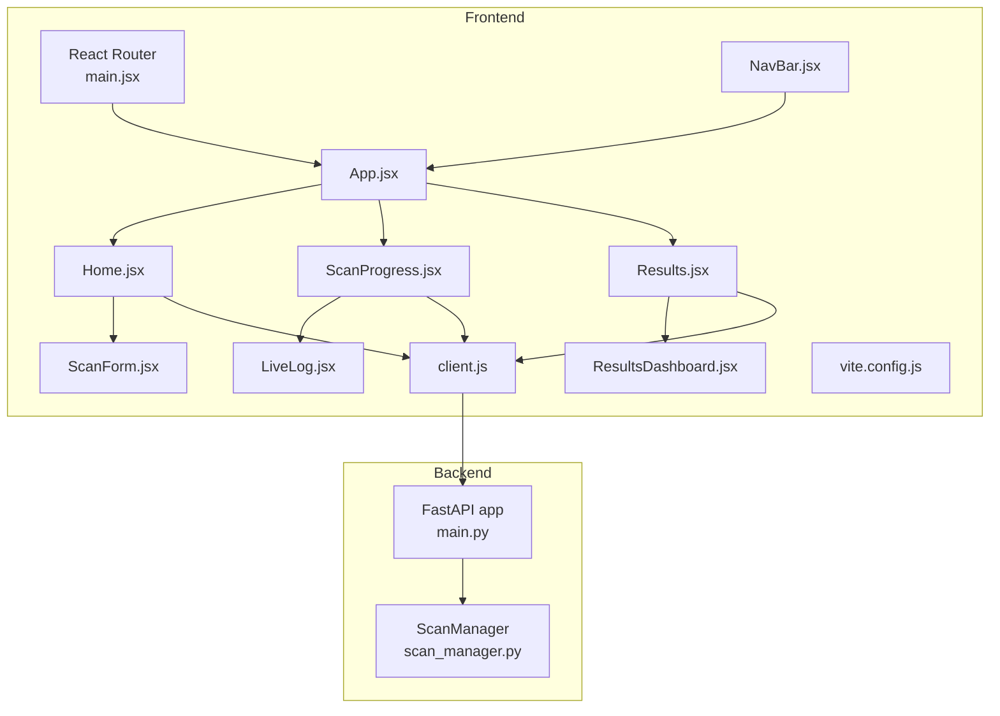
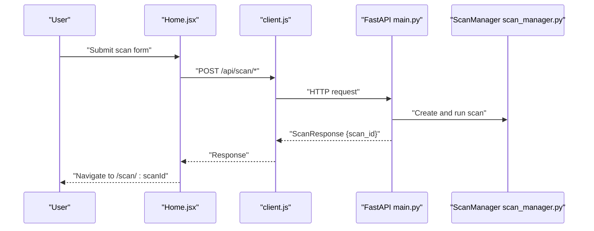
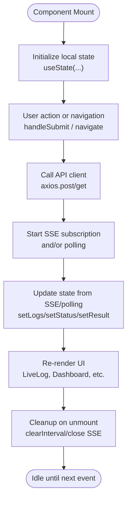
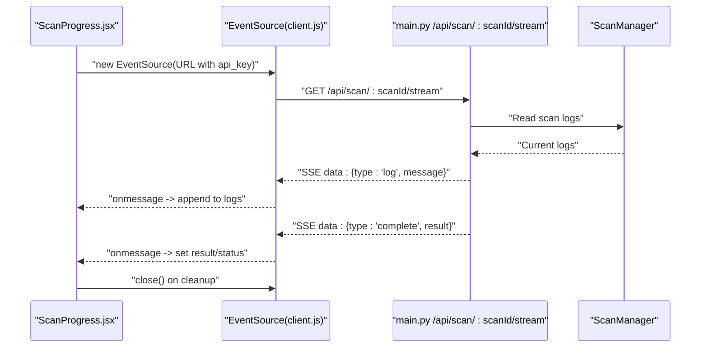
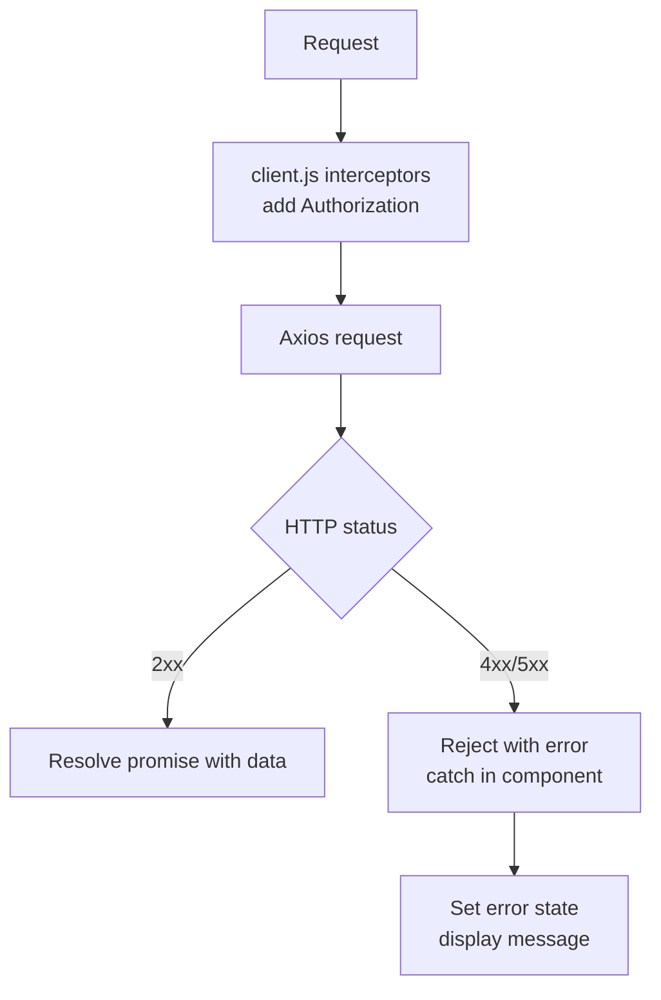
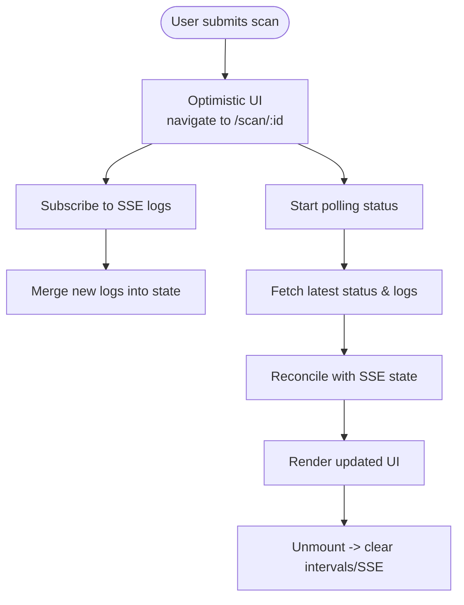
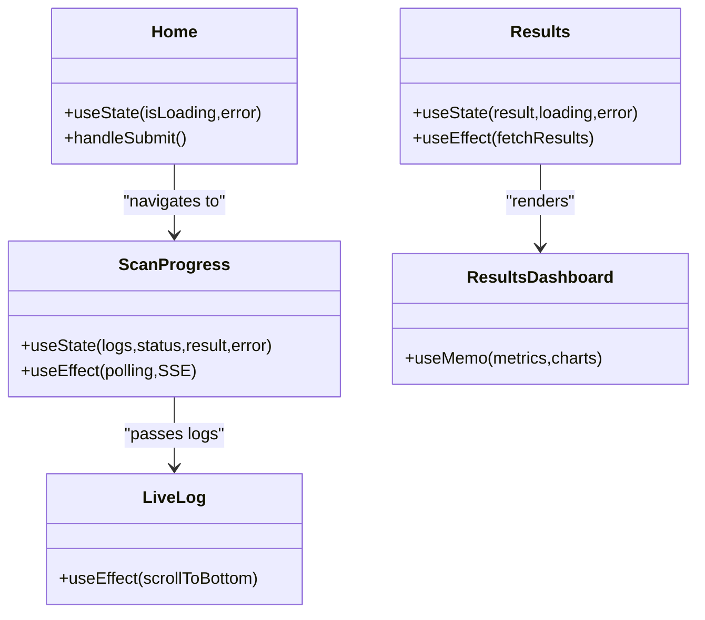
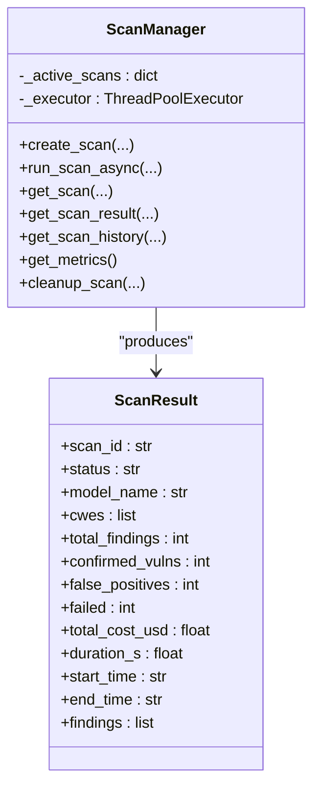
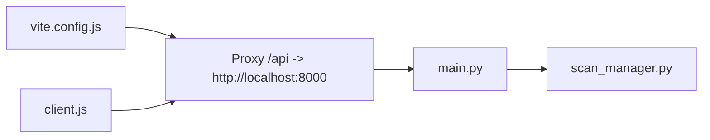

# State Management and Real-time Updates

<cite>
**Referenced Files in This Document**
- [App.jsx](file://autopov/frontend/src/App.jsx)
- [main.jsx](file://autopov/frontend/src/main.jsx)
- [client.js](file://autopov/frontend/src/api/client.js)
- [Home.jsx](file://autopov/frontend/src/pages/Home.jsx)
- [ScanProgress.jsx](file://autopov/frontend/src/pages/ScanProgress.jsx)
- [Results.jsx](file://autopov/frontend/src/pages/Results.jsx)
- [LiveLog.jsx](file://autopov/frontend/src/components/LiveLog.jsx)
- [ResultsDashboard.jsx](file://autopov/frontend/src/components/ResultsDashboard.jsx)
- [ScanForm.jsx](file://autopov/frontend/src/components/ScanForm.jsx)
- [NavBar.jsx](file://autopov/frontend/src/components/NavBar.jsx)
- [vite.config.js](file://autopov/frontend/vite.config.js)
- [main.py](file://autopov/app/main.py)
- [scan_manager.py](file://autopov/app/scan_manager.py)
</cite>

## Table of Contents
1. [Introduction](#introduction)
2. [Project Structure](#project-structure)
3. [Core Components](#core-components)
4. [Architecture Overview](#architecture-overview)
5. [Detailed Component Analysis](#detailed-component-analysis)
6. [Dependency Analysis](#dependency-analysis)
7. [Performance Considerations](#performance-considerations)
8. [Troubleshooting Guide](#troubleshooting-guide)
9. [Conclusion](#conclusion)

## Introduction
This document explains AutoPoV’s state management patterns and real-time update mechanisms. It covers:
- Local component state with React hooks
- Shared state maintained in the backend scan manager
- Data synchronization via REST APIs and Server-Sent Events (SSE)
- Optimistic updates and conflict resolution strategies
- API client configuration, request/response handling, and error management
- Examples of state initialization, update triggers, and cleanup procedures
- Performance considerations, memory management, and persistence strategies

## Project Structure
The frontend is a React application bootstrapped with Vite and Tailwind CSS. Routing is handled by React Router. The backend is a FastAPI service exposing REST endpoints and SSE streams. The frontend communicates with the backend through an Axios-based API client configured with a proxy for development.

**Diagram sources**
- [main.jsx](file://autopov/frontend/src/main.jsx#L1-L14)
- [App.jsx](file://autopov/frontend/src/App.jsx#L1-L29)
- [Home.jsx](file://autopov/frontend/src/pages/Home.jsx#L1-L108)
- [ScanProgress.jsx](file://autopov/frontend/src/pages/ScanProgress.jsx#L1-L136)
- [Results.jsx](file://autopov/frontend/src/pages/Results.jsx#L1-L159)
- [LiveLog.jsx](file://autopov/frontend/src/components/LiveLog.jsx#L1-L67)
- [ResultsDashboard.jsx](file://autopov/frontend/src/components/ResultsDashboard.jsx#L1-L166)
- [ScanForm.jsx](file://autopov/frontend/src/components/ScanForm.jsx#L1-L222)
- [NavBar.jsx](file://autopov/frontend/src/components/NavBar.jsx#L1-L48)
- [client.js](file://autopov/frontend/src/api/client.js#L1-L69)
- [vite.config.js](file://autopov/frontend/vite.config.js#L1-L20)
- [main.py](file://autopov/app/main.py#L1-L528)
- [scan_manager.py](file://autopov/app/scan_manager.py#L1-L344)

**Section sources**
- [main.jsx](file://autopov/frontend/src/main.jsx#L1-L14)
- [App.jsx](file://autopov/frontend/src/App.jsx#L1-L29)
- [client.js](file://autopov/frontend/src/api/client.js#L1-L69)
- [vite.config.js](file://autopov/frontend/vite.config.js#L1-L20)
- [main.py](file://autopov/app/main.py#L1-L528)
- [scan_manager.py](file://autopov/app/scan_manager.py#L1-L344)

## Core Components
- Frontend state management:
  - Local component state via useState and useEffect
  - Shared state in backend via ScanManager
  - Real-time updates via SSE and periodic polling fallback
- Backend state management:
  - In-memory dictionary storing scan lifecycle, logs, progress, and results
  - Persistence to JSON and CSV for historical retrieval
  - Metrics aggregation and cleanup routines

Key state update patterns:
- Initialization: form state in ScanForm, component state in ScanProgress and Results
- Triggers: user actions (form submission), SSE messages, polling intervals
- Cleanup: clearing intervals and closing SSE connections

**Section sources**
- [Home.jsx](file://autopov/frontend/src/pages/Home.jsx#L1-L108)
- [ScanForm.jsx](file://autopov/frontend/src/components/ScanForm.jsx#L1-L222)
- [ScanProgress.jsx](file://autopov/frontend/src/pages/ScanProgress.jsx#L1-L136)
- [Results.jsx](file://autopov/frontend/src/pages/Results.jsx#L1-L159)
- [LiveLog.jsx](file://autopov/frontend/src/components/LiveLog.jsx#L1-L67)
- [ResultsDashboard.jsx](file://autopov/frontend/src/components/ResultsDashboard.jsx#L1-L166)
- [client.js](file://autopov/frontend/src/api/client.js#L1-L69)
- [scan_manager.py](file://autopov/app/scan_manager.py#L40-L303)
- [main.py](file://autopov/app/main.py#L319-L386)

## Architecture Overview
The frontend initializes routing and renders pages. Home.jsx handles scan initiation and navigates to the progress page. ScanProgress.jsx polls status and subscribes to SSE for live logs. Results.jsx loads final results and supports report downloads. The backend exposes REST endpoints and SSE, maintaining state in ScanManager and persisting results.

**Diagram sources**
- [Home.jsx](file://autopov/frontend/src/pages/Home.jsx#L12-L56)
- [client.js](file://autopov/frontend/src/api/client.js#L30-L36)
- [main.py](file://autopov/app/main.py#L177-L316)
- [scan_manager.py](file://autopov/app/scan_manager.py#L50-L84)

## Detailed Component Analysis

### Frontend State Management Patterns
- Local component state:
  - Home.jsx: manages loading and error state during scan submission
  - ScanForm.jsx: maintains multi-tab form state and CWE selections
  - ScanProgress.jsx: tracks logs, status, result, and error; sets up polling and SSE
  - Results.jsx: manages loading, error, and result display; handles report downloads
  - LiveLog.jsx: renders logs with auto-scroll and formatting
  - ResultsDashboard.jsx: computes metrics and renders charts from result prop
- Shared state:
  - Backend ScanManager holds active scans, logs, progress, and results
- Real-time updates:
  - SSE stream pushes incremental logs and completion signals
  - Polling ensures resilience if SSE fails

**Diagram sources**
- [Home.jsx](file://autopov/frontend/src/pages/Home.jsx#L12-L56)
- [ScanProgress.jsx](file://autopov/frontend/src/pages/ScanProgress.jsx#L15-L72)
- [Results.jsx](file://autopov/frontend/src/pages/Results.jsx#L15-L28)
- [LiveLog.jsx](file://autopov/frontend/src/components/LiveLog.jsx#L7-L9)
- [client.js](file://autopov/frontend/src/api/client.js#L42-L45)

**Section sources**
- [Home.jsx](file://autopov/frontend/src/pages/Home.jsx#L1-L108)
- [ScanForm.jsx](file://autopov/frontend/src/components/ScanForm.jsx#L1-L222)
- [ScanProgress.jsx](file://autopov/frontend/src/pages/ScanProgress.jsx#L1-L136)
- [Results.jsx](file://autopov/frontend/src/pages/Results.jsx#L1-L159)
- [LiveLog.jsx](file://autopov/frontend/src/components/LiveLog.jsx#L1-L67)
- [ResultsDashboard.jsx](file://autopov/frontend/src/components/ResultsDashboard.jsx#L1-L166)

### Server-Sent Events (SSE) Implementation
- Frontend:
  - client.js constructs an EventSource URL with API key and listens for messages
  - ScanProgress.jsx parses messages: type=log appends to logs; type=complete sets result and status
  - Robustness: SSE errors fall back to polling; cleanup closes SSE on unmount
- Backend:
  - main.py streams logs incrementally and emits completion when scan ends
  - Maintains last log count to avoid duplicates

**Diagram sources**
- [client.js](file://autopov/frontend/src/api/client.js#L42-L45)
- [ScanProgress.jsx](file://autopov/frontend/src/pages/ScanProgress.jsx#L46-L72)
- [main.py](file://autopov/app/main.py#L350-L385)
- [scan_manager.py](file://autopov/app/scan_manager.py#L237-L239)

**Section sources**
- [client.js](file://autopov/frontend/src/api/client.js#L42-L45)
- [ScanProgress.jsx](file://autopov/frontend/src/pages/ScanProgress.jsx#L46-L72)
- [main.py](file://autopov/app/main.py#L350-L385)
- [scan_manager.py](file://autopov/app/scan_manager.py#L237-L239)

### API Client Configuration and Error Handling
- Base URL and auth:
  - client.js defines base URL and attaches Authorization header via request interceptor
  - API key sourced from localStorage or environment
- Endpoints:
  - Health, scan creation, status, logs stream, history, report, metrics, API key management
- Error handling:
  - Frontend catches errors from API calls and displays user-friendly messages
  - Backend raises HTTP exceptions with structured details

**Diagram sources**
- [client.js](file://autopov/frontend/src/api/client.js#L11-L25)
- [Home.jsx](file://autopov/frontend/src/pages/Home.jsx#L52-L56)
- [Results.jsx](file://autopov/frontend/src/pages/Results.jsx#L20-L24)

**Section sources**
- [client.js](file://autopov/frontend/src/api/client.js#L1-L69)
- [Home.jsx](file://autopov/frontend/src/pages/Home.jsx#L1-L108)
- [Results.jsx](file://autopov/frontend/src/pages/Results.jsx#L1-L159)
- [main.py](file://autopov/app/main.py#L164-L174)

### State Update Patterns, Optimistic Updates, and Conflict Resolution
- Optimistic updates:
  - Home.jsx transitions immediately to the progress page upon receiving scan_id
  - ScanProgress.jsx optimistically starts polling and SSE upon navigation
- Conflict resolution:
  - Backend state is authoritative; frontend reconciles by re-fetching status
  - SSE appends logs; polling ensures eventual consistency if SSE drops
- Cleanup:
  - Clear intervals and close SSE on component unmount to prevent leaks

**Diagram sources**
- [Home.jsx](file://autopov/frontend/src/pages/Home.jsx#L51-L51)
- [ScanProgress.jsx](file://autopov/frontend/src/pages/ScanProgress.jsx#L15-L72)

**Section sources**
- [Home.jsx](file://autopov/frontend/src/pages/Home.jsx#L1-L108)
- [ScanProgress.jsx](file://autopov/frontend/src/pages/ScanProgress.jsx#L1-L136)

### Integration with React Hooks
- useState:
  - Manages component-local state (loading, error, logs, status, result)
- useEffect:
  - Sets up polling and SSE subscriptions
  - Cleans up timers and SSE connections
- useMemo:
  - Computes dashboard metrics and chart data from result prop

**Diagram sources**
- [Home.jsx](file://autopov/frontend/src/pages/Home.jsx#L1-L108)
- [ScanProgress.jsx](file://autopov/frontend/src/pages/ScanProgress.jsx#L1-L136)
- [Results.jsx](file://autopov/frontend/src/pages/Results.jsx#L1-L159)
- [LiveLog.jsx](file://autopov/frontend/src/components/LiveLog.jsx#L1-L67)
- [ResultsDashboard.jsx](file://autopov/frontend/src/components/ResultsDashboard.jsx#L1-L166)

**Section sources**
- [Home.jsx](file://autopov/frontend/src/pages/Home.jsx#L1-L108)
- [ScanProgress.jsx](file://autopov/frontend/src/pages/ScanProgress.jsx#L1-L136)
- [Results.jsx](file://autopov/frontend/src/pages/Results.jsx#L1-L159)
- [LiveLog.jsx](file://autopov/frontend/src/components/LiveLog.jsx#L1-L67)
- [ResultsDashboard.jsx](file://autopov/frontend/src/components/ResultsDashboard.jsx#L1-L166)

### Backend State Management and Persistence
- In-memory state:
  - ScanManager stores active scans with status, logs, progress, and results
- Persistence:
  - JSON file per scan and CSV log appended per run
- Metrics:
  - Aggregated from CSV for system metrics endpoint
- Cleanup:
  - Vector store cleanup and removal of active scan entries

**Diagram sources**
- [scan_manager.py](file://autopov/app/scan_manager.py#L40-L344)

**Section sources**
- [scan_manager.py](file://autopov/app/scan_manager.py#L1-L344)
- [main.py](file://autopov/app/main.py#L319-L386)

## Dependency Analysis
- Frontend dependencies:
  - React, React Router, Axios, Recharts, Lucide icons
  - Vite proxy routes /api to backend
- Backend dependencies:
  - FastAPI, pydantic, asyncio, aiofiles, CSV/JSON persistence

**Diagram sources**
- [vite.config.js](file://autopov/frontend/vite.config.js#L9-L14)
- [client.js](file://autopov/frontend/src/api/client.js#L3-L3)
- [main.py](file://autopov/app/main.py#L1-L528)
- [scan_manager.py](file://autopov/app/scan_manager.py#L1-L344)

**Section sources**
- [vite.config.js](file://autopov/frontend/vite.config.js#L1-L20)
- [client.js](file://autopov/frontend/src/api/client.js#L1-L69)
- [main.py](file://autopov/app/main.py#L1-L528)
- [scan_manager.py](file://autopov/app/scan_manager.py#L1-L344)

## Performance Considerations
- SSE vs polling:
  - Prefer SSE for low-latency live logs; polling acts as a fallback
  - Avoid excessive polling intervals; 2 seconds is reasonable for status
- Memory management:
  - Limit logs array growth; consider capped arrays or pagination for long scans
  - Close SSE and clear intervals on unmount
- Backend throughput:
  - Thread pool executor limits concurrent scans
  - Persist results to disk to free memory; keep only active scans in memory
- Rendering:
  - useMemo for derived metrics and chart data to avoid recomputation
  - Virtualize long lists if logs become very large

[No sources needed since this section provides general guidance]

## Troubleshooting Guide
- Authentication failures:
  - Verify API key presence in localStorage or environment variable
  - Confirm Authorization header is attached by the request interceptor
- SSE connection issues:
  - Check CORS configuration and origin matching
  - Ensure EventSource URL includes a valid API key
- Polling not updating:
  - Confirm interval is cleared on unmount
  - Validate that status endpoint returns current scan state
- Backend errors:
  - Inspect HTTP exceptions raised by FastAPI endpoints
  - Review scan manager logs and persisted results

**Section sources**
- [client.js](file://autopov/frontend/src/api/client.js#L5-L8)
- [client.js](file://autopov/frontend/src/api/client.js#L18-L25)
- [main.py](file://autopov/app/main.py#L113-L120)
- [ScanProgress.jsx](file://autopov/frontend/src/pages/ScanProgress.jsx#L66-L72)

## Conclusion
AutoPoV employs a clean separation of concerns: React components manage local UI state and orchestrate real-time updates, while the backend maintains authoritative scan state and persists results. SSE delivers responsive live logs, with polling ensuring robustness. Proper cleanup, memoization, and persistence strategies support scalability and reliability.