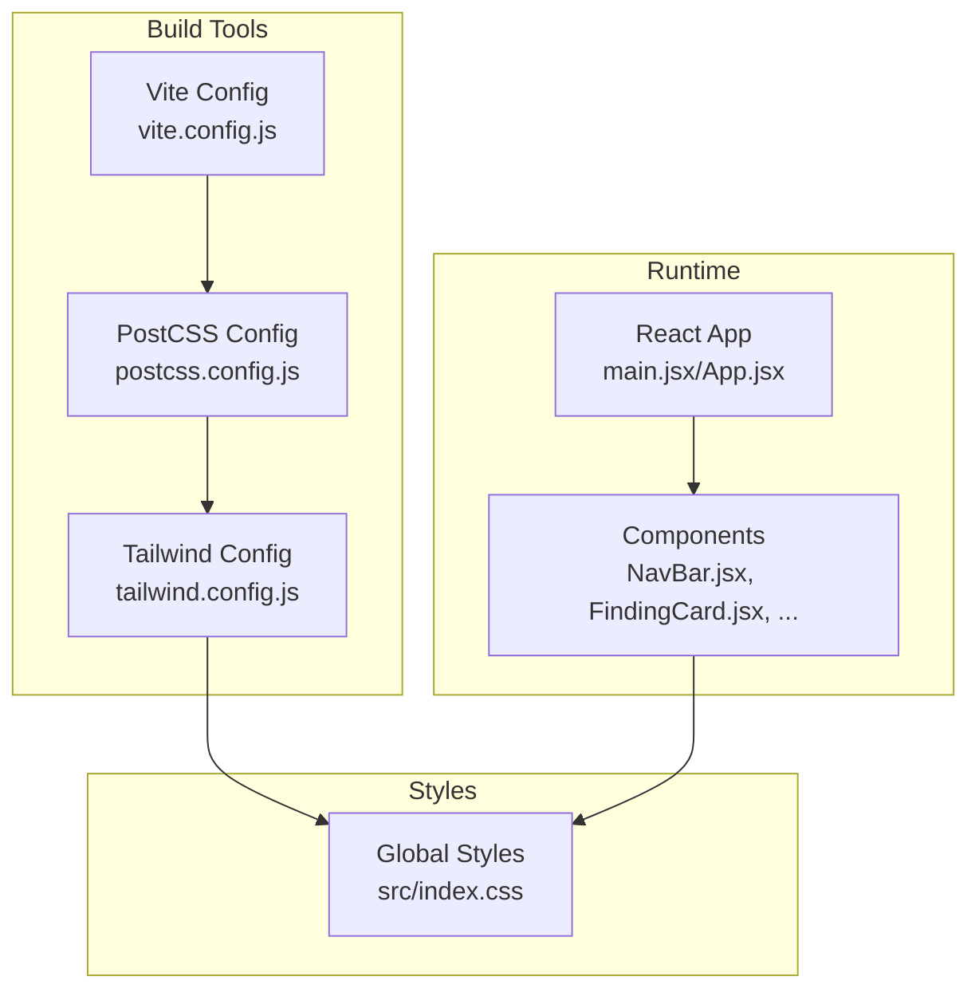
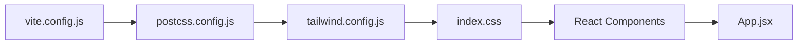

# Styling and Responsive Design

<cite>
**Referenced Files in This Document**
- [tailwind.config.js](file://autopov/frontend/tailwind.config.js)
- [postcss.config.js](file://autopov/frontend/postcss.config.js)
- [index.css](file://autopov/frontend/src/index.css)
- [package.json](file://autopov/frontend/package.json)
- [vite.config.js](file://autopov/frontend/vite.config.js)
- [App.jsx](file://autopov/frontend/src/App.jsx)
- [main.jsx](file://autopov/frontend/src/main.jsx)
- [NavBar.jsx](file://autopov/frontend/src/components/NavBar.jsx)
- [FindingCard.jsx](file://autopov/frontend/src/components/FindingCard.jsx)
- [SeverityBadge.jsx](file://autopov/frontend/src/components/SeverityBadge.jsx)
- [Home.jsx](file://autopov/frontend/src/pages/Home.jsx)
- [Results.jsx](file://autopov/frontend/src/pages/Results.jsx)
- [ResultsDashboard.jsx](file://autopov/frontend/src/components/ResultsDashboard.jsx)
- [ModelSelector.jsx](file://autopov/frontend/src/components/ModelSelector.jsx)
- [WebhookSetup.jsx](file://autopov/frontend/src/components/WebhookSetup.jsx)
</cite>

## Table of Contents
1. [Introduction](#introduction)
2. [Project Structure](#project-structure)
3. [Core Components](#core-components)
4. [Architecture Overview](#architecture-overview)
5. [Detailed Component Analysis](#detailed-component-analysis)
6. [Dependency Analysis](#dependency-analysis)
7. [Performance Considerations](#performance-considerations)
8. [Troubleshooting Guide](#troubleshooting-guide)
9. [Conclusion](#conclusion)
10. [Appendices](#appendices)

## Introduction
This document explains AutoPoV’s styling architecture and responsive design implementation. It covers Tailwind CSS configuration, custom utility classes, design system principles, responsive breakpoints, mobile-first approach, cross-device compatibility, color scheme, typography, spacing conventions, CSS-in-JS patterns, PostCSS and autoprefixer setup, build optimization, component styling patterns, theme customization, dark/light mode, browser compatibility, performance optimization, and maintenance strategies.

## Project Structure
The frontend styling stack is organized around Vite, Tailwind CSS, and PostCSS. Styles are authored in a single global stylesheet and applied via Tailwind utility classes in React components. Dark mode is controlled via a class strategy. Build-time transforms are handled by PostCSS with Tailwind and Autoprefixer plugins.



**Diagram sources**
- [vite.config.js](file://autopov/frontend/vite.config.js#L1-L21)
- [postcss.config.js](file://autopov/frontend/postcss.config.js#L1-L7)
- [tailwind.config.js](file://autopov/frontend/tailwind.config.js#L1-L30)
- [index.css](file://autopov/frontend/src/index.css#L1-L73)
- [main.jsx](file://autopov/frontend/src/main.jsx#L1-L14)
- [App.jsx](file://autopov/frontend/src/App.jsx#L1-L29)
- [NavBar.jsx](file://autopov/frontend/src/components/NavBar.jsx#L1-L48)
- [FindingCard.jsx](file://autopov/frontend/src/components/FindingCard.jsx#L1-L121)

**Section sources**
- [vite.config.js](file://autopov/frontend/vite.config.js#L1-L21)
- [postcss.config.js](file://autopov/frontend/postcss.config.js#L1-L7)
- [tailwind.config.js](file://autopov/frontend/tailwind.config.js#L1-L30)
- [index.css](file://autopov/frontend/src/index.css#L1-L73)
- [main.jsx](file://autopov/frontend/src/main.jsx#L1-L14)
- [App.jsx](file://autopov/frontend/src/App.jsx#L1-L29)

## Core Components
- Tailwind configuration defines content paths, dark mode strategy, extended colors, and fonts.
- PostCSS pipeline enables Tailwind and autoprefixer.
- Global CSS adds custom utilities, animations, and component-specific styles.
- React components apply Tailwind utilities and custom classes for layout, colors, and responsiveness.

Key implementation references:
- Tailwind dark mode class strategy and color extensions
- PostCSS plugin chain
- Global custom utilities and animations
- Component-level Tailwind usage for layout and theme

**Section sources**
- [tailwind.config.js](file://autopov/frontend/tailwind.config.js#L1-L30)
- [postcss.config.js](file://autopov/frontend/postcss.config.js#L1-L7)
- [index.css](file://autopov/frontend/src/index.css#L1-L73)
- [App.jsx](file://autopov/frontend/src/App.jsx#L10-L26)

## Architecture Overview
The styling architecture follows a layered approach:
- Build layer: Vite orchestrates dev/build; PostCSS compiles Tailwind and applies autoprefixer.
- Style layer: Tailwind scans source files and generates utilities; global CSS augments with custom utilities and animations.
- Presentation layer: React components compose Tailwind utilities and custom classes to render UI.

```mermaid
sequenceDiagram
participant Dev as "Developer"
participant Vite as "Vite Dev Server<br/>vite.config.js"
participant PostCSS as "PostCSS Pipeline<br/>postcss.config.js"
participant TW as "Tailwind Engine<br/>tailwind.config.js"
participant CSS as "Global Styles<br/>index.css"
participant React as "React Components"
Dev->>Vite : Start dev server
Vite->>PostCSS : Load plugins (tailwindcss, autoprefixer)
PostCSS->>TW : Process Tailwind utilities
TW-->>CSS : Emit utility classes
Vite->>React : Bundle and serve
React->>CSS : Apply Tailwind + custom classes
Note over Vite,CSS : Build-time : Tailwind purges unused classes; autoprefixer adds vendor prefixes
```

**Diagram sources**
- [vite.config.js](file://autopov/frontend/vite.config.js#L1-L21)
- [postcss.config.js](file://autopov/frontend/postcss.config.js#L1-L7)
- [tailwind.config.js](file://autopov/frontend/tailwind.config.js#L1-L30)
- [index.css](file://autopov/frontend/src/index.css#L1-L73)
- [main.jsx](file://autopov/frontend/src/main.jsx#L1-L14)

## Detailed Component Analysis

### Tailwind CSS Configuration
- Content scanning includes HTML and all TypeScript/JavaScript/JSX sources under src.
- Dark mode uses the class strategy, enabling dark variants via a root class toggle.
- Theme extensions:
  - Extended gray palette with deeper shades for backgrounds and borders.
  - Primary brand color scale for highlights and interactive states.
  - Font families: Inter for sans-serif and Fira Code for monospace.
- Plugins: None configured.

Design system implications:
- Consistent color tokens via extended palettes.
- Typography tokens for UI and code blocks.
- Dark mode readiness through class-based strategy.

**Section sources**
- [tailwind.config.js](file://autopov/frontend/tailwind.config.js#L1-L30)

### PostCSS and Autoprefixer
- PostCSS configuration enables Tailwind and Autoprefixer.
- Autoprefixer ensures vendor-prefixed properties for broader browser support.
- Build script runs Tailwind compilation and PostCSS transforms during development and production builds.

**Section sources**
- [postcss.config.js](file://autopov/frontend/postcss.config.js#L1-L7)
- [package.json](file://autopov/frontend/package.json#L20-L32)

### Global Styles and Utilities
- Imports Tailwind base, components, and utilities.
- Custom scrollbar styling for dark theme.
- Code block styling with monospace font and rounded corners.
- Log entry animation using a keyframe.
- Status badge utilities with consistent sizing and color tokens.
- Additional custom styles for pre/code blocks and animations.

Responsive and accessibility notes:
- Utilities drive responsive behavior (e.g., grid columns).
- Animations are scoped to specific components.

**Section sources**
- [index.css](file://autopov/frontend/src/index.css#L1-L73)

### Component Styling Patterns
- App container sets min-height, background, and text colors using Tailwind utilities.
- Navigation bar uses dark background, borders, and active-state color tokens.
- Finding card uses nested Tailwind utilities for layout, hover states, and conditional rendering.
- Severity badge maps CWE categories to severity levels and color classes.
- Home page uses max-width containers, responsive grids, and consistent spacing.
- Results page uses loading spinners, conditional layouts, and responsive dashboard cards.
- Results dashboard uses Recharts with responsive containers and dark-themed tooltips.
- Model selector toggles modes and applies active state classes.
- Webhook setup displays structured information with copy-to-clipboard affordances.

Responsive design patterns:
- Grids with column modifiers (e.g., md:grid-cols-*).
- Max-width containers and horizontal padding for content areas.
- Conditional rendering and spacing adjustments based on state.

**Section sources**
- [App.jsx](file://autopov/frontend/src/App.jsx#L10-L26)
- [NavBar.jsx](file://autopov/frontend/src/components/NavBar.jsx#L11-L44)
- [FindingCard.jsx](file://autopov/frontend/src/components/FindingCard.jsx#L25-L117)
- [SeverityBadge.jsx](file://autopov/frontend/src/components/SeverityBadge.jsx#L1-L27)
- [Home.jsx](file://autopov/frontend/src/pages/Home.jsx#L58-L103)
- [Results.jsx](file://autopov/frontend/src/pages/Results.jsx#L80-L155)
- [ResultsDashboard.jsx](file://autopov/frontend/src/components/ResultsDashboard.jsx#L42-L161)
- [ModelSelector.jsx](file://autopov/frontend/src/components/ModelSelector.jsx#L19-L75)
- [WebhookSetup.jsx](file://autopov/frontend/src/components/WebhookSetup.jsx#L29-L85)

### Dark/Light Mode Implementation
- Dark mode is enabled via the class strategy in Tailwind.
- The application root uses a dark gray background and light text by default.
- Interactive states and badges use color tokens that adapt to dark backgrounds.
- No explicit JavaScript-driven theme switching is present; dark mode relies on a root class toggle elsewhere in the application lifecycle.

**Section sources**
- [tailwind.config.js](file://autopov/frontend/tailwind.config.js#L7-L7)
- [App.jsx](file://autopov/frontend/src/App.jsx#L12-L12)
- [NavBar.jsx](file://autopov/frontend/src/components/NavBar.jsx#L12-L12)
- [ResultsDashboard.jsx](file://autopov/frontend/src/components/ResultsDashboard.jsx#L96-L98)

### Color Scheme and Typography
- Color scheme:
  - Backgrounds: gray-950, gray-900, gray-850.
  - Borders and dividers: gray-800, gray-700.
  - Brand accent: primary-500, primary-600, primary-700.
  - Status colors: green-900/green-300, blue-900/blue-300, red-900/red-300, gray-700/gray-300.
- Typography:
  - Sans-serif: Inter for UI text.
  - Monospace: Fira Code for code blocks and inline code.
- Spacing:
  - Consistent padding and margin scales using Tailwind spacing utilities.
  - Container-based layouts with horizontal padding.

**Section sources**
- [tailwind.config.js](file://autopov/frontend/tailwind.config.js#L10-L25)
- [index.css](file://autopov/frontend/src/index.css#L24-L35)
- [ResultsDashboard.jsx](file://autopov/frontend/src/components/ResultsDashboard.jsx#L96-L98)

### Responsive Breakpoints and Mobile-First Approach
- Breakpoints are Tailwind defaults; responsive modifiers are applied using md:, lg:, etc.
- Mobile-first strategy is evident in default stacked layouts with later additions for larger screens.
- Examples:
  - Grids switch from single-column to multi-column layouts at medium breakpoint.
  - Dashboard cards and charts adapt widths and spacing on larger screens.

**Section sources**
- [Home.jsx](file://autopov/frontend/src/pages/Home.jsx#L83-L102)
- [ResultsDashboard.jsx](file://autopov/frontend/src/components/ResultsDashboard.jsx#L77-L129)

### Cross-Device Compatibility Strategies
- Autoprefixer ensures vendor-prefixed properties for older browsers.
- Tailwind’s default utilities and color tokens are broadly supported.
- Custom CSS uses widely supported properties (e.g., flexbox, grid, transforms).

**Section sources**
- [postcss.config.js](file://autopov/frontend/postcss.config.js#L1-L7)
- [index.css](file://autopov/frontend/src/index.css#L1-L73)

### CSS-in-JS and Styled Components Alternatives
- No CSS-in-JS libraries are used. Styling is implemented via:
  - Tailwind utility classes directly in JSX.
  - Global CSS for custom utilities and animations.
  - Component-scoped styles through Tailwind utilities and custom classes.

**Section sources**
- [App.jsx](file://autopov/frontend/src/App.jsx#L10-L26)
- [index.css](file://autopov/frontend/src/index.css#L1-L73)

### Build Optimization and Delivery
- Vite handles bundling and dev/prod builds.
- Tailwind purges unused CSS in production builds (implicit via Tailwind CLI behavior).
- Source maps are enabled in builds for debugging.
- PostCSS pipeline runs at build time to process Tailwind and autoprefixer.

**Section sources**
- [vite.config.js](file://autopov/frontend/vite.config.js#L16-L19)
- [tailwind.config.js](file://autopov/frontend/tailwind.config.js#L3-L6)
- [package.json](file://autopov/frontend/package.json#L6-L11)

### Examples of Component Styling Patterns
- Layout containers: max-width and padding utilities for content areas.
- Interactive states: hover:bg-* and transition-colors for buttons and links.
- Responsive grids: md:grid-cols-* for dashboard layouts.
- Status indicators: custom status-badge classes with consistent sizing and color tokens.
- Code presentation: pre and code blocks with dark backgrounds and monospace fonts.

**Section sources**
- [Home.jsx](file://autopov/frontend/src/pages/Home.jsx#L58-L103)
- [Results.jsx](file://autopov/frontend/src/pages/Results.jsx#L80-L155)
- [ResultsDashboard.jsx](file://autopov/frontend/src/components/ResultsDashboard.jsx#L42-L161)
- [SeverityBadge.jsx](file://autopov/frontend/src/components/SeverityBadge.jsx#L19-L24)
- [index.css](file://autopov/frontend/src/index.css#L24-L35)

### Theme Customization and Extensibility
- Extend Tailwind colors and fonts in the Tailwind configuration.
- Add new custom utilities in the global stylesheet.
- Maintain consistency by reusing color tokens and typography scales across components.

**Section sources**
- [tailwind.config.js](file://autopov/frontend/tailwind.config.js#L8-L26)
- [index.css](file://autopov/frontend/src/index.css#L53-L72)

## Dependency Analysis
The styling stack depends on Tailwind and PostCSS for compile-time transformations, with Vite orchestrating the build. React components depend on Tailwind utilities and global CSS classes.



**Diagram sources**
- [vite.config.js](file://autopov/frontend/vite.config.js#L1-L21)
- [postcss.config.js](file://autopov/frontend/postcss.config.js#L1-L7)
- [tailwind.config.js](file://autopov/frontend/tailwind.config.js#L1-L30)
- [index.css](file://autopov/frontend/src/index.css#L1-L73)
- [App.jsx](file://autopov/frontend/src/App.jsx#L1-L29)

**Section sources**
- [vite.config.js](file://autopov/frontend/vite.config.js#L1-L21)
- [postcss.config.js](file://autopov/frontend/postcss.config.js#L1-L7)
- [tailwind.config.js](file://autopov/frontend/tailwind.config.js#L1-L30)
- [index.css](file://autopov/frontend/src/index.css#L1-L73)
- [App.jsx](file://autopov/frontend/src/App.jsx#L1-L29)

## Performance Considerations
- Tailwind purging reduces CSS bundle size; ensure content globs cover all source files.
- Prefer utility classes over custom CSS to leverage purging.
- Keep animations scoped and minimal to avoid layout thrashing.
- Use responsive variants judiciously to avoid generating excessive media queries.
- Autoprefixer adds vendor prefixes; keep versions current to minimize redundant prefixes.

[No sources needed since this section provides general guidance]

## Troubleshooting Guide
Common styling issues and resolutions:
- Utilities not applying:
  - Verify Tailwind content paths include the relevant files.
  - Ensure PostCSS plugins are loaded in the build pipeline.
- Dark mode not activating:
  - Confirm the root class strategy is applied at runtime.
  - Check that dark variants are available in the Tailwind configuration.
- Custom utilities missing:
  - Confirm global CSS is imported in the entry file.
  - Validate PostCSS pipeline includes Tailwind and Autoprefixer.
- Responsive layout regressions:
  - Review responsive modifiers and ensure breakpoints align with design goals.
  - Test on multiple viewport sizes.

**Section sources**
- [tailwind.config.js](file://autopov/frontend/tailwind.config.js#L3-L6)
- [postcss.config.js](file://autopov/frontend/postcss.config.js#L1-L7)
- [main.jsx](file://autopov/frontend/src/main.jsx#L5-L5)
- [index.css](file://autopov/frontend/src/index.css#L1-L3)

## Conclusion
AutoPoV employs a clean, maintainable styling architecture centered on Tailwind CSS, PostCSS, and Vite. The design system emphasizes a dark theme, consistent color and typography tokens, and a mobile-first responsive approach. Utility-first styling, combined with global custom utilities and animations, delivers a cohesive and extensible UI foundation. The build pipeline optimizes CSS delivery while ensuring broad browser compatibility.

[No sources needed since this section summarizes without analyzing specific files]

## Appendices

### Responsive Breakpoints Reference
- Tailwind default breakpoints are used; responsive modifiers include:
  - sm, md, lg, xl, 2xl
- Example usage patterns:
  - md:grid-cols-2 for two-column layout on medium screens and above.

**Section sources**
- [Home.jsx](file://autopov/frontend/src/pages/Home.jsx#L83-L102)
- [ResultsDashboard.jsx](file://autopov/frontend/src/components/ResultsDashboard.jsx#L77-L129)

### Browser Compatibility Notes
- Autoprefixer adds vendor-prefixed properties for older browsers.
- Tailwind utilities are widely supported; verify specific features if targeting legacy environments.

**Section sources**
- [postcss.config.js](file://autopov/frontend/postcss.config.js#L1-L7)
- [index.css](file://autopov/frontend/src/index.css#L1-L73)