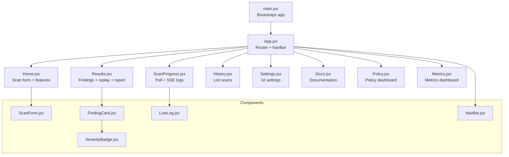
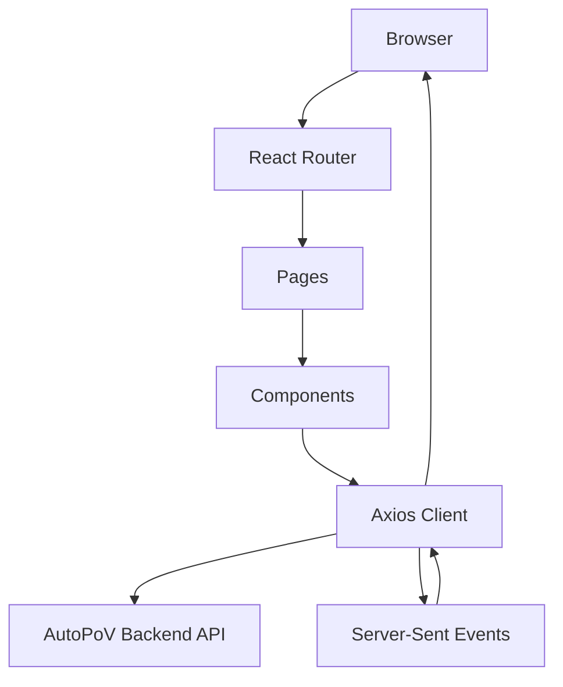
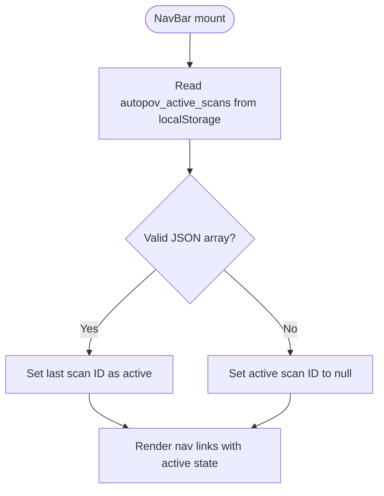
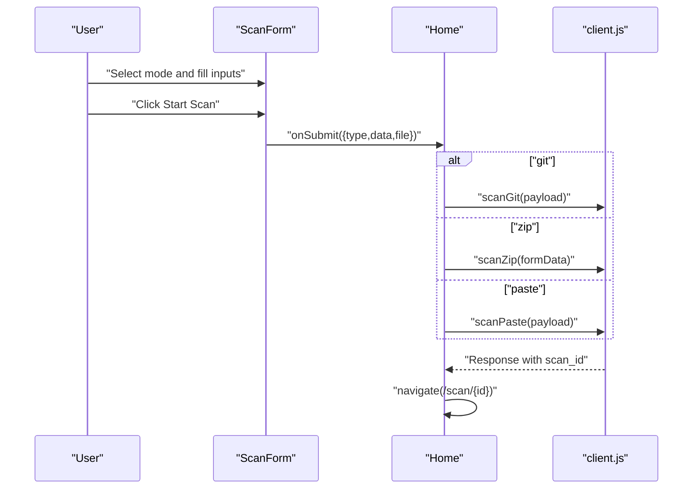
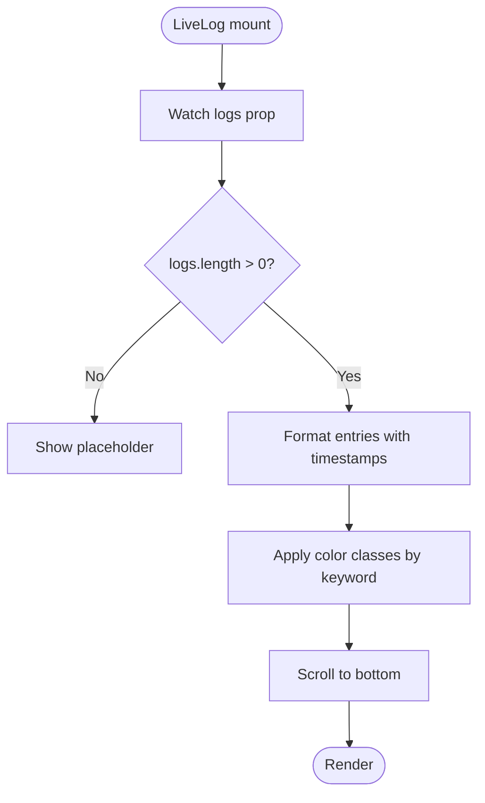
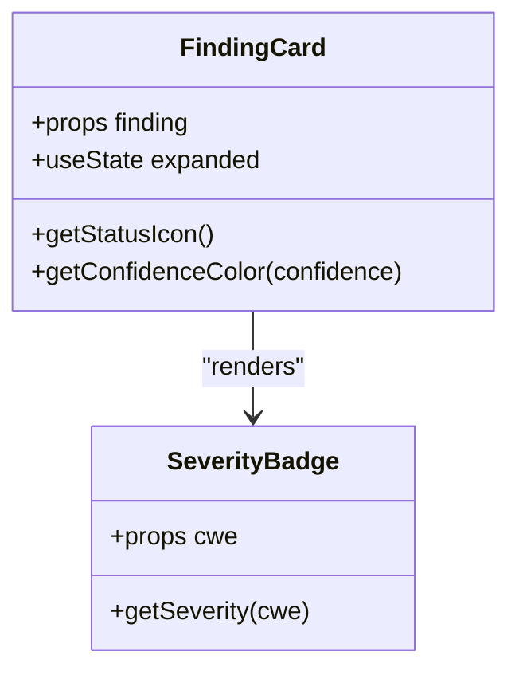
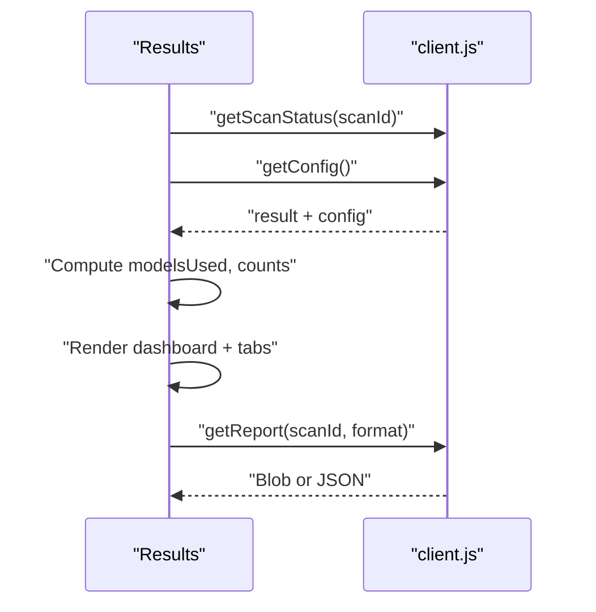
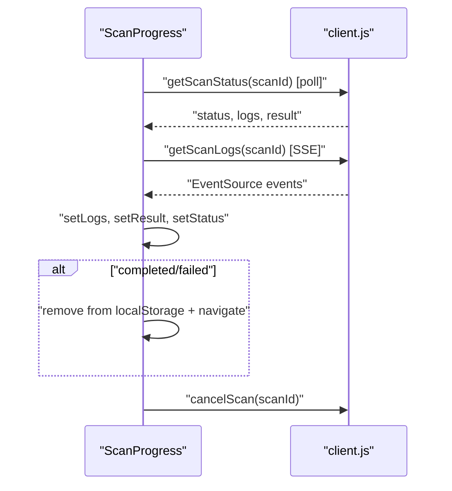
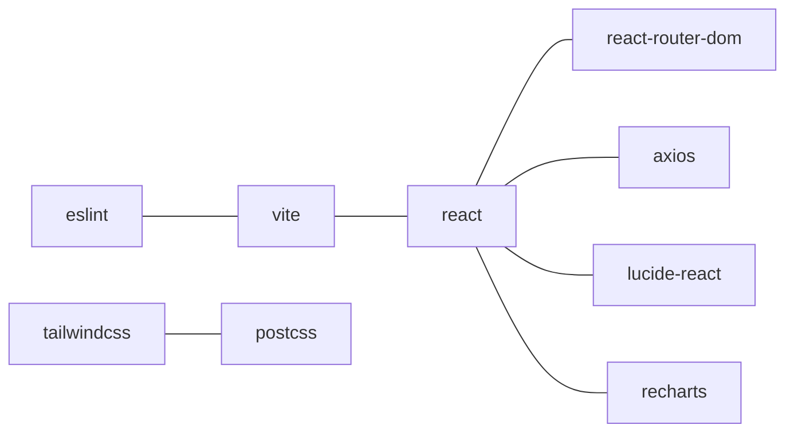

# Frontend Dashboard

<cite>
**Referenced Files in This Document**
- [main.jsx](file://frontend/src/main.jsx)
- [App.jsx](file://frontend/src/App.jsx)
- [NavBar.jsx](file://frontend/src/components/NavBar.jsx)
- [FindingCard.jsx](file://frontend/src/components/FindingCard.jsx)
- [LiveLog.jsx](file://frontend/src/components/LiveLog.jsx)
- [SeverityBadge.jsx](file://frontend/src/components/SeverityBadge.jsx)
- [ScanForm.jsx](file://frontend/src/components/ScanForm.jsx)
- [Home.jsx](file://frontend/src/pages/Home.jsx)
- [Results.jsx](file://frontend/src/pages/Results.jsx)
- [ScanProgress.jsx](file://frontend/src/pages/ScanProgress.jsx)
- [client.js](file://frontend/src/api/client.js)
- [index.css](file://frontend/src/index.css)
- [tailwind.config.js](file://frontend/tailwind.config.js)
- [vite.config.js](file://frontend/vite.config.js)
- [package.json](file://frontend/package.json)
</cite>

## Table of Contents
1. [Introduction](#introduction)
2. [Project Structure](#project-structure)
3. [Core Components](#core-components)
4. [Architecture Overview](#architecture-overview)
5. [Detailed Component Analysis](#detailed-component-analysis)
6. [Dependency Analysis](#dependency-analysis)
7. [Performance Considerations](#performance-considerations)
8. [Troubleshooting Guide](#troubleshooting-guide)
9. [Conclusion](#conclusion)
10. [Appendices](#appendices)

## Introduction
This document describes the React-based web dashboard for AutoPoV. It explains the component architecture, routing, real-time monitoring, and UI patterns. It also documents the component library for vulnerability display, severity indicators, and interactive controls; state management patterns; API integration and data flow; styling with Tailwind CSS; responsive design and accessibility; lifecycle management, error handling, and performance optimization; and browser compatibility and deployment considerations.

## Project Structure
The frontend is a Vite-managed React application with:
- A single-page app using React Router for navigation
- A dark theme UI with custom Tailwind configuration
- A dedicated API client module for backend communication
- Reusable components for forms, cards, and live logging
- Pages for scanning, progress monitoring, results, history, metrics, policy, and docs

**Diagram sources**
- [main.jsx:1-14](file://frontend/src/main.jsx#L1-L14)
- [App.jsx:1-33](file://frontend/src/App.jsx#L1-L33)
- [Home.jsx:1-108](file://frontend/src/pages/Home.jsx#L1-L108)
- [ScanProgress.jsx:1-174](file://frontend/src/pages/ScanProgress.jsx#L1-L174)
- [Results.jsx:1-434](file://frontend/src/pages/Results.jsx#L1-L434)
- [ScanForm.jsx:1-249](file://frontend/src/components/ScanForm.jsx#L1-L249)
- [FindingCard.jsx:1-200](file://frontend/src/components/FindingCard.jsx#L1-L200)
- [LiveLog.jsx:1-67](file://frontend/src/components/LiveLog.jsx#L1-L67)
- [SeverityBadge.jsx:1-27](file://frontend/src/components/SeverityBadge.jsx#L1-L27)
- [NavBar.jsx:1-78](file://frontend/src/components/NavBar.jsx#L1-L78)

**Section sources**
- [main.jsx:1-14](file://frontend/src/main.jsx#L1-L14)
- [App.jsx:1-33](file://frontend/src/App.jsx#L1-L33)
- [package.json:1-34](file://frontend/package.json#L1-L34)

## Core Components
- Navigation bar with active-state highlighting and persistent active scan ID from local storage
- Scan form supporting Git repository, ZIP upload, and paste code inputs, with CWE selection and “lite” mode
- Live log viewer with timestamp parsing and color-coded messages
- Finding card with expandable details, severity badge, confidence indicator, validation results, and PoV execution outcome
- Severity badge mapping CWE identifiers to severity levels
- Results page with filtering tabs, replay modal, and report generation
- Scan progress page with polling status, SSE live logs, and cancellation

**Section sources**
- [NavBar.jsx:1-78](file://frontend/src/components/NavBar.jsx#L1-L78)
- [ScanForm.jsx:1-249](file://frontend/src/components/ScanForm.jsx#L1-L249)
- [LiveLog.jsx:1-67](file://frontend/src/components/LiveLog.jsx#L1-L67)
- [FindingCard.jsx:1-200](file://frontend/src/components/FindingCard.jsx#L1-L200)
- [SeverityBadge.jsx:1-27](file://frontend/src/components/SeverityBadge.jsx#L1-L27)
- [Results.jsx:1-434](file://frontend/src/pages/Results.jsx#L1-L434)
- [ScanProgress.jsx:1-174](file://frontend/src/pages/ScanProgress.jsx#L1-L174)

## Architecture Overview
The app follows a layered pattern:
- UI layer: React components and pages
- Routing layer: React Router v6
- API layer: Axios client with interceptors and SSE support
- State layer: React hooks for local component state and router params

**Diagram sources**
- [client.js:1-78](file://frontend/src/api/client.js#L1-L78)
- [ScanProgress.jsx:53-71](file://frontend/src/pages/ScanProgress.jsx#L53-L71)
- [App.jsx:17-26](file://frontend/src/App.jsx#L17-L26)

## Detailed Component Analysis

### Navigation Bar
- Highlights current route using location state
- Reads active scan ID from local storage to reflect recent activity
- Uses Lucide icons for compact affordances

**Diagram sources**
- [NavBar.jsx:9-25](file://frontend/src/components/NavBar.jsx#L9-L25)

**Section sources**
- [NavBar.jsx:1-78](file://frontend/src/components/NavBar.jsx#L1-L78)

### Scan Form
- Supports three input modes: Git, ZIP, and paste
- Allows selecting multiple CWEs from a curated list
- Provides “lite” mode toggle
- Submits via API client functions depending on mode

**Diagram sources**
- [ScanForm.jsx:41-44](file://frontend/src/components/ScanForm.jsx#L41-L44)
- [Home.jsx:12-56](file://frontend/src/pages/Home.jsx#L12-L56)
- [client.js:32-40](file://frontend/src/api/client.js#L32-L40)

**Section sources**
- [ScanForm.jsx:1-249](file://frontend/src/components/ScanForm.jsx#L1-L249)
- [Home.jsx:1-108](file://frontend/src/pages/Home.jsx#L1-L108)

### Live Log Viewer
- Renders a scrollable terminal-like pane
- Parses optional timestamps from log lines
- Color-codes messages for errors, successes, and triggers
- Auto-scrolls to latest entry

**Diagram sources**
- [LiveLog.jsx:7-9](file://frontend/src/components/LiveLog.jsx#L7-L9)
- [LiveLog.jsx:11-58](file://frontend/src/components/LiveLog.jsx#L11-L58)

**Section sources**
- [LiveLog.jsx:1-67](file://frontend/src/components/LiveLog.jsx#L1-L67)

### Finding Card
- Expandable card per finding with:
  - Status icon based on final status
  - Severity badge derived from CWE
  - Confidence indicator with color scale
  - Vulnerable code snippet
  - PoV summary and script
  - Validation details (static, unit test, issues)
  - PoV execution result with stdout/stderr
  - Metadata (inference time, cost, models)

**Diagram sources**
- [FindingCard.jsx:5-197](file://frontend/src/components/FindingCard.jsx#L5-L197)
- [SeverityBadge.jsx:1-27](file://frontend/src/components/SeverityBadge.jsx#L1-L27)

**Section sources**
- [FindingCard.jsx:1-200](file://frontend/src/components/FindingCard.jsx#L1-L200)
- [SeverityBadge.jsx:1-27](file://frontend/src/components/SeverityBadge.jsx#L1-L27)

### Severity Badge
- Maps CWE identifiers to severity levels and color classes

**Section sources**
- [SeverityBadge.jsx:1-27](file://frontend/src/components/SeverityBadge.jsx#L1-L27)

### Results Page
- Loads scan status and configuration concurrently
- Provides tabs to filter findings by status
- Supports replay against agent models with configurable options
- Generates JSON/PDF reports

**Diagram sources**
- [Results.jsx:24-41](file://frontend/src/pages/Results.jsx#L24-L41)
- [Results.jsx:43-61](file://frontend/src/pages/Results.jsx#L43-L61)
- [client.js:49-57](file://frontend/src/api/client.js#L49-L57)

**Section sources**
- [Results.jsx:1-434](file://frontend/src/pages/Results.jsx#L1-L434)

### Scan Progress Page
- Polls status every 2 seconds
- Subscribes to SSE stream for live logs
- Navigates to results upon completion
- Supports scan cancellation

**Diagram sources**
- [ScanProgress.jsx:16-79](file://frontend/src/pages/ScanProgress.jsx#L16-L79)
- [client.js:42-47](file://frontend/src/api/client.js#L42-L47)
- [client.js:70](file://frontend/src/api/client.js#L70)

**Section sources**
- [ScanProgress.jsx:1-174](file://frontend/src/pages/ScanProgress.jsx#L1-L174)

## Dependency Analysis
- Runtime dependencies: React, React DOM, React Router, Axios, Recharts, Lucide React
- Dev/build dependencies: Vite, Tailwind CSS, PostCSS, ESLint
- Styling: Tailwind CSS configured with custom colors, fonts, and dark mode
- Proxy: Vite dev server proxies /api to backend on localhost:8000

**Diagram sources**
- [package.json:12-18](file://frontend/package.json#L12-L18)
- [package.json:20-31](file://frontend/package.json#L20-L31)

**Section sources**
- [package.json:1-34](file://frontend/package.json#L1-L34)
- [tailwind.config.js:1-30](file://frontend/tailwind.config.js#L1-L30)
- [vite.config.js:1-21](file://frontend/vite.config.js#L1-L21)

## Performance Considerations
- Efficient rendering
  - Memoization of derived data (e.g., modelsUsed) prevents unnecessary re-renders
  - Conditional rendering of large sections (e.g., expanded finding details)
- Network efficiency
  - Concurrent fetches for status and config
  - SSE for low-latency live logs; fallback to polling
- UI responsiveness
  - Debounced scrolling to bottom in live logs
  - Disabled states during async operations
- Bundle and build
  - Vite for fast dev server and optimized production builds
  - Source maps enabled in build for debugging

[No sources needed since this section provides general guidance]

## Troubleshooting Guide
- Authentication
  - Ensure API key is stored in localStorage or provided via environment variable
  - Verify Authorization header is attached by the request interceptor
- Real-time logs
  - If SSE fails, the UI continues updating via polling
  - Confirm backend endpoint and API key query param
- Navigation and state
  - Active scan ID is persisted in localStorage; clearing it resets the navbar highlight
- Error surfaces
  - Results page displays generic errors; inspect network tab for details
  - Scan progress page shows error banners for failures and cancellations

**Section sources**
- [client.js:5-8](file://frontend/src/api/client.js#L5-L8)
- [client.js:18-25](file://frontend/src/api/client.js#L18-L25)
- [client.js:44-47](file://frontend/src/api/client.js#L44-L47)
- [ScanProgress.jsx:66-71](file://frontend/src/pages/ScanProgress.jsx#L66-L71)
- [Results.jsx:97-105](file://frontend/src/pages/Results.jsx#L97-L105)

## Conclusion
The AutoPoV dashboard is a modular, performance-conscious React application with robust real-time monitoring and a cohesive component library. It leverages Tailwind CSS for styling, Axios for API integration, and React Router for navigation. The design emphasizes clarity for vulnerability findings, actionable controls for scan management, and accessible feedback for users.

[No sources needed since this section summarizes without analyzing specific files]

## Appendices

### Styling and Accessibility
- Tailwind configuration extends custom gray and primary palette, adds Inter and Fira Code fonts, and enables dark mode
- Custom CSS provides scrollbars, code blocks, and animated log entries
- Accessibility considerations
  - Semantic headings and landmarks
  - Focus-friendly inputs and buttons
  - Sufficient color contrast for severity and status indicators
  - Keyboard navigable modals and tabs

**Section sources**
- [tailwind.config.js:1-30](file://frontend/tailwind.config.js#L1-L30)
- [index.css:1-73](file://frontend/src/index.css#L1-L73)

### Browser Compatibility and Deployment
- Modern browsers with ES modules support
- Vite dev server proxy targets backend on localhost:8000
- Production build outputs to dist with source maps
- Environment variables for API URL and API key

**Section sources**
- [vite.config.js:7-19](file://frontend/vite.config.js#L7-L19)
- [client.js:3](file://frontend/src/api/client.js#L3)
- [client.js:6](file://frontend/src/api/client.js#L6)