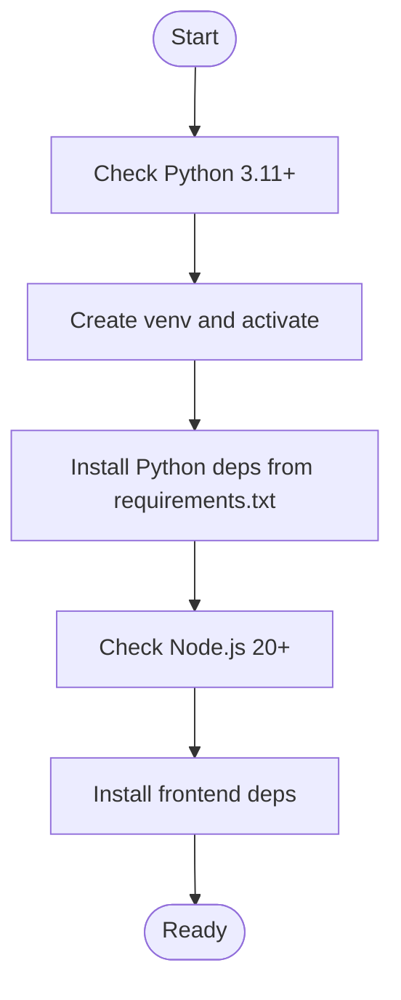
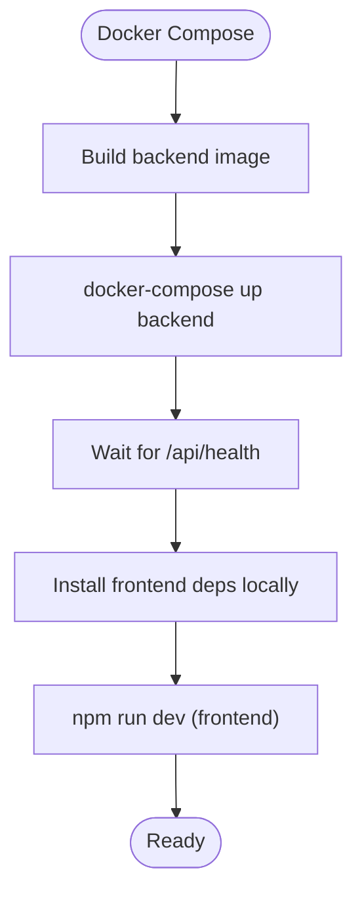
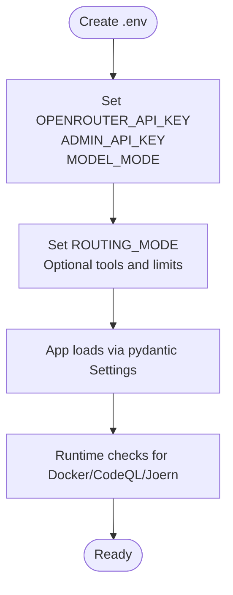
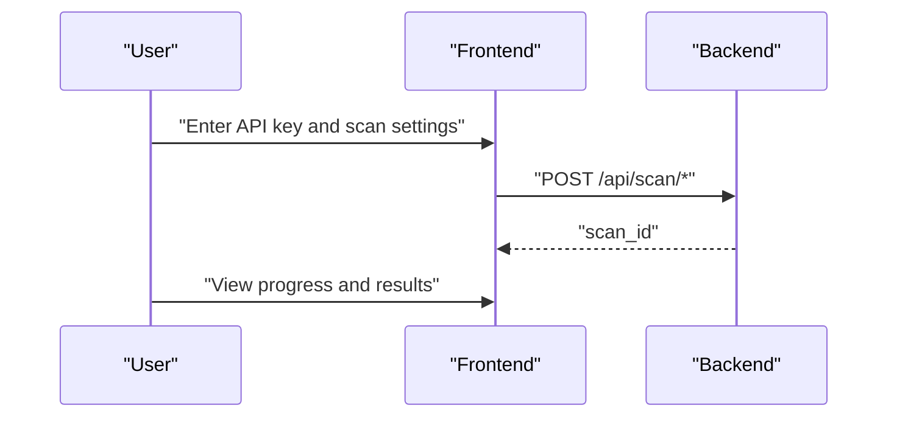
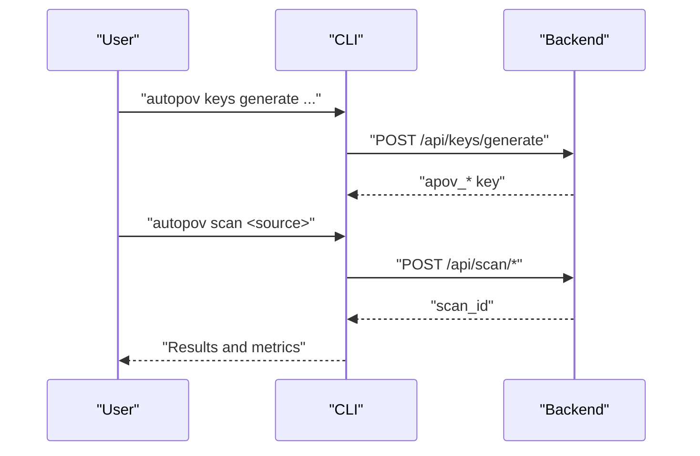
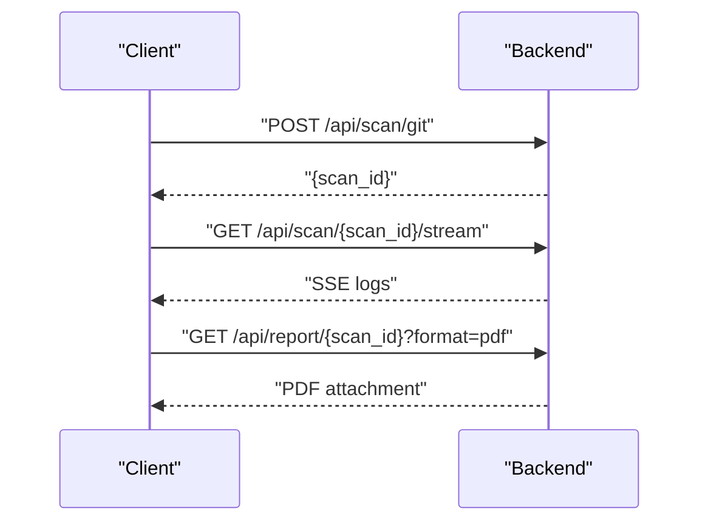
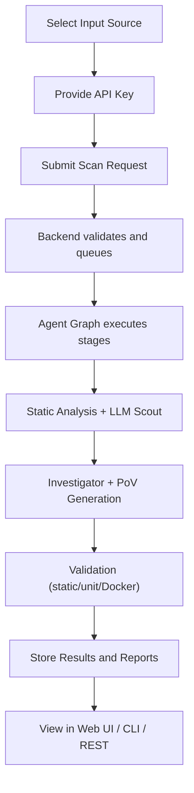
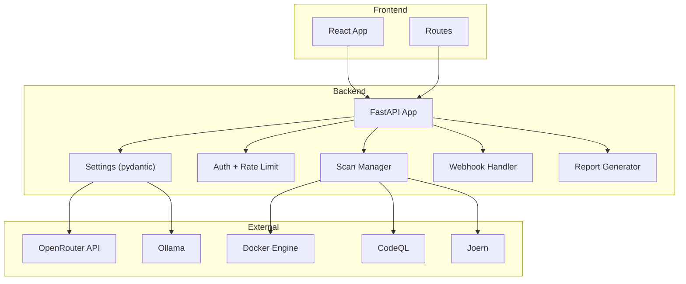
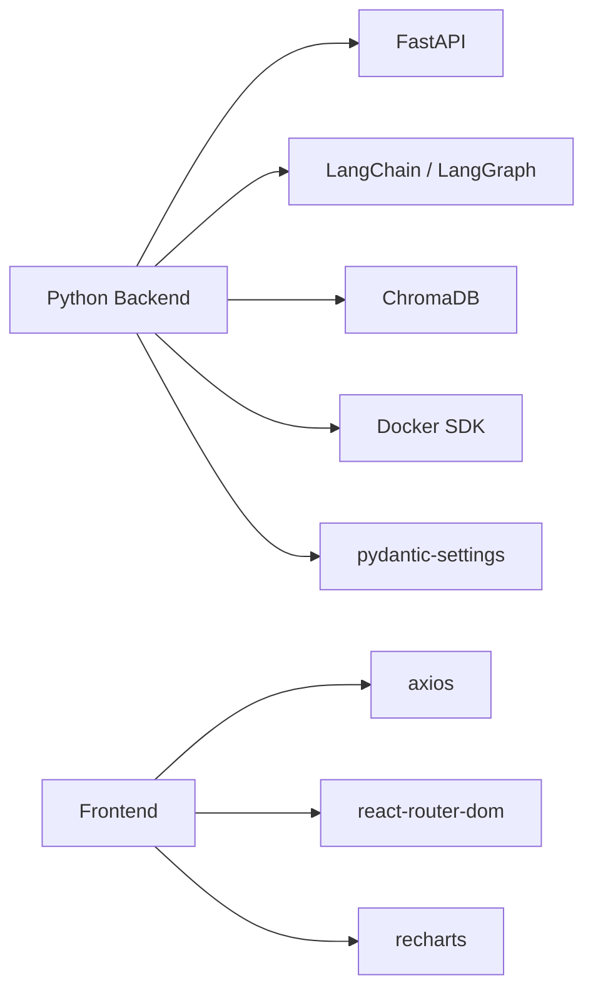

# Getting Started

<cite>
**Referenced Files in This Document**
- [README.md](file://README.md)
- [requirements.txt](file://requirements.txt)
- [frontend/package.json](file://frontend/package.json)
- [Dockerfile.backend](file://Dockerfile.backend)
- [Dockerfile.frontend](file://Dockerfile.frontend)
- [docker-compose.yml](file://docker-compose.yml)
- [app/config.py](file://app/config.py)
- [app/main.py](file://app/main.py)
- [cli/autopov.py](file://cli/autopov.py)
- [run.sh](file://run.sh)
- [start-all.sh](file://start-all.sh)
- [frontend/src/App.jsx](file://frontend/src/App.jsx)
- [frontend/src/pages/Home.jsx](file://frontend/src/pages/Home.jsx)
</cite>

## Table of Contents
1. [Introduction](#introduction)
2. [Prerequisites](#prerequisites)
3. [Installation](#installation)
4. [Environment Configuration](#environment-configuration)
5. [Quick Start](#quick-start)
6. [First Scan Workflow](#first-scan-workflow)
7. [Architecture Overview](#architecture-overview)
8. [Dependency Analysis](#dependency-analysis)
9. [Performance Considerations](#performance-considerations)
10. [Troubleshooting Guide](#troubleshooting-guide)
11. [Conclusion](#conclusion)

## Introduction
AutoPoV is an autonomous vulnerability research platform that orchestrates multi-agent workflows to discover, analyze, exploit, and validate security issues without human intervention. It supports web UI, CLI, and REST API entry points, integrates with LLM providers, static analysis tools, and Docker for sandboxed exploit execution.

## Prerequisites
Before installing AutoPoV, ensure your environment meets the following requirements:
- Python 3.11 or newer (backend)
- Node.js 20 or newer (frontend)
- Docker Desktop (required for sandboxed exploit execution)
- OpenRouter API key (for online LLM reasoning)
- Optional: CodeQL CLI and Joern for enhanced static analysis

These prerequisites are documented in the project’s quick start guide and configuration reference.

**Section sources**
- [README.md:130-140](file://README.md#L130-L140)
- [README.md:288-328](file://README.md#L288-L328)

## Installation
AutoPoV provides multiple installation approaches. Choose the one that best fits your environment.

### Option A: Local Python + Node (Development)
- Create and activate a Python virtual environment
- Install Python dependencies
- Install frontend dependencies

**Diagram sources**
- [run.sh:36-75](file://run.sh#L36-L75)
- [requirements.txt:1-44](file://requirements.txt#L1-L44)
- [frontend/package.json:1-34](file://frontend/package.json#L1-L34)

**Section sources**
- [run.sh:36-118](file://run.sh#L36-L118)
- [requirements.txt:1-44](file://requirements.txt#L1-L44)
- [frontend/package.json:1-34](file://frontend/package.json#L1-L34)

### Option B: Dockerized Backend + Local Frontend
- Build and run the backend container with Docker Compose
- Install frontend dependencies locally
- Start the frontend dev server

**Diagram sources**
- [docker-compose.yml:1-41](file://docker-compose.yml#L1-L41)
- [Dockerfile.backend:1-64](file://Dockerfile.backend#L1-L64)
- [Dockerfile.frontend:1-29](file://Dockerfile.frontend#L1-L29)
- [start-all.sh:32-62](file://start-all.sh#L32-L62)

**Section sources**
- [docker-compose.yml:1-41](file://docker-compose.yml#L1-L41)
- [Dockerfile.backend:1-64](file://Dockerfile.backend#L1-L64)
- [Dockerfile.frontend:1-29](file://Dockerfile.frontend#L1-L29)
- [start-all.sh:32-62](file://start-all.sh#L32-L62)

## Environment Configuration
AutoPoV uses environment variables to configure runtime behavior. At minimum, create a .env file and set the required variables.

- Copy the example environment file
- Edit .env to include:
  - OPENROUTER_API_KEY
  - ADMIN_API_KEY
  - MODEL_MODE (online or offline)
  - ROUTING_MODE (auto, fixed, learning)
  - Optional: OLLAMA_BASE_URL, MAX_COST_USD, DOCKER_ENABLED, etc.

**Diagram sources**
- [app/config.py:13-255](file://app/config.py#L13-L255)

**Section sources**
- [README.md:158-169](file://README.md#L158-L169)
- [app/config.py:13-255](file://app/config.py#L13-L255)

## Quick Start
Choose your preferred entry point to begin scanning.

### Web UI
- Open the dashboard at http://localhost:5173
- Navigate to Settings and enter your API key
- Select a scan input (Git URL, ZIP upload, or paste code)
- Choose CWE targets and submit
- Monitor live logs and review results

**Diagram sources**
- [frontend/src/pages/Home.jsx:12-56](file://frontend/src/pages/Home.jsx#L12-L56)
- [app/main.py:204-401](file://app/main.py#L204-L401)

**Section sources**
- [README.md:198-208](file://README.md#L198-L208)
- [frontend/src/pages/Home.jsx:12-56](file://frontend/src/pages/Home.jsx#L12-L56)
- [app/main.py:204-401](file://app/main.py#L204-L401)

### CLI
- Generate an API key (admin only)
- Run scans from the terminal for Git repos, ZIP archives, or pasted code
- View results, history, and reports

**Diagram sources**
- [cli/autopov.py:685-723](file://cli/autopov.py#L685-L723)
- [cli/autopov.py:139-240](file://cli/autopov.py#L139-L240)
- [app/main.py:204-401](file://app/main.py#L204-L401)

**Section sources**
- [README.md:179-193](file://README.md#L179-L193)
- [README.md:209-244](file://README.md#L209-L244)
- [cli/autopov.py:139-240](file://cli/autopov.py#L139-L240)
- [cli/autopov.py:685-723](file://cli/autopov.py#L685-L723)

### REST API
- Use the interactive docs at http://localhost:8000/api/docs
- Trigger scans, poll progress, stream logs, and download reports
- Admin endpoints for key management and cleanup

**Diagram sources**
- [app/main.py:204-644](file://app/main.py#L204-L644)

**Section sources**
- [README.md:245-284](file://README.md#L245-L284)
- [app/main.py:204-644](file://app/main.py#L204-L644)

## First Scan Workflow
Follow this end-to-end workflow to run your first scan from input selection to result interpretation.

**Diagram sources**
- [README.md:34-69](file://README.md#L34-L69)
- [app/main.py:204-401](file://app/main.py#L204-L401)
- [frontend/src/pages/Home.jsx:12-56](file://frontend/src/pages/Home.jsx#L12-L56)

**Section sources**
- [README.md:34-69](file://README.md#L34-L69)
- [app/main.py:204-401](file://app/main.py#L204-L401)
- [frontend/src/pages/Home.jsx:12-56](file://frontend/src/pages/Home.jsx#L12-L56)

## Architecture Overview
AutoPoV consists of:
- Backend: FastAPI application exposing REST endpoints and managing agent orchestration
- Frontend: React-based dashboard for UI interactions
- CLI: Command-line interface mirroring backend capabilities
- Configuration: Environment-driven settings with runtime tool availability checks

**Diagram sources**
- [app/main.py:114-131](file://app/main.py#L114-L131)
- [app/config.py:13-255](file://app/config.py#L13-L255)
- [frontend/src/App.jsx:1-33](file://frontend/src/App.jsx#L1-L33)

**Section sources**
- [app/main.py:114-131](file://app/main.py#L114-L131)
- [app/config.py:13-255](file://app/config.py#L13-L255)
- [frontend/src/App.jsx:1-33](file://frontend/src/App.jsx#L1-L33)

## Dependency Analysis
Key runtime dependencies and their roles:
- FastAPI and Uvicorn for the REST API
- LangChain/LangGraph for agent orchestration
- ChromaDB for vector storage
- Docker SDK for sandboxed execution
- Requests for CLI HTTP calls
- React + Vite for the frontend

**Diagram sources**
- [requirements.txt:1-44](file://requirements.txt#L1-L44)
- [frontend/package.json:12-19](file://frontend/package.json#L12-L19)

**Section sources**
- [requirements.txt:1-44](file://requirements.txt#L1-L44)
- [frontend/package.json:12-19](file://frontend/package.json#L12-L19)

## Performance Considerations
- Cost control: Adjust MAX_COST_USD to limit per-scan spending
- Routing modes: Use auto, fixed, or learning routing to balance cost and accuracy
- Lite scans: Reduce analysis depth for faster results when appropriate
- Tool availability: Ensure Docker, CodeQL, and Joern are available to unlock advanced capabilities

[No sources needed since this section provides general guidance]

## Troubleshooting Guide
Common setup issues and verification steps:

- Missing .env or API keys
  - Copy the example file and add OPENROUTER_API_KEY and ADMIN_API_KEY
  - Verify MODEL_MODE and ROUTING_MODE are set appropriately

- Port conflicts
  - Backend runs on 8000; frontend on 5173
  - Change ports in configuration if needed

- Docker not available
  - The backend health endpoint reports docker_available
  - Ensure Docker Desktop is running and accessible

- Tool availability checks
  - CodeQL and Joern availability is validated at startup
  - Install or adjust CODEQL_CLI_PATH and JOERN_CLI_PATH accordingly

- Health and diagnostics
  - Use the CLI health command to verify tool integrations
  - Check backend logs and frontend console for errors

**Section sources**
- [run.sh:84-90](file://run.sh#L84-L90)
- [app/main.py:176-186](file://app/main.py#L176-L186)
- [app/config.py:162-211](file://app/config.py#L162-L211)
- [cli/autopov.py:613-637](file://cli/autopov.py#L613-L637)

## Conclusion
You now have the essentials to install AutoPoV, configure environment variables, and run your first scan via web UI, CLI, or REST API. Use the troubleshooting section to resolve common setup issues and refer to the architecture overview to understand how components interact.