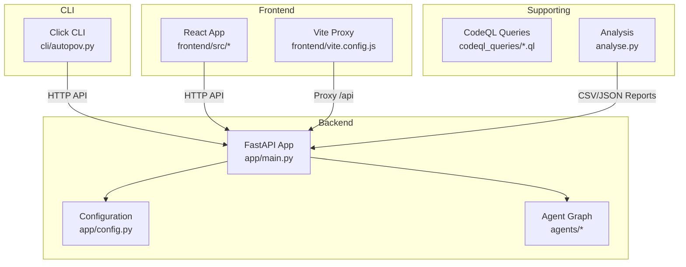
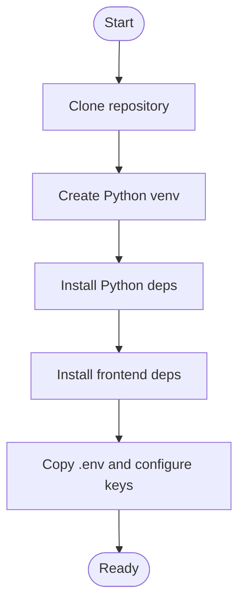
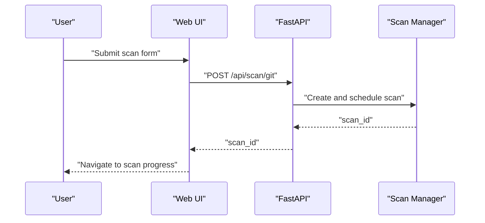
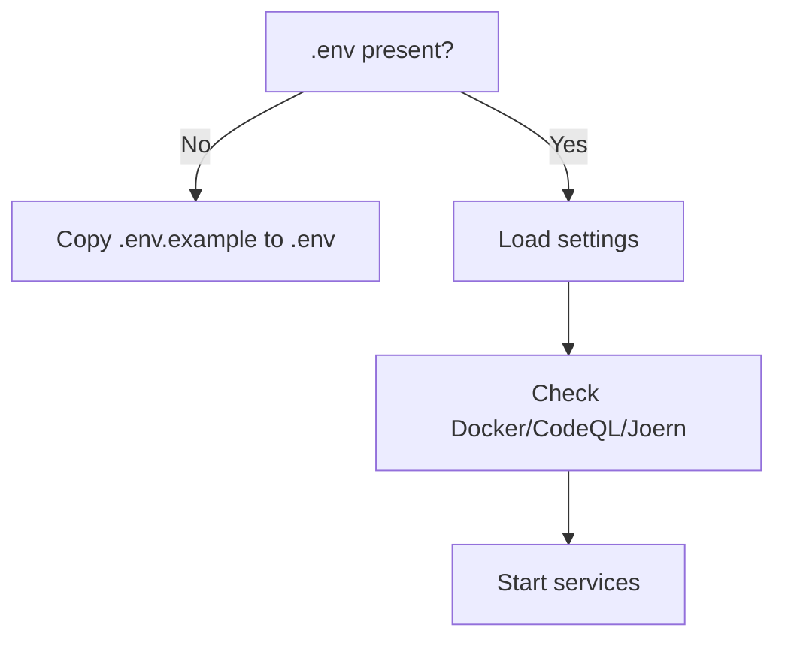
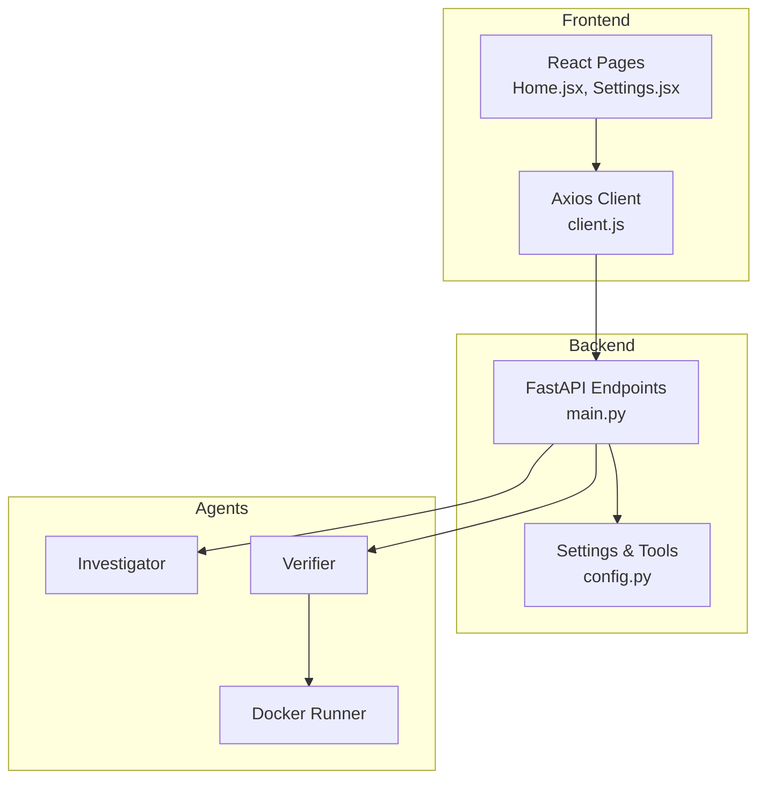

# Getting Started

<cite>
**Referenced Files in This Document**
- [README.md](file://autopov/README.md)
- [requirements.txt](file://autopov/requirements.txt)
- [package.json](file://autopov/frontend/package.json)
- [run.sh](file://autopov/run.sh)
- [main.py](file://autopov/app/main.py)
- [config.py](file://autopov/app/config.py)
- [client.js](file://autopov/frontend/src/api/client.js)
- [Home.jsx](file://autopov/frontend/src/pages/Home.jsx)
- [Settings.jsx](file://autopov/frontend/src/pages/Settings.jsx)
- [vite.config.js](file://autopov/frontend/vite.config.js)
- [autopov.py](file://autopov/cli/autopov.py)
- [analyse.py](file://autopov/analyse.py)
</cite>

## Table of Contents
1. [Introduction](#introduction)
2. [Project Structure](#project-structure)
3. [Prerequisites](#prerequisites)
4. [Installation](#installation)
5. [Quick Start Tutorial](#quick-start-tutorial)
6. [Initial Configuration](#initial-configuration)
7. [Common Usage Patterns](#common-usage-patterns)
8. [Architecture Overview](#architecture-overview)
9. [Troubleshooting Guide](#troubleshooting-guide)
10. [Conclusion](#conclusion)

## Introduction
AutoPoV is a full-stack research prototype that combines static analysis (CodeQL, Joern) with AI-powered reasoning (LLMs via LangGraph) to detect, verify, and benchmark vulnerabilities. It provides:
- A React-based web UI for interactive scanning
- A FastAPI backend exposing REST endpoints
- A CLI for automation and scripting
- Support for multiple CWE families (buffer overflow, SQL injection, use-after-free, integer overflow)
- Docker-based Proof-of-Vulnerability (PoV) execution for safe verification

## Project Structure
The project is organized into distinct layers:
- Backend: FastAPI application with authentication, scan orchestration, and API endpoints
- Agents: LangGraph components for code ingestion, investigation, verification, and Docker execution
- Frontend: React application with Vite and Tailwind for the web UI
- CLI: Click-based command-line interface for automation
- Supporting assets: CodeQL queries, test suite, and analysis utilities

**Diagram sources**
- [main.py](file://autopov/app/main.py#L102-L118)
- [config.py](file://autopov/app/config.py#L13-L116)
- [client.js](file://autopov/frontend/src/api/client.js#L1-L25)
- [vite.config.js](file://autopov/frontend/vite.config.js#L7-L15)
- [autopov.py](file://autopov/cli/autopov.py#L26-L27)
- [analyse.py](file://autopov/analyse.py#L42-L44)

**Section sources**
- [README.md](file://autopov/README.md#L17-L35)
- [main.py](file://autopov/app/main.py#L102-L118)
- [config.py](file://autopov/app/config.py#L13-L116)
- [client.js](file://autopov/frontend/src/api/client.js#L1-L25)
- [vite.config.js](file://autopov/frontend/vite.config.js#L7-L15)
- [autopov.py](file://autopov/cli/autopov.py#L26-L27)
- [analyse.py](file://autopov/analyse.py#L42-L44)

## Prerequisites
Before installing AutoPoV, ensure your environment meets the following requirements:
- Python 3.11+ for the backend and CLI
- Node.js 20+ for the frontend development server
- Docker Desktop for PoV execution
- Optional: CodeQL CLI and/or Joern for enhanced static analysis

These prerequisites are documented in the project's quick start guide and enforced by the startup scripts.

**Section sources**
- [README.md](file://autopov/README.md#L39-L45)
- [run.sh](file://autopov/run.sh#L36-L56)

## Installation
Follow these steps to set up AutoPoV locally:

1. Clone the repository and enter the project directory
2. Create and activate a Python virtual environment
3. Install Python dependencies from requirements.txt
4. Install frontend dependencies using npm
5. Configure environment variables by copying .env.example to .env and adding your API keys

The run.sh script automates dependency installation and environment setup, including virtual environment creation and Node.js dependency installation.

**Diagram sources**
- [run.sh](file://autopov/run.sh#L58-L75)
- [run.sh](file://autopov/run.sh#L108-L117)
- [run.sh](file://autopov/run.sh#L84-L90)

**Section sources**
- [README.md](file://autopov/README.md#L47-L74)
- [run.sh](file://autopov/run.sh#L58-L75)
- [run.sh](file://autopov/run.sh#L108-L117)
- [requirements.txt](file://autopov/requirements.txt#L1-L42)
- [package.json](file://autopov/frontend/package.json#L6-L11)

## Quick Start Tutorial
Begin scanning immediately using the web UI, CLI, or API:

- Web UI: Start both backend and frontend, then open http://localhost:5173. Enter your API key in Settings and use the form to select scan type (Git, ZIP, or Paste), model, and CWEs.
- CLI: Use autopov scan to target Git repositories, local directories, or ZIP archives. Use autopov results and autopov report to inspect outcomes.
- API: Use curl to POST scan requests to /api/scan/git, /api/scan/zip, or /api/scan/paste, then GET /api/scan/{scan_id} for status and results.

The run.sh script provides convenient shortcuts to start backend-only, frontend-only, or both services.

**Diagram sources**
- [Home.jsx](file://autopov/frontend/src/pages/Home.jsx#L12-L56)
- [client.js](file://autopov/frontend/src/api/client.js#L30-L36)
- [main.py](file://autopov/app/main.py#L175-L216)

**Section sources**
- [README.md](file://autopov/README.md#L75-L144)
- [run.sh](file://autopov/run.sh#L120-L161)
- [Home.jsx](file://autopov/frontend/src/pages/Home.jsx#L12-L56)
- [client.js](file://autopov/frontend/src/api/client.js#L30-L36)
- [main.py](file://autopov/app/main.py#L175-L216)

## Initial Configuration
Set up your environment and API keys:

- Backend environment: Copy .env.example to .env and add required keys (e.g., OPENROUTER_API_KEY for online mode, ADMIN_API_KEY for admin operations).
- Frontend API key: Enter your API key in the Settings page or set it via environment variable (VITE_API_KEY) or localStorage.
- Model selection: Choose online (OpenRouter) or offline (Ollama) mode and specify MODEL_NAME in .env.

The configuration module validates environment variables and checks tool availability (Docker, CodeQL, Joern).

**Diagram sources**
- [run.sh](file://autopov/run.sh#L84-L90)
- [config.py](file://autopov/app/config.py#L123-L172)

**Section sources**
- [README.md](file://autopov/README.md#L69-L100)
- [run.sh](file://autopov/run.sh#L84-L90)
- [config.py](file://autopov/app/config.py#L13-L116)
- [client.js](file://autopov/frontend/src/api/client.js#L5-L8)
- [Settings.jsx](file://autopov/frontend/src/pages/Settings.jsx#L63-L108)

## Common Usage Patterns
Perform typical scanning tasks:

- Scan a Git repository: Use the web UI form or CLI autopov scan with a Git URL and optional branch.
- Scan a local directory: Package the directory as a ZIP or use the CLI to zip and upload.
- Scan raw code: Paste code into the web UI or use the CLI with paste mode.
- Generate reports: Use autopov report to download JSON or PDF reports for a given scan_id.

The CLI supports waiting for completion and displaying results in table or JSON formats.

**Section sources**
- [README.md](file://autopov/README.md#L102-L126)
- [autopov.py](file://autopov/cli/autopov.py#L104-L210)
- [autopov.py](file://autopov/cli/autopov.py#L229-L291)

## Architecture Overview
AutoPoV integrates a React frontend, FastAPI backend, LangGraph agents, and optional static analysis tools:

**Diagram sources**
- [Home.jsx](file://autopov/frontend/src/pages/Home.jsx#L1-L108)
- [Settings.jsx](file://autopov/frontend/src/pages/Settings.jsx#L1-L119)
- [client.js](file://autopov/frontend/src/api/client.js#L1-L69)
- [main.py](file://autopov/app/main.py#L175-L314)
- [config.py](file://autopov/app/config.py#L13-L116)

**Section sources**
- [README.md](file://autopov/README.md#L17-L35)
- [main.py](file://autopov/app/main.py#L175-L314)
- [config.py](file://autopov/app/config.py#L13-L116)
- [client.js](file://autopov/frontend/src/api/client.js#L1-L69)

## Troubleshooting Guide
Common setup and runtime issues:

- Missing Python or Node.js: The run.sh script checks for Python 3 and Node.js and exits if not found.
- Missing .env: The backend startup copies .env.example and instructs you to add API keys.
- Docker not available: The configuration module detects Docker availability; disable Docker execution if Docker is not installed.
- Port conflicts: Backend runs on port 8000, frontend on 5173; adjust vite.config.js or run.sh if ports are in use.
- API key errors: Ensure ADMIN_API_KEY is set for admin operations and your user API key is configured in the web UI or CLI.

Use the health endpoint to verify service readiness and tool availability.

**Section sources**
- [run.sh](file://autopov/run.sh#L36-L56)
- [run.sh](file://autopov/run.sh#L84-L90)
- [config.py](file://autopov/app/config.py#L123-L172)
- [vite.config.js](file://autopov/frontend/vite.config.js#L7-L15)
- [main.py](file://autopov/app/main.py#L161-L171)

## Conclusion
You are now ready to use AutoPoV for autonomous vulnerability detection and benchmarking. Start with the web UI for guided scanning, automate with the CLI, and integrate via the API. Use the analysis utilities to benchmark model performance and generate reports. For advanced scenarios, configure offline models, webhooks, and static analysis tools as needed.