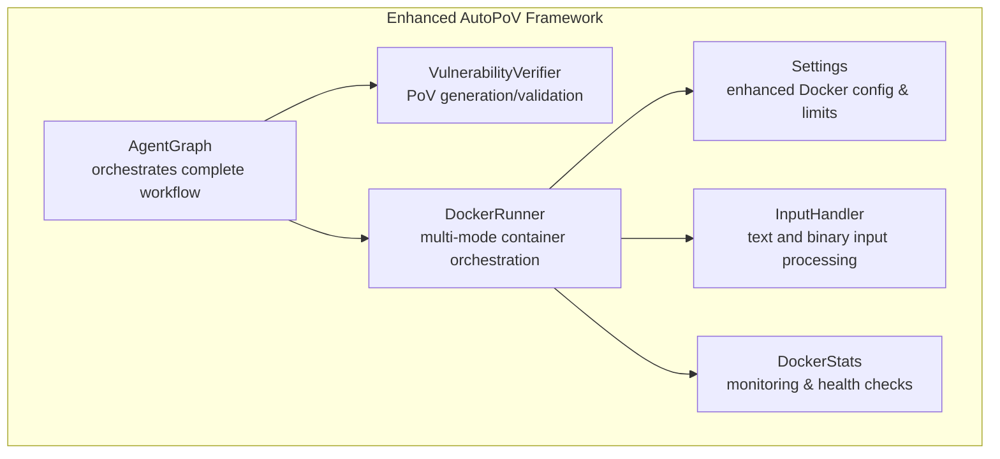
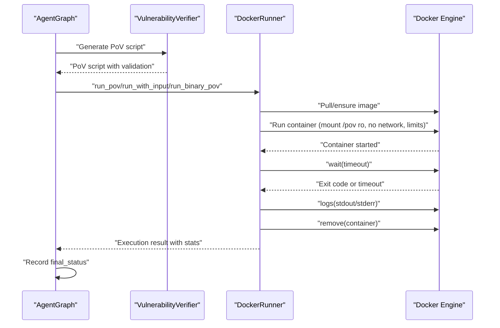
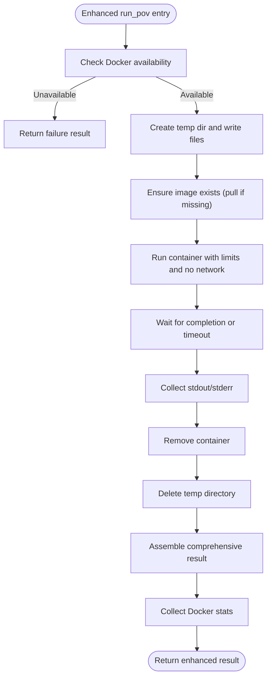
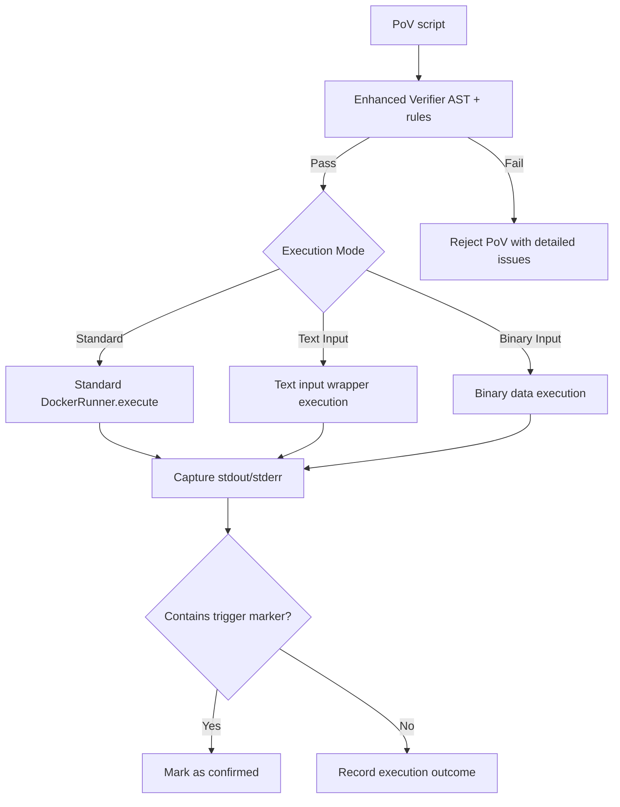
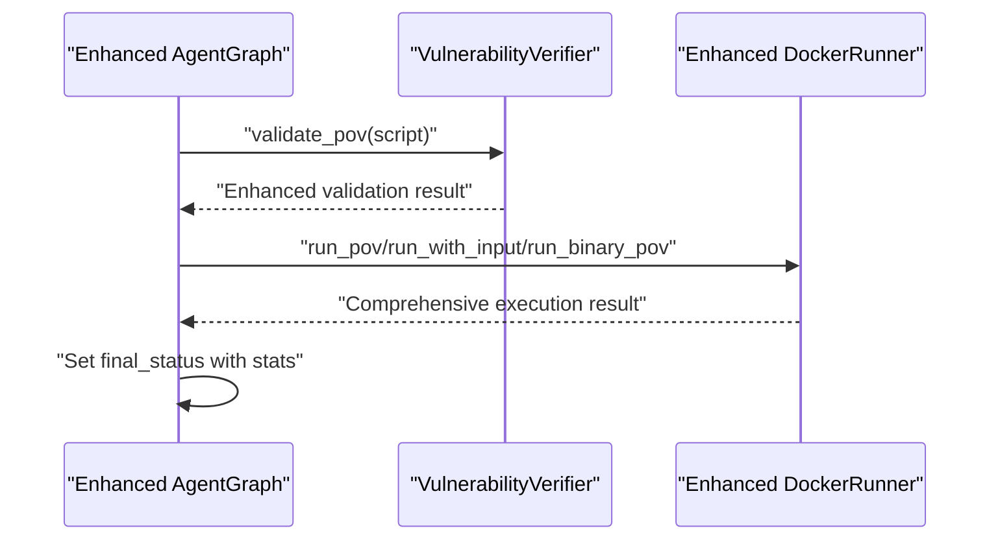
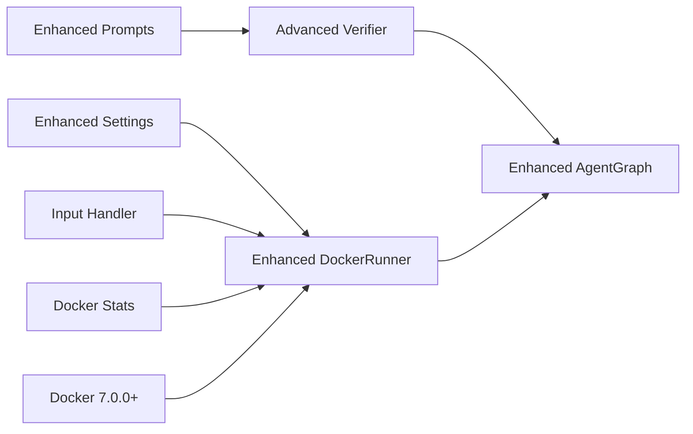

# Docker Execution Environment

<cite>
**Referenced Files in This Document**
- [docker_runner.py](file://agents/docker_runner.py)
- [config.py](file://app/config.py)
- [agent_graph.py](file://app/agent_graph.py)
- [verifier.py](file://agents/verifier.py)
- [prompts.py](file://prompts.py)
- [requirements.txt](file://requirements.txt)
- [run.sh](file://run.sh)
- [source_handler.py](file://app/source_handler.py)
</cite>

## Update Summary
**Changes Made**
- Enhanced DockerRunner with new execution modes: run_with_input() and run_binary_pov()
- Added comprehensive input handling capabilities for PoV scripts
- Improved container orchestration with multiple execution strategies
- Expanded security measures with enhanced file system isolation
- Added batch execution capabilities with progress tracking
- Integrated Docker statistics and health monitoring
- Enhanced error handling and resource management

## Table of Contents
1. [Introduction](#introduction)
2. [Project Structure](#project-structure)
3. [Core Components](#core-components)
4. [Architecture Overview](#architecture-overview)
5. [Detailed Component Analysis](#detailed-component-analysis)
6. [Enhanced DockerRunner Capabilities](#enhanced-dockerrunner-capabilities)
7. [Security Measures](#security-measures)
8. [Resource Management](#resource-management)
9. [Execution Workflow](#execution-workflow)
10. [Batch Execution](#batch-execution)
11. [Integration with Verification System](#integration-with-verification-system)
12. [Dependency Analysis](#dependency-analysis)
13. [Performance Considerations](#performance-considerations)
14. [Troubleshooting Guide](#troubleshooting-guide)
15. [Conclusion](#conclusion)

## Introduction
This document describes the enhanced Docker-based execution environment used to securely and isolatedly test Proof-of-Vulnerability (PoV) scripts. The system has been significantly upgraded with new container orchestration capabilities, improved security measures, and integration with containerized deployment infrastructure. It explains container configuration, resource allocation, security policies, execution workflow, monitoring, result extraction, batch execution, error handling, and integration with the verification system. The goal is to enable reliable, repeatable, and safe execution of PoV scripts while preventing unintended resource consumption or host exposure.

## Project Structure
The Docker execution environment is implemented as part of the AutoPoV framework with enhanced capabilities. Key elements include:
- A comprehensive Docker runner that orchestrates container creation, execution, and cleanup with multiple execution modes
- Advanced configuration settings controlling Docker image, limits, availability, and execution strategies
- An integrated agent graph that seamlessly incorporates PoV generation, validation, and execution
- A sophisticated verifier that validates PoV scripts and enforces security constraints
- Enhanced input handling for both text and binary data scenarios
- Comprehensive monitoring and statistics collection for Docker environment health



**Diagram sources**
- [agent_graph.py](file://app/agent_graph.py#L549-L579)
- [verifier.py](file://agents/verifier.py#L151-L227)
- [docker_runner.py](file://agents/docker_runner.py#L27-L379)
- [config.py](file://app/config.py#L79-L84)

**Section sources**
- [docker_runner.py](file://agents/docker_runner.py#L27-L379)
- [config.py](file://app/config.py#L79-L84)
- [agent_graph.py](file://app/agent_graph.py#L549-L579)
- [verifier.py](file://agents/verifier.py#L151-L227)

## Core Components
- **Enhanced DockerRunner**: Creates and manages containers with multiple execution modes, mounts temporary directories, enforces resource limits, disables networking, and collects comprehensive results
- **Advanced Settings**: Provides Docker configuration (image, timeout, memory, CPU) with availability checks and Docker environment monitoring
- **Integrated AgentGraph**: Seamlessly integrates PoV generation, validation, and Docker execution into a cohesive workflow with enhanced error handling
- **Sophisticated VulnerabilityVerifier**: Validates PoV scripts for correctness, standard library usage, and required trigger markers with CWE-specific validation
- **Multi-format Input Handler**: Supports both text and binary input data for PoV script execution with proper file system isolation

Key responsibilities:
- **Secure isolation** via read-only mount, disabled networking, and resource quotas
- **Deterministic execution** with timeouts and comprehensive cleanup
- **Multi-mode execution** supporting standard scripts, text input, and binary data scenarios
- **Integration** with the verification pipeline to confirm vulnerability triggers
- **Comprehensive monitoring** of Docker environment health and statistics

**Section sources**
- [docker_runner.py](file://agents/docker_runner.py#L27-L192)
- [config.py](file://app/config.py#L79-L84)
- [agent_graph.py](file://app/agent_graph.py#L549-L579)
- [verifier.py](file://agents/verifier.py#L151-L227)

## Architecture Overview
The enhanced execution environment follows a strict isolation policy with multiple execution strategies:
- PoV scripts are written to temporary directories and mounted read-only into containers
- Multiple execution modes: standard Python scripts, text input injection, and binary data processing
- Containers run Python interpreters with no network access for complete isolation
- Resource limits (CPU quota and memory) are enforced across all execution modes
- Execution is monitored with configurable timeouts; logs are captured and returned
- Results are parsed to determine success and whether vulnerabilities were triggered
- Comprehensive Docker statistics and health monitoring are available



**Diagram sources**
- [agent_graph.py](file://app/agent_graph.py#L549-L579)
- [verifier.py](file://agents/verifier.py#L151-L227)
- [docker_runner.py](file://agents/docker_runner.py#L62-L192)

## Detailed Component Analysis

### Enhanced DockerRunner: Multi-Mode Container Orchestration and Security
The DockerRunner has been significantly enhanced with multiple execution modes and comprehensive security measures:

**Core Features:**
- **Standard execution mode**: Basic PoV script execution with read-only mount
- **Text input mode**: Executes PoV scripts with piped input data through wrapper scripts
- **Binary input mode**: Handles binary data injection for complex vulnerability testing
- **Batch execution**: Processes multiple PoV scripts with progress tracking
- **Statistics collection**: Provides Docker environment health and resource usage metrics

**Security Enhancements:**
- Complete network isolation with `network_mode='none'`
- Read-only file system mounting with proper bind configurations
- Resource quota enforcement with CPU and memory limits
- Comprehensive error handling and cleanup procedures
- Input validation and sanitization for all execution modes



**Diagram sources**
- [docker_runner.py](file://agents/docker_runner.py#L62-L192)
- [config.py](file://app/config.py#L79-L84)

**Section sources**
- [docker_runner.py](file://agents/docker_runner.py#L27-L192)
- [config.py](file://app/config.py#L79-L84)

### Security Measures
Enhanced security measures ensure robust isolation and protection:

**Network Security:**
- Complete network isolation using `network_mode='none'` for all container executions
- No outbound connections or DNS resolution capabilities
- Zero-trust execution environment

**File System Security:**
- Read-only mount configuration with proper bind options
- Temporary directory isolation with unique scan identifiers
- Automatic cleanup of temporary files and directories
- Path traversal prevention in input handling

**Process Security:**
- CPU quota enforcement with configurable limits
- Memory limit enforcement with Docker memory constraints
- Process termination on timeout with forceful cleanup
- Resource leak prevention through comprehensive cleanup

**Input Validation:**
- AST-based syntax validation for PoV scripts
- Standard library enforcement preventing external dependencies
- CWE-specific validation rules for different vulnerability types
- Trigger marker verification for successful vulnerability demonstration



**Diagram sources**
- [verifier.py](file://agents/verifier.py#L151-L227)
- [docker_runner.py](file://agents/docker_runner.py#L193-L312)

**Section sources**
- [docker_runner.py](file://agents/docker_runner.py#L121-L133)
- [verifier.py](file://agents/verifier.py#L177-L227)

## Enhanced DockerRunner Capabilities

### Multiple Execution Modes
The DockerRunner now supports three distinct execution modes:

**Standard Execution (`run_pov`):**
- Direct Python script execution
- Simple file mounting with read-only access
- Standard container configuration

**Text Input Execution (`run_with_input`):**
- Wrapper script creation for input data handling
- Automatic input data file generation
- Seamless integration with existing PoV scripts

**Binary Input Execution (`run_binary_pov`):**
- Specialized handling for binary data scenarios
- Proper binary file writing and mounting
- Enhanced error handling for binary data

**Section sources**
- [docker_runner.py](file://agents/docker_runner.py#L62-L312)

### Batch Execution and Progress Tracking
Enhanced batch processing capabilities:
- Sequential execution of multiple PoV scripts
- Optional progress callback integration
- Individual result collection and aggregation
- Error isolation between batch items

**Section sources**
- [docker_runner.py](file://agents/docker_runner.py#L313-L344)

### Docker Statistics and Health Monitoring
Comprehensive Docker environment monitoring:
- Docker daemon connectivity verification
- Container runtime statistics
- Resource utilization metrics
- Error handling and recovery mechanisms

**Section sources**
- [docker_runner.py](file://agents/docker_runner.py#L346-L370)

## Resource Management
Enhanced resource management with comprehensive control:

**CPU Management:**
- Configurable CPU quota with Docker API integration
- Fractional CPU allocation support
- Performance optimization through CPU scheduling

**Memory Management:**
- Configurable memory limits with Docker memory constraints
- Memory usage monitoring and reporting
- Out-of-memory protection and handling

**Timeout Management:**
- Configurable execution timeouts
- Graceful timeout handling with container termination
- Resource cleanup on timeout scenarios

**Resource Reporting:**
- Docker environment statistics collection
- Container health monitoring
- Performance metrics and utilization tracking

**Section sources**
- [docker_runner.py](file://agents/docker_runner.py#L127-L128)
- [docker_runner.py](file://agents/docker_runner.py#L137-L143)
- [config.py](file://app/config.py#L79-L84)
- [docker_runner.py](file://agents/docker_runner.py#L346-L370)

## Execution Workflow
Enhanced execution workflow supporting multiple input formats:

**Standard Workflow:**
1. **Script Packaging**: PoV script written to temporary directory
2. **Container Preparation**: Image validation and container configuration
3. **Execution**: Container starts with read-only mount and network isolation
4. **Monitoring**: Timeout enforcement and resource monitoring
5. **Result Collection**: Comprehensive result assembly with statistics

**Text Input Workflow:**
1. **Wrapper Creation**: Automatic wrapper script generation
2. **Input Processing**: Text data preparation and file writing
3. **Execution**: Combined execution of wrapper and PoV script
4. **Result Processing**: Unified result collection

**Binary Input Workflow:**
1. **Binary Handling**: Direct binary data processing
2. **File Generation**: Binary file creation and mounting
3. **Execution**: Specialized binary execution environment
4. **Cleanup**: Proper binary file cleanup

**Section sources**
- [docker_runner.py](file://agents/docker_runner.py#L95-L192)

## Batch Execution
Enhanced batch processing capabilities:

**Batch Processing Features:**
- Sequential execution of multiple PoV scripts
- Progress tracking with optional callback functions
- Individual result collection and aggregation
- Error isolation and continuation strategies

**Usage Pattern:**
```python
results = docker_runner.batch_run(
    pov_scripts=[
        {'script': script1, 'id': 'pov_1'},
        {'script': script2, 'id': 'pov_2'}
    ],
    scan_id='scan_123',
    progress_callback=my_callback
)
```

**Section sources**
- [docker_runner.py](file://agents/docker_runner.py#L313-L344)

## Integration with Verification System
Seamless integration with the enhanced verification pipeline:

**Enhanced AgentGraph Integration:**
- Automatic DockerRunner initialization and configuration
- Comprehensive error handling and recovery
- Result propagation through the verification workflow
- Status tracking and final result determination

**Verification Pipeline Flow:**
1. **PoV Generation**: LLM-based script generation with context
2. **Validation**: AST-based validation with CWE-specific checks
3. **Execution**: Docker-based execution with multiple modes
4. **Result Processing**: Status determination and reporting



**Diagram sources**
- [agent_graph.py](file://app/agent_graph.py#L549-L579)
- [verifier.py](file://agents/verifier.py#L151-L227)
- [docker_runner.py](file://agents/docker_runner.py#L403-L433)

**Section sources**
- [agent_graph.py](file://app/agent_graph.py#L549-L579)
- [verifier.py](file://agents/verifier.py#L151-L227)

## Dependency Analysis
Enhanced dependency structure supporting the expanded functionality:

**Core Dependencies:**
- **Docker SDK**: Version 7.0.0+ for container orchestration
- **Pydantic Settings**: Configuration management and validation
- **Enhanced AgentGraph**: Workflow orchestration with Docker integration
- **Advanced Verifier**: Multi-layer validation with CWE-specific rules

**Supporting Components:**
- **Input Handler**: Text and binary input processing
- **Statistics Collector**: Docker environment monitoring
- **Error Handler**: Comprehensive error management
- **Configuration Manager**: Dynamic settings and validation



**Diagram sources**
- [config.py](file://app/config.py#L79-L84)
- [docker_runner.py](file://agents/docker_runner.py#L27-L379)
- [verifier.py](file://agents/verifier.py#L151-L227)
- [agent_graph.py](file://app/agent_graph.py#L549-L579)
- [prompts.py](file://prompts.py#L46-L108)
- [requirements.txt](file://requirements.txt#L24)

**Section sources**
- [requirements.txt](file://requirements.txt#L24)
- [run.sh](file://run.sh#L78-L99)

## Performance Considerations
Enhanced performance considerations for the expanded functionality:

**Resource Optimization:**
- CPU quota and memory limit enforcement prevent resource exhaustion
- Configurable timeout settings balance performance and reliability
- Read-only mounts reduce I/O overhead and improve security
- Batch execution enables concurrent processing where appropriate

**Execution Strategies:**
- Standard execution for simple PoV scripts
- Text input execution for data-driven vulnerabilities
- Binary execution for complex binary exploitation scenarios
- Statistics-driven resource allocation decisions

**Monitoring and Metrics:**
- Docker environment health monitoring
- Execution time tracking and reporting
- Resource utilization optimization
- Performance bottleneck identification

## Troubleshooting Guide
Enhanced troubleshooting guidance for the expanded capabilities:

**Docker Environment Issues:**
- **Docker daemon unavailable**: Check service status and permissions
- **Image pull failures**: Verify network connectivity and authentication
- **Container startup failures**: Review resource limits and configuration
- **Docker statistics errors**: Check Docker daemon health and API accessibility

**Execution Mode Issues:**
- **Standard execution failures**: Verify PoV script syntax and trigger markers
- **Text input execution problems**: Check wrapper script generation and file permissions
- **Binary execution failures**: Validate binary data format and container compatibility
- **Batch execution errors**: Review individual script validation and error isolation

**Resource and Performance Issues:**
- **Timeout errors**: Increase timeout settings or optimize PoV logic
- **Memory limit exceeded**: Adjust memory limits or simplify PoV scripts
- **CPU throttling**: Review CPU quota settings and system resources
- **Resource exhaustion**: Monitor Docker statistics and adjust limits

**Configuration and Integration Issues:**
- **Settings validation failures**: Check environment variables and configuration files
- **AgentGraph integration problems**: Verify DockerRunner initialization and configuration
- **Verification pipeline errors**: Review PoV validation and execution flow
- **Environment setup issues**: Use enhanced startup script with proper dependencies

**Section sources**
- [docker_runner.py](file://agents/docker_runner.py#L81-L90)
- [config.py](file://app/config.py#L144-L156)
- [docker_runner.py](file://agents/docker_runner.py#L137-L143)
- [docker_runner.py](file://agents/docker_runner.py#L127-L128)
- [verifier.py](file://agents/verifier.py#L190-L207)

## Conclusion
The enhanced Docker execution environment provides a comprehensive, secure, isolated, and repeatable mechanism for testing PoV scripts with significantly expanded capabilities. The new multi-mode execution support, enhanced security measures, and integrated monitoring capabilities make it suitable for complex vulnerability testing scenarios. By enforcing strict resource limits, disabling network access, implementing comprehensive input handling, and validating PoV scripts against enhanced safety criteria, the system minimizes risk while enabling automated verification across diverse execution contexts. The seamless integration with the enhanced verification and orchestration layers ensures that results are consistently recorded, monitored, and fed back into the broader validation process with comprehensive statistics and health monitoring.