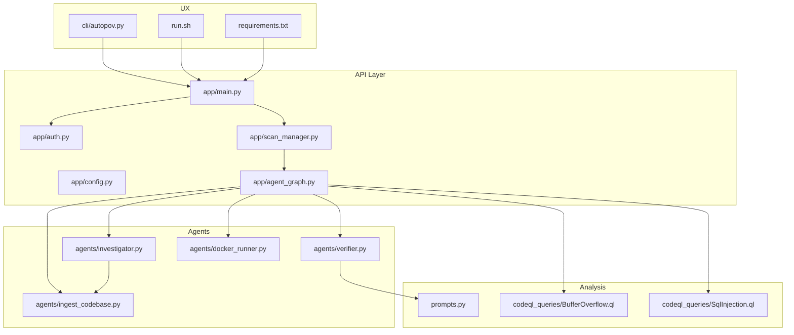
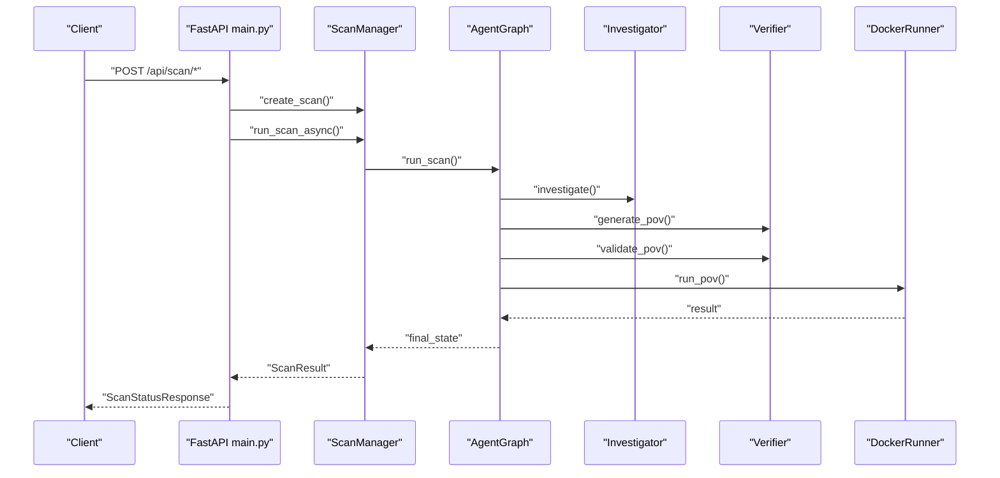
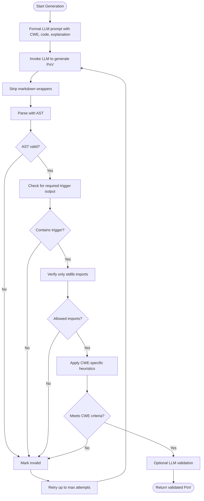
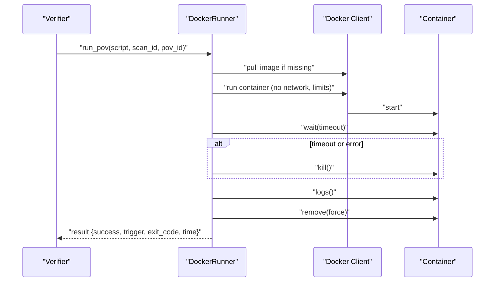
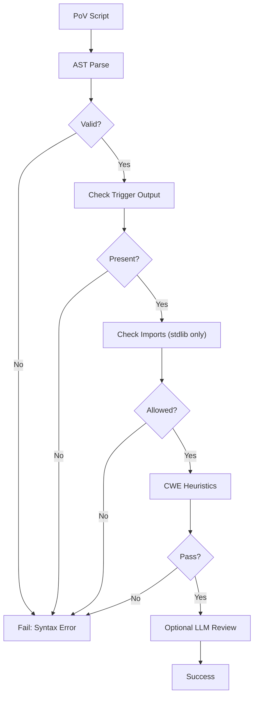
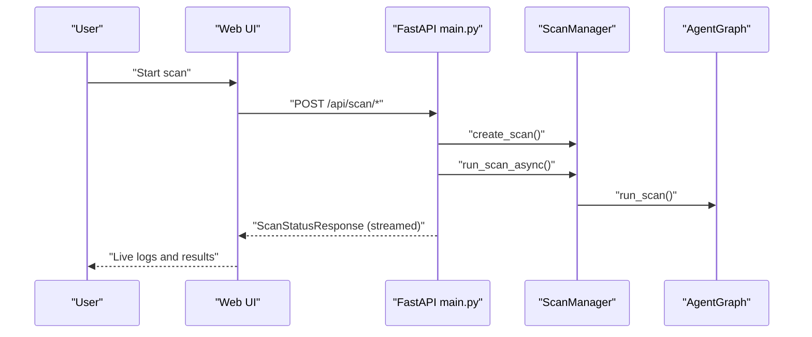
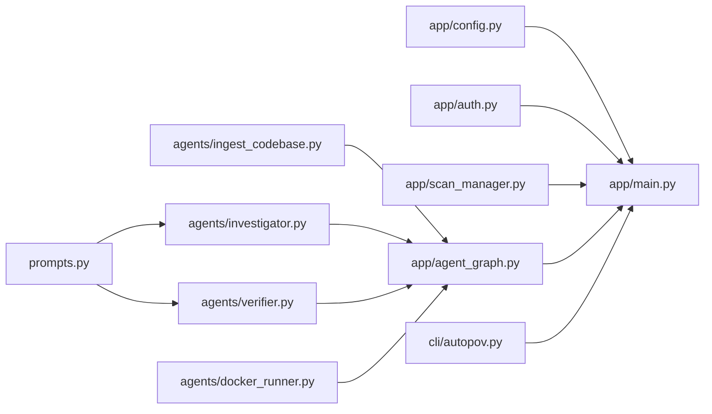

# PoV Generation and Execution

<cite>
**Referenced Files in This Document**
- [README.md](file://autopov/README.md)
- [run.sh](file://autopov/run.sh)
- [requirements.txt](file://autopov/requirements.txt)
- [app/main.py](file://autopov/app/main.py)
- [app/config.py](file://autopov/app/config.py)
- [app/agent_graph.py](file://autopov/app/agent_graph.py)
- [app/scan_manager.py](file://autopov/app/scan_manager.py)
- [app/auth.py](file://autopov/app/auth.py)
- [agents/ingest_codebase.py](file://autopov/agents/ingest_codebase.py)
- [agents/investigator.py](file://autopov/agents/investigator.py)
- [agents/verifier.py](file://autopov/agents/verifier.py)
- [agents/docker_runner.py](file://autopov/agents/docker_runner.py)
- [prompts.py](file://autopov/prompts.py)
- [codeql_queries/BufferOverflow.ql](file://autopov/codeql_queries/BufferOverflow.ql)
- [codeql_queries/SqlInjection.ql](file://autopov/codeql_queries/SqlInjection.ql)
- [cli/autopov.py](file://autopov/cli/autopov.py)
</cite>

## Table of Contents
1. [Introduction](#introduction)
2. [Project Structure](#project-structure)
3. [Core Components](#core-components)
4. [Architecture Overview](#architecture-overview)
5. [Detailed Component Analysis](#detailed-component-analysis)
6. [Dependency Analysis](#dependency-analysis)
7. [Performance Considerations](#performance-considerations)
8. [Troubleshooting Guide](#troubleshooting-guide)
9. [Conclusion](#conclusion)
10. [Appendices](#appendices)

## Introduction
This document explains AutoPoV’s Proof-of-Vulnerability (PoV) generation and execution system for automated exploit generation and secure testing. It covers:
- How PoVs are generated from vulnerability findings
- Quality assurance validation of PoVs
- Docker execution environment and safety controls
- Validation and monitoring of PoV execution
- Practical workflows, troubleshooting, and performance considerations

AutoPoV integrates static analysis (CodeQL), retrieval augmented analysis (RAG), and LLM reasoning to detect, confirm, and validate exploitable weaknesses, then executes PoVs in isolated containers to confirm vulnerability triggers.

## Project Structure
AutoPoV is organized into:
- Backend API (FastAPI) with endpoints for scanning, streaming logs, reports, and API key management
- Agent graph orchestrating the vulnerability detection pipeline
- Agents for ingestion, investigation, PoV generation/validation, and Docker execution
- Configuration and environment settings
- CLI for automation and reporting
- Static analysis queries for supported CWE families

**Diagram sources**
- [app/main.py](file://autopov/app/main.py#L102-L529)
- [app/config.py](file://autopov/app/config.py#L13-L210)
- [app/agent_graph.py](file://autopov/app/agent_graph.py#L78-L582)
- [agents/ingest_codebase.py](file://autopov/agents/ingest_codebase.py#L41-L407)
- [agents/investigator.py](file://autopov/agents/investigator.py#L37-L413)
- [agents/verifier.py](file://autopov/agents/verifier.py#L40-L401)
- [agents/docker_runner.py](file://autopov/agents/docker_runner.py#L27-L379)
- [prompts.py](file://autopov/prompts.py#L7-L374)
- [codeql_queries/BufferOverflow.ql](file://autopov/codeql_queries/BufferOverflow.ql#L1-L59)
- [codeql_queries/SqlInjection.ql](file://autopov/codeql_queries/SqlInjection.ql#L1-L67)
- [cli/autopov.py](file://autopov/cli/autopov.py#L89-L467)
- [run.sh](file://autopov/run.sh#L1-L233)
- [requirements.txt](file://autopov/requirements.txt#L1-L42)

**Section sources**
- [README.md](file://autopov/README.md#L1-L242)
- [run.sh](file://autopov/run.sh#L1-L233)
- [requirements.txt](file://autopov/requirements.txt#L1-L42)

## Core Components
- Configuration and environment: centralizes settings for Docker, LLM modes, paths, and availability checks
- Agent graph: orchestrates ingestion, CodeQL, investigation, PoV generation/validation, and Docker execution
- Ingestion: chunks code, embeds into ChromaDB, supports retrieval for context
- Investigation: LLM-driven triage of findings with CWE-aware prompts and optional Joern analysis for use-after-free
- PoV generation and validation: LLM-driven script generation with AST and policy-based validation
- Docker runner: isolated execution with resource limits and network restrictions
- API and CLI: endpoints, streaming logs, reports, and automation

**Section sources**
- [app/config.py](file://autopov/app/config.py#L13-L210)
- [app/agent_graph.py](file://autopov/app/agent_graph.py#L78-L582)
- [agents/ingest_codebase.py](file://autopov/agents/ingest_codebase.py#L41-L407)
- [agents/investigator.py](file://autopov/agents/investigator.py#L37-L413)
- [agents/verifier.py](file://autopov/agents/verifier.py#L40-L401)
- [agents/docker_runner.py](file://autopov/agents/docker_runner.py#L27-L379)
- [app/main.py](file://autopov/app/main.py#L102-L529)
- [cli/autopov.py](file://autopov/cli/autopov.py#L89-L467)

## Architecture Overview
The system follows a LangGraph-based workflow:
- Ingest codebase into vector store
- Run CodeQL queries for supported CWE families
- Investigate findings with LLM and optional Joern analysis
- Generate PoV scripts with LLM
- Validate PoVs via AST and policy checks
- Execute PoVs in Docker with strict isolation and limits
- Record outcomes and finalize scan

**Diagram sources**
- [app/main.py](file://autopov/app/main.py#L174-L314)
- [app/scan_manager.py](file://autopov/app/scan_manager.py#L86-L200)
- [app/agent_graph.py](file://autopov/app/agent_graph.py#L532-L573)
- [agents/investigator.py](file://autopov/agents/investigator.py#L254-L366)
- [agents/verifier.py](file://autopov/agents/verifier.py#L79-L150)
- [agents/docker_runner.py](file://autopov/agents/docker_runner.py#L62-L192)

## Detailed Component Analysis

### PoV Generation Pipeline
- Input: confirmed vulnerability details (CWE, file path, line number, code snippet, explanation)
- Generation: LLM creates a Python PoV script constrained to standard library and required trigger output
- Validation: AST parsing, required trigger presence, standard library only, CWE-specific heuristics, optional LLM review
- Retry: up to configured attempts with failure analysis prompting improvements

**Diagram sources**
- [agents/verifier.py](file://autopov/agents/verifier.py#L79-L150)
- [agents/verifier.py](file://autopov/agents/verifier.py#L151-L228)
- [prompts.py](file://autopov/prompts.py#L46-L109)

**Section sources**
- [agents/verifier.py](file://autopov/agents/verifier.py#L79-L228)
- [prompts.py](file://autopov/prompts.py#L46-L109)

### Docker Execution Environment
- Isolation: container runs with no network access, mounted read-only PoV directory
- Resource limits: memory and CPU quotas, enforced via container runtime
- Timeouts: enforced by container wait with timeout; on timeout, container is killed
- Output: captures stdout/stderr, determines success by exit code or trigger output
- Batch execution: supports running multiple PoVs with progress callbacks

**Diagram sources**
- [agents/docker_runner.py](file://autopov/agents/docker_runner.py#L62-L192)
- [agents/docker_runner.py](file://autopov/agents/docker_runner.py#L232-L312)

**Section sources**
- [agents/docker_runner.py](file://autopov/agents/docker_runner.py#L27-L192)
- [app/config.py](file://autopov/app/config.py#L78-L84)

### Validation Process
- Syntax checking: AST parse to catch syntax errors
- Policy compliance: required trigger output, standard library only
- CWE-specific checks: heuristics tailored to each CWE family
- LLM-based validation: optional structured review for deeper correctness
- Failure analysis: when validation fails, LLM suggests targeted improvements

**Diagram sources**
- [agents/verifier.py](file://autopov/agents/verifier.py#L151-L228)
- [agents/verifier.py](file://autopov/agents/verifier.py#L265-L292)

**Section sources**
- [agents/verifier.py](file://autopov/agents/verifier.py#L151-L228)

### Safety Mechanisms
- Network isolation: containers launched with no network access
- Resource caps: memory and CPU limits applied at runtime
- Timeouts: enforced via container wait timeouts
- Image hygiene: ensures required base image is present or pulled
- Cleanup: temporary directories and containers removed after execution

**Section sources**
- [agents/docker_runner.py](file://autopov/agents/docker_runner.py#L122-L133)
- [agents/docker_runner.py](file://autopov/agents/docker_runner.py#L135-L144)
- [app/config.py](file://autopov/app/config.py#L78-L84)

### Practical Workflows
- Web UI workflow:
  - Authenticate, select scan type (Git/ZIP/Paste), choose model and CWEs
  - Start scan; monitor progress via streaming logs; download results or reports
- CLI workflow:
  - Generate API key (admin), run scans with various sources, fetch results and PDF reports
- Execution monitoring:
  - Use streaming logs endpoint to observe scan stages and PoV execution outcomes
  - Inspect scan history and metrics for operational insights

**Diagram sources**
- [app/main.py](file://autopov/app/main.py#L174-L383)
- [app/scan_manager.py](file://autopov/app/scan_manager.py#L86-L176)
- [app/agent_graph.py](file://autopov/app/agent_graph.py#L532-L573)

**Section sources**
- [app/main.py](file://autopov/app/main.py#L174-L383)
- [cli/autopov.py](file://autopov/cli/autopov.py#L104-L210)

### Result Interpretation
- Final statuses: confirmed, skipped, failed
- Success determined by either zero exit code or presence of required trigger output
- Logs and timestamps included for traceability
- Reports available in JSON or PDF formats

**Section sources**
- [agents/docker_runner.py](file://autopov/agents/docker_runner.py#L155-L167)
- [app/agent_graph.py](file://autopov/app/agent_graph.py#L435-L452)
- [app/main.py](file://autopov/app/main.py#L397-L428)

## Dependency Analysis
- Backend depends on configuration, authentication, and agent graph
- Agent graph coordinates ingestion, investigation, verification, and Docker execution
- Verification relies on prompts and LLM configuration
- Docker runner depends on Docker SDK and configuration
- CLI depends on API endpoints and authentication

**Diagram sources**
- [app/main.py](file://autopov/app/main.py#L19-L26)
- [app/agent_graph.py](file://autopov/app/agent_graph.py#L22-L27)
- [agents/investigator.py](file://autopov/agents/investigator.py#L27-L30)
- [agents/verifier.py](file://autopov/agents/verifier.py#L27-L33)
- [agents/docker_runner.py](file://autopov/agents/docker_runner.py#L19-L20)
- [cli/autopov.py](file://autopov/cli/autopov.py#L20-L23)

**Section sources**
- [app/config.py](file://autopov/app/config.py#L13-L210)
- [app/auth.py](file://autopov/app/auth.py#L32-L168)
- [app/agent_graph.py](file://autopov/app/agent_graph.py#L78-L135)

## Performance Considerations
- Concurrency: thread pool executor used for synchronous scan execution
- Cost control: configurable maximum cost and inference-time-based estimates
- Chunking and embeddings: efficient code ingestion with configurable chunk sizes and overlaps
- Docker batching: batch execution of PoVs with progress callbacks reduces overhead
- Static analysis fallback: when CodeQL unavailable, LLM-only triage continues

[No sources needed since this section provides general guidance]

## Troubleshooting Guide
- Docker not available:
  - Symptoms: execution results indicate Docker not available or container errors
  - Actions: ensure Docker is installed and running; verify environment flag and image availability
- LLM configuration issues:
  - Symptoms: verification errors indicating missing API keys or unavailable providers
  - Actions: configure appropriate API keys and base URLs; verify model mode selection
- CodeQL not available:
  - Symptoms: warnings and fallback to LLM-only analysis
  - Actions: install CodeQL CLI and ensure PATH is correct
- Joern not available (CWE-416):
  - Symptoms: skipped CPG analysis
  - Actions: install Joern and ensure PATH is correct
- Validation failures:
  - Symptoms: AST errors, missing trigger, non-stdlib imports, or CWE mismatches
  - Actions: review PoV script against validation criteria; leverage LLM retry analysis for suggestions
- Execution timeouts or failures:
  - Symptoms: container killed or non-zero exit code
  - Actions: adjust timeout and resource limits; refine PoV to avoid heavy computation

**Section sources**
- [agents/docker_runner.py](file://autopov/agents/docker_runner.py#L40-L61)
- [agents/verifier.py](file://autopov/agents/verifier.py#L53-L77)
- [app/config.py](file://autopov/app/config.py#L137-L172)
- [agents/investigator.py](file://autopov/agents/investigator.py#L112-L114)
- [agents/verifier.py](file://autopov/agents/verifier.py#L177-L207)
- [agents/docker_runner.py](file://autopov/agents/docker_runner.py#L135-L144)

## Conclusion
AutoPoV automates the end-to-end vulnerability lifecycle: detection, triage, PoV generation, validation, and secure execution. Its modular architecture, strong safety controls in Docker, and structured validation ensure reliable and repeatable PoV generation for benchmarking and secure testing.

[No sources needed since this section summarizes without analyzing specific files]

## Appendices

### CWE Support and Queries
- Supported CWE families: buffer overflow, SQL injection, use-after-free, integer overflow
- CodeQL queries provide static detection for applicable CWEs

**Section sources**
- [README.md](file://autopov/README.md#L194-L202)
- [codeql_queries/BufferOverflow.ql](file://autopov/codeql_queries/BufferOverflow.ql#L1-L59)
- [codeql_queries/SqlInjection.ql](file://autopov/codeql_queries/SqlInjection.ql#L1-L67)

### Configuration Reference
- Docker execution defaults: image, timeout, memory, CPU quota
- LLM modes: online (OpenRouter) and offline (Ollama)
- Paths: data, results, runs, and temporary directories

**Section sources**
- [app/config.py](file://autopov/app/config.py#L78-L111)
- [app/config.py](file://autopov/app/config.py#L173-L189)