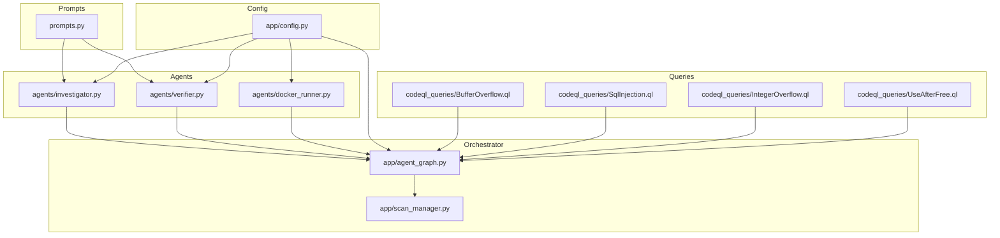
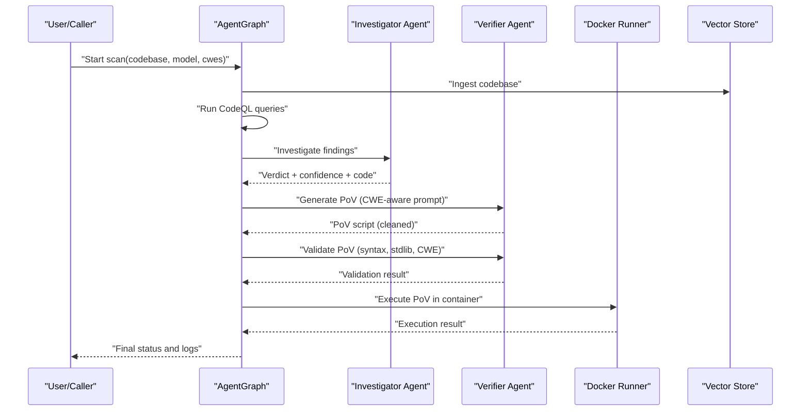
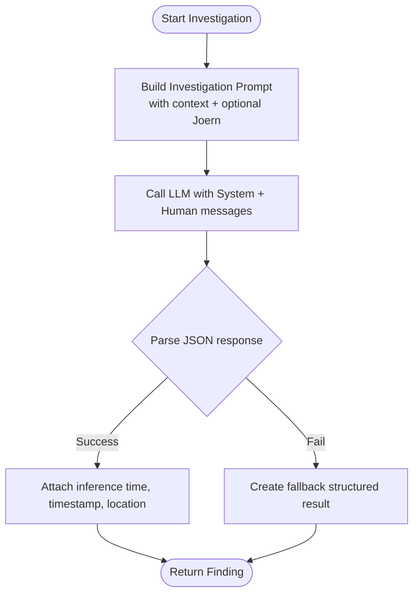
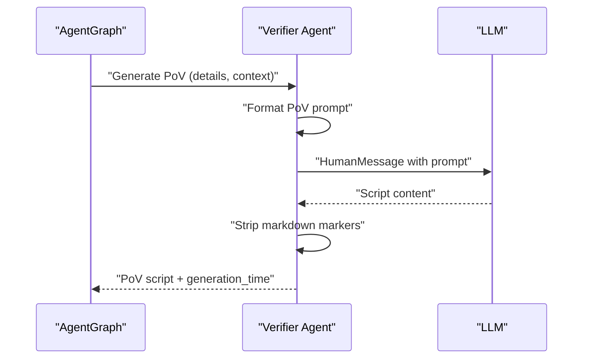
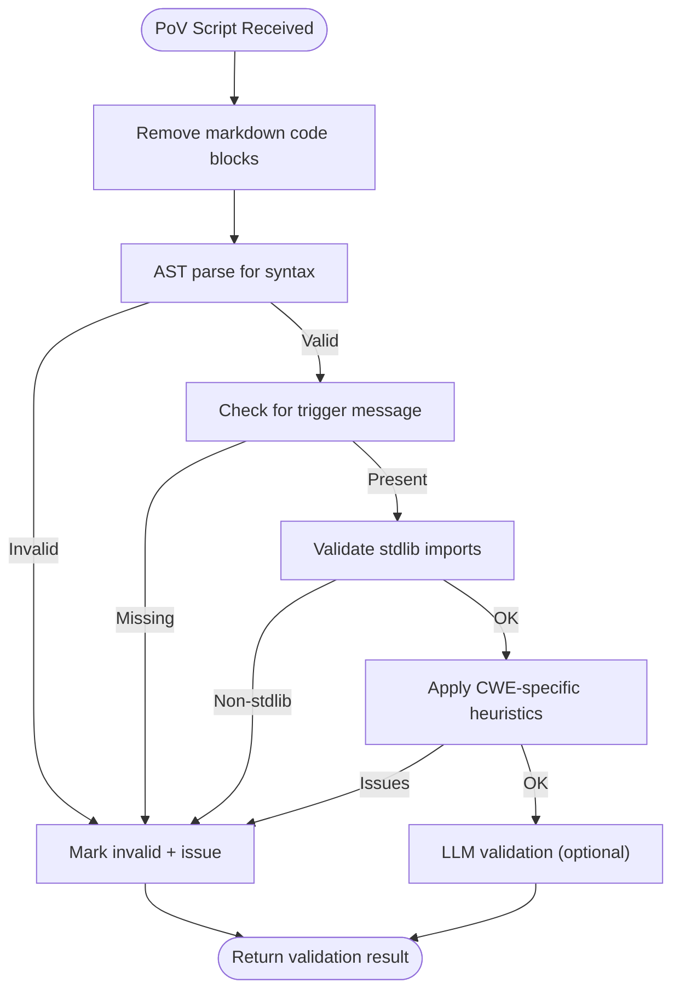
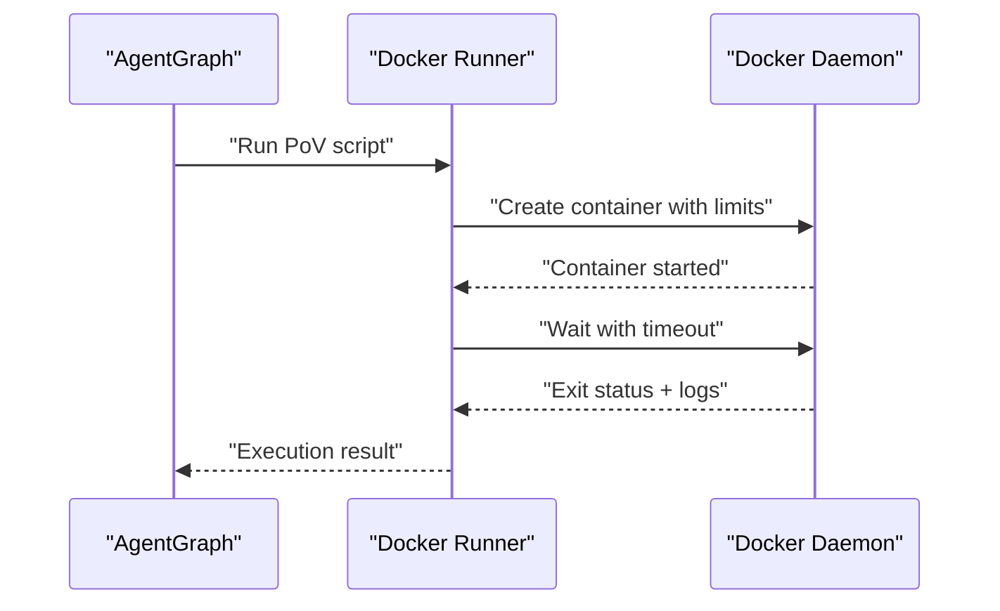
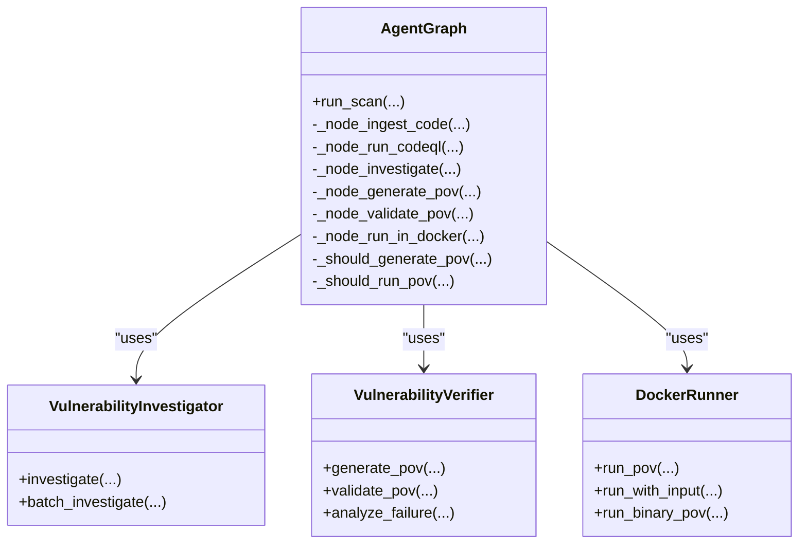
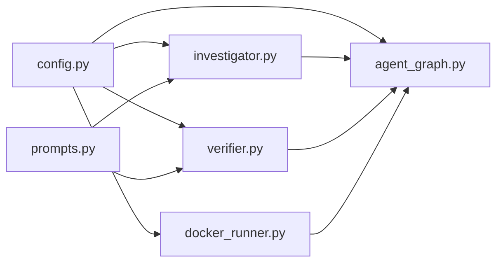

# PoV Script Generation

<cite>
**Referenced Files in This Document**
- [README.md](file://README.md)
- [prompts.py](file://prompts.py)
- [investigator.py](file://agents/investigator.py)
- [verifier.py](file://agents/verifier.py)
- [docker_runner.py](file://agents/docker_runner.py)
- [agent_graph.py](file://app/agent_graph.py)
- [scan_manager.py](file://app/scan_manager.py)
- [config.py](file://app/config.py)
- [BufferOverflow.ql](file://codeql_queries/BufferOverflow.ql)
- [SqlInjection.ql](file://codeql_queries/SqlInjection.ql)
- [IntegerOverflow.ql](file://codeql_queries/IntegerOverflow.ql)
- [UseAfterFree.ql](file://codeql_queries/UseAfterFree.ql)
</cite>

## Table of Contents
1. [Introduction](#introduction)
2. [Project Structure](#project-structure)
3. [Core Components](#core-components)
4. [Architecture Overview](#architecture-overview)
5. [Detailed Component Analysis](#detailed-component-analysis)
6. [Dependency Analysis](#dependency-analysis)
7. [Performance Considerations](#performance-considerations)
8. [Troubleshooting Guide](#troubleshooting-guide)
9. [Conclusion](#conclusion)

## Introduction
This document explains the automated Proof-of-Vulnerability (PoV) script generation process in AutoPoV. It covers the LLM-driven workflow from vulnerability analysis to executable PoV script creation, including prompt formatting, CWE-specific template selection, vulnerability context integration, script cleaning and formatting, and integration with the broader agent system for validation and execution.

Supported CWE families include:
- CWE-119 (Buffer Overflow)
- CWE-89 (SQL Injection)
- CWE-416 (Use After Free)
- CWE-190 (Integer Overflow)

## Project Structure
The PoV generation pipeline spans several modules:
- Prompt templates and formatting utilities
- Agents for investigation, PoV generation/validation, and Docker execution
- Orchestrator graph that sequences the workflow
- Configuration and scanning manager

**Diagram sources**
- [prompts.py](file://prompts.py#L7-L374)
- [investigator.py](file://agents/investigator.py#L1-L413)
- [verifier.py](file://agents/verifier.py#L1-L401)
- [docker_runner.py](file://agents/docker_runner.py#L1-L379)
- [agent_graph.py](file://app/agent_graph.py#L1-L582)
- [scan_manager.py](file://app/scan_manager.py#L1-L344)
- [config.py](file://app/config.py#L1-L210)
- [BufferOverflow.ql](file://codeql_queries/BufferOverflow.ql#L1-L59)
- [SqlInjection.ql](file://codeql_queries/SqlInjection.ql#L1-L67)
- [IntegerOverflow.ql](file://codeql_queries/IntegerOverflow.ql#L1-L62)
- [UseAfterFree.ql](file://codeql_queries/UseAfterFree.ql#L1-L41)

**Section sources**
- [README.md](file://README.md#L1-L242)
- [prompts.py](file://prompts.py#L7-L374)
- [agent_graph.py](file://app/agent_graph.py#L1-L582)
- [config.py](file://app/config.py#L1-L210)

## Core Components
- Prompt templates define the instruction sets for investigation, PoV generation, validation, and retry analysis. They embed vulnerability details, target code context, and explicit requirements for deterministic, standard-library-only PoV scripts.
- The Investigator agent uses LLMs to assess CodeQL alerts and produce structured verdicts with confidence, explanation, and vulnerable code snippets.
- The Verifier agent generates PoV scripts from verified findings, cleans markdown artifacts, validates syntax and standards, and performs CWE-specific checks.
- The Docker Runner executes PoV scripts in isolated containers with strict resource limits and timeouts.
- The Orchestrator (LangGraph) coordinates ingestion, CodeQL analysis, investigation, PoV generation, validation, and execution, tracking costs and retries.
- The Scan Manager persists results and maintains metrics for benchmarking.

**Section sources**
- [prompts.py](file://prompts.py#L7-L374)
- [investigator.py](file://agents/investigator.py#L254-L366)
- [verifier.py](file://agents/verifier.py#L79-L150)
- [docker_runner.py](file://agents/docker_runner.py#L62-L192)
- [agent_graph.py](file://app/agent_graph.py#L78-L134)
- [scan_manager.py](file://app/scan_manager.py#L201-L236)

## Architecture Overview
The end-to-end workflow:
1. Code ingestion and optional CodeQL queries produce candidate findings.
2. Investigator evaluates each finding and assigns a verdict and confidence.
3. Verified findings trigger PoV generation with CWE-aware prompts.
4. Generated scripts are validated for syntax, imports, and CWE correctness.
5. Validated PoVs are executed in Docker with safety constraints.
6. Results are logged and summarized for reporting and benchmarking.

**Diagram sources**
- [agent_graph.py](file://app/agent_graph.py#L136-L452)
- [investigator.py](file://agents/investigator.py#L254-L366)
- [verifier.py](file://agents/verifier.py#L79-L150)
- [docker_runner.py](file://agents/docker_runner.py#L62-L192)

## Detailed Component Analysis

### Prompt Engineering and Template Selection
- Investigation prompt integrates CodeQL alert metadata, code context, and optional Joern-derived CPG analysis for use-after-free.
- PoV generation prompt emphasizes deterministic triggers, standard library usage, error handling, and comments. It includes CWE-specific guidance for buffer overflow, SQL injection, use-after-free, and integer overflow.
- Validation prompt enforces strict criteria: standard library only, presence of a specific trigger message, deterministic behavior, and logical alignment with the CWE.
- Retry analysis prompt helps refine failed attempts by analyzing execution output and suggesting targeted improvements.

Key prompt formatting utilities:
- Centralized formatters assemble investigation, PoV generation, validation, and retry prompts with dynamic placeholders for vulnerability details and context.

**Section sources**
- [prompts.py](file://prompts.py#L7-L374)

### Vulnerability Analysis to Verified Finding
- The Investigator agent constructs prompts with surrounding code context, optional Joern analysis for use-after-free, and calls the configured LLM to produce a structured JSON response containing verdict, confidence, explanation, vulnerable code, and impact.
- The orchestrator filters findings by verdict and confidence thresholds to decide whether to generate PoVs.

**Diagram sources**
- [investigator.py](file://agents/investigator.py#L296-L347)

**Section sources**
- [investigator.py](file://agents/investigator.py#L254-L366)
- [agent_graph.py](file://app/agent_graph.py#L488-L500)

### PoV Generation Pipeline
- The Verifier agent formats a CWE-aware prompt embedding vulnerability details and target code context, then invokes the LLM to produce a Python script.
- The agent removes markdown code block wrappers to ensure clean Python code.
- Generation time is recorded for cost estimation.

**Diagram sources**
- [verifier.py](file://agents/verifier.py#L105-L139)

**Section sources**
- [verifier.py](file://agents/verifier.py#L79-L150)

### Script Cleaning and Formatting
- Markdown code block removal ensures the returned script is pure Python.
- Validation includes:
  - AST-based syntax validation
  - Presence of a required trigger message
  - Standard library-only imports
  - CWE-specific heuristics (e.g., SQL keywords for CWE-89, large integers for CWE-190)
  - Optional LLM-based validation for deeper logic checks

**Diagram sources**
- [verifier.py](file://agents/verifier.py#L151-L227)

**Section sources**
- [verifier.py](file://agents/verifier.py#L151-L227)

### CWE-Specific Guidance in Prompts
- Buffer Overflow (CWE-119): Construct inputs that exceed buffer bounds.
- SQL Injection (CWE-89): Craft malicious SQL payloads.
- Use After Free (CWE-416): Typically requires C code; consider a Python wrapper scenario.
- Integer Overflow (CWE-190): Use large values to cause wraparound.

These guidelines are embedded in the PoV generation prompt and used by the validator for heuristic checks.

**Section sources**
- [prompts.py](file://prompts.py#L71-L78)
- [verifier.py](file://agents/verifier.py#L265-L291)

### Execution in Docker and Safety Controls
- The Docker Runner executes PoVs in a Python slim image with:
  - No network access
  - Memory and CPU quotas
  - Timeout limits
- It captures stdout/stderr, detects the trigger message, and records execution time and exit codes.

**Diagram sources**
- [docker_runner.py](file://agents/docker_runner.py#L110-L167)

**Section sources**
- [docker_runner.py](file://agents/docker_runner.py#L62-L192)
- [config.py](file://app/config.py#L78-L84)

### Integration with the Broader Agent System
- The Orchestrator coordinates:
  - Code ingestion and CodeQL queries
  - Investigation and filtering
  - PoV generation and validation
  - Docker execution
  - Logging and finalization
- The Scan Manager persists results to JSON and CSV, enabling benchmarking and reporting.

**Diagram sources**
- [agent_graph.py](file://app/agent_graph.py#L78-L134)
- [investigator.py](file://agents/investigator.py#L37-L88)
- [verifier.py](file://agents/verifier.py#L40-L78)
- [docker_runner.py](file://agents/docker_runner.py#L27-L50)

**Section sources**
- [agent_graph.py](file://app/agent_graph.py#L136-L452)
- [scan_manager.py](file://app/scan_manager.py#L118-L176)

## Dependency Analysis
- The orchestrator depends on agents and configuration for model selection, Docker availability, and safety limits.
- Investigator optionally invokes Joern for use-after-free analysis and integrates with RAG for context enhancement.
- Verifier relies on prompt formatters and LLMs for generation and validation.
- Docker Runner depends on Docker SDK availability and configuration.

**Diagram sources**
- [config.py](file://app/config.py#L173-L189)
- [agent_graph.py](file://app/agent_graph.py#L1-L582)
- [investigator.py](file://agents/investigator.py#L1-L413)
- [verifier.py](file://agents/verifier.py#L1-L401)
- [docker_runner.py](file://agents/docker_runner.py#L1-L379)
- [prompts.py](file://prompts.py#L1-L374)

**Section sources**
- [config.py](file://app/config.py#L1-L210)
- [agent_graph.py](file://app/agent_graph.py#L1-L582)

## Performance Considerations
- Inference time tracking is captured during investigation and PoV generation for cost estimation.
- Docker execution includes timeouts and resource limits to prevent runaway workloads.
- Retries are bounded to avoid infinite loops; failed attempts are analyzed to guide refinements.

Practical tips:
- Prefer deterministic inputs and minimal branching in PoV scripts to improve reliability.
- Keep scripts small and focused on the core vulnerability trigger.
- Monitor container logs for subtle failures (e.g., missing libraries or runtime errors).

**Section sources**
- [investigator.py](file://agents/investigator.py#L337-L342)
- [verifier.py](file://agents/verifier.py#L131-L133)
- [docker_runner.py](file://agents/docker_runner.py#L135-L143)
- [agent_graph.py](file://app/agent_graph.py#L509-L514)

## Troubleshooting Guide
Common issues and resolutions:
- Generation failures:
  - The Verifier agent returns structured errors with timing metadata; inspect the error field and generation time.
  - Use retry analysis to refine the PoV based on execution output.
- Validation failures:
  - Missing trigger message or non-stdlib imports are common causes; adjust the script to meet requirements.
  - CWE-specific heuristics may flag missing patterns; incorporate appropriate payloads or conditions.
- Docker execution failures:
  - Verify Docker availability and image pull; ensure the container starts and exits cleanly.
  - Review stdout/stderr for runtime exceptions or missing dependencies.
- Investigation errors:
  - Confirm LLM credentials and model availability; check for timeouts or parsing failures in JSON responses.

**Section sources**
- [verifier.py](file://agents/verifier.py#L141-L149)
- [verifier.py](file://agents/verifier.py#L332-L391)
- [docker_runner.py](file://agents/docker_runner.py#L81-L90)
- [investigator.py](file://agents/investigator.py#L349-L365)

## Conclusion
AutoPoV’s PoV generation pipeline combines structured prompts, LLM reasoning, and robust validation to produce reliable, deterministic exploit demonstrations for supported CWE families. The orchestrator coordinates ingestion, analysis, generation, validation, and execution while enforcing safety and cost controls. The modular design enables easy extension to additional CWEs and refinement of prompts and validation heuristics.