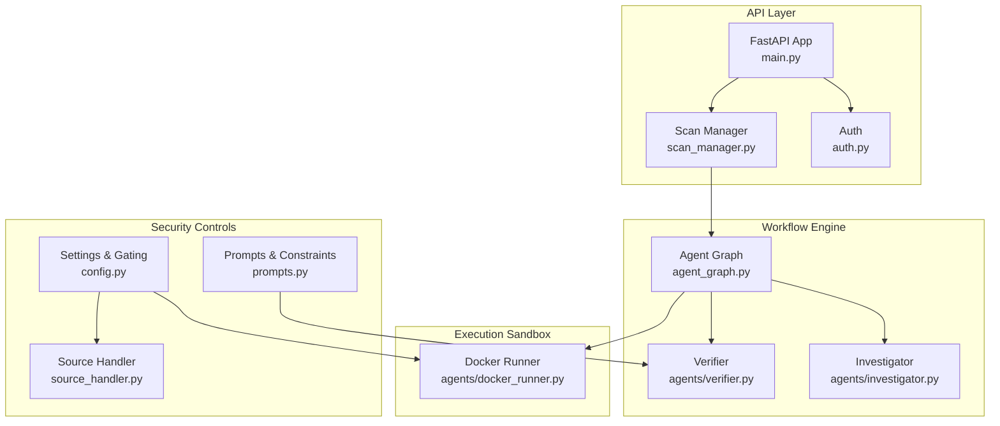
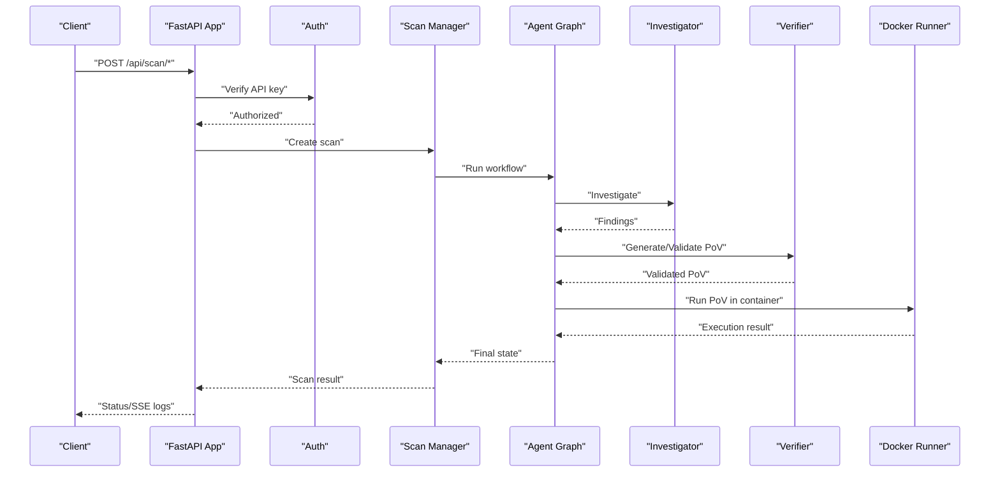
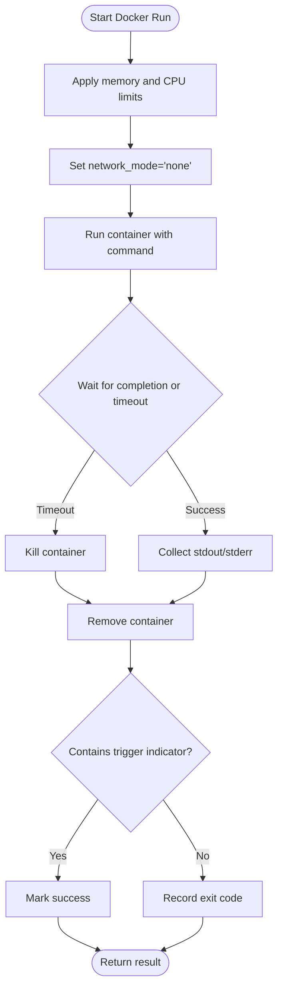
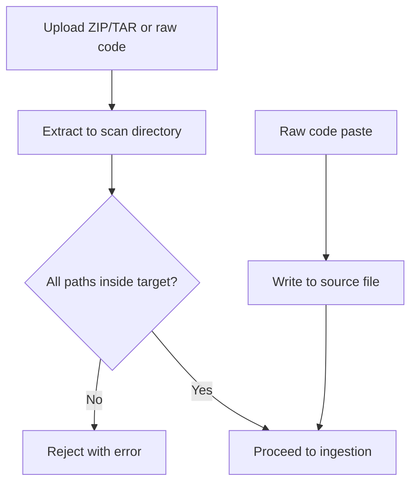
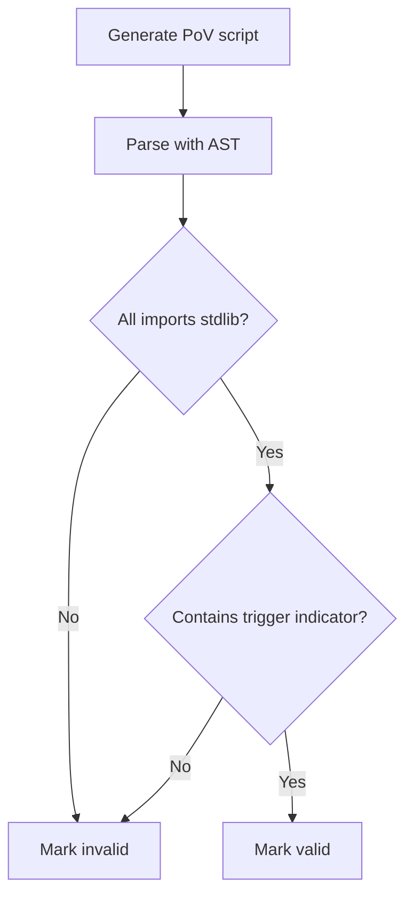
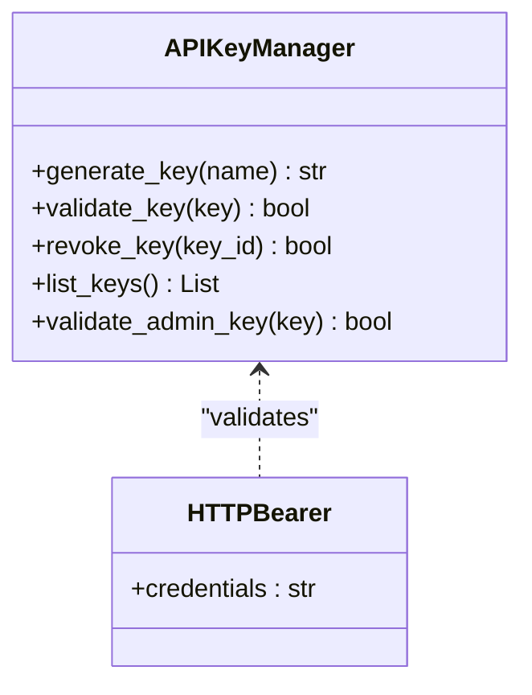
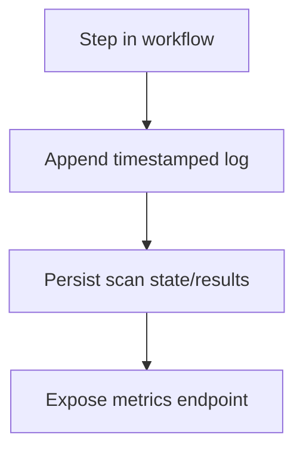
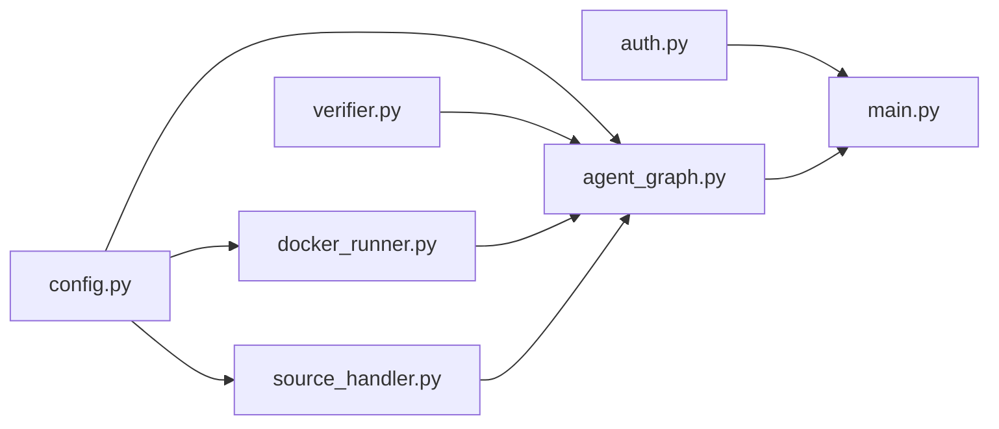

# Safety and Security Measures

<cite>
**Referenced Files in This Document**
- [main.py](file://autopov/app/main.py)
- [docker_runner.py](file://autopov/agents/docker_runner.py)
- [config.py](file://autopov/app/config.py)
- [scan_manager.py](file://autopov/app/scan_manager.py)
- [source_handler.py](file://autopov/app/source_handler.py)
- [auth.py](file://autopov/app/auth.py)
- [verifier.py](file://autopov/agents/verifier.py)
- [prompts.py](file://autopov/prompts.py)
- [agent_graph.py](file://autopov/app/agent_graph.py)
- [SqlInjection.ql](file://autopov/codeql_queries/SqlInjection.ql)
</cite>

## Table of Contents
1. [Introduction](#introduction)
2. [Project Structure](#project-structure)
3. [Core Components](#core-components)
4. [Architecture Overview](#architecture-overview)
5. [Detailed Component Analysis](#detailed-component-analysis)
6. [Dependency Analysis](#dependency-analysis)
7. [Performance Considerations](#performance-considerations)
8. [Troubleshooting Guide](#troubleshooting-guide)
9. [Conclusion](#conclusion)
10. [Appendices](#appendices)

## Introduction
This document explains the safety and security measures implemented in the Proof-of-Vulnerability (PoV) generation and execution system. It covers multi-layered security architecture including container isolation, resource limiting, and network restrictions; timeout enforcement, memory caps, and process monitoring; input validation and sanitization; standard library restrictions and import validation; logging and audit trails; fail-safe mechanisms; and deployment considerations across environments. Practical configuration examples and best practices are included for production hardening.

## Project Structure
The system is organized around a FastAPI application that orchestrates a LangGraph-based workflow. Key security-relevant modules include:
- API entrypoint and orchestration
- Docker-based execution sandbox
- Configuration and environment gating
- Input handling with path-traversal protections
- Authentication and authorization
- PoV generation and validation with strict constraints
- Logging and audit trail integration

**Diagram sources**
- [main.py](file://autopov/app/main.py#L102-L121)
- [scan_manager.py](file://autopov/app/scan_manager.py#L40-L50)
- [agent_graph.py](file://autopov/app/agent_graph.py#L78-L135)
- [docker_runner.py](file://autopov/agents/docker_runner.py#L27-L37)
- [config.py](file://autopov/app/config.py#L13-L210)
- [source_handler.py](file://autopov/app/source_handler.py#L18-L24)
- [prompts.py](file://autopov/prompts.py#L46-L108)

**Section sources**
- [main.py](file://autopov/app/main.py#L102-L121)
- [agent_graph.py](file://autopov/app/agent_graph.py#L78-L135)

## Core Components
- API and Orchestration: Enforces authentication, exposes scan endpoints, streams logs, and manages metrics.
- Docker Runner: Executes PoV scripts in isolated containers with strict resource limits and zero network access.
- Configuration: Centralizes environment-driven security settings including timeouts, memory caps, CPU quotas, and tool availability checks.
- Source Handler: Validates and extracts uploaded archives to prevent path traversal.
- Authentication: Bearer token-based API key management with admin controls.
- Verifier: Generates PoV scripts with strict constraints and validates them using AST and standard library checks.
- Agent Graph: Logs all actions and transitions for auditability.

**Section sources**
- [main.py](file://autopov/app/main.py#L177-L385)
- [docker_runner.py](file://autopov/agents/docker_runner.py#L27-L37)
- [config.py](file://autopov/app/config.py#L78-L84)
- [source_handler.py](file://autopov/app/source_handler.py#L55-L64)
- [auth.py](file://autopov/app/auth.py#L32-L131)
- [verifier.py](file://autopov/agents/verifier.py#L151-L227)
- [agent_graph.py](file://autopov/app/agent_graph.py#L516-L520)

## Architecture Overview
The system enforces security through layered controls:
- Network isolation: Containers run with no network access.
- Resource enforcement: CPU quota and memory limits are applied per container.
- Input validation: Uploaded archives are scanned for path traversal.
- Standard library restriction: PoV scripts must use only Python standard library.
- Timeout enforcement: Container wait operations enforce a configurable timeout.
- Audit logging: All workflow steps are logged with timestamps.

**Diagram sources**
- [main.py](file://autopov/app/main.py#L177-L385)
- [auth.py](file://autopov/app/auth.py#L137-L162)
- [scan_manager.py](file://autopov/app/scan_manager.py#L86-L116)
- [agent_graph.py](file://autopov/app/agent_graph.py#L290-L433)
- [verifier.py](file://autopov/agents/verifier.py#L151-L227)
- [docker_runner.py](file://autopov/agents/docker_runner.py#L122-L156)

## Detailed Component Analysis

### Container Isolation and Resource Limiting
- Network isolation: Containers are started with no network access to prevent outbound connections and lateral movement.
- Memory cap: Enforced via container memory limit setting.
- CPU quota: Enforced via CPU quota configuration.
- Timeout enforcement: Container wait operation uses a timeout; on expiration, the container is killed and marked as failed.
- Process monitoring: Captures stdout/stderr and determines if the PoV triggered by scanning for a specific indicator in logs.

**Diagram sources**
- [docker_runner.py](file://autopov/agents/docker_runner.py#L122-L156)

**Section sources**
- [docker_runner.py](file://autopov/agents/docker_runner.py#L122-L156)
- [config.py](file://autopov/app/config.py#L78-L84)

### Input Validation and Sanitization
- ZIP/TAR extraction: Validates archive members to prevent path traversal by ensuring all paths remain within the intended extraction directory.
- Raw code paste: Writes code to a controlled temporary directory under a scan-scoped path.
- File/folder upload: Copies files into a dedicated source directory with optional structure preservation.

**Diagram sources**
- [source_handler.py](file://autopov/app/source_handler.py#L55-L64)
- [source_handler.py](file://autopov/app/source_handler.py#L191-L230)

**Section sources**
- [source_handler.py](file://autopov/app/source_handler.py#L55-L64)
- [source_handler.py](file://autopov/app/source_handler.py#L191-L230)

### Standard Library Restrictions and Import Validation
- Constraint in prompts: PoV scripts must use only Python standard library.
- AST-based validation: Parses the script to detect non-standard imports and reports them as invalid.
- Required output: Scripts must include a specific indicator when vulnerability is triggered.

**Diagram sources**
- [prompts.py](file://autopov/prompts.py#L64-L77)
- [verifier.py](file://autopov/agents/verifier.py#L190-L207)
- [verifier.py](file://autopov/agents/verifier.py#L185-L189)

**Section sources**
- [prompts.py](file://autopov/prompts.py#L64-L77)
- [verifier.py](file://autopov/agents/verifier.py#L190-L207)
- [verifier.py](file://autopov/agents/verifier.py#L185-L189)

### Timeout Enforcement, Memory Caps, and Process Monitoring
- Timeout: Container wait uses a timeout value from configuration; on timeout, the container is killed.
- Memory cap: Applied via container memory limit setting.
- CPU quota: Applied via CPU quota scaling.
- Monitoring: Captures stdout/stderr and computes execution time; determines success based on exit code and presence of trigger indicator.

**Section sources**
- [docker_runner.py](file://autopov/agents/docker_runner.py#L135-L156)
- [config.py](file://autopov/app/config.py#L78-L84)

### Authentication and Authorization
- API key management: Generates, stores, and validates hashed API keys; supports revocation and listing.
- Admin key: Separate admin key validation for sensitive endpoints.
- Bearer token: Enforced via HTTP bearer security dependency.

**Diagram sources**
- [auth.py](file://autopov/app/auth.py#L32-L131)

**Section sources**
- [auth.py](file://autopov/app/auth.py#L32-L131)

### Logging and Audit Trail
- Workflow logging: The Agent Graph appends timestamped log entries for each step.
- Scan persistence: Scan state and results are persisted to disk for later retrieval.
- Metrics: Provides aggregated metrics for completed scans.

**Diagram sources**
- [agent_graph.py](file://autopov/app/agent_graph.py#L516-L520)
- [scan_manager.py](file://autopov/app/scan_manager.py#L201-L235)
- [main.py](file://autopov/app/main.py#L514-L517)

**Section sources**
- [agent_graph.py](file://autopov/app/agent_graph.py#L516-L520)
- [scan_manager.py](file://autopov/app/scan_manager.py#L201-L235)
- [main.py](file://autopov/app/main.py#L514-L517)

### Fail-Safe Mechanisms and Emergency Procedures
- Graceful degradation: If CodeQL is unavailable, the system falls back to LLM-only analysis.
- Tool availability checks: Environment checks for Docker, CodeQL, and Joern; safe defaults when tools are missing.
- Container kill on timeout: Ensures runaway processes are terminated.
- Scan cancellation and cleanup: Supports cancelling scans and cleaning up resources.

**Section sources**
- [agent_graph.py](file://autopov/app/agent_graph.py#L168-L173)
- [config.py](file://autopov/app/config.py#L137-L171)
- [docker_runner.py](file://autopov/agents/docker_runner.py#L140-L143)
- [scan_manager.py](file://autopov/app/scan_manager.py#L287-L302)

### Security Considerations Across Environments
- Docker-enabled environments: Full sandboxing with network isolation, memory/CPU limits, and timeouts.
- Docker-disabled environments: Falls back to local execution paths; ensure resource controls are enforced at the host level.
- Tool availability: CodeQL and Joern are optional; absence triggers fallback logic.
- Network isolation: Even in non-Docker modes, input validation and restricted imports still apply.

**Section sources**
- [config.py](file://autopov/app/config.py#L137-L171)
- [agent_graph.py](file://autopov/app/agent_graph.py#L168-L173)

### Best Practices for Secure PoV Generation and Execution
- Always run PoVs in isolated containers with no network access.
- Enforce strict memory and CPU limits; configure appropriate timeouts.
- Validate all inputs for path traversal and sanitize filenames.
- Restrict PoV scripts to standard library only; disallow external imports.
- Monitor execution logs and enforce deterministic indicators for vulnerability triggering.
- Use API key authentication and limit administrative access.
- Track and audit all scan activities; expose metrics for observability.

[No sources needed since this section provides general guidance]

## Dependency Analysis
The security-critical dependencies and their roles:
- Docker Runner depends on configuration for limits and timeouts.
- Agent Graph logs and coordinates the end-to-end workflow.
- Verifier enforces PoV constraints and validations.
- Source Handler prevents path traversal in uploads.
- Auth ensures only authorized clients can trigger scans.

**Diagram sources**
- [config.py](file://autopov/app/config.py#L78-L84)
- [docker_runner.py](file://autopov/agents/docker_runner.py#L27-L37)
- [source_handler.py](file://autopov/app/source_handler.py#L18-L24)
- [agent_graph.py](file://autopov/app/agent_graph.py#L78-L135)
- [verifier.py](file://autopov/agents/verifier.py#L151-L227)
- [auth.py](file://autopov/app/auth.py#L32-L131)
- [main.py](file://autopov/app/main.py#L102-L121)

**Section sources**
- [config.py](file://autopov/app/config.py#L78-L84)
- [docker_runner.py](file://autopov/agents/docker_runner.py#L27-L37)
- [source_handler.py](file://autopov/app/source_handler.py#L18-L24)
- [agent_graph.py](file://autopov/app/agent_graph.py#L78-L135)
- [verifier.py](file://autopov/agents/verifier.py#L151-L227)
- [auth.py](file://autopov/app/auth.py#L32-L131)
- [main.py](file://autopov/app/main.py#L102-L121)

## Performance Considerations
- Container overhead: Prefer smaller base images and minimize mounted volumes.
- Resource allocation: Right-size memory and CPU quotas to balance reliability and throughput.
- Timeouts: Tune timeouts to match expected execution durations while preventing resource starvation.
- Concurrency: Use thread pools and asynchronous processing to handle multiple scans efficiently.

[No sources needed since this section provides general guidance]

## Troubleshooting Guide
Common issues and mitigations:
- Docker not available: The system gracefully degrades and logs tool unavailability; ensure Docker daemon is running and accessible.
- Archive extraction failures: Verify archives do not contain path traversal attempts; inspect logs for validation errors.
- PoV validation failures: Review AST and import validation issues; adjust PoV to meet standard library constraints.
- Execution timeouts: Increase container timeout or optimize PoV logic; confirm resource limits are sufficient.
- Authentication errors: Confirm API key validity and permissions; check admin key configuration.

**Section sources**
- [config.py](file://autopov/app/config.py#L137-L171)
- [source_handler.py](file://autopov/app/source_handler.py#L55-L64)
- [verifier.py](file://autopov/agents/verifier.py#L190-L207)
- [docker_runner.py](file://autopov/agents/docker_runner.py#L135-L156)
- [auth.py](file://autopov/app/auth.py#L137-L162)

## Conclusion
The AutoPoV system implements a robust, multi-layered security architecture centered on container isolation, strict resource controls, and comprehensive input validation. By enforcing standard library constraints, requiring deterministic vulnerability triggers, and maintaining detailed audit logs, it minimizes risk while enabling reliable PoV generation and execution. Deployment-specific adaptations ensure secure operation across diverse environments.

[No sources needed since this section summarizes without analyzing specific files]

## Appendices

### Security Configuration Examples
- Docker settings: Configure image, timeout, memory limit, and CPU quota in the configuration module.
- API keys: Generate and manage API keys via admin endpoints; restrict access to trusted clients.
- Tool availability: Ensure Docker, CodeQL, and Joern are installed and available; otherwise, fallback logic applies.

**Section sources**
- [config.py](file://autopov/app/config.py#L78-L84)
- [auth.py](file://autopov/app/auth.py#L63-L79)
- [agent_graph.py](file://autopov/app/agent_graph.py#L168-L173)

### Threat Mitigation Strategies
- Container escape prevention: Disable network access and mount only necessary files; enforce strict limits.
- Supply chain and malicious inputs: Validate and sanitize all uploaded artifacts; reject path traversal attempts.
- LLM misuse: Enforce PoV constraints in prompts and validate with AST checks.
- Excessive resource consumption: Apply CPU quotas and memory caps; monitor execution logs.

**Section sources**
- [docker_runner.py](file://autopov/agents/docker_runner.py#L122-L156)
- [source_handler.py](file://autopov/app/source_handler.py#L55-L64)
- [prompts.py](file://autopov/prompts.py#L64-L77)
- [verifier.py](file://autopov/agents/verifier.py#L190-L207)

### Compliance Measures
- Access control: Require API keys and admin keys for privileged operations.
- Auditability: Maintain logs and scan history for traceability.
- Data handling: Sanitize inputs and avoid storing sensitive data unnecessarily.

**Section sources**
- [auth.py](file://autopov/app/auth.py#L137-L162)
- [agent_graph.py](file://autopov/app/agent_graph.py#L516-L520)
- [scan_manager.py](file://autopov/app/scan_manager.py#L201-L235)