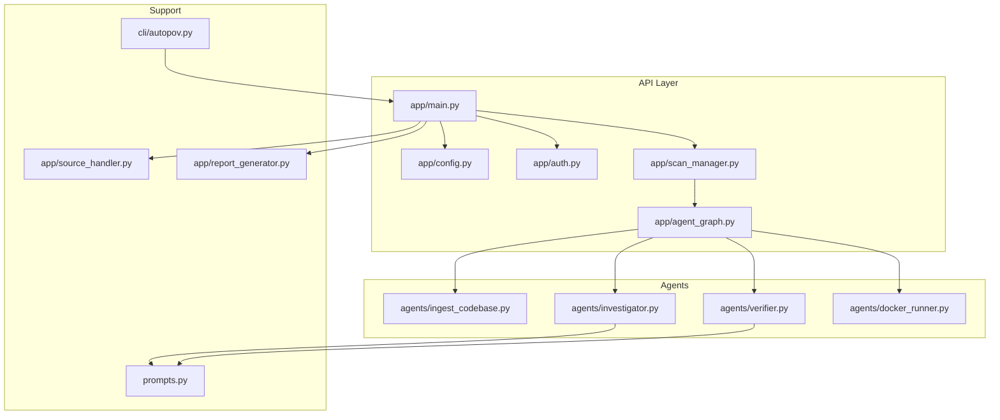
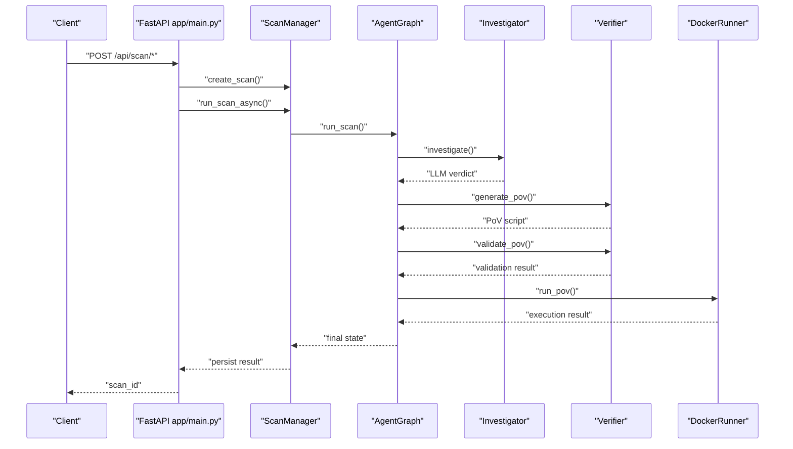
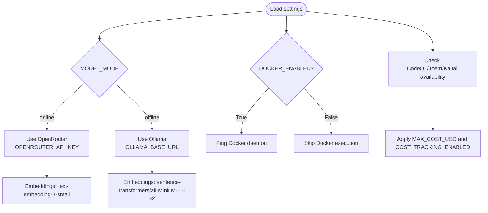
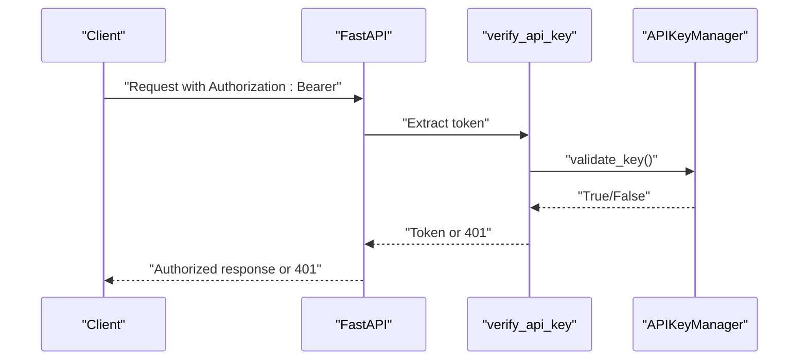
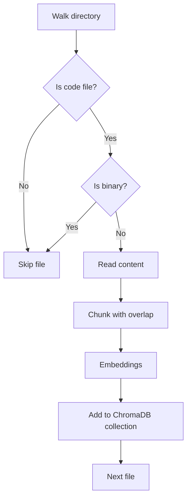
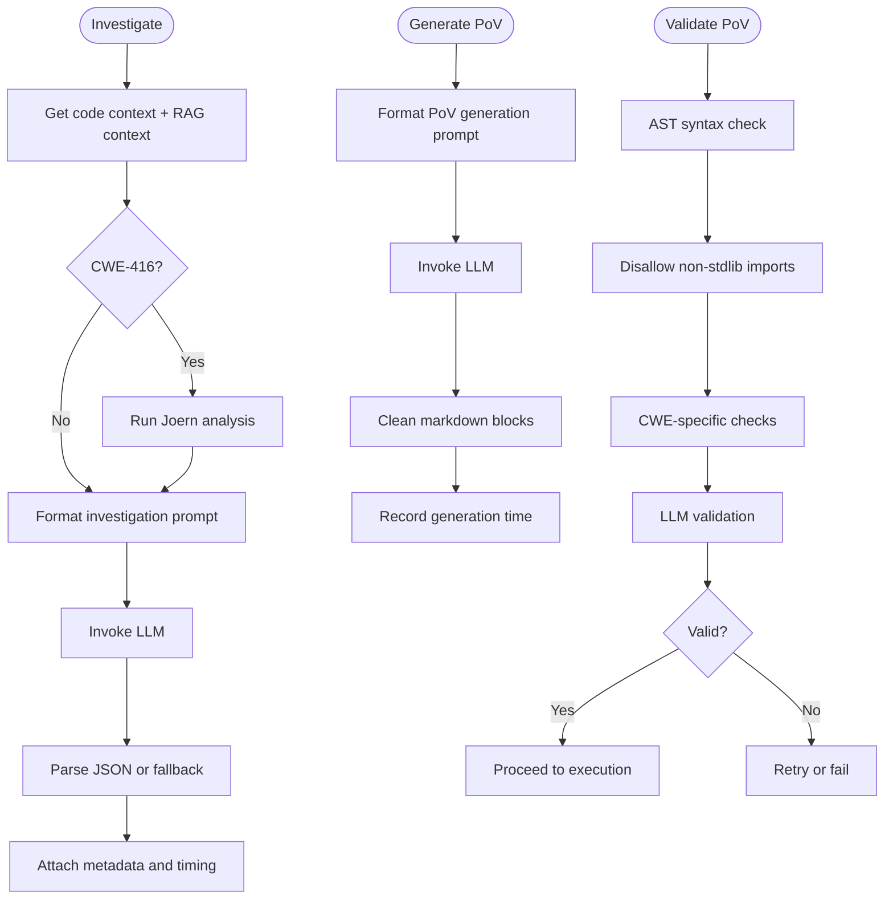
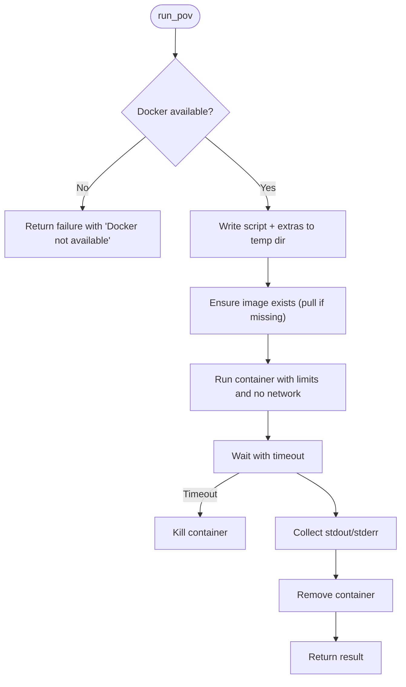
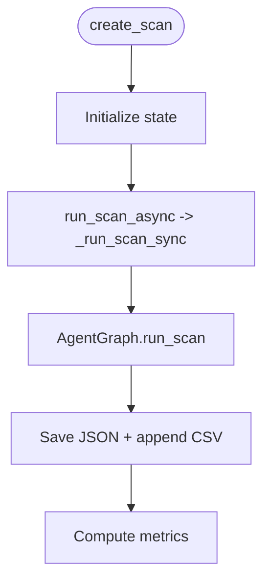
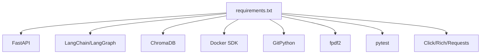

# Troubleshooting and Optimization

<cite>
**Referenced Files in This Document**
- [README.md](file://README.md)
- [run.sh](file://run.sh)
- [requirements.txt](file://requirements.txt)
- [app/main.py](file://app/main.py)
- [app/config.py](file://app/config.py)
- [app/auth.py](file://app/auth.py)
- [app/scan_manager.py](file://app/scan_manager.py)
- [app/agent_graph.py](file://app/agent_graph.py)
- [agents/ingest_codebase.py](file://agents/ingest_codebase.py)
- [agents/investigator.py](file://agents/investigator.py)
- [agents/verifier.py](file://agents/verifier.py)
- [agents/docker_runner.py](file://agents/docker_runner.py)
- [prompts.py](file://prompts.py)
- [app/source_handler.py](file://app/source_handler.py)
- [app/report_generator.py](file://app/report_generator.py)
- [cli/autopov.py](file://cli/autopov.py)
</cite>

## Table of Contents
1. [Introduction](#introduction)
2. [Project Structure](#project-structure)
3. [Core Components](#core-components)
4. [Architecture Overview](#architecture-overview)
5. [Detailed Component Analysis](#detailed-component-analysis)
6. [Dependency Analysis](#dependency-analysis)
7. [Performance Considerations](#performance-considerations)
8. [Troubleshooting Guide](#troubleshooting-guide)
9. [Conclusion](#conclusion)
10. [Appendices](#appendices)

## Introduction
This document provides a comprehensive troubleshooting and optimization guide for the AutoPoV Proof-of-Vulnerability (PoV) generation and execution system. It focuses on diagnosing failures in PoV generation, validating prompts and scripts, and resolving Docker execution issues. It also covers performance tuning for LLM inference, script generation speed, and execution throughput, along with monitoring, scaling, and operational best practices.

## Project Structure
AutoPoV is a FastAPI-based service orchestrating a LangGraph agent workflow that ingests code, runs static analysis, validates findings with LLMs, generates PoV scripts, and executes them safely in Docker. Supporting modules handle authentication, configuration, reporting, and CLI access.

**Diagram sources**
- [app/main.py](file://app/main.py#L102-L121)
- [app/config.py](file://app/config.py#L13-L210)
- [app/scan_manager.py](file://app/scan_manager.py#L40-L344)
- [app/agent_graph.py](file://app/agent_graph.py#L78-L135)
- [agents/ingest_codebase.py](file://agents/ingest_codebase.py#L41-L407)
- [agents/investigator.py](file://agents/investigator.py#L37-L413)
- [agents/verifier.py](file://agents/verifier.py#L40-L401)
- [agents/docker_runner.py](file://agents/docker_runner.py#L27-L379)
- [prompts.py](file://prompts.py#L7-L374)
- [app/source_handler.py](file://app/source_handler.py#L18-L380)
- [app/report_generator.py](file://app/report_generator.py#L68-L359)
- [cli/autopov.py](file://cli/autopov.py#L89-L467)

**Section sources**
- [README.md](file://README.md#L17-L35)
- [app/main.py](file://app/main.py#L102-L121)

## Core Components
- Configuration and environment management: centralizes model selection, Docker settings, cost tracking, and system dependencies.
- Authentication and API keys: bearer token validation and admin key enforcement.
- Scan orchestration: manages scan lifecycle, state, persistence, and metrics.
- Agent graph: LangGraph workflow coordinating ingestion, static analysis, investigation, PoV generation/validation, and Docker execution.
- Agents:
  - Code ingestion with chunking and embeddings.
  - LLM-based vulnerability investigation and PoV validation.
  - Docker execution of PoV scripts with safety and timeouts.
- Prompts: standardized templates for investigation, PoV generation, validation, and retry analysis.
- Source handling: ZIP/TAR extraction, raw code paste, and file/folder uploads.
- Reporting: JSON/PDF reports and saving PoV scripts.
- CLI: programmatic access to scanning, results, history, and API key management.

**Section sources**
- [app/config.py](file://app/config.py#L13-L210)
- [app/auth.py](file://app/auth.py#L32-L176)
- [app/scan_manager.py](file://app/scan_manager.py#L40-L344)
- [app/agent_graph.py](file://app/agent_graph.py#L78-L582)
- [agents/ingest_codebase.py](file://agents/ingest_codebase.py#L41-L407)
- [agents/investigator.py](file://agents/investigator.py#L37-L413)
- [agents/verifier.py](file://agents/verifier.py#L40-L401)
- [agents/docker_runner.py](file://agents/docker_runner.py#L27-L379)
- [prompts.py](file://prompts.py#L7-L374)
- [app/source_handler.py](file://app/source_handler.py#L18-L380)
- [app/report_generator.py](file://app/report_generator.py#L68-L359)
- [cli/autopov.py](file://cli/autopov.py#L89-L467)

## Architecture Overview
The system follows a pipeline:
- Ingest codebase into a vector store.
- Run static analysis (CodeQL) or fallback to LLM-only.
- Investigate findings with LLMs to classify as real/false positives.
- Generate PoV scripts for real findings.
- Validate PoV scripts (syntax, standard library only, CWE-specific checks).
- Execute PoVs in Docker with strict isolation and timeouts.
- Persist results and generate reports.

**Diagram sources**
- [app/main.py](file://app/main.py#L177-L317)
- [app/scan_manager.py](file://app/scan_manager.py#L86-L176)
- [app/agent_graph.py](file://app/agent_graph.py#L290-L433)
- [agents/investigator.py](file://agents/investigator.py#L254-L366)
- [agents/verifier.py](file://agents/verifier.py#L79-L149)
- [agents/docker_runner.py](file://agents/docker_runner.py#L62-L192)

## Detailed Component Analysis

### Configuration and Environment
- Model mode switching between online (OpenRouter) and offline (Ollama) with appropriate embeddings and API keys.
- Docker execution parameters: image, timeout, memory, CPU quota, and availability checks.
- Cost tracking and limits for inference.
- System dependencies: CodeQL, Joern, Kaitai Struct compiler, and Docker availability checks.

**Diagram sources**
- [app/config.py](file://app/config.py#L30-L88)
- [app/config.py](file://app/config.py#L117-L122)
- [app/config.py](file://app/config.py#L123-L172)

**Section sources**
- [app/config.py](file://app/config.py#L13-L210)

### Authentication and API Keys
- Bearer token authentication for all protected endpoints.
- Admin-only endpoints for key generation and revocation.
- Key hashing and persistence with audit fields.

**Diagram sources**
- [app/auth.py](file://app/auth.py#L137-L171)
- [app/auth.py](file://app/auth.py#L32-L131)

**Section sources**
- [app/auth.py](file://app/auth.py#L32-L176)

### Code Ingestion and RAG
- Recursively splits code into chunks with overlap, filters binary and non-code files, embeds with selected model, and stores in ChromaDB per scan.
- Retrieves context for queries and cleans up collections after scans.

**Diagram sources**
- [agents/ingest_codebase.py](file://agents/ingest_codebase.py#L201-L307)
- [agents/ingest_codebase.py](file://agents/ingest_codebase.py#L309-L353)

**Section sources**
- [agents/ingest_codebase.py](file://agents/ingest_codebase.py#L41-L407)

### LLM Investigation and PoV Validation
- Investigation agent builds prompts with code context and optional Joern CPG analysis for CWE-416, invokes LLM, parses JSON, and records inference time and cost.
- Verifier agent generates PoV scripts with standardized prompt, validates syntax, enforces standard library usage, and performs CWE-specific checks; uses LLM for advanced validation and retry analysis.

**Diagram sources**
- [agents/investigator.py](file://agents/investigator.py#L254-L366)
- [agents/verifier.py](file://agents/verifier.py#L79-L392)
- [prompts.py](file://prompts.py#L46-L109)

**Section sources**
- [agents/investigator.py](file://agents/investigator.py#L37-L413)
- [agents/verifier.py](file://agents/verifier.py#L40-L401)
- [prompts.py](file://prompts.py#L7-L374)

### Docker Execution and Safety
- Runs PoV scripts in isolated containers with no network, memory and CPU limits, and a timeout.
- Captures stdout/stderr, determines success by exit code and presence of a specific trigger string, and cleans up artifacts.

**Diagram sources**
- [agents/docker_runner.py](file://agents/docker_runner.py#L62-L192)

**Section sources**
- [agents/docker_runner.py](file://agents/docker_runner.py#L27-L379)

### Scan Orchestration and Metrics
- Creates and runs scans asynchronously, tracks logs, persists results to JSON and CSV, and computes metrics across runs.

**Diagram sources**
- [app/scan_manager.py](file://app/scan_manager.py#L50-L200)
- [app/scan_manager.py](file://app/scan_manager.py#L304-L334)

**Section sources**
- [app/scan_manager.py](file://app/scan_manager.py#L40-L344)

### Source Handling and Uploads
- Handles ZIP/TAR uploads with path traversal protection, preserves or flattens directory structure, and writes raw code to files with language-aware extensions.

**Section sources**
- [app/source_handler.py](file://app/source_handler.py#L31-L231)

### Reporting and CLI
- Generates JSON and PDF reports, saves PoV scripts, and provides CLI commands for scanning, results, history, and API key management.

**Section sources**
- [app/report_generator.py](file://app/report_generator.py#L68-L359)
- [cli/autopov.py](file://cli/autopov.py#L89-L467)

## Dependency Analysis
External dependencies include FastAPI, LangChain/LangGraph, ChromaDB, Docker SDK, and optional tools (CodeQL, Joern, Kaitai Struct compiler). The system relies on environment variables for configuration and optional tracing.

**Diagram sources**
- [requirements.txt](file://requirements.txt#L3-L42)

**Section sources**
- [requirements.txt](file://requirements.txt#L1-L42)

## Performance Considerations
- LLM inference optimization
  - Reduce token usage by refining prompts and limiting context length.
  - Tune model mode: offline models can reduce latency and cost; online models may offer higher accuracy.
  - Batch embeddings where feasible and avoid redundant retrievals.
  - Use cost tracking to cap spending and monitor per-run costs.
- Script generation and validation
  - Validate early with AST and standard library checks to fail fast.
  - Limit CWE-specific checks to relevant categories to reduce LLM overhead.
- Docker execution throughput
  - Increase CPU and memory limits cautiously; ensure timeouts match workload characteristics.
  - Reuse images and minimize I/O by avoiding unnecessary files in the container.
- System throughput
  - Use thread pool executor judiciously; avoid oversubscription on CPU-bound tasks.
  - Monitor Docker stats and adjust concurrency based on resource availability.

[No sources needed since this section provides general guidance]

## Troubleshooting Guide

### Diagnosing PoV Generation Failures
- LLM configuration problems
  - Verify model mode and API keys for online/offline modes.
  - Confirm embeddings model availability and API key configuration.
  - Check cost tracking and limits to prevent early termination.
- Prompt formatting errors
  - Ensure prompts are properly formatted and contain required placeholders.
  - Validate that CWE-specific prompts are used for the target vulnerability type.
- Script validation issues
  - Syntax errors and non-stdlib imports are caught by AST and import checks.
  - CWE-specific checks flag missing triggers for buffer overflows, SQL injection, integer overflows.
  - Use LLM validation feedback to refine PoV logic.

**Section sources**
- [app/config.py](file://app/config.py#L30-L88)
- [agents/investigator.py](file://agents/investigator.py#L50-L87)
- [agents/verifier.py](file://agents/verifier.py#L177-L227)
- [prompts.py](file://prompts.py#L46-L109)

### Docker Execution Troubleshooting
- Container startup failures
  - Docker not available or daemon unreachable: check availability and ping.
  - Image pull failures: verify base image and network access.
- Resource constraint violations
  - Excessive memory/CPU usage: increase limits or optimize PoV scripts.
  - Timeouts: adjust timeout setting to accommodate longer-running PoVs.
- Network connectivity problems
  - Containers run with no network; ensure PoVs do not require external access.

**Section sources**
- [agents/docker_runner.py](file://agents/docker_runner.py#L37-L61)
- [agents/docker_runner.py](file://agents/docker_runner.py#L113-L144)
- [app/config.py](file://app/config.py#L78-L84)

### Practical Debugging Workflows
- Analyzing failed PoVs
  - Inspect validation issues and suggestions returned by the verifier.
  - Review execution output captured from Docker logs.
  - Use retry analysis prompt to iteratively improve PoV logic.
- Understanding validation errors
  - AST and import checks provide immediate feedback.
  - CWE-specific checks highlight missing conditions.
- Resolving execution timeouts
  - Increase Docker timeout and resource limits.
  - Optimize PoV script logic to reduce runtime.

**Section sources**
- [agents/verifier.py](file://agents/verifier.py#L332-L392)
- [agents/docker_runner.py](file://agents/docker_runner.py#L135-L144)

### Common Configuration Issues
- Environment variables
  - Ensure ADMIN_API_KEY, OPENROUTER_API_KEY (or OLLAMA_BASE_URL), MODEL_MODE, MODEL_NAME, DOCKER_ENABLED, MAX_COST_USD are set appropriately.
- API keys
  - Use admin key to generate API keys; verify bearer tokens for protected endpoints.
- System dependencies
  - Install and configure CodeQL, Joern, and Kaitai Struct compiler if needed.
  - Confirm Docker is installed and accessible.

**Section sources**
- [app/config.py](file://app/config.py#L16-L111)
- [app/auth.py](file://app/auth.py#L126-L131)
- [README.md](file://README.md#L146-L168)

### Monitoring and Logging Strategies
- Real-time logs
  - Use the streaming logs endpoint to observe scan progress and agent steps.
- Metrics endpoint
  - Track total scans, completed/failed, active scans, confirmed vulnerabilities, and total cost.
- File-based history
  - CSV log of scan history for post-mortem analysis.

**Section sources**
- [app/main.py](file://app/main.py#L350-L385)
- [app/scan_manager.py](file://app/scan_manager.py#L304-L334)
- [app/scan_manager.py](file://app/scan_manager.py#L252-L273)

### Scaling and Load Balancing
- Horizontal scaling
  - Run multiple instances behind a reverse proxy; ensure shared storage for results and persistent vector store.
- Concurrency control
  - Tune thread pool size and Docker concurrency based on CPU/memory capacity.
- Resource isolation
  - Use separate Docker networks and resource quotas per tenant if multi-tenant.

[No sources needed since this section provides general guidance]

## Conclusion
By systematically validating configuration, prompts, and Docker execution parameters, and by applying targeted performance optimizations, AutoPoV can reliably generate and execute PoVs at scale. Use the provided monitoring and logging mechanisms to identify bottlenecks and continuously improve the system.

[No sources needed since this section summarizes without analyzing specific files]

## Appendices

### Community Resources and Support
- Documentation and quick start are available in the project README.
- Docker safety defaults and supported CWEs are documented for secure operation.

**Section sources**
- [README.md](file://README.md#L1-L242)

### Contribution Guidelines
- Follow the project’s contributing guidelines referenced in the README for submitting improvements.

**Section sources**
- [README.md](file://README.md#L224-L227)