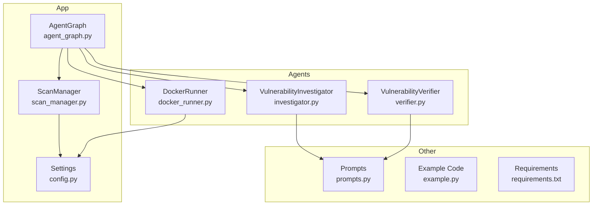
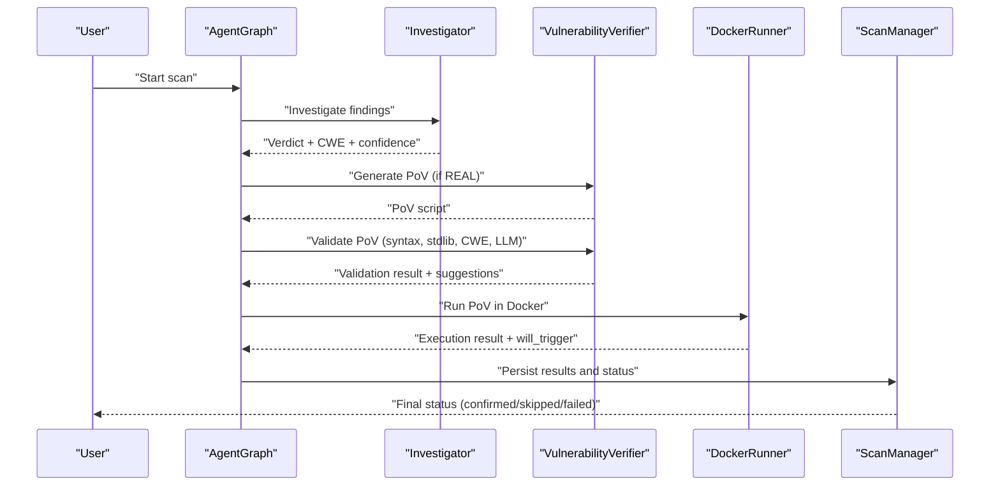
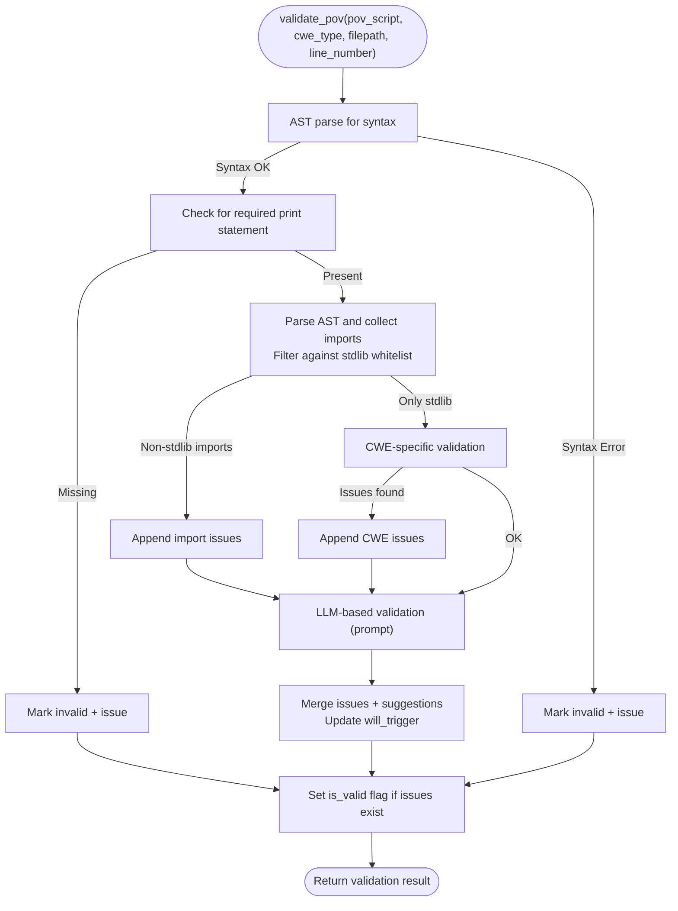
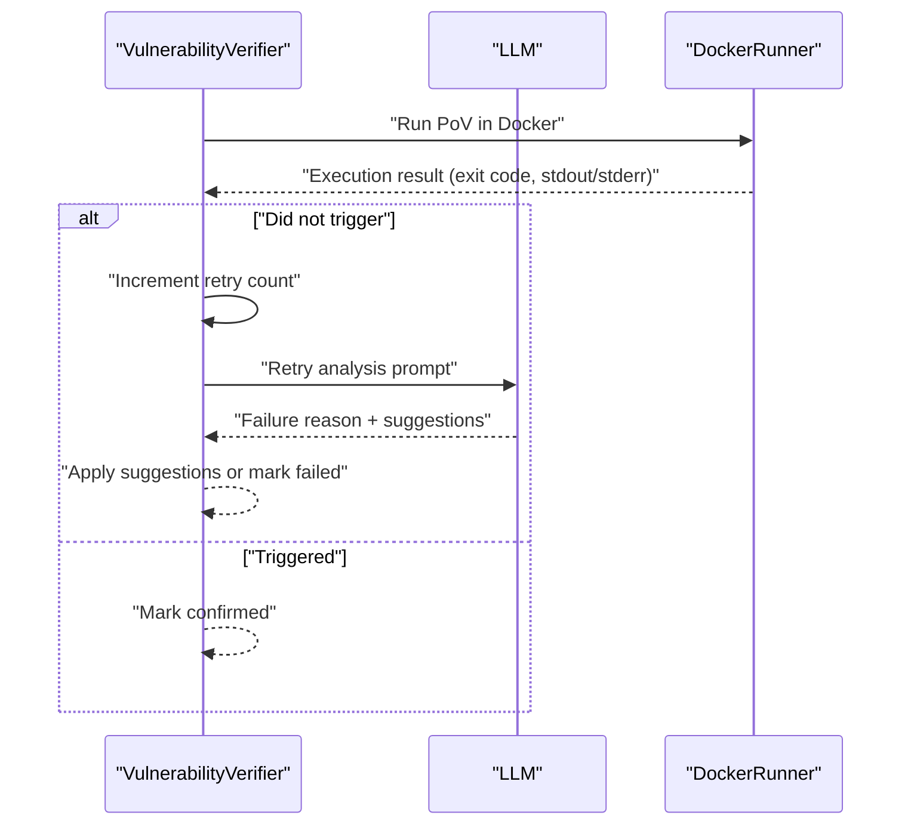
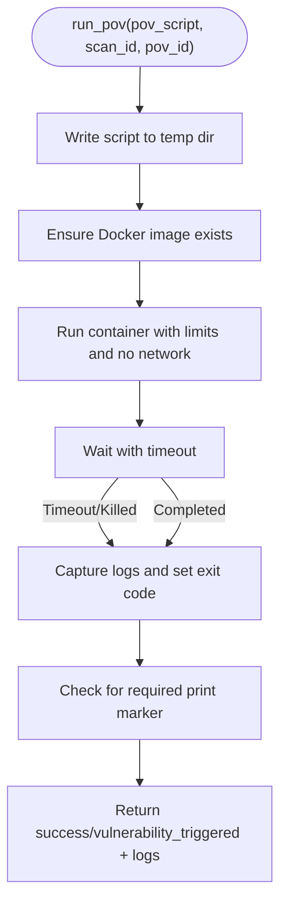
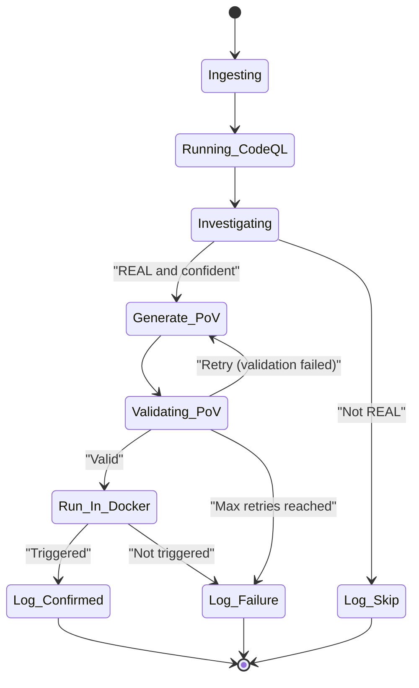
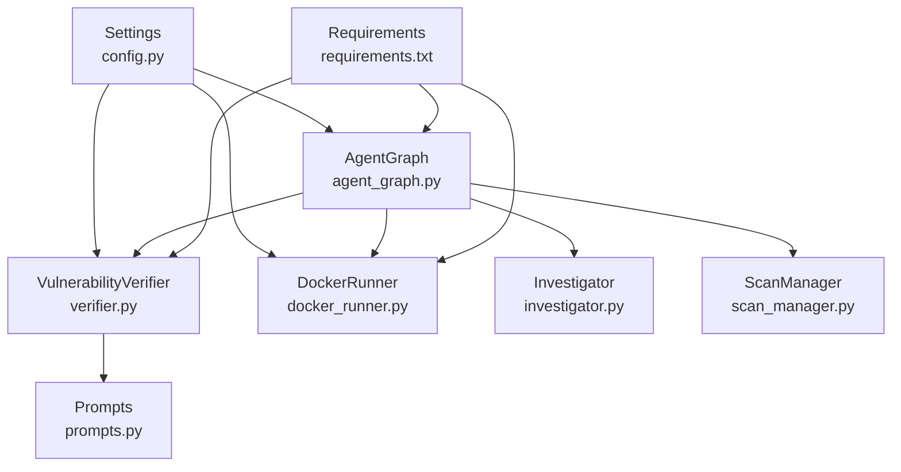

# Validation and Quality Assurance

<cite>
**Referenced Files in This Document**
- [verifier.py](file://autopov/agents/verifier.py)
- [prompts.py](file://autopov/prompts.py)
- [docker_runner.py](file://autopov/agents/docker_runner.py)
- [agent_graph.py](file://autopov/app/agent_graph.py)
- [config.py](file://autopov/app/config.py)
- [scan_manager.py](file://autopov/app/scan_manager.py)
- [example.py](file://autopov/codebase/example.py)
- [requirements.txt](file://autopov/requirements.txt)
</cite>

## Table of Contents
1. [Introduction](#introduction)
2. [Project Structure](#project-structure)
3. [Core Components](#core-components)
4. [Architecture Overview](#architecture-overview)
5. [Detailed Component Analysis](#detailed-component-analysis)
6. [Dependency Analysis](#dependency-analysis)
7. [Performance Considerations](#performance-considerations)
8. [Troubleshooting Guide](#troubleshooting-guide)
9. [Conclusion](#conclusion)

## Introduction
This document describes the validation and quality assurance system for the Proof-of-Vulnerability (PoV) generation pipeline. It explains the multi-layered validation process that ensures PoV scripts are syntactically correct, adhere to safety constraints, satisfy CWE-specific logic, and are further vetted by LLM-based reasoning. It also covers the will-trigger assessment mechanism, issue detection and suggestion systems, retry analysis for failed attempts, and how validation results influence the PoV approval process.

## Project Structure
The validation system spans several modules:
- Agents: verifier (PoV generation and validation), docker_runner (sandboxed execution), investigator (preliminary vulnerability triage)
- App: agent_graph (orchestrates the end-to-end workflow), scan_manager (scan lifecycle), config (global settings), report_generator (post-run reporting)
- Prompts: centralized LLM prompts for investigation, PoV generation, validation, and retry analysis
- Example code: sample vulnerable code used for testing PoV generation

**Diagram sources**
- [verifier.py](file://autopov/agents/verifier.py#L40-L401)
- [prompts.py](file://autopov/prompts.py#L7-L374)
- [docker_runner.py](file://autopov/agents/docker_runner.py#L27-L379)
- [agent_graph.py](file://autopov/app/agent_graph.py#L78-L582)
- [config.py](file://autopov/app/config.py#L13-L210)
- [scan_manager.py](file://autopov/app/scan_manager.py#L40-L344)
- [example.py](file://autopov/codebase/example.py#L1-L55)
- [requirements.txt](file://autopov/requirements.txt#L1-L42)

**Section sources**
- [verifier.py](file://autopov/agents/verifier.py#L1-L401)
- [prompts.py](file://autopov/prompts.py#L1-L374)
- [docker_runner.py](file://autopov/agents/docker_runner.py#L1-L379)
- [agent_graph.py](file://autopov/app/agent_graph.py#L1-L582)
- [config.py](file://autopov/app/config.py#L1-L210)
- [scan_manager.py](file://autopov/app/scan_manager.py#L1-L344)
- [example.py](file://autopov/codebase/example.py#L1-L55)
- [requirements.txt](file://autopov/requirements.txt#L1-L42)

## Core Components
- VulnerabilityVerifier: Generates PoV scripts, performs multi-layered validation (syntax, required print statements, standard library constraints, CWE-specific checks), and uses LLM-based validation to assess logic correctness and will-trigger potential.
- DockerRunner: Executes PoV scripts in isolated containers with strict resource limits and network isolation, detecting whether the script triggers the vulnerability by scanning for a specific output marker.
- AgentGraph: Orchestrates the full workflow from code ingestion to PoV generation, validation, sandboxed execution, and final status assignment.
- Prompts: Centralized templates for investigation, PoV generation, validation, and retry analysis, ensuring consistent instruction formatting for LLMs.
- ScanManager: Manages scan lifecycle, persists results, and exposes metrics for monitoring and reporting.
- Configuration: Provides runtime settings for LLM selection, Docker execution, and supported CWEs.

**Section sources**
- [verifier.py](file://autopov/agents/verifier.py#L40-L401)
- [docker_runner.py](file://autopov/agents/docker_runner.py#L27-L379)
- [agent_graph.py](file://autopov/app/agent_graph.py#L78-L582)
- [prompts.py](file://autopov/prompts.py#L7-L374)
- [scan_manager.py](file://autopov/app/scan_manager.py#L40-L344)
- [config.py](file://autopov/app/config.py#L13-L210)

## Architecture Overview
The validation and QA pipeline follows a deterministic, multi-stage workflow:
1. Code ingestion and optional CodeQL analysis
2. LLM-based investigation to distinguish real from false positives
3. PoV script generation constrained to Python standard library and requiring a specific print statement
4. Multi-layered validation (syntax, required print, stdlib-only, CWE-specific)
5. LLM-based validation for logic soundness and will-trigger assessment
6. Sandboxed execution in Docker to detect actual vulnerability triggering
7. Status assignment (confirmed/skipped/failed) and result persistence

**Diagram sources**
- [agent_graph.py](file://autopov/app/agent_graph.py#L290-L486)
- [verifier.py](file://autopov/agents/verifier.py#L79-L227)
- [docker_runner.py](file://autopov/agents/docker_runner.py#L62-L192)
- [scan_manager.py](file://autopov/app/scan_manager.py#L118-L175)

## Detailed Component Analysis

### VulnerabilityVerifier: Multi-layered Validation and LLM-based Assessment
The verifier enforces a strict set of checks:
- Syntax validation using AST parsing to catch malformed scripts immediately.
- Required print statement presence: scripts must include a specific marker to indicate successful trigger.
- Standard library import restriction: only modules from the Python standard library are permitted; any non-stdlib import is flagged.
- CWE-specific validation: tailored checks per CWE category (e.g., buffer overflow indicators, SQL injection keywords, integer overflow value sizes).
- LLM-based validation: the verifier constructs a structured prompt to evaluate whether the PoV script is logically sound, adheres to requirements, and is likely to trigger the vulnerability. The LLM responds with structured JSON containing validity, issues, suggestions, and a will-trigger assessment.

**Diagram sources**
- [verifier.py](file://autopov/agents/verifier.py#L151-L227)
- [prompts.py](file://autopov/prompts.py#L81-L109)

**Section sources**
- [verifier.py](file://autopov/agents/verifier.py#L151-L291)
- [prompts.py](file://autopov/prompts.py#L81-L109)

#### Issue Detection System
Common issues detected include:
- Missing required print statement: absence of the specific marker indicating successful trigger.
- Non-standard library imports: any import outside the Python standard library is flagged.
- CWE mismatch: PoV does not align with the targeted CWE (e.g., insufficient buffer overflow triggers, lack of SQL injection keywords, inadequate large integer values for overflow).
- LLM-reported issues: logical inconsistencies, missing error handling, non-deterministic behavior, or unsafe assumptions.

Resolution strategies:
- Add the required print statement at the end of successful execution paths.
- Replace third-party libraries with equivalent standard library alternatives.
- Align PoV logic with CWE-specific patterns (e.g., construct buffer bounds violations, craft SQL injection payloads, use sufficiently large integers).
- Incorporate suggestions from LLM validation to improve determinism and robustness.

**Section sources**
- [verifier.py](file://autopov/agents/verifier.py#L185-L211)
- [verifier.py](file://autopov/agents/verifier.py#L265-L291)

#### Suggestion System
The verifier aggregates suggestions from both static checks and LLM validation:
- Static suggestions: import restrictions, required print statement placement, and basic formatting improvements.
- LLM suggestions: detailed recommendations for improving PoV logic, input construction, and execution reliability.

These suggestions guide authors to refine failing scripts and increase the likelihood of successful sandboxed execution.

**Section sources**
- [verifier.py](file://autopov/agents/verifier.py#L212-L222)
- [prompts.py](file://autopov/prompts.py#L81-L109)

#### Will-Trigger Assessment
The will-trigger field communicates the LLM’s assessment of whether the PoV is likely to trigger the vulnerability under normal conditions. It can be YES, MAYBE, or NO. This assessment influences downstream decisions:
- If MAYBE or NO, the system may request retries or modifications before attempting sandboxed execution.
- If YES, the system proceeds to Docker execution to confirm actual triggering.

**Section sources**
- [verifier.py](file://autopov/agents/verifier.py#L214-L222)
- [prompts.py](file://autopov/prompts.py#L94-L100)

#### Retry Analysis Capability
When a PoV fails, the system can analyze the failure and propose improvements:
- The retry analysis prompt asks the LLM to diagnose why the PoV failed, considering the original vulnerability context, the PoV script, and execution output.
- The LLM responds with a failure reason, suggested changes, and whether a fundamentally different approach is warranted.
- The system respects configured maximum retries to avoid infinite loops.

**Diagram sources**
- [verifier.py](file://autopov/agents/verifier.py#L332-L391)
- [docker_runner.py](file://autopov/agents/docker_runner.py#L62-L192)
- [prompts.py](file://autopov/prompts.py#L176-L209)

**Section sources**
- [verifier.py](file://autopov/agents/verifier.py#L332-L391)
- [prompts.py](file://autopov/prompts.py#L176-L209)

### DockerRunner: Safety Checks and Execution
DockerRunner executes PoV scripts in a secure, isolated environment:
- Resource limits: CPU quota and memory limit are enforced.
- Network isolation: containers run without network access to prevent unintended communication.
- Output inspection: the system detects whether the PoV printed the required marker, indicating successful trigger.
- Robust error handling: captures container errors, timeouts, and exit codes for accurate reporting.

**Diagram sources**
- [docker_runner.py](file://autopov/agents/docker_runner.py#L62-L192)
- [config.py](file://autopov/app/config.py#L78-L84)

**Section sources**
- [docker_runner.py](file://autopov/agents/docker_runner.py#L62-L192)
- [config.py](file://autopov/app/config.py#L78-L84)

### AgentGraph: Orchestration and Approval Influence
AgentGraph coordinates the entire workflow and translates validation outcomes into final statuses:
- Investigation: determines if a finding is REAL with sufficient confidence.
- PoV generation: creates PoV scripts only for findings meeting thresholds.
- Validation: applies multi-layered checks and LLM-based reasoning.
- Execution: runs PoVs in Docker and records whether the vulnerability was triggered.
- Status assignment: marks findings as confirmed, skipped, or failed based on investigation, validation, and execution results.

**Diagram sources**
- [agent_graph.py](file://autopov/app/agent_graph.py#L84-L134)
- [agent_graph.py](file://autopov/app/agent_graph.py#L488-L515)

**Section sources**
- [agent_graph.py](file://autopov/app/agent_graph.py#L290-L486)

### Practical Examples and Resolution Strategies
- Example vulnerable code (SQL injection): The example demonstrates an intentionally vulnerable function that concatenates user input into SQL queries. A PoV for this scenario should construct malicious input that exploits the concatenation to bypass authentication or extract data. Validation will require the PoV to include the required print statement upon successful exploitation and to use only standard library modules.
- Common failure patterns:
  - Missing required print statement: The PoV executes but does not print the marker; validation fails.
  - Disallowed imports: Using non-stdlib modules; validation flags and suggests replacements.
  - CWE mismatch: For CWE-119, the PoV lacks buffer boundary violations; for CWE-89, it lacks SQL injection payloads; for CWE-190, it uses insufficiently large integers.
- Resolution strategies:
  - Add the required print statement at the end of successful exploit paths.
  - Replace third-party libraries with standard library equivalents.
  - Align PoV logic with CWE-specific patterns and incorporate LLM suggestions for improved determinism.

**Section sources**
- [example.py](file://autopov/codebase/example.py#L9-L23)
- [verifier.py](file://autopov/agents/verifier.py#L185-L211)
- [verifier.py](file://autopov/agents/verifier.py#L265-L291)

## Dependency Analysis
The validation system relies on:
- LLM providers (OpenAI or Ollama) for investigation, PoV generation, validation, and retry analysis.
- Docker for sandboxed execution.
- ChromaDB and embeddings for code ingestion and retrieval-augmented context.
- CodeQL for static analysis (optional fallback to LLM-only).

**Diagram sources**
- [config.py](file://autopov/app/config.py#L13-L210)
- [verifier.py](file://autopov/agents/verifier.py#L40-L78)
- [docker_runner.py](file://autopov/agents/docker_runner.py#L27-L48)
- [agent_graph.py](file://autopov/app/agent_graph.py#L22-L26)
- [requirements.txt](file://autopov/requirements.txt#L9-L24)

**Section sources**
- [config.py](file://autopov/app/config.py#L13-L210)
- [requirements.txt](file://autopov/requirements.txt#L1-L42)

## Performance Considerations
- LLM inference time and cost: The system estimates costs based on inference durations and supports both online and offline models. Use offline models to reduce cost when appropriate.
- Docker execution overhead: Resource limits and timeouts prevent runaway executions; ensure adequate CPU/memory allocation for realistic PoV execution.
- Batch processing: The Docker runner supports batch execution to improve throughput when validating multiple PoVs.

[No sources needed since this section provides general guidance]

## Troubleshooting Guide
- LLM availability errors: If the required LLM provider is unavailable or misconfigured, the verifier raises explicit exceptions. Verify API keys and model settings.
- Docker unavailability: If Docker is disabled or unreachable, sandboxed execution is skipped and results reflect Docker limitations.
- Validation failures: Review validation issues and suggestions returned by the verifier. Address syntax errors, missing print statements, disallowed imports, and CWE mismatches.
- Retry analysis: Use the retry analysis feature to understand why a PoV failed and apply suggested changes or consider a different approach.

**Section sources**
- [verifier.py](file://autopov/agents/verifier.py#L53-L77)
- [docker_runner.py](file://autopov/agents/docker_runner.py#L50-L61)
- [verifier.py](file://autopov/agents/verifier.py#L332-L391)

## Conclusion
The validation and quality assurance system combines static checks, standard library enforcement, CWE-specific logic validation, and LLM-based reasoning to produce reliable PoV scripts. The will-trigger assessment and retry analysis enable continuous refinement, while Docker execution confirms actual vulnerability triggering. Together, these mechanisms strengthen PoV approval accuracy and reduce false positives, supporting robust security assessments.