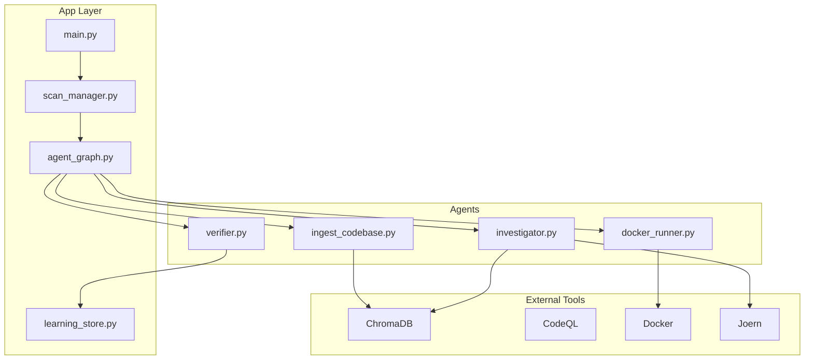
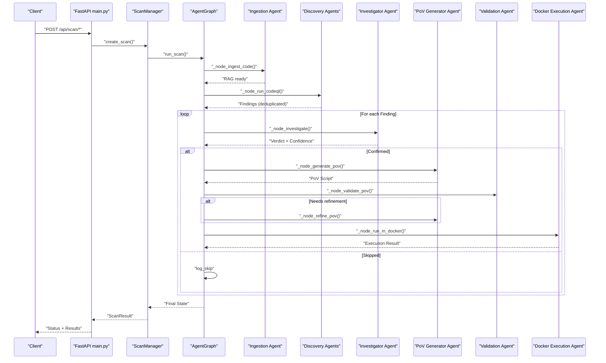
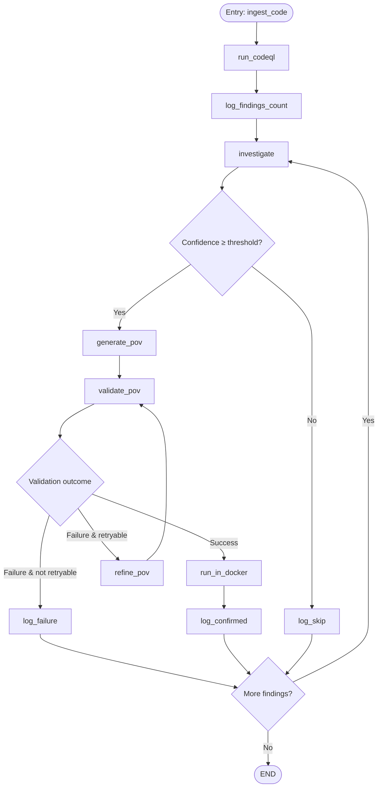
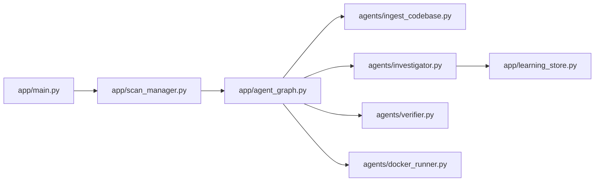

# Project Overview

<cite>
**Referenced Files in This Document**
- [README.md](file://README.md)
- [app/main.py](file://app/main.py)
- [app/agent_graph.py](file://app/agent_graph.py)
- [app/scan_manager.py](file://app/scan_manager.py)
- [app/learning_store.py](file://app/learning_store.py)
- [agents/__init__.py](file://agents/__init__.py)
- [agents/ingest_codebase.py](file://agents/ingest_codebase.py)
- [agents/investigator.py](file://agents/investigator.py)
- [agents/verifier.py](file://agents/verifier.py)
- [agents/docker_runner.py](file://agents/docker_runner.py)
</cite>

## Table of Contents
1. [Introduction](#introduction)
2. [Project Structure](#project-structure)
3. [Core Components](#core-components)
4. [Architecture Overview](#architecture-overview)
5. [Detailed Component Analysis](#detailed-component-analysis)
6. [Dependency Analysis](#dependency-analysis)
7. [Performance Considerations](#performance-considerations)
8. [Troubleshooting Guide](#troubleshooting-guide)
9. [Conclusion](#conclusion)

## Introduction
AutoPoV is an autonomous vulnerability research platform that automates the full lifecycle of discovering, analyzing, exploiting, and validating security vulnerabilities in codebases. Built as a multi-agent system on LangGraph, it orchestrates every stage of the security workflow—code ingestion, static analysis, LLM-powered investigation, exploit generation, and execution validation—without human intervention per finding. It is designed for academic benchmarking, red-team research, and automated security pipeline integration.

What makes AutoPoV agentic:
- Each stage is an autonomous agent node that perceives context, reasons, acts, and reports back.
- The graph makes autonomous routing decisions—whether to generate an exploit, retry, skip, or end.
- Agents call external tools (CodeQL, Docker, ChromaDB, Joern) and react to their output.
- A Policy Agent dynamically selects which reasoning model each agent should use, per task, per language, per CWE.
- A Learning Store records every agent decision and outcome, feeding a self-improvement loop that makes the Policy Agent smarter over time.

## Project Structure
The repository organizes functionality into cohesive modules:
- agents/: Autonomous agent implementations for ingestion, discovery, investigation, verification, and execution.
- app/: FastAPI backend, agent orchestration (LangGraph), scan lifecycle management, authentication, and reporting.
- frontend/: React-based dashboard for monitoring scans and results.
- CLI: Command-line interface for scanning and managing keys.
- Supporting assets: CodeQL queries, Semgrep rules, and sample targets.

**Diagram sources**
- [app/agent_graph.py:137-229](file://app/agent_graph.py#L137-L229)
- [agents/ingest_codebase.py:107-125](file://agents/ingest_codebase.py#L107-L125)
- [agents/investigator.py:109-207](file://agents/investigator.py#L109-L207)
- [agents/verifier.py:44-57](file://agents/verifier.py#L44-L57)
- [agents/docker_runner.py:29-38](file://agents/docker_runner.py#L29-L38)

**Section sources**
- [README.md:89-124](file://README.md#L89-L124)

## Core Components
- Agent Graph (LangGraph): Defines the state machine with agent nodes and conditional edges for autonomous routing.
- Agent Nodes: Ingestion, discovery, investigation, exploit generation, validation, refinement, and Docker execution.
- Scan Manager: Manages scan lifecycle, state persistence, concurrency, and progress tracking.
- Learning Store: Records outcomes to support adaptive model routing and self-improvement.
- Authentication and Rate Limiting: Two-tier auth (Admin Key, API Keys) with rate limiting and SSE streaming.

**Section sources**
- [app/agent_graph.py:111-229](file://app/agent_graph.py#L111-L229)
- [app/scan_manager.py:58-86](file://app/scan_manager.py#L58-L86)
- [app/learning_store.py:14-60](file://app/learning_store.py#L14-L60)
- [app/main.py:22-34](file://app/main.py#L22-L34)

## Architecture Overview
AutoPoV’s agentic architecture centers on a LangGraph state machine that coordinates agent nodes. The workflow begins with code ingestion into a vector store, followed by discovery via CodeQL and/or LLM scouts, and culminates in LLM-powered investigation, exploit generation, and validation through static analysis, unit tests, and Docker execution. A Policy Agent and Learning Store continuously adapt model routing to improve performance.

**Diagram sources**
- [app/main.py:288-578](file://app/main.py#L288-L578)
- [app/scan_manager.py:368-568](file://app/scan_manager.py#L368-L568)
- [app/agent_graph.py:137-229](file://app/agent_graph.py#L137-L229)

## Detailed Component Analysis

### Agent Graph and State Machine
The AgentGraph defines the orchestration state machine with:
- Nodes: ingest_code, run_codeql, investigate, generate_pov, validate_pov, refine_pov, run_in_docker, log_confirmed, log_skip, log_failure.
- Edges: deterministic and conditional transitions based on agent outcomes and confidence thresholds.
- State: ScanState and VulnerabilityState track progress, findings, costs, tokens, and logs.

**Diagram sources**
- [app/agent_graph.py:137-229](file://app/agent_graph.py#L137-L229)

**Section sources**
- [app/agent_graph.py:111-229](file://app/agent_graph.py#L111-L229)

### Code Ingestion Agent
Responsibilities:
- Chunk code, compute embeddings, and persist to ChromaDB.
- Support online (OpenAI) and offline (local) embeddings backends.
- Provide retrieval for RAG context and file content lookup.

Key behaviors:
- Resilient embedding fallbacks and hashing-based local embeddings.
- Batched ingestion with progress callbacks.
- Cleanup per scan to manage storage.

**Section sources**
- [agents/ingest_codebase.py:107-191](file://agents/ingest_codebase.py#L107-L191)
- [agents/ingest_codebase.py:303-410](file://agents/ingest_codebase.py#L303-L410)

### Investigator Agent
Responsibilities:
- Use LLMs (online/offline) with RAG to judge vulnerability findings.
- Integrate Joern for native code (C/C++) memory safety analysis.
- Cache and reuse results to reduce cost and latency.

Key behaviors:
- Build prompts with code context, RAG context, and optional Joern output.
- Extract token usage and cost from provider responses.
- Enforce confidence thresholds and track model usage.

**Section sources**
- [agents/investigator.py:299-472](file://agents/investigator.py#L299-L472)

### PoV Generator and Validator
Responsibilities:
- Generate PoV scripts tailored to the target language and CWE.
- Validate PoVs via static analysis, unit test harness, and LLM analysis.
- Self-healing refinement loop to improve failed PoVs iteratively.

Key behaviors:
- Hybrid validation pipeline with early exits on strong static signals.
- Contract-based exploit specification to guide generation and validation.
- CWE-specific heuristics and standard library constraints.

**Section sources**
- [agents/verifier.py:255-358](file://agents/verifier.py#L255-L358)
- [agents/verifier.py:359-550](file://agents/verifier.py#L359-L550)
- [agents/verifier.py:727-800](file://agents/verifier.py#L727-L800)

### Docker Execution Agent
Responsibilities:
- Execute PoVs in isolated containers with strict resource limits.
- Resolve runtime profiles (Python, Node.js, Shell) and container images.
- Detect vulnerability triggers via standardized indicators.

Key behaviors:
- Container lifecycle management, cleanup, and resource constraints.
- Support for binary and stdin-based inputs.
- Idempotent cleanup routines for containers and images.

**Section sources**
- [agents/docker_runner.py:75-226](file://agents/docker_runner.py#L75-L226)
- [agents/docker_runner.py:307-431](file://agents/docker_runner.py#L307-L431)

### Scan Manager and Orchestration
Responsibilities:
- Create, run, and persist scan state across asynchronous execution.
- Coordinate agent graph execution, handle cancellations, and maintain logs.
- Persist results to JSON and CSV, and optionally snapshot codebases for replay.

Key behaviors:
- Thread-safe log updates and snapshot restoration after restarts.
- Replay scans using preloaded findings for benchmarking.
- Cost reconciliation using provider usage metadata.

**Section sources**
- [app/scan_manager.py:88-133](file://app/scan_manager.py#L88-L133)
- [app/scan_manager.py:368-568](file://app/scan_manager.py#L368-L568)

### Learning Store and Policy Agent
Responsibilities:
- Record investigation and PoV execution outcomes in SQLite.
- Aggregate model performance metrics to inform routing decisions.
- Provide model recommendations per stage, CWE, and language.

Key behaviors:
- Track confirmed rates, success rates, and cost-efficiency scores.
- Support “learning” routing mode that selects models based on historical performance.

**Section sources**
- [app/learning_store.py:14-60](file://app/learning_store.py#L14-L60)
- [app/learning_store.py:188-248](file://app/learning_store.py#L188-L248)

### API Surface and Real-Time Streaming
Responsibilities:
- Expose REST endpoints for initiating scans, polling status, streaming logs, and replaying findings.
- Enforce two-tier authentication and rate limiting.
- Provide SSE endpoints for live agent logs.

Key behaviors:
- Git/ZIP/raw code ingestion endpoints.
- Cancel/stop/delete scan operations.
- Replay findings against alternative models for benchmarking.

**Section sources**
- [app/main.py:288-578](file://app/main.py#L288-L578)
- [app/main.py:769-806](file://app/main.py#L769-L806)

## Dependency Analysis
The system exhibits clear layering and low coupling:
- app/agent_graph.py depends on agents/* for node implementations.
- app/scan_manager.py orchestrates app/agent_graph.py and persists state.
- agents/* depend on external tools (ChromaDB, Docker, Joern) and LLM providers.
- app/main.py integrates FastAPI, authentication, and scan management.

**Diagram sources**
- [app/main.py:30-34](file://app/main.py#L30-L34)
- [app/agent_graph.py:21-28](file://app/agent_graph.py#L21-L28)
- [agents/__init__.py:6-20](file://agents/__init__.py#L6-L20)

**Section sources**
- [agents/__init__.py:6-20](file://agents/__init__.py#L6-L20)

## Performance Considerations
- Parallel investigation: The Investigator Agent supports batched, parallel processing to accelerate multi-finding workflows.
- Cost control: Configurable cost caps, token tracking, and model mode selection (online/offline) help manage expenses.
- Caching: RAG retrieval and analysis caching reduce repeated work and latency.
- Resource isolation: Docker execution enforces strict CPU, memory, and timeout limits to prevent runaway workloads.

[No sources needed since this section provides general guidance]

## Troubleshooting Guide
Common operational issues and remedies:
- Missing external tools:
  - ChromaDB: Required for RAG; ingestion fails without it.
  - CodeQL: Optional but recommended; fallbacks exist when unavailable.
  - Docker: Optional; if disabled, Docker execution steps are skipped.
  - Joern: Optional; only used for native code memory safety analysis.
- Authentication failures:
  - Admin Key vs API Key mismatches or expired keys lead to 401/403 responses.
  - Rate limiting triggers after exceeding configured limits.
- Scan lifecycle problems:
  - Stuck scans can be cleaned up via admin endpoints.
  - Replay scans require a valid codebase path or snapshot availability.
- Logging and diagnostics:
  - Use SSE endpoints to stream live logs for debugging.
  - Inspect scan history CSV and JSON results for detailed metrics.

**Section sources**
- [app/main.py:257-267](file://app/main.py#L257-L267)
- [app/main.py:623-684](file://app/main.py#L623-L684)
- [app/scan_manager.py:742-769](file://app/scan_manager.py#L742-L769)

## Conclusion
AutoPoV delivers a production-ready, autonomous vulnerability research platform powered by a stateful LangGraph agent graph. Its modular architecture integrates code ingestion, discovery, LLM-driven investigation, exploit generation, and robust validation—either locally or in Docker—while continuously learning and adapting model routing via a dedicated Learning Store. The system balances autonomy with observability, offering both beginner-friendly dashboards and developer-grade APIs, streaming logs, and replay capabilities for reproducible research.