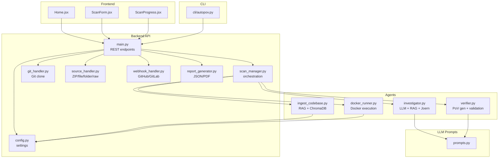
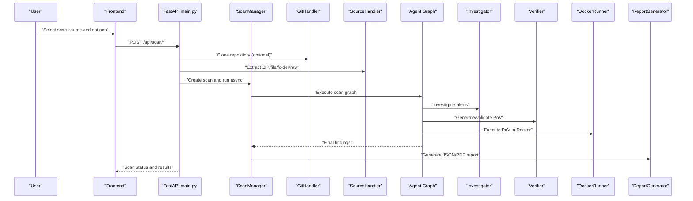
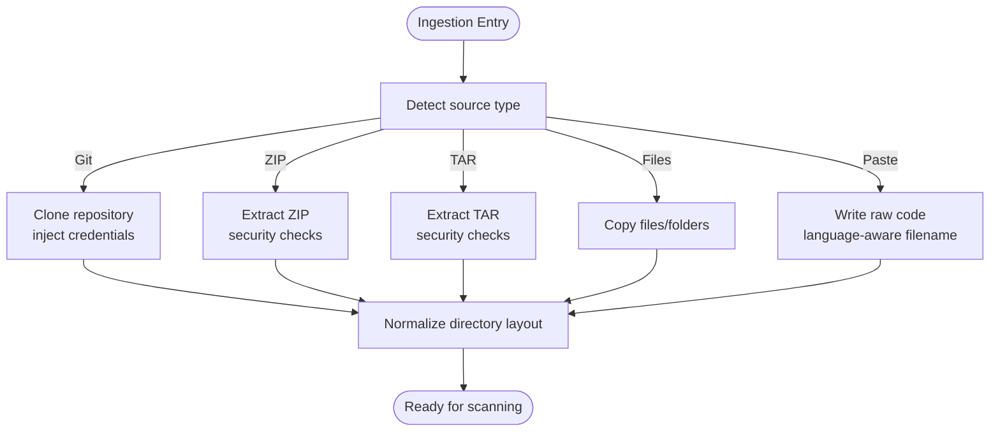
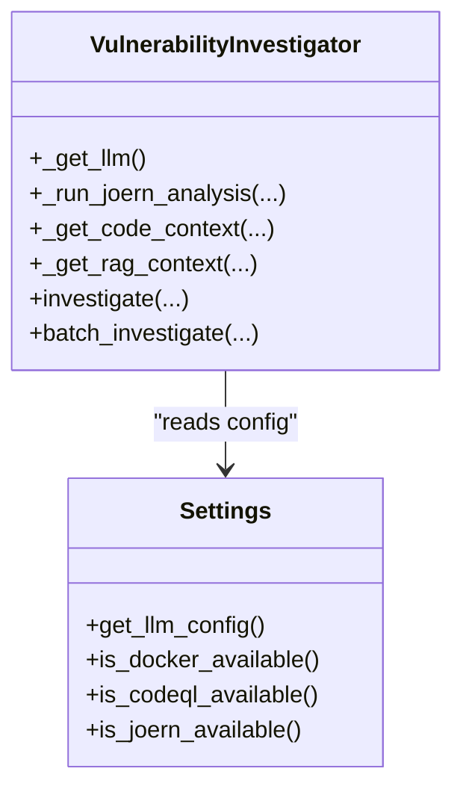
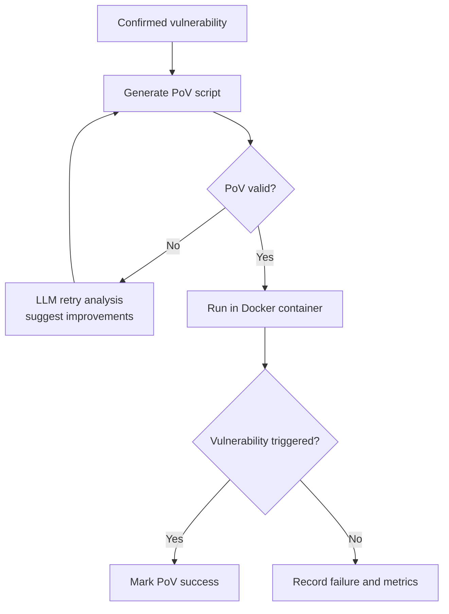
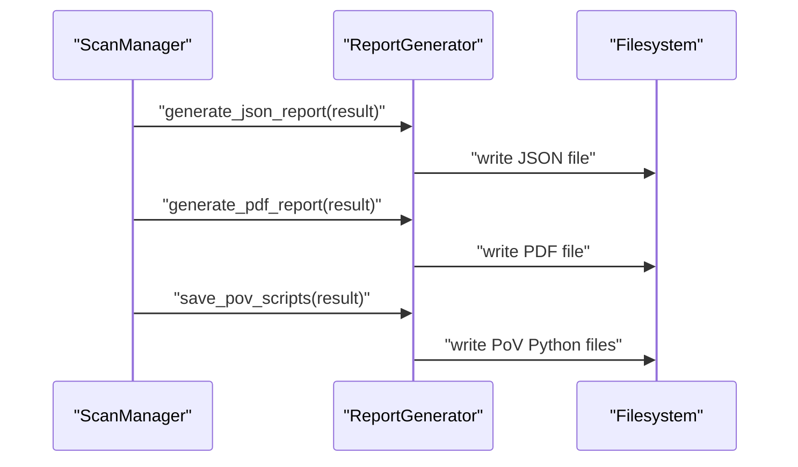
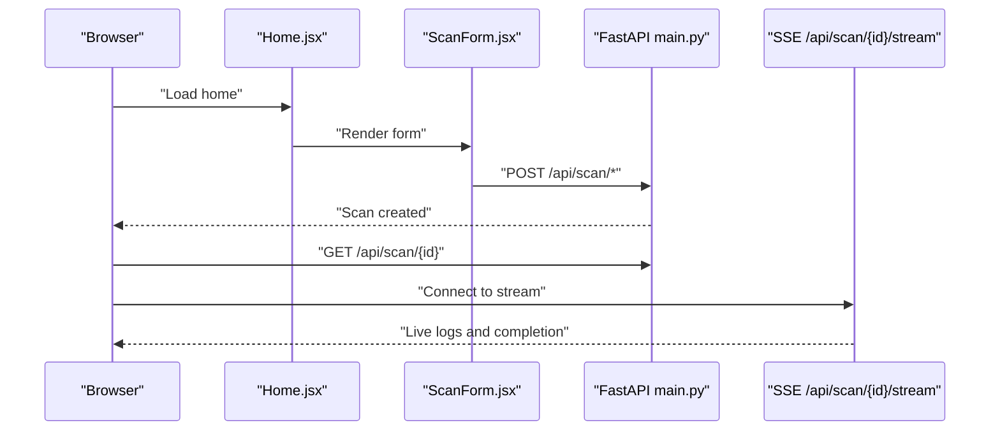
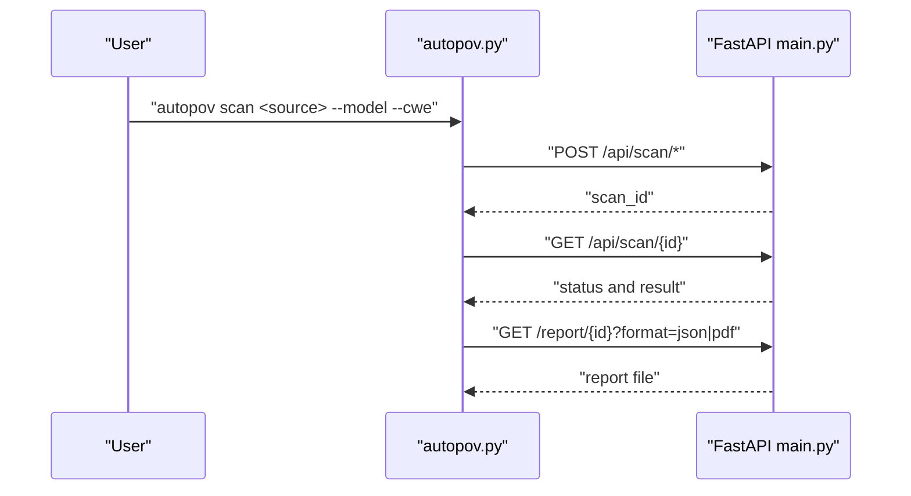
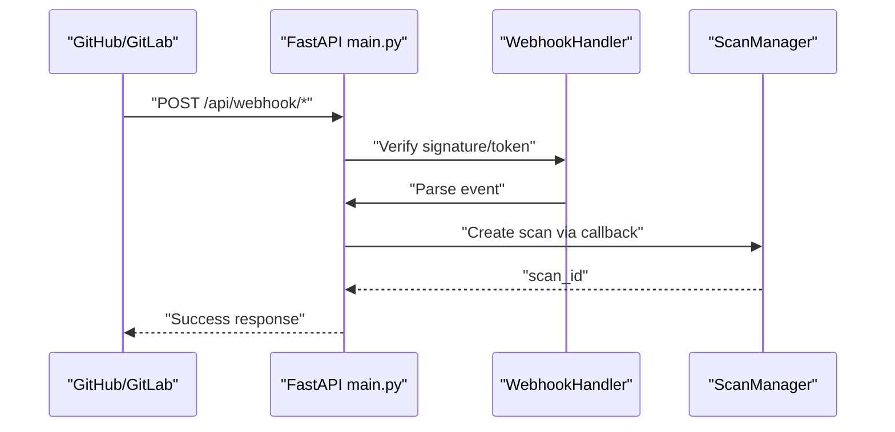
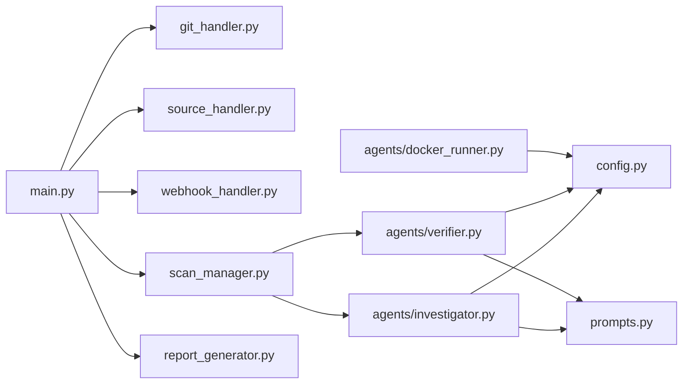

# Core Features and Capabilities

<cite>
**Referenced Files in This Document**
- [README.md](file://autopov/README.md)
- [main.py](file://autopov/app/main.py)
- [source_handler.py](file://autopov/app/source_handler.py)
- [git_handler.py](file://autopov/app/git_handler.py)
- [scan_manager.py](file://autopov/app/scan_manager.py)
- [webhook_handler.py](file://autopov/app/webhook_handler.py)
- [report_generator.py](file://autopov/app/report_generator.py)
- [config.py](file://autopov/app/config.py)
- [prompts.py](file://autopov/prompts.py)
- [ingest_codebase.py](file://autopov/agents/ingest_codebase.py)
- [investigator.py](file://autopov/agents/investigator.py)
- [verifier.py](file://autopov/agents/verifier.py)
- [docker_runner.py](file://autopov/agents/docker_runner.py)
- [autopov.py](file://autopov/cli/autopov.py)
- [Home.jsx](file://autopov/frontend/src/pages/Home.jsx)
- [ScanProgress.jsx](file://autopov/frontend/src/pages/ScanProgress.jsx)
- [ScanForm.jsx](file://autopov/frontend/src/components/ScanForm.jsx)
</cite>

## Table of Contents
1. [Introduction](#introduction)
2. [Project Structure](#project-structure)
3. [Core Components](#core-components)
4. [Architecture Overview](#architecture-overview)
5. [Detailed Component Analysis](#detailed-component-analysis)
6. [Dependency Analysis](#dependency-analysis)
7. [Performance Considerations](#performance-considerations)
8. [Troubleshooting Guide](#troubleshooting-guide)
9. [Conclusion](#conclusion)
10. [Appendices](#appendices)

## Introduction
AutoPoV is a full-stack autonomous framework that combines static analysis with AI-powered reasoning to detect, verify, and benchmark vulnerabilities across industrial codebases. It supports multi-source code ingestion, AI-driven semantic analysis using multiple LLMs, automated Proof-of-Vulnerability (PoV) generation and Docker-based execution, comprehensive reporting, benchmarking, and integrations for web UI, CLI, and webhooks.

## Project Structure
The project is organized into cohesive modules:
- Backend API (FastAPI) with endpoints for scanning, streaming logs, reports, and webhooks
- Agents implementing the vulnerability detection pipeline (ingestion, investigation, verification, Docker execution)
- Frontend (React) for interactive scanning and progress monitoring
- CLI for automation and scripting
- Configuration and prompts for LLM workflows

**Diagram sources**
- [main.py](file://autopov/app/main.py#L102-L528)
- [scan_manager.py](file://autopov/app/scan_manager.py#L40-L344)
- [git_handler.py](file://autopov/app/git_handler.py#L18-L222)
- [source_handler.py](file://autopov/app/source_handler.py#L18-L380)
- [webhook_handler.py](file://autopov/app/webhook_handler.py#L15-L363)
- [report_generator.py](file://autopov/app/report_generator.py#L68-L359)
- [config.py](file://autopov/app/config.py#L13-L210)
- [prompts.py](file://autopov/prompts.py#L7-L374)
- [ingest_codebase.py](file://autopov/agents/ingest_codebase.py#L41-L407)
- [investigator.py](file://autopov/agents/investigator.py#L37-L413)
- [verifier.py](file://autopov/agents/verifier.py#L40-L401)
- [docker_runner.py](file://autopov/agents/docker_runner.py#L27-L379)
- [Home.jsx](file://autopov/frontend/src/pages/Home.jsx#L7-L108)
- [ScanProgress.jsx](file://autopov/frontend/src/pages/ScanProgress.jsx#L7-L136)
- [ScanForm.jsx](file://autopov/frontend/src/components/ScanForm.jsx#L5-L222)
- [autopov.py](file://autopov/cli/autopov.py#L89-L467)

**Section sources**
- [README.md](file://autopov/README.md#L1-L242)
- [main.py](file://autopov/app/main.py#L102-L528)
- [config.py](file://autopov/app/config.py#L13-L210)

## Core Components
- Multi-source code ingestion: Git repositories, ZIP/TAR archives, file/folder uploads, and raw code paste
- AI-powered detection: LLMs (GPT-4o, Claude, Llama3, Mixtral) with RAG and optional static analysis (CodeQL, Joern)
- Proof-of-Vulnerability (PoV): Automatic generation and Docker-based execution with safety controls
- Reporting and benchmarking: JSON/PDF reports and metrics for model comparison
- Web UI: Real-time scan progress with live logs and SSE
- CLI: Automation-friendly commands for Git, ZIP, and directory scans
- Webhooks: GitHub/GitLab integration to auto-trigger scans

**Section sources**
- [README.md](file://autopov/README.md#L5-L16)
- [main.py](file://autopov/app/main.py#L177-L386)
- [source_handler.py](file://autopov/app/source_handler.py#L31-L231)
- [git_handler.py](file://autopov/app/git_handler.py#L60-L124)
- [investigator.py](file://autopov/agents/investigator.py#L254-L366)
- [verifier.py](file://autopov/agents/verifier.py#L79-L149)
- [docker_runner.py](file://autopov/agents/docker_runner.py#L62-L192)
- [report_generator.py](file://autopov/app/report_generator.py#L76-L270)
- [scan_manager.py](file://autopov/app/scan_manager.py#L21-L344)
- [autopov.py](file://autopov/cli/autopov.py#L96-L210)
- [webhook_handler.py](file://autopov/app/webhook_handler.py#L196-L336)

## Architecture Overview
AutoPoV orchestrates a pipeline from ingestion to verification:
- Source ingestion normalizes inputs into a unified codebase
- Code is embedded and indexed for retrieval-augmented analysis
- LLM agents investigate alerts, validate confidence, and generate PoVs
- Docker runner executes PoVs safely and records outcomes
- Results are aggregated, stored, and reported

**Diagram sources**
- [main.py](file://autopov/app/main.py#L177-L386)
- [git_handler.py](file://autopov/app/git_handler.py#L60-L124)
- [source_handler.py](file://autopov/app/source_handler.py#L31-L190)
- [scan_manager.py](file://autopov/app/scan_manager.py#L86-L175)
- [investigator.py](file://autopov/agents/investigator.py#L254-L366)
- [verifier.py](file://autopov/agents/verifier.py#L79-L149)
- [docker_runner.py](file://autopov/agents/docker_runner.py#L62-L192)
- [report_generator.py](file://autopov/app/report_generator.py#L76-L270)

## Detailed Component Analysis

### Multi-Source Code Ingestion
AutoPoV supports four ingestion modes:
- Git repositories: Clones via HTTPS with injected tokens for private repos, supports branch/commit selection, and removes .git metadata
- ZIP/TAR archives: Extracts with path-traversal protection and flattens single-root folders
- File/folder uploads: Preserves or copies files into a source directory
- Raw code paste: Writes code to a file with language-aware extension

**Diagram sources**
- [git_handler.py](file://autopov/app/git_handler.py#L60-L124)
- [source_handler.py](file://autopov/app/source_handler.py#L31-L190)

**Section sources**
- [git_handler.py](file://autopov/app/git_handler.py#L25-L124)
- [source_handler.py](file://autopov/app/source_handler.py#L31-L231)
- [main.py](file://autopov/app/main.py#L177-L316)

### AI-Powered Detection with LLMs
AutoPoV leverages LLMs for semantic vulnerability analysis:
- RAG-based investigation: Retrieves relevant code chunks, augments prompts, and calls LLMs (online via OpenRouter or offline via Ollama)
- Static analysis augmentation: Optionally runs Joern for use-after-free patterns
- Supports multiple models: GPT-4o, Claude, Llama3, Mixtral

**Diagram sources**
- [investigator.py](file://autopov/agents/investigator.py#L37-L413)
- [config.py](file://autopov/app/config.py#L173-L189)

**Section sources**
- [investigator.py](file://autopov/agents/investigator.py#L50-L366)
- [prompts.py](file://autopov/prompts.py#L7-L44)
- [config.py](file://autopov/app/config.py#L30-L49)

### Proof-of-Vulnerability (PoV) System
PoV generation and execution:
- Generates Python scripts from LLM prompts with strict constraints (standard library only, deterministic logic)
- Validates PoVs for syntax, required output markers, and CWE-specific correctness
- Executes PoVs in isolated Docker containers with resource limits and no network access
- Records execution results and determines PoV success

**Diagram sources**
- [verifier.py](file://autopov/agents/verifier.py#L79-L227)
- [docker_runner.py](file://autopov/agents/docker_runner.py#L62-L192)

**Section sources**
- [verifier.py](file://autopov/agents/verifier.py#L79-L392)
- [docker_runner.py](file://autopov/agents/docker_runner.py#L62-L344)
- [prompts.py](file://autopov/prompts.py#L46-L108)

### Reporting and Benchmarking
AutoPoV produces structured reports and metrics:
- JSON reports with scan metadata, metrics, and findings
- PDF reports with executive summary, metrics table, and confirmed findings
- Metrics include detection rate, false positive rate, PoV success rate, total cost, and duration
- CLI supports report generation and history viewing

**Diagram sources**
- [report_generator.py](file://autopov/app/report_generator.py#L76-L350)
- [scan_manager.py](file://autopov/app/scan_manager.py#L201-L235)

**Section sources**
- [report_generator.py](file://autopov/app/report_generator.py#L76-L350)
- [scan_manager.py](file://autopov/app/scan_manager.py#L201-L235)
- [autopov.py](file://autopov/cli/autopov.py#L293-L362)

### Web UI Functionality
The React frontend provides:
- Home page with scan form supporting Git, ZIP, and paste modes
- Real-time scan progress with live logs via SSE and polling fallback
- Results dashboard and navigation

**Diagram sources**
- [Home.jsx](file://autopov/frontend/src/pages/Home.jsx#L12-L56)
- [ScanForm.jsx](file://autopov/frontend/src/components/ScanForm.jsx#L25-L216)
- [ScanProgress.jsx](file://autopov/frontend/src/pages/ScanProgress.jsx#L15-L72)
- [main.py](file://autopov/app/main.py#L350-L386)

**Section sources**
- [Home.jsx](file://autopov/frontend/src/pages/Home.jsx#L12-L108)
- [ScanForm.jsx](file://autopov/frontend/src/components/ScanForm.jsx#L25-L222)
- [ScanProgress.jsx](file://autopov/frontend/src/pages/ScanProgress.jsx#L15-L136)
- [main.py](file://autopov/app/main.py#L350-L386)

### CLI Tool for Automation
The CLI enables automation:
- Scan Git repositories, ZIP archives, or directories
- Fetch results and generate reports
- Manage API keys and view scan history

**Diagram sources**
- [autopov.py](file://autopov/cli/autopov.py#L104-L210)
- [main.py](file://autopov/app/main.py#L177-L386)

**Section sources**
- [autopov.py](file://autopov/cli/autopov.py#L96-L467)
- [main.py](file://autopov/app/main.py#L177-L386)

### Webhook Integration for GitHub/GitLab
AutoPoV supports auto-triggered scans:
- GitHub: HMAC verification, push and pull request events
- GitLab: Token verification, push and merge request events
- Callback triggers scan creation and asynchronous execution

**Diagram sources**
- [webhook_handler.py](file://autopov/app/webhook_handler.py#L196-L336)
- [main.py](file://autopov/app/main.py#L434-L475)

**Section sources**
- [webhook_handler.py](file://autopov/app/webhook_handler.py#L25-L336)
- [main.py](file://autopov/app/main.py#L434-L475)

## Dependency Analysis
AutoPoV’s internal dependencies and coupling:
- FastAPI endpoints depend on handlers (Git, Source, Webhook), ScanManager, and ReportGenerator
- Agents depend on configuration and prompts; DockerRunner depends on settings
- Frontend communicates with API endpoints; CLI consumes the same endpoints
- Configuration centralizes environment variables and availability checks

**Diagram sources**
- [main.py](file://autopov/app/main.py#L177-L475)
- [git_handler.py](file://autopov/app/git_handler.py#L18-L222)
- [source_handler.py](file://autopov/app/source_handler.py#L18-L380)
- [webhook_handler.py](file://autopov/app/webhook_handler.py#L15-L363)
- [scan_manager.py](file://autopov/app/scan_manager.py#L40-L344)
- [report_generator.py](file://autopov/app/report_generator.py#L68-L359)
- [config.py](file://autopov/app/config.py#L13-L210)
- [prompts.py](file://autopov/prompts.py#L7-L374)
- [investigator.py](file://autopov/agents/investigator.py#L37-L413)
- [verifier.py](file://autopov/agents/verifier.py#L40-L401)
- [docker_runner.py](file://autopov/agents/docker_runner.py#L27-L379)

**Section sources**
- [main.py](file://autopov/app/main.py#L177-L475)
- [config.py](file://autopov/app/config.py#L13-L210)

## Performance Considerations
- Asynchronous orchestration: Scans run in thread pools and background tasks to avoid blocking
- Streaming logs: Server-Sent Events provide near-real-time updates
- Resource limits: Docker execution enforces timeouts, memory, and CPU quotas
- Cost control: Configurable maximum cost and optional cost tracking
- Vector indexing: Batched embedding and retrieval minimize latency

[No sources needed since this section provides general guidance]

## Troubleshooting Guide
Common issues and resolutions:
- Docker not available: The system gracefully falls back to non-execution mode and records failures
- Missing API keys: Ensure OpenRouter/Ollama keys and admin keys are configured
- Webhook signature/token mismatch: Verify secrets match provider configurations
- Git clone failures: Confirm tokens and branch/commit parameters
- ZIP/TAR extraction errors: Check for unsupported compression or path traversal attempts

**Section sources**
- [docker_runner.py](file://autopov/agents/docker_runner.py#L81-L90)
- [config.py](file://autopov/app/config.py#L123-L172)
- [webhook_handler.py](file://autopov/app/webhook_handler.py#L213-L218)
- [git_handler.py](file://autopov/app/git_handler.py#L119-L123)
- [source_handler.py](file://autopov/app/source_handler.py#L56-L63)

## Conclusion
AutoPoV delivers a comprehensive autonomous vulnerability detection framework with robust ingestion, AI-powered analysis, PoV generation and execution, and strong operational tooling (web UI, CLI, webhooks). Its modular architecture and configurable LLM backends enable flexible deployment and benchmarking across diverse codebases.

[No sources needed since this section summarizes without analyzing specific files]

## Appendices

### Practical Examples and Use Cases
- Security researchers: Use the web UI or CLI to scan public repositories and generate PoVs for validation
- Developers: Integrate webhooks to automatically scan branches on push or pull requests
- Security analysts: Compare model performance using benchmarking outputs and historical scan metrics

**Section sources**
- [README.md](file://autopov/README.md#L102-L144)
- [webhook_handler.py](file://autopov/app/webhook_handler.py#L196-L336)
- [scan_manager.py](file://autopov/app/scan_manager.py#L304-L334)