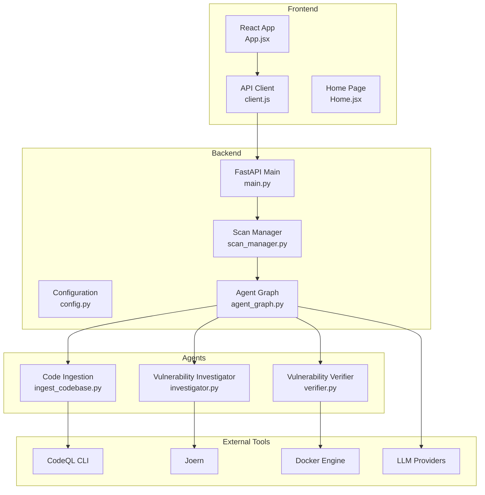
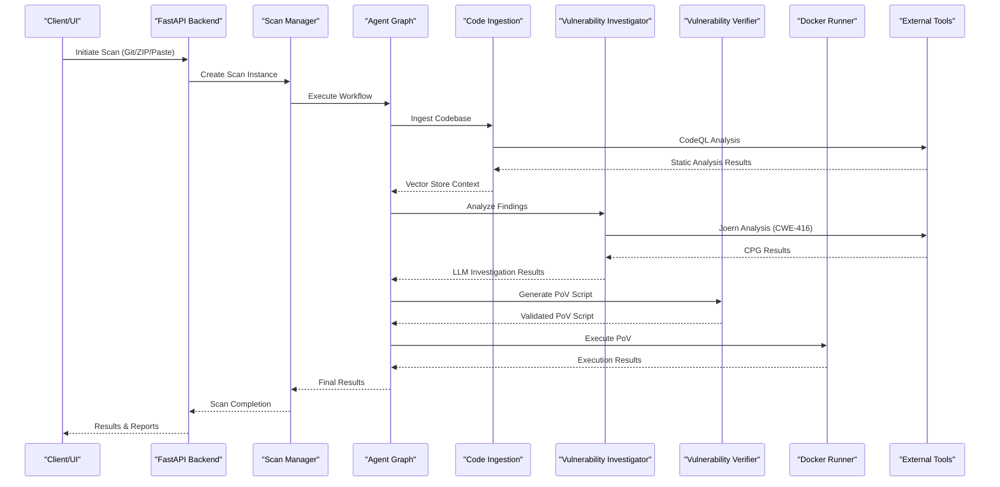
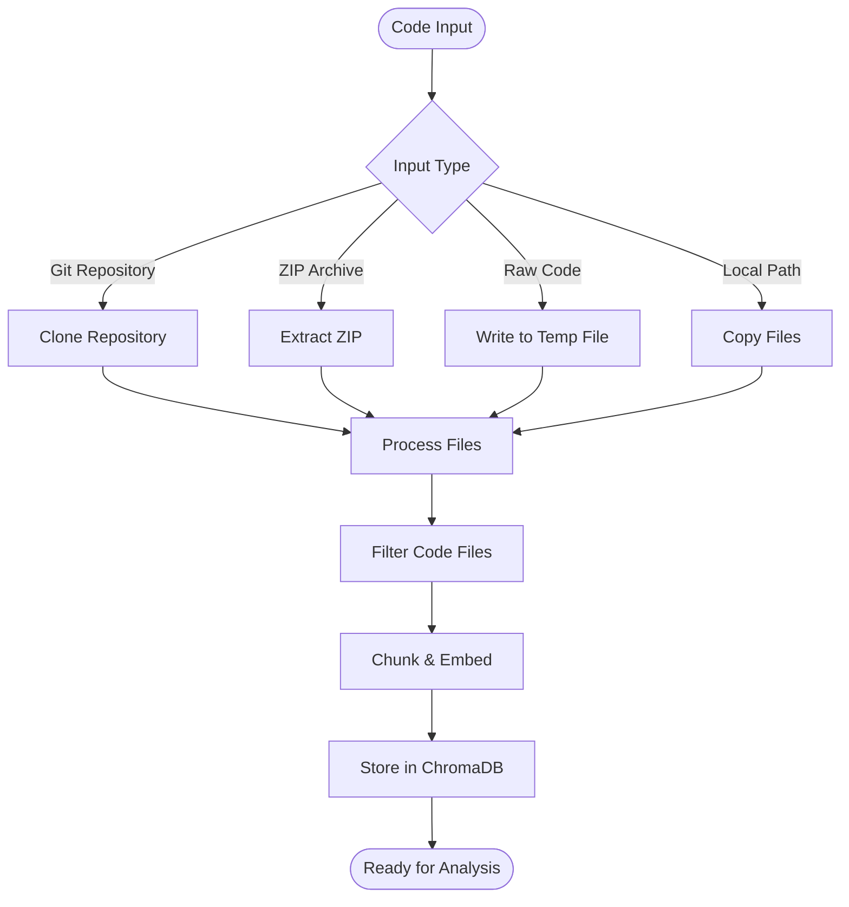
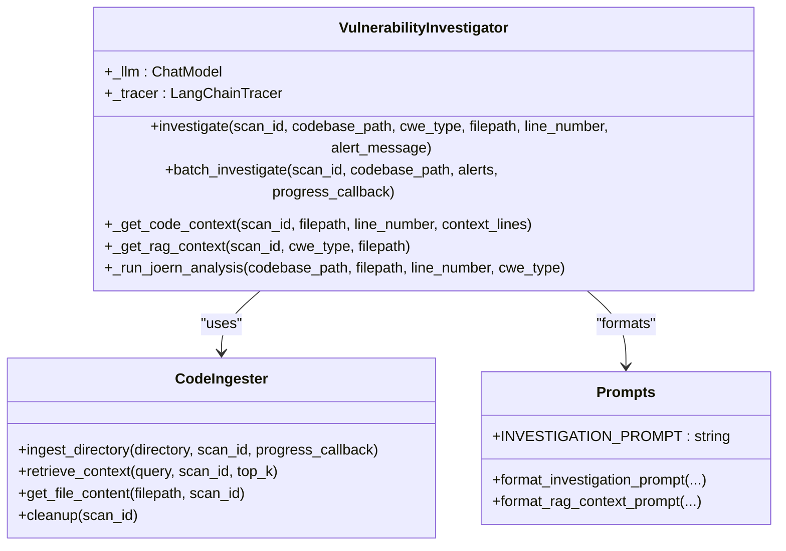
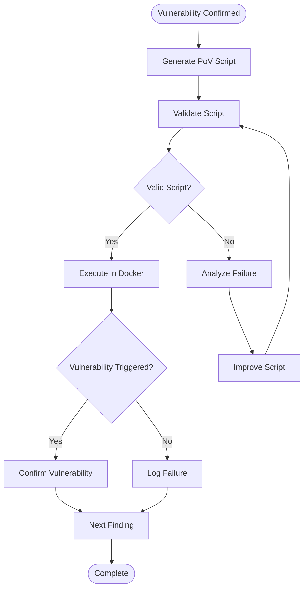
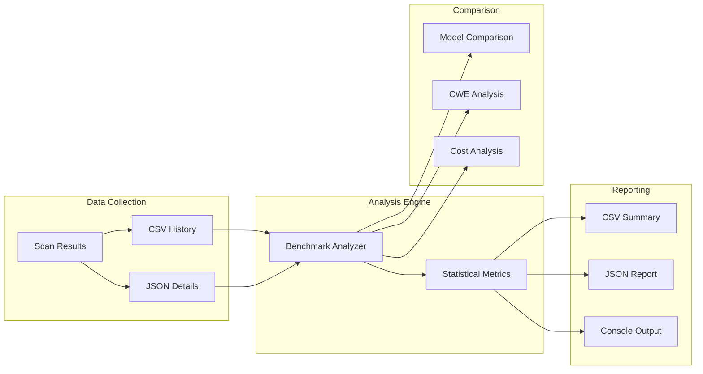
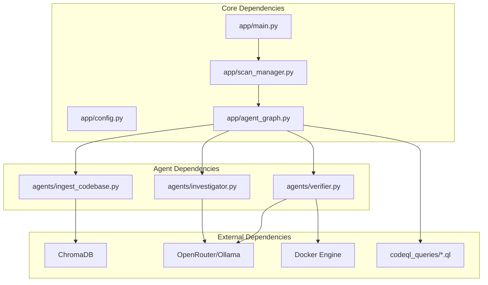

# Project Overview

<cite>
**Referenced Files in This Document**
- [README.md](file://autopov/README.md)
- [main.py](file://autopov/app/main.py)
- [config.py](file://autopov/app/config.py)
- [prompts.py](file://autopov/prompts.py)
- [analyse.py](file://autopov/analyse.py)
- [agent_graph.py](file://autopov/app/agent_graph.py)
- [scan_manager.py](file://autopov/app/scan_manager.py)
- [ingest_codebase.py](file://autopov/agents/ingest_codebase.py)
- [investigator.py](file://autopov/agents/investigator.py)
- [verifier.py](file://autopov/agents/verifier.py)
- [BufferOverflow.ql](file://autopov/codeql_queries/BufferOverflow.ql)
- [client.js](file://autopov/frontend/src/api/client.js)
- [App.jsx](file://autopov/frontend/src/App.jsx)
- [Home.jsx](file://autopov/frontend/src/pages/Home.jsx)
- [autopov.py](file://autopov/cli/autopov.py)
</cite>

## Table of Contents
1. [Introduction](#introduction)
2. [Project Structure](#project-structure)
3. [Core Components](#core-components)
4. [Architecture Overview](#architecture-overview)
5. [Detailed Component Analysis](#detailed-component-analysis)
6. [Dependency Analysis](#dependency-analysis)
7. [Performance Considerations](#performance-considerations)
8. [Troubleshooting Guide](#troubleshooting-guide)
9. [Conclusion](#conclusion)

## Introduction
AutoPoV is an autonomous proof-of-vulnerability (PoV) framework designed as a hybrid agentic system that combines static analysis (CodeQL, Joern) with AI-powered reasoning (LLMs via LangGraph) to benchmark vulnerability detection in industrial codebases. The system supports multi-source code ingestion, AI-driven vulnerability investigation, automated PoV script generation and execution, comprehensive reporting, and comparative benchmarking across multiple LLMs and CWE categories.

Target audience:
- Security researchers investigating novel vulnerability classes and detection methodologies
- Developers integrating automated security analysis into CI/CD pipelines
- Security analysts evaluating and comparing LLM-based vulnerability detection tools
- Academics conducting benchmarking studies on AI-assisted security analysis

Primary use cases:
- Automated discovery and verification of buffer overflows, SQL injection, use-after-free, and integer overflow vulnerabilities
- Generation of executable PoVs to confirm exploitability
- Comparative benchmarking of LLM models on standardized vulnerability detection tasks
- Real-time monitoring and reporting of security posture across codebases

## Project Structure
The project follows a modular full-stack architecture with clear separation between backend APIs, frontend UI, agent-based workflows, and external tool integrations.

**Diagram sources**
- [main.py](file://autopov/app/main.py#L102-L118)
- [config.py](file://autopov/app/config.py#L13-L210)
- [agent_graph.py](file://autopov/app/agent_graph.py#L84-L135)
- [ingest_codebase.py](file://autopov/agents/ingest_codebase.py#L41-L407)
- [investigator.py](file://autopov/agents/investigator.py#L37-L413)
- [verifier.py](file://autopov/agents/verifier.py#L40-L401)

**Section sources**
- [README.md](file://autopov/README.md#L17-L35)
- [main.py](file://autopov/app/main.py#L102-L118)
- [config.py](file://autopov/app/config.py#L13-L210)

## Core Components
The framework consists of several interconnected components working together to deliver autonomous vulnerability analysis:

### Backend API Layer
The FastAPI application serves as the central coordination point, providing REST endpoints for scan initiation, status monitoring, results retrieval, and administrative functions. It manages authentication, request validation, and orchestrates the underlying agent graph.

### Agent Graph Workflow
LangGraph-based workflow that coordinates the entire vulnerability detection pipeline, including code ingestion, static analysis, AI investigation, PoV generation, validation, and execution.

### Agent Components
- **Code Ingester**: Handles codebase ingestion, chunking, embedding, and ChromaDB storage for RAG
- **Vulnerability Investigator**: Uses LLMs with RAG to analyze potential vulnerabilities
- **Vulnerability Verifier**: Generates and validates PoV scripts using LLMs

### External Tool Integrations
- **CodeQL**: Static analysis for buffer overflows, SQL injection, use-after-free, and integer overflow
- **Joern**: Advanced CPG analysis for memory safety vulnerabilities
- **Docker**: Secure execution environment for PoV scripts
- **LLM Providers**: OpenRouter (OpenAI, Anthropic) and Ollama (local) support

**Section sources**
- [main.py](file://autopov/app/main.py#L174-L344)
- [agent_graph.py](file://autopov/app/agent_graph.py#L78-L135)
- [ingest_codebase.py](file://autopov/agents/ingest_codebase.py#L41-L116)
- [investigator.py](file://autopov/agents/investigator.py#L37-L88)
- [verifier.py](file://autopov/agents/verifier.py#L40-L78)

## Architecture Overview
The system implements a hybrid agentic architecture that seamlessly integrates static analysis with AI reasoning:

**Diagram sources**
- [main.py](file://autopov/app/main.py#L174-L344)
- [agent_graph.py](file://autopov/app/agent_graph.py#L136-L434)
- [investigator.py](file://autopov/agents/investigator.py#L254-L366)
- [verifier.py](file://autopov/agents/verifier.py#L79-L150)

The architecture emphasizes:
- **Modular Design**: Clear separation between ingestion, analysis, and verification stages
- **Tool Integration**: Seamless coordination between static analysis and AI reasoning
- **Scalability**: Thread pool execution and asynchronous processing
- **Safety**: Containerized execution for PoV scripts with resource limits

## Detailed Component Analysis

### Multi-Source Code Ingestion
The system supports four distinct input methods through unified ingestion logic:

**Diagram sources**
- [main.py](file://autopov/app/main.py#L175-L314)
- [ingest_codebase.py](file://autopov/agents/ingest_codebase.py#L201-L308)

The ingestion pipeline handles:
- File type filtering (.py, .js, .c, .cpp, .java, etc.)
- Binary file detection and skipping
- Recursive directory traversal
- Chunk size optimization (4000 chars with 200 char overlap)
- Vector store persistence with ChromaDB

**Section sources**
- [main.py](file://autopov/app/main.py#L175-L314)
- [ingest_codebase.py](file://autopov/agents/ingest_codebase.py#L122-L200)

### AI-Powered Vulnerability Investigation
The investigator agent combines LLM reasoning with RAG context retrieval:

**Diagram sources**
- [investigator.py](file://autopov/agents/investigator.py#L37-L413)
- [ingest_codebase.py](file://autopov/agents/ingest_codebase.py#L41-L116)
- [prompts.py](file://autopov/prompts.py#L7-L44)

The investigation process includes:
- Context-aware vulnerability analysis using LLMs
- RAG-enhanced code context retrieval
- CWE-specific validation criteria
- Confidence scoring and impact assessment
- Joern integration for memory safety analysis

**Section sources**
- [investigator.py](file://autopov/agents/investigator.py#L254-L366)
- [prompts.py](file://autopov/prompts.py#L245-L262)

### Proof-of-Vulnerability Generation and Execution
The verifier agent creates and validates executable PoV scripts:

**Diagram sources**
- [verifier.py](file://autopov/agents/verifier.py#L79-L150)
- [agent_graph.py](file://autopov/app/agent_graph.py#L403-L434)

PoV generation features:
- LLM-guided script creation with CWE-specific patterns
- Automatic validation against Python standard library constraints
- Syntax checking and logical correctness verification
- Docker-based execution with resource isolation
- Retry mechanism with failure analysis

**Section sources**
- [verifier.py](file://autopov/agents/verifier.py#L151-L331)
- [agent_graph.py](file://autopov/app/agent_graph.py#L327-L434)

### Benchmarking and Reporting
The framework provides comprehensive benchmarking capabilities:

**Diagram sources**
- [analyse.py](file://autopov/analyse.py#L39-L306)
- [scan_manager.py](file://autopov/app/scan_manager.py#L201-L236)

Benchmarking features:
- Detection rate calculation (confirmed vs total)
- False positive rate analysis
- Cost-per-confirmation metrics
- Multi-model performance comparison
- Historical trend tracking

**Section sources**
- [analyse.py](file://autopov/analyse.py#L72-L99)
- [analyse.py](file://autopov/analyse.py#L216-L248)

## Dependency Analysis
The system exhibits clean architectural boundaries with minimal coupling between major components:

**Diagram sources**
- [config.py](file://autopov/app/config.py#L13-L210)
- [main.py](file://autopov/app/main.py#L19-L26)
- [agent_graph.py](file://autopov/app/agent_graph.py#L22-L27)

Key dependency characteristics:
- **Configuration-driven**: All external tool availability checked at runtime
- **Plugin-friendly**: New CWE queries can be added without code changes
- **Environment-aware**: Docker, CodeQL, and Joern availability validated
- **LLM abstraction**: Online (OpenRouter) and offline (Ollama) modes supported

**Section sources**
- [config.py](file://autopov/app/config.py#L117-L172)
- [agent_graph.py](file://autopov/app/agent_graph.py#L163-L191)

## Performance Considerations
The framework implements several optimization strategies:

### Resource Management
- **Vector Store Batching**: ChromaDB operations use 100-document batches for efficient storage
- **Thread Pool Execution**: Asynchronous scan execution prevents blocking
- **Memory Limits**: Docker containers configured with 512MB memory and CPU constraints
- **Timeout Controls**: 60-second execution timeouts prevent resource exhaustion

### Cost Optimization
- **Conditional Tool Usage**: CodeQL fallback when static analysis unavailable
- **Retry Limits**: Configurable maximum retry attempts (default: 2)
- **Cost Tracking**: Real-time USD cost estimation for online LLM usage
- **Model Selection**: Support for both expensive (GPT-4o) and cost-effective (Mixtral) models

### Scalability Features
- **Asynchronous Processing**: Non-blocking scan execution
- **Progress Streaming**: Real-time status updates via Server-Sent Events
- **Batch Operations**: Efficient processing of multiple findings
- **Cleanup Mechanisms**: Automatic resource cleanup after scan completion

**Section sources**
- [ingest_codebase.py](file://autopov/agents/ingest_codebase.py#L290-L307)
- [config.py](file://autopov/app/config.py#L78-L87)
- [agent_graph.py](file://autopov/app/agent_graph.py#L521-L531)

## Troubleshooting Guide

### Common Issues and Solutions

**Docker-related Problems**
- **Issue**: Docker not available or not running
- **Solution**: Verify Docker installation and service status
- **Prevention**: Check Docker availability in health endpoint

**LLM Provider Issues**
- **Issue**: API key configuration errors
- **Solution**: Verify OpenRouter/Ollama credentials in environment
- **Prevention**: Use admin key management endpoints

**Static Analysis Failures**
- **Issue**: CodeQL/Joern not found
- **Solution**: Install required tools or use LLM-only mode
- **Prevention**: Health check endpoint reports tool availability

**Performance Issues**
- **Issue**: Slow scan execution
- **Solution**: Optimize chunk sizes, reduce CWE scope, or use offline models
- **Prevention**: Monitor system resources and adjust configurations

**Section sources**
- [main.py](file://autopov/app/main.py#L161-L172)
- [config.py](file://autopov/app/config.py#L123-L172)

## Conclusion
AutoPoV represents a sophisticated hybrid approach to autonomous vulnerability analysis, successfully combining the precision of static analysis tools with the contextual reasoning capabilities of modern LLMs. The framework's modular architecture, comprehensive benchmarking capabilities, and robust safety mechanisms make it suitable for both research and production environments.

Key strengths:
- **Hybrid Intelligence**: Effective combination of static analysis and AI reasoning
- **Comprehensive Coverage**: Support for multiple CWE categories and input sources
- **Benchmark-First Design**: Built-in comparison and evaluation capabilities
- **Production Ready**: Containerized execution, cost controls, and monitoring
- **Extensible Architecture**: Easy addition of new CWE queries and LLM providers

The framework provides significant value for security researchers seeking to understand AI-assisted vulnerability detection, developers integrating automated security into development workflows, and organizations requiring standardized vulnerability benchmarking capabilities.